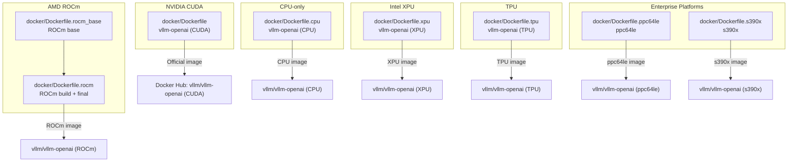
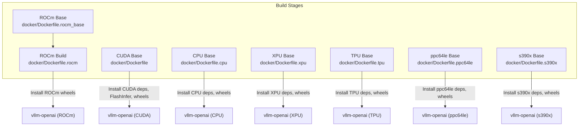
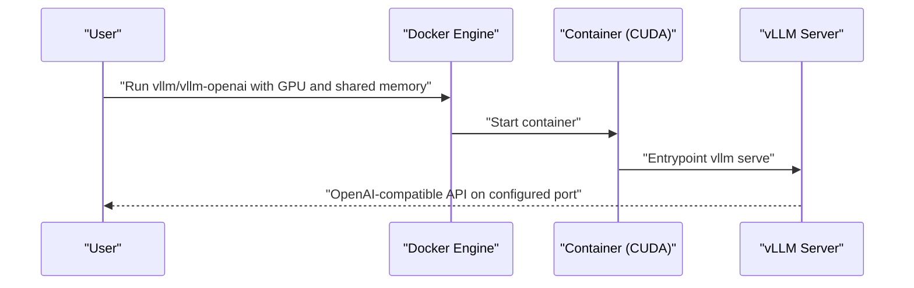
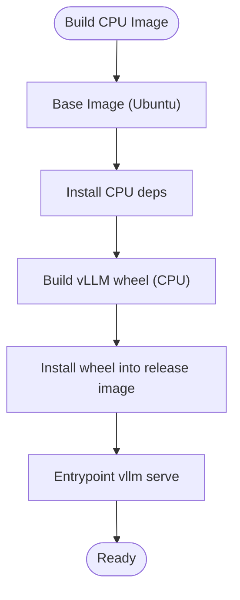
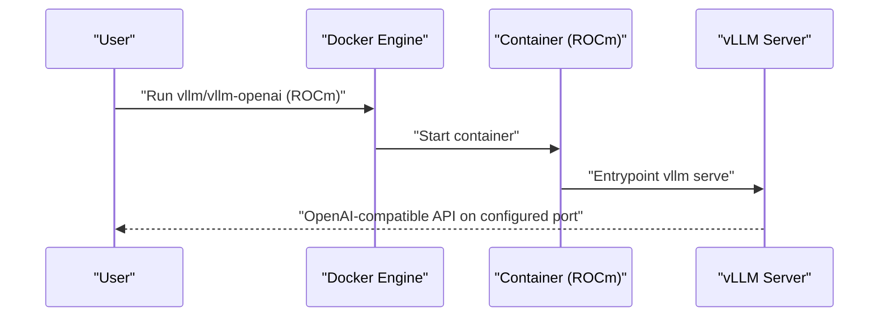
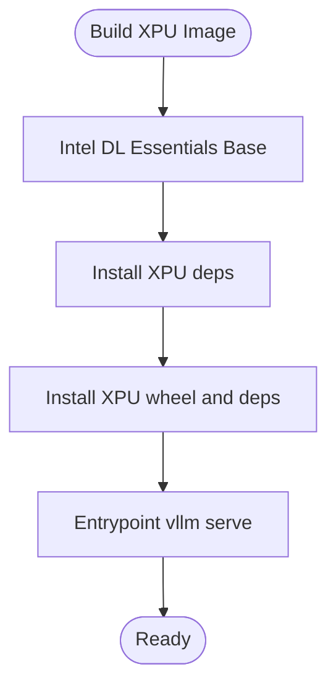
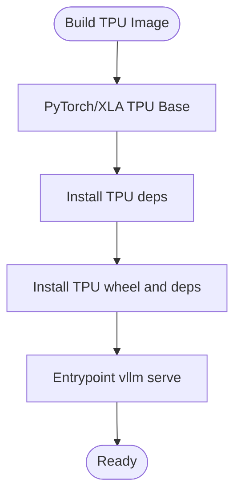
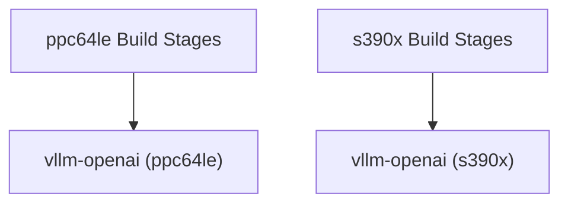
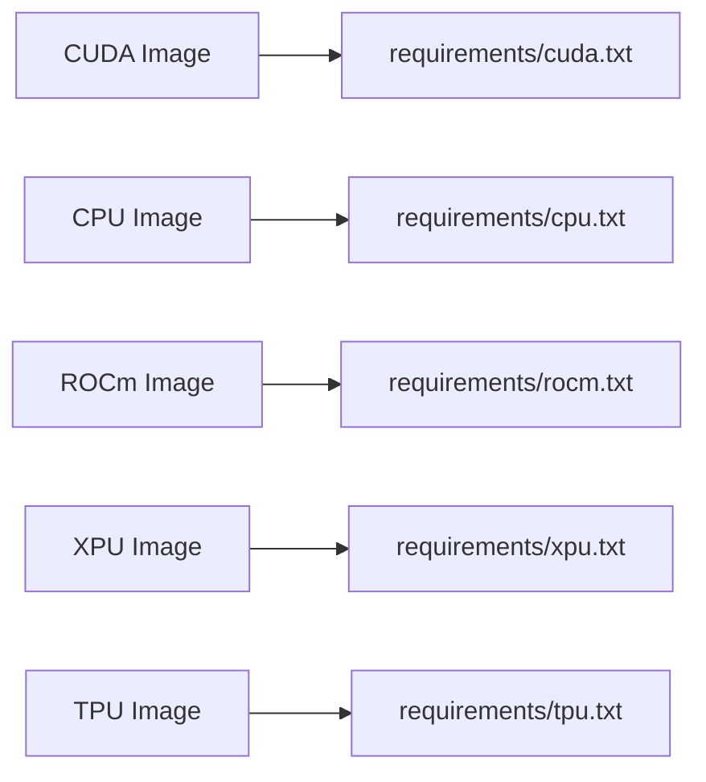

# Official Docker Images

<cite>
**Referenced Files in This Document**
- [Dockerfile](file://docker/Dockerfile)
- [Dockerfile.cpu](file://docker/Dockerfile.cpu)
- [Dockerfile.rocm](file://docker/Dockerfile.rocm)
- [Dockerfile.xpu](file://docker/Dockerfile.xpu)
- [Dockerfile.ppc64le](file://docker/Dockerfile.ppc64le)
- [Dockerfile.s390x](file://docker/Dockerfile.s390x)
- [Dockerfile.tpu](file://docker/Dockerfile.tpu)
- [Dockerfile.rocm_base](file://docker/Dockerfile.rocm_base)
- [docker.md](file://docs/deployment/docker.md)
- [env_vars.md](file://docs/configuration/env_vars.md)
- [envs.py](file://vllm/envs.py)
- [cuda.txt](file://requirements/cuda.txt)
- [cpu.txt](file://requirements/cpu.txt)
- [rocm.txt](file://requirements/rocm.txt)
- [xpu.txt](file://requirements/xpu.txt)
- [tpu.txt](file://requirements/tpu.txt)
</cite>

## Table of Contents
1. [Introduction](#introduction)
2. [Project Structure](#project-structure)
3. [Core Components](#core-components)
4. [Architecture Overview](#architecture-overview)
5. [Detailed Component Analysis](#detailed-component-analysis)
6. [Dependency Analysis](#dependency-analysis)
7. [Performance Considerations](#performance-considerations)
8. [Troubleshooting Guide](#troubleshooting-guide)
9. [Conclusion](#conclusion)
10. [Appendices](#appendices)

## Introduction
This document explains how to use the official vLLM Docker images for deployment and development. It covers the official vLLM Docker images available on Docker Hub, including the vllm/vllm-openai variants for different hardware backends (NVIDIA CUDA, AMD ROCm, Intel XPU, CPU-only). It also documents the image tagging strategy, versioning scheme, compatibility matrices, image selection criteria, environment variable configuration, volume mounting patterns, runtime requirements, security and supply chain considerations, and platform-specific deployment for Arm64/aarch64 and cross-compilation setup.

## Project Structure
The repository provides multiple Dockerfiles tailored to different hardware backends and platforms:
- NVIDIA CUDA: primary multi-stage Dockerfile for CUDA-based deployments
- CPU-only: universal Dockerfile for x86_64 and Arm64
- AMD ROCm: base image and build flow for ROCm
- Intel XPU: Dockerfile for Intel XPU devices
- TPU: Dockerfile for TPU-based deployments
- IBM Power (ppc64le) and IBM Z (s390x): specialized Dockerfiles for enterprise platforms

**Diagram sources**
- [Dockerfile](file://docker/Dockerfile#L607-L640)
- [Dockerfile.cpu](file://docker/Dockerfile.cpu#L194-L204)
- [Dockerfile.rocm_base](file://docker/Dockerfile.rocm_base#L1-L165)
- [Dockerfile.rocm](file://docker/Dockerfile.rocm#L1-L148)
- [Dockerfile.xpu](file://docker/Dockerfile.xpu#L66-L87)
- [Dockerfile.tpu](file://docker/Dockerfile.tpu#L1-L37)
- [Dockerfile.ppc64le](file://docker/Dockerfile.ppc64le#L277-L349)
- [Dockerfile.s390x](file://docker/Dockerfile.s390x#L199-L267)

**Section sources**
- [Dockerfile](file://docker/Dockerfile#L607-L640)
- [Dockerfile.cpu](file://docker/Dockerfile.cpu#L1-L204)
- [Dockerfile.rocm_base](file://docker/Dockerfile.rocm_base#L1-L165)
- [Dockerfile.rocm](file://docker/Dockerfile.rocm#L1-L148)
- [Dockerfile.xpu](file://docker/Dockerfile.xpu#L1-L87)
- [Dockerfile.tpu](file://docker/Dockerfile.tpu#L1-L37)
- [Dockerfile.ppc64le](file://docker/Dockerfile.ppc64le#L1-L349)
- [Dockerfile.s390x](file://docker/Dockerfile.s390x#L1-L267)

## Core Components
- Official vLLM Docker image for OpenAI-compatible server: available as vllm/vllm-openai on Docker Hub. The documentation shows how to run it with GPU access, shared memory configuration, and model cache mounting.
- Backend-specific images:
  - CUDA: default vllm-openai image for NVIDIA GPUs
  - CPU-only: universal image for x86_64 and Arm64
  - ROCm: image for AMD GPUs
  - XPU: image for Intel XPU devices
  - TPU: image for TPU-based deployments
  - Enterprise platforms: ppc64le and s390x images for IBM Power and IBM Z

Key runtime flags and patterns:
- GPU access: NVIDIA runtime and device mapping for CUDA; ROCm base image for AMD; Intel XPU base image; TPU base image
- Shared memory: host IPC or explicit shared memory size for multi-process tensor-parallel inference
- Model cache mounting: persistent cache for Hugging Face and vLLM assets
- Optional dependencies: documented as not included by default; can be added via a custom image layered on top of the base image

**Section sources**
- [docker.md](file://docs/deployment/docker.md#L1-L153)
- [Dockerfile](file://docker/Dockerfile#L607-L640)
- [Dockerfile.cpu](file://docker/Dockerfile.cpu#L194-L204)
- [Dockerfile.rocm](file://docker/Dockerfile.rocm#L1-L148)
- [Dockerfile.xpu](file://docker/Dockerfile.xpu#L66-L87)
- [Dockerfile.tpu](file://docker/Dockerfile.tpu#L1-L37)
- [Dockerfile.ppc64le](file://docker/Dockerfile.ppc64le#L277-L349)
- [Dockerfile.s390x](file://docker/Dockerfile.s390x#L199-L267)

## Architecture Overview
The official vLLM Docker images are built from backend-specific Dockerfiles. The CUDA image uses a multi-stage build to precompile kernels and install PyTorch and vLLM, while CPU-only and enterprise images install CPU-targeted PyTorch and dependencies. ROCm, XPU, and TPU images use their respective base images and install backend-specific wheels and libraries.

**Diagram sources**
- [Dockerfile](file://docker/Dockerfile#L1-L200)
- [Dockerfile.cpu](file://docker/Dockerfile.cpu#L1-L193)
- [Dockerfile.rocm_base](file://docker/Dockerfile.rocm_base#L1-L165)
- [Dockerfile.rocm](file://docker/Dockerfile.rocm#L1-L148)
- [Dockerfile.xpu](file://docker/Dockerfile.xpu#L1-L87)
- [Dockerfile.tpu](file://docker/Dockerfile.tpu#L1-L37)
- [Dockerfile.ppc64le](file://docker/Dockerfile.ppc64le#L277-L349)
- [Dockerfile.s390x](file://docker/Dockerfile.s390x#L199-L267)

## Detailed Component Analysis

### NVIDIA CUDA Image (vllm/vllm-openai)
- Purpose: Official image for OpenAI-compatible server on NVIDIA GPUs
- Build highlights:
  - Multi-stage build with precompiled kernels and wheels
  - PyTorch and related packages pinned for stability
  - FlashInfer precompiled cache and JIT support
- Runtime highlights:
  - Entrypoint starts the OpenAI-compatible server
  - Requires GPU access and shared memory configuration
  - Model cache mounted from host for persistent downloads

**Diagram sources**
- [Dockerfile](file://docker/Dockerfile#L607-L640)
- [docker.md](file://docs/deployment/docker.md#L1-L153)

**Section sources**
- [Dockerfile](file://docker/Dockerfile#L1-L200)
- [Dockerfile](file://docker/Dockerfile#L440-L560)
- [Dockerfile](file://docker/Dockerfile#L607-L640)
- [cuda.txt](file://requirements/cuda.txt#L1-L14)
- [docker.md](file://docs/deployment/docker.md#L1-L153)

### CPU-only Image (vllm/vllm-openai)
- Purpose: Universal CPU image for x86_64 and Arm64
- Build highlights:
  - CPU-targeted PyTorch and dependencies
  - Optional CPU ISA tuning flags exposed as build args
  - Separate targets for dev, test, and release
- Runtime highlights:
  - Entrypoint starts the OpenAI-compatible server
  - Suitable for cloud instances and edge devices

**Diagram sources**
- [Dockerfile.cpu](file://docker/Dockerfile.cpu#L1-L193)
- [Dockerfile.cpu](file://docker/Dockerfile.cpu#L194-L204)
- [cpu.txt](file://requirements/cpu.txt#L1-L23)

**Section sources**
- [Dockerfile.cpu](file://docker/Dockerfile.cpu#L1-L204)
- [cpu.txt](file://requirements/cpu.txt#L1-L23)

### AMD ROCm Image (vllm/vllm-openai)
- Purpose: Image for AMD GPUs with ROCm
- Build highlights:
  - ROCm base image and build flow
  - Installs ROCm-specific wheels and libraries
  - Environment variables for ROCm visibility and performance
- Runtime highlights:
  - Uses ROCm base image and installs vLLM with ROCm wheels

**Diagram sources**
- [Dockerfile.rocm_base](file://docker/Dockerfile.rocm_base#L1-L165)
- [Dockerfile.rocm](file://docker/Dockerfile.rocm#L1-L148)
- [rocm.txt](file://requirements/rocm.txt#L1-L19)

**Section sources**
- [Dockerfile.rocm_base](file://docker/Dockerfile.rocm_base#L1-L165)
- [Dockerfile.rocm](file://docker/Dockerfile.rocm#L1-L148)
- [rocm.txt](file://requirements/rocm.txt#L1-L19)

### Intel XPU Image (vllm/vllm-openai)
- Purpose: Image for Intel XPU devices
- Build highlights:
  - Intel Deep Learning Essentials base image
  - Installs XPU-targeted PyTorch and IPEX
  - Additional environment variables for worker multiprocessing
- Runtime highlights:
  - Entrypoint starts the OpenAI-compatible server

**Diagram sources**
- [Dockerfile.xpu](file://docker/Dockerfile.xpu#L1-L87)
- [xpu.txt](file://requirements/xpu.txt#L1-L19)

**Section sources**
- [Dockerfile.xpu](file://docker/Dockerfile.xpu#L1-L87)
- [xpu.txt](file://requirements/xpu.txt#L1-L19)

### TPU Image (vllm/vllm-openai)
- Purpose: Image for TPU-based deployments
- Build highlights:
  - Nightly TPU base image from PyTorch/XLA
  - Installs TPU-specific dependencies and builds vLLM
- Runtime highlights:
  - Entrypoint starts the OpenAI-compatible server

**Diagram sources**
- [Dockerfile.tpu](file://docker/Dockerfile.tpu#L1-L37)
- [tpu.txt](file://requirements/tpu.txt#L1-L15)

**Section sources**
- [Dockerfile.tpu](file://docker/Dockerfile.tpu#L1-L37)
- [tpu.txt](file://requirements/tpu.txt#L1-L15)

### Enterprise Platform Images (ppc64le and s390x)
- Purpose: Images for IBM Power and IBM Z servers
- Build highlights:
  - Multi-stage builds with platform-specific compilers and libraries
  - CPU-targeted PyTorch and dependencies
- Runtime highlights:
  - Entrypoint starts the OpenAI-compatible server

**Diagram sources**
- [Dockerfile.ppc64le](file://docker/Dockerfile.ppc64le#L277-L349)
- [Dockerfile.s390x](file://docker/Dockerfile.s390x#L199-L267)

**Section sources**
- [Dockerfile.ppc64le](file://docker/Dockerfile.ppc64le#L1-L349)
- [Dockerfile.s390x](file://docker/Dockerfile.s390x#L1-L267)

## Dependency Analysis
- CUDA image dependencies:
  - PyTorch and related packages pinned for stability
  - FlashInfer precompiled cache and JIT support
- CPU-only image dependencies:
  - CPU-targeted PyTorch and platform-specific packages
- ROCm image dependencies:
  - ROCm-specific wheels and libraries
- XPU image dependencies:
  - XPU-targeted PyTorch and IPEX
- TPU image dependencies:
  - TPU-specific wheels and runtime libraries
- Enterprise platform images:
  - Platform-specific compilers and libraries for ppc64le and s390x

**Diagram sources**
- [cuda.txt](file://requirements/cuda.txt#L1-L14)
- [cpu.txt](file://requirements/cpu.txt#L1-L23)
- [rocm.txt](file://requirements/rocm.txt#L1-L19)
- [xpu.txt](file://requirements/xpu.txt#L1-L19)
- [tpu.txt](file://requirements/tpu.txt#L1-L15)

**Section sources**
- [cuda.txt](file://requirements/cuda.txt#L1-L14)
- [cpu.txt](file://requirements/cpu.txt#L1-L23)
- [rocm.txt](file://requirements/rocm.txt#L1-L19)
- [xpu.txt](file://requirements/xpu.txt#L1-L19)
- [tpu.txt](file://requirements/tpu.txt#L1-L15)

## Performance Considerations
- CUDA builds:
  - Precompiled kernels and wheels reduce cold-start latency
  - Torch CUDA arch list can be tuned for specific GPUs
- CPU builds:
  - Optional ISA flags for AVX512, BF16, VNNI, and AMX can be enabled via build args
- ROCm builds:
  - Environment variables for ROCm visibility and performance tuning
- XPU builds:
  - Worker multiprocessing method can be configured
- TPU builds:
  - Uses PyTorch/XLA TPU base image and installs TPU-specific dependencies

**Section sources**
- [Dockerfile](file://docker/Dockerfile#L130-L160)
- [Dockerfile.cpu](file://docker/Dockerfile.cpu#L82-L116)
- [Dockerfile.rocm_base](file://docker/Dockerfile.rocm_base#L15-L35)
- [Dockerfile.xpu](file://docker/Dockerfile.xpu#L57-L65)
- [Dockerfile.tpu](file://docker/Dockerfile.tpu#L25-L36)

## Troubleshooting Guide
- Shared memory and IPC:
  - Use host IPC or set shared memory size for multi-process tensor-parallel inference
- Optional dependencies:
  - Not included by default due to licensing; add via a custom image layered on the base image
- Version-specific notes:
  - Historical note for very early versions regarding NCCL library path and user permissions
- Environment variables:
  - Review vLLM environment variables for logging, attention backends, and device selection

**Section sources**
- [docker.md](file://docs/deployment/docker.md#L30-L153)
- [env_vars.md](file://docs/configuration/env_vars.md#L1-L13)
- [envs.py](file://vllm/envs.py#L448-L800)

## Conclusion
The official vLLM Docker images provide a streamlined path to deploy the OpenAI-compatible server across diverse hardware backends. Select the appropriate image based on your hardware (CUDA, ROCm, XPU, CPU-only, TPU) and platform (ppc64le, s390x). Configure runtime flags for GPU access, shared memory, and model caching, and tune environment variables for optimal performance. For specialized needs, build custom images layered on the official base images.

## Appendices

### Image Tagging Strategy and Versioning Scheme
- Official images are published under the vllm organization on Docker Hub with the vllm/vllm-openai naming convention.
- Tags correspond to releases and latest builds; consult Docker Hub for the latest available tags.
- The repository’s documentation demonstrates running the latest image and building custom images from source.

**Section sources**
- [docker.md](file://docs/deployment/docker.md#L1-L153)

### Compatibility Matrix (Overview)
- CUDA: NVIDIA GPUs with CUDA runtime
- ROCm: AMD GPUs with ROCm base image
- XPU: Intel XPU devices with Intel base image
- CPU-only: x86_64 and Arm64 with CPU-targeted PyTorch
- TPU: TPU-based deployments with PyTorch/XLA base image
- Enterprise platforms: ppc64le and s390x with platform-specific compilers and libraries

**Section sources**
- [Dockerfile](file://docker/Dockerfile#L607-L640)
- [Dockerfile.cpu](file://docker/Dockerfile.cpu#L1-L204)
- [Dockerfile.rocm_base](file://docker/Dockerfile.rocm_base#L1-L165)
- [Dockerfile.xpu](file://docker/Dockerfile.xpu#L1-L87)
- [Dockerfile.tpu](file://docker/Dockerfile.tpu#L1-L37)
- [Dockerfile.ppc64le](file://docker/Dockerfile.ppc64le#L277-L349)
- [Dockerfile.s390x](file://docker/Dockerfile.s390x#L199-L267)

### Image Selection Criteria
- Hardware requirements:
  - NVIDIA GPUs: choose CUDA image
  - AMD GPUs: choose ROCm image
  - Intel XPU: choose XPU image
  - CPU-only: choose CPU-only image
  - TPU: choose TPU image
  - IBM Power/s390x: choose platform-specific images
- Deployment scenarios:
  - Containerized environments: use official images with GPU drivers and shared memory configured
  - Cross-compilation: use buildx with platform flags for Arm64/aarch64

**Section sources**
- [docker.md](file://docs/deployment/docker.md#L83-L153)

### Environment Variable Configuration
- Device selection:
  - VLLM_TARGET_DEVICE controls backend selection (cuda, rocm, cpu, xpu, tpu)
- CUDA-specific:
  - VLLM_MAIN_CUDA_VERSION and related build-time variables
- ROCm-specific:
  - Visibility and performance tuning environment variables
- XPU-specific:
  - Worker multiprocessing method
- General runtime:
  - Logging, attention backends, timeouts, and cache roots

**Section sources**
- [envs.py](file://vllm/envs.py#L448-L800)

### Volume Mounting Patterns
- Model cache:
  - Mount a host directory to the user cache path to persist model downloads
- Optional:
  - Add optional dependencies via a custom image layered on the base image

**Section sources**
- [docker.md](file://docs/deployment/docker.md#L1-L153)

### Runtime Requirements
- GPU drivers:
  - NVIDIA runtime and device mapping for CUDA
  - ROCm base image for AMD
  - Intel XPU base image for XPU
  - TPU base image for TPU
- Shared memory:
  - Host IPC or explicit shared memory size for multi-process tensor-parallel inference
- Network configuration:
  - Expose the API server port and configure host networking as needed

**Section sources**
- [docker.md](file://docs/deployment/docker.md#L1-L153)
- [Dockerfile](file://docker/Dockerfile#L424-L465)
- [Dockerfile.rocm_base](file://docker/Dockerfile.rocm_base#L15-L35)
- [Dockerfile.xpu](file://docker/Dockerfile.xpu#L28-L45)
- [Dockerfile.tpu](file://docker/Dockerfile.tpu#L1-L20)

### Security Scanning and Supply Chain Considerations
- Optional dependencies are not included by default to avoid licensing issues; add them via a custom image layered on the base image
- Build customization:
  - Use build args to customize base images, indexes, and mirrors
  - Private registries and mirrors can be configured via build args

**Section sources**
- [docker.md](file://docs/deployment/docker.md#L30-L153)
- [Dockerfile](file://docker/Dockerfile#L10-L72)

### Platform-Specific Deployment and Cross-Compilation
- Arm64/aarch64:
  - Use buildx with platform flag
  - Tune build args for CPU ISA and parallel jobs
- Cross-compilation:
  - Register QEMU user static handlers for emulation on non-ARM hosts

**Section sources**
- [docker.md](file://docs/deployment/docker.md#L83-L153)
- [Dockerfile.cpu](file://docker/Dockerfile.cpu#L1-L21)