# Runtime Configuration

<cite>
**Referenced Files in This Document**
- [Dockerfile](file://docker/Dockerfile)
- [docker.md](file://docs/deployment/docker.md)
- [env_vars.md](file://docs/configuration/env_vars.md)
- [envs.py](file://vllm/envs.py)
- [k8s.md](file://docs/deployment/k8s.md)
- [serve_args.md](file://docs/configuration/serve_args.md)
- [engine_args.md](file://docs/configuration/engine_args.md)
- [Dockerfile.rocm](file://docker/Dockerfile.rocm)
- [Dockerfile.cpu](file://docker/Dockerfile.cpu)
- [helm.md](file://docs/deployment/frameworks/helm.md)
- [kuberay.md](file://docs/deployment/integrations/kuberay.md)
- [cpu.md](file://docs/getting_started/installation/cpu.md)
</cite>

## Table of Contents
1. [Introduction](#introduction)
2. [Project Structure](#project-structure)
3. [Core Components](#core-components)
4. [Architecture Overview](#architecture-overview)
5. [Detailed Component Analysis](#detailed-component-analysis)
6. [Dependency Analysis](#dependency-analysis)
7. [Performance Considerations](#performance-considerations)
8. [Troubleshooting Guide](#troubleshooting-guide)
9. [Conclusion](#conclusion)
10. [Appendices](#appendices)

## Introduction
This document provides production-grade runtime configuration guidance for running vLLM containers. It covers GPU access via nvidia-container-toolkit, device mapping, and runtime privileges; environment variables for model loading, memory management, and performance tuning; volume mounting strategies for caches and persistent data; networking configuration including port binding and service discovery; security configurations such as user namespaces and capability restrictions; resource limits for CPU, memory, and GPU; orchestration with Kubernetes and Helm; and health checks, restart policies, and monitoring integration. It also includes deployment scenario guidance for single-node, multi-GPU, and distributed setups.

## Project Structure
The repository provides:
- Official Docker images and build targets for CUDA and ROCm
- Kubernetes deployment guidance and examples
- Helm chart values and probes
- Environment variables and configuration surfaces exposed by vLLM
- CPU-only Dockerfile for cross-platform CPU serving

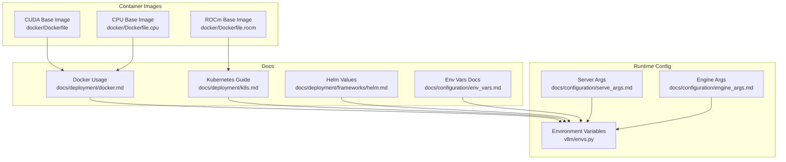

**Diagram sources**
- [Dockerfile](file://docker/Dockerfile#L1-L640)
- [docker.md](file://docs/deployment/docker.md#L1-L153)
- [env_vars.md](file://docs/configuration/env_vars.md#L1-L13)
- [envs.py](file://vllm/envs.py#L448-L800)
- [k8s.md](file://docs/deployment/k8s.md#L1-L398)
- [serve_args.md](file://docs/configuration/serve_args.md#L1-L36)
- [engine_args.md](file://docs/configuration/engine_args.md#L1-L23)
- [Dockerfile.rocm](file://docker/Dockerfile.rocm#L1-L148)
- [Dockerfile.cpu](file://docker/Dockerfile.cpu#L1-L204)
- [helm.md](file://docs/deployment/frameworks/helm.md#L1-L140)

**Section sources**
- [Dockerfile](file://docker/Dockerfile#L1-L640)
- [docker.md](file://docs/deployment/docker.md#L1-L153)
- [env_vars.md](file://docs/configuration/env_vars.md#L1-L13)
- [envs.py](file://vllm/envs.py#L448-L800)
- [k8s.md](file://docs/deployment/k8s.md#L1-L398)
- [serve_args.md](file://docs/configuration/serve_args.md#L1-L36)
- [engine_args.md](file://docs/configuration/engine_args.md#L1-L23)
- [Dockerfile.rocm](file://docker/Dockerfile.rocm#L1-L148)
- [Dockerfile.cpu](file://docker/Dockerfile.cpu#L1-L204)
- [helm.md](file://docs/deployment/frameworks/helm.md#L1-L140)

## Core Components
- Container images: CUDA, ROCm, and CPU variants define base OS, CUDA/ROCm toolchains, and runtime dependencies.
- Runtime entrypoint: The vLLM OpenAI-compatible server is launched via the container entrypoint.
- Environment variables: vLLM exposes a comprehensive set of environment variables for configuration, including cache roots, logging, attention backends, and platform-specific toggles.
- Orchestration: Kubernetes manifests and Helm values provide GPU scheduling, probes, and resource limits.

Key runtime configuration surfaces:
- GPU access and device mapping via Docker/Podman and Kubernetes device plugins
- Shared memory and IPC for tensor parallel inference
- Model cache and configuration directories
- Networking and service exposure
- Security and capability constraints
- Resource limits and autoscaling

**Section sources**
- [Dockerfile](file://docker/Dockerfile#L636-L640)
- [envs.py](file://vllm/envs.py#L502-L541)
- [envs.py](file://vllm/envs.py#L635-L662)
- [k8s.md](file://docs/deployment/k8s.md#L130-L329)
- [helm.md](file://docs/deployment/frameworks/helm.md#L70-L110)

## Architecture Overview
The production runtime architecture centers on:
- Containerized vLLM server with GPU acceleration
- Persistent model cache mounted from PVC or hostPath
- Kubernetes Deployment with GPU scheduling and liveness/readiness probes
- Optional Helm chart for declarative configuration and autoscaling
- Service discovery via Kubernetes Service and/or sidecar/service mesh

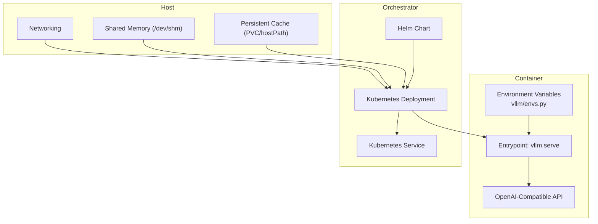

**Diagram sources**
- [Dockerfile](file://docker/Dockerfile#L636-L640)
- [envs.py](file://vllm/envs.py#L502-L541)
- [k8s.md](file://docs/deployment/k8s.md#L130-L329)
- [helm.md](file://docs/deployment/frameworks/helm.md#L70-L110)

## Detailed Component Analysis

### GPU Access and Device Mapping
- Docker/Podman: Use nvidia-container-toolkit runtime and device mapping for GPU access. The official image entrypoint runs the vLLM server.
- Kubernetes: Schedule with GPU resource requests/limits using vendor-specific resource names. Ensure the device plugin is installed and configured.

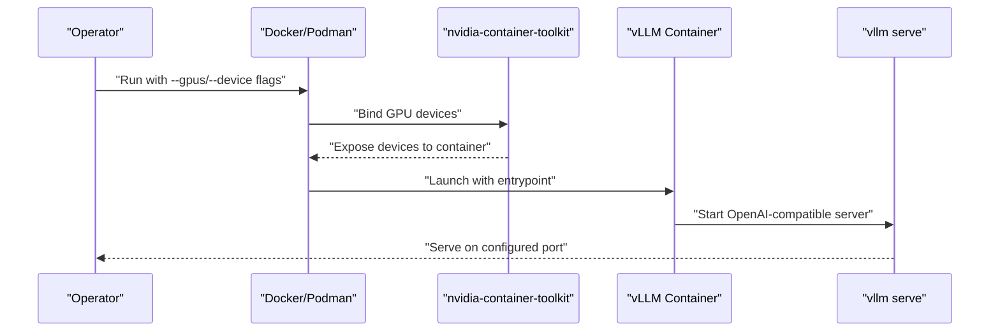

**Diagram sources**
- [docker.md](file://docs/deployment/docker.md#L8-L16)
- [Dockerfile](file://docker/Dockerfile#L636-L640)
- [k8s.md](file://docs/deployment/k8s.md#L130-L250)

**Section sources**
- [docker.md](file://docs/deployment/docker.md#L8-L16)
- [k8s.md](file://docs/deployment/k8s.md#L130-L250)

### Environment Variables for Model Loading and Performance Tuning
Important categories:
- Cache roots: VLLM_CACHE_ROOT and VLLM_CONFIG_ROOT control cache and config directories
- Logging and stats: VLLM_LOGGING_* and VLLM_LOG_STATS_INTERVAL
- Attention and kernels: VLLM_ATTENTION_BACKEND, VLLM_USE_FLASHINFER_SAMPLER, VLLM_FLASH_ATTN_VERSION
- Distributed and communication: VLLM_HOST_IP, VLLM_PORT, VLLM_ENGINE_ITERATION_TIMEOUT_S
- Platform specifics: VLLM_TARGET_DEVICE, VLLM_MAIN_CUDA_VERSION (CUDA), ROCm-specific envs in ROCm image

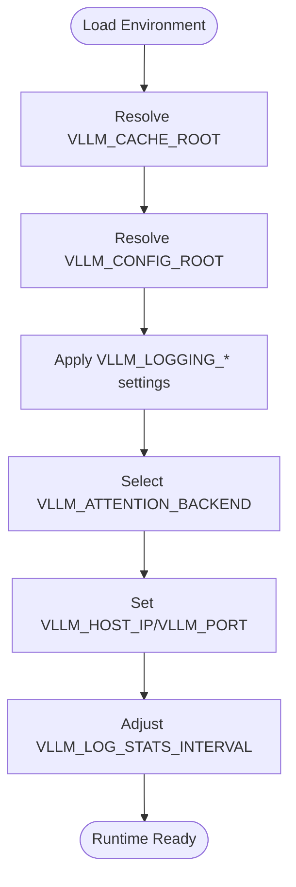

**Diagram sources**
- [envs.py](file://vllm/envs.py#L502-L541)
- [envs.py](file://vllm/envs.py#L635-L662)
- [envs.py](file://vllm/envs.py#L662-L720)
- [envs.py](file://vllm/envs.py#L720-L780)

**Section sources**
- [env_vars.md](file://docs/configuration/env_vars.md#L1-L13)
- [envs.py](file://vllm/envs.py#L502-L541)
- [envs.py](file://vllm/envs.py#L635-L662)
- [envs.py](file://vllm/envs.py#L662-L720)
- [envs.py](file://vllm/envs.py#L720-L780)

### Volume Mounting Strategies
- Model cache: Mount a persistent volume (PVC or hostPath) to the cache directory used by vLLM to avoid repeated downloads.
- Configuration: Mount configuration files into the config root directory if needed.
- Shared memory: Use host IPC or an emptyDir-backed /dev/shm for tensor parallel inference.

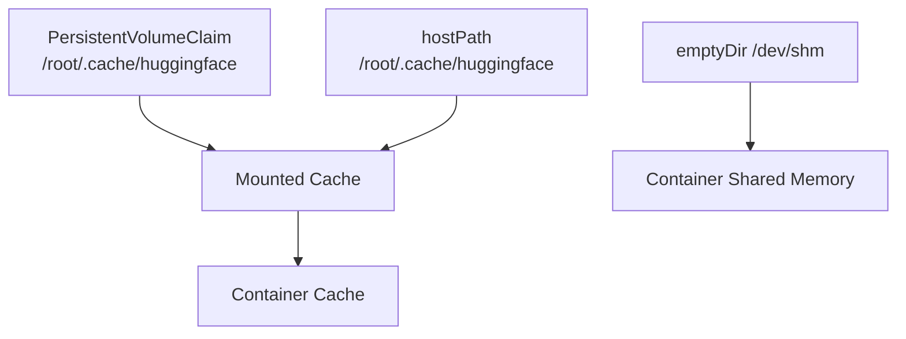

**Diagram sources**
- [k8s.md](file://docs/deployment/k8s.md#L130-L250)
- [docker.md](file://docs/deployment/docker.md#L30-L39)

**Section sources**
- [k8s.md](file://docs/deployment/k8s.md#L130-L250)
- [docker.md](file://docs/deployment/docker.md#L30-L39)

### Networking Configuration
- Port binding: Expose the API server port (default 8000) and ensure it is reachable via Kubernetes Service or host port mapping.
- Host networking: Not required for typical GPU deployments; however, it can be used in specific networking setups.
- Service discovery: Use Kubernetes Service selectors and labels to integrate with ingress or mesh.

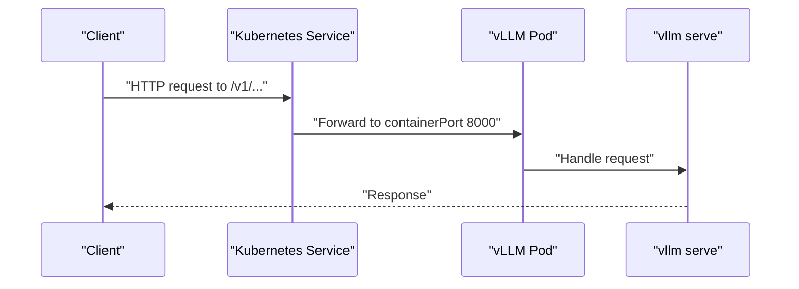

**Diagram sources**
- [k8s.md](file://docs/deployment/k8s.md#L332-L383)

**Section sources**
- [k8s.md](file://docs/deployment/k8s.md#L332-L383)

### Security Configurations
- Capabilities and seccomp: Add SYS_NICE and unconfined seccomp to allow NUMA-related syscalls in Docker. In Kubernetes, use securityContext with seccompProfile and capabilities.
- Read-only filesystem: Mount cache/config directories as writable; keep root filesystem read-only if desired via container securityContext.
- User namespaces: Run as non-root when possible; ensure cache/config directories are writable by the chosen user.

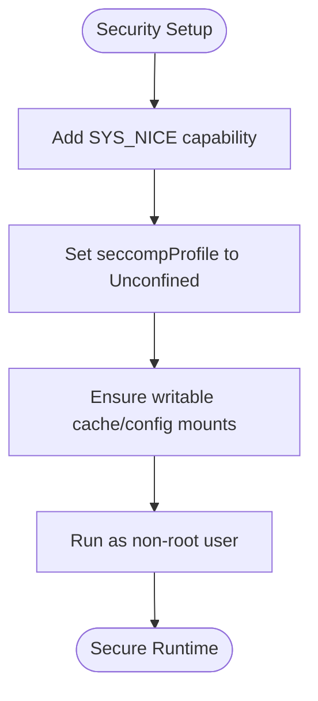

**Diagram sources**
- [cpu.md](file://docs/getting_started/installation/cpu.md#L267-L298)
- [k8s.md](file://docs/deployment/k8s.md#L253-L329)

**Section sources**
- [cpu.md](file://docs/getting_started/installation/cpu.md#L267-L298)
- [k8s.md](file://docs/deployment/k8s.md#L253-L329)

### Resource Limits and GPU Memory Allocation
- CPU/memory: Set requests/limits for CPU and memory in Kubernetes; ensure sufficient headroom for model and tokenizer overhead.
- GPU: Use vendor-specific resource names (e.g., nvidia.com/gpu) with appropriate limits and requests.
- Shared memory: Allocate sufficient size for /dev/shm to support tensor parallelism.

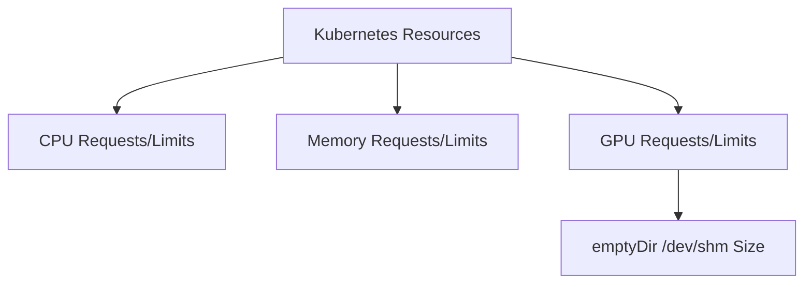

**Diagram sources**
- [helm.md](file://docs/deployment/frameworks/helm.md#L96-L107)
- [k8s.md](file://docs/deployment/k8s.md#L223-L249)

**Section sources**
- [helm.md](file://docs/deployment/frameworks/helm.md#L96-L107)
- [k8s.md](file://docs/deployment/k8s.md#L223-L249)

### Container Orchestration with Kubernetes and Helm
- Kubernetes: Use Deployment with GPU scheduling, liveness/readiness probes, and a Service for exposure.
- Helm: Leverage chart values for autoscaling, probes, resources, and init containers for model download.

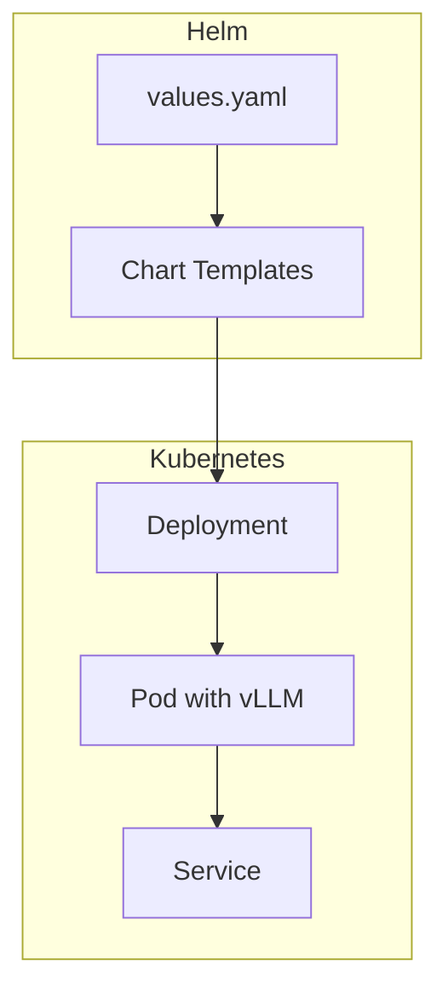

**Diagram sources**
- [helm.md](file://docs/deployment/frameworks/helm.md#L48-L110)
- [k8s.md](file://docs/deployment/k8s.md#L130-L250)

**Section sources**
- [helm.md](file://docs/deployment/frameworks/helm.md#L48-L110)
- [k8s.md](file://docs/deployment/k8s.md#L130-L250)

### Health Checks, Restart Policies, and Monitoring
- Probes: Configure liveness and readiness probes against the /health endpoint.
- Restart policy: Use default restartOnFailure semantics; tune failure thresholds to accommodate cold-start latency.
- Monitoring: Integrate Prometheus metrics and Grafana dashboards as shown in examples.

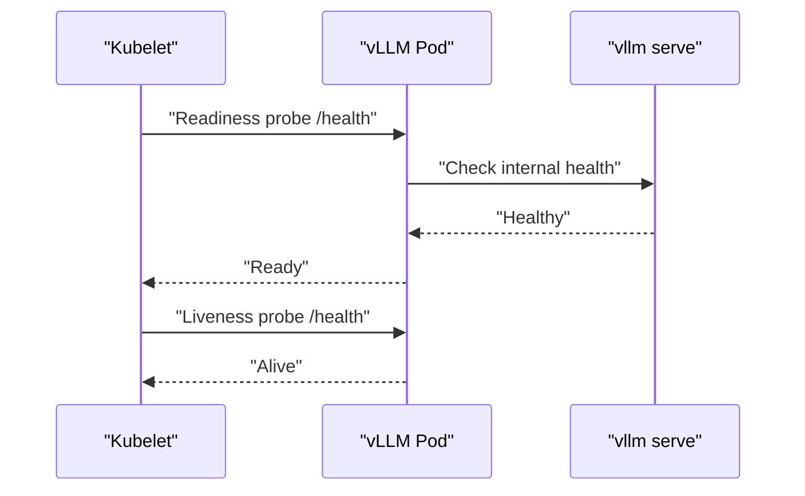

**Diagram sources**
- [helm.md](file://docs/deployment/frameworks/helm.md#L80-L95)
- [k8s.md](file://docs/deployment/k8s.md#L237-L249)

**Section sources**
- [helm.md](file://docs/deployment/frameworks/helm.md#L80-L95)
- [k8s.md](file://docs/deployment/k8s.md#L237-L249)

### Deployment Scenarios
- Single-node GPU: Use Docker/Podman with --gpus and mount cache; or Kubernetes Deployment with GPU limits.
- Multi-GPU: Increase nvidia.com/gpu requests/limits; ensure shared memory sizing; leverage attention backends and engine args for scaling.
- Distributed: Use Kubernetes with multiple replicas and a Service; integrate with KubeRay for Ray-based distributed serving.

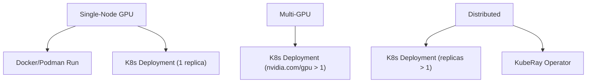

**Diagram sources**
- [docker.md](file://docs/deployment/docker.md#L8-L16)
- [k8s.md](file://docs/deployment/k8s.md#L130-L250)
- [kuberay.md](file://docs/deployment/integrations/kuberay.md#L1-L21)

**Section sources**
- [docker.md](file://docs/deployment/docker.md#L8-L16)
- [k8s.md](file://docs/deployment/k8s.md#L130-L250)
- [kuberay.md](file://docs/deployment/integrations/kuberay.md#L1-L21)

## Dependency Analysis
- Container base images define CUDA/ROCm toolchains and runtime dependencies.
- The vLLM server entrypoint depends on environment variables for cache/config roots, logging, and attention backends.
- Kubernetes/Helm depend on GPU resource names and probes for scheduling and health.

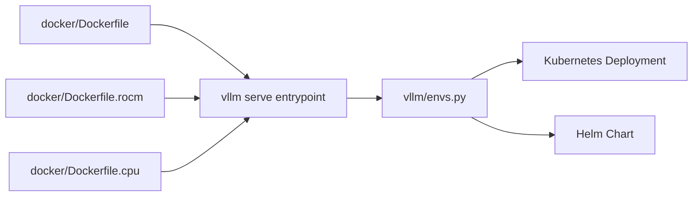

**Diagram sources**
- [Dockerfile](file://docker/Dockerfile#L636-L640)
- [Dockerfile.rocm](file://docker/Dockerfile.rocm#L120-L148)
- [Dockerfile.cpu](file://docker/Dockerfile.cpu#L194-L204)
- [envs.py](file://vllm/envs.py#L502-L541)
- [k8s.md](file://docs/deployment/k8s.md#L130-L250)
- [helm.md](file://docs/deployment/frameworks/helm.md#L70-L110)

**Section sources**
- [Dockerfile](file://docker/Dockerfile#L636-L640)
- [Dockerfile.rocm](file://docker/Dockerfile.rocm#L120-L148)
- [Dockerfile.cpu](file://docker/Dockerfile.cpu#L194-L204)
- [envs.py](file://vllm/envs.py#L502-L541)
- [k8s.md](file://docs/deployment/k8s.md#L130-L250)
- [helm.md](file://docs/deployment/frameworks/helm.md#L70-L110)

## Performance Considerations
- Attention backend selection and FlashInfer toggles can impact throughput and latency.
- Logging intervals and stats logging should be tuned for production telemetry overhead.
- Shared memory sizing is critical for tensor parallel inference.
- CPU/GPU resource allocation should reflect model size and concurrency targets.

[No sources needed since this section provides general guidance]

## Troubleshooting Guide
- Startup/readiness probe failures: Increase failure thresholds to account for cold start; verify /health endpoint availability.
- NUMA-related syscalls blocked: Add SYS_NICE capability and unconfined seccomp in Docker; replicate via securityContext in Kubernetes.
- Kubernetes service conflicts: Avoid naming services that collide with Kubernetes’ injected environment variables (service name prefix).

**Section sources**
- [k8s.md](file://docs/deployment/k8s.md#L384-L398)
- [cpu.md](file://docs/getting_started/installation/cpu.md#L267-L298)
- [env_vars.md](file://docs/configuration/env_vars.md#L1-L13)

## Conclusion
By combining the official container images, documented environment variables, and robust Kubernetes/Helm configurations, you can operate vLLM in production with reliable GPU access, predictable performance, and strong observability. Ensure cache and config directories are properly mounted, probes are tuned for cold starts, and security contexts are minimized to the least privilege necessary.

[No sources needed since this section summarizes without analyzing specific files]

## Appendices

### Appendix A: Environment Variables Reference
- Cache/config roots: VLLM_CACHE_ROOT, VLLM_CONFIG_ROOT
- Logging: VLLM_LOGGING_*, VLLM_LOG_STATS_INTERVAL
- Attention/backends: VLLM_ATTENTION_BACKEND, VLLM_USE_FLASHINFER_SAMPLER, VLLM_FLASH_ATTN_VERSION
- Distributed: VLLM_HOST_IP, VLLM_PORT, VLLM_ENGINE_ITERATION_TIMEOUT_S
- Platform: VLLM_TARGET_DEVICE, VLLM_MAIN_CUDA_VERSION (CUDA), ROCm-specific envs in ROCm image

**Section sources**
- [envs.py](file://vllm/envs.py#L502-L541)
- [envs.py](file://vllm/envs.py#L635-L662)
- [envs.py](file://vllm/envs.py#L662-L720)
- [envs.py](file://vllm/envs.py#L720-L780)
- [Dockerfile.rocm](file://docker/Dockerfile.rocm#L120-L148)

### Appendix B: Kubernetes Deployment Notes
- GPU scheduling: Use vendor resource names (e.g., nvidia.com/gpu) with requests/limits.
- Shared memory: Provide emptyDir-backed /dev/shm with adequate size.
- Probes: Configure liveness/readiness against /health.

**Section sources**
- [k8s.md](file://docs/deployment/k8s.md#L223-L249)
- [k8s.md](file://docs/deployment/k8s.md#L237-L249)

### Appendix C: Helm Values Highlights
- Autoscaling, probes, resources, and init containers for model download are configurable via values.yaml.

**Section sources**
- [helm.md](file://docs/deployment/frameworks/helm.md#L48-L110)