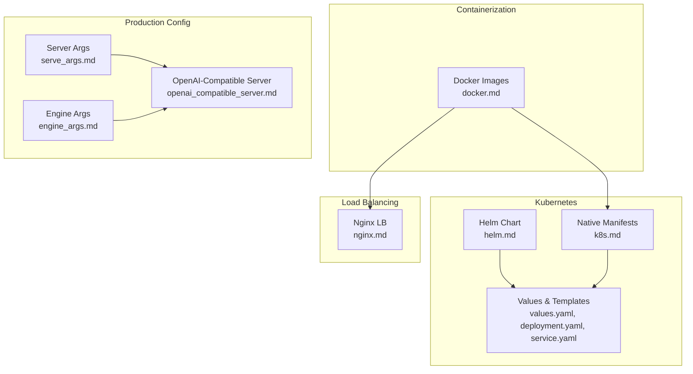
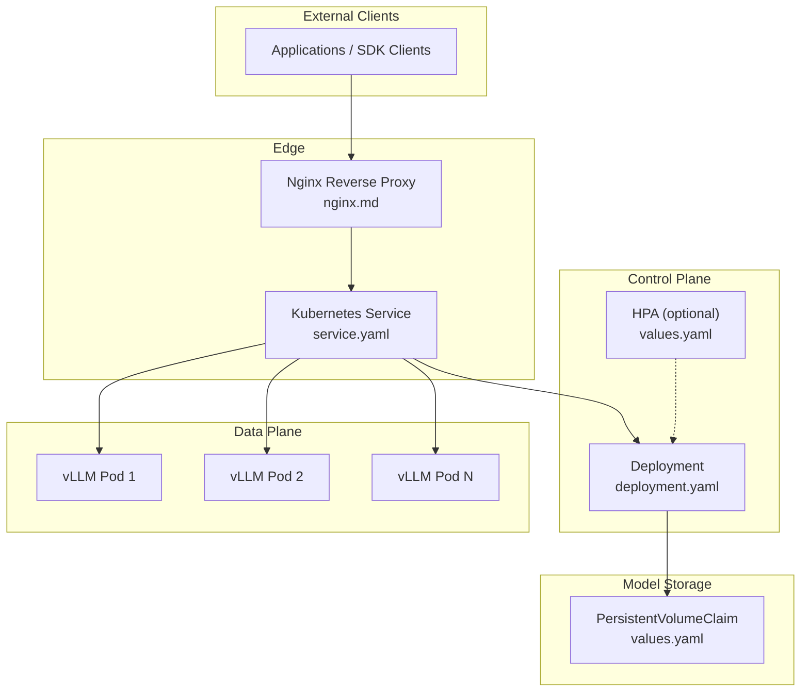
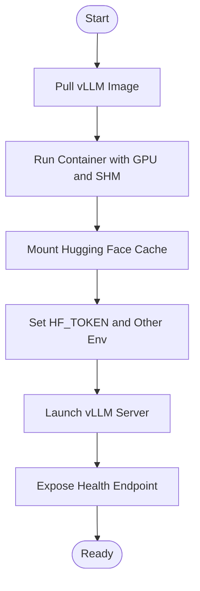
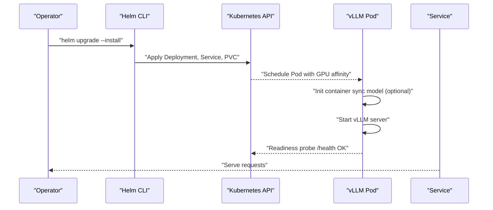
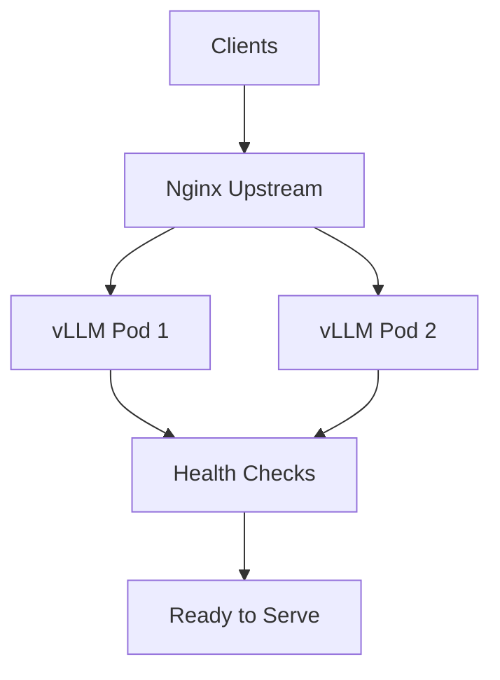
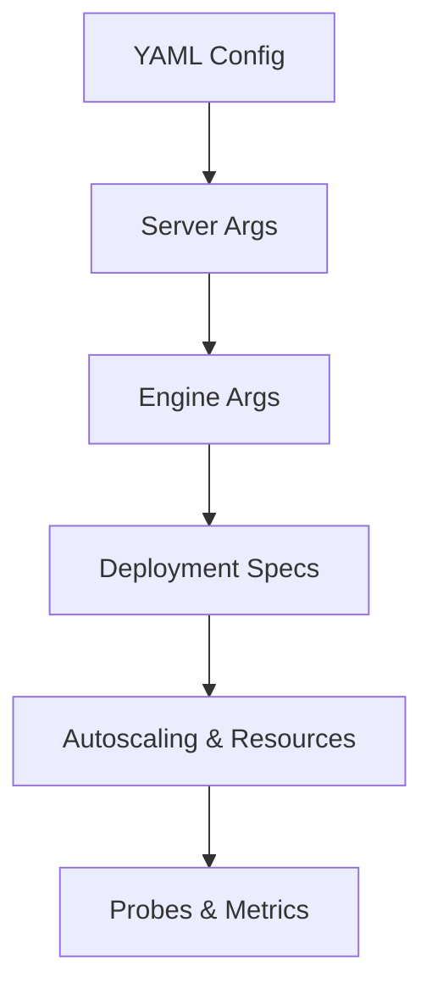
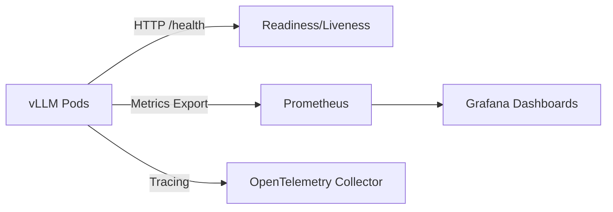
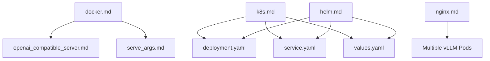

# Deployment and Operations

<cite>
**Referenced Files in This Document**
- [README.md](file://README.md)
- [docker.md](file://docs/deployment/docker.md)
- [k8s.md](file://docs/deployment/k8s.md)
- [nginx.md](file://docs/deployment/nginx.md)
- [serve_args.md](file://docs/configuration/serve_args.md)
- [engine_args.md](file://docs/configuration/engine_args.md)
- [openai_compatible_server.md](file://docs/serving/openai_compatible_server.md)
- [helm.md](file://docs/deployment/frameworks/helm.md)
- [values.yaml](file://examples/online_serving/chart-helm/values.yaml)
- [deployment.yaml](file://examples/online_serving/chart-helm/templates/deployment.yaml)
- [service.yaml](file://examples/online_serving/chart-helm/templates/service.yaml)
</cite>

## Table of Contents
1. [Introduction](#introduction)
2. [Project Structure](#project-structure)
3. [Core Components](#core-components)
4. [Architecture Overview](#architecture-overview)
5. [Detailed Component Analysis](#detailed-component-analysis)
6. [Dependency Analysis](#dependency-analysis)
7. [Performance Considerations](#performance-considerations)
8. [Troubleshooting Guide](#troubleshooting-guide)
9. [Conclusion](#conclusion)
10. [Appendices](#appendices)

## Introduction
This document provides production-focused deployment and operations guidance for vLLM. It covers containerized deployment with Docker, Kubernetes orchestration using native manifests and Helm, and cloud-native integration patterns. It documents production configuration, scaling strategies, high availability, load balancing, monitoring integration, incident response, and operational maintenance practices. Practical examples are linked to repository files to help teams implement robust, scalable, and observable serving environments.

## Project Structure
The repository organizes deployment and operations guidance across:
- Containerization: official Docker image usage and custom builds
- Orchestration: Kubernetes manifests and Helm chart
- Load balancing: Nginx reverse proxy examples
- Production configuration: server and engine arguments
- Operational observability: Prometheus/Grafana dashboards and OpenTelemetry integration examples

**Diagram sources**
- [docker.md](file://docs/deployment/docker.md#L1-L153)
- [k8s.md](file://docs/deployment/k8s.md#L1-L398)
- [nginx.md](file://docs/deployment/nginx.md#L1-L138)
- [serve_args.md](file://docs/configuration/serve_args.md#L1-L36)
- [engine_args.md](file://docs/configuration/engine_args.md#L1-L23)
- [openai_compatible_server.md](file://docs/serving/openai_compatible_server.md#L1-L200)
- [helm.md](file://docs/deployment/frameworks/helm.md#L1-L140)
- [values.yaml](file://examples/online_serving/chart-helm/values.yaml#L1-L175)
- [deployment.yaml](file://examples/online_serving/chart-helm/templates/deployment.yaml#L1-L131)
- [service.yaml](file://examples/online_serving/chart-helm/templates/service.yaml#L1-L14)

**Section sources**
- [README.md](file://README.md#L1-L191)
- [docker.md](file://docs/deployment/docker.md#L1-L153)
- [k8s.md](file://docs/deployment/k8s.md#L1-L398)
- [nginx.md](file://docs/deployment/nginx.md#L1-L138)
- [serve_args.md](file://docs/configuration/serve_args.md#L1-L36)
- [engine_args.md](file://docs/configuration/engine_args.md#L1-L23)
- [openai_compatible_server.md](file://docs/serving/openai_compatible_server.md#L1-L200)
- [helm.md](file://docs/deployment/frameworks/helm.md#L1-L140)
- [values.yaml](file://examples/online_serving/chart-helm/values.yaml#L1-L175)
- [deployment.yaml](file://examples/online_serving/chart-helm/templates/deployment.yaml#L1-L131)
- [service.yaml](file://examples/online_serving/chart-helm/templates/service.yaml#L1-L14)

## Core Components
- OpenAI-compatible server: exposes REST endpoints for completions, chat, embeddings, audio transcription/translation, and pooling/classification/score APIs. Supports advanced parameters and streaming.
- Engine arguments: control engine behavior for both offline and online serving modes.
- Server arguments: CLI and YAML-based configuration for the HTTP server.
- Container images: official Docker image and custom builds for GPU and CPU targets.
- Kubernetes deployment: native manifests and Helm chart with autoscaling, probes, and init containers for model download.
- Nginx load balancing: multi-instance deployment with Nginx as a reverse proxy.

**Section sources**
- [openai_compatible_server.md](file://docs/serving/openai_compatible_server.md#L1-L200)
- [engine_args.md](file://docs/configuration/engine_args.md#L1-L23)
- [serve_args.md](file://docs/configuration/serve_args.md#L1-L36)
- [docker.md](file://docs/deployment/docker.md#L1-L153)
- [k8s.md](file://docs/deployment/k8s.md#L1-L398)
- [helm.md](file://docs/deployment/frameworks/helm.md#L1-L140)
- [values.yaml](file://examples/online_serving/chart-helm/values.yaml#L1-L175)
- [deployment.yaml](file://examples/online_serving/chart-helm/templates/deployment.yaml#L1-L131)
- [service.yaml](file://examples/online_serving/chart-helm/templates/service.yaml#L1-L14)
- [nginx.md](file://docs/deployment/nginx.md#L1-L138)

## Architecture Overview
The production architecture supports:
- Single-node and multi-node deployments
- Horizontal scaling via replicas and autoscaling
- Load balancing with Nginx or Kubernetes Services
- Observability via health endpoints and metrics dashboards
- High availability via readiness/liveness probes and PodDisruptionBudgets

**Diagram sources**
- [nginx.md](file://docs/deployment/nginx.md#L1-L138)
- [service.yaml](file://examples/online_serving/chart-helm/templates/service.yaml#L1-L14)
- [deployment.yaml](file://examples/online_serving/chart-helm/templates/deployment.yaml#L1-L131)
- [values.yaml](file://examples/online_serving/chart-helm/values.yaml#L1-L175)

**Section sources**
- [nginx.md](file://docs/deployment/nginx.md#L1-L138)
- [service.yaml](file://examples/online_serving/chart-helm/templates/service.yaml#L1-L14)
- [deployment.yaml](file://examples/online_serving/chart-helm/templates/deployment.yaml#L1-L131)
- [values.yaml](file://examples/online_serving/chart-helm/values.yaml#L1-L175)

## Detailed Component Analysis

### Containerized Deployment with Docker
- Official image usage: run the OpenAI-compatible server with GPU access, shared memory, and model cache mounting.
- Custom builds: build from source with targeted Dockerfiles, cross-compilation for ARM64, and tuning build arguments for performance.
- Optional dependencies: add extras via custom Dockerfile when licenses permit.
- Notes on IPC and SHM: ensure host IPC or sufficient shared memory for tensor parallel inference.

**Diagram sources**
- [docker.md](file://docs/deployment/docker.md#L1-L153)

**Section sources**
- [docker.md](file://docs/deployment/docker.md#L1-L153)

### Kubernetes Orchestration (Native and Helm)
- Native manifests: Deployment and Service for CPU/GPU nodes, readiness/liveness probes, shared memory via emptyDir, and optional PVC for model cache.
- Helm chart: templated Deployment, Service, PVC, autoscaling, probes, and init containers for S3-backed model download.
- GPU scheduling: runtimeClassName and node affinity for specific GPU models.
- Probes: use HTTP GET against the health endpoint to gate traffic until the server is ready.

**Diagram sources**
- [helm.md](file://docs/deployment/frameworks/helm.md#L1-L140)
- [values.yaml](file://examples/online_serving/chart-helm/values.yaml#L1-L175)
- [deployment.yaml](file://examples/online_serving/chart-helm/templates/deployment.yaml#L1-L131)
- [service.yaml](file://examples/online_serving/chart-helm/templates/service.yaml#L1-L14)

**Section sources**
- [k8s.md](file://docs/deployment/k8s.md#L1-L398)
- [helm.md](file://docs/deployment/frameworks/helm.md#L1-L140)
- [values.yaml](file://examples/online_serving/chart-helm/values.yaml#L1-L175)
- [deployment.yaml](file://examples/online_serving/chart-helm/templates/deployment.yaml#L1-L131)
- [service.yaml](file://examples/online_serving/chart-helm/templates/service.yaml#L1-L14)

### Load Balancing and High Availability
- Nginx reverse proxy: define upstream servers and least_conn balancing; mount configuration and expose port.
- Kubernetes Service: ClusterIP with label selectors; use session affinity if needed for prefix caching.
- Probes and delays: tune initialDelaySeconds and failureThreshold to prevent premature kills during cold starts.

**Diagram sources**
- [nginx.md](file://docs/deployment/nginx.md#L1-L138)
- [k8s.md](file://docs/deployment/k8s.md#L1-L398)

**Section sources**
- [nginx.md](file://docs/deployment/nginx.md#L1-L138)
- [k8s.md](file://docs/deployment/k8s.md#L1-L398)

### Production Configuration and Scaling
- Server arguments: configure host, port, logging level, and model via CLI or YAML.
- Engine arguments: control batching, KV cache, quantization, and parallelism knobs.
- Scaling: replicas for horizontal scaling; autoscaling policies; resource requests/limits; GPU quotas.
- GPU scheduling: runtimeClassName and node affinity for specific accelerators.

**Diagram sources**
- [serve_args.md](file://docs/configuration/serve_args.md#L1-L36)
- [engine_args.md](file://docs/configuration/engine_args.md#L1-L23)
- [values.yaml](file://examples/online_serving/chart-helm/values.yaml#L1-L175)
- [deployment.yaml](file://examples/online_serving/chart-helm/templates/deployment.yaml#L1-L131)

**Section sources**
- [serve_args.md](file://docs/configuration/serve_args.md#L1-L36)
- [engine_args.md](file://docs/configuration/engine_args.md#L1-L23)
- [values.yaml](file://examples/online_serving/chart-helm/values.yaml#L1-L175)
- [deployment.yaml](file://examples/online_serving/chart-helm/templates/deployment.yaml#L1-L131)

### Monitoring Integration and Observability
- Health endpoints: use HTTP GET against the health path for probes.
- Metrics dashboards: Prometheus/Grafana and Perses examples are available in the repository for performance and query statistics.
- OpenTelemetry: examples demonstrate integration points for telemetry collection.

**Diagram sources**
- [k8s.md](file://docs/deployment/k8s.md#L1-L398)
- [values.yaml](file://examples/online_serving/chart-helm/values.yaml#L1-L175)

**Section sources**
- [k8s.md](file://docs/deployment/k8s.md#L1-L398)
- [values.yaml](file://examples/online_serving/chart-helm/values.yaml#L1-L175)

### Multi-Node Deployment and Distributed Serving
- Multi-instance with Nginx: run multiple vLLM containers on separate GPUs and balance traffic.
- Kubernetes multi-replica: scale across nodes with proper GPU scheduling and shared storage for model cache.
- Prefix caching: label selectors on Service aid locality for prefix caching benefits.

**Section sources**
- [nginx.md](file://docs/deployment/nginx.md#L1-L138)
- [k8s.md](file://docs/deployment/k8s.md#L1-L398)

## Dependency Analysis
The following diagram maps key operational dependencies across deployment artifacts.

**Diagram sources**
- [docker.md](file://docs/deployment/docker.md#L1-L153)
- [openai_compatible_server.md](file://docs/serving/openai_compatible_server.md#L1-L200)
- [serve_args.md](file://docs/configuration/serve_args.md#L1-L36)
- [k8s.md](file://docs/deployment/k8s.md#L1-L398)
- [deployment.yaml](file://examples/online_serving/chart-helm/templates/deployment.yaml#L1-L131)
- [service.yaml](file://examples/online_serving/chart-helm/templates/service.yaml#L1-L14)
- [values.yaml](file://examples/online_serving/chart-helm/values.yaml#L1-L175)
- [helm.md](file://docs/deployment/frameworks/helm.md#L1-L140)
- [nginx.md](file://docs/deployment/nginx.md#L1-L138)

**Section sources**
- [docker.md](file://docs/deployment/docker.md#L1-L153)
- [k8s.md](file://docs/deployment/k8s.md#L1-L398)
- [helm.md](file://docs/deployment/frameworks/helm.md#L1-L140)
- [nginx.md](file://docs/deployment/nginx.md#L1-L138)
- [openai_compatible_server.md](file://docs/serving/openai_compatible_server.md#L1-L200)
- [serve_args.md](file://docs/configuration/serve_args.md#L1-L36)
- [values.yaml](file://examples/online_serving/chart-helm/values.yaml#L1-L175)
- [deployment.yaml](file://examples/online_serving/chart-helm/templates/deployment.yaml#L1-L131)
- [service.yaml](file://examples/online_serving/chart-helm/templates/service.yaml#L1-L14)

## Performance Considerations
- Shared memory sizing: ensure adequate /dev/shm for tensor parallel inference.
- GPU scheduling: pin to specific GPU families and enable runtimeClassName for NVIDIA devices.
- Model cache: persistent storage for model weights to reduce cold-start latency.
- Batching and chunked prefill: tune engine arguments for throughput and latency trade-offs.
- Cross-compilation builds: optimize build jobs and NVCC threads for ARM64 targets.

[No sources needed since this section provides general guidance]

## Troubleshooting Guide
Common operational issues and remedies:
- Startup or readiness probe failures: adjust failureThreshold and initialDelaySeconds to accommodate cold start times.
- Health endpoint checks: confirm HTTP GET against the health path succeeds before marking pods ready.
- Interrupted starts: investigate logs for termination signals and increase probe thresholds accordingly.
- GPU scheduling: verify device plugin and node affinity; ensure runtimeClassName matches cluster configuration.

**Section sources**
- [k8s.md](file://docs/deployment/k8s.md#L384-L398)

## Conclusion
By combining containerized deployments, Kubernetes orchestration, and Helm templating, teams can operate vLLM at scale with predictable performance and strong observability. The repository provides tested examples for Docker, Kubernetes, and Nginx-based load balancing, along with production-grade configuration and monitoring assets. Adopting the practices and patterns documented here enables reliable, high-availability serving across diverse infrastructures.

[No sources needed since this section summarizes without analyzing specific files]

## Appendices

### Practical Deployment Playbooks
- Docker-based single-node serving with GPU and shared memory
  - See: [docker.md](file://docs/deployment/docker.md#L1-L153)
- Kubernetes native deployment for CPU and GPU with probes and PVC
  - See: [k8s.md](file://docs/deployment/k8s.md#L1-L398)
- Helm-based deployment with autoscaling, init containers, and S3 model sync
  - See: [helm.md](file://docs/deployment/frameworks/helm.md#L1-L140), [values.yaml](file://examples/online_serving/chart-helm/values.yaml#L1-L175)
- Nginx reverse proxy for multi-instance load balancing
  - See: [nginx.md](file://docs/deployment/nginx.md#L1-L138)

### Configuration References
- Server arguments and YAML loading
  - See: [serve_args.md](file://docs/configuration/serve_args.md#L1-L36)
- Engine arguments for online serving
  - See: [engine_args.md](file://docs/configuration/engine_args.md#L1-L23)
- OpenAI-compatible server endpoints and parameters
  - See: [openai_compatible_server.md](file://docs/serving/openai_compatible_server.md#L1-L200)