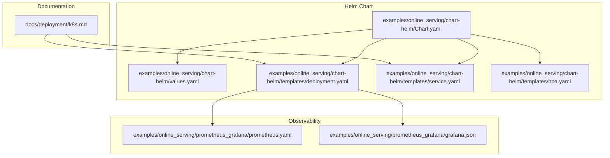
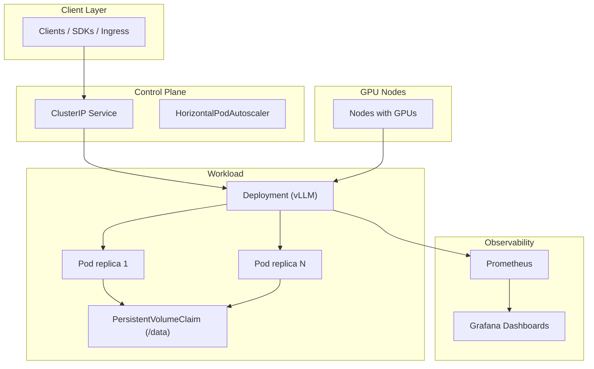
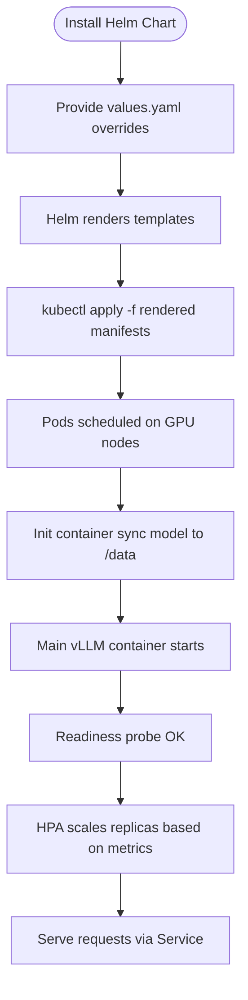
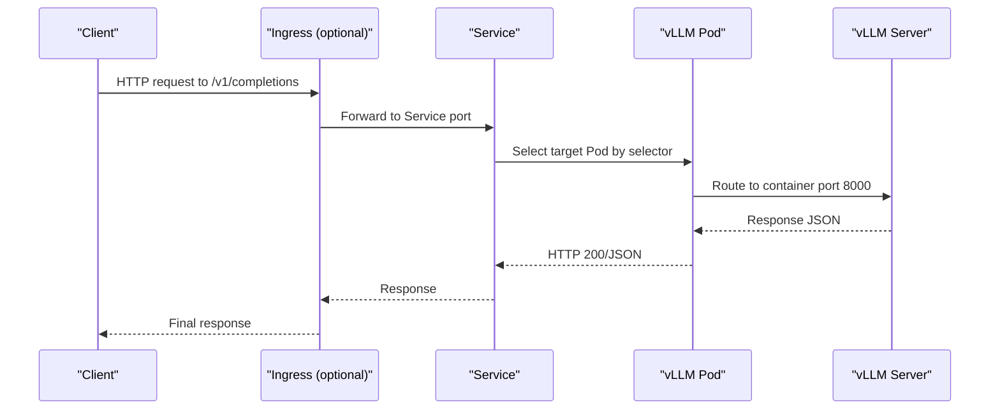
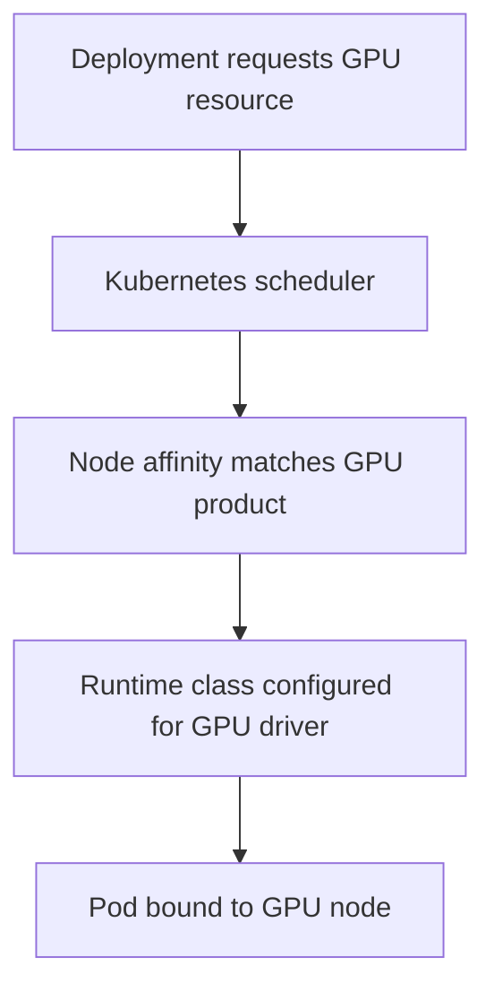
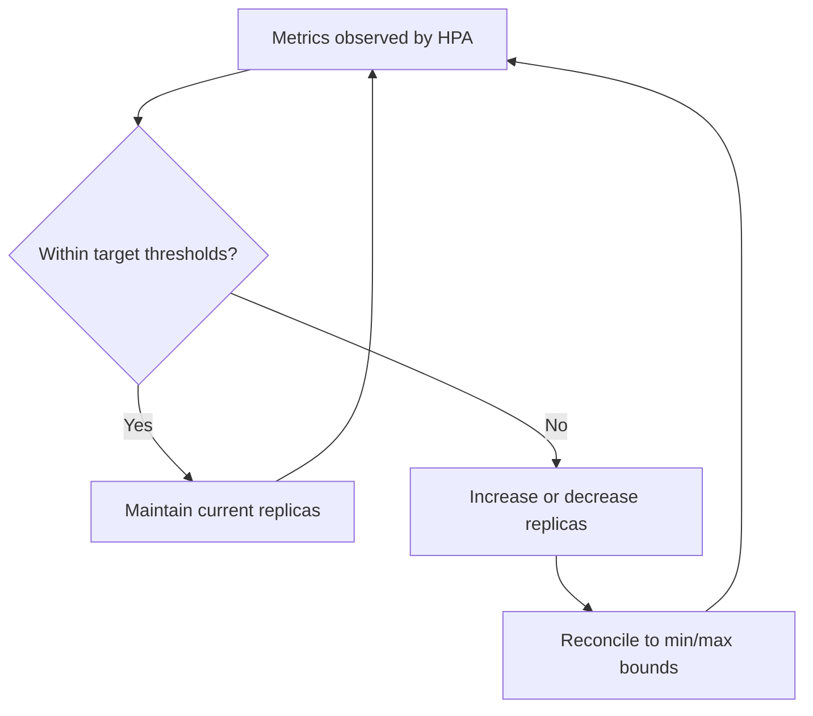
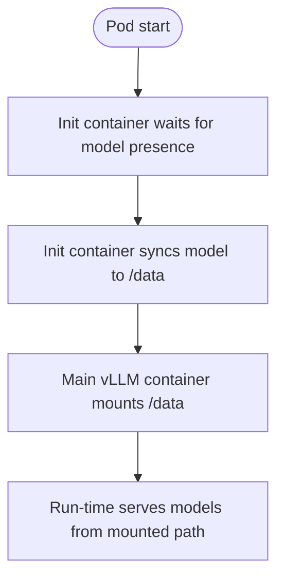
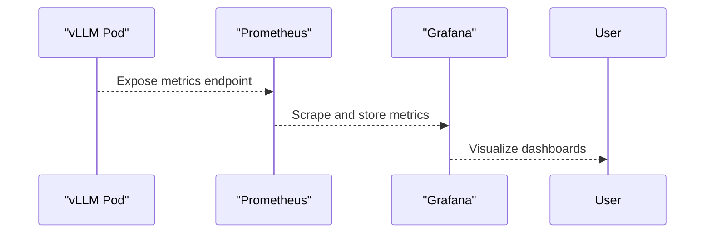
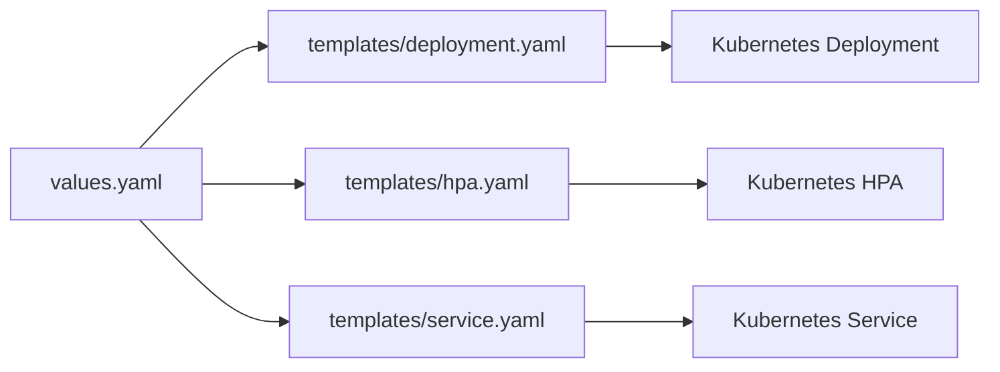

# Kubernetes Orchestration

<cite>
**Referenced Files in This Document**
- [k8s.md](file://docs/deployment/k8s.md)
- [Chart.yaml](file://examples/online_serving/chart-helm/Chart.yaml)
- [values.yaml](file://examples/online_serving/chart-helm/values.yaml)
- [deployment.yaml](file://examples/online_serving/chart-helm/templates/deployment.yaml)
- [service.yaml](file://examples/online_serving/chart-helm/templates/service.yaml)
- [hpa.yaml](file://examples/online_serving/chart-helm/templates/hpa.yaml)
- [prometheus.yaml](file://examples/online_serving/prometheus_grafana/prometheus.yaml)
- [grafana.json](file://examples/online_serving/prometheus_grafana/grafana.json)
</cite>

## Table of Contents
1. [Introduction](#introduction)
2. [Project Structure](#project-structure)
3. [Core Components](#core-components)
4. [Architecture Overview](#architecture-overview)
5. [Detailed Component Analysis](#detailed-component-analysis)
6. [Dependency Analysis](#dependency-analysis)
7. [Performance Considerations](#performance-considerations)
8. [Troubleshooting Guide](#troubleshooting-guide)
9. [Conclusion](#conclusion)
10. [Appendices](#appendices)

## Introduction
This document explains how to operate vLLM in production-grade Kubernetes environments with a focus on Helm-driven deployments, GPU-aware scheduling, autoscaling, observability, and operational best practices. It synthesizes official documentation and example artifacts from the repository to provide a practical blueprint for scalable, reliable, and observable vLLM serving on Kubernetes.

## Project Structure
The repository provides:
- Official Kubernetes deployment guidance for CPU and GPU-backed vLLM servers
- A production-ready Helm chart for repeatable deployments, autoscaling, and persistent model storage
- Monitoring and visualization assets for Prometheus and Grafana

**Diagram sources**
- [k8s.md](file://docs/deployment/k8s.md#L1-L398)
- [Chart.yaml](file://examples/online_serving/chart-helm/Chart.yaml#L1-L22)
- [values.yaml](file://examples/online_serving/chart-helm/values.yaml#L1-L175)
- [deployment.yaml](file://examples/online_serving/chart-helm/templates/deployment.yaml#L1-L131)
- [service.yaml](file://examples/online_serving/chart-helm/templates/service.yaml#L1-L14)
- [hpa.yaml](file://examples/online_serving/chart-helm/templates/hpa.yaml#L1-L31)
- [prometheus.yaml](file://examples/online_serving/prometheus_grafana/prometheus.yaml#L1-L11)
- [grafana.json](file://examples/online_serving/prometheus_grafana/grafana.json#L1-L1528)

**Section sources**
- [k8s.md](file://docs/deployment/k8s.md#L1-L398)
- [Chart.yaml](file://examples/online_serving/chart-helm/Chart.yaml#L1-L22)
- [values.yaml](file://examples/online_serving/chart-helm/values.yaml#L1-L175)

## Core Components
- Helm chart: Provides a complete stack for deploying vLLM with configurable images, GPU scheduling, probes, autoscaling, and persistent storage.
- Kubernetes manifests: Reference Deployment and Service examples for CPU/GPU-backed vLLM servers, including shared memory mounts and health checks.
- Observability: Prometheus scraping configuration and Grafana dashboards for vLLM metrics.

Key capabilities covered:
- GPU scheduling and runtime class selection
- Persistent model storage via PVC and init containers
- HorizontalPodAutoscaler targeting CPU and memory
- Health probes and liveness/readiness configuration
- Metrics exposure and visualization

**Section sources**
- [values.yaml](file://examples/online_serving/chart-helm/values.yaml#L1-L175)
- [deployment.yaml](file://examples/online_serving/chart-helm/templates/deployment.yaml#L1-L131)
- [service.yaml](file://examples/online_serving/chart-helm/templates/service.yaml#L1-L14)
- [hpa.yaml](file://examples/online_serving/chart-helm/templates/hpa.yaml#L1-L31)
- [k8s.md](file://docs/deployment/k8s.md#L130-L398)

## Architecture Overview
The recommended architecture combines a Helm-deployed vLLM server with a Service fronted by optional Ingress, autoscaling, and persistent storage. Observability is layered with Prometheus scraping and Grafana dashboards.

**Diagram sources**
- [deployment.yaml](file://examples/online_serving/chart-helm/templates/deployment.yaml#L1-L131)
- [service.yaml](file://examples/online_serving/chart-helm/templates/service.yaml#L1-L14)
- [hpa.yaml](file://examples/online_serving/chart-helm/templates/hpa.yaml#L1-L31)
- [values.yaml](file://examples/online_serving/chart-helm/values.yaml#L1-L175)
- [prometheus.yaml](file://examples/online_serving/prometheus_grafana/prometheus.yaml#L1-L11)
- [grafana.json](file://examples/online_serving/prometheus_grafana/grafana.json#L1-L1528)

## Detailed Component Analysis

### Helm Chart Deployment
The Helm chart defines a reusable deployment for vLLM with:
- Configurable image repository/tag and command arguments
- GPU scheduling via runtime class and node affinity
- Persistent storage via PVC mounted under /data
- Optional init containers to synchronize model artifacts
- Probes for liveness and readiness
- HorizontalPodAutoscaler support

**Diagram sources**
- [Chart.yaml](file://examples/online_serving/chart-helm/Chart.yaml#L1-L22)
- [values.yaml](file://examples/online_serving/chart-helm/values.yaml#L1-L175)
- [deployment.yaml](file://examples/online_serving/chart-helm/templates/deployment.yaml#L1-L131)
- [hpa.yaml](file://examples/online_serving/chart-helm/templates/hpa.yaml#L1-L31)

**Section sources**
- [Chart.yaml](file://examples/online_serving/chart-helm/Chart.yaml#L1-L22)
- [values.yaml](file://examples/online_serving/chart-helm/values.yaml#L1-L175)
- [deployment.yaml](file://examples/online_serving/chart-helm/templates/deployment.yaml#L1-L131)
- [hpa.yaml](file://examples/online_serving/chart-helm/templates/hpa.yaml#L1-L31)

### Kubernetes Manifests: Deployment, Service, and Ingress
The repository includes canonical examples for CPU and GPU deployments, including:
- PersistentVolumeClaim for model cache
- Shared memory volume for tensor-parallel inference
- Health endpoints for probes
- Service exposing the vLLM API

**Diagram sources**
- [k8s.md](file://docs/deployment/k8s.md#L330-L398)

**Section sources**
- [k8s.md](file://docs/deployment/k8s.md#L130-L398)

### GPU Scheduling and Device Plugins
The Helm chart enables GPU scheduling:
- Runtime class selection for GPU drivers
- Node affinity constrained to specific GPU product models
- Resource requests/limits for GPU vendor keys

**Diagram sources**
- [deployment.yaml](file://examples/online_serving/chart-helm/templates/deployment.yaml#L110-L131)
- [values.yaml](file://examples/online_serving/chart-helm/values.yaml#L28-L44)

**Section sources**
- [deployment.yaml](file://examples/online_serving/chart-helm/templates/deployment.yaml#L110-L131)
- [values.yaml](file://examples/online_serving/chart-helm/values.yaml#L28-L44)

### Horizontal Pod Autoscaling (CPU and Memory)
The chart supports autoscaling via HPA:
- Target CPU utilization percentage
- Optional memory utilization target
- Min/max replicas bounds

**Diagram sources**
- [hpa.yaml](file://examples/online_serving/chart-helm/templates/hpa.yaml#L1-L31)
- [values.yaml](file://examples/online_serving/chart-helm/values.yaml#L49-L60)

**Section sources**
- [hpa.yaml](file://examples/online_serving/chart-helm/templates/hpa.yaml#L1-L31)
- [values.yaml](file://examples/online_serving/chart-helm/values.yaml#L49-L60)

### Persistent Model Storage and Multi-Model Serving
The Helm chart supports:
- PVC mounted at /data for model artifacts
- Init container pattern to synchronize models from S3 or similar
- Optional extra init containers for routing/proxies

**Diagram sources**
- [deployment.yaml](file://examples/online_serving/chart-helm/templates/deployment.yaml#L75-L104)
- [values.yaml](file://examples/online_serving/chart-helm/values.yaml#L77-L138)

**Section sources**
- [deployment.yaml](file://examples/online_serving/chart-helm/templates/deployment.yaml#L75-L104)
- [values.yaml](file://examples/online_serving/chart-helm/values.yaml#L77-L138)

### Rolling Updates, Blue-Green, and Canary Strategies
- RollingUpdate is the default Deployment strategy in the Helm chart.
- Blue-green and canary approaches can be implemented by running multiple Deployments/Services and switching traffic via Ingress or service mesh.

[No sources needed since this section provides general guidance]

### Observability: Prometheus and Grafana
- Prometheus configuration demonstrates scraping a local target for vLLM metrics.
- Grafana dashboards include panels for end-to-end latency, token throughput, inter-token latency, and scheduler state.

**Diagram sources**
- [prometheus.yaml](file://examples/online_serving/prometheus_grafana/prometheus.yaml#L1-L11)
- [grafana.json](file://examples/online_serving/prometheus_grafana/grafana.json#L1-L1528)

**Section sources**
- [prometheus.yaml](file://examples/online_serving/prometheus_grafana/prometheus.yaml#L1-L11)
- [grafana.json](file://examples/online_serving/prometheus_grafana/grafana.json#L1-L1528)

## Dependency Analysis
- The Helm chart depends on values.yaml for configuration and templates for rendering Kubernetes objects.
- The Deployment template depends on values for resources, probes, GPU scheduling, and optional init containers.
- The HPA template depends on autoscaling values.
- The Service template depends on labels and ports.

**Diagram sources**
- [values.yaml](file://examples/online_serving/chart-helm/values.yaml#L1-L175)
- [deployment.yaml](file://examples/online_serving/chart-helm/templates/deployment.yaml#L1-L131)
- [hpa.yaml](file://examples/online_serving/chart-helm/templates/hpa.yaml#L1-L31)
- [service.yaml](file://examples/online_serving/chart-helm/templates/service.yaml#L1-L14)

**Section sources**
- [values.yaml](file://examples/online_serving/chart-helm/values.yaml#L1-L175)
- [deployment.yaml](file://examples/online_serving/chart-helm/templates/deployment.yaml#L1-L131)
- [hpa.yaml](file://examples/online_serving/chart-helm/templates/hpa.yaml#L1-L31)
- [service.yaml](file://examples/online_serving/chart-helm/templates/service.yaml#L1-L14)

## Performance Considerations
- GPU scheduling: Ensure runtime class and node affinity align with your cluster’s device plugin configuration.
- Shared memory: Mount an in-memory emptyDir at /dev/shm for tensor-parallel workloads.
- Probes: Tune initialDelaySeconds and failureThreshold to avoid premature restarts during cold starts.
- Autoscaling: Start with CPU utilization targets; monitor saturation and adjust thresholds or add GPU metrics if available.
- Storage: Use fast SSD-backed PVCs for model cache; consider preheating models via init containers.

[No sources needed since this section provides general guidance]

## Troubleshooting Guide
Common issues and remedies:
- Startup or readiness probe failures indicating slow cold start:
  - Increase failureThreshold or tune initialDelaySeconds in probes.
  - Verify GPU scheduling and runtime class configuration.
- GPU scheduling failures:
  - Confirm device plugin is installed and nodes are ready.
  - Validate node affinity and runtimeClassName.
- Model not found errors:
  - Ensure PVC is attached and init container synced artifacts to /data.
- Service connectivity:
  - Verify Service selector matches Deployment labels and targetPort equals containerPort.

**Section sources**
- [k8s.md](file://docs/deployment/k8s.md#L384-L398)
- [deployment.yaml](file://examples/online_serving/chart-helm/templates/deployment.yaml#L110-L131)
- [values.yaml](file://examples/online_serving/chart-helm/values.yaml#L142-L171)

## Conclusion
By combining the Helm chart, canonical Kubernetes manifests, and observability assets, teams can reliably deploy, scale, and operate vLLM on Kubernetes. The approach emphasizes GPU-aware scheduling, persistent model storage, autoscaling, and comprehensive metrics visualization.

[No sources needed since this section summarizes without analyzing specific files]

## Appendices

### Appendix A: Helm Values Quick Reference
- image.repository/image.tag: Container image to use
- replicaCount: Desired replicas
- resources.requests/limits: CPU, memory, and GPU resource allocations
- autoscaling.enabled/min/max: HPA configuration
- readinessProbe/livenessProbe: Health check parameters
- extraInit.modelDownload: S3 sync and wait container configuration
- gpuModels: Node affinity values for GPU product models

**Section sources**
- [values.yaml](file://examples/online_serving/chart-helm/values.yaml#L1-L175)

### Appendix B: Kubernetes Manifest Highlights
- Deployment: Defines container command, probes, volumes, and GPU scheduling
- Service: Exposes vLLM API internally
- Optional Ingress: Route external traffic to the Service

**Section sources**
- [k8s.md](file://docs/deployment/k8s.md#L130-L398)