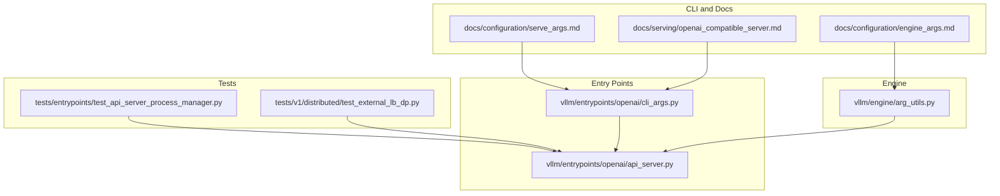
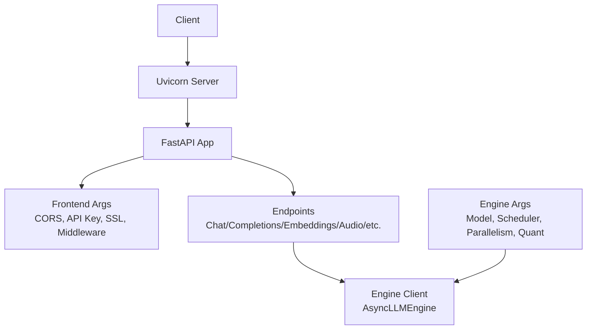
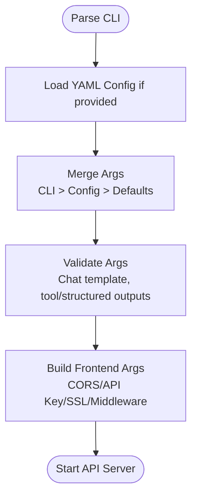
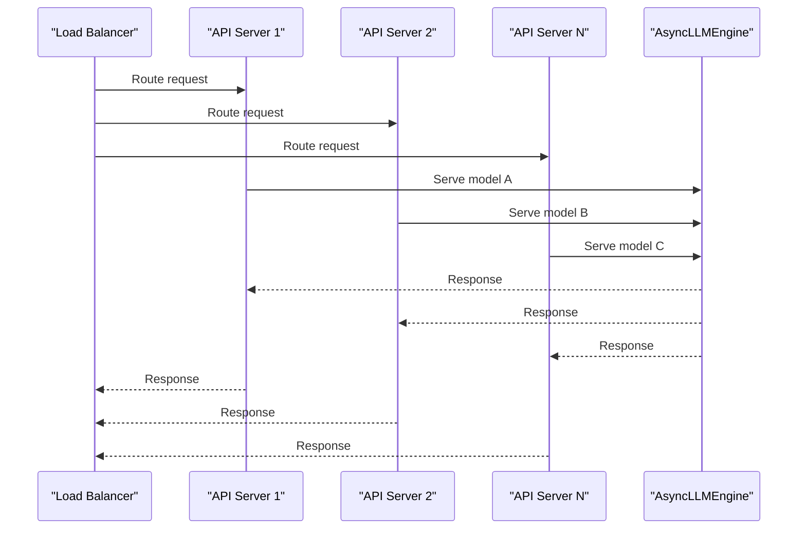
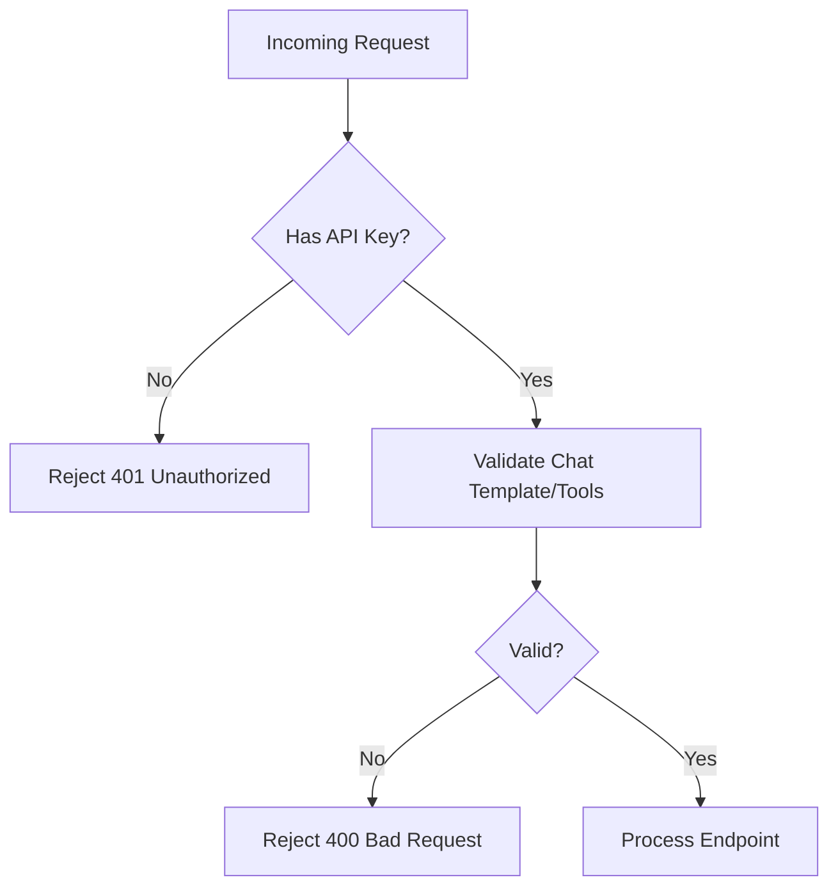
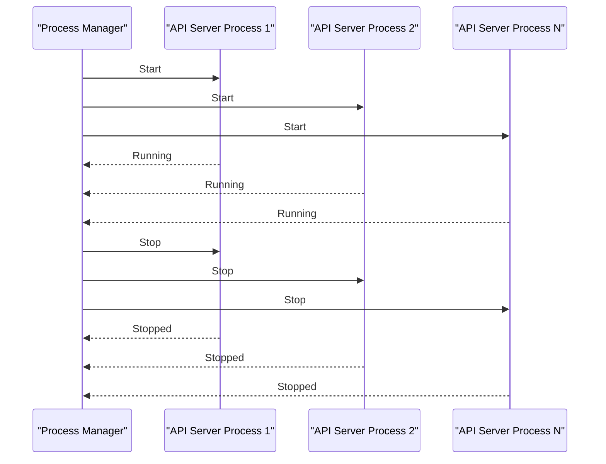
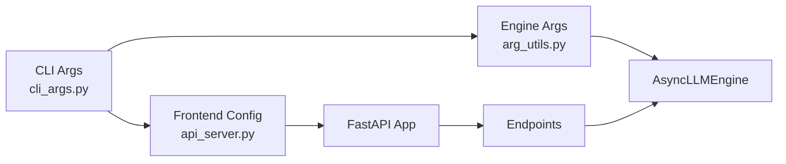

# API Server Configuration

<cite>
**Referenced Files in This Document**
- [README.md](file://README.md)
- [openai_compatible_server.md](file://docs/serving/openai_compatible_server.md)
- [serve_args.md](file://docs/configuration/serve_args.md)
- [engine_args.md](file://docs/configuration/engine_args.md)
- [cli_args.py](file://vllm/entrypoints/openai/cli_args.py)
- [api_server.py](file://vllm/entrypoints/openai/api_server.py)
- [arg_utils.py](file://vllm/engine/arg_utils.py)
- [test_api_server_process_manager.py](file://tests/entrypoints/test_api_server_process_manager.py)
- [test_external_lb_dp.py](file://tests/v1/distributed/test_external_lb_dp.py)
- [security.md](file://docs/usage/security.md)
- [utils.py](file://vllm/v1/utils.py)
</cite>

## Table of Contents
1. [Introduction](#introduction)
2. [Project Structure](#project-structure)
3. [Core Components](#core-components)
4. [Architecture Overview](#architecture-overview)
5. [Detailed Component Analysis](#detailed-component-analysis)
6. [Dependency Analysis](#dependency-analysis)
7. [Performance Considerations](#performance-considerations)
8. [Troubleshooting Guide](#troubleshooting-guide)
9. [Conclusion](#conclusion)
10. [Appendices](#appendices)

## Introduction
This document provides comprehensive guidance for configuring and deploying the OpenAI-compatible API server in vLLM. It covers server arguments, request handling, response formatting, concurrency and timeouts, connection pooling, multi-model serving, model routing, dynamic model loading, security (authentication, rate limiting, request validation), load balancing, health checks, and graceful shutdown. It also includes practical production configuration examples for different traffic patterns and scaling requirements.

## Project Structure
The API server is implemented as a FastAPI application with an asynchronous engine backend. Configuration is driven by CLI arguments and YAML config files, with engine-level parameters controlling model execution and resource allocation.

**Diagram sources**
- [serve_args.md](file://docs/configuration/serve_args.md#L1-L36)
- [openai_compatible_server.md](file://docs/serving/openai_compatible_server.md#L1-L120)
- [engine_args.md](file://docs/configuration/engine_args.md#L1-L23)
- [cli_args.py](file://vllm/entrypoints/openai/cli_args.py#L244-L303)
- [api_server.py](file://vllm/entrypoints/openai/api_server.py#L1-L120)
- [arg_utils.py](file://vllm/engine/arg_utils.py#L1-L120)
- [test_api_server_process_manager.py](file://tests/entrypoints/test_api_server_process_manager.py#L50-L120)
- [test_external_lb_dp.py](file://tests/v1/distributed/test_external_lb_dp.py#L322-L357)

**Section sources**
- [README.md](file://README.md#L82-L92)
- [openai_compatible_server.md](file://docs/serving/openai_compatible_server.md#L1-L120)
- [serve_args.md](file://docs/configuration/serve_args.md#L1-L36)
- [engine_args.md](file://docs/configuration/engine_args.md#L1-L23)

## Core Components
- Frontend server arguments (host, port, CORS, API key, SSL, middleware, logging, request ID, tool parsing, tokenizer info, etc.) are defined in the frontend argument class and registered via CLI.
- The OpenAI-compatible API server exposes multiple endpoints (chat completions, completions, embeddings, audio transcription/translation, tokenization, pooling, classification, scoring, reranking) and integrates with the asynchronous engine.
- Engine arguments control model execution, scheduling, parallelism, quantization, and memory management.

Key configuration surfaces:
- CLI arguments for the API server and engine are defined and validated in the CLI argument module.
- The API server builds and manages the asynchronous engine client lifecycle and registers endpoints.
- Engine arguments are parsed and transformed into engine configuration for execution.

**Section sources**
- [cli_args.py](file://vllm/entrypoints/openai/cli_args.py#L71-L242)
- [api_server.py](file://vllm/entrypoints/openai/api_server.py#L114-L200)
- [arg_utils.py](file://vllm/engine/arg_utils.py#L1-L120)

## Architecture Overview
The API server follows a modular architecture:
- CLI layer parses user-provided arguments and YAML config.
- Frontend layer configures FastAPI app (CORS, middleware, SSL, logging).
- Engine layer runs the asynchronous LLM engine with configurable scheduling and parallelism.
- Endpoint handlers implement OpenAI-compatible APIs and custom endpoints.

**Diagram sources**
- [cli_args.py](file://vllm/entrypoints/openai/cli_args.py#L71-L242)
- [api_server.py](file://vllm/entrypoints/openai/api_server.py#L1-L120)
- [arg_utils.py](file://vllm/engine/arg_utils.py#L1-L120)

## Detailed Component Analysis

### API Server Arguments and Request Handling
- Host, port, Unix Domain Socket, and root path define network exposure.
- CORS settings control allowed origins/methods/headers.
- API key enforcement secures endpoints.
- SSL/TLS configuration supports key/cert/ca and refresh on change.
- Middleware injection enables custom ASGI middleware.
- Logging and observability toggles include request ID headers, tokenizer info endpoint, and server load tracking.
- Tool call auto-selection and structured outputs configuration integrate with tool parsers and reasoning parsers.

Validation and precedence:
- Argument validation occurs early for chat template and tool/structured outputs requirements.
- YAML config can be loaded and merged with CLI args; CLI takes precedence.

**Diagram sources**
- [cli_args.py](file://vllm/entrypoints/openai/cli_args.py#L244-L303)
- [api_server.py](file://vllm/entrypoints/openai/api_server.py#L1240-L1255)

**Section sources**
- [cli_args.py](file://vllm/entrypoints/openai/cli_args.py#L71-L242)
- [api_server.py](file://vllm/entrypoints/openai/api_server.py#L1217-L1255)
- [serve_args.md](file://docs/configuration/serve_args.md#L1-L36)

### Response Formatting Options
- OpenAI-compatible endpoints return standardized response schemas aligned with OpenAI’s API.
- Additional endpoints (tokenize, detokenize, pooling, classification, score, rerank) provide extended functionality with consistent usage reporting where applicable.
- Tokenizer info endpoint can expose tokenizer configuration when enabled.

**Section sources**
- [openai_compatible_server.md](file://docs/serving/openai_compatible_server.md#L176-L260)
- [openai_compatible_server.md](file://docs/serving/openai_compatible_server.md#L532-L547)
- [openai_compatible_server.md](file://docs/serving/openai_compatible_server.md#L540-L620)
- [openai_compatible_server.md](file://docs/serving/openai_compatible_server.md#L663-L720)

### Concurrency Limits, Timeouts, and Connection Pooling
- Concurrency behavior is influenced by:
  - Load balancer or API gateway enforcing maximum concurrent connections.
  - Engine scheduler and parallelism settings.
  - Client-side request timeouts.
- The tests demonstrate that when clients exceed configured timeouts, requests are canceled appropriately, ensuring the server remains responsive.

Operational guidance:
- Configure load balancer concurrency limits to reveal true throughput capacity.
- Tune engine scheduler and parallelism for desired concurrency.
- Set client timeouts to prevent resource starvation.

**Section sources**
- [test_basic.py](file://tests/entrypoints/openai/test_basic.py#L137-L175)
- [cli.md](file://docs/benchmarking/cli.md#L350-L354)

### Multi-Model Serving, Model Routing, and Dynamic Model Loading
- Multi-LoRA adapter support allows dynamic loading/unloading of adapters at runtime.
- Model routing can be achieved by running multiple API server instances and fronting them with a load balancer.
- The API server supports enabling/disabling frontend multiprocessing and spawning multiple API server processes.

**Diagram sources**
- [test_external_lb_dp.py](file://tests/v1/distributed/test_external_lb_dp.py#L322-L357)
- [cli_args.py](file://vllm/entrypoints/openai/cli_args.py#L264-L270)

**Section sources**
- [test_serving_models.py](file://tests/entrypoints/openai/test_serving_models.py#L46-L109)
- [test_external_lb_dp.py](file://tests/v1/distributed/test_external_lb_dp.py#L322-L357)
- [cli_args.py](file://vllm/entrypoints/openai/cli_args.py#L264-L270)

### Security Configuration (Authentication, Rate Limiting, Validation)
- Authentication:
  - API key enforcement via frontend arguments.
  - Recommendations to avoid exposing development/admin endpoints in production.
- Rate limiting:
  - Apply at the load balancer or API gateway level.
- Request validation:
  - Early validation of chat templates and tool/structured outputs configuration.
  - JSON request validation utilities are integrated.

**Diagram sources**
- [cli_args.py](file://vllm/entrypoints/openai/cli_args.py#L283-L296)
- [api_server.py](file://vllm/entrypoints/openai/api_server.py#L1240-L1255)
- [security.md](file://docs/usage/security.md#L191-L211)

**Section sources**
- [cli_args.py](file://vllm/entrypoints/openai/cli_args.py#L96-L120)
- [security.md](file://docs/usage/security.md#L191-L211)

### Load Balancing Setup, Health Checks, and Graceful Shutdown
- Load balancing:
  - Multiple API server processes can be spawned to distribute load.
  - External load balancers can round-robin traffic across multiple server instances.
- Health checks:
  - Use standard HTTP health endpoints exposed by the platform or load balancer.
- Graceful shutdown:
  - The API server lifecycle manager starts multiple processes and cleans them up on exit.
  - Tests demonstrate process lifecycle management and cleanup.

**Diagram sources**
- [utils.py](file://vllm/v1/utils.py#L178-L214)
- [test_api_server_process_manager.py](file://tests/entrypoints/test_api_server_process_manager.py#L50-L120)

**Section sources**
- [cli_args.py](file://vllm/entrypoints/openai/cli_args.py#L264-L270)
- [utils.py](file://vllm/v1/utils.py#L178-L214)
- [test_api_server_process_manager.py](file://tests/entrypoints/test_api_server_process_manager.py#L50-L120)

### Production Configuration Examples
Below are practical configuration patterns for different traffic and scaling scenarios. Replace placeholders with your environment values.

- Single-node, moderate concurrency:
  - Host/port exposure, API key enforcement, CORS for trusted origins, SSL enabled, middleware for request tracing.
  - YAML config file supplies model, host, port, and uvicorn log level; CLI overrides take precedence.

- Multi-instance horizontal scaling:
  - Run multiple API server processes behind a load balancer.
  - Use the API server count flag to spawn multiple processes.
  - Distribute traffic evenly across instances.

- Multi-model serving:
  - Run separate API server instances for each model or route by model path/name.
  - Combine with external load balancing and model-specific engine tuning.

- High-throughput, constrained concurrency:
  - Configure load balancer to cap concurrency and measure true throughput.
  - Adjust engine scheduler and parallelism accordingly.

- Security hardening:
  - Disable development/admin endpoints.
  - Restrict allowed origins/methods/headers.
  - Enable TLS and refresh on certificate changes.
  - Use API key enforcement and request validation.

**Section sources**
- [serve_args.md](file://docs/configuration/serve_args.md#L1-L36)
- [openai_compatible_server.md](file://docs/serving/openai_compatible_server.md#L1-L120)
- [cli_args.py](file://vllm/entrypoints/openai/cli_args.py#L264-L270)
- [test_external_lb_dp.py](file://tests/v1/distributed/test_external_lb_dp.py#L322-L357)

## Dependency Analysis
The API server depends on:
- CLI argument parsing and validation for frontend and engine parameters.
- Engine argument utilities to construct engine configuration.
- FastAPI for routing and middleware.
- Asynchronous engine client for model execution.

**Diagram sources**
- [cli_args.py](file://vllm/entrypoints/openai/cli_args.py#L244-L303)
- [api_server.py](file://vllm/entrypoints/openai/api_server.py#L1-L120)
- [arg_utils.py](file://vllm/engine/arg_utils.py#L1-L120)

**Section sources**
- [cli_args.py](file://vllm/entrypoints/openai/cli_args.py#L244-L303)
- [api_server.py](file://vllm/entrypoints/openai/api_server.py#L1-L120)
- [arg_utils.py](file://vllm/engine/arg_utils.py#L1-L120)

## Performance Considerations
- Concurrency and throughput:
  - Use load balancer concurrency limits to discover true capacity.
  - Tune engine scheduler and parallelism for workload characteristics.
- Timeouts:
  - Set client-side timeouts to avoid resource starvation.
- Logging and observability:
  - Enable request ID headers and tokenizer info endpoint only when needed.
  - Monitor server load metrics and usage reporting.

[No sources needed since this section provides general guidance]

## Troubleshooting Guide
Common issues and remedies:
- Authentication failures:
  - Ensure API key is provided and matches server configuration.
  - Review security recommendations to avoid exposing admin endpoints.
- Misconfigured chat templates or tool parsers:
  - Validate chat template and tool/structured outputs configuration during startup.
- Excessive header abuse:
  - Adjust h11 header limits to mitigate header abuse.
- Process lifecycle problems:
  - Verify process manager spawns and terminates processes correctly.
- Streaming and high concurrency:
  - Confirm load balancer and client timeouts align with expected concurrency.

**Section sources**
- [security.md](file://docs/usage/security.md#L191-L211)
- [cli_args.py](file://vllm/entrypoints/openai/cli_args.py#L283-L296)
- [api_server.py](file://vllm/entrypoints/openai/api_server.py#L180-L200)
- [test_api_server_process_manager.py](file://tests/entrypoints/test_api_server_process_manager.py#L50-L120)

## Conclusion
The vLLM OpenAI-compatible API server offers a robust, configurable foundation for production deployments. By combining frontend configuration (host, port, CORS, API key, SSL, middleware), engine tuning (scheduler, parallelism, quantization), and external load balancing, teams can achieve secure, scalable, and high-performance serving. Use the provided patterns and validations to tailor configurations to your traffic profile and scaling goals.

[No sources needed since this section summarizes without analyzing specific files]

## Appendices
- Configuration precedence:
  - CLI arguments override YAML config values, which override defaults.
- Engine arguments reference:
  - Engine arguments control model execution and are documented in engine arguments documentation.

**Section sources**
- [serve_args.md](file://docs/configuration/serve_args.md#L1-L36)
- [engine_args.md](file://docs/configuration/engine_args.md#L1-L23)