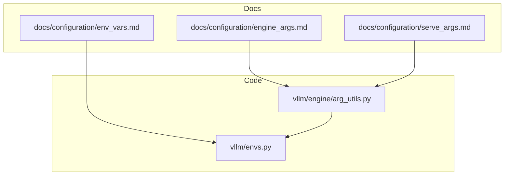
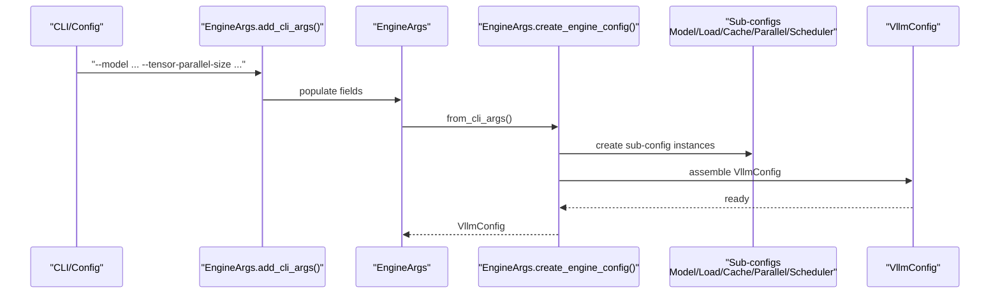
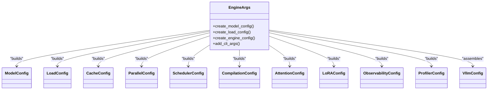

# Engine Arguments

<cite>
**Referenced Files in This Document**
- [engine_args.md](file://docs/configuration/engine_args.md)
- [env_vars.md](file://docs/configuration/env_vars.md)
- [serve_args.md](file://docs/configuration/serve_args.md)
- [arg_utils.py](file://vllm/engine/arg_utils.py)
- [envs.py](file://vllm/envs.py)
</cite>

## Table of Contents
1. [Introduction](#introduction)
2. [Project Structure](#project-structure)
3. [Core Components](#core-components)
4. [Architecture Overview](#architecture-overview)
5. [Detailed Component Analysis](#detailed-component-analysis)
6. [Dependency Analysis](#dependency-analysis)
7. [Performance Considerations](#performance-considerations)
8. [Troubleshooting Guide](#troubleshooting-guide)
9. [Conclusion](#conclusion)
10. [Appendices](#appendices)

## Introduction
This document explains the vLLM engine arguments and configuration options that control model loading, memory allocation, scheduling, and performance tuning. It covers:
- Engine-level parameters for model loading, memory allocation, and concurrency
- Batch sizing and sequence length limits
- Distributed inference settings (tensor, pipeline, data, and expert parallelism)
- Environment variable overrides and precedence with command-line arguments
- Practical examples for common deployment scenarios
- Guidance for selecting parameters based on hardware and workload

## Project Structure
The engine argument system is defined by a central dataclass and its CLI parser, which aggregates configuration from multiple sub-config classes (ModelConfig, LoadConfig, CacheConfig, ParallelConfig, SchedulerConfig, etc.). The documentation pages describe how to use these arguments for offline inference and the OpenAI-compatible server.

**Diagram sources**
- [engine_args.md](file://docs/configuration/engine_args.md#L1-L23)
- [env_vars.md](file://docs/configuration/env_vars.md#L1-L13)
- [serve_args.md](file://docs/configuration/serve_args.md#L1-L36)
- [arg_utils.py](file://vllm/engine/arg_utils.py#L354-L1175)
- [envs.py](file://vllm/envs.py#L448-L540)

**Section sources**
- [engine_args.md](file://docs/configuration/engine_args.md#L1-L23)
- [arg_utils.py](file://vllm/engine/arg_utils.py#L354-L1175)

## Core Components
- EngineArgs: Central engine configuration dataclass that aggregates fields from ModelConfig, LoadConfig, CacheConfig, ParallelConfig, SchedulerConfig, and other sub-configs. It also defines CLI argument parsing and validation.
- AsyncEngineArgs: Asynchronous engine variant with additional flags (e.g., request logging).
- VllmConfig: Aggregates all sub-configs into a single engine configuration object used internally by the engine.

Key responsibilities:
- Parse and validate CLI arguments
- Build sub-config objects (ModelConfig, LoadConfig, CacheConfig, ParallelConfig, SchedulerConfig, etc.)
- Apply defaults and constraints based on hardware and model capabilities
- Enforce mutual exclusivity and compatibility checks (e.g., attention backend vs attention_config.backend)

**Section sources**
- [arg_utils.py](file://vllm/engine/arg_utils.py#L354-L1175)
- [arg_utils.py](file://vllm/engine/arg_utils.py#L1177-L1739)

## Architecture Overview
The engine argument pipeline transforms CLI/environment inputs into a unified VllmConfig consumed by the engine.

**Diagram sources**
- [arg_utils.py](file://vllm/engine/arg_utils.py#L616-L1175)
- [arg_utils.py](file://vllm/engine/arg_utils.py#L1314-L1739)

## Detailed Component Analysis

### EngineArgs: Model Loading Settings
- Model identification and tokenizer:
  - model, tokenizer, tokenizer_mode, trust_remote_code, revision, code_revision, tokenizer_revision
  - served_model_name, skip_tokenizer_init, enable_prompt_embeds
- Quantization and dtype:
  - dtype, quantization, enforce_eager, override_attention_dtype
- Model resolution and config:
  - hf_config_path, config_format, hf_overrides, generation_config, override_generation_config
- Media and multimodal:
  - allowed_local_media_path, allowed_media_domains, limit_mm_per_prompt, enable_mm_embeds, interleave_mm_strings, media_io_kwargs, mm_processor_kwargs, mm_processor_cache_gb, mm_processor_cache_type, mm_shm_cache_max_object_size_mb, mm_encoder_tp_mode, mm_encoder_attn_backend, io_processor_plugin, skip_mm_profiling, video_pruning_rate
- LoRA support:
  - enable_lora, max_loras, max_lora_rank, default_mm_loras, fully_sharded_loras, max_cpu_loras, lora_dtype
- Pooling and logits processors:
  - pooler_config, logits_processor_pattern, logits_processors
- Sleep mode and model impl:
  - enable_sleep_mode, model_impl

Validation and defaults:
- HF offline mode replaces model/tokenizer identifiers with local paths when Hugging Face Hub is offline.
- GGUF and BitsAndBytes loaders are auto-selected based on model format and quantization.

**Section sources**
- [arg_utils.py](file://vllm/engine/arg_utils.py#L354-L703)
- [arg_utils.py](file://vllm/engine/arg_utils.py#L1187-L1249)

### EngineArgs: Memory Allocation Controls
- KV cache configuration:
  - kv_cache_dtype, block_size, gpu_memory_utilization, kv_cache_memory_bytes, num_gpu_blocks_override, enable_prefix_caching, prefix_caching_hash_algo
  - swap_space, cpu_offload_gb, calculate_kv_scales, kv_sharing_fast_prefill
  - mamba_cache_dtype, mamba_ssm_cache_dtype, mamba_block_size
  - kv_offloading_size, kv_offloading_backend
- CUDA graph capture:
  - cudagraph_capture_sizes, max_cudagraph_capture_size

Notes:
- KV cache memory can be specified in human-readable form (e.g., kilo/mega/giga multipliers).
- Prefix caching and chunked prefill defaults are inferred from model capabilities and platform/architecture.

**Section sources**
- [arg_utils.py](file://vllm/engine/arg_utils.py#L887-L937)
- [arg_utils.py](file://vllm/engine/arg_utils.py#L2045-L2088)

### EngineArgs: Concurrency and Scheduling
- Batch sizing:
  - max_num_batched_tokens, max_num_seqs
  - Defaults are selected based on hardware (e.g., H100/MI300x vs others) and usage context (LLM class vs API server).
- Partial prefills and long prefill thresholds:
  - max_num_partial_prefills, max_long_partial_prefills, long_prefill_token_threshold
- Chunked prefill and hybrid KV cache manager:
  - enable_chunked_prefill, disable_chunked_mm_input, disable_hybrid_kv_cache_manager
- Scheduling policy and async scheduling:
  - scheduling_policy, scheduler_cls, async_scheduling, stream_interval

Guidance:
- Increase max_num_batched_tokens for higher throughput on large GPUs.
- Tune max_num_seqs to balance latency and memory footprint.
- Enable chunked prefill for longer contexts when supported by the model.

**Section sources**
- [arg_utils.py](file://vllm/engine/arg_utils.py#L1051-L1110)
- [arg_utils.py](file://vllm/engine/arg_utils.py#L1787-L2004)
- [arg_utils.py](file://vllm/engine/arg_utils.py#L1870-L1944)

### EngineArgs: Distributed Inference (Tensor, Pipeline, Data, Expert Parallelism)
- Tensor parallelism:
  - tensor_parallel_size
- Pipeline parallelism:
  - pipeline_parallel_size, distributed_executor_backend, master_addr, master_port, nnodes, node_rank
- Decode and prefill context parallelism:
  - decode_context_parallel_size, prefill_context_parallel_size, dcp_kv_cache_interleave_size, cp_kv_cache_interleave_size
- Data parallelism:
  - data_parallel_size, data_parallel_rank, data_parallel_start_rank, data_parallel_size_local, data_parallel_address, data_parallel_rpc_port, data_parallel_backend, data_parallel_hybrid_lb, data_parallel_external_lb
- Expert parallelism:
  - enable_expert_parallel, all2all_backend, enable_eplb, eplb_config, expert_placement_strategy
- DBO and u-batch:
  - enable_dbo, ubatch_size, dbo_decode_token_threshold, dbo_prefill_token_threshold
- Communication and workers:
  - disable_nccl_for_dp_synchronization, max_parallel_loading_workers, disable_custom_all_reduce, ray_workers_use_nsight, worker_cls, worker_extension_cls

Constraints and validations:
- tp_size must be divisible by dcp_size for decode context parallelism.
- Mutually exclusive settings enforced (e.g., attention_backend vs attention_config.backend).
- External and hybrid load balancing modes require specific combinations of rank/local size settings.

**Section sources**
- [arg_utils.py](file://vllm/engine/arg_utils.py#L750-L886)
- [arg_utils.py](file://vllm/engine/arg_utils.py#L1360-L1370)
- [arg_utils.py](file://vllm/engine/arg_utils.py#L1558-L1597)
- [arg_utils.py](file://vllm/engine/arg_utils.py#L1662-L1677)

### Advanced Configuration Options
- Structured outputs:
  - reasoning_parser, reasoning_parser_plugin, structured_outputs_config
- Observability:
  - show_hidden_metrics_for_version, otlp_traces_endpoint, collect_detailed_traces, kv_cache_metrics, kv_cache_metrics_sample, cudagraph_metrics, enable_layerwise_nvtx_tracing, enable_mfu_metrics
- Compilation and attention:
  - compilation_config, attention_config, attention_backend
- Profiling and additional config:
  - profiler_config, additional_config
- Optimization level:
  - optimization_level

**Section sources**
- [arg_utils.py](file://vllm/engine/arg_utils.py#L1007-L1050)
- [arg_utils.py](file://vllm/engine/arg_utils.py#L1125-L1161)
- [arg_utils.py](file://vllm/engine/arg_utils.py#L1689-L1699)
- [arg_utils.py](file://vllm/engine/arg_utils.py#L1700-L1737)

### Practical Examples of Engine Argument Combinations
Note: The following are scenario descriptions. Replace placeholders with actual values appropriate for your deployment.

- Single-GPU, high throughput:
  - Set tensor_parallel_size=1, pipeline_parallel_size=1, data_parallel_size=1
  - Increase max_num_batched_tokens and max_num_seqs based on GPU memory
  - Keep enable_prefix_caching and enable_chunked_prefill enabled if model supports them

- Multi-GPU tensor parallel:
  - Set tensor_parallel_size=N (>1)
  - Keep pipeline_parallel_size=1
  - Adjust max_num_batched_tokens proportionally to N

- Multi-node pipeline parallel:
  - Set pipeline_parallel_size=P (>1), tensor_parallel_size=T, data_parallel_size=D
  - Configure distributed_executor_backend, master_addr, master_port, nnodes, node_rank
  - Ensure tp_size divisible by dcp_size for decode context parallelism

- Expert-parallel MoE:
  - Enable enable_expert_parallel
  - Choose all2all_backend and expert_placement_strategy
  - Tune ubatch_size and DBO thresholds for decode/prefill

- Memory-constrained deployment:
  - Lower gpu_memory_utilization or set kv_cache_memory_bytes
  - Enable prefix caching and swap_space
  - Reduce max_num_batched_tokens and max_num_seqs

- Long-context models:
  - Enable enable_chunked_prefill and consider long_prefill_token_threshold
  - Ensure model supports chunked prefill; otherwise expect warnings

[No sources needed since this section provides scenario guidance]

### Environment Variable Overrides and Precedence
Environment variables:
- General runtime and platform settings (e.g., VLLM_TARGET_DEVICE, VLLM_FLOAT32_MATMUL_PRECISION, VLLM_CACHE_ROOT, VLLM_CONFIG_ROOT)
- Distributed and communication settings (e.g., VLLM_HOST_IP, VLLM_PORT, VLLM_DP_RANK, VLLM_DP_SIZE, VLLM_DP_MASTER_IP, VLLM_DP_MASTER_PORT)
- Attention and backend selection (e.g., VLLM_ATTENTION_BACKEND, VLLM_USE_FLASHINFER_SAMPLER, VLLM_FLASH_ATTN_VERSION)
- MoE and expert parallelism (e.g., VLLM_ALL2ALL_BACKEND, VLLM_FLASHINFER_MOE_BACKEND, VLLM_MOE_DP_CHUNK_SIZE)
- Profiling and debugging (e.g., VLLM_TORCH_CUDA_PROFILE, VLLM_PROFILER_DELAY_ITERS, VLLM_CUSTOM_SCOPES_FOR_PROFILING)
- Media and timeouts (e.g., VLLM_IMAGE_FETCH_TIMEOUT, VLLM_VIDEO_FETCH_TIMEOUT, VLLM_AUDIO_FETCH_TIMEOUT)

Precedence:
- Command-line arguments override values from a YAML configuration file.
- YAML configuration file overrides environment variables.
- Environment variables override defaults.

Notes:
- VLLM_PORT and VLLM_HOST_IP are for internal usage; they do not control the API server’s host/port.
- Kubernetes users should avoid naming services “vllm” to prevent conflicts with environment variables set by the platform.

**Section sources**
- [env_vars.md](file://docs/configuration/env_vars.md#L1-L13)
- [envs.py](file://vllm/envs.py#L448-L540)
- [serve_args.md](file://docs/configuration/serve_args.md#L27-L36)

## Dependency Analysis
EngineArgs composes multiple sub-config classes and enforces cross-field constraints. The following diagram shows the relationships among major components.

**Diagram sources**
- [arg_utils.py](file://vllm/engine/arg_utils.py#L1187-L1739)

**Section sources**
- [arg_utils.py](file://vllm/engine/arg_utils.py#L1187-L1739)

## Performance Considerations
- Throughput vs latency trade-offs:
  - Larger max_num_batched_tokens improves throughput but may increase latency.
  - Smaller max_num_seqs reduces memory pressure and can improve latency.
- KV cache sizing:
  - Increase gpu_memory_utilization or set kv_cache_memory_bytes for longer contexts.
  - Enable prefix caching to reduce recomputation.
- Chunked prefill:
  - Enable for models that support it to handle long contexts efficiently.
- Attention backend:
  - Choose attention_backend aligned with model and hardware capabilities.
- CUDA graph capture:
  - Use cudagraph_capture_sizes and max_cudagraph_capture_size to optimize repeated workloads.
- DCP and DP:
  - Ensure tp_size divisible by dcp_size for decode context parallelism.
  - Use external/hybrid load balancing for multi-node deployments.

[No sources needed since this section provides general guidance]

## Troubleshooting Guide
Common issues and resolutions:
- Assertion failures for decode context parallelism:
  - Ensure tensor_parallel_size is divisible by decode_context_parallel_size.
- Conflicts between attention backend settings:
  - Do not set both attention_backend and attention_config.backend.
- Pipeline parallelism unsupported:
  - Verify distributed_executor_backend supports pipeline parallelism or use supported executors/backends.
- LoRA and speculative decoding constraints:
  - Ensure max_num_batched_tokens meets the minimum requirement relative to num_speculative_tokens and max_num_seqs.
- Multi-node DP configuration:
  - Set data_parallel_rank or infer it from node_rank; ensure data_parallel_size_local and external/hybrid LB modes are consistent.
- Environment variable conflicts:
  - Avoid naming Kubernetes services “vllm”; VLLM_PORT/VLLM_HOST_IP are for internal usage.

**Section sources**
- [arg_utils.py](file://vllm/engine/arg_utils.py#L1360-L1370)
- [arg_utils.py](file://vllm/engine/arg_utils.py#L1662-L1677)
- [arg_utils.py](file://vllm/engine/arg_utils.py#L1644-L1657)
- [arg_utils.py](file://vllm/engine/arg_utils.py#L1769-L1785)
- [serve_args.md](file://docs/configuration/serve_args.md#L27-L36)

## Conclusion
The vLLM engine arguments provide a comprehensive interface to control model loading, memory usage, scheduling, and distributed execution. By understanding the relationships among sub-configurations, applying sensible defaults based on hardware, and following the precedence rules for arguments and environment variables, you can tune the engine for diverse deployment scenarios ranging from single-GPU to multi-node, multi-PPU systems.

## Appendices

### Appendix A: CLI and YAML Configuration
- Use vllm serve with a YAML configuration file to specify engine arguments.
- Command-line arguments take precedence over YAML values, which override environment variables.

**Section sources**
- [serve_args.md](file://docs/configuration/serve_args.md#L1-L36)

### Appendix B: Environment Variables Reference
- Platform and runtime:
  - VLLM_TARGET_DEVICE, VLLM_FLOAT32_MATMUL_PRECISION, VLLM_CACHE_ROOT, VLLM_CONFIG_ROOT
- Networking and distributed:
  - VLLM_HOST_IP, VLLM_PORT, VLLM_DP_RANK, VLLM_DP_SIZE, VLLM_DP_MASTER_IP, VLLM_DP_MASTER_PORT
- Attention and backends:
  - VLLM_ATTENTION_BACKEND, VLLM_USE_FLASHINFER_SAMPLER, VLLM_FLASH_ATTN_VERSION
- MoE and expert parallelism:
  - VLLM_ALL2ALL_BACKEND, VLLM_FLASHINFER_MOE_BACKEND, VLLM_MOE_DP_CHUNK_SIZE
- Profiling and debugging:
  - VLLM_TORCH_CUDA_PROFILE, VLLM_PROFILER_DELAY_ITERS, VLLM_CUSTOM_SCOPES_FOR_PROFILING
- Media and timeouts:
  - VLLM_IMAGE_FETCH_TIMEOUT, VLLM_VIDEO_FETCH_TIMEOUT, VLLM_AUDIO_FETCH_TIMEOUT

**Section sources**
- [env_vars.md](file://docs/configuration/env_vars.md#L1-L13)
- [envs.py](file://vllm/envs.py#L448-L540)