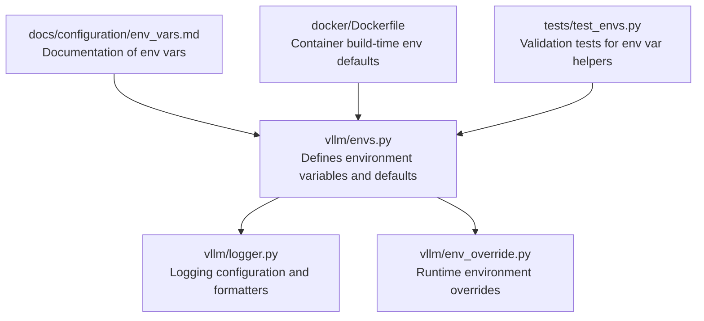
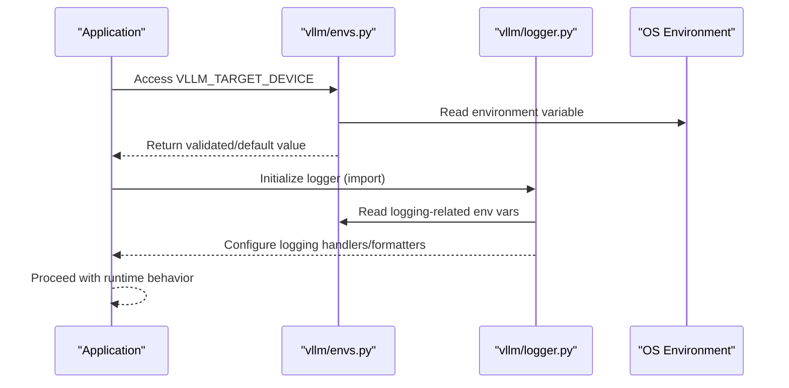
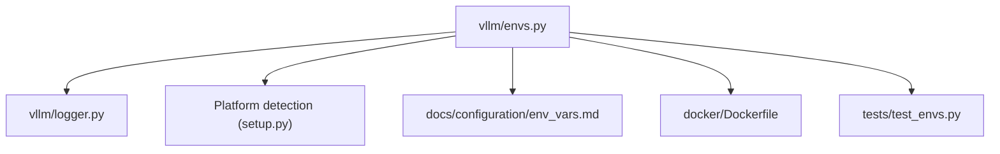

# Environment Variables

<cite>
**Referenced Files in This Document**
- [envs.py](file://vllm/envs.py)
- [env_override.py](file://vllm/env_override.py)
- [logger.py](file://vllm/logger.py)
- [env_vars.md](file://docs/configuration/env_vars.md)
- [Dockerfile](file://docker/Dockerfile)
- [test_envs.py](file://tests/test_envs.py)
</cite>

## Table of Contents
1. [Introduction](#introduction)
2. [Project Structure](#project-structure)
3. [Core Components](#core-components)
4. [Architecture Overview](#architecture-overview)
5. [Detailed Component Analysis](#detailed-component-analysis)
6. [Dependency Analysis](#dependency-analysis)
7. [Performance Considerations](#performance-considerations)
8. [Troubleshooting Guide](#troubleshooting-guide)
9. [Conclusion](#conclusion)
10. [Appendices](#appendices)

## Introduction
This document provides comprehensive guidance on vLLM’s environment variables and runtime configuration. It covers hardware selection, performance tuning, debugging controls, security-related settings, logging configuration, observability, and platform-specific considerations. It also explains variable precedence, default values, and offers practical examples for containerized and bare-metal deployments. Finally, it includes troubleshooting advice for common misconfigurations.

## Project Structure
The environment variable system is centralized in a single module that defines defaults, validation, and lazy evaluation. Logging configuration is handled separately and integrates with environment variables. Documentation for environment variables is published alongside the codebase.

**Diagram sources**
- [envs.py](file://vllm/envs.py#L448-L1574)
- [logger.py](file://vllm/logger.py#L1-L120)
- [env_override.py](file://vllm/env_override.py#L1-L40)
- [env_vars.md](file://docs/configuration/env_vars.md#L1-L13)
- [Dockerfile](file://docker/Dockerfile#L170-L236)
- [test_envs.py](file://tests/test_envs.py#L81-L179)

**Section sources**
- [envs.py](file://vllm/envs.py#L448-L1574)
- [logger.py](file://vllm/logger.py#L1-L120)
- [env_override.py](file://vllm/env_override.py#L1-L40)
- [env_vars.md](file://docs/configuration/env_vars.md#L1-L13)
- [Dockerfile](file://docker/Dockerfile#L170-L236)
- [test_envs.py](file://tests/test_envs.py#L81-L179)

## Core Components
- Centralized environment variable registry and validators:
  - Defines default values and lazy getters for each variable.
  - Provides helpers to validate enumerated choices and parse comma-separated lists/sets.
  - Implements caching for performance after service initialization.
- Logging configuration:
  - Builds a default logging configuration based on environment variables.
  - Supports colored/un-colored output, configurable streams, and external config files.
- Runtime environment overrides:
  - Applies global environment tweaks to improve stability and performance for specific PyTorch versions.
- Documentation:
  - The official documentation page references the canonical environment variable definition region in the code.

Key responsibilities:
- Provide a single source of truth for environment variable semantics.
- Ensure robust validation and clear error messages for invalid values.
- Offer flexible logging configuration for observability and debugging.

**Section sources**
- [envs.py](file://vllm/envs.py#L448-L1574)
- [logger.py](file://vllm/logger.py#L1-L120)
- [env_override.py](file://vllm/env_override.py#L1-L40)
- [env_vars.md](file://docs/configuration/env_vars.md#L1-L13)

## Architecture Overview
The environment variable subsystem is designed as a lazy, validated registry. Consumers access variables through a module attribute interface. Logging configuration is applied at import time and can be overridden by an external logging configuration file.

**Diagram sources**
- [envs.py](file://vllm/envs.py#L1579-L1640)
- [logger.py](file://vllm/logger.py#L158-L206)

**Section sources**
- [envs.py](file://vllm/envs.py#L1579-L1640)
- [logger.py](file://vllm/logger.py#L158-L206)

## Detailed Component Analysis

### Environment Variable Registry and Validation
- Central registry:
  - A dictionary maps each variable name to a getter function that reads from the environment and applies conversions or validations.
  - Includes installation-time and runtime variables.
- Validation helpers:
  - Enumerated-choice validator ensures values are among allowed options, with optional case sensitivity.
  - Comma-separated list/set validators parse and validate each element independently.
- Caching:
  - After service initialization, getters are cached to avoid repeated environment reads.

Common categories:
- Hardware selection and platform:
  - Target device, CUDA/ROCm/TPU/XPU detection, and related flags.
- Performance tuning:
  - Attention backends, quantization kernels, compile caches, and graph capture behavior.
- Observability and logging:
  - Logging level, stream, color, prefixes, intervals, and tracing.
- Security and privacy:
  - Usage statistics toggles, Do Not Track, insecure serialization flag, and API key.
- Distributed and multi-node:
  - Host IP, port, RPC paths, DP/PP/Ray settings, and communication backends.
- Media and asset handling:
  - Fetch timeouts, connectors, and cache paths.
- Platform-specific:
  - ROCm-specific accelerations, TPU settings, and NVFP4 dispatch.

Examples of variable families:
- Hardware/platform:
  - VLLM_TARGET_DEVICE, VLLM_MAIN_CUDA_VERSION, VLLM_FLOAT32_MATMUL_PRECISION
- Performance/backends:
  - VLLM_ATTENTION_BACKEND, VLLM_USE_FLASHINFER_MOE_FP8, VLLM_USE_DEEP_GEMM
- Logging/observability:
  - VLLM_LOGGING_LEVEL, VLLM_LOGGING_STREAM, VLLM_LOGGING_COLOR, VLLM_TRACE_FUNCTION
- Security/privacy:
  - VLLM_API_KEY, VLLM_DO_NOT_TRACK, VLLM_ALLOW_INSECURE_SERIALIZATION
- Distributed:
  - VLLM_HOST_IP, VLLM_PORT, VLLM_DP_SIZE, VLLM_RAY_PER_WORKER_GPUS

Precedence and defaults:
- If an environment variable is not set, the registry supplies a default value or None.
- For enumerated variables, invalid values raise a clear error with allowed options.
- For lists/sets, empty or whitespace-only inputs revert to defaults; invalid items raise errors.

Platform-specific notes:
- On macOS, target device may be forced to CPU if CUDA/ROCm are unavailable.
- Container builds set defaults for CUDA architectures and related environment variables.

**Section sources**
- [envs.py](file://vllm/envs.py#L448-L1574)
- [envs.py](file://vllm/envs.py#L298-L415)
- [envs.py](file://vllm/envs.py#L1579-L1752)
- [Dockerfile](file://docker/Dockerfile#L140-L150)
- [Dockerfile](file://docker/Dockerfile#L223-L236)

### Logging Configuration
- Default configuration:
  - Level, stream, and formatter are derived from environment variables.
  - Color output is enabled when appropriate terminals support it.
- External configuration:
  - An external logging configuration file can override the default configuration.
  - If an external config is provided but logging is disabled, a runtime error is raised.
- Scope-aware logging:
  - Helpers provide “once” variants for debug/info/warning to avoid repetitive messages.

Key variables:
- VLLM_CONFIGURE_LOGGING, VLLM_LOGGING_CONFIG_PATH, VLLM_LOGGING_LEVEL, VLLM_LOGGING_STREAM, VLLM_LOGGING_PREFIX, VLLM_LOGGING_COLOR, NO_COLOR, VLLM_LOG_STATS_INTERVAL

Behavior:
- When VLLM_CONFIGURE_LOGGING is false, VLLM_LOGGING_CONFIG_PATH must not be set.
- Transformations preserve backward compatibility for older formatter class names.

**Section sources**
- [logger.py](file://vllm/logger.py#L1-L120)
- [logger.py](file://vllm/logger.py#L158-L206)
- [logger.py](file://vllm/logger.py#L206-L238)

### Runtime Environment Overrides
- Global environment adjustments:
  - Ensures NVML-based CUDA availability checks are used.
  - Caps TorchInductor compile threads to reduce contention.
  - Patches specific PyTorch 2.9 Inductor internals for correctness and performance.

These overrides apply to all processes started via the vLLM package and help stabilize compilation and runtime behavior.

**Section sources**
- [env_override.py](file://vllm/env_override.py#L1-L40)
- [env_override.py](file://vllm/env_override.py#L243-L379)

### Validation and Testing
- Tests validate:
  - Default values when variables are not set.
  - Case-sensitive and case-insensitive validation modes.
  - Parsing of comma-separated lists and sets, including trimming and filtering.
  - Callable choice providers and error reporting for invalid values.

This ensures robust behavior across diverse deployment scenarios.

**Section sources**
- [test_envs.py](file://tests/test_envs.py#L81-L179)
- [test_envs.py](file://tests/test_envs.py#L170-L399)

## Dependency Analysis
The environment variable system interacts with logging and platform detection modules. Logging depends on environment variables for configuration. Platform detection influences defaults for target device and related flags.

**Diagram sources**
- [envs.py](file://vllm/envs.py#L448-L1574)
- [logger.py](file://vllm/logger.py#L1-L120)
- [env_vars.md](file://docs/configuration/env_vars.md#L1-L13)
- [Dockerfile](file://docker/Dockerfile#L170-L236)
- [test_envs.py](file://tests/test_envs.py#L81-L179)

**Section sources**
- [envs.py](file://vllm/envs.py#L448-L1574)
- [logger.py](file://vllm/logger.py#L1-L120)
- [env_vars.md](file://docs/configuration/env_vars.md#L1-L13)
- [Dockerfile](file://docker/Dockerfile#L170-L236)
- [test_envs.py](file://tests/test_envs.py#L81-L179)

## Performance Considerations
- Compile cache and AOT:
  - Use AOT compilation flags to warm up and reuse compiled models.
  - Control compile cache save format for inspection vs. multiprocess safety.
- Attention and MoE backends:
  - Choose attention backends and MoE kernels suited to hardware capabilities.
- Threading and compilation:
  - Limit TorchInductor compile threads to reduce contention.
  - Tune parallel compilation jobs and NVCC threads for builds.
- CUDA graph and GC:
  - Adjust CUDA graph capture behavior and garbage collection during capture.

[No sources needed since this section provides general guidance]

## Troubleshooting Guide
Common misconfigurations and resolutions:
- Invalid enumerated values:
  - Symptom: Startup error mentioning allowed options.
  - Resolution: Correct the environment variable to one of the allowed values.
- Conflicting logging configuration:
  - Symptom: Runtime error when disabling logging but providing an external config.
  - Resolution: Either enable logging or unset the external config path.
- Port misconfiguration:
  - Symptom: API server not reachable or unexpected behavior.
  - Resolution: Remember that VLLM_PORT/VLLM_HOST_IP configure internal usage; use server CLI arguments for API server host/port.
- Kubernetes service name collision:
  - Symptom: Unexpected environment variables overriding vLLM settings.
  - Resolution: Avoid naming Kubernetes services with prefixes that collide with vLLM variable names.
- macOS target device:
  - Symptom: Automatic fallback to CPU.
  - Resolution: Ensure CUDA/ROCm availability or explicitly set target device.
- TorchInductor instability:
  - Symptom: Slow compilation or crashes.
  - Resolution: Apply runtime overrides and cap compile threads.

**Section sources**
- [envs.py](file://vllm/envs.py#L448-L1574)
- [logger.py](file://vllm/logger.py#L158-L206)
- [env_vars.md](file://docs/configuration/env_vars.md#L1-L13)
- [Dockerfile](file://docker/Dockerfile#L170-L236)

## Conclusion
vLLM’s environment variable system centralizes configuration with strong validation, sensible defaults, and flexible logging. By understanding precedence, defaults, and platform-specific nuances, operators can tune performance, enable observability, and harden security across containerized and bare-metal deployments.

[No sources needed since this section summarizes without analyzing specific files]

## Appendices

### Appendix A: Variable Categories and Examples
- Hardware/platform:
  - VLLM_TARGET_DEVICE, VLLM_MAIN_CUDA_VERSION, VLLM_FLOAT32_MATMUL_PRECISION
- Performance/backends:
  - VLLM_ATTENTION_BACKEND, VLLM_USE_FLASHINFER_MOE_FP8, VLLM_USE_DEEP_GEMM
- Logging/observability:
  - VLLM_LOGGING_LEVEL, VLLM_LOGGING_STREAM, VLLM_LOGGING_COLOR, VLLM_TRACE_FUNCTION
- Security/privacy:
  - VLLM_API_KEY, VLLM_DO_NOT_TRACK, VLLM_ALLOW_INSECURE_SERIALIZATION
- Distributed:
  - VLLM_HOST_IP, VLLM_PORT, VLLM_DP_SIZE, VLLM_RAY_PER_WORKER_GPUS
- Media and assets:
  - VLLM_IMAGE_FETCH_TIMEOUT, VLLM_VIDEO_FETCH_TIMEOUT, VLLM_ASSETS_CACHE

**Section sources**
- [envs.py](file://vllm/envs.py#L448-L1574)

### Appendix B: Deployment Scenarios
- Containerized (Docker):
  - Build-time defaults for CUDA architectures and related environment variables are set in the Dockerfile.
  - Example variables set during build: VLLM_TARGET_DEVICE, MAX_JOBS, NVCC_THREADS.
- Bare-metal:
  - Set platform variables (e.g., VLLM_TARGET_DEVICE) and performance knobs (e.g., VLLM_ATTENTION_BACKEND).
  - Configure logging via VLLM_LOGGING_* variables and optionally provide an external logging config file.

**Section sources**
- [Dockerfile](file://docker/Dockerfile#L140-L150)
- [Dockerfile](file://docker/Dockerfile#L223-L236)
- [envs.py](file://vllm/envs.py#L448-L1574)