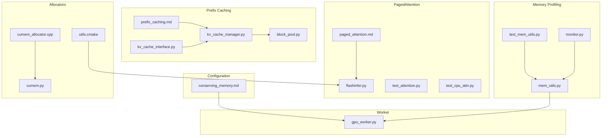
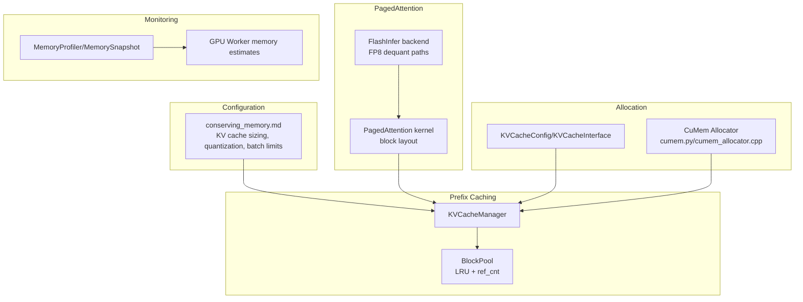
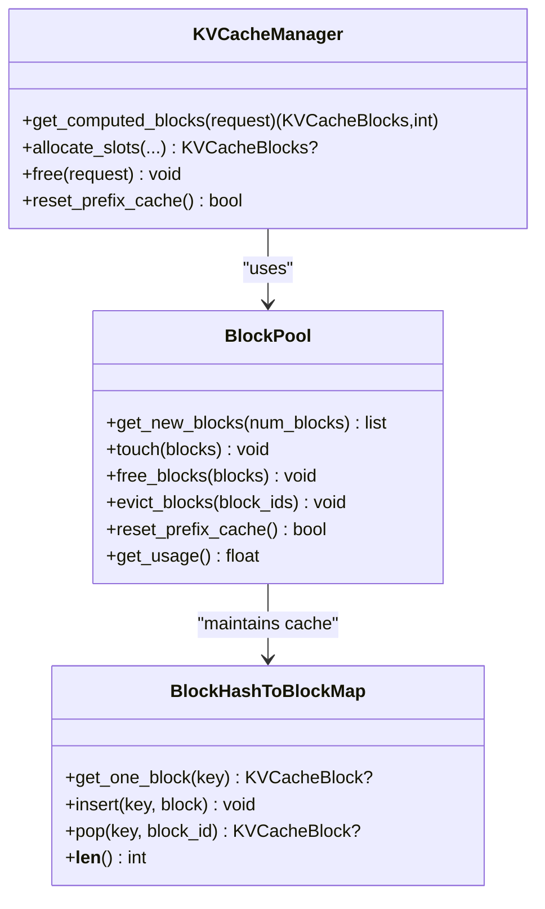
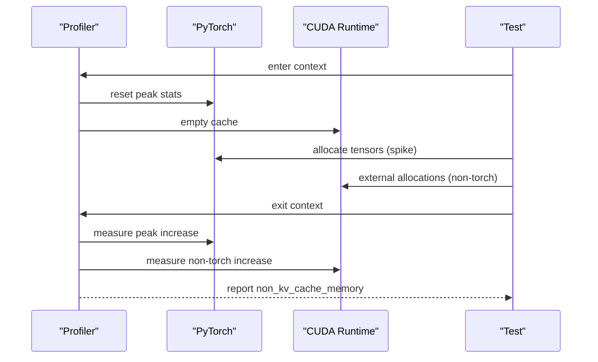
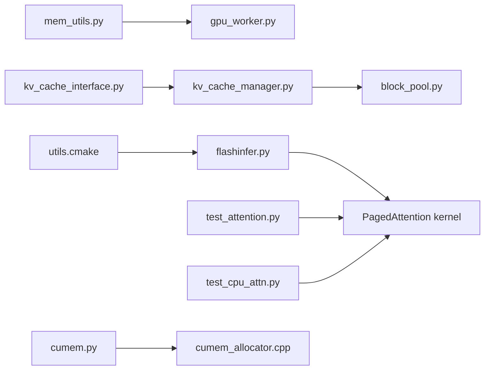

# Memory Optimization

<cite>
**Referenced Files in This Document**
- [conserving_memory.md](file://docs/configuration/conserving_memory.md)
- [paged_attention.md](file://docs/design/paged_attention.md)
- [prefix_caching.md](file://docs/design/prefix_caching.md)
- [kv_cache_manager.py](file://vllm/v1/core/kv_cache_manager.py)
- [block_pool.py](file://vllm/v1/core/block_pool.py)
- [kv_cache_interface.py](file://vllm/v1/kv_cache_interface.py)
- [gpu_worker.py](file://vllm/v1/worker/gpu_worker.py)
- [mem_utils.py](file://vllm/utils/mem_utils.py)
- [test_mem_utils.py](file://tests/utils_/test_mem_utils.py)
- [monitor.py](file://tests/vllm_test_utils/vllm_test_utils/monitor.py)
- [flashinfer.py](file://vllm/v1/attention/backends/flashinfer.py)
- [test_attention.py](file://tests/kernels/attention/test_attention.py)
- [test_cpu_attn.py](file://tests/kernels/attention/test_cpu_attn.py)
- [cumem_allocator.cpp](file://csrc/cumem_allocator.cpp)
- [cumem.py](file://vllm/device_allocator/cumem.py)
- [utils.cmake](file://cmake/utils.cmake)
</cite>

## Table of Contents
1. [Introduction](#introduction)
2. [Project Structure](#project-structure)
3. [Core Components](#core-components)
4. [Architecture Overview](#architecture-overview)
5. [Detailed Component Analysis](#detailed-component-analysis)
6. [Dependency Analysis](#dependency-analysis)
7. [Performance Considerations](#performance-considerations)
8. [Troubleshooting Guide](#troubleshooting-guide)
9. [Conclusion](#conclusion)
10. [Appendices](#appendices)

## Introduction
This document provides a comprehensive guide to memory optimization strategies for vLLM production deployments. It focuses on PagedAttention configuration, KV cache sizing and allocation patterns, prefix caching mechanisms, memory pooling and garbage collection optimization, and advanced techniques for memory-efficient inference such as dynamic batching, sequence compression, and memory-mapped storage. It also covers practical memory profiling, bottleneck identification, hardware-specific optimizations for different GPU architectures, and guidance on memory monitoring, alerting thresholds, and capacity planning.

## Project Structure
The memory optimization capabilities in vLLM span several layers:
- Configuration and tuning guidance for memory conservation
- PagedAttention design and kernel memory layout
- Prefix caching data structures and lifecycle management
- KV cache sizing and memory allocation interfaces
- Memory profiling utilities and monitoring helpers
- Hardware-specific memory allocators and CUDA graph considerations

**Diagram sources**
- [conserving_memory.md](file://docs/configuration/conserving_memory.md#L1-L186)
- [paged_attention.md](file://docs/design/paged_attention.md#L1-L513)
- [prefix_caching.md](file://docs/design/prefix_caching.md#L1-L232)
- [kv_cache_manager.py](file://vllm/v1/core/kv_cache_manager.py#L1-L420)
- [block_pool.py](file://vllm/v1/core/block_pool.py#L1-L486)
- [kv_cache_interface.py](file://vllm/v1/kv_cache_interface.py#L298-L307)
- [gpu_worker.py](file://vllm/v1/worker/gpu_worker.py#L330-L480)
- [mem_utils.py](file://vllm/utils/mem_utils.py#L1-L256)
- [test_mem_utils.py](file://tests/utils_/test_mem_utils.py#L1-L63)
- [monitor.py](file://tests/vllm_test_utils/vllm_test_utils/monitor.py#L45-L75)
- [flashinfer.py](file://vllm/v1/attention/backends/flashinfer.py#L104-L128)
- [test_attention.py](file://tests/kernels/attention/test_attention.py#L87-L280)
- [test_cpu_attn.py](file://tests/kernels/attention/test_cpu_attn.py#L90-L130)
- [cumem_allocator.cpp](file://csrc/cumem_allocator.cpp#L120-L405)
- [cumem.py](file://vllm/device_allocator/cumem.py#L62-L288)
- [utils.cmake](file://cmake/utils.cmake#L310-L425)

**Section sources**
- [conserving_memory.md](file://docs/configuration/conserving_memory.md#L1-L186)
- [paged_attention.md](file://docs/design/paged_attention.md#L1-L513)
- [prefix_caching.md](file://docs/design/prefix_caching.md#L1-L232)
- [kv_cache_manager.py](file://vllm/v1/core/kv_cache_manager.py#L1-L420)
- [block_pool.py](file://vllm/v1/core/block_pool.py#L1-L486)
- [kv_cache_interface.py](file://vllm/v1/kv_cache_interface.py#L298-L307)
- [gpu_worker.py](file://vllm/v1/worker/gpu_worker.py#L330-L480)
- [mem_utils.py](file://vllm/utils/mem_utils.py#L1-L256)
- [test_mem_utils.py](file://tests/utils_/test_mem_utils.py#L1-L63)
- [monitor.py](file://tests/vllm_test_utils/vllm_test_utils/monitor.py#L45-L75)
- [flashinfer.py](file://vllm/v1/attention/backends/flashinfer.py#L104-L128)
- [test_attention.py](file://tests/kernels/attention/test_attention.py#L87-L280)
- [test_cpu_attn.py](file://tests/kernels/attention/test_cpu_attn.py#L90-L130)
- [cumem_allocator.cpp](file://csrc/cumem_allocator.cpp#L120-L405)
- [cumem.py](file://vllm/device_allocator/cumem.py#L62-L288)
- [utils.cmake](file://cmake/utils.cmake#L310-L425)

## Core Components
- PagedAttention memory layout and block-based KV cache storage
- Prefix caching with hash-based block reuse and LRU eviction
- KV cache sizing and allocation via KVCacheConfig and block pools
- Memory profiling and monitoring utilities for GPU memory categorization
- Hardware-specific memory allocators and CUDA graph considerations

Key implementation references:
- PagedAttention memory layout and block indexing: [paged_attention.md](file://docs/design/paged_attention.md#L44-L52)
- Prefix caching data structures and operations: [prefix_caching.md](file://docs/design/prefix_caching.md#L98-L131), [kv_cache_manager.py](file://vllm/v1/core/kv_cache_manager.py#L164-L205), [block_pool.py](file://vllm/v1/core/block_pool.py#L128-L171)
- KV cache sizing and page size computation: [kv_cache_interface.py](file://vllm/v1/kv_cache_interface.py#L298-L307)
- Memory profiling and categorization: [mem_utils.py](file://vllm/utils/mem_utils.py#L58-L129), [mem_utils.py](file://vllm/utils/mem_utils.py#L150-L256)
- Worker-side KV cache memory estimation: [gpu_worker.py](file://vllm/v1/worker/gpu_worker.py#L330-L480)

**Section sources**
- [paged_attention.md](file://docs/design/paged_attention.md#L44-L52)
- [prefix_caching.md](file://docs/design/prefix_caching.md#L98-L131)
- [kv_cache_manager.py](file://vllm/v1/core/kv_cache_manager.py#L164-L205)
- [block_pool.py](file://vllm/v1/core/block_pool.py#L128-L171)
- [kv_cache_interface.py](file://vllm/v1/kv_cache_interface.py#L298-L307)
- [mem_utils.py](file://vllm/utils/mem_utils.py#L58-L129)
- [mem_utils.py](file://vllm/utils/mem_utils.py#L150-L256)
- [gpu_worker.py](file://vllm/v1/worker/gpu_worker.py#L330-L480)

## Architecture Overview
The memory optimization architecture integrates configuration-driven tuning, PagedAttention kernel memory layouts, prefix caching block management, and robust profiling and allocation systems.

**Diagram sources**
- [conserving_memory.md](file://docs/configuration/conserving_memory.md#L37-L110)
- [paged_attention.md](file://docs/design/paged_attention.md#L1-L120)
- [flashinfer.py](file://vllm/v1/attention/backends/flashinfer.py#L104-L128)
- [kv_cache_manager.py](file://vllm/v1/core/kv_cache_manager.py#L206-L325)
- [block_pool.py](file://vllm/v1/core/block_pool.py#L326-L399)
- [kv_cache_interface.py](file://vllm/v1/kv_cache_interface.py#L298-L307)
- [cumem.py](file://vllm/device_allocator/cumem.py#L62-L288)
- [cumem_allocator.cpp](file://csrc/cumem_allocator.cpp#L120-L405)
- [mem_utils.py](file://vllm/utils/mem_utils.py#L58-L129)
- [gpu_worker.py](file://vllm/v1/worker/gpu_worker.py#L330-L480)

## Detailed Component Analysis

### PagedAttention Configuration and Memory Layout
- Memory layout: Keys/values are stored in blocks with a fixed block size per head, enabling coalesced access and efficient shared memory utilization.
- Kernel design: Thread/warp-level loops iterate over blocks and tokens, minimizing redundant loads and maximizing throughput.
- Block table mapping: Sequences map to blocks via block tables; partial blocks are handled by last-page lengths.

Practical implications:
- Larger block sizes reduce metadata overhead and improve coalescing but increase internal fragmentation.
- Head size and thread-group vector widths influence memory bandwidth and register pressure.

References:
- Block layout and access pattern: [paged_attention.md](file://docs/design/paged_attention.md#L44-L52), [paged_attention.md](file://docs/design/paged_attention.md#L169-L224)
- ROCm partitioning and temporary buffers: [test_attention.py](file://tests/kernels/attention/test_attention.py#L245-L280)
- CPU reference paged attention with block tables: [test_cpu_attn.py](file://tests/kernels/attention/test_cpu_attn.py#L90-L130)

**Section sources**
- [paged_attention.md](file://docs/design/paged_attention.md#L44-L52)
- [paged_attention.md](file://docs/design/paged_attention.md#L169-L224)
- [test_attention.py](file://tests/kernels/attention/test_attention.py#L245-L280)
- [test_cpu_attn.py](file://tests/kernels/attention/test_cpu_attn.py#L90-L130)

### KV Cache Sizing and Allocation Patterns
- KV cache sizing: Determined by KVCacheConfig and computed via page size and max memory usage per spec.
- Page size and alignment: Page size bytes are summed across specs; max pages derived from per-spec max usage and page size.
- Allocation lifecycle: Manager computes required blocks, touches computed blocks to avoid eviction, allocates new blocks, and caches full blocks for reuse.

References:
- Page size and max memory usage: [kv_cache_interface.py](file://vllm/v1/kv_cache_interface.py#L298-L307)
- Computed blocks and allocation: [kv_cache_manager.py](file://vllm/v1/core/kv_cache_manager.py#L164-L205), [kv_cache_manager.py](file://vllm/v1/core/kv_cache_manager.py#L206-L325)
- Block pool operations (touch/free/evict): [block_pool.py](file://vllm/v1/core/block_pool.py#L366-L401)

**Section sources**
- [kv_cache_interface.py](file://vllm/v1/kv_cache_interface.py#L298-L307)
- [kv_cache_manager.py](file://vllm/v1/core/kv_cache_manager.py#L164-L205)
- [kv_cache_manager.py](file://vllm/v1/core/kv_cache_manager.py#L206-L325)
- [block_pool.py](file://vllm/v1/core/block_pool.py#L366-L401)

### Prefix Caching Mechanisms
- Hash-based caching: Full blocks are hashed with parent hash and extra identifiers (e.g., LoRA ID, multi-modal hashes).
- Data structures: BlockPool maintains a free queue (LRU), a hash-to-block cache, and per-block reference counts.
- Lifecycle: Allocate new blocks, touch computed blocks to pin them, cache newly full blocks, free in reverse order, and evict least-recently-used cached blocks when needed.

References:
- Hash structure and isolation: [prefix_caching.md](file://docs/design/prefix_caching.md#L1-L97)
- Block pool internals: [block_pool.py](file://vllm/v1/core/block_pool.py#L128-L171), [block_pool.py](file://vllm/v1/core/block_pool.py#L182-L217), [block_pool.py](file://vllm/v1/core/block_pool.py#L326-L399)
- Manager operations: [kv_cache_manager.py](file://vllm/v1/core/kv_cache_manager.py#L326-L359)

**Diagram sources**
- [block_pool.py](file://vllm/v1/core/block_pool.py#L128-L171)
- [block_pool.py](file://vllm/v1/core/block_pool.py#L182-L217)
- [block_pool.py](file://vllm/v1/core/block_pool.py#L326-L399)
- [kv_cache_manager.py](file://vllm/v1/core/kv_cache_manager.py#L164-L205)
- [kv_cache_manager.py](file://vllm/v1/core/kv_cache_manager.py#L206-L325)

**Section sources**
- [prefix_caching.md](file://docs/design/prefix_caching.md#L98-L131)
- [block_pool.py](file://vllm/v1/core/block_pool.py#L128-L171)
- [block_pool.py](file://vllm/v1/core/block_pool.py#L182-L217)
- [block_pool.py](file://vllm/v1/core/block_pool.py#L326-L399)
- [kv_cache_manager.py](file://vllm/v1/core/kv_cache_manager.py#L164-L205)
- [kv_cache_manager.py](file://vllm/v1/core/kv_cache_manager.py#L206-L325)

### Memory Pooling and Garbage Collection Optimization
- Memory profiling: Captures torch peak, non-torch increase, and weights memory; computes non-KV cache memory as the sum.
- Monitoring: Provides a context manager and a line-tracing monitor to capture memory deltas and stack traces.
- GC and empty_cache: Explicit garbage collection and CUDA cache emptying are used to isolate non-torch allocations.

References:
- Memory profiling context and snapshot arithmetic: [mem_utils.py](file://vllm/utils/mem_utils.py#L58-L129), [mem_utils.py](file://vllm/utils/mem_utils.py#L150-L256)
- Test coverage for profiling behavior: [test_mem_utils.py](file://tests/utils_/test_mem_utils.py#L1-L63)
- Line-tracing monitor for stack capture: [monitor.py](file://tests/vllm_test_utils/vllm_test_utils/monitor.py#L45-L75)

**Diagram sources**
- [mem_utils.py](file://vllm/utils/mem_utils.py#L176-L256)
- [test_mem_utils.py](file://tests/utils_/test_mem_utils.py#L1-L63)

**Section sources**
- [mem_utils.py](file://vllm/utils/mem_utils.py#L58-L129)
- [mem_utils.py](file://vllm/utils/mem_utils.py#L150-L256)
- [test_mem_utils.py](file://tests/utils_/test_mem_utils.py#L1-L63)
- [monitor.py](file://tests/vllm_test_utils/vllm_test_utils/monitor.py#L45-L75)

### Advanced Memory-Efficient Inference Techniques
- Dynamic batching: Adjust max batch size and max model length to fit GPU memory budgets; reduce CUDA graphs capture sizes to lower memory overhead.
- Sequence compression: Use quantization (static/dynamic) and FP8 KV cache scaling/dequantization paths to reduce memory footprint.
- Memory-mapped storage: Leverage pluggable CUDA allocator and cuMem generic allocation for memory pooling and offload scenarios.

References:
- Batch and context length controls: [conserving_memory.md](file://docs/configuration/conserving_memory.md#L37-L47)
- Quantization and KV cache scaling: [flashinfer.py](file://vllm/v1/attention/backends/flashinfer.py#L104-L128)
- Pluggable allocator and memory pool tagging: [cumem.py](file://vllm/device_allocator/cumem.py#L62-L288), [cumem_allocator.cpp](file://csrc/cumem_allocator.cpp#L120-L405)

**Section sources**
- [conserving_memory.md](file://docs/configuration/conserving_memory.md#L37-L47)
- [flashinfer.py](file://vllm/v1/attention/backends/flashinfer.py#L104-L128)
- [cumem.py](file://vllm/device_allocator/cumem.py#L62-L288)
- [cumem_allocator.cpp](file://csrc/cumem_allocator.cpp#L120-L405)

### Practical Examples: Memory Profiling and Bottleneck Identification
- Use memory_profiling context to separate torch peak activations from non-torch allocations and weights memory.
- Capture stack traces around memory spikes using the monitor to correlate bottlenecks with code locations.
- Validate assumptions by comparing measured non-torch increase against expected allocations.

References:
- Profiling context and result composition: [mem_utils.py](file://vllm/utils/mem_utils.py#L176-L256)
- Test verifying non-torch measurement accuracy: [test_mem_utils.py](file://tests/utils_/test_mem_utils.py#L1-L63)
- Monitor-based stack capture: [monitor.py](file://tests/vllm_test_utils/vllm_test_utils/monitor.py#L45-L75)

**Section sources**
- [mem_utils.py](file://vllm/utils/mem_utils.py#L176-L256)
- [test_mem_utils.py](file://tests/utils_/test_mem_utils.py#L1-L63)
- [monitor.py](file://tests/vllm_test_utils/vllm_test_utils/monitor.py#L45-L75)

### Hardware-Specific Memory Optimization
- CUDA graph memory: GPU worker estimates include a buffer for CUDA graph memory when profiling to avoid OOM.
- GPU architectures: CMake utilities compute architecture intersections and PTX inclusion for targeted builds.
- UMA platforms: Special handling for integrated GPU memory reporting on certain devices.

References:
- CUDA graph memory buffer and KV cache budgeting: [gpu_worker.py](file://vllm/v1/worker/gpu_worker.py#L449-L480)
- Architecture intersection and PTX handling: [utils.cmake](file://cmake/utils.cmake#L310-L425)
- UMA memory reporting adjustment: [mem_utils.py](file://vllm/utils/mem_utils.py#L100-L119)

**Section sources**
- [gpu_worker.py](file://vllm/v1/worker/gpu_worker.py#L449-L480)
- [utils.cmake](file://cmake/utils.cmake#L310-L425)
- [mem_utils.py](file://vllm/utils/mem_utils.py#L100-L119)

## Dependency Analysis
The following diagram highlights dependencies among core memory optimization components.

**Diagram sources**
- [mem_utils.py](file://vllm/utils/mem_utils.py#L176-L256)
- [gpu_worker.py](file://vllm/v1/worker/gpu_worker.py#L330-L480)
- [kv_cache_interface.py](file://vllm/v1/kv_cache_interface.py#L298-L307)
- [kv_cache_manager.py](file://vllm/v1/core/kv_cache_manager.py#L206-L325)
- [block_pool.py](file://vllm/v1/core/block_pool.py#L326-L399)
- [flashinfer.py](file://vllm/v1/attention/backends/flashinfer.py#L104-L128)
- [test_attention.py](file://tests/kernels/attention/test_attention.py#L245-L280)
- [test_cpu_attn.py](file://tests/kernels/attention/test_cpu_attn.py#L90-L130)
- [cumem.py](file://vllm/device_allocator/cumem.py#L62-L288)
- [cumem_allocator.cpp](file://csrc/cumem_allocator.cpp#L120-L405)
- [utils.cmake](file://cmake/utils.cmake#L310-L425)

**Section sources**
- [mem_utils.py](file://vllm/utils/mem_utils.py#L176-L256)
- [gpu_worker.py](file://vllm/v1/worker/gpu_worker.py#L330-L480)
- [kv_cache_interface.py](file://vllm/v1/kv_cache_interface.py#L298-L307)
- [kv_cache_manager.py](file://vllm/v1/core/kv_cache_manager.py#L206-L325)
- [block_pool.py](file://vllm/v1/core/block_pool.py#L326-L399)
- [flashinfer.py](file://vllm/v1/attention/backends/flashinfer.py#L104-L128)
- [test_attention.py](file://tests/kernels/attention/test_attention.py#L245-L280)
- [test_cpu_attn.py](file://tests/kernels/attention/test_cpu_attn.py#L90-L130)
- [cumem.py](file://vllm/device_allocator/cumem.py#L62-L288)
- [cumem_allocator.cpp](file://csrc/cumem_allocator.cpp#L120-L405)
- [utils.cmake](file://cmake/utils.cmake#L310-L425)

## Performance Considerations
- PagedAttention block size tuning: Balance metadata overhead and coalescing gains; ensure block size divides head size and thread-group vector widths.
- Prefix caching hit ratio: Maximize common prefixes across requests; manage eviction carefully to avoid thrashing.
- Quantization trade-offs: FP8 KV cache reduces memory but adds dequantization overhead; tune scales to maintain numerical stability.
- CUDA graph capture sizes: Smaller capture sets reduce peak memory; disable graph capturing when memory-constrained.
- Memory pooling: Use pluggable allocator and tagging to reclaim and reuse memory across requests.

[No sources needed since this section provides general guidance]

## Troubleshooting Guide
Common issues and remedies:
- OOM during initialization: Verify non-torch memory isolation and ensure consistent GPU memory allocation across processes; use memory_profiling to quantify non-torch usage.
- Excessive fragmentation: Increase block size moderately and align head sizes to vector widths; review KV cache sizing via KVCacheConfig.
- Poor prefix caching hit rates: Inspect request diversity and consider request grouping or prompt templating; confirm block hashing correctness.
- Memory monitoring drift on UMA devices: Account for system memory reporting adjustments in memory profiling.

References:
- Initialization OOM assertion and guidance: [gpu_worker.py](file://vllm/v1/worker/gpu_worker.py#L330-L347)
- Memory profiling and non-torch measurement: [mem_utils.py](file://vllm/utils/mem_utils.py#L176-L256)
- UMA memory reporting correction: [mem_utils.py](file://vllm/utils/mem_utils.py#L100-L119)

**Section sources**
- [gpu_worker.py](file://vllm/v1/worker/gpu_worker.py#L330-L347)
- [mem_utils.py](file://vllm/utils/mem_utils.py#L176-L256)
- [mem_utils.py](file://vllm/utils/mem_utils.py#L100-L119)

## Conclusion
Effective memory optimization in vLLM production deployments hinges on careful PagedAttention configuration, precise KV cache sizing, robust prefix caching with LRU eviction, and rigorous memory profiling. By leveraging quantization, dynamic batching, and memory pooling, operators can maximize throughput while minimizing memory footprint. Hardware-specific considerations—such as CUDA graph memory, architecture targeting, and UMA memory reporting—must be integrated into capacity planning and monitoring to ensure reliable operation under varying workloads.

[No sources needed since this section summarizes without analyzing specific files]

## Appendices
- Capacity planning checklist:
  - Profile non-KV cache memory, peak activation memory, and weights memory.
  - Deduct from GPU free memory to estimate KV cache budget; add a small redundancy buffer.
  - Tune block size, batch size, and context length to meet latency targets.
  - Enable prefix caching and monitor hit rates; adjust eviction policies as needed.
  - Use pluggable allocator for memory pooling and tagging to improve reuse.
  - Set monitoring thresholds for non-torch memory growth and activation peaks; alert on sustained increases.

[No sources needed since this section provides general guidance]