# Model Resolution

<cite>
**Referenced Files in This Document**
- [load.py](file://vllm/config/load.py)
- [__init__.py](file://vllm/model_executor/model_loader/__init__.py)
- [default_loader.py](file://vllm/model_executor/model_loader/default_loader.py)
- [bitsandbytes_loader.py](file://vllm/model_executor/model_loader/bitsandbytes_loader.py)
- [gguf_loader.py](file://vllm/model_executor/model_loader/gguf_loader.py)
- [sharded_state_loader.py](file://vllm/model_executor/model_loader/sharded_state_loader.py)
- [weight_utils.py](file://vllm/model_executor/model_loader/weight_utils.py)
- [registry.py](file://vllm/model_executor/models/registry.py)
- [model.py](file://vllm/config/model.py)
- [vllm.py](file://vllm/config/vllm.py)
- [__init__.py](file://vllm/model_executor/layers/quantization/__init__.py)
- [fp_quant.py](file://vllm/model_executor/layers/quantization/fp_quant.py)
- [ipex_quant.py](file://vllm/model_executor/layers/quantization/ipex_quant.py)
- [arch_overview.md](file://docs/design/arch_overview.md)
- [tpu_distributed_utils.py](file://vllm/distributed/tpu_distributed_utils.py)
</cite>

## Table of Contents
1. [Introduction](#introduction)
2. [Project Structure](#project-structure)
3. [Core Components](#core-components)
4. [Architecture Overview](#architecture-overview)
5. [Detailed Component Analysis](#detailed-component-analysis)
6. [Dependency Analysis](#dependency-analysis)
7. [Performance Considerations](#performance-considerations)
8. [Troubleshooting Guide](#troubleshooting-guide)
9. [Conclusion](#conclusion)
10. [Appendices](#appendices)

## Introduction
This document explains model resolution and loading configuration in vLLM. It covers how models are discovered, validated, and loaded; how different weight formats are handled; and how quantization, mixed precision, and sharding are integrated into the loading pipeline. It also provides practical guidance for local installations, cloud storage, and distributed model repositories, along with compatibility checks, version management, and fallback mechanisms.

## Project Structure
At a high level, model resolution spans three layers:
- Configuration: LoadConfig and ModelConfig define how models are discovered, validated, and prepared for loading.
- Loader Registry: A dispatcher maps load_format to specific loaders for different weight formats and backends.
- Weight Utilities: Shared helpers handle downloads, indexing, iteration, and platform-specific optimizations.

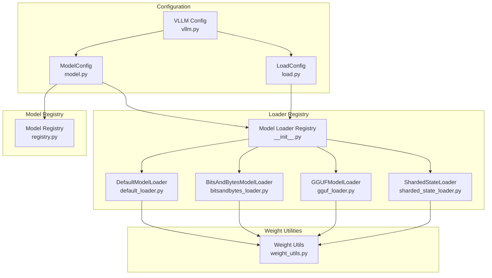

**Diagram sources**
- [load.py](file://vllm/config/load.py#L1-L125)
- [__init__.py](file://vllm/model_executor/model_loader/__init__.py#L1-L151)
- [default_loader.py](file://vllm/model_executor/model_loader/default_loader.py#L1-L322)
- [bitsandbytes_loader.py](file://vllm/model_executor/model_loader/bitsandbytes_loader.py#L1-L823)
- [gguf_loader.py](file://vllm/model_executor/model_loader/gguf_loader.py#L1-L372)
- [sharded_state_loader.py](file://vllm/model_executor/model_loader/sharded_state_loader.py#L1-L215)
- [weight_utils.py](file://vllm/model_executor/model_loader/weight_utils.py#L1-L200)
- [registry.py](file://vllm/model_executor/models/registry.py#L1-L800)
- [model.py](file://vllm/config/model.py#L1-L800)
- [vllm.py](file://vllm/config/vllm.py#L378-L405)

**Section sources**
- [load.py](file://vllm/config/load.py#L1-L125)
- [__init__.py](file://vllm/model_executor/model_loader/__init__.py#L1-L151)
- [default_loader.py](file://vllm/model_executor/model_loader/default_loader.py#L1-L322)
- [bitsandbytes_loader.py](file://vllm/model_executor/model_loader/bitsandbytes_loader.py#L1-L823)
- [gguf_loader.py](file://vllm/model_executor/model_loader/gguf_loader.py#L1-L372)
- [sharded_state_loader.py](file://vllm/model_executor/model_loader/sharded_state_loader.py#L1-L215)
- [weight_utils.py](file://vllm/model_executor/model_loader/weight_utils.py#L1-L200)
- [registry.py](file://vllm/model_executor/models/registry.py#L1-L800)
- [model.py](file://vllm/config/model.py#L1-L800)
- [vllm.py](file://vllm/config/vllm.py#L378-L405)

## Core Components
- LoadConfig: Encapsulates load_format, download_dir, safetensors_load_strategy, device, ignore_patterns, and other loader options. It validates load_format and provides a hash for caching.
- ModelConfig: Parses and validates model metadata, resolves runner and convert types, verifies quantization compatibility, and manages multimodal and tokenizer settings.
- Model Loader Registry: Maps load_format to loader classes and exposes get_model_loader and get_model for orchestration.
- DefaultModelLoader: Handles safetensors, pytorch bin, mistral consolidated, and npcache formats; supports multithreading and platform-specific optimizations.
- BitsAndBytesModelLoader: Loads quantized weights with bitsandbytes, including pre-quantized and 4-bit/8-bit modes, with TP-aware sharding and state handling.
- GGUFModelLoader: Loads GGUF-format models, mapping GGUF tensor names to HF parameter names and handling multimodal projections.
- ShardedStateLoader: Loads pre-sharded checkpoints per rank for tensor-parallel models, including S3 support.
- Weight Utils: Provides shared utilities for downloading, filtering, iterating, and atomic writes; integrates Run:ai streamer and fastsafetensors.
- Model Registry: Resolves model architectures, inspects model capabilities, caches model info, and supports custom model registration.

**Section sources**
- [load.py](file://vllm/config/load.py#L1-L125)
- [model.py](file://vllm/config/model.py#L1-L800)
- [__init__.py](file://vllm/model_executor/model_loader/__init__.py#L1-L151)
- [default_loader.py](file://vllm/model_executor/model_loader/default_loader.py#L1-L322)
- [bitsandbytes_loader.py](file://vllm/model_executor/model_loader/bitsandbytes_loader.py#L1-L823)
- [gguf_loader.py](file://vllm/model_executor/model_loader/gguf_loader.py#L1-L372)
- [sharded_state_loader.py](file://vllm/model_executor/model_loader/sharded_state_loader.py#L1-L215)
- [weight_utils.py](file://vllm/model_executor/model_loader/weight_utils.py#L1-L200)
- [registry.py](file://vllm/model_executor/models/registry.py#L1-L800)

## Architecture Overview
The model resolution pipeline:
1. ModelConfig initializes and validates model metadata, resolves runner/convert types, and verifies quantization support.
2. VLLM config optionally adjusts load_format for Run:ai object URIs and validates compatibility.
3. The loader registry selects a loader based on load_format.
4. The selected loader prepares weights (downloads, filters, indexes), constructs iterators, and streams tensors to the model.
5. Quantization and mixed precision are applied during or before weight loading depending on the loader and config.
6. Distributed sharding is applied post-loading for tensor parallelism.

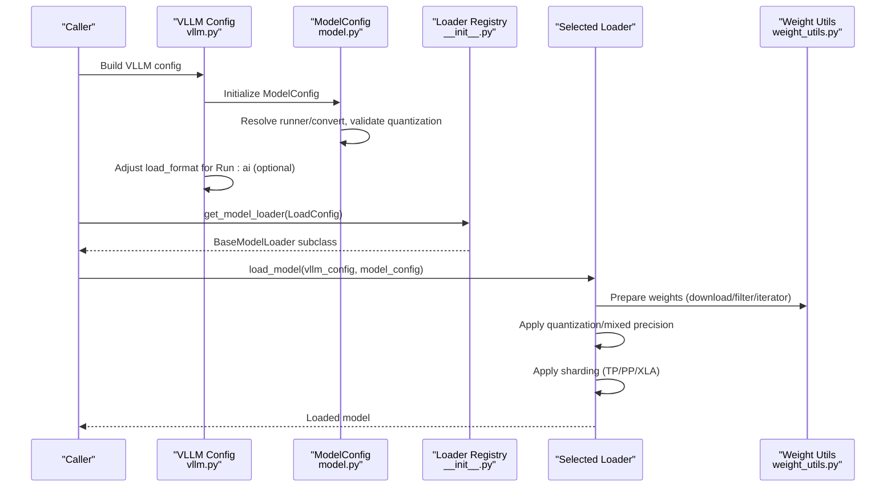

**Diagram sources**
- [vllm.py](file://vllm/config/vllm.py#L1239-L1275)
- [model.py](file://vllm/config/model.py#L1-L800)
- [__init__.py](file://vllm/model_executor/model_loader/__init__.py#L1-L151)
- [default_loader.py](file://vllm/model_executor/model_loader/default_loader.py#L1-L322)
- [weight_utils.py](file://vllm/model_executor/model_loader/weight_utils.py#L1-L200)

## Detailed Component Analysis

### Model Discovery and Validation
- ModelConfig parses Hugging Face configs, infers runner and convert types, and validates multimodal and attention settings. It also verifies quantization compatibility and dtype selection.
- Model registry resolves architectures, inspects model capabilities, and caches model info to accelerate subsequent loads.

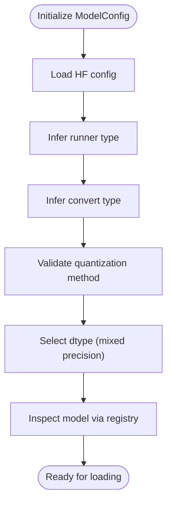

**Diagram sources**
- [model.py](file://vllm/config/model.py#L1-L800)
- [registry.py](file://vllm/model_executor/models/registry.py#L1-L800)

**Section sources**
- [model.py](file://vllm/config/model.py#L1-L800)
- [registry.py](file://vllm/model_executor/models/registry.py#L1-L800)

### Loader Registry and Format Selection
- The registry maps load_format to loader classes and supports registering custom loaders. It validates loader subclasses and warns on duplicates.
- get_model_loader returns the appropriate loader instance based on LoadConfig.load_format.

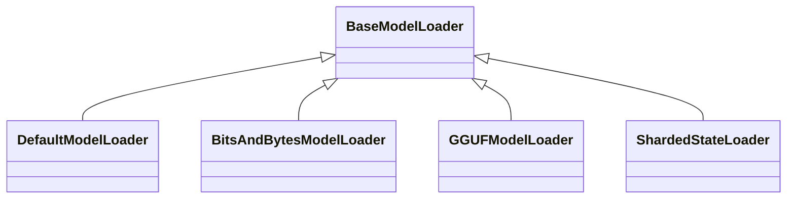

**Diagram sources**
- [__init__.py](file://vllm/model_executor/model_loader/__init__.py#L1-L151)
- [default_loader.py](file://vllm/model_executor/model_loader/default_loader.py#L1-L322)
- [bitsandbytes_loader.py](file://vllm/model_executor/model_loader/bitsandbytes_loader.py#L1-L823)
- [gguf_loader.py](file://vllm/model_executor/model_loader/gguf_loader.py#L1-L372)
- [sharded_state_loader.py](file://vllm/model_executor/model_loader/sharded_state_loader.py#L1-L215)

**Section sources**
- [__init__.py](file://vllm/model_executor/model_loader/__init__.py#L1-L151)

### Default Model Loader (HF, safetensors, mistral, pt, npcache)
- Prepares weights by selecting allowed patterns based on load_format, downloading from Hugging Face when needed, and filtering duplicate or unnecessary files.
- Supports multithreaded safetensors and pytorch weight iterators, and integrates platform-specific optimizations (e.g., XLA sync).
- Applies prefix to weight names and tracks loaded weights for strict validation in non-quantized models.

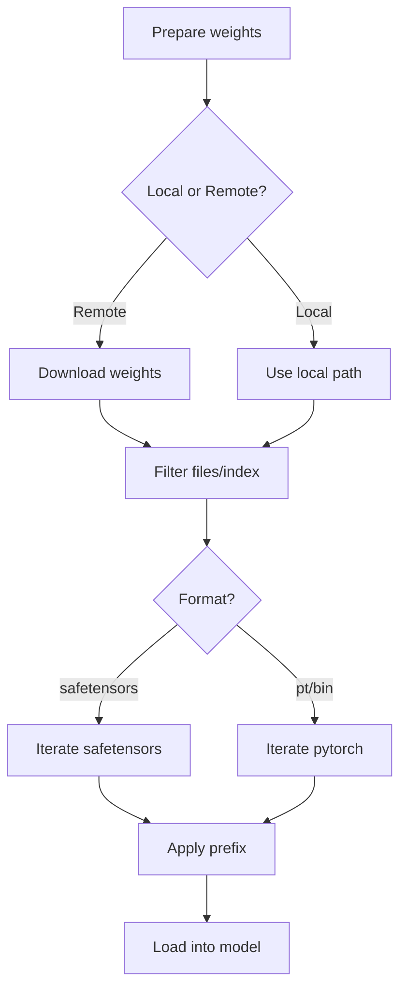

**Diagram sources**
- [default_loader.py](file://vllm/model_executor/model_loader/default_loader.py#L1-L322)
- [weight_utils.py](file://vllm/model_executor/model_loader/weight_utils.py#L1-L200)

**Section sources**
- [default_loader.py](file://vllm/model_executor/model_loader/default_loader.py#L1-L322)
- [weight_utils.py](file://vllm/model_executor/model_loader/weight_utils.py#L1-L200)

### BitsAndBytes Quantized Loader
- Supports pre-quantized 4-bit/8-bit weights and on-the-fly quantization for unquantized weights.
- Identifies target modules, classifies sharding requirements, and handles fused experts and packed modules.
- Manages quantization states, including double quantization dequantization and stacked state dictionaries.

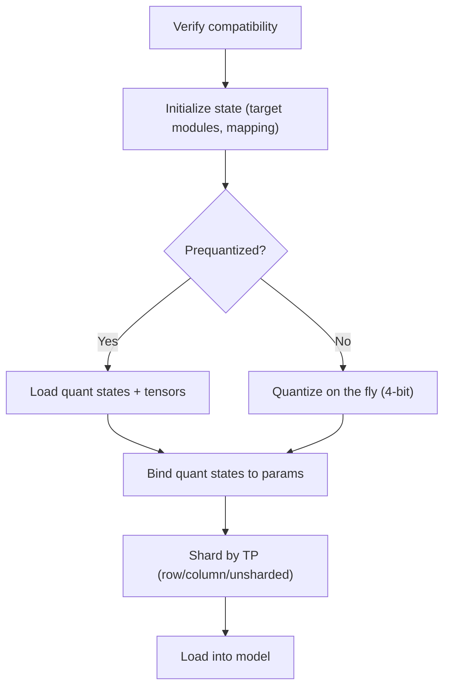

**Diagram sources**
- [bitsandbytes_loader.py](file://vllm/model_executor/model_loader/bitsandbytes_loader.py#L1-L823)

**Section sources**
- [bitsandbytes_loader.py](file://vllm/model_executor/model_loader/bitsandbytes_loader.py#L1-L823)

### GGUF Loader
- Resolves GGUF tensor names to HF parameter names, handling multimodal models and expert merges.
- Downloads GGUF files (including multimodal mmproj), determines unquantized modules, and updates quantization config accordingly.
- Initializes model with correct dtype and applies post-loading processing.

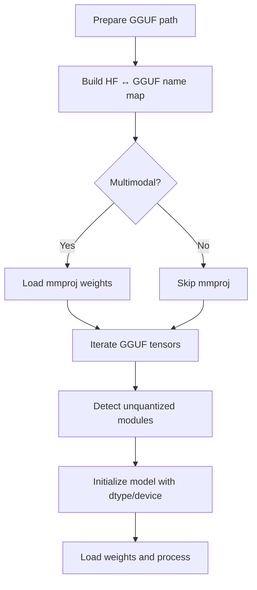

**Diagram sources**
- [gguf_loader.py](file://vllm/model_executor/model_loader/gguf_loader.py#L1-L372)

**Section sources**
- [gguf_loader.py](file://vllm/model_executor/model_loader/gguf_loader.py#L1-L372)

### Sharded State Loader (Tensor Parallel)
- Loads per-rank shards directly from local or S3 paths, filtering overlapping subtensors and copying into narrowed parameter views.
- Supports custom patterns and can integrate Run:ai streamer for pre-sharded checkpoints.

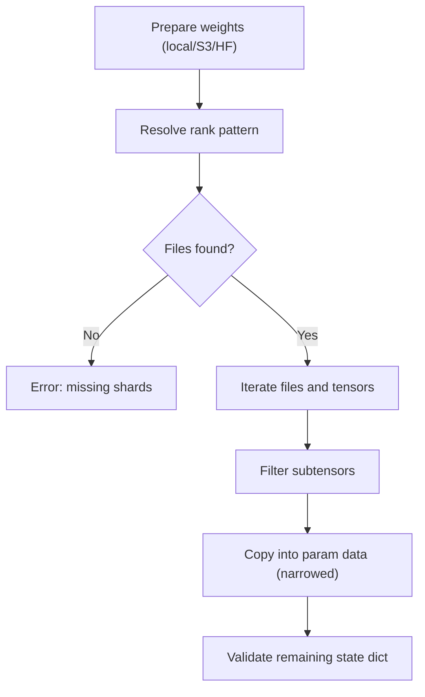

**Diagram sources**
- [sharded_state_loader.py](file://vllm/model_executor/model_loader/sharded_state_loader.py#L1-L215)

**Section sources**
- [sharded_state_loader.py](file://vllm/model_executor/model_loader/sharded_state_loader.py#L1-L215)

### Quantization-Aware Loading and Mixed Precision
- Quantization method resolution and validation are performed in ModelConfig and VLLM config. The loader may adjust load strategies (e.g., safetensors_load_strategy for torchao).
- Mixed precision dtype selection is centralized in ModelConfig and respects platform capabilities and model constraints.

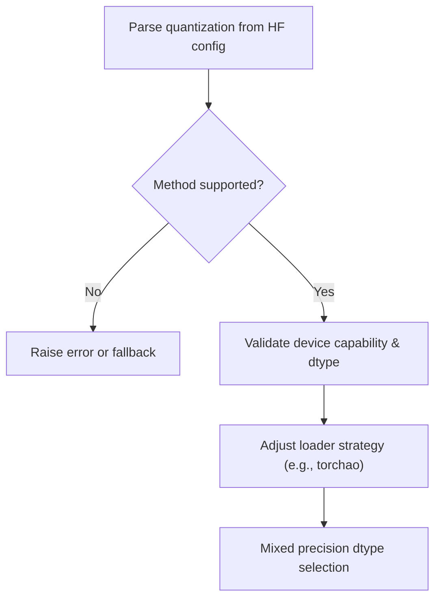

**Diagram sources**
- [model.py](file://vllm/config/model.py#L820-L877)
- [vllm.py](file://vllm/config/vllm.py#L378-L405)
- [__init__.py](file://vllm/model_executor/layers/quantization/__init__.py#L1-L180)
- [fp_quant.py](file://vllm/model_executor/layers/quantization/fp_quant.py#L68-L109)
- [ipex_quant.py](file://vllm/model_executor/layers/quantization/ipex_quant.py#L107-L141)

**Section sources**
- [model.py](file://vllm/config/model.py#L820-L877)
- [vllm.py](file://vllm/config/vllm.py#L378-L405)
- [__init__.py](file://vllm/model_executor/layers/quantization/__init__.py#L1-L180)
- [fp_quant.py](file://vllm/model_executor/layers/quantization/fp_quant.py#L68-L109)
- [ipex_quant.py](file://vllm/model_executor/layers/quantization/ipex_quant.py#L107-L141)

### Model Registry Configuration and Custom Integration
- The model registry maps architectures to implementations, inspects model capabilities, and caches model info. It supports registering external models via string or class references.
- VLLM config can override load_format for Run:ai object URIs and validate constraints.

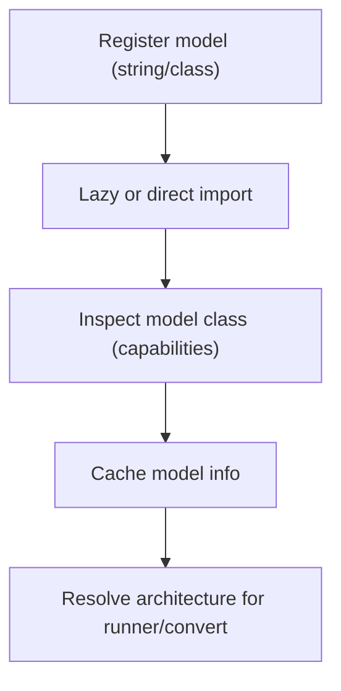

**Diagram sources**
- [registry.py](file://vllm/model_executor/models/registry.py#L1-L800)
- [vllm.py](file://vllm/config/vllm.py#L1239-L1275)

**Section sources**
- [registry.py](file://vllm/model_executor/models/registry.py#L1-L800)
- [vllm.py](file://vllm/config/vllm.py#L1239-L1275)

### Distributed Sharding Strategies
- Sharding is applied during initialization for certain features (e.g., tensor parallelism) to minimize memory overhead.
- For TPUs, sharding wrappers are applied to linear layers; for other platforms, TP/PP/XLA sharding is handled elsewhere.

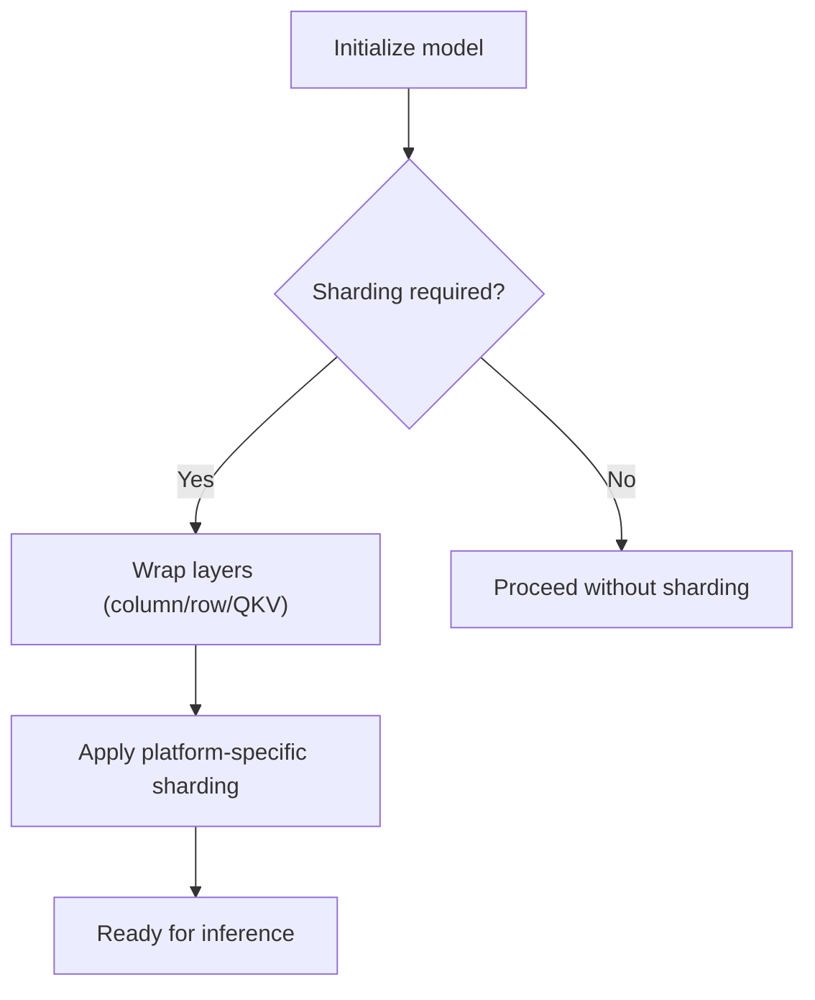

**Diagram sources**
- [arch_overview.md](file://docs/design/arch_overview.md#L217-L236)
- [tpu_distributed_utils.py](file://vllm/distributed/tpu_distributed_utils.py#L116-L160)

**Section sources**
- [arch_overview.md](file://docs/design/arch_overview.md#L217-L236)
- [tpu_distributed_utils.py](file://vllm/distributed/tpu_distributed_utils.py#L116-L160)

### Practical Deployment Scenarios
- Local installations: Use default loader with local paths; select safetensors or pt formats as needed.
- Cloud storage: Use Run:ai streamer or S3-compatible sharded checkpoints; loader detects and adapts.
- Distributed model repositories: Use sharded_state loader with per-rank patterns; ensure correct TP ranks and patterns.

**Section sources**
- [default_loader.py](file://vllm/model_executor/model_loader/default_loader.py#L1-L322)
- [sharded_state_loader.py](file://vllm/model_executor/model_loader/sharded_state_loader.py#L1-L215)
- [vllm.py](file://vllm/config/vllm.py#L1239-L1275)

## Dependency Analysis
The loader registry centralizes format-to-loader mapping and enforces type safety. Weight utilities are shared across loaders to reduce duplication and ensure consistent behavior.

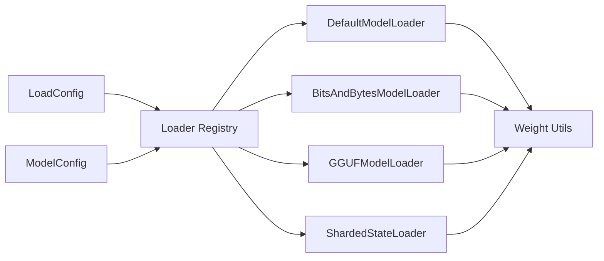

**Diagram sources**
- [__init__.py](file://vllm/model_executor/model_loader/__init__.py#L1-L151)
- [weight_utils.py](file://vllm/model_executor/model_loader/weight_utils.py#L1-L200)

**Section sources**
- [__init__.py](file://vllm/model_executor/model_loader/__init__.py#L1-L151)
- [weight_utils.py](file://vllm/model_executor/model_loader/weight_utils.py#L1-L200)

## Performance Considerations
- Prefer safetensors with lazy loading for local storage; use eager or torchao strategies for network filesystems.
- Enable multithreaded weight loading for large models to improve throughput.
- Use pre-sharded checkpoints for tensor-parallel models to avoid full-weight downloads and reduce memory pressure.
- Leverage platform-specific optimizations (e.g., XLA sync for TPU) to maintain balanced workload scheduling.

[No sources needed since this section provides general guidance]

## Troubleshooting Guide
Common issues and resolutions:
- Unknown load_format: Ensure load_format is registered or supported by the loader registry.
- Missing weights: Verify allowed patterns and ignore patterns; confirm remote downloads succeeded.
- Quantization mismatch: Confirm device capability and supported act dtypes; adjust quantization method or dtype.
- Run:ai object URI: Ensure load_format is set appropriately and compatible with the chosen loader.
- Sharded checkpoint mismatch: Validate rank pattern and file presence; ensure TP world size alignment.

**Section sources**
- [__init__.py](file://vllm/model_executor/model_loader/__init__.py#L1-L151)
- [default_loader.py](file://vllm/model_executor/model_loader/default_loader.py#L1-L322)
- [bitsandbytes_loader.py](file://vllm/model_executor/model_loader/bitsandbytes_loader.py#L1-L823)
- [gguf_loader.py](file://vllm/model_executor/model_loader/gguf_loader.py#L1-L372)
- [sharded_state_loader.py](file://vllm/model_executor/model_loader/sharded_state_loader.py#L1-L215)
- [vllm.py](file://vllm/config/vllm.py#L1239-L1275)

## Conclusion
vLLM’s model resolution and loading pipeline combines robust configuration, a flexible loader registry, and shared weight utilities to support diverse formats and deployment scenarios. By validating model metadata, integrating quantization and mixed precision, and applying distributed sharding, vLLM ensures efficient and reliable model initialization across local, cloud, and distributed environments.

[No sources needed since this section summarizes without analyzing specific files]

## Appendices
- Compatibility and version management: ModelConfig validates quantization and dtype compatibility; registry checks transformer versions for certain models.
- Fallback mechanisms: Run:ai object URIs trigger loader adjustments; loaders raise explicit errors when required files or formats are missing.

**Section sources**
- [model.py](file://vllm/config/model.py#L1-L800)
- [registry.py](file://vllm/model_executor/models/registry.py#L1-L800)
- [vllm.py](file://vllm/config/vllm.py#L1239-L1275)