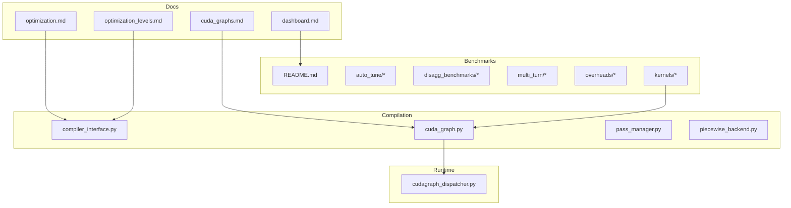
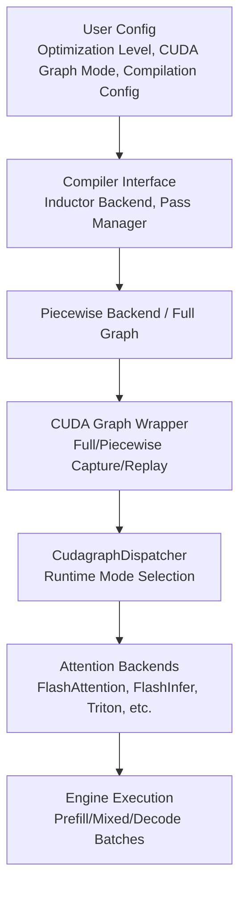
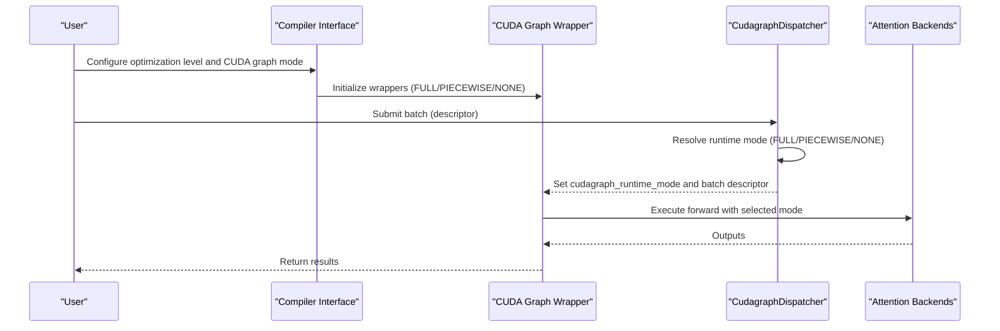
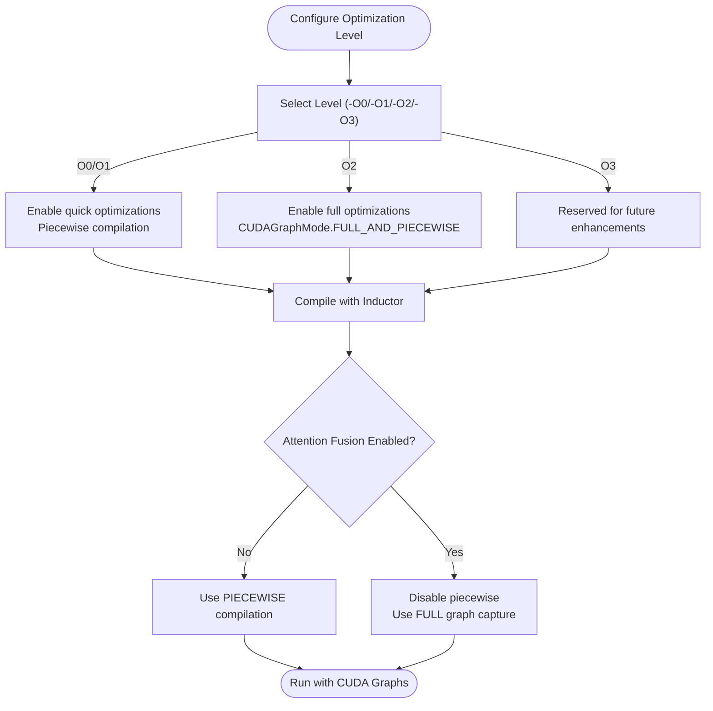
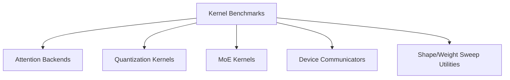
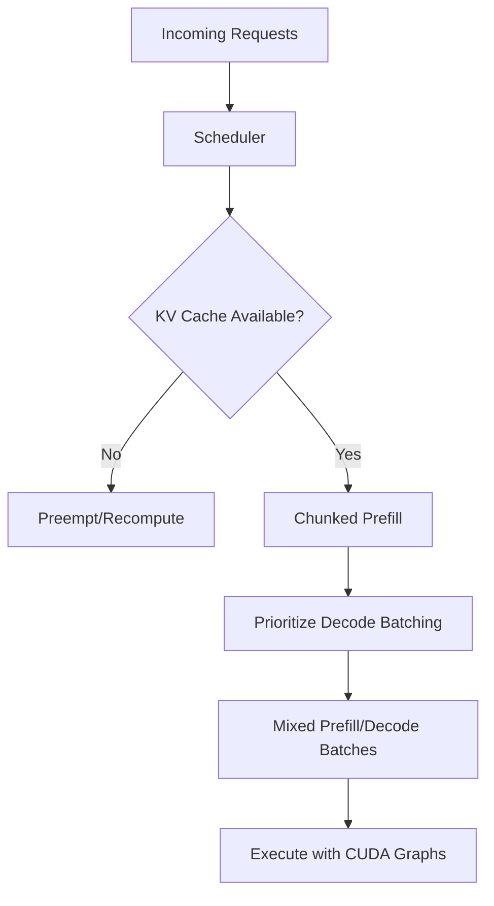
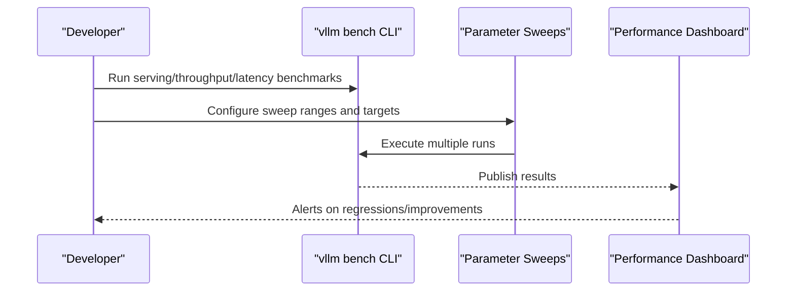
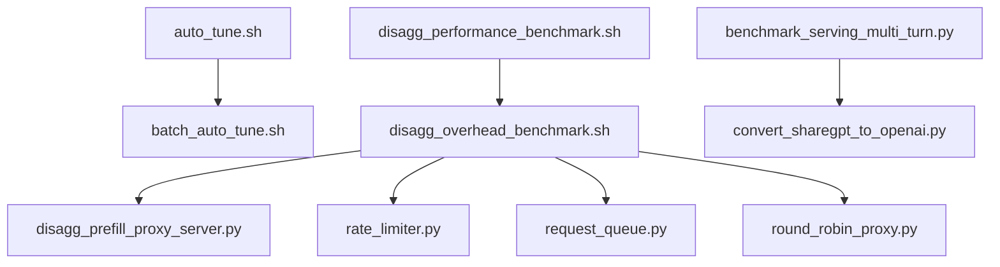
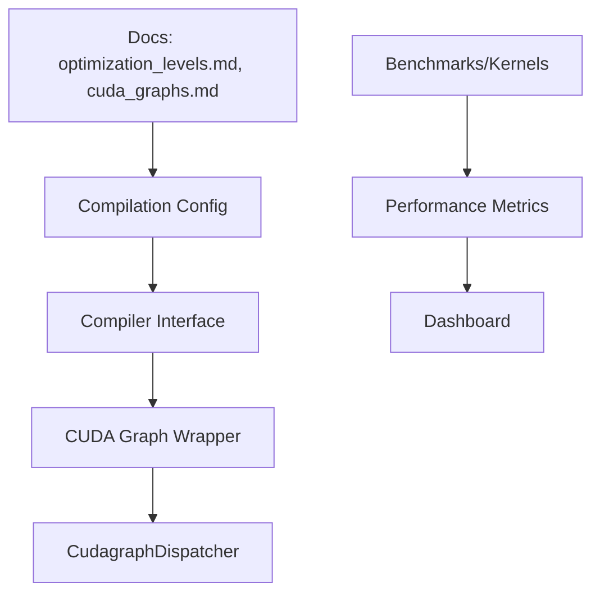

# Performance Tuning

<cite>
**Referenced Files in This Document**
- [README.md](file://README.md)
- [optimization.md](file://docs/configuration/optimization.md)
- [optimization_levels.md](file://docs/design/optimization_levels.md)
- [cuda_graphs.md](file://docs/design/cuda_graphs.md)
- [dashboard.md](file://docs/benchmarking/dashboard.md)
- [README.md](file://benchmarks/README.md)
- [cudagraph_dispatcher.py](file://vllm/v1/cudagraph_dispatcher.py)
- [cuda_graph.py](file://vllm/compilation/cuda_graph.py)
- [compiler_interface.py](file://vllm/compilation/compiler_interface.py)
- [test_cudagraph_dispatch.py](file://tests/v1/cudagraph/test_cudagraph_dispatch.py)
- [test_cudagraph_mode.py](file://tests/v1/cudagraph/test_cudagraph_mode.py)
- [test_full_cudagraph.py](file://tests/compile/fullgraph/test_full_cudagraph.py)
- [test_multimodal_compile.py](file://tests/compile/fullgraph/test_multimodal_compile.py)
- [test_aot_compile.py](file://tests/compile/test_aot_compile.py)
- [test_compile_ranges.py](file://tests/compile/test_compile_ranges.py)
- [benchmarks/kernels/benchmark_shapes.py](file://benchmarks/kernels/benchmark_shapes.py)
- [benchmarks/kernels/benchmark_device_communicators.py](file://benchmarks/kernels/benchmark_device_communicators.py)
- [benchmarks/kernels/benchmark_fused_collective.py](file://benchmarks/kernels/benchmark_fused_collective.py)
- [benchmarks/kernels/benchmark_machete.py](file://benchmarks/kernels/benchmark_machete.py)
- [benchmarks/kernels/benchmark_marlin.py](file://benchmarks/kernels/benchmark_marlin.py)
- [benchmarks/kernels/benchmark_mla_k_concat.py](file://benchmarks/kernels/benchmark_mla_k_concat.py)
- [benchmarks/kernels/benchmark_moe.py](file://benchmarks/kernels/benchmark_moe.py)
- [benchmarks/kernels/benchmark_mrope.py](file://benchmarks/kernels/benchmark_mrope.py)
- [benchmarks/kernels/benchmark_paged_attention.py](file://benchmarks/kernels/benchmark_paged_attention.py)
- [benchmarks/kernels/benchmark_quant.py](file://benchmarks/kernels/benchmark_quant.py)
- [benchmarks/kernels/benchmark_reshape_and_cache.py](file://benchmarks/kernels/benchmark_reshape_and_cache.py)
- [benchmarks/kernels/benchmark_reshape_and_cache_flash.py](file://benchmarks/kernels/benchmark_reshape_and_cache_flash.py)
- [benchmarks/kernels/benchmark_rmsnorm.py](file://benchmarks/kernels/benchmark_rmsnorm.py)
- [benchmarks/kernels/benchmark_rope.py](file://benchmarks/kernels/benchmark_rope.py)
- [benchmarks/kernels/benchmark_silu_mul_fp8_quant.py](file://benchmarks/kernels/benchmark_silu_mul_fp8_quant.py)
- [benchmarks/kernels/benchmark_trtllm_decode_attention.py](file://benchmarks/kernels/benchmark_trtllm_decode_attention.py)
- [benchmarks/kernels/benchmark_trtllm_prefill_attention.py](file://benchmarks/kernels/benchmark_trtllm_prefill_attention.py)
- [benchmarks/kernels/benchmark_w8a8_block_fp8.py](file://benchmarks/kernels/benchmark_w8a8_block_fp8.py)
- [benchmarks/kernels/graph_machete_bench.py](file://benchmarks/kernels/graph_machete_bench.py)
- [benchmarks/kernels/utils.py](file://benchmarks/kernels/utils.py)
- [benchmarks/kernels/weight_shapes.py](file://benchmarks/kernels/weight_shapes.py)
- [benchmarks/auto_tune/auto_tune.sh](file://benchmarks/auto_tune/auto_tune.sh)
- [benchmarks/auto_tune/batch_auto_tune.sh](file://benchmarks/auto_tune/batch_auto_tune.sh)
- [benchmarks/disagg_benchmarks/disagg_performance_benchmark.sh](file://benchmarks/disagg_benchmarks/disagg_performance_benchmark.sh)
- [benchmarks/disagg_benchmarks/disagg_overhead_benchmark.sh](file://benchmarks/disagg_benchmarks/disagg_overhead_benchmark.sh)
- [benchmarks/disagg_benchmarks/disagg_prefill_proxy_server.py](file://benchmarks/disagg_benchmarks/disagg_prefill_proxy_server.py)
- [benchmarks/disagg_benchmarks/rate_limiter.py](file://benchmarks/disagg_benchmarks/rate_limiter.py)
- [benchmarks/disagg_benchmarks/request_queue.py](file://benchmarks/disagg_benchmarks/request_queue.py)
- [benchmarks/disagg_benchmarks/round_robin_proxy.py](file://benchmarks/disagg_benchmarks/round_robin_proxy.py)
- [benchmarks/disagg_benchmarks/visualize_benchmark_results.py](file://benchmarks/disagg_benchmarks/visualize_benchmark_results.py)
- [benchmarks/multi_turn/bench_dataset.py](file://benchmarks/multi_turn/bench_dataset.py)
- [benchmarks/multi_turn/bench_utils.py](file://benchmarks/multi_turn/bench_utils.py)
- [benchmarks/multi_turn/benchmark_serving_multi_turn.py](file://benchmarks/multi_turn/benchmark_serving_multi_turn.py)
- [benchmarks/multi_turn/convert_sharegpt_to_openai.py](file://benchmarks/multi_turn/convert_sharegpt_to_openai.py)
- [benchmarks/multi_turn/requirements.txt](file://benchmarks/multi_turn/requirements.txt)
- [benchmarks/overheads/benchmark_hashing.py](file://benchmarks/overheads/benchmark_hashing.py)
- [benchmarks/overheads/benchmark_hash.py](file://benchmarks/overheads/benchmark_hash.py)
- [benchmarks/overheads/benchmark_prefix_block_hash.py](file://benchmarks/overheads/benchmark_prefix_block_hash.py)
- [benchmarks/overheads/benchmark_prefix_caching.py](file://benchmarks/overheads/benchmark_prefix_caching.py)
- [benchmarks/overheads/benchmark_prioritization.py](file://benchmarks/overheads/benchmark_prioritization.py)
- [benchmarks/overheads/benchmark_ngram_proposer.py](file://benchmarks/overheads/benchmark_ngram_proposer.py)
- [benchmarks/overheads/benchmark_block_pool.py](file://benchmarks/overheads/benchmark_block_pool.py)
- [benchmarks/overheads/benchmark_latency.py](file://benchmarks/overheads/benchmark_latency.py)
- [benchmarks/overheads/benchmark_long_document_qa_throughput.py](file://benchmarks/overheads/benchmark_long_document_qa_throughput.py)
- [benchmarks/overheads/benchmark_serving.py](file://benchmarks/overheads/benchmark_serving.py)
- [benchmarks/overheads/benchmark_throughput.py](file://benchmarks/overheads/benchmark_throughput.py)
- [benchmarks/overheads/benchmark_utils.py](file://benchmarks/overheads/benchmark_utils.py)
- [benchmarks/overheads/README.md](file://benchmarks/overheads/README.md)
- [benchmarks/overheads/requirements.txt](file://benchmarks/overheads/requirements.txt)
- [benchmarks/overheads/benchmark_hashing.py](file://benchmarks/overheads/benchmark_hashing.py)
- [benchmarks/overheads/benchmark_hash.py](file://benchmarks/overheads/benchmark_hash.py)
- [benchmarks/overheads/benchmark_prefix_block_hash.py](file://benchmarks/overheads/benchmark_prefix_block_hash.py)
- [benchmarks/overheads/benchmark_prefix_caching.py](file://benchmarks/overheads/benchmark_prefix_caching.py)
- [benchmarks/overheads/benchmark_prioritization.py](file://benchmarks/overheads/benchmark_prioritization.py)
- [benchmarks/overheads/benchmark_ngram_proposer.py](file://benchmarks/overheads/benchmark_ngram_proposer.py)
- [benchmarks/overheads/benchmark_block_pool.py](file://benchmarks/overheads/benchmark_block_pool.py)
- [benchmarks/overheads/benchmark_latency.py](file://benchmarks/overheads/benchmark_latency.py)
- [benchmarks/overheads/benchmark_long_document_qa_throughput.py](file://benchmarks/overheads/benchmark_long_document_qa_throughput.py)
- [benchmarks/overheads/benchmark_serving.py](file://benchmarks/overheads/benchmark_serving.py)
- [benchmarks/overheads/benchmark_throughput.py](file://benchmarks/overheads/benchmark_throughput.py)
- [benchmarks/overheads/benchmark_utils.py](file://benchmarks/overheads/benchmark_utils.py)
- [benchmarks/overheads/README.md](file://benchmarks/overheads/README.md)
- [benchmarks/overheads/requirements.txt](file://benchmarks/overheads/requirements.txt)
</cite>

## Table of Contents
1. [Introduction](#introduction)
2. [Project Structure](#project-structure)
3. [Core Components](#core-components)
4. [Architecture Overview](#architecture-overview)
5. [Detailed Component Analysis](#detailed-component-analysis)
6. [Dependency Analysis](#dependency-analysis)
7. [Performance Considerations](#performance-considerations)
8. [Troubleshooting Guide](#troubleshooting-guide)
9. [Conclusion](#conclusion)
10. [Appendices](#appendices)

## Introduction
This document provides a comprehensive guide to performance tuning and optimization strategies for vLLM in production environments. It focuses on compilation optimization settings, kernel selection criteria, hardware-specific tuning parameters, CUDA graph optimization, memory bandwidth optimization, compute efficiency improvements, benchmarking methodologies, performance regression detection, and optimization validation techniques. Practical workflows, automated optimization pipelines, A/B testing approaches, and performance monitoring dashboards are covered to enable continuous optimization tracking.

## Project Structure
The repository organizes performance-related capabilities across documentation, benchmarks, kernels, compilation, and runtime orchestration:
- Documentation: Tuning guides, optimization levels, and CUDA graphs design
- Benchmarks: CLI tools, parameter sweeps, and specialized suites for serving, throughput, latency, and kernel performance
- Kernels: Specialized benchmarks for attention, quantization, MoE, and device communicators
- Compilation: TorchInductor integration, piecewise compilation, CUDA graph wrappers, and pass managers
- Runtime: Dispatcher and wrappers that select optimal execution modes per batch

**Diagram sources**
- [optimization.md](file://docs/configuration/optimization.md#L1-L289)
- [optimization_levels.md](file://docs/design/optimization_levels.md#L1-L69)
- [cuda_graphs.md](file://docs/design/cuda_graphs.md#L1-L237)
- [dashboard.md](file://docs/benchmarking/dashboard.md#L1-L59)
- [README.md](file://benchmarks/README.md#L1-L21)
- [compiler_interface.py](file://vllm/compilation/compiler_interface.py)
- [cuda_graph.py](file://vllm/compilation/cuda_graph.py)
- [cudagraph_dispatcher.py](file://vllm/v1/cudagraph_dispatcher.py)

**Section sources**
- [README.md](file://README.md#L70-L81)
- [optimization.md](file://docs/configuration/optimization.md#L1-L289)
- [optimization_levels.md](file://docs/design/optimization_levels.md#L1-L69)
- [cuda_graphs.md](file://docs/design/cuda_graphs.md#L1-L237)
- [dashboard.md](file://docs/benchmarking/dashboard.md#L1-L59)
- [README.md](file://benchmarks/README.md#L1-L21)

## Core Components
- Optimization levels (-O0 to -O3): Trade startup time vs. performance; production default is -O2 with full optimizations including piecewise compilation and CUDAGraph modes.
- CUDA Graphs modes: Flexible runtime selection among NONE, PIECEWISE, FULL, FULL_DECODE_ONLY, and FULL_AND_PIECEWISE, with dispatcher-driven mode switching based on batch composition and backend capabilities.
- Compilation configuration: Controls compilation backend, graph splitting, and partitioning strategies; integrates with piecewise compilation and inductor passes.
- Kernel benchmarks: Comprehensive suite for attention backends, quantization kernels, MoE ops, and device communicators to validate kernel-level performance.

**Section sources**
- [optimization_levels.md](file://docs/design/optimization_levels.md#L1-L69)
- [cuda_graphs.md](file://docs/design/cuda_graphs.md#L37-L71)
- [compiler_interface.py](file://vllm/compilation/compiler_interface.py)
- [cuda_graph.py](file://vllm/compilation/cuda_graph.py)
- [cudagraph_dispatcher.py](file://vllm/v1/cudagraph_dispatcher.py)

## Architecture Overview
The performance architecture combines configurable compilation, adaptive CUDA graph capture, and runtime dispatching to maximize throughput and minimize latency across heterogeneous workloads and hardware backends.

**Diagram sources**
- [optimization_levels.md](file://docs/design/optimization_levels.md#L23-L63)
- [cuda_graphs.md](file://docs/design/cuda_graphs.md#L37-L71)
- [compiler_interface.py](file://vllm/compilation/compiler_interface.py)
- [cuda_graph.py](file://vllm/compilation/cuda_graph.py)
- [cudagraph_dispatcher.py](file://vllm/v1/cudagraph_dispatcher.py)

## Detailed Component Analysis

### CUDA Graph Optimization
- Modes and compatibility: The system supports multiple CUDA Graph modes, each tailored to different batch compositions and backend capabilities. The dispatcher selects runtime mode based on batch descriptors and backend support.
- Dispatcher logic: Maintains separate sets of keys for FULL and PIECEWISE modes, prioritizing FULL > PIECEWISE > NONE, and falls back when incompatible.
- Full vs. piecewise capture: Nested wrapper design enables coexistence of full and piecewise CUDA graphs; warm-up and attention metadata are used to capture distinct prefill/mixed vs. uniform decode cases.

**Diagram sources**
- [cuda_graphs.md](file://docs/design/cuda_graphs.md#L99-L144)
- [cuda_graph.py](file://vllm/compilation/cuda_graph.py)
- [cudagraph_dispatcher.py](file://vllm/v1/cudagraph_dispatcher.py)

**Section sources**
- [cuda_graphs.md](file://docs/design/cuda_graphs.md#L37-L71)
- [cuda_graphs.md](file://docs/design/cuda_graphs.md#L99-L144)
- [cuda_graphs.md](file://docs/design/cuda_graphs.md#L144-L174)
- [cuda_graphs.md](file://docs/design/cuda_graphs.md#L191-L200)
- [test_cudagraph_dispatch.py](file://tests/v1/cudagraph/test_cudagraph_dispatch.py)
- [test_cudagraph_mode.py](file://tests/v1/cudagraph/test_cudagraph_mode.py)

### Compilation Optimization Settings
- Optimization levels: -O0 for quick startup, -O1 for balanced development, -O2 default for production with full optimizations, and -O3 reserved for future enhancements.
- Inductor integration: Piecewise compilation and graph partitioning controls; attention fusion and sequence parallelism passes are incompatible with piecewise compilation and may require full graph capture.
- Compiler interface: Centralizes backend selection, pass management, and configuration wiring.

**Diagram sources**
- [optimization_levels.md](file://docs/design/optimization_levels.md#L23-L63)
- [cuda_graphs.md](file://docs/design/cuda_graphs.md#L224-L230)
- [compiler_interface.py](file://vllm/compilation/compiler_interface.py)

**Section sources**
- [optimization_levels.md](file://docs/design/optimization_levels.md#L1-L69)
- [cuda_graphs.md](file://docs/design/cuda_graphs.md#L224-L230)
- [compiler_interface.py](file://vllm/compilation/compiler_interface.py)

### Kernel Selection Criteria and Hardware-Specific Tuning
- Kernel benchmarks: Dedicated suites for attention backends, quantization kernels (FP8, INT8, Marlin, Machete), MoE ops, and device communicators. These validate performance across architectures and shapes.
- Shape and weight benchmarks: Utilities to sweep shapes and weight distributions for kernel selection and tuning.
- Device communicator benchmarks: Evaluate collective and all-reduce performance across hardware.

**Diagram sources**
- [benchmarks/kernels/benchmark_paged_attention.py](file://benchmarks/kernels/benchmark_paged_attention.py)
- [benchmarks/kernels/benchmark_quant.py](file://benchmarks/kernels/benchmark_quant.py)
- [benchmarks/kernels/benchmark_moe.py](file://benchmarks/kernels/benchmark_moe.py)
- [benchmarks/kernels/benchmark_device_communicators.py](file://benchmarks/kernels/benchmark_device_communicators.py)
- [benchmarks/kernels/benchmark_shapes.py](file://benchmarks/kernels/benchmark_shapes.py)
- [benchmarks/kernels/weight_shapes.py](file://benchmarks/kernels/weight_shapes.py)

**Section sources**
- [benchmarks/kernels/benchmark_paged_attention.py](file://benchmarks/kernels/benchmark_paged_attention.py)
- [benchmarks/kernels/benchmark_quant.py](file://benchmarks/kernels/benchmark_quant.py)
- [benchmarks/kernels/benchmark_moe.py](file://benchmarks/kernels/benchmark_moe.py)
- [benchmarks/kernels/benchmark_device_communicators.py](file://benchmarks/kernels/benchmark_device_communicators.py)
- [benchmarks/kernels/benchmark_shapes.py](file://benchmarks/kernels/benchmark_shapes.py)
- [benchmarks/kernels/weight_shapes.py](file://benchmarks/kernels/weight_shapes.py)

### Memory Bandwidth Optimization and Compute Efficiency
- Chunked prefill: Balances compute-bound prefill and memory-bound decode, improving ITL and throughput by prioritizing decode batching and opportunistic prefill scheduling.
- KV cache management: Preemption and recomputation warnings indicate memory pressure; tuning parameters include GPU memory utilization, max sequences, and parallelism strategies.
- Multi-modal caching: Processor and IPC caching reduce redundant transfers and processing; shared-memory caching improves throughput with multi-worker setups.

**Diagram sources**
- [optimization.md](file://docs/configuration/optimization.md#L30-L58)
- [optimization.md](file://docs/configuration/optimization.md#L8-L27)

**Section sources**
- [optimization.md](file://docs/configuration/optimization.md#L30-L58)
- [optimization.md](file://docs/configuration/optimization.md#L8-L27)
- [optimization.md](file://docs/configuration/optimization.md#L216-L289)

### Benchmarking Methodologies and Regression Detection
- Benchmark CLI and suites: Serving, throughput, and latency benchmarks for interactive and offline evaluations.
- Parameter sweeps: Automate runs across configurations to identify optimal settings.
- Continuous dashboard: Automated CI publishes results per commit and PR merges; monitors serving, throughput, and latency across models and GPUs.

**Diagram sources**
- [README.md](file://benchmarks/README.md#L1-L21)
- [dashboard.md](file://docs/benchmarking/dashboard.md#L1-L59)

**Section sources**
- [README.md](file://benchmarks/README.md#L1-L21)
- [dashboard.md](file://docs/benchmarking/dashboard.md#L1-L59)

### Automated Optimization Pipelines
- Auto-tuning scripts: Shell scripts for automatic tuning of batch sizes and kernel selections.
- Disaggregated serving benchmarks: Proxy servers, rate limiters, and request queues to evaluate scaling and overheads.
- Multi-turn benchmarks: Dataset utilities and conversion scripts for realistic conversational workloads.

**Diagram sources**
- [benchmarks/auto_tune/auto_tune.sh](file://benchmarks/auto_tune/auto_tune.sh)
- [benchmarks/auto_tune/batch_auto_tune.sh](file://benchmarks/auto_tune/batch_auto_tune.sh)
- [benchmarks/disagg_benchmarks/disagg_performance_benchmark.sh](file://benchmarks/disagg_benchmarks/disagg_performance_benchmark.sh)
- [benchmarks/disagg_benchmarks/disagg_overhead_benchmark.sh](file://benchmarks/disagg_benchmarks/disagg_overhead_benchmark.sh)
- [benchmarks/disagg_benchmarks/disagg_prefill_proxy_server.py](file://benchmarks/disagg_benchmarks/disagg_prefill_proxy_server.py)
- [benchmarks/disagg_benchmarks/rate_limiter.py](file://benchmarks/disagg_benchmarks/rate_limiter.py)
- [benchmarks/disagg_benchmarks/request_queue.py](file://benchmarks/disagg_benchmarks/request_queue.py)
- [benchmarks/disagg_benchmarks/round_robin_proxy.py](file://benchmarks/disagg_benchmarks/round_robin_proxy.py)
- [benchmarks/multi_turn/benchmark_serving_multi_turn.py](file://benchmarks/multi_turn/benchmark_serving_multi_turn.py)
- [benchmarks/multi_turn/convert_sharegpt_to_openai.py](file://benchmarks/multi_turn/convert_sharegpt_to_openai.py)

**Section sources**
- [benchmarks/auto_tune/auto_tune.sh](file://benchmarks/auto_tune/auto_tune.sh)
- [benchmarks/auto_tune/batch_auto_tune.sh](file://benchmarks/auto_tune/batch_auto_tune.sh)
- [benchmarks/disagg_benchmarks/disagg_performance_benchmark.sh](file://benchmarks/disagg_benchmarks/disagg_performance_benchmark.sh)
- [benchmarks/disagg_benchmarks/disagg_overhead_benchmark.sh](file://benchmarks/disagg_benchmarks/disagg_overhead_benchmark.sh)
- [benchmarks/disagg_benchmarks/disagg_prefill_proxy_server.py](file://benchmarks/disagg_benchmarks/disagg_prefill_proxy_server.py)
- [benchmarks/disagg_benchmarks/rate_limiter.py](file://benchmarks/disagg_benchmarks/rate_limiter.py)
- [benchmarks/disagg_benchmarks/request_queue.py](file://benchmarks/disagg_benchmarks/request_queue.py)
- [benchmarks/disagg_benchmarks/round_robin_proxy.py](file://benchmarks/disagg_benchmarks/round_robin_proxy.py)
- [benchmarks/multi_turn/benchmark_serving_multi_turn.py](file://benchmarks/multi_turn/benchmark_serving_multi_turn.py)
- [benchmarks/multi_turn/convert_sharegpt_to_openai.py](file://benchmarks/multi_turn/convert_sharegpt_to_openai.py)

### A/B Testing Approaches for Optimization Validation
- Controlled experiments: Compare baseline vs. tuned configurations using the same workload mix and metrics (latency, throughput, memory).
- Statistical significance: Use sweep results and dashboard trends to detect meaningful differences.
- Canary deployments: Gradually roll out changes across subsets of traffic to validate stability and performance.

[No sources needed since this section provides general guidance]

### Performance Monitoring Dashboards for Continuous Optimization Tracking
- Public HUD dashboard: Automated publishing of benchmark results per commit and PR merges.
- Environment variables: Control serving, latency, and throughput test inputs via environment variables.
- CI-triggered runs: Scheduled benchmarking every four hours to track performance over time.

**Section sources**
- [dashboard.md](file://docs/benchmarking/dashboard.md#L1-L59)

## Dependency Analysis
The performance stack exhibits clear separation of concerns:
- Documentation drives configuration choices (optimization levels, CUDA graph modes).
- Compilation layer depends on TorchInductor and pass managers; interacts with CUDA graph wrappers.
- Runtime dispatcher orchestrates mode selection based on backend capabilities and batch composition.
- Benchmarks validate kernel performance and end-to-end behavior.

**Diagram sources**
- [optimization_levels.md](file://docs/design/optimization_levels.md#L23-L63)
- [cuda_graphs.md](file://docs/design/cuda_graphs.md#L37-L71)
- [compiler_interface.py](file://vllm/compilation/compiler_interface.py)
- [cuda_graph.py](file://vllm/compilation/cuda_graph.py)
- [cudagraph_dispatcher.py](file://vllm/v1/cudagraph_dispatcher.py)

**Section sources**
- [optimization_levels.md](file://docs/design/optimization_levels.md#L1-L69)
- [cuda_graphs.md](file://docs/design/cuda_graphs.md#L37-L71)
- [compiler_interface.py](file://vllm/compilation/compiler_interface.py)
- [cuda_graph.py](file://vllm/compilation/cuda_graph.py)
- [cudagraph_dispatcher.py](file://vllm/v1/cudagraph_dispatcher.py)

## Performance Considerations
- Startup vs. steady-state: Prefer -O2 for production; use -O0/-O1 for rapid iteration and debugging.
- CUDA graph capture cost: FULL_AND_PIECEWISE yields best latency but requires more memory and longer capture times; PIECEWISE offers flexibility with compatibility trade-offs.
- Attention backend compatibility: Downgrade modes when backends lack full CUDA graph support; leverage uniform decode-only modes where supported.
- Memory tuning: Adjust GPU memory utilization, max sequences, and parallelism to avoid preemption and recomputation overhead.
- Kernel-level tuning: Use kernel benchmarks to select optimal shapes, quantization schemes, and MoE configurations for target hardware.

[No sources needed since this section provides general guidance]

## Troubleshooting Guide
- Compilation errors: Use debug dump paths and lower optimization levels to isolate issues.
- Performance regressions: Validate with parameter sweeps and dashboard trends; revert to previous working configurations.
- CUDA graph incompatibilities: Switch to PIECEWISE or NONE modes; verify backend support for uniform decode batches.
- Memory pressure: Reduce max sequences or increase memory utilization; consider parallelism strategies.

**Section sources**
- [optimization_levels.md](file://docs/design/optimization_levels.md#L63-L69)
- [cuda_graphs.md](file://docs/design/cuda_graphs.md#L54-L58)
- [optimization.md](file://docs/configuration/optimization.md#L8-L27)

## Conclusion
Effective performance tuning in vLLM requires coordinated configuration across optimization levels, CUDA graph modes, compilation strategies, and kernel selection. The provided benchmarks, dashboards, and automated pipelines enable continuous validation and regression detection. By aligning these tools with hardware-specific tuning and A/B testing practices, production deployments can achieve sustained high throughput and low latency.

[No sources needed since this section summarizes without analyzing specific files]

## Appendices
- Kernel benchmark coverage includes attention backends, quantization kernels, MoE ops, and device communicators.
- Overhead benchmarks measure hashing, prefix caching, prioritization, and block pool performance.
- Multi-turn and disaggregated serving benchmarks support realistic production workloads.

**Section sources**
- [benchmarks/kernels/benchmark_paged_attention.py](file://benchmarks/kernels/benchmark_paged_attention.py)
- [benchmarks/kernels/benchmark_quant.py](file://benchmarks/kernels/benchmark_quant.py)
- [benchmarks/kernels/benchmark_moe.py](file://benchmarks/kernels/benchmark_moe.py)
- [benchmarks/kernels/benchmark_device_communicators.py](file://benchmarks/kernels/benchmark_device_communicators.py)
- [benchmarks/overheads/benchmark_prefix_caching.py](file://benchmarks/overheads/benchmark_prefix_caching.py)
- [benchmarks/overheads/benchmark_hashing.py](file://benchmarks/overheads/benchmark_hashing.py)
- [benchmarks/multi_turn/benchmark_serving_multi_turn.py](file://benchmarks/multi_turn/benchmark_serving_multi_turn.py)
- [benchmarks/disagg_benchmarks/disagg_performance_benchmark.sh](file://benchmarks/disagg_benchmarks/disagg_performance_benchmark.sh)