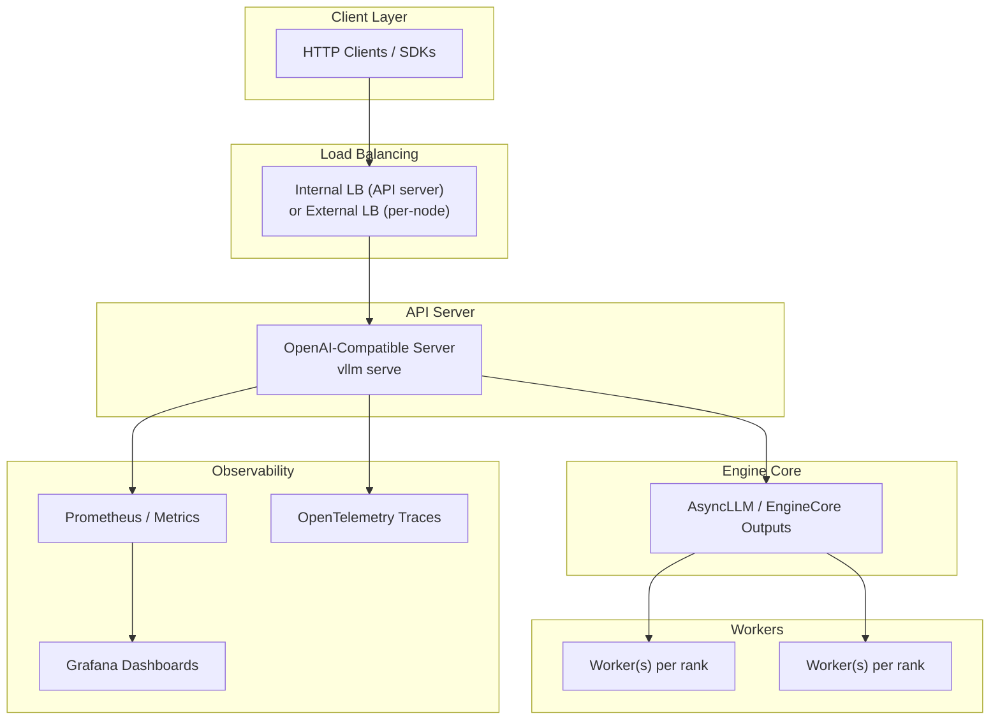
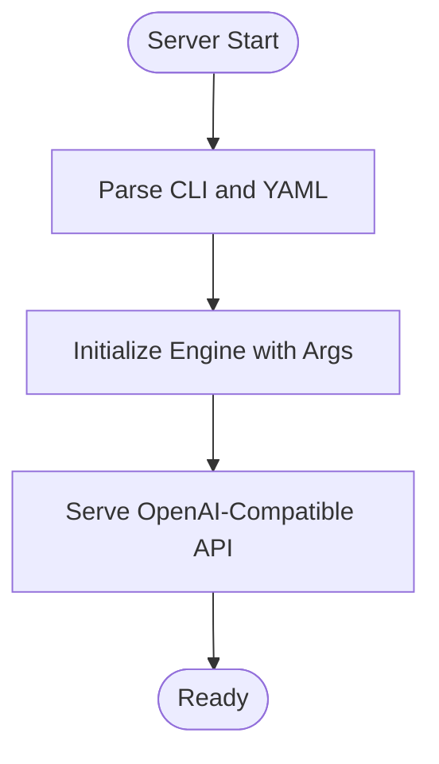
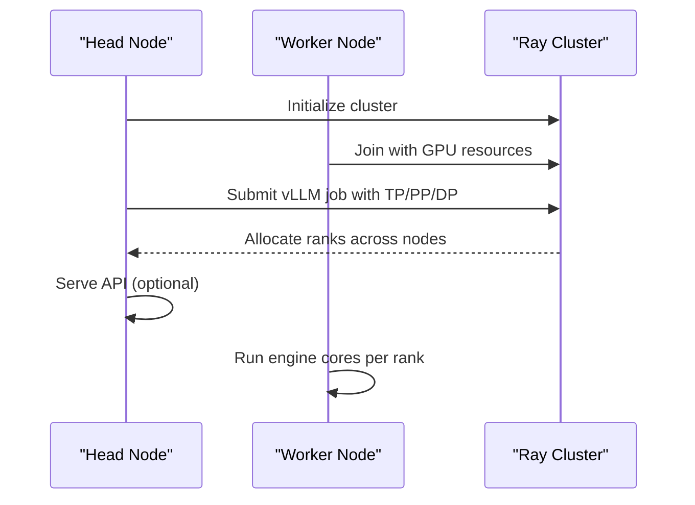
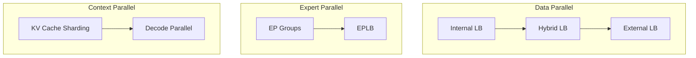
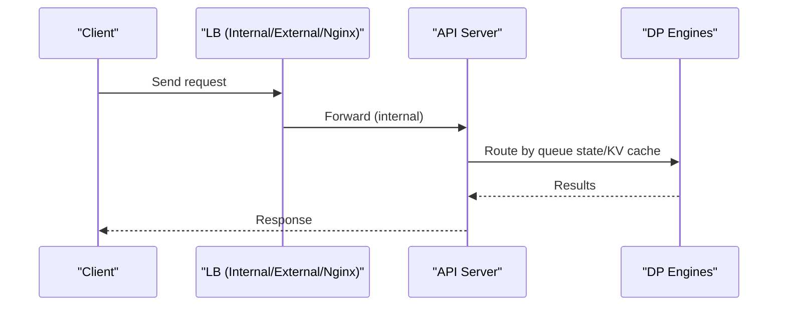
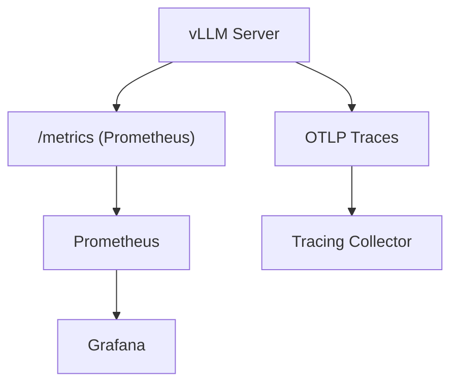
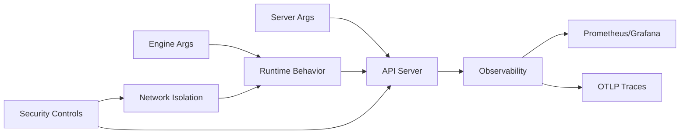

# Production Configuration

<cite>
**Referenced Files in This Document**
- [README.md](file://README.md)
- [engine_args.md](file://docs/configuration/engine_args.md)
- [serve_args.md](file://docs/configuration/serve_args.md)
- [conserving_memory.md](file://docs/configuration/conserving_memory.md)
- [optimization.md](file://docs/configuration/optimization.md)
- [openai_compatible_server.md](file://docs/serving/openai_compatible_server.md)
- [k8s.md](file://docs/deployment/k8s.md)
- [nginx.md](file://docs/deployment/nginx.md)
- [parallelism_scaling.md](file://docs/serving/parallelism_scaling.md)
- [data_parallel_deployment.md](file://docs/serving/data_parallel_deployment.md)
- [context_parallel_deployment.md](file://docs/serving/context_parallel_deployment.md)
- [expert_parallel_deployment.md](file://docs/serving/expert_parallel_deployment.md)
- [distributed_troubleshooting.md](file://docs/serving/distributed_troubleshooting.md)
- [security.md](file://docs/usage/security.md)
- [metrics.md](file://docs/design/metrics.md)
- [metrics_usage.md](file://docs/usage/metrics.md)
- [prometheus_grafana_readme.md](file://examples/online_serving/prometheus_grafana/README.md)
- [troubleshooting.md](file://docs/usage/troubleshooting.md)
</cite>

## Table of Contents
1. [Introduction](#introduction)
2. [Project Structure](#project-structure)
3. [Core Components](#core-components)
4. [Architecture Overview](#architecture-overview)
5. [Detailed Component Analysis](#detailed-component-analysis)
6. [Dependency Analysis](#dependency-analysis)
7. [Performance Considerations](#performance-considerations)
8. [Troubleshooting Guide](#troubleshooting-guide)
9. [Conclusion](#conclusion)
10. [Appendices](#appendices)

## Introduction
This document provides production configuration and operational excellence guidance for deploying and operating vLLM at scale. It consolidates advanced engine arguments, memory optimization, performance tuning, multi-node distributed inference, load balancing and routing, monitoring and observability, security, capacity planning, and operational procedures for maintenance and upgrades.

## Project Structure
The repository organizes production-relevant content across configuration guides, serving documentation, deployment recipes, and observability examples. Key areas include:
- Engine and server arguments for production tuning
- Memory conservation and optimization strategies
- Distributed inference patterns (tensor, pipeline, data, expert, context parallel)
- Load balancing and routing across nodes
- Monitoring via Prometheus/Grafana and OpenTelemetry
- Security posture and authentication/authorization controls
- Troubleshooting and operational runbooks

```mermaid
graph TB
A["Docs Root<br/>README.md"] --> B["Configuration Guides"]
A --> C["Serving Docs"]
A --> D["Deployment Guides"]
A --> E["Observability"]
A --> F["Security"]
A --> G["Troubleshooting"]
B --> B1["Engine Args<br/>engine_args.md"]
B --> B2["Server Args<br/>serve_args.md"]
B --> B3["Conserving Memory<br/>conserving_memory.md"]
B --> B4["Optimization & Tuning<br/>optimization.md"]
C --> C1["OpenAI-Compatible Server<br/>openai_compatible_server.md"]
C --> C2["Parallelism & Scaling<br/>parallelism_scaling.md"]
C --> C3["Data Parallel<br/>data_parallel_deployment.md"]
C --> C4["Context Parallel<br/>context_parallel_deployment.md"]
C --> C5["Expert Parallel<br/>expert_parallel_deployment.md"]
D --> D1["Kubernetes<br/>k8s.md"]
D --> D2["Nginx Load Balancing<br/>nginx.md"]
E --> E1["Metrics Design<br/>metrics.md"]
E --> E2["Metrics Usage<br/>metrics_usage.md"]
E --> E3["Prometheus/Grafana Example<br/>prometheus_grafana_readme.md"]
F --> F1["Security Controls<br/>security.md"]
G --> G1["Distributed Troubleshooting<br/>distributed_troubleshooting.md"]
G --> G2["Troubleshooting<br/>troubleshooting.md"]
```

**Diagram sources**
- [README.md](file://README.md#L1-L191)
- [engine_args.md](file://docs/configuration/engine_args.md#L1-L23)
- [serve_args.md](file://docs/configuration/serve_args.md#L1-L36)
- [conserving_memory.md](file://docs/configuration/conserving_memory.md#L1-L186)
- [optimization.md](file://docs/configuration/optimization.md#L1-L289)
- [openai_compatible_server.md](file://docs/serving/openai_compatible_server.md#L1-L962)
- [parallelism_scaling.md](file://docs/serving/parallelism_scaling.md#L1-L221)
- [data_parallel_deployment.md](file://docs/serving/data_parallel_deployment.md#L1-L134)
- [context_parallel_deployment.md](file://docs/serving/context_parallel_deployment.md#L1-L48)
- [expert_parallel_deployment.md](file://docs/serving/expert_parallel_deployment.md#L1-L323)
- [k8s.md](file://docs/deployment/k8s.md#L1-L398)
- [nginx.md](file://docs/deployment/nginx.md#L1-L138)
- [metrics.md](file://docs/design/metrics.md#L1-L702)
- [metrics_usage.md](file://docs/usage/metrics.md#L1-L53)
- [prometheus_grafana_readme.md](file://examples/online_serving/prometheus_grafana/README.md#L1-L58)
- [security.md](file://docs/usage/security.md#L1-L224)
- [distributed_troubleshooting.md](file://docs/serving/distributed_troubleshooting.md#L1-L17)
- [troubleshooting.md](file://docs/usage/troubleshooting.md#L1-L328)

**Section sources**
- [README.md](file://README.md#L1-L191)

## Core Components
- Engine arguments and server arguments define runtime behavior for both offline and online serving. See [Engine Arguments](file://docs/configuration/engine_args.md#L1-L23) and [Server Arguments](file://docs/configuration/serve_args.md#L1-L36).
- Memory optimization includes tensor parallelism, quantization, context length and batch size limits, CUDA graph tuning, CPU/GPU cache sizing, and multi-modal input constraints. See [Conserving Memory](file://docs/configuration/conserving_memory.md#L1-L186).
- Performance tuning encompasses preemption policies, chunked prefill, and parallelism strategies (TP, PP, DP, EP, batch-level DP for encoders). See [Optimization and Tuning](file://docs/configuration/optimization.md#L1-L289).
- Distributed inference strategies cover single-node and multi-node deployments, Ray orchestration, and network acceleration (InfiniBand, GPUDirect RDMA). See [Parallelism and Scaling](file://docs/serving/parallelism_scaling.md#L1-L221).
- Load balancing and routing include internal and external load balancing modes for data parallel, plus Nginx-based horizontal scaling. See [Data Parallel Deployment](file://docs/serving/data_parallel_deployment.md#L1-L134) and [Nginx](file://docs/deployment/nginx.md#L1-L138).
- Observability integrates Prometheus metrics, Grafana dashboards, and OpenTelemetry tracing. See [Metrics Design](file://docs/design/metrics.md#L1-L702), [Metrics Usage](file://docs/usage/metrics.md#L1-L53), and [Prometheus/Grafana Example](file://examples/online_serving/prometheus_grafana/README.md#L1-L58).
- Security configurations include inter-node communication controls, API key enforcement, firewall guidance, and protection against SSRF/unsafe endpoints. See [Security](file://docs/usage/security.md#L1-L224).
- Troubleshooting spans distributed setup, NCCL/GPU communication, and operational diagnostics. See [Distributed Troubleshooting](file://docs/serving/distributed_troubleshooting.md#L1-L17) and [Troubleshooting](file://docs/usage/troubleshooting.md#L1-L328).

**Section sources**
- [engine_args.md](file://docs/configuration/engine_args.md#L1-L23)
- [serve_args.md](file://docs/configuration/serve_args.md#L1-L36)
- [conserving_memory.md](file://docs/configuration/conserving_memory.md#L1-L186)
- [optimization.md](file://docs/configuration/optimization.md#L1-L289)
- [parallelism_scaling.md](file://docs/serving/parallelism_scaling.md#L1-L221)
- [data_parallel_deployment.md](file://docs/serving/data_parallel_deployment.md#L1-L134)
- [context_parallel_deployment.md](file://docs/serving/context_parallel_deployment.md#L1-L48)
- [expert_parallel_deployment.md](file://docs/serving/expert_parallel_deployment.md#L1-L323)
- [nginx.md](file://docs/deployment/nginx.md#L1-L138)
- [metrics.md](file://docs/design/metrics.md#L1-L702)
- [metrics_usage.md](file://docs/usage/metrics.md#L1-L53)
- [prometheus_grafana_readme.md](file://examples/online_serving/prometheus_grafana/README.md#L1-L58)
- [security.md](file://docs/usage/security.md#L1-L224)
- [distributed_troubleshooting.md](file://docs/serving/distributed_troubleshooting.md#L1-L17)
- [troubleshooting.md](file://docs/usage/troubleshooting.md#L1-L328)

## Architecture Overview
The production architecture centers on the OpenAI-compatible server with configurable engine parameters, distributed execution backends (Ray or multiprocessing), and observability pipelines. Load balancing can be internal (single API endpoint) or external (per-node endpoints with upstream router). Security is layered through network isolation, API key enforcement, and reverse proxy controls.

**Diagram sources**
- [openai_compatible_server.md](file://docs/serving/openai_compatible_server.md#L1-L962)
- [data_parallel_deployment.md](file://docs/serving/data_parallel_deployment.md#L1-L134)
- [metrics.md](file://docs/design/metrics.md#L1-L702)
- [prometheus_grafana_readme.md](file://examples/online_serving/prometheus_grafana/README.md#L1-L58)

## Detailed Component Analysis

### Engine Arguments and Server Arguments
- Engine arguments control model loading, parallelism, memory budgets, and compilation/graph capture. See [Engine Arguments](file://docs/configuration/engine_args.md#L1-L23).
- Server arguments define the OpenAI-compatible API server behavior, including host/port, logging, and YAML-based configuration. See [Server Arguments](file://docs/configuration/serve_args.md#L1-L36).

**Diagram sources**
- [serve_args.md](file://docs/configuration/serve_args.md#L1-L36)
- [engine_args.md](file://docs/configuration/engine_args.md#L1-L23)

**Section sources**
- [engine_args.md](file://docs/configuration/engine_args.md#L1-L23)
- [serve_args.md](file://docs/configuration/serve_args.md#L1-L36)

### Memory Optimization Settings
- Tensor parallelism across GPUs to reduce per-GPU memory pressure.
- Quantization (static/dynamic) to trade precision for memory.
- Limit context length and batch size to constrain KV cache growth.
- Tune CUDA graph capture sizes or enforce eager to balance memory and speed.
- Control CPU/GPU KV cache sizes and multi-modal cache limits.
- Constrain multi-modal inputs per prompt to reduce activation memory.

**Section sources**
- [conserving_memory.md](file://docs/configuration/conserving_memory.md#L1-L186)

### Performance Tuning Parameters
- Preemption and recomputation: adjust GPU memory utilization, batch sizes, TP/PP sizes to reduce preemption frequency.
- Chunked prefill: tune max_num_batched_tokens to balance ITL/TFF and throughput.
- Parallelism strategies: combine TP/PP/DP/EP and batch-level DP for encoders to maximize throughput and minimize latency.

**Section sources**
- [optimization.md](file://docs/configuration/optimization.md#L1-L289)

### Multi-Node Deployment Configurations
- Single-node multi-GPU: tensor parallelism.
- Multi-node multi-GPU: combine tensor and pipeline parallelism; use Ray for orchestration or multiprocessing for headless workers.
- Network acceleration: InfiniBand and GPUDirect RDMA for efficient cross-node communication.

**Diagram sources**
- [parallelism_scaling.md](file://docs/serving/parallelism_scaling.md#L1-L221)

**Section sources**
- [parallelism_scaling.md](file://docs/serving/parallelism_scaling.md#L1-L221)

### Inter-Node Communication Setup
- Configure VLLM_HOST_IP and network interfaces; ensure consistent IPs across nodes.
- Use privileged containers and shared memory (/dev/shm) for GPUDirect RDMA.
- Validate GPU-to-GPU communication with provided sanity checks.

**Section sources**
- [distributed_troubleshooting.md](file://docs/serving/distributed_troubleshooting.md#L1-L17)
- [troubleshooting.md](file://docs/usage/troubleshooting.md#L1-L328)

### Distributed Inference Strategies
- Data Parallel: replicate model across ranks; internal or external load balancing; hybrid mode for per-node endpoints.
- Expert Parallel: shard MoE experts across GPUs; integrate with DP; use EPLB for token routing balance.
- Context Parallel: shard KV cache across GPUs for decode; combine with TP for long-context requests.

**Diagram sources**
- [data_parallel_deployment.md](file://docs/serving/data_parallel_deployment.md#L1-L134)
- [expert_parallel_deployment.md](file://docs/serving/expert_parallel_deployment.md#L1-L323)
- [context_parallel_deployment.md](file://docs/serving/context_parallel_deployment.md#L1-L48)

**Section sources**
- [data_parallel_deployment.md](file://docs/serving/data_parallel_deployment.md#L1-L134)
- [expert_parallel_deployment.md](file://docs/serving/expert_parallel_deployment.md#L1-L323)
- [context_parallel_deployment.md](file://docs/serving/context_parallel_deployment.md#L1-L48)

### Load Balancing, Request Routing, and Failover
- Internal load balancing: single API endpoint distributing requests across DP ranks.
- Hybrid load balancing: per-node API servers queueing to colocated engines; upstream router balances nodes.
- External load balancing: each DP rank is a separate endpoint; route via external router with telemetry.
- Nginx-based horizontal scaling: multiple vLLM containers behind Nginx with least_conn and health checks.

**Diagram sources**
- [data_parallel_deployment.md](file://docs/serving/data_parallel_deployment.md#L1-L134)
- [nginx.md](file://docs/deployment/nginx.md#L1-L138)

**Section sources**
- [data_parallel_deployment.md](file://docs/serving/data_parallel_deployment.md#L1-L134)
- [nginx.md](file://docs/deployment/nginx.md#L1-L138)

### Monitoring and Observability
- Prometheus metrics endpoint exposes server-level and request-level metrics; Grafana dashboards visualize latency, throughput, and cache usage.
- OpenTelemetry tracing can be enabled for detailed model forward/execute timings.
- Logging stat publisher emits periodic INFO logs for queue sizes, cache usage, and token throughput.

**Diagram sources**
- [metrics.md](file://docs/design/metrics.md#L1-L702)
- [metrics_usage.md](file://docs/usage/metrics.md#L1-L53)
- [prometheus_grafana_readme.md](file://examples/online_serving/prometheus_grafana/README.md#L1-L58)

**Section sources**
- [metrics.md](file://docs/design/metrics.md#L1-L702)
- [metrics_usage.md](file://docs/usage/metrics.md#L1-L53)
- [prometheus_grafana_readme.md](file://examples/online_serving/prometheus_grafana/README.md#L1-L58)

### Security Configurations
- Inter-node communications are insecure by default; isolate nodes on private networks and restrict firewall exposure.
- API key authentication applies to /v1 endpoints; additional endpoints remain unprotected.
- Restrict media domains and disable redirects to mitigate SSRF risks.
- Deploy behind a reverse proxy to allowlist only intended endpoints and enforce auth/rate limiting.

**Section sources**
- [security.md](file://docs/usage/security.md#L1-L224)

### Capacity Planning, Resource Estimation, and Cost Optimization
- Estimate GPU KV cache capacity and maximum concurrency from logs; scale out by adding GPUs/nodes.
- Choose TP/PP/DP/EP combinations to fit model and workload; prefer pipeline parallelism on non-NVLink nodes.
- Optimize chunked prefill and batch sizes for ITL/TTFT vs throughput trade-offs.
- Use quantization and memory limits to reduce footprint; monitor preemption rates to right-size resources.

**Section sources**
- [parallelism_scaling.md](file://docs/serving/parallelism_scaling.md#L1-L221)
- [optimization.md](file://docs/configuration/optimization.md#L1-L289)
- [conserving_memory.md](file://docs/configuration/conserving_memory.md#L1-L186)

### Operational Procedures
- Maintenance windows: schedule during low-traffic periods; use internal API server scale-out to minimize downtime.
- Zero-downtime upgrades: roll out new images across nodes; keep at least one healthy replica; validate /health endpoints.
- Emergency response: enable detailed logging and NCCL traces; verify GPU communication; isolate failing nodes/network segments.

**Section sources**
- [data_parallel_deployment.md](file://docs/serving/data_parallel_deployment.md#L1-L134)
- [troubleshooting.md](file://docs/usage/troubleshooting.md#L1-L328)

## Dependency Analysis
- Engine and server arguments feed into the runtime behavior and resource allocation.
- Distributed strategies depend on Ray or multiprocessing backends and require tuned network settings.
- Observability depends on Prometheus scraping and Grafana dashboards; OpenTelemetry adds tracing overhead.
- Security depends on network isolation and reverse proxy enforcement.

**Diagram sources**
- [engine_args.md](file://docs/configuration/engine_args.md#L1-L23)
- [serve_args.md](file://docs/configuration/serve_args.md#L1-L36)
- [metrics.md](file://docs/design/metrics.md#L1-L702)
- [security.md](file://docs/usage/security.md#L1-L224)

**Section sources**
- [engine_args.md](file://docs/configuration/engine_args.md#L1-L23)
- [serve_args.md](file://docs/configuration/serve_args.md#L1-L36)
- [metrics.md](file://docs/design/metrics.md#L1-L702)
- [security.md](file://docs/usage/security.md#L1-L224)

## Performance Considerations
- Prefer chunked prefill for improved ITL and throughput; tune max_num_batched_tokens per workload.
- Right-size tensor and pipeline parallelism to avoid excessive synchronization overhead.
- Use expert parallelism for MoE models and batch-level DP for encoders to improve throughput.
- Monitor preemption and KV cache residency to detect memory pressure and adjust utilization/batch sizes.

**Section sources**
- [optimization.md](file://docs/configuration/optimization.md#L1-L289)
- [expert_parallel_deployment.md](file://docs/serving/expert_parallel_deployment.md#L1-L323)

## Troubleshooting Guide
- Distributed setup issues: verify VLLM_HOST_IP, network interfaces, and Ray node discovery.
- NCCL/GPU communication failures: run sanity checks, adjust NCCL env vars, and confirm GPUDirect RDMA logs.
- Model loading/download problems: pre-download models and use dummy load format for isolation.
- Logging and tracing: increase log frequency, enable NCCL debug, and use tracing flags for detailed insights.

**Section sources**
- [distributed_troubleshooting.md](file://docs/serving/distributed_troubleshooting.md#L1-L17)
- [troubleshooting.md](file://docs/usage/troubleshooting.md#L1-L328)

## Conclusion
This guide consolidates production-grade configuration and operations for vLLM, covering engine tuning, memory optimization, distributed strategies, load balancing, observability, security, and operational procedures. Adopt the recommended practices to achieve reliable, scalable, and secure inference at any scale.

## Appendices
- Example configurations and deployment manifests are available in the repository’s documentation and examples directories.