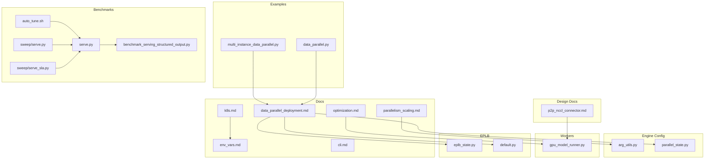
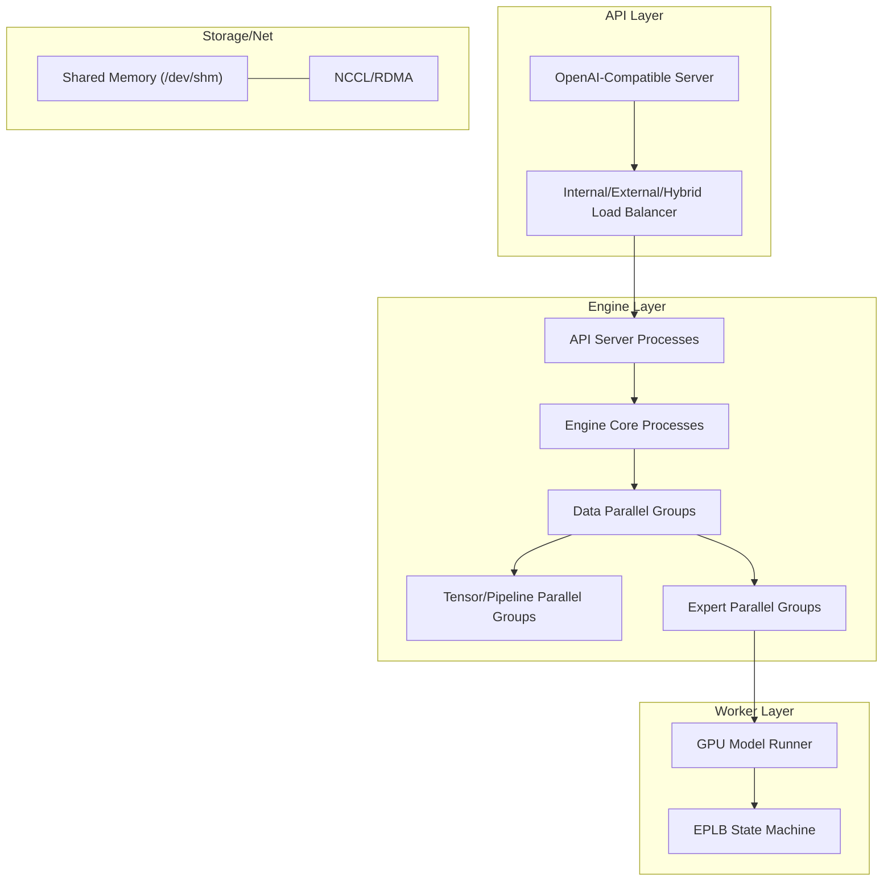
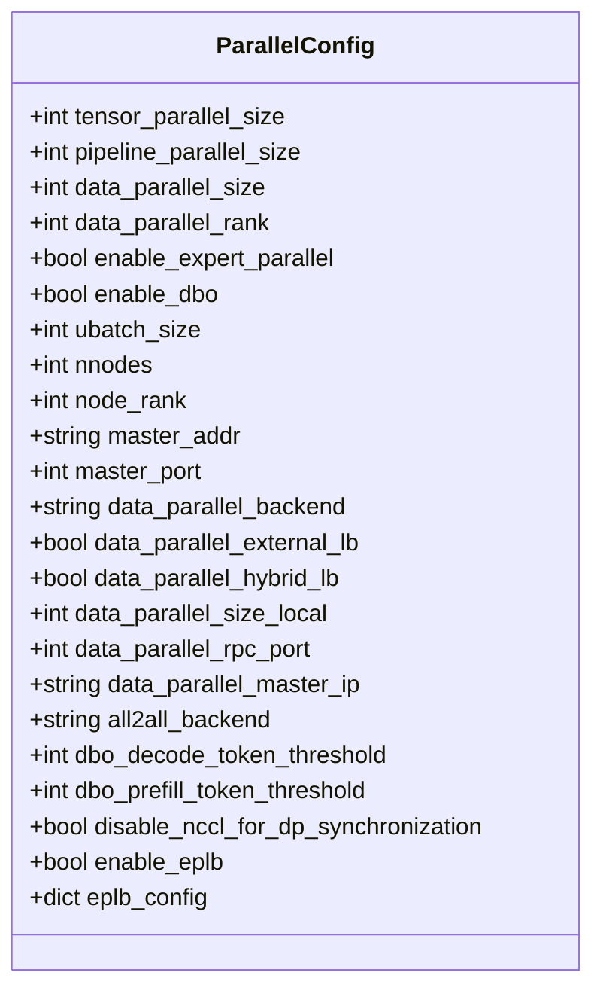
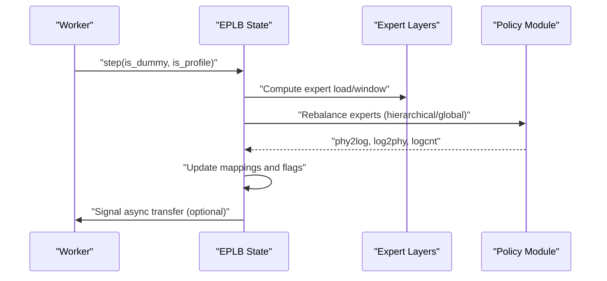
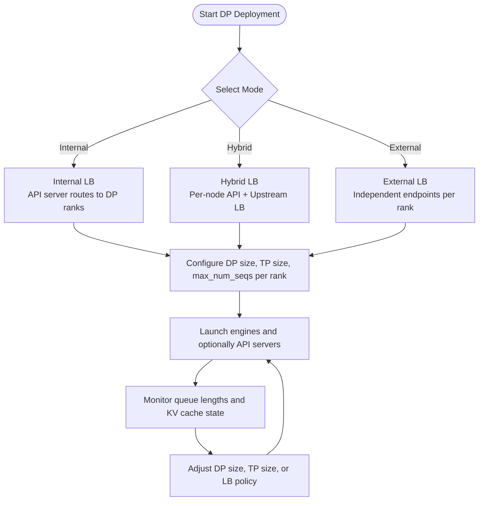
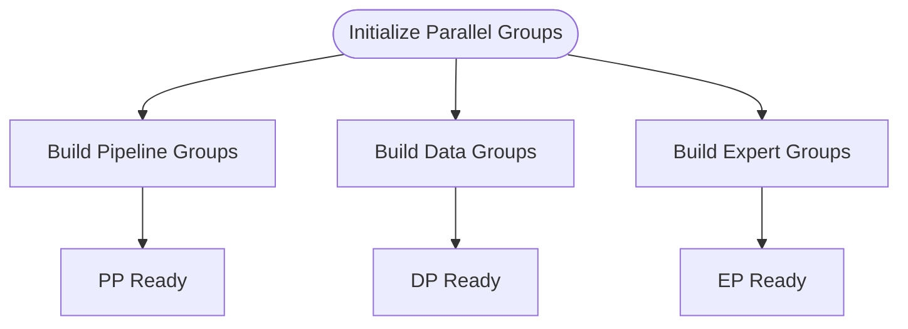
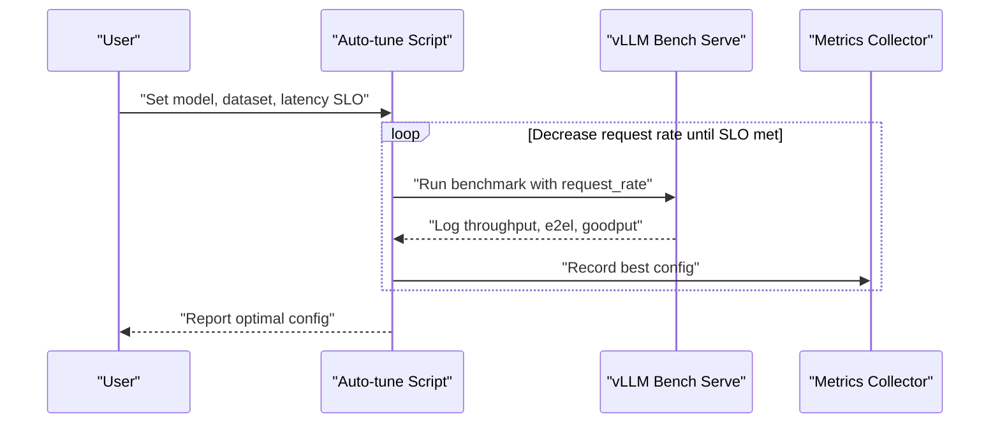
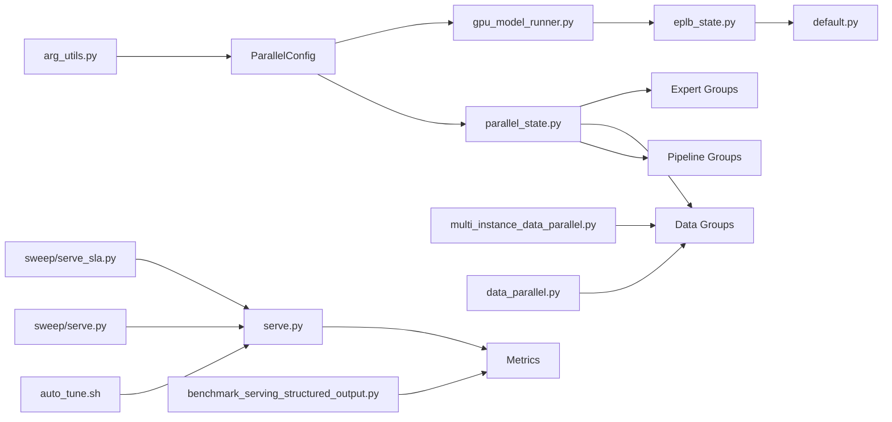

# Scaling Strategies

<cite>
**Referenced Files in This Document**
- [parallelism_scaling.md](file://docs/serving/parallelism_scaling.md)
- [optimization.md](file://docs/configuration/optimization.md)
- [data_parallel_deployment.md](file://docs/serving/data_parallel_deployment.md)
- [k8s.md](file://docs/deployment/k8s.md)
- [env_vars.md](file://docs/configuration/env_vars.md)
- [arg_utils.py](file://vllm/engine/arg_utils.py)
- [parallel_state.py](file://vllm/distributed/parallel_state.py)
- [gpu_model_runner.py](file://vllm/v1/worker/gpu_model_runner.py)
- [eplb_state.py](file://vllm/distributed/eplb/eplb_state.py)
- [default.py](file://vllm/distributed/eplb/policy/default.py)
- [multi_instance_data_parallel.py](file://examples/online_serving/multi_instance_data_parallel.py)
- [data_parallel.py](file://examples/offline_inference/data_parallel.py)
- [serve.py](file://vllm/benchmarks/serve.py)
- [benchmark_serving_structured_output.py](file://benchmarks/benchmark_serving_structured_output.py)
- [auto_tune.sh](file://benchmarks/auto_tune/auto_tune.sh)
- [serve.py](file://vllm/benchmarks/sweep/serve.py)
- [serve_sla.py](file://vllm/benchmarks/sweep/serve_sla.py)
- [cli.md](file://docs/benchmarking/cli.md)
- [test_kv_cache_metrics.py](file://tests/v1/core/test_kv_cache_metrics.py)
- [p2p_nccl_connector.md](file://docs/design/p2p_nccl_connector.md)
</cite>

## Table of Contents
1. [Introduction](#introduction)
2. [Project Structure](#project-structure)
3. [Core Components](#core-components)
4. [Architecture Overview](#architecture-overview)
5. [Detailed Component Analysis](#detailed-component-analysis)
6. [Dependency Analysis](#dependency-analysis)
7. [Performance Considerations](#performance-considerations)
8. [Troubleshooting Guide](#troubleshooting-guide)
9. [Conclusion](#conclusion)
10. [Appendices](#appendices)

## Introduction
This document provides a comprehensive guide to scaling strategies and performance optimization for vLLM deployments. It explains horizontal and vertical scaling approaches for inference workloads, details tensor parallelism, data parallelism, expert parallelism, and pipeline parallelism configurations, and covers auto-scaling policies based on GPU utilization, request queue length, and response latency. Guidance is included on optimal cluster sizing, resource allocation ratios, and cost-per-inference optimization. Load balancing strategies across multiple vLLM instances and model replicas are documented, along with examples for batch processing, real-time inference, and mixed workloads. Finally, it addresses performance bottleneck identification, memory optimization techniques, throughput maximization strategies, benchmarking methodologies, and performance regression detection.

## Project Structure
The repository organizes scaling-related content across:
- Serving and deployment guides for parallelism and data parallelism
- Engine configuration and parallel state management
- Examples for multi-instance and offline data parallel deployments
- Benchmarking utilities for throughput, latency, and structured output
- Kubernetes deployment documentation
- Environment variable configuration

**Diagram sources**
- [parallelism_scaling.md](file://docs/serving/parallelism_scaling.md#L1-L221)
- [optimization.md](file://docs/configuration/optimization.md#L1-L289)
- [data_parallel_deployment.md](file://docs/serving/data_parallel_deployment.md#L1-L134)
- [k8s.md](file://docs/deployment/k8s.md#L1-L398)
- [env_vars.md](file://docs/configuration/env_vars.md#L1-L13)
- [arg_utils.py](file://vllm/engine/arg_utils.py#L1558-L1582)
- [parallel_state.py](file://vllm/distributed/parallel_state.py#L1382-L1416)
- [gpu_model_runner.py](file://vllm/v1/worker/gpu_model_runner.py#L2364-L2401)
- [eplb_state.py](file://vllm/distributed/eplb/eplb_state.py#L493-L907)
- [default.py](file://vllm/distributed/eplb/policy/default.py#L232-L267)
- [multi_instance_data_parallel.py](file://examples/online_serving/multi_instance_data_parallel.py#L1-L88)
- [data_parallel.py](file://examples/offline_inference/data_parallel.py#L1-L269)
- [serve.py](file://vllm/benchmarks/serve.py#L474-L504)
- [benchmark_serving_structured_output.py](file://benchmarks/benchmark_serving_structured_output.py#L344-L411)
- [auto_tune.sh](file://benchmarks/auto_tune/auto_tune.sh#L193-L240)
- [serve.py](file://vllm/benchmarks/sweep/serve.py#L60-L114)
- [serve_sla.py](file://vllm/benchmarks/sweep/serve_sla.py#L106-L155)
- [cli.md](file://docs/benchmarking/cli.md#L321-L354)
- [p2p_nccl_connector.md](file://docs/design/p2p_nccl_connector.md#L57-L61)

**Section sources**
- [parallelism_scaling.md](file://docs/serving/parallelism_scaling.md#L1-L221)
- [optimization.md](file://docs/configuration/optimization.md#L1-L289)
- [data_parallel_deployment.md](file://docs/serving/data_parallel_deployment.md#L1-L134)
- [k8s.md](file://docs/deployment/k8s.md#L1-L398)
- [env_vars.md](file://docs/configuration/env_vars.md#L1-L13)

## Core Components
- Parallelism strategies and configuration:
  - Tensor parallelism (TP), pipeline parallelism (PP), expert parallelism (EP), and data parallelism (DP) are configurable via engine arguments and documented in the serving and optimization guides.
- Engine configuration:
  - ParallelConfig construction and runtime flags are defined in engine argument utilities.
- Parallel state management:
  - Model, data, and expert parallel groups are initialized and managed centrally.
- Expert parallelism load balancing (EPLB):
  - Asynchronous state transitions and policy-driven expert placement are implemented for MoE models.
- Worker-level orchestration:
  - GPU model runner integrates SP and EPLB steps for intermediate tensor handling and load balancing.
- Examples:
  - Multi-instance data parallel and offline data parallel demonstrate practical deployment patterns.
- Benchmarking:
  - Serving benchmarks, structured output benchmarks, auto-tuning scripts, and sweep utilities provide comprehensive performance measurement and tuning workflows.

**Section sources**
- [arg_utils.py](file://vllm/engine/arg_utils.py#L1558-L1582)
- [parallel_state.py](file://vllm/distributed/parallel_state.py#L1382-L1416)
- [gpu_model_runner.py](file://vllm/v1/worker/gpu_model_runner.py#L2364-L2401)
- [eplb_state.py](file://vllm/distributed/eplb/eplb_state.py#L493-L907)
- [default.py](file://vllm/distributed/eplb/policy/default.py#L232-L267)
- [multi_instance_data_parallel.py](file://examples/online_serving/multi_instance_data_parallel.py#L1-L88)
- [data_parallel.py](file://examples/offline_inference/data_parallel.py#L1-L269)
- [serve.py](file://vllm/benchmarks/serve.py#L474-L504)
- [benchmark_serving_structured_output.py](file://benchmarks/benchmark_serving_structured_output.py#L344-L411)
- [auto_tune.sh](file://benchmarks/auto_tune/auto_tune.sh#L193-L240)
- [serve.py](file://vllm/benchmarks/sweep/serve.py#L60-L114)
- [serve_sla.py](file://vllm/benchmarks/sweep/serve_sla.py#L106-L155)

## Architecture Overview
The scaling architecture combines:
- Horizontal scaling via data parallelism and pipeline parallelism across nodes
- Vertical scaling via tensor parallelism within nodes
- Specialized expert parallelism for MoE models with EPLB
- Load balancing across API servers and engine cores
- Benchmarking and auto-tuning to optimize throughput and latency

**Diagram sources**
- [parallelism_scaling.md](file://docs/serving/parallelism_scaling.md#L1-L221)
- [optimization.md](file://docs/configuration/optimization.md#L1-L289)
- [data_parallel_deployment.md](file://docs/serving/data_parallel_deployment.md#L1-L134)
- [gpu_model_runner.py](file://vllm/v1/worker/gpu_model_runner.py#L2364-L2401)
- [eplb_state.py](file://vllm/distributed/eplb/eplb_state.py#L493-L907)
- [k8s.md](file://docs/deployment/k8s.md#L1-L398)

## Detailed Component Analysis

### Parallelism Configurations
- Tensor parallelism (TP): Shards model parameters across GPUs within a node. Recommended when a model exceeds single-GPU memory.
- Pipeline parallelism (PP): Distributes layers across GPUs/nodes to handle very large models.
- Expert parallelism (EP): Specialized for MoE models; balances expert computation across GPUs.
- Data parallelism (DP): Replicates model across GPU sets to process independent batches; supports internal, hybrid, and external load balancing.

**Diagram sources**
- [arg_utils.py](file://vllm/engine/arg_utils.py#L1558-L1582)

**Section sources**
- [parallelism_scaling.md](file://docs/serving/parallelism_scaling.md#L1-L221)
- [optimization.md](file://docs/configuration/optimization.md#L59-L170)
- [data_parallel_deployment.md](file://docs/serving/data_parallel_deployment.md#L1-L134)
- [arg_utils.py](file://vllm/engine/arg_utils.py#L1558-L1582)

### Expert Parallelism Load Balancing (EPLB)
EPLB dynamically redistributes experts across ranks to balance load, with asynchronous transfer support and hierarchical/global policies.

**Diagram sources**
- [gpu_model_runner.py](file://vllm/v1/worker/gpu_model_runner.py#L2387-L2401)
- [eplb_state.py](file://vllm/distributed/eplb/eplb_state.py#L493-L907)
- [default.py](file://vllm/distributed/eplb/policy/default.py#L232-L267)

**Section sources**
- [gpu_model_runner.py](file://vllm/v1/worker/gpu_model_runner.py#L2364-L2401)
- [eplb_state.py](file://vllm/distributed/eplb/eplb_state.py#L493-L907)
- [default.py](file://vllm/distributed/eplb/policy/default.py#L232-L267)

### Data Parallel Deployment Patterns
- Internal load balancing: single API endpoint distributing requests among DP ranks.
- Hybrid load balancing: per-node API servers queuing to local DP ranks behind an upstream load balancer.
- External load balancing: independent endpoints per DP rank with external routing.

**Diagram sources**
- [data_parallel_deployment.md](file://docs/serving/data_parallel_deployment.md#L1-L134)
- [multi_instance_data_parallel.py](file://examples/online_serving/multi_instance_data_parallel.py#L1-L88)
- [data_parallel.py](file://examples/offline_inference/data_parallel.py#L1-L269)

**Section sources**
- [data_parallel_deployment.md](file://docs/serving/data_parallel_deployment.md#L1-L134)
- [multi_instance_data_parallel.py](file://examples/online_serving/multi_instance_data_parallel.py#L1-L88)
- [data_parallel.py](file://examples/offline_inference/data_parallel.py#L1-L269)

### Parallel Group Initialization
Parallel groups (PP, DP, EP) are built from world group ranks and backends, enabling coordinated distributed execution.

**Diagram sources**
- [parallel_state.py](file://vllm/distributed/parallel_state.py#L1382-L1416)

**Section sources**
- [parallel_state.py](file://vllm/distributed/parallel_state.py#L1382-L1416)

### Benchmarking and Auto-Tuning
- Serving benchmarks compute request throughput, goodput, and latency percentiles.
- Structured output benchmarks include TPOT and ITL metrics.
- Auto-tune scripts sweep request rates and concurrency to meet latency SLOs.
- Sweep utilities automate parameter scans and SLA estimation.

**Diagram sources**
- [auto_tune.sh](file://benchmarks/auto_tune/auto_tune.sh#L193-L240)
- [serve.py](file://vllm/benchmarks/serve.py#L474-L504)
- [benchmark_serving_structured_output.py](file://benchmarks/benchmark_serving_structured_output.py#L344-L411)
- [serve.py](file://vllm/benchmarks/sweep/serve.py#L60-L114)
- [serve_sla.py](file://vllm/benchmarks/sweep/serve_sla.py#L106-L155)
- [cli.md](file://docs/benchmarking/cli.md#L321-L354)

**Section sources**
- [serve.py](file://vllm/benchmarks/serve.py#L474-L504)
- [benchmark_serving_structured_output.py](file://benchmarks/benchmark_serving_structured_output.py#L344-L411)
- [auto_tune.sh](file://benchmarks/auto_tune/auto_tune.sh#L193-L240)
- [serve.py](file://vllm/benchmarks/sweep/serve.py#L60-L114)
- [serve_sla.py](file://vllm/benchmarks/sweep/serve_sla.py#L106-L155)
- [cli.md](file://docs/benchmarking/cli.md#L321-L354)

## Dependency Analysis
- Engine arguments define parallelism and runtime flags consumed by the engine and workers.
- Parallel state initialization depends on world group and backend selection.
- EPLB state depends on model configuration and expert weights to compute rebalancing.
- Examples depend on deployment modes and environment variables for multi-node setups.
- Benchmarking utilities depend on serving metrics and percentile computations.

**Diagram sources**
- [arg_utils.py](file://vllm/engine/arg_utils.py#L1558-L1582)
- [parallel_state.py](file://vllm/distributed/parallel_state.py#L1382-L1416)
- [gpu_model_runner.py](file://vllm/v1/worker/gpu_model_runner.py#L2364-L2401)
- [eplb_state.py](file://vllm/distributed/eplb/eplb_state.py#L493-L907)
- [default.py](file://vllm/distributed/eplb/policy/default.py#L232-L267)
- [multi_instance_data_parallel.py](file://examples/online_serving/multi_instance_data_parallel.py#L1-L88)
- [data_parallel.py](file://examples/offline_inference/data_parallel.py#L1-L269)
- [serve.py](file://vllm/benchmarks/serve.py#L474-L504)
- [benchmark_serving_structured_output.py](file://benchmarks/benchmark_serving_structured_output.py#L344-L411)
- [auto_tune.sh](file://benchmarks/auto_tune/auto_tune.sh#L193-L240)
- [serve.py](file://vllm/benchmarks/sweep/serve.py#L60-L114)
- [serve_sla.py](file://vllm/benchmarks/sweep/serve_sla.py#L106-L155)

**Section sources**
- [arg_utils.py](file://vllm/engine/arg_utils.py#L1558-L1582)
- [parallel_state.py](file://vllm/distributed/parallel_state.py#L1382-L1416)
- [gpu_model_runner.py](file://vllm/v1/worker/gpu_model_runner.py#L2364-L2401)
- [eplb_state.py](file://vllm/distributed/eplb/eplb_state.py#L493-L907)
- [default.py](file://vllm/distributed/eplb/policy/default.py#L232-L267)
- [multi_instance_data_parallel.py](file://examples/online_serving/multi_instance_data_parallel.py#L1-L88)
- [data_parallel.py](file://examples/offline_inference/data_parallel.py#L1-L269)
- [serve.py](file://vllm/benchmarks/serve.py#L474-L504)
- [benchmark_serving_structured_output.py](file://benchmarks/benchmark_serving_structured_output.py#L344-L411)
- [auto_tune.sh](file://benchmarks/auto_tune/auto_tune.sh#L193-L240)
- [serve.py](file://vllm/benchmarks/sweep/serve.py#L60-L114)
- [serve_sla.py](file://vllm/benchmarks/sweep/serve_sla.py#L106-L155)

## Performance Considerations
- Memory optimization:
  - Tune GPU memory utilization and KV cache size to avoid preemption and recomputation.
  - Use chunked prefill to balance compute-bound prefill and memory-bound decode.
- Throughput maximization:
  - Increase max_num_batched_tokens for better GPU utilization on large GPUs.
  - Prefer pipeline parallelism for very deep models or when tensor parallelism is saturated.
- Network and transport:
  - Enable GPUDirect RDMA and InfiniBand for efficient cross-node tensor parallelism.
  - Configure shared memory (/dev/shm) and IPC locking for NCCL performance.
- MoE-specific:
  - Enable expert parallelism and EPLB to balance expert load; monitor expert placement and transfer overhead.
- Prefix caching and KV buffer sizing:
  - Manage KV buffer size to avoid cache loss and recompute spikes.

**Section sources**
- [optimization.md](file://docs/configuration/optimization.md#L1-L289)
- [parallelism_scaling.md](file://docs/serving/parallelism_scaling.md#L155-L217)
- [p2p_nccl_connector.md](file://docs/design/p2p_nccl_connector.md#L57-L61)

## Troubleshooting Guide
- Preemption and recomputation:
  - Reduce max_num_seqs or max_num_batched_tokens; increase GPU memory utilization or tensor_parallel_size.
- Prefix caching and KV buffer:
  - Adjust KV buffer size and ensure adequate memory to prevent cache loss and recompute.
- Load balancing:
  - Use internal/hybrid/external LB modes depending on deployment scale and control requirements.
- Kubernetes readiness/startup probes:
  - Increase thresholds to accommodate cold start times; verify health endpoints.

**Section sources**
- [optimization.md](file://docs/configuration/optimization.md#L1-L58)
- [p2p_nccl_connector.md](file://docs/design/p2p_nccl_connector.md#L57-L61)
- [data_parallel_deployment.md](file://docs/serving/data_parallel_deployment.md#L1-L134)
- [k8s.md](file://docs/deployment/k8s.md#L384-L398)

## Conclusion
Effective scaling in vLLM requires a balanced combination of vertical (TP/PP) and horizontal (DP/EP) strategies tailored to model size, workload patterns, and infrastructure capabilities. Proper configuration of parallel groups, load balancing modes, and memory/KV cache parameters enables high throughput and low latency. Benchmarking and auto-tuning workflows provide actionable insights for optimizing cluster sizing and resource allocation ratios. Monitoring KV cache metrics and expert load distribution further supports performance regression detection and continuous optimization.

## Appendices

### Appendix A: Scaling Strategies by Workload Pattern
- Real-time inference:
  - Prefer internal or hybrid LB with moderate DP size; enable chunked prefill; tune max_num_batched_tokens for ITL.
- Batch processing:
  - Use DP with larger DP size; leverage offline data parallel examples; enable microbatching where applicable.
- Mixed workloads:
  - Combine TP/PP for model scaling and DP for throughput; apply EPLB for MoE models; monitor queue lengths and adjust LB policies.

**Section sources**
- [parallelism_scaling.md](file://docs/serving/parallelism_scaling.md#L1-L221)
- [optimization.md](file://docs/configuration/optimization.md#L30-L80)
- [data_parallel.py](file://examples/offline_inference/data_parallel.py#L1-L269)
- [multi_instance_data_parallel.py](file://examples/online_serving/multi_instance_data_parallel.py#L1-L88)

### Appendix B: Environment Variables and Kubernetes Notes
- Environment variables:
  - Use VLLM_* variables for internal networking; avoid conflicts with Kubernetes service naming.
- Kubernetes:
  - Ensure shared memory mounts and proper GPU scheduling; configure probes with adequate timeouts.

**Section sources**
- [env_vars.md](file://docs/configuration/env_vars.md#L1-L13)
- [k8s.md](file://docs/deployment/k8s.md#L130-L250)

### Appendix C: KV Cache Metrics and Bottleneck Identification
- Track block reuse gaps, lifetime, and idle times to identify inefficient cache usage and recompute hotspots.

**Section sources**
- [test_kv_cache_metrics.py](file://tests/v1/core/test_kv_cache_metrics.py#L42-L78)