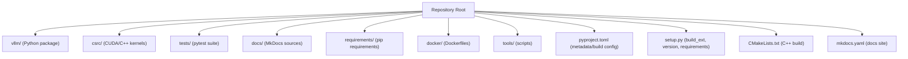
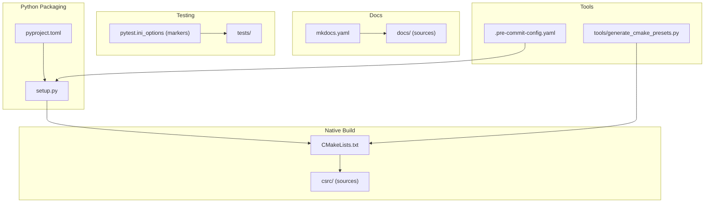
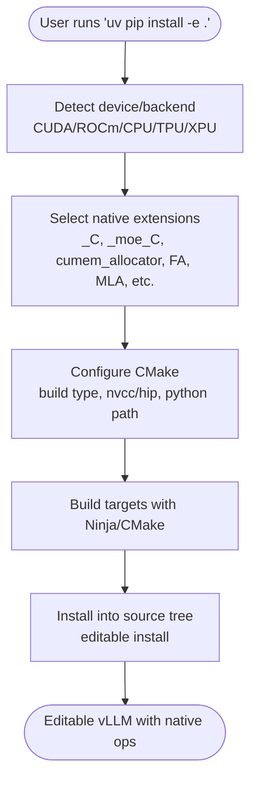
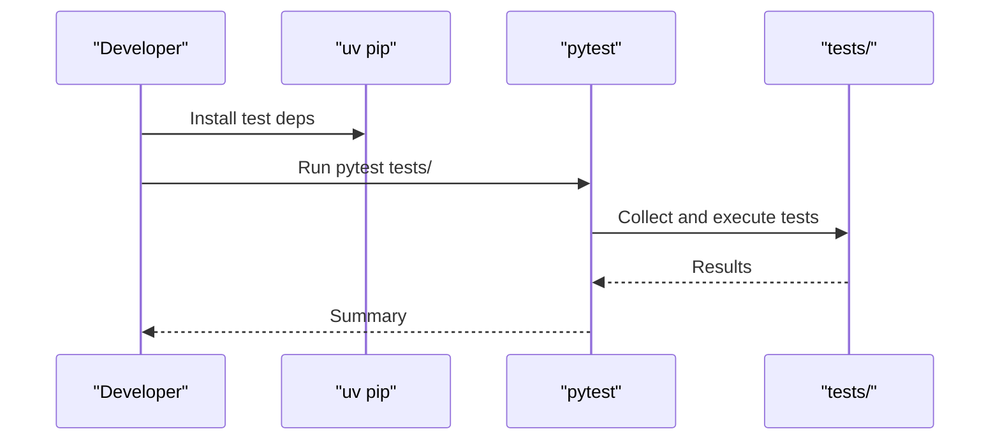
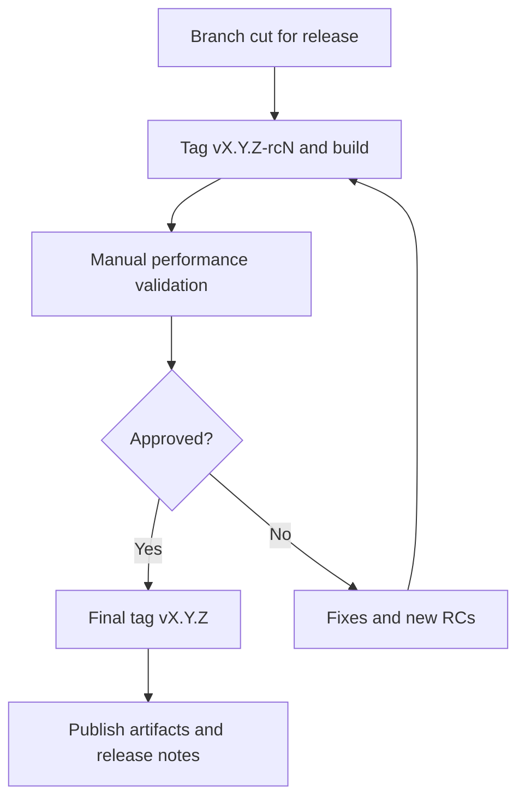
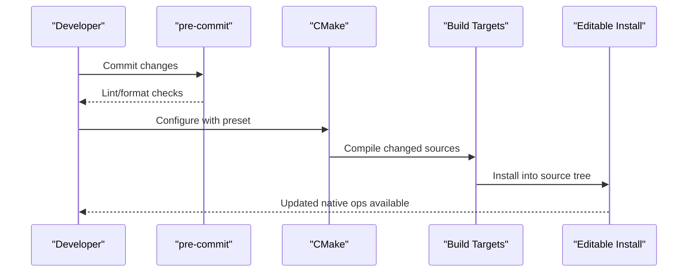
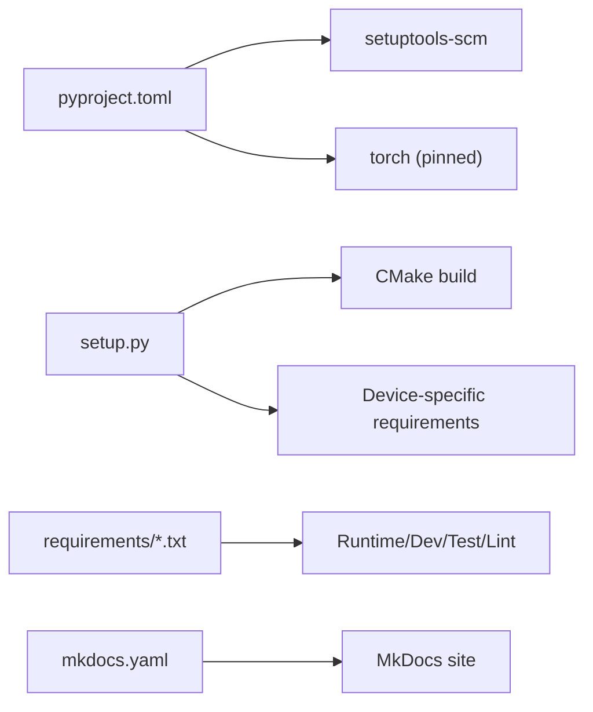

# Development Guide

<cite>
**Referenced Files in This Document**
- [README.md](file://README.md)
- [CONTRIBUTING.md](file://CONTRIBUTING.md)
- [RELEASE.md](file://RELEASE.md)
- [CODE_OF_CONDUCT.md](file://CODE_OF_CONDUCT.md)
- [SECURITY.md](file://SECURITY.md)
- [pyproject.toml](file://pyproject.toml)
- [setup.py](file://setup.py)
- [CMakeLists.txt](file://CMakeLists.txt)
- [mkdocs.yaml](file://mkdocs.yaml)
- [docs/contributing/README.md](file://docs/contributing/README.md)
- [docs/contributing/incremental_build.md](file://docs/contributing/incremental_build.md)
- [docs/contributing/profiling.md](file://docs/contributing/profiling.md)
- [docs/contributing/deprecation_policy.md](file://docs/contributing/deprecation_policy.md)
- [docs/contributing/model/README.md](file://docs/contributing/model/README.md)
- [.pre-commit-config.yaml](file://.pre-commit-config.yaml)
- [.clang-format](file://.clang-format)
- [.markdownlint.yaml](file://.markdownlint.yaml)
- [.yapfignore](file://.yapfignore)
- [requirements/build.txt](file://requirements/build.txt)
- [requirements/common.txt](file://requirements/common.txt)
- [requirements/dev.txt](file://requirements/dev.txt)
- [requirements/docs.txt](file://requirements/docs.txt)
- [requirements/test.txt](file://requirements/test.txt)
- [requirements/lint.txt](file://requirements/lint.txt)
- [docker/Dockerfile](file://docker/Dockerfile)
- [docker/Dockerfile.cpu](file://docker/Dockerfile.cpu)
- [docker/Dockerfile.rocm](file://docker/Dockerfile.rocm)
- [tools/generate_cmake_presets.py](file://tools/generate_cmake_presets.py)
- [tools/check_repo.sh](file://tools/check_repo.sh)
</cite>

## Table of Contents
1. [Introduction](#introduction)
2. [Project Structure](#project-structure)
3. [Core Components](#core-components)
4. [Architecture Overview](#architecture-overview)
5. [Detailed Component Analysis](#detailed-component-analysis)
6. [Dependency Analysis](#dependency-analysis)
7. [Performance Considerations](#performance-considerations)
8. [Troubleshooting Guide](#troubleshooting-guide)
9. [Conclusion](#conclusion)
10. [Appendices](#appendices)

## Introduction
This Development Guide provides a comprehensive overview of how to contribute to vLLM, covering the development workflow, environment setup, build system, testing, release process, code review guidelines, issue reporting, and feature development. It also documents the project’s code style standards, development tools, and CI/CD processes, with practical examples for local development and contribution workflows.

## Project Structure
At a high level, vLLM is organized into:
- Core Python package under vllm/
- Native extensions and CUDA/C++ kernels under csrc/
- Build system glue in setup.py and CMakeLists.txt
- Documentation sources under docs/
- Tests under tests/
- Requirements and Dockerfiles for environment reproducibility
- Tools for profiling, incremental builds, and repository health

**Section sources**
- [README.md](file://README.md#L1-L120)
- [pyproject.toml](file://pyproject.toml#L1-L60)
- [setup.py](file://setup.py#L1-L120)
- [CMakeLists.txt](file://CMakeLists.txt#L1-L60)
- [mkdocs.yaml](file://mkdocs.yaml#L1-L60)

## Core Components
- Build system: Python packaging with setuptools and a custom build_ext that integrates CMake for native extensions. The build selects targets based on the detected device (CUDA, ROCm, CPU, TPU, XPU) and supports precompiled wheels.
- C++/CUDA build: CMake orchestrates kernel compilation, architecture selection, and optional third-party dependencies (e.g., CUTLASS). It conditionally enables device-specific kernels and flags.
- Documentation: MkDocs site built from docs/, with API autonav and Material theme.
- Testing: pytest-based test suite with markers for model categories, distributed tests, and optional splits.
- Development tools: pre-commit hooks, incremental CMake workflow, profiling utilities, and Dockerfiles for reproducible environments.

**Section sources**
- [setup.py](file://setup.py#L120-L220)
- [CMakeLists.txt](file://CMakeLists.txt#L60-L140)
- [pyproject.toml](file://pyproject.toml#L90-L140)
- [mkdocs.yaml](file://mkdocs.yaml#L50-L120)
- [docs/contributing/README.md](file://docs/contributing/README.md#L119-L150)

## Architecture Overview
The development and build architecture ties together Python packaging, CMake-based native compilation, and a documentation pipeline.

**Diagram sources**
- [pyproject.toml](file://pyproject.toml#L1-L60)
- [setup.py](file://setup.py#L120-L220)
- [CMakeLists.txt](file://CMakeLists.txt#L60-L140)
- [mkdocs.yaml](file://mkdocs.yaml#L50-L120)
- [.pre-commit-config.yaml](file://.pre-commit-config.yaml#L1-L120)
- [tools/generate_cmake_presets.py](file://tools/generate_cmake_presets.py#L1-L120)

**Section sources**
- [pyproject.toml](file://pyproject.toml#L1-L60)
- [setup.py](file://setup.py#L120-L220)
- [CMakeLists.txt](file://CMakeLists.txt#L60-L140)
- [mkdocs.yaml](file://mkdocs.yaml#L50-L120)

## Detailed Component Analysis

### Contribution Process and Code Style
- Contribution entry point: The repository directs contributors to the documentation site for contribution details.
- Code style: Python linting and formatting are enforced via pre-commit hooks. The repository includes configuration files for formatting and linting.
- Commit sign-off: DCO sign-off is required for contributions.

Practical steps:
- Fork and clone the repository.
- Set up a Python virtual environment and install development dependencies.
- Install pre-commit hooks and run them locally.
- Submit a pull request with a descriptive title and classification.

**Section sources**
- [CONTRIBUTING.md](file://CONTRIBUTING.md#L1-L4)
- [docs/contributing/README.md](file://docs/contributing/README.md#L150-L214)
- [.pre-commit-config.yaml](file://.pre-commit-config.yaml#L1-L120)
- [.clang-format](file://.clang-format#L1-L120)
- [.markdownlint.yaml](file://.markdownlint.yaml#L1-L120)
- [.yapfignore](file://.yapfignore#L1-L120)

### Development Environment Setup
Recommended local setup:
- Use Python 3.10–3.13; the default Dockerfile uses 3.12 and CI primarily tests with 3.12.
- Install build dependencies (cmake, ninja, ccache/sccache) from requirements/build.txt.
- For editable installs:
  - Use precompiled wheels for faster initial install, then iterate with CMake for native kernels.
  - Or build from source with CMake and install targets into the source tree.

Verification:
- Ensure nvcc is available and CMake can find it.
- Confirm editable install resolves vllm modules and native extensions.

**Section sources**
- [docs/contributing/README.md](file://docs/contributing/README.md#L27-L60)
- [docs/contributing/incremental_build.md](file://docs/contributing/incremental_build.md#L1-L40)
- [requirements/build.txt](file://requirements/build.txt#L1-L120)
- [docker/Dockerfile](file://docker/Dockerfile#L1-L120)

### Build System
- Python packaging: pyproject.toml defines metadata, dynamic versioning, and build requirements. setuptools-scm is used for versioning.
- Custom build_ext: setup.py implements a CMake-based build_ext that configures and builds native extensions, supports parallelism, and integrates with editable installs.
- Device targeting: setup.py detects CUDA/ROCm/TPU/CPU/XPU and selects appropriate extensions and requirements.
- Version suffixes: setup.py appends device/version suffixes to distinguish wheels (e.g., cu, rocm, tpu, cpu, xpu).

**Diagram sources**
- [setup.py](file://setup.py#L120-L220)
- [setup.py](file://setup.py#L220-L320)
- [setup.py](file://setup.py#L320-L420)
- [CMakeLists.txt](file://CMakeLists.txt#L60-L140)

**Section sources**
- [pyproject.toml](file://pyproject.toml#L1-L60)
- [setup.py](file://setup.py#L120-L220)
- [setup.py](file://setup.py#L220-L320)
- [setup.py](file://setup.py#L320-L420)
- [CMakeLists.txt](file://CMakeLists.txt#L60-L140)

### Testing Procedures
- Test runner: pytest with custom markers for model categories, distributed tests, and optional suites.
- Local testing:
  - Install test requirements from requirements/common.txt and requirements/dev.txt.
  - Run pytest on targeted test files or the entire suite.
- GPU vs CPU: Not all tests pass on CPU; rely on CI for full coverage when GPU is unavailable.

**Diagram sources**
- [docs/contributing/README.md](file://docs/contributing/README.md#L119-L150)
- [requirements/common.txt](file://requirements/common.txt#L1-L120)
- [requirements/dev.txt](file://requirements/dev.txt#L1-L120)

**Section sources**
- [docs/contributing/README.md](file://docs/contributing/README.md#L119-L150)
- [requirements/common.txt](file://requirements/common.txt#L1-L120)
- [requirements/dev.txt](file://requirements/dev.txt#L1-L120)

### Release Process
- Versioning: Right-shifted scheme with frequent patch releases and optional post-releases.
- Branching: Dedicated release branches cut prior to release; post-releases reuse the branch.
- Cherry-pick criteria: Regression fixes, critical fixes, fixes for new features in the latest release, documentation improvements, and release-specific changes.
- Manual validations: End-to-end performance validation on selected models and hardware via PyTorch CI.

**Diagram sources**
- [RELEASE.md](file://RELEASE.md#L1-L91)

**Section sources**
- [RELEASE.md](file://RELEASE.md#L1-L91)

### Code Review Guidelines
- PR classification: Use standardized prefixes (Bugfix, CI/Build, Doc, Model, Frontend, Kernel, Core, Hardware[V], Misc).
- Quality standards: Follow Google Python and C++ style guides, pass linters, include tests, and update docs when user-facing behavior changes.
- Large changes: RFC discussion preferred for major architectural changes (>500 LOC excluding kernel/data/config/test).
- Review expectations: Assigned reviewers, periodic status updates, action-required labels, and readiness indicators.

**Section sources**
- [docs/contributing/README.md](file://docs/contributing/README.md#L157-L214)
- [docs/contributing/README.md](file://docs/contributing/README.md#L215-L269)

### Issue Reporting and Security
- Issues: Search existing issues first; file new ones with relevant information.
- Security: Report vulnerabilities privately via GitHub Security Advisories; follow severity and triage process.

**Section sources**
- [docs/contributing/README.md](file://docs/contributing/README.md#L150-L156)
- [SECURITY.md](file://SECURITY.md#L1-L51)

### Feature Development Workflows
- Model integration: Many decoder models can be loaded via Transformers backend automatically; consult model integration docs for step-by-step guidance.
- Deprecations: Follow the deprecation policy for CLI/env/API changes across minor releases.

**Section sources**
- [docs/contributing/model/README.md](file://docs/contributing/model/README.md#L1-L24)
- [docs/contributing/deprecation_policy.md](file://docs/contributing/deprecation_policy.md#L1-L88)

### Development Tools
- Pre-commit: Enforce formatting and linting; run locally and on CI.
- Incremental builds: Use CMakeUserPresets.json and cmake --preset to rebuild only changed native components.
- Profiling: Torch profiler and NVIDIA Nsight Systems support for kernel and runtime analysis.

**Diagram sources**
- [.pre-commit-config.yaml](file://.pre-commit-config.yaml#L1-L120)
- [tools/generate_cmake_presets.py](file://tools/generate_cmake_presets.py#L1-L120)
- [CMakeLists.txt](file://CMakeLists.txt#L60-L140)
- [setup.py](file://setup.py#L120-L220)

**Section sources**
- [.pre-commit-config.yaml](file://.pre-commit-config.yaml#L1-L120)
- [docs/contributing/incremental_build.md](file://docs/contributing/incremental_build.md#L1-L150)
- [docs/contributing/profiling.md](file://docs/contributing/profiling.md#L1-L120)

### CI/CD Processes
- Documentation site: MkDocs builds the docs site with API autonav and theme configuration.
- CI environment: Dockerfiles provide reproducible environments for GPU, CPU, ROCm, and other platforms.
- Repository health: Utility scripts assist in checking repository state and consistency.

**Section sources**
- [mkdocs.yaml](file://mkdocs.yaml#L50-L120)
- [docker/Dockerfile](file://docker/Dockerfile#L1-L120)
- [docker/Dockerfile.cpu](file://docker/Dockerfile.cpu#L1-L120)
- [docker/Dockerfile.rocm](file://docker/Dockerfile.rocm#L1-L120)
- [tools/check_repo.sh](file://tools/check_repo.sh#L1-L120)

## Dependency Analysis
Key dependencies and their roles:
- Build-time: cmake, ninja, setuptools-scm, wheel, jinja2, torch pinned in pyproject.toml.
- Runtime: torch version constraints and device-specific requirements determined by setup.py.
- Linting/formatter: ruff, typos, mypy (configuration present).
- Docs: mkdocs, mkdocstrings, material theme.
- Tests: pytest, pytest-asyncio, and model-specific requirements.

**Diagram sources**
- [pyproject.toml](file://pyproject.toml#L1-L60)
- [setup.py](file://setup.py#L688-L760)
- [requirements/common.txt](file://requirements/common.txt#L1-L120)
- [requirements/dev.txt](file://requirements/dev.txt#L1-L120)
- [requirements/test.txt](file://requirements/test.txt#L1-L120)
- [requirements/lint.txt](file://requirements/lint.txt#L1-L120)
- [mkdocs.yaml](file://mkdocs.yaml#L50-L120)

**Section sources**
- [pyproject.toml](file://pyproject.toml#L1-L60)
- [setup.py](file://setup.py#L688-L760)
- [requirements/common.txt](file://requirements/common.txt#L1-L120)
- [requirements/dev.txt](file://requirements/dev.txt#L1-L120)
- [requirements/test.txt](file://requirements/test.txt#L1-L120)
- [requirements/lint.txt](file://requirements/lint.txt#L1-L120)
- [mkdocs.yaml](file://mkdocs.yaml#L50-L120)

## Performance Considerations
- Profiling: Use torch profiler and NVIDIA Nsight Systems to analyze kernel and runtime behavior. Save traces and visualize with Perfetto or Nsight GUI.
- Continuous profiling: Automated profiling runs exist in the PyTorch integration testing repository; results are published on the vLLM Performance Dashboard.
- Practical tips: Limit profiling scope, adjust VLLM_RPC_TIMEOUT for long flushes, and use spawn multiprocess method for Nsight compatibility.

**Section sources**
- [docs/contributing/profiling.md](file://docs/contributing/profiling.md#L1-L120)
- [docs/contributing/profiling.md](file://docs/contributing/profiling.md#L120-L229)

## Troubleshooting Guide
Common issues and resolutions:
- Python.h missing: Install python3-dev as indicated in the contributing guide.
- GPU/CPU mismatch: Not all tests pass on CPU; rely on CI for full coverage.
- Precompiled wheels: Use VLLM_USE_PRECOMPILED=1 for faster editable installs when iterating on Python code.
- Repository health: Use tools/check_repo.sh to validate repository state.

**Section sources**
- [docs/contributing/README.md](file://docs/contributing/README.md#L137-L149)
- [tools/check_repo.sh](file://tools/check_repo.sh#L1-L120)

## Conclusion
This guide outlined the end-to-end development workflow for vLLM, from environment setup and build configuration to testing, profiling, and releasing. By following the documented processes and leveraging the provided tools, contributors can efficiently develop features, maintain code quality, and collaborate effectively within the community.

## Appendices

### Practical Examples

- Local development setup
  - Create a virtual environment and install build dependencies.
  - Install vLLM in editable mode using precompiled wheels for faster iteration.
  - Enable pre-commit hooks and run them before committing.

- Testing procedures
  - Install test requirements and run pytest on the desired subset of tests.
  - Use markers to select specific model or test categories.

- Contribution workflows
  - Follow PR classification and quality standards.
  - Use DCO sign-off and engage with reviewers for timely feedback.

- Profiling examples
  - Torch profiler: Launch the server with profiler configuration and run a short benchmark.
  - Nsight Systems: Wrap vllm serve or bench commands with nsys profile and analyze reports.

**Section sources**
- [docs/contributing/README.md](file://docs/contributing/README.md#L27-L60)
- [docs/contributing/README.md](file://docs/contributing/README.md#L119-L150)
- [docs/contributing/README.md](file://docs/contributing/README.md#L157-L214)
- [docs/contributing/profiling.md](file://docs/contributing/profiling.md#L1-L120)