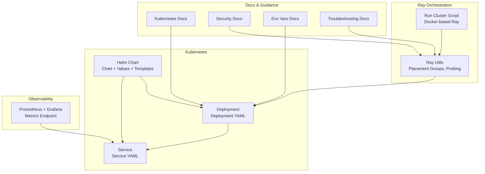
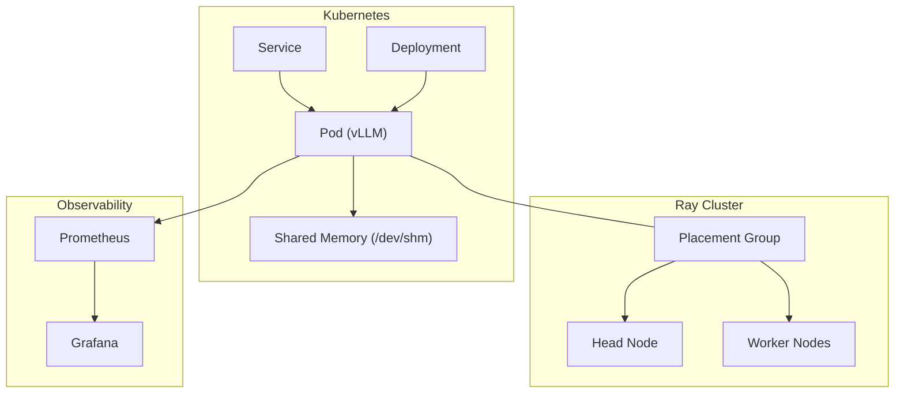
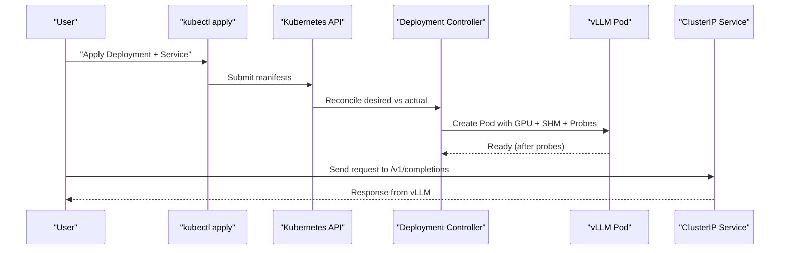
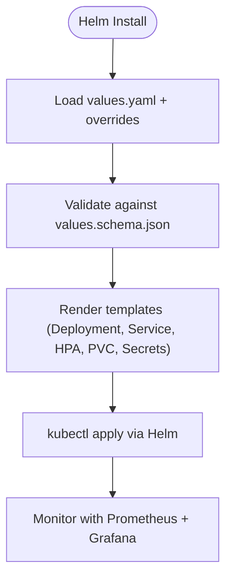
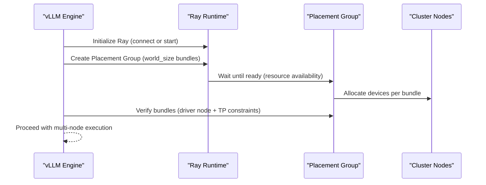
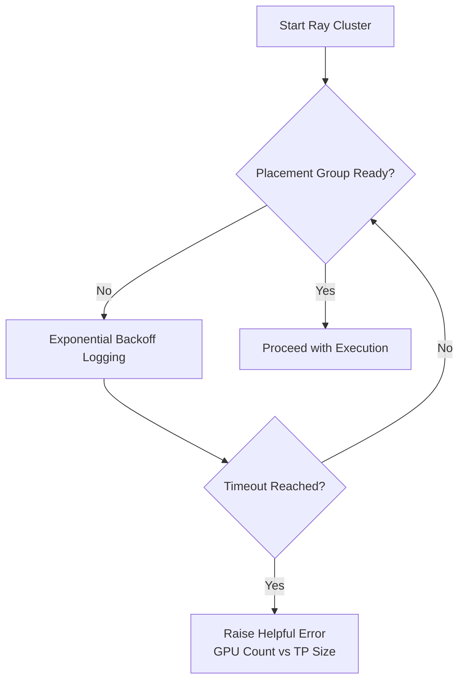
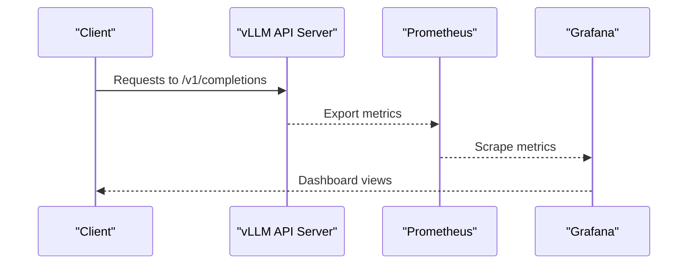
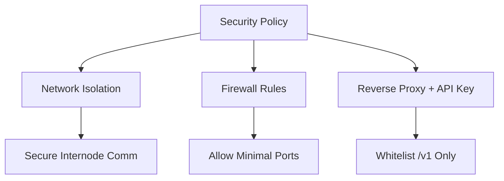
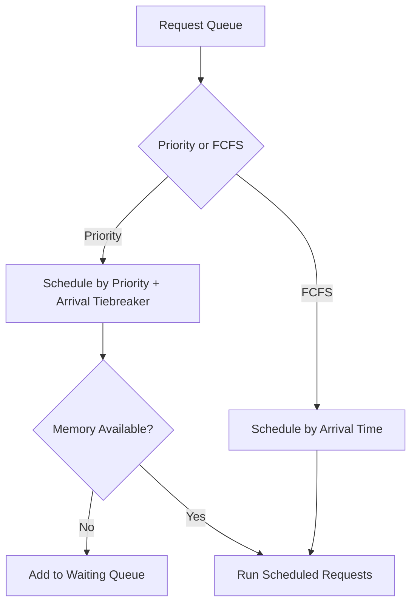
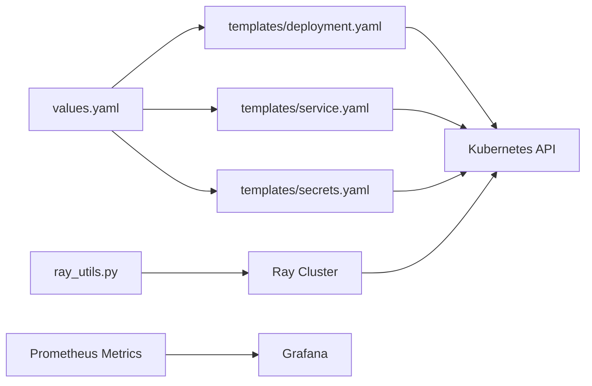

# Cluster Management Integration

<cite>
**Referenced Files in This Document**
- [k8s.md](file://docs/deployment/k8s.md)
- [values.schema.json](file://examples/online_serving/chart-helm/values.schema.json)
- [values.yaml](file://examples/online_serving/chart-helm/values.yaml)
- [deployment.yaml](file://examples/online_serving/chart-helm/templates/deployment.yaml)
- [service.yaml](file://examples/online_serving/chart-helm/templates/service.yaml)
- [custom-objects.yaml](file://examples/online_serving/chart-helm/templates/custom-objects.yaml)
- [secrets.yaml](file://examples/online_serving/chart-helm/templates/secrets.yaml)
- [README.md (Helm)](file://examples/online_serving/chart-helm/README.md)
- [run_cluster.sh](file://examples/online_serving/run_cluster.sh)
- [ray_utils.py](file://vllm/v1/executor/ray_utils.py)
- [distributed_troubleshooting.md](file://docs/serving/distributed_troubleshooting.md)
- [security.md](file://docs/usage/security.md)
- [env_vars.md](file://docs/configuration/env_vars.md)
- [README.md (Prometheus Grafana)](file://examples/online_serving/prometheus_grafana/README.md)
- [README.md (Dashboards)](file://examples/online_serving/dashboards/grafana/README.md)
- [request_queue.py](file://vllm/v1/core/sched/request_queue.py)
- [test_scheduler.py](file://tests/v1/core/test_scheduler.py)
- [test_engine_core.py](file://tests/v1/engine/test_engine_core.py)
</cite>

## Table of Contents
1. [Introduction](#introduction)
2. [Project Structure](#project-structure)
3. [Core Components](#core-components)
4. [Architecture Overview](#architecture-overview)
5. [Detailed Component Analysis](#detailed-component-analysis)
6. [Dependency Analysis](#dependency-analysis)
7. [Performance Considerations](#performance-considerations)
8. [Troubleshooting Guide](#troubleshooting-guide)
9. [Conclusion](#conclusion)
10. [Appendices](#appendices)

## Introduction
This document explains how to integrate vLLM’s distributed serving with cluster management systems. It covers:
- Kubernetes deployment with native manifests and Helm charts, including service exposure, probes, and GPU scheduling
- Ray-based orchestration for multi-node, multi-GPU setups with placement groups, autoscaling, and fault tolerance
- Monitoring and observability via Prometheus and Grafana
- Security considerations for inter-node communication and API exposure
- Practical examples for containerized deployments, service discovery, and load balancing across nodes
- Troubleshooting and performance optimization strategies for cluster deployments

## Project Structure
The repository provides:
- Kubernetes deployment guidance and examples
- Helm chart for automated deployment, autoscaling, and probes
- Ray orchestration utilities and scripts for multi-node clusters
- Observability stack with Prometheus and Grafana
- Security and environment variable guidance

**Diagram sources**
- [k8s.md](file://docs/deployment/k8s.md#L1-L398)
- [values.yaml](file://examples/online_serving/chart-helm/values.yaml#L1-L175)
- [deployment.yaml](file://examples/online_serving/chart-helm/templates/deployment.yaml#L1-L131)
- [service.yaml](file://examples/online_serving/chart-helm/templates/service.yaml#L1-L14)
- [ray_utils.py](file://vllm/v1/executor/ray_utils.py#L224-L466)
- [run_cluster.sh](file://examples/online_serving/run_cluster.sh#L1-L132)
- [README.md (Prometheus Grafana)](file://examples/online_serving/prometheus_grafana/README.md#L1-L58)
- [security.md](file://docs/usage/security.md#L1-L224)
- [env_vars.md](file://docs/configuration/env_vars.md#L1-L13)
- [distributed_troubleshooting.md](file://docs/serving/distributed_troubleshooting.md#L1-L17)

**Section sources**
- [k8s.md](file://docs/deployment/k8s.md#L1-L398)
- [values.yaml](file://examples/online_serving/chart-helm/values.yaml#L1-L175)
- [deployment.yaml](file://examples/online_serving/chart-helm/templates/deployment.yaml#L1-L131)
- [service.yaml](file://examples/online_serving/chart-helm/templates/service.yaml#L1-L14)
- [ray_utils.py](file://vllm/v1/executor/ray_utils.py#L224-L466)
- [run_cluster.sh](file://examples/online_serving/run_cluster.sh#L1-L132)
- [README.md (Prometheus Grafana)](file://examples/online_serving/prometheus_grafana/README.md#L1-L58)
- [security.md](file://docs/usage/security.md#L1-L224)
- [env_vars.md](file://docs/configuration/env_vars.md#L1-L13)
- [distributed_troubleshooting.md](file://docs/serving/distributed_troubleshooting.md#L1-L17)

## Core Components
- Kubernetes Deployment and Service: The documentation and Helm templates define how to deploy vLLM with GPU scheduling, shared memory, liveness/readiness probes, and service exposure.
- Helm Chart: Provides validated values, autoscaling, init containers for model downloads, and GPU-aware affinity.
- Ray Orchestration: Utilities manage placement groups, node/IP alignment, and resource availability checks for multi-node, multi-GPU deployments.
- Observability: Prometheus metrics endpoint and Grafana dashboards for monitoring throughput, latency, and cache utilization.
- Security: Guidance for inter-node communication isolation, firewall configuration, and API exposure limitations.

**Section sources**
- [k8s.md](file://docs/deployment/k8s.md#L132-L382)
- [values.schema.json](file://examples/online_serving/chart-helm/values.schema.json#L1-L329)
- [values.yaml](file://examples/online_serving/chart-helm/values.yaml#L1-L175)
- [deployment.yaml](file://examples/online_serving/chart-helm/templates/deployment.yaml#L1-L131)
- [service.yaml](file://examples/online_serving/chart-helm/templates/service.yaml#L1-L14)
- [ray_utils.py](file://vllm/v1/executor/ray_utils.py#L224-L466)
- [README.md (Prometheus Grafana)](file://examples/online_serving/prometheus_grafana/README.md#L1-L58)
- [security.md](file://docs/usage/security.md#L1-L224)

## Architecture Overview
The vLLM distributed serving architecture integrates Kubernetes and Ray:
- Kubernetes schedules Pods with GPU resources, exposes a Service, and applies probes.
- Ray manages placement groups for multi-GPU and multi-node workloads, ensuring device locality and resource availability.
- Observability stacks Prometheus and Grafana scrape metrics from the vLLM server.

**Diagram sources**
- [k8s.md](file://docs/deployment/k8s.md#L132-L382)
- [deployment.yaml](file://examples/online_serving/chart-helm/templates/deployment.yaml#L1-L131)
- [service.yaml](file://examples/online_serving/chart-helm/templates/service.yaml#L1-L14)
- [ray_utils.py](file://vllm/v1/executor/ray_utils.py#L307-L440)
- [README.md (Prometheus Grafana)](file://examples/online_serving/prometheus_grafana/README.md#L1-L58)

## Detailed Component Analysis

### Kubernetes Deployment and Service
- Deployment defines GPU requests/limits, shared memory mounts, liveness/readiness probes, and optional PVC for model cache.
- Service exposes the API internally and supports session affinity if needed.
- Helm values and templates provide autoscaling, init containers, secrets, and GPU affinity.

**Diagram sources**
- [k8s.md](file://docs/deployment/k8s.md#L132-L382)
- [deployment.yaml](file://examples/online_serving/chart-helm/templates/deployment.yaml#L1-L131)
- [service.yaml](file://examples/online_serving/chart-helm/templates/service.yaml#L1-L14)

**Section sources**
- [k8s.md](file://docs/deployment/k8s.md#L132-L382)
- [values.yaml](file://examples/online_serving/chart-helm/values.yaml#L1-L175)
- [deployment.yaml](file://examples/online_serving/chart-helm/templates/deployment.yaml#L1-L131)
- [service.yaml](file://examples/online_serving/chart-helm/templates/service.yaml#L1-L14)

### Helm Chart for Automated Deployment
- Chart metadata, linting, and unit tests are defined.
- Values include image, replicas, resources, autoscaling, secrets, probes, and GPU affinity.
- Templates render Deployment, Service, HPA, PVC, Secrets, and custom objects.

**Diagram sources**
- [README.md (Helm)](file://examples/online_serving/chart-helm/README.md#L1-L34)
- [values.schema.json](file://examples/online_serving/chart-helm/values.schema.json#L1-L329)
- [values.yaml](file://examples/online_serving/chart-helm/values.yaml#L1-L175)
- [deployment.yaml](file://examples/online_serving/chart-helm/templates/deployment.yaml#L1-L131)
- [service.yaml](file://examples/online_serving/chart-helm/templates/service.yaml#L1-L14)
- [secrets.yaml](file://examples/online_serving/chart-helm/templates/secrets.yaml#L1-L10)
- [custom-objects.yaml](file://examples/online_serving/chart-helm/templates/custom-objects.yaml#L1-L6)

**Section sources**
- [README.md (Helm)](file://examples/online_serving/chart-helm/README.md#L1-L34)
- [values.schema.json](file://examples/online_serving/chart-helm/values.schema.json#L1-L329)
- [values.yaml](file://examples/online_serving/chart-helm/values.yaml#L1-L175)
- [deployment.yaml](file://examples/online_serving/chart-helm/templates/deployment.yaml#L1-L131)
- [service.yaml](file://examples/online_serving/chart-helm/templates/service.yaml#L1-L14)
- [secrets.yaml](file://examples/online_serving/chart-helm/templates/secrets.yaml#L1-L10)
- [custom-objects.yaml](file://examples/online_serving/chart-helm/templates/custom-objects.yaml#L1-L6)

### Ray-Based Distributed Orchestration
- Placement groups coordinate device allocation across nodes.
- Initialization verifies driver node inclusion, tensor-parallel constraints, and waits for resources.
- Utilities provide helpers to compute node counts and TPU node counts.

**Diagram sources**
- [ray_utils.py](file://vllm/v1/executor/ray_utils.py#L307-L440)
- [ray_utils.py](file://vllm/v1/executor/ray_utils.py#L224-L287)
- [ray_utils.py](file://vllm/v1/executor/ray_utils.py#L442-L466)

**Section sources**
- [ray_utils.py](file://vllm/v1/executor/ray_utils.py#L224-L466)
- [run_cluster.sh](file://examples/online_serving/run_cluster.sh#L1-L132)

### Ray Autoscaling and Fault Tolerance
- Placement group readiness is polled with exponential backoff and timeouts.
- Errors distinguish between insufficient GPUs and general resource provisioning failures.
- Node/IP alignment is enforced; mismatches cause explicit errors and guidance.

**Diagram sources**
- [ray_utils.py](file://vllm/v1/executor/ray_utils.py#L224-L287)
- [distributed_troubleshooting.md](file://docs/serving/distributed_troubleshooting.md#L1-L17)

**Section sources**
- [ray_utils.py](file://vllm/v1/executor/ray_utils.py#L224-L287)
- [distributed_troubleshooting.md](file://docs/serving/distributed_troubleshooting.md#L1-L17)

### Observability with Prometheus and Grafana
- vLLM exposes Prometheus metrics by default on the OpenAI-compatible server.
- Prometheus scrapes metrics; Grafana dashboards visualize performance and cache metrics.
- Dashboards can be applied to the cluster via Kubernetes manifests.

**Diagram sources**
- [README.md (Prometheus Grafana)](file://examples/online_serving/prometheus_grafana/README.md#L1-L58)
- [README.md (Dashboards)](file://examples/online_serving/dashboards/grafana/README.md#L55-L60)

**Section sources**
- [README.md (Prometheus Grafana)](file://examples/online_serving/prometheus_grafana/README.md#L1-L58)
- [README.md (Dashboards)](file://examples/online_serving/dashboards/grafana/README.md#L55-L60)

### Security Considerations
- Inter-node communications are insecure by default; isolate nodes on private networks.
- Configure VLLM_HOST_IP and restrict firewall rules to necessary ports.
- API key authentication applies only to /v1 endpoints; deploy behind a reverse proxy to whitelist endpoints and enforce auth.

**Diagram sources**
- [security.md](file://docs/usage/security.md#L1-L224)
- [env_vars.md](file://docs/configuration/env_vars.md#L1-L13)

**Section sources**
- [security.md](file://docs/usage/security.md#L1-L224)
- [env_vars.md](file://docs/configuration/env_vars.md#L1-L13)

### Request Scheduling and Queue Behavior
- Priority and FCFS scheduling policies are supported.
- Tests demonstrate priority tiebreakers by arrival time and preemption when memory constraints occur.

**Diagram sources**
- [request_queue.py](file://vllm/v1/core/sched/request_queue.py#L195-L217)
- [test_scheduler.py](file://tests/v1/core/test_scheduler.py#L1754-L1877)
- [test_engine_core.py](file://tests/v1/engine/test_engine_core.py#L318-L367)

**Section sources**
- [request_queue.py](file://vllm/v1/core/sched/request_queue.py#L195-L217)
- [test_scheduler.py](file://tests/v1/core/test_scheduler.py#L1754-L1877)
- [test_engine_core.py](file://tests/v1/engine/test_engine_core.py#L318-L367)

## Dependency Analysis
- Kubernetes Deployment depends on GPU scheduling and shared memory; Service selects by labels.
- Helm values drive autoscaling, probes, and GPU affinity; templates render Deployment and Service.
- Ray utilities depend on Ray runtime and platform device keys; placement group readiness is central to multi-node orchestration.
- Observability depends on Prometheus scraping the vLLM metrics endpoint and Grafana dashboards.

**Diagram sources**
- [values.yaml](file://examples/online_serving/chart-helm/values.yaml#L1-L175)
- [deployment.yaml](file://examples/online_serving/chart-helm/templates/deployment.yaml#L1-L131)
- [service.yaml](file://examples/online_serving/chart-helm/templates/service.yaml#L1-L14)
- [secrets.yaml](file://examples/online_serving/chart-helm/templates/secrets.yaml#L1-L10)
- [ray_utils.py](file://vllm/v1/executor/ray_utils.py#L307-L440)
- [README.md (Prometheus Grafana)](file://examples/online_serving/prometheus_grafana/README.md#L1-L58)

**Section sources**
- [values.yaml](file://examples/online_serving/chart-helm/values.yaml#L1-L175)
- [deployment.yaml](file://examples/online_serving/chart-helm/templates/deployment.yaml#L1-L131)
- [service.yaml](file://examples/online_serving/chart-helm/templates/service.yaml#L1-L14)
- [ray_utils.py](file://vllm/v1/executor/ray_utils.py#L307-L440)
- [README.md (Prometheus Grafana)](file://examples/online_serving/prometheus_grafana/README.md#L1-L58)

## Performance Considerations
- Prefer single-node tensor-parallel layouts when feasible to avoid cross-node communication overhead.
- Use shared memory (/dev/shm) and appropriate SHM sizes for large models.
- Tune autoscaling thresholds and replica counts based on observed latency and throughput.
- Monitor cache hit rates and prefix caching effectiveness via Grafana dashboards.
- Reduce startup/readiness probe thresholds only after validating cold-start durations.

[No sources needed since this section provides general guidance]

## Troubleshooting Guide
Common issues and remedies:
- Startup/Readiness Probe Failures: Increase failureThreshold or remove probes temporarily to measure startup time.
- Inter-node GPU Communication: Ensure VLLM_HOST_IP matches Ray node IPs; set environment variables during cluster creation.
- No Available Node Types Fulfill Resource Request: Confirm correct IP selection and use ray status/list nodes to verify.
- Placement Group Timeout: Inspect total GPUs vs tensor-parallel size; reduce tensor-parallel-size or add nodes.

**Section sources**
- [k8s.md](file://docs/deployment/k8s.md#L384-L398)
- [distributed_troubleshooting.md](file://docs/serving/distributed_troubleshooting.md#L1-L17)
- [ray_utils.py](file://vllm/v1/executor/ray_utils.py#L224-L287)

## Conclusion
vLLM integrates seamlessly with Kubernetes and Ray for scalable, distributed serving. Kubernetes handles orchestration, GPU scheduling, and service exposure, while Ray manages placement groups and multi-node coordination. Observability via Prometheus and Grafana enables continuous monitoring, and robust security practices protect inter-node and API communications.

[No sources needed since this section summarizes without analyzing specific files]

## Appendices

### Practical Examples Index
- Kubernetes Deployment and Service: [k8s.md](file://docs/deployment/k8s.md#L132-L382)
- Helm Chart Values and Templates: [values.yaml](file://examples/online_serving/chart-helm/values.yaml#L1-L175), [deployment.yaml](file://examples/online_serving/chart-helm/templates/deployment.yaml#L1-L131), [service.yaml](file://examples/online_serving/chart-helm/templates/service.yaml#L1-L14)
- Ray Cluster Launcher: [run_cluster.sh](file://examples/online_serving/run_cluster.sh#L1-L132)
- Observability Setup: [Prometheus Grafana README](file://examples/online_serving/prometheus_grafana/README.md#L1-L58), [Dashboards README](file://examples/online_serving/dashboards/grafana/README.md#L55-L60)
- Security and Environment Variables: [security.md](file://docs/usage/security.md#L1-L224), [env_vars.md](file://docs/configuration/env_vars.md#L1-L13)