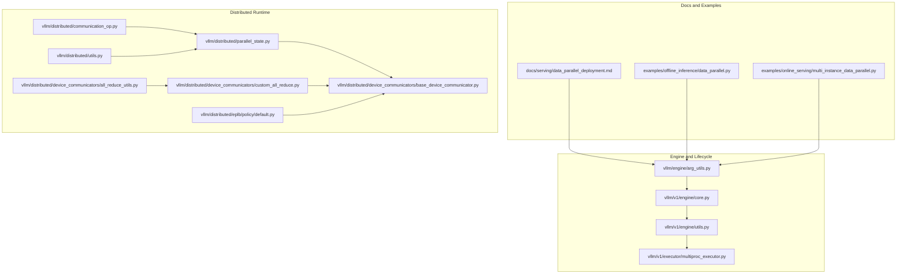
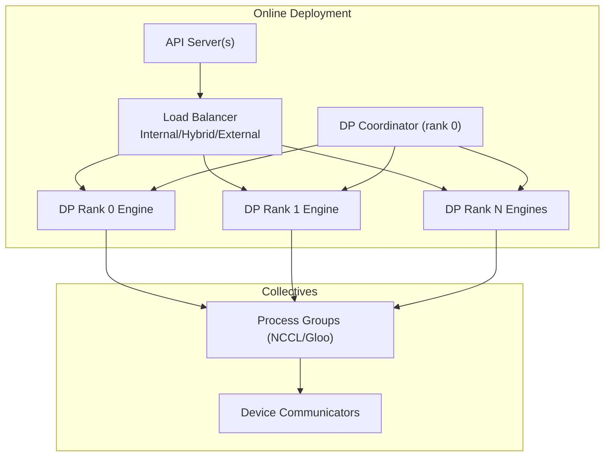
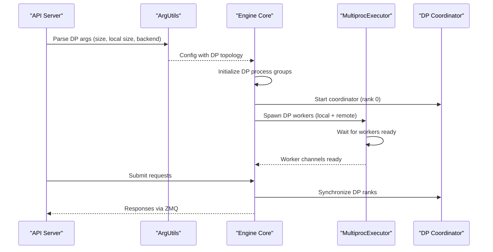
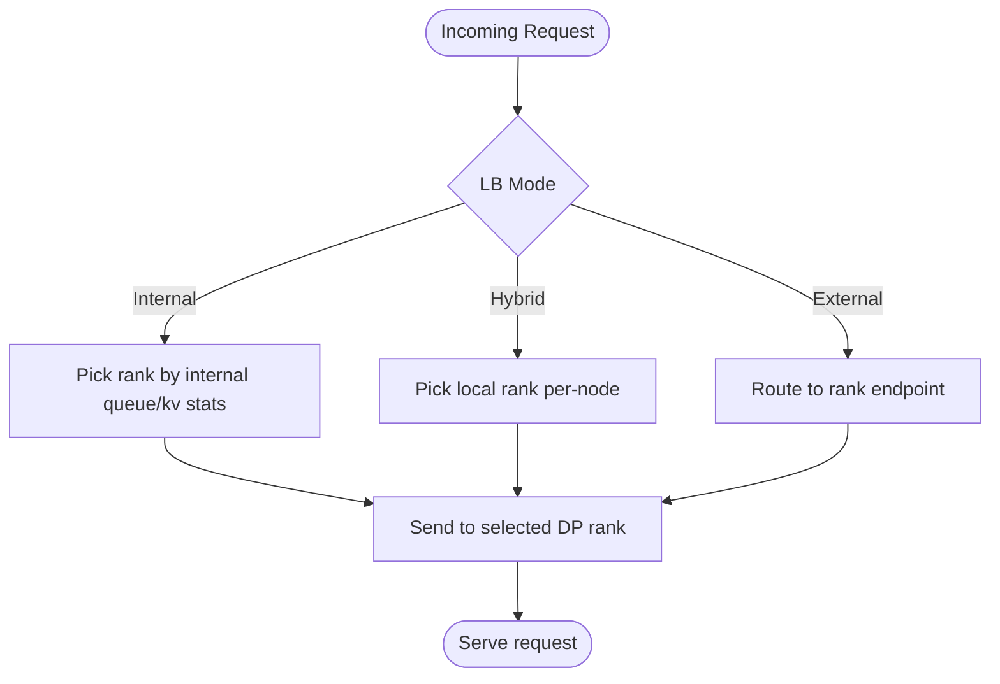
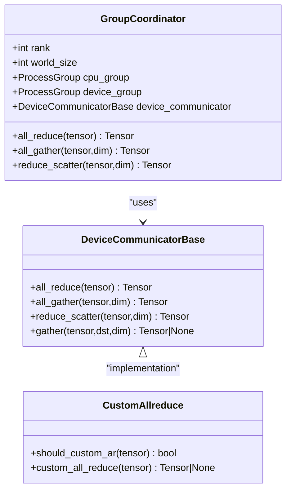
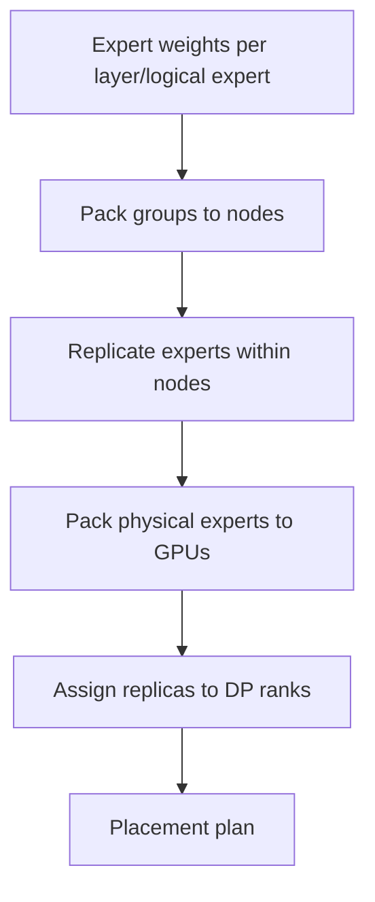
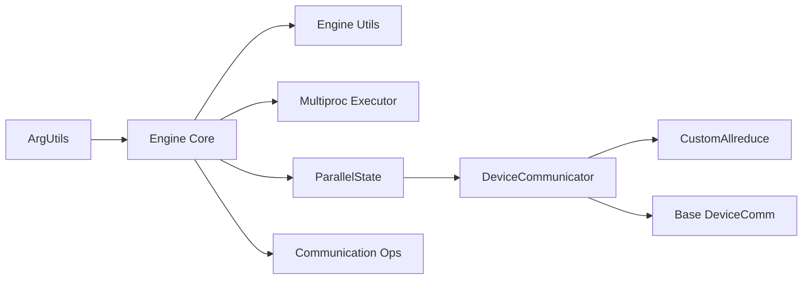

# Data Parallel Deployment

<cite>
**Referenced Files in This Document**
- [data_parallel_deployment.md](file://docs/serving/data_parallel_deployment.md)
- [data_parallel.py](file://examples/offline_inference/data_parallel.py)
- [multi_instance_data_parallel.py](file://examples/online_serving/multi_instance_data_parallel.py)
- [parallel_state.py](file://vllm/distributed/parallel_state.py)
- [communication_op.py](file://vllm/distributed/communication_op.py)
- [custom_all_reduce.py](file://vllm/distributed/device_communicators/custom_all_reduce.py)
- [all_reduce_utils.py](file://vllm/distributed/device_communicators/all_reduce_utils.py)
- [base_device_communicator.py](file://vllm/distributed/device_communicators/base_device_communicator.py)
- [utils.py](file://vllm/distributed/utils.py)
- [default.py](file://vllm/distributed/eplb/policy/default.py)
- [arg_utils.py](file://vllm/engine/arg_utils.py)
- [core.py](file://vllm/v1/engine/core.py)
- [utils.py](file://vllm/v1/engine/utils.py)
- [multiproc_executor.py](file://vllm/v1/executor/multiproc_executor.py)
</cite>

## Table of Contents
1. [Introduction](#introduction)
2. [Project Structure](#project-structure)
3. [Core Components](#core-components)
4. [Architecture Overview](#architecture-overview)
5. [Detailed Component Analysis](#detailed-component-analysis)
6. [Dependency Analysis](#dependency-analysis)
7. [Performance Considerations](#performance-considerations)
8. [Troubleshooting Guide](#troubleshooting-guide)
9. [Conclusion](#conclusion)
10. [Appendices](#appendices)

## Introduction
This document explains data parallel deployment patterns in vLLM, focusing on how multiple replicas of the model are coordinated across processes and nodes for both inference and training scenarios. It covers worker coordination, load balancing strategies, fault tolerance, and inter-node communication. It also documents the implementation of collective operations (all-reduce, reduce-scatter, all-gather), gradient synchronization, and how to configure, manage, and dynamically scale data parallel workers. Practical examples and monitoring/debugging techniques are included, along with integration notes for distributed backends and communication libraries.

## Project Structure
The repository organizes data parallel concerns across:
- Serving documentation and examples for online deployments
- Offline examples for multi-node data parallel inference
- Distributed runtime primitives for collective operations and device communicators
- Engine configuration and lifecycle management for DP workers
- Expert parallelism load balancing (EPLB) policies

**Diagram sources**
- [data_parallel_deployment.md](file://docs/serving/data_parallel_deployment.md#L1-L134)
- [data_parallel.py](file://examples/offline_inference/data_parallel.py#L1-L269)
- [multi_instance_data_parallel.py](file://examples/online_serving/multi_instance_data_parallel.py#L1-L88)
- [parallel_state.py](file://vllm/distributed/parallel_state.py#L1-L800)
- [communication_op.py](file://vllm/distributed/communication_op.py#L1-L44)
- [custom_all_reduce.py](file://vllm/distributed/device_communicators/custom_all_reduce.py#L1-L327)
- [all_reduce_utils.py](file://vllm/distributed/device_communicators/all_reduce_utils.py#L1-L345)
- [base_device_communicator.py](file://vllm/distributed/device_communicators/base_device_communicator.py#L1-L303)
- [utils.py](file://vllm/distributed/utils.py#L1-L546)
- [default.py](file://vllm/distributed/eplb/policy/default.py#L1-L268)
- [arg_utils.py](file://vllm/engine/arg_utils.py#L1452-L1544)
- [core.py](file://vllm/v1/engine/core.py#L1330-L1359)
- [utils.py](file://vllm/v1/engine/utils.py#L789-L826)
- [multiproc_executor.py](file://vllm/v1/executor/multiproc_executor.py#L168-L218)

**Section sources**
- [data_parallel_deployment.md](file://docs/serving/data_parallel_deployment.md#L1-L134)
- [parallel_state.py](file://vllm/distributed/parallel_state.py#L1-L800)
- [arg_utils.py](file://vllm/engine/arg_utils.py#L1452-L1544)

## Core Components
- Data parallel groups and collective operations: vLLM defines group-based collectives (all_reduce, reduce_scatter, all_gather) and wraps them via a device communicator abstraction. These are used for attention and MoE expert synchronization.
- Device communicators: Provide backend-agnostic wrappers for NCCL/CPU collectives and specialized optimizations (e.g., custom all-reduce, symmetric memory-aware all-reduce).
- Engine configuration and lifecycle: The engine parses DP arguments, initializes distributed groups, and manages worker processes and inter-process messaging.
- Load balancing and orchestration: Internal, hybrid, and external load-balancing modes are supported for distributing requests across DP ranks.
- Expert parallelism load balancing (EPLB): Hierarchical policies to replicate and place experts across ranks/nodes efficiently.

**Section sources**
- [communication_op.py](file://vllm/distributed/communication_op.py#L1-L44)
- [parallel_state.py](file://vllm/distributed/parallel_state.py#L110-L276)
- [base_device_communicator.py](file://vllm/distributed/device_communicators/base_device_communicator.py#L92-L303)
- [custom_all_reduce.py](file://vllm/distributed/device_communicators/custom_all_reduce.py#L1-L327)
- [all_reduce_utils.py](file://vllm/distributed/device_communicators/all_reduce_utils.py#L1-L345)
- [arg_utils.py](file://vllm/engine/arg_utils.py#L1452-L1544)
- [default.py](file://vllm/distributed/eplb/policy/default.py#L1-L268)

## Architecture Overview
The data parallel runtime comprises:
- DP ranks as independent “core engine” processes communicating over ZMQ and/or process groups
- API servers coordinating load balancing and request distribution
- A DP Coordinator process to synchronize DP ranks and idle detection for MoE models
- Device communicators for efficient intra-node and inter-node collectives

**Diagram sources**
- [data_parallel_deployment.md](file://docs/serving/data_parallel_deployment.md#L1-L134)
- [utils.py](file://vllm/v1/engine/utils.py#L789-L826)
- [multiproc_executor.py](file://vllm/v1/executor/multiproc_executor.py#L168-L218)
- [parallel_state.py](file://vllm/distributed/parallel_state.py#L278-L598)
- [base_device_communicator.py](file://vllm/distributed/device_communicators/base_device_communicator.py#L135-L204)

## Detailed Component Analysis

### Worker Coordination and Lifecycle Management
- Engine argument parsing infers DP topology, ranks, and backend selection (multiprocess or Ray). It sets DP size, local DP size, and master address/port.
- The engine initializes DP process groups and starts DP Coordinator when DP > 1 and rank == 0.
- Multiprocess executor manages worker creation, readiness, and response message queues across local and remote ranks.

**Diagram sources**
- [arg_utils.py](file://vllm/engine/arg_utils.py#L1452-L1544)
- [core.py](file://vllm/v1/engine/core.py#L1330-L1359)
- [utils.py](file://vllm/v1/engine/utils.py#L789-L826)
- [multiproc_executor.py](file://vllm/v1/executor/multiproc_executor.py#L168-L218)

**Section sources**
- [arg_utils.py](file://vllm/engine/arg_utils.py#L1452-L1544)
- [core.py](file://vllm/v1/engine/core.py#L1330-L1359)
- [utils.py](file://vllm/v1/engine/utils.py#L789-L826)
- [multiproc_executor.py](file://vllm/v1/executor/multiproc_executor.py#L168-L218)

### Load Balancing Strategies
- Internal load balancing: API server balances requests among DP ranks based on per-engine queues and KV cache state.
- Hybrid load balancing: Each node exposes its own API server(s) and forwards only locally colocated DP ranks; upstream LB distributes across nodes.
- External load balancing: Each DP rank is a separate deployment with its own endpoint; external router uses telemetry for routing.

**Diagram sources**
- [data_parallel_deployment.md](file://docs/serving/data_parallel_deployment.md#L23-L134)

**Section sources**
- [data_parallel_deployment.md](file://docs/serving/data_parallel_deployment.md#L23-L134)

### Inter-Node Communication and Collective Operations
- Process groups: vLLM constructs device and CPU groups per rank and selects device communicators based on platform and backend.
- Collectives: all_reduce, reduce_scatter, all_gather are exposed via group APIs and device communicators. Specialized implementations include custom all-reduce and symmetric memory-aware all-reduce for large DP sizes.
- Tensor parallel vs data parallel: Model-parallel wrappers delegate to TP groups; DP collectives operate across DP ranks.

**Diagram sources**
- [parallel_state.py](file://vllm/distributed/parallel_state.py#L278-L598)
- [base_device_communicator.py](file://vllm/distributed/device_communicators/base_device_communicator.py#L92-L204)
- [custom_all_reduce.py](file://vllm/distributed/device_communicators/custom_all_reduce.py#L1-L327)

**Section sources**
- [parallel_state.py](file://vllm/distributed/parallel_state.py#L110-L276)
- [communication_op.py](file://vllm/distributed/communication_op.py#L1-L44)
- [base_device_communicator.py](file://vllm/distributed/device_communicators/base_device_communicator.py#L135-L204)
- [custom_all_reduce.py](file://vllm/distributed/device_communicators/custom_all_reduce.py#L1-L327)
- [all_reduce_utils.py](file://vllm/distributed/device_communicators/all_reduce_utils.py#L1-L120)

### Gradient Synchronization and Training
- vLLM’s DP collectives are used for attention and MoE expert synchronization. The device communicator abstractions provide all_reduce/reduce_scatter/all_gather semantics suitable for gradient synchronization across DP ranks.
- For training scenarios, gradients are synchronized using the same DP process groups and device communicators.

**Section sources**
- [communication_op.py](file://vllm/distributed/communication_op.py#L1-L44)
- [parallel_state.py](file://vllm/distributed/parallel_state.py#L480-L598)
- [base_device_communicator.py](file://vllm/distributed/device_communicators/base_device_communicator.py#L135-L204)

### Expert Parallelism Load Balancing (EPLB)
- Hierarchical policy balances experts across nodes, GPUs, and DP ranks based on logical expert weights and replication targets.
- Replication minimizes maximum load across physical experts; grouping ensures locality-aware placement.

**Diagram sources**
- [default.py](file://vllm/distributed/eplb/policy/default.py#L1-L268)

**Section sources**
- [default.py](file://vllm/distributed/eplb/policy/default.py#L1-L268)

### Practical Configuration Examples
- Online self-contained DP with internal LB: Configure DP size and optionally TP size; supports multi-node with explicit DP address/port and optional Ray backend.
- Hybrid LB: Enable per-node API servers and set local DP size and start rank per node.
- External LB: Launch each DP rank as a separate server with distinct ports; coordinator runs on rank 0 when applicable.

**Section sources**
- [data_parallel_deployment.md](file://docs/serving/data_parallel_deployment.md#L23-L134)

### Offline Multi-Instance Data Parallel
- Example demonstrates launching multiple DP ranks across nodes with explicit master address/port and per-rank GPU assignment.
- Each rank loads a shard of the dataset and generates independently.

**Section sources**
- [data_parallel.py](file://examples/offline_inference/data_parallel.py#L1-L269)

### Online Multi-Instance Data Parallel
- Example shows connecting to multiple DP instances and sending requests to a specific DP rank via the async engine client.

**Section sources**
- [multi_instance_data_parallel.py](file://examples/online_serving/multi_instance_data_parallel.py#L1-L88)

## Dependency Analysis
Key dependencies and relationships:
- Engine argument parsing depends on DP topology and backend selection
- Engine core initializes DP groups and starts coordinator
- Multiproc executor manages worker lifecycle and inter-process messaging
- Device communicators depend on platform capabilities and group backends
- Collectives depend on process groups and device communicators

**Diagram sources**
- [arg_utils.py](file://vllm/engine/arg_utils.py#L1452-L1544)
- [core.py](file://vllm/v1/engine/core.py#L1330-L1359)
- [utils.py](file://vllm/v1/engine/utils.py#L789-L826)
- [multiproc_executor.py](file://vllm/v1/executor/multiproc_executor.py#L168-L218)
- [parallel_state.py](file://vllm/distributed/parallel_state.py#L278-L598)
- [base_device_communicator.py](file://vllm/distributed/device_communicators/base_device_communicator.py#L135-L204)
- [custom_all_reduce.py](file://vllm/distributed/device_communicators/custom_all_reduce.py#L1-L327)
- [communication_op.py](file://vllm/distributed/communication_op.py#L1-L44)

**Section sources**
- [arg_utils.py](file://vllm/engine/arg_utils.py#L1452-L1544)
- [core.py](file://vllm/v1/engine/core.py#L1330-L1359)
- [utils.py](file://vllm/v1/engine/utils.py#L789-L826)
- [multiproc_executor.py](file://vllm/v1/executor/multiproc_executor.py#L168-L218)
- [parallel_state.py](file://vllm/distributed/parallel_state.py#L278-L598)
- [base_device_communicator.py](file://vllm/distributed/device_communicators/base_device_communicator.py#L135-L204)
- [custom_all_reduce.py](file://vllm/distributed/device_communicators/custom_all_reduce.py#L1-L327)
- [communication_op.py](file://vllm/distributed/communication_op.py#L1-L44)

## Performance Considerations
- Custom all-reduce: Enabled when conditions permit (supported world size, NVLink/XGMI connectivity, P2P access). Provides out-of-place all-reduce with CUDA graph support.
- Symmetric memory-aware all-reduce: Used for large DP sizes when symmetric memory is available and thresholds are met.
- P2P and NVLink checks: Cached and validated to avoid repeated expensive checks; fallback to NCCL otherwise.
- Barrier and rendezvous utilities: Stateless TCP-based store for robust synchronization without global process group pollution.

**Section sources**
- [custom_all_reduce.py](file://vllm/distributed/device_communicators/custom_all_reduce.py#L1-L327)
- [all_reduce_utils.py](file://vllm/distributed/device_communicators/all_reduce_utils.py#L1-L120)
- [utils.py](file://vllm/distributed/utils.py#L367-L546)

## Troubleshooting Guide
Common issues and remedies:
- P2P/NVLink failures: The P2P access cache and actual access tests detect and log connectivity problems; ensure drivers and topology support peer access.
- Multi-node DP misconfiguration: Verify DP address/port and ensure ranks map to correct nodes; use Ray backend for simplified multi-node orchestration.
- Coordinator not running: For MoE DP, coordinator must be started on rank 0; confirm DP size > 1 and engine startup logs.
- Worker readiness and message queues: Multiproc executor waits for workers and response queues; check for deadlocks or missing queue readiness.
- Graceful reconfiguration: Engine supports reinitializing DP groups and updating DP size/rank; ensure local rank is preserved and master IP/port are updated.

**Section sources**
- [all_reduce_utils.py](file://vllm/distributed/device_communicators/all_reduce_utils.py#L250-L345)
- [data_parallel_deployment.md](file://docs/serving/data_parallel_deployment.md#L1-L134)
- [utils.py](file://vllm/v1/engine/utils.py#L789-L826)
- [multiproc_executor.py](file://vllm/v1/executor/multiproc_executor.py#L168-L218)
- [core.py](file://vllm/v1/engine/core.py#L1330-L1359)

## Conclusion
vLLM’s data parallel deployment integrates flexible load balancing modes, robust worker lifecycle management, and efficient collective operations across diverse backends. By leveraging device communicators, DP process groups, and coordinator-driven synchronization, it supports scalable inference and training across single or multiple nodes. Proper configuration of DP topology, backend selection, and monitoring enables reliable and high-performance distributed deployments.

## Appendices
- Monitoring and debugging: Use engine stats logging and DP coordinator telemetry; inspect engine utils for DP coordinator socket addresses and stats publish endpoints.
- Dynamic scaling: Reconfigure DP size and master address/port; preserve local rank and restart workers as needed.

**Section sources**
- [utils.py](file://vllm/v1/engine/utils.py#L789-L826)
- [core.py](file://vllm/v1/engine/core.py#L1330-L1359)