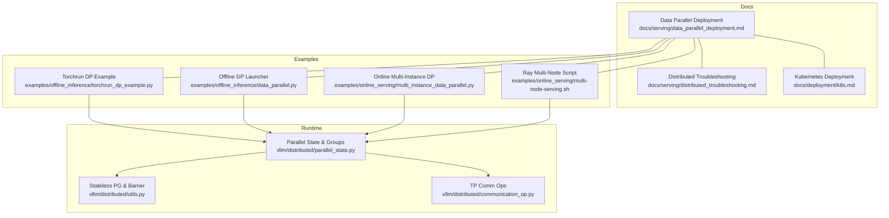
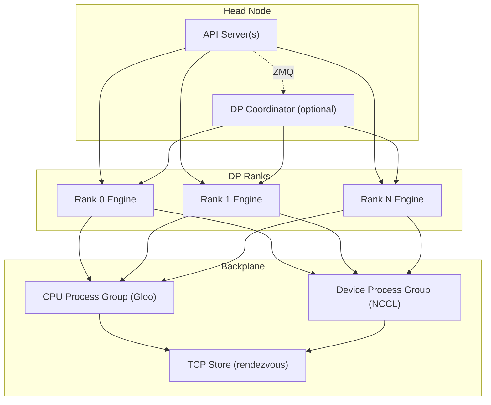
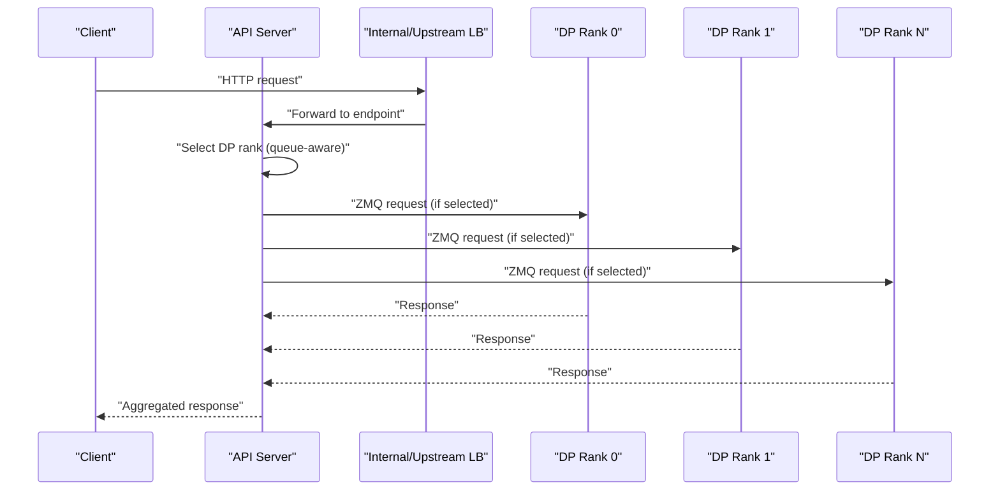
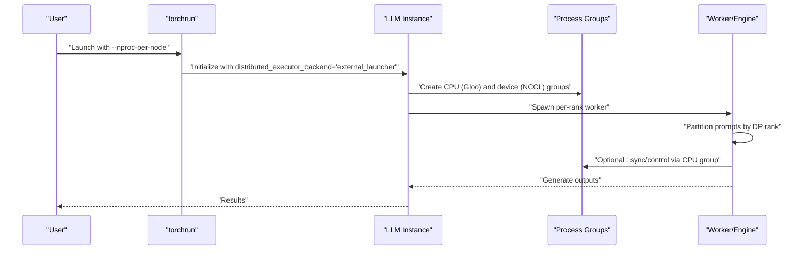
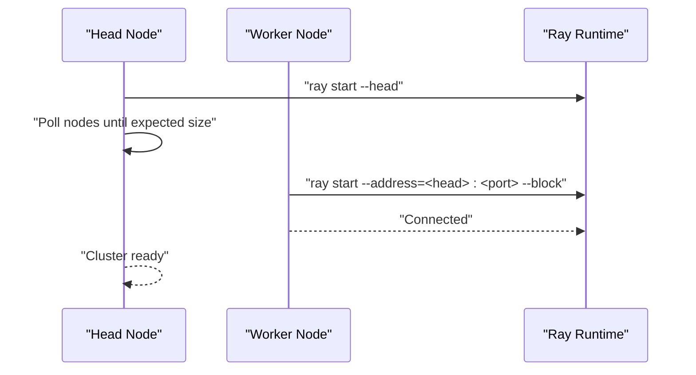
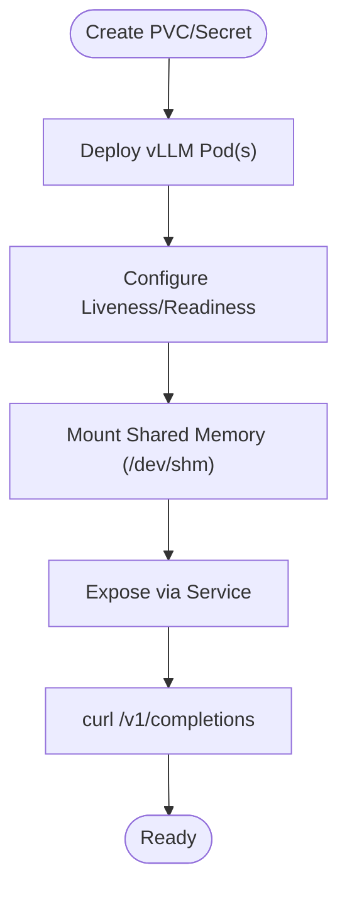
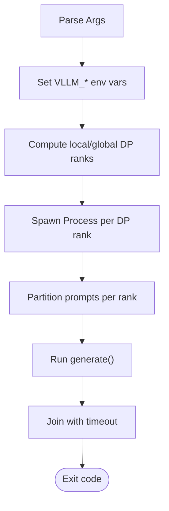
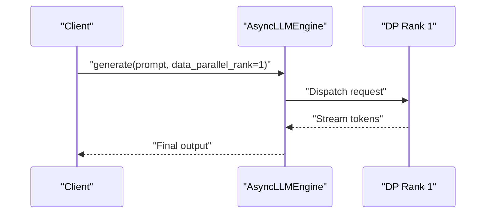
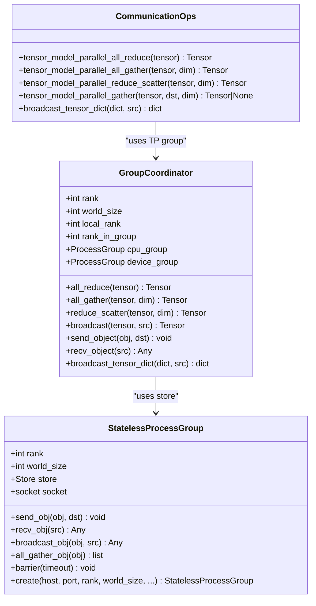
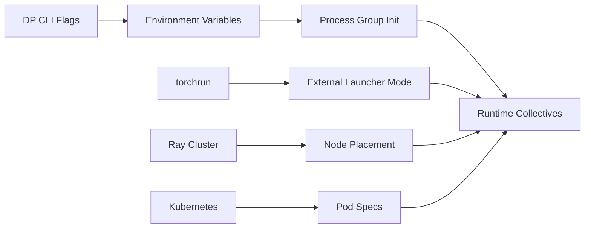

# Distributed Deployment

<cite>
**Referenced Files in This Document**
- [README.md](file://README.md)
- [docs/serving/data_parallel_deployment.md](file://docs/serving/data_parallel_deployment.md)
- [docs/serving/distributed_troubleshooting.md](file://docs/serving/distributed_troubleshooting.md)
- [docs/deployment/k8s.md](file://docs/deployment/k8s.md)
- [examples/offline_inference/data_parallel.py](file://examples/offline_inference/data_parallel.py)
- [examples/offline_inference/torchrun_dp_example.py](file://examples/offline_inference/torchrun_dp_example.py)
- [examples/online_serving/multi_instance_data_parallel.py](file://examples/online_serving/multi_instance_data_parallel.py)
- [examples/online_serving/multi-node-serving.sh](file://examples/online_serving/multi-node-serving.sh)
- [vllm/distributed/parallel_state.py](file://vllm/distributed/parallel_state.py)
- [vllm/distributed/utils.py](file://vllm/distributed/utils.py)
- [vllm/distributed/communication_op.py](file://vllm/distributed/communication_op.py)
</cite>

## Table of Contents
1. [Introduction](#introduction)
2. [Project Structure](#project-structure)
3. [Core Components](#core-components)
4. [Architecture Overview](#architecture-overview)
5. [Detailed Component Analysis](#detailed-component-analysis)
6. [Dependency Analysis](#dependency-analysis)
7. [Performance Considerations](#performance-considerations)
8. [Troubleshooting Guide](#troubleshooting-guide)
9. [Conclusion](#conclusion)
10. [Appendices](#appendices)

## Introduction
This document explains distributed deployment patterns in vLLM with a focus on multi-node setups, process spawning, rank assignment, environment configuration, data parallel coordination, load balancing, and fault tolerance. It covers torchrun-based launching, integration with Kubernetes and Ray, and provides step-by-step production deployment guidance for cloud platforms.

## Project Structure
The repository organizes distributed deployment materials across:
- Documentation: Online serving and deployment guides for data parallel, troubleshooting, and Kubernetes.
- Examples: Standalone scripts for offline and online data parallel deployments, including torchrun-based launching and multi-instance coordination.
- Distributed runtime: Low-level primitives for process groups, stateless rendezvous, and communication operations.

**Diagram sources**
- [docs/serving/data_parallel_deployment.md](file://docs/serving/data_parallel_deployment.md#L1-L134)
- [docs/serving/distributed_troubleshooting.md](file://docs/serving/distributed_troubleshooting.md#L1-L17)
- [docs/deployment/k8s.md](file://docs/deployment/k8s.md#L1-L398)
- [examples/offline_inference/torchrun_dp_example.py](file://examples/offline_inference/torchrun_dp_example.py#L1-L152)
- [examples/offline_inference/data_parallel.py](file://examples/offline_inference/data_parallel.py#L1-L269)
- [examples/online_serving/multi_instance_data_parallel.py](file://examples/online_serving/multi_instance_data_parallel.py#L1-L88)
- [examples/online_serving/multi-node-serving.sh](file://examples/online_serving/multi-node-serving.sh#L1-L120)
- [vllm/distributed/parallel_state.py](file://vllm/distributed/parallel_state.py#L1-L800)
- [vllm/distributed/utils.py](file://vllm/distributed/utils.py#L1-L546)
- [vllm/distributed/communication_op.py](file://vllm/distributed/communication_op.py#L1-L44)

**Section sources**
- [README.md](file://README.md#L65-L92)
- [docs/serving/data_parallel_deployment.md](file://docs/serving/data_parallel_deployment.md#L1-L134)
- [docs/deployment/k8s.md](file://docs/deployment/k8s.md#L1-L398)

## Core Components
- Data Parallel Deployment: Configurable via CLI flags for DP size, TP size, and hybrid/external load balancing modes. Supports MoE with attention and expert parallelism coordination.
- Torchrun-based Launching: External launcher mode for DP with torchrun, enabling custom rank-specific prompt partitioning and inter-process communication via CPU/NCCL process groups.
- Multi-Node Coordination: Ray-based cluster bootstrap and DP rank placement; environment variables for inter-node communication; DP coordinator for idle detection and pause/resume.
- Kubernetes Integration: Pod specs for CPU/GPU deployments, probes, shared memory mounts, and health checks.
- Distributed Runtime Primitives: Process groups, stateless rendezvous, barriers, and tensor-parallel communication wrappers.

**Section sources**
- [docs/serving/data_parallel_deployment.md](file://docs/serving/data_parallel_deployment.md#L1-L134)
- [examples/offline_inference/torchrun_dp_example.py](file://examples/offline_inference/torchrun_dp_example.py#L1-L152)
- [examples/online_serving/multi-node-serving.sh](file://examples/online_serving/multi-node-serving.sh#L1-L120)
- [docs/deployment/k8s.md](file://docs/deployment/k8s.md#L1-L398)
- [vllm/distributed/parallel_state.py](file://vllm/distributed/parallel_state.py#L1-L800)
- [vllm/distributed/utils.py](file://vllm/distributed/utils.py#L1-L546)
- [vllm/distributed/communication_op.py](file://vllm/distributed/communication_op.py#L1-L44)

## Architecture Overview
The distributed serving stack comprises:
- API server(s): Single or multiple endpoints depending on load balancing mode.
- DP Engines: Per-rank engine processes communicating via ZMQ and process groups.
- Coordinator: Optional process to synchronize DP ranks and manage idle/pause cycles.
- Backplane: TCP rendezvous store and process groups for CPU/NCCL comms.
- Orchestration: Ray for multi-node placement and lifecycle; Kubernetes for pod scheduling and GPU drivers.

**Diagram sources**
- [docs/serving/data_parallel_deployment.md](file://docs/serving/data_parallel_deployment.md#L1-L134)
- [vllm/distributed/parallel_state.py](file://vllm/distributed/parallel_state.py#L278-L420)
- [vllm/distributed/utils.py](file://vllm/distributed/utils.py#L367-L546)

## Detailed Component Analysis

### Data Parallel Deployment Modes
- Internal Load Balancing: Single API endpoint; API server balances requests across DP ranks. Supports scaling API servers internally.
- Hybrid Load Balancing: Per-node API servers queue to local DP ranks; upstream LB distributes traffic.
- External Load Balancing: Independent endpoints per DP rank; suitable for large-scale deployments and MoE DP+EP.

**Diagram sources**
- [docs/serving/data_parallel_deployment.md](file://docs/serving/data_parallel_deployment.md#L23-L134)

**Section sources**
- [docs/serving/data_parallel_deployment.md](file://docs/serving/data_parallel_deployment.md#L1-L134)

### Torchrun-based Distributed Launching
- External launcher mode: Each torchrun process spawns a single worker/engine instance; rank-specific prompt slicing ensures balanced workload.
- Inter-process communication: Use CPU process group (Gloo) for control and NCCL device group for data.
- Environment seeds: Explicit seeding ensures deterministic sampling across ranks.

**Diagram sources**
- [examples/offline_inference/torchrun_dp_example.py](file://examples/offline_inference/torchrun_dp_example.py#L1-L152)
- [vllm/distributed/parallel_state.py](file://vllm/distributed/parallel_state.py#L278-L420)
- [vllm/distributed/utils.py](file://vllm/distributed/utils.py#L367-L546)

**Section sources**
- [examples/offline_inference/torchrun_dp_example.py](file://examples/offline_inference/torchrun_dp_example.py#L1-L152)

### Multi-Node Setup with Ray
- Bootstrap: Leader starts Ray head; workers connect with retry loop; cluster waits for expected size.
- Placement: DP ranks distributed across nodes; Ray allocates based on node resources.
- Environment: Configure host IP and communication variables at cluster creation time.

**Diagram sources**
- [examples/online_serving/multi-node-serving.sh](file://examples/online_serving/multi-node-serving.sh#L1-L120)
- [docs/serving/distributed_troubleshooting.md](file://docs/serving/distributed_troubleshooting.md#L1-L17)

**Section sources**
- [examples/online_serving/multi-node-serving.sh](file://examples/online_serving/multi-node-serving.sh#L1-L120)
- [docs/serving/distributed_troubleshooting.md](file://docs/serving/distributed_troubleshooting.md#L1-L17)

### Kubernetes Deployment Patterns
- CPU/GPU deployments: Pod specs with PVC/Secrets, probes, and shared memory mounts.
- GPU scheduling: Resource requests/limits for vendor-specific GPU plugins.
- Health checks: Liveness/readiness probes against the /health endpoint.

**Diagram sources**
- [docs/deployment/k8s.md](file://docs/deployment/k8s.md#L1-L398)

**Section sources**
- [docs/deployment/k8s.md](file://docs/deployment/k8s.md#L1-L398)

### Offline Data Parallel Launcher
- Multi-process spawn per DP rank with environment variables for rank, size, and master address/port.
- Prompt partitioning per rank; graceful exit with timeouts.

**Diagram sources**
- [examples/offline_inference/data_parallel.py](file://examples/offline_inference/data_parallel.py#L1-L269)

**Section sources**
- [examples/offline_inference/data_parallel.py](file://examples/offline_inference/data_parallel.py#L1-L269)

### Online Multi-Instance Data Parallel Client
- Demonstrates selecting a specific DP rank for generation via AsyncLLMEngine.
- Background logging and stat aggregation.

**Diagram sources**
- [examples/online_serving/multi_instance_data_parallel.py](file://examples/online_serving/multi_instance_data_parallel.py#L1-L88)

**Section sources**
- [examples/online_serving/multi_instance_data_parallel.py](file://examples/online_serving/multi_instance_data_parallel.py#L1-L88)

### Distributed Runtime Primitives
- GroupCoordinator: Manages CPU (Gloo) and device (NCCL) groups; provides all_reduce/all_gather/reduce_scatter/broadcast/send/recv APIs.
- StatelessProcessGroup: TCP-backed rendezvous store for forming process groups without global state pollution; robust barrier implementation.
- Communication Ops: Convenience wrappers for tensor-parallel collectives.

**Diagram sources**
- [vllm/distributed/parallel_state.py](file://vllm/distributed/parallel_state.py#L278-L800)
- [vllm/distributed/utils.py](file://vllm/distributed/utils.py#L143-L546)
- [vllm/distributed/communication_op.py](file://vllm/distributed/communication_op.py#L1-L44)

**Section sources**
- [vllm/distributed/parallel_state.py](file://vllm/distributed/parallel_state.py#L1-L800)
- [vllm/distributed/utils.py](file://vllm/distributed/utils.py#L1-L546)
- [vllm/distributed/communication_op.py](file://vllm/distributed/communication_op.py#L1-L44)

## Dependency Analysis
- CLI-driven DP orchestration depends on environment variables and process group initialization.
- torchrun external launcher relies on stateless rendezvous and CPU/NCCL groups for control/data exchange.
- Ray multi-node setup depends on consistent host IP and environment variables across nodes.
- Kubernetes deployments rely on GPU scheduling, shared memory, and health probes.

**Diagram sources**
- [docs/serving/data_parallel_deployment.md](file://docs/serving/data_parallel_deployment.md#L1-L134)
- [examples/offline_inference/torchrun_dp_example.py](file://examples/offline_inference/torchrun_dp_example.py#L1-L152)
- [examples/online_serving/multi-node-serving.sh](file://examples/online_serving/multi-node-serving.sh#L1-L120)
- [docs/deployment/k8s.md](file://docs/deployment/k8s.md#L1-L398)
- [vllm/distributed/utils.py](file://vllm/distributed/utils.py#L367-L546)

**Section sources**
- [docs/serving/data_parallel_deployment.md](file://docs/serving/data_parallel_deployment.md#L1-L134)
- [examples/offline_inference/torchrun_dp_example.py](file://examples/offline_inference/torchrun_dp_example.py#L1-L152)
- [examples/online_serving/multi-node-serving.sh](file://examples/online_serving/multi-node-serving.sh#L1-L120)
- [docs/deployment/k8s.md](file://docs/deployment/k8s.md#L1-L398)
- [vllm/distributed/utils.py](file://vllm/distributed/utils.py#L1-L546)

## Performance Considerations
- Use internal or hybrid load balancing to reduce cross-node traffic and avoid API server bottlenecks.
- Enable chunked prefill and adjust max batched tokens for GPU memory efficiency in Kubernetes.
- Prefer stateless rendezvous and robust barriers to minimize startup synchronization overhead.
- For MoE models, align attention and expert layers across DP ranks and coordinate idle/pause cycles via the DP coordinator.

[No sources needed since this section provides general guidance]

## Troubleshooting Guide
- Inter-node GPU communication verification and environment propagation at cluster creation.
- “No available node types can fulfill resource request”: ensure consistent host IP across nodes.
- Ray observability and KubeRay troubleshooting for multi-node GPU issues.
- Kubernetes readiness/startup probe failures: increase thresholds to accommodate cold start.

**Section sources**
- [docs/serving/distributed_troubleshooting.md](file://docs/serving/distributed_troubleshooting.md#L1-L17)
- [docs/deployment/k8s.md](file://docs/deployment/k8s.md#L384-L398)

## Conclusion
vLLM supports flexible distributed deployment patterns spanning internal/external load balancing, torchrun-based launching, Ray multi-node orchestration, and Kubernetes-native deployments. The runtime provides robust primitives for process groups, rendezvous, and collectives, enabling reliable data parallel inference across heterogeneous environments.

[No sources needed since this section summarizes without analyzing specific files]

## Appendices

### Step-by-Step Production Deployment (Cloud Platforms)
- Prepare cluster: Ensure GPU drivers, shared memory (/dev/shm), and network connectivity across nodes.
- Choose deployment mode:
  - Internal LB: Single API endpoint with built-in queue-aware balancing.
  - Hybrid LB: Per-node API servers behind an upstream load balancer.
  - External LB: Independent endpoints per DP rank with external telemetry-driven routing.
- Launch with torchrun (external launcher) for DP control and deterministic sampling.
- Integrate with Ray for multi-node placement and lifecycle management.
- Deploy on Kubernetes with GPU scheduling, PVC/Secrets, shared memory mounts, and health probes.

**Section sources**
- [docs/serving/data_parallel_deployment.md](file://docs/serving/data_parallel_deployment.md#L23-L134)
- [examples/offline_inference/torchrun_dp_example.py](file://examples/offline_inference/torchrun_dp_example.py#L1-L152)
- [examples/online_serving/multi-node-serving.sh](file://examples/online_serving/multi-node-serving.sh#L1-L120)
- [docs/deployment/k8s.md](file://docs/deployment/k8s.md#L1-L398)