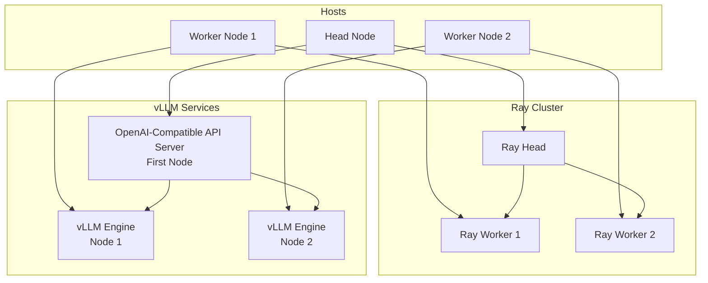
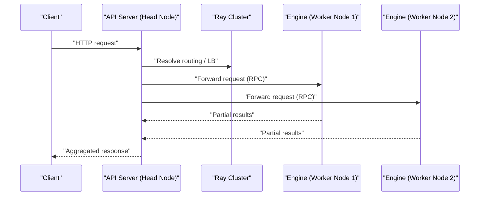
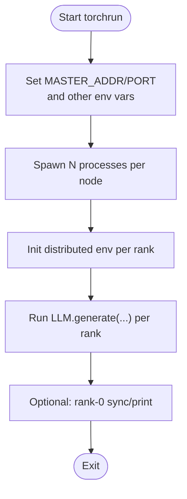
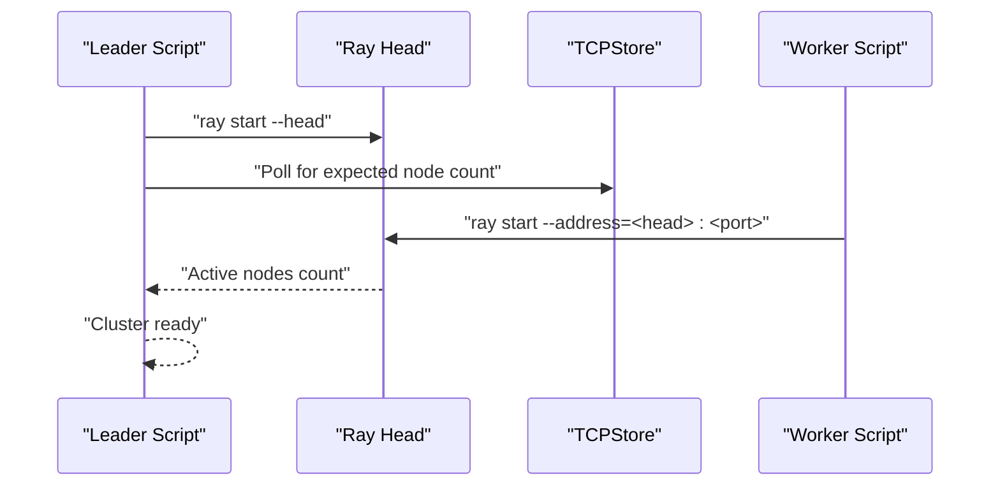
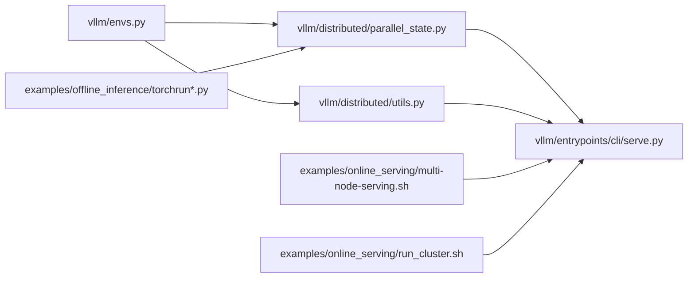

# Multi-Node Setup

<cite>
**Referenced Files in This Document**
- [multi-node-serving.sh](file://examples/online_serving/multi-node-serving.sh)
- [run_cluster.sh](file://examples/online_serving/run_cluster.sh)
- [torchrun_example.py](file://examples/offline_inference/torchrun_example.py)
- [torchrun_dp_example.py](file://examples/offline_inference/torchrun_dp_example.py)
- [envs.py](file://vllm/envs.py)
- [parallel_state.py](file://vllm/distributed/parallel_state.py)
- [utils.py](file://vllm/distributed/utils.py)
- [serve.py](file://vllm/entrypoints/cli/serve.py)
- [distributed_troubleshooting.md](file://docs/serving/distributed_troubleshooting.md)
- [test_internal_lb_dp.py](file://tests/v1/distributed/test_internal_lb_dp.py)
</cite>

## Table of Contents
1. [Introduction](#introduction)
2. [Project Structure](#project-structure)
3. [Core Components](#core-components)
4. [Architecture Overview](#architecture-overview)
5. [Detailed Component Analysis](#detailed-component-analysis)
6. [Dependency Analysis](#dependency-analysis)
7. [Performance Considerations](#performance-considerations)
8. [Troubleshooting Guide](#troubleshooting-guide)
9. [Conclusion](#conclusion)

## Introduction
This document explains how to deploy vLLM in multi-node environments, focusing on distributed serving and inference. It covers host configuration (networking, SSH, environment), torchrun-based distributed launching, rank assignment, environment variable configuration, node roles (first node as API front-end, additional nodes headless), cluster configuration examples, resource allocation, scaling, networking and firewall requirements, and operational troubleshooting.

## Project Structure
The repository provides:
- Online serving helpers for Ray-based multi-node clusters
- Offline torchrun examples for tensor-parallel and data-parallel scenarios
- Distributed runtime utilities and environment variable configuration
- CLI entrypoints for headless and API-serving modes

**Diagram sources**
- [multi-node-serving.sh](file://examples/online_serving/multi-node-serving.sh#L1-L120)
- [run_cluster.sh](file://examples/online_serving/run_cluster.sh#L1-L132)
- [serve.py](file://vllm/entrypoints/cli/serve.py#L81-L112)
- [test_internal_lb_dp.py](file://tests/v1/distributed/test_internal_lb_dp.py#L60-L98)

**Section sources**
- [multi-node-serving.sh](file://examples/online_serving/multi-node-serving.sh#L1-L120)
- [run_cluster.sh](file://examples/online_serving/run_cluster.sh#L1-L132)

## Core Components
- Ray cluster bootstrap and lifecycle management for multi-node serving
- Environment variable configuration for distributed operation (host IP, ports, device visibility)
- Distributed runtime primitives for group creation and communication
- CLI entrypoints for API server and headless engine modes
- Torchrun-based examples for tensor-parallel and data-parallel scenarios

Key responsibilities:
- Host configuration: ensure SSH reachability, consistent VLLM_HOST_IP per node, and firewall open for required ports
- Process spawning: torchrun or Ray-based orchestration
- Rank assignment: MASTER_ADDR/PORT and environment variables for torch.distributed
- Node roles: first node runs API server; additional nodes run engines/headless

**Section sources**
- [envs.py](file://vllm/envs.py#L521-L535)
- [parallel_state.py](file://vllm/distributed/parallel_state.py#L278-L378)
- [utils.py](file://vllm/distributed/utils.py#L367-L419)
- [serve.py](file://vllm/entrypoints/cli/serve.py#L81-L112)
- [torchrun_example.py](file://examples/offline_inference/torchrun_example.py#L1-L77)
- [torchrun_dp_example.py](file://examples/offline_inference/torchrun_dp_example.py#L1-L152)

## Architecture Overview
The multi-node serving architecture uses Ray to coordinate a head node and worker nodes. The head node exposes the API server and coordinates with worker engines. Engines on worker nodes can run in headless mode to accept requests routed from the head.

**Diagram sources**
- [multi-node-serving.sh](file://examples/online_serving/multi-node-serving.sh#L1-L120)
- [run_cluster.sh](file://examples/online_serving/run_cluster.sh#L1-L132)
- [test_internal_lb_dp.py](file://tests/v1/distributed/test_internal_lb_dp.py#L60-L98)

## Detailed Component Analysis

### Host Configuration Requirements
- Network connectivity
  - Nodes must be reachable over the network; Ray uses a TCP rendezvous store and RPC channels
  - Ensure VLLM_HOST_IP is set distinctly on each node to avoid ambiguous interface selection
- SSH access
  - Required for manual orchestration and remote process management
- Environment setup
  - Set VLLM_HOST_IP per node
  - Optionally set VLLM_PORT or rely on port increments
  - Configure device visibility via CUDA_VISIBLE_DEVICES if needed
  - For GPU communication, consider transport-specific environment variables (e.g., NCCL_SOCKET_IFNAME) propagated via cluster launcher

Practical guidance:
- Use a single VLLM_HOST_IP per node; Ray and vLLM will derive bind addresses from it
- If nodes have multiple NICs, pin the interface used for inter-node traffic
- Ensure firewall allows Ray head and worker ports, and API server port

**Section sources**
- [envs.py](file://vllm/envs.py#L521-L535)
- [run_cluster.sh](file://examples/online_serving/run_cluster.sh#L62-L88)
- [distributed_troubleshooting.md](file://docs/serving/distributed_troubleshooting.md#L1-L17)

### torchrun-based Distributed Launching
- Process spawning
  - Use torchrun to spawn N processes per node; ensure nproc-per-node matches tensor-parallel size for tensor-parallel scenarios
- Rank assignment
  - Provide MASTER_ADDR and MASTER_PORT; torchrun sets RANK, LOCAL_RANK, WORLD_SIZE, LOCAL_WORLD_SIZE automatically
- Environment variables
  - Set LOCAL_RANK/CUDA_VISIBLE_DEVICES for GPU binding
  - Set seeds for deterministic sampling across ranks
- Examples
  - Tensor-parallel example demonstrates external launcher mode and rank-0 printing
  - Data-parallel example demonstrates DP rank slicing of prompts and external launcher mode

**Diagram sources**
- [torchrun_example.py](file://examples/offline_inference/torchrun_example.py#L1-L77)
- [torchrun_dp_example.py](file://examples/offline_inference/torchrun_dp_example.py#L1-L152)

**Section sources**
- [torchrun_example.py](file://examples/offline_inference/torchrun_example.py#L1-L77)
- [torchrun_dp_example.py](file://examples/offline_inference/torchrun_dp_example.py#L1-L152)

### Node Role Assignment
- First node (head)
  - Runs the API server and optionally the first data-parallel rank
  - Exposes the OpenAI-compatible endpoint
- Additional nodes (workers)
  - Run engines/headless to serve inference requests
  - Can run multiple engines per node (local DP size) as configured

Operational notes:
- Headless mode disables the API server and runs engines only
- Ensure the API server binds to a single endpoint address/port and forwards to worker engines
- Use data-parallel addressing and RPC port to route requests to worker engines

**Section sources**
- [serve.py](file://vllm/entrypoints/cli/serve.py#L81-L112)
- [test_internal_lb_dp.py](file://tests/v1/distributed/test_internal_lb_dp.py#L60-L98)

### Cluster Configuration and Resource Allocation
- Ray cluster
  - Leader node launches Ray head and waits for expected worker count
  - Worker nodes connect to the head using address and port
- Docker-based Ray cluster
  - Supports host networking and per-node VLLM_HOST_IP
  - Propagates environment variables to containers for consistent configuration
- Resource allocation
  - Assign GPUs per node via CUDA_VISIBLE_DEVICES
  - Control local DP size per node to scale horizontally

**Diagram sources**
- [multi-node-serving.sh](file://examples/online_serving/multi-node-serving.sh#L72-L113)
- [run_cluster.sh](file://examples/online_serving/run_cluster.sh#L104-L118)
- [utils.py](file://vllm/distributed/utils.py#L367-L419)

**Section sources**
- [multi-node-serving.sh](file://examples/online_serving/multi-node-serving.sh#L1-L120)
- [run_cluster.sh](file://examples/online_serving/run_cluster.sh#L1-L132)

### Scaling Out the Distributed System
- Horizontal scaling
  - Add worker nodes to increase capacity; Ray will manage placement
  - Increase local DP size per node to utilize multiple GPUs on the same node
- Vertical scaling
  - Increase tensor-parallel size per node to shard model weights across GPUs
- Load balancing
  - API server routes requests to worker engines; ensure consistent addressing and RPC port configuration

**Section sources**
- [test_internal_lb_dp.py](file://tests/v1/distributed/test_internal_lb_dp.py#L60-L98)

### Networking Requirements, Ports, and Firewall Settings
- Ray rendezvous and RPC
  - Ray head listens on a configurable port; workers connect to it
  - Ensure inbound/outbound connectivity on the Ray port across all nodes
- API server
  - API server binds to a single port; ensure it is reachable from clients
- Inter-node GPU communication
  - Transport-specific environment variables may be required (e.g., NCCL_SOCKET_IFNAME)
  - Propagate environment variables via cluster launcher to apply on all nodes

**Section sources**
- [multi-node-serving.sh](file://examples/online_serving/multi-node-serving.sh#L28-L30)
- [run_cluster.sh](file://examples/online_serving/run_cluster.sh#L104-L118)
- [distributed_troubleshooting.md](file://docs/serving/distributed_troubleshooting.md#L1-L17)

### Practical Examples
- Ray cluster bootstrap
  - Use the helper scripts to start a head and join workers, or run containers with host networking
- torchrun examples
  - Tensor-parallel and data-parallel examples demonstrate external launcher mode and rank coordination

**Section sources**
- [multi-node-serving.sh](file://examples/online_serving/multi-node-serving.sh#L1-L120)
- [run_cluster.sh](file://examples/online_serving/run_cluster.sh#L1-L132)
- [torchrun_example.py](file://examples/offline_inference/torchrun_example.py#L1-L77)
- [torchrun_dp_example.py](file://examples/offline_inference/torchrun_dp_example.py#L1-L152)

## Dependency Analysis
The multi-node setup spans several modules:
- CLI entrypoints depend on engine configuration and distributed mode
- Distributed runtime provides group creation and communication abstractions
- Environment variables drive host IP, ports, and device visibility
- Ray scripts orchestrate cluster lifecycle and node connectivity

**Diagram sources**
- [envs.py](file://vllm/envs.py#L521-L535)
- [parallel_state.py](file://vllm/distributed/parallel_state.py#L278-L378)
- [utils.py](file://vllm/distributed/utils.py#L367-L419)
- [serve.py](file://vllm/entrypoints/cli/serve.py#L81-L112)
- [multi-node-serving.sh](file://examples/online_serving/multi-node-serving.sh#L1-L120)
- [run_cluster.sh](file://examples/online_serving/run_cluster.sh#L1-L132)
- [torchrun_example.py](file://examples/offline_inference/torchrun_example.py#L1-L77)
- [torchrun_dp_example.py](file://examples/offline_inference/torchrun_dp_example.py#L1-L152)

**Section sources**
- [envs.py](file://vllm/envs.py#L521-L535)
- [parallel_state.py](file://vllm/distributed/parallel_state.py#L278-L378)
- [utils.py](file://vllm/distributed/utils.py#L367-L419)
- [serve.py](file://vllm/entrypoints/cli/serve.py#L81-L112)
- [multi-node-serving.sh](file://examples/online_serving/multi-node-serving.sh#L1-L120)
- [run_cluster.sh](file://examples/online_serving/run_cluster.sh#L1-L132)
- [torchrun_example.py](file://examples/offline_inference/torchrun_example.py#L1-L77)
- [torchrun_dp_example.py](file://examples/offline_inference/torchrun_dp_example.py#L1-L152)

## Performance Considerations
- Prefer host networking in containerized setups to minimize overhead
- Tune transport-level environment variables for GPU communication (e.g., NCCL settings) to match cluster topology
- Balance local DP size per node with available GPU memory to avoid fragmentation
- Use a single API endpoint on the head node to simplify client routing and reduce connection overhead

## Troubleshooting Guide
Common issues and remedies:
- Inter-node GPU communication problems
  - Verify NCCL/transport settings and interface selection; propagate environment variables via cluster launcher
- Incorrect IP selection
  - Ensure VLLM_HOST_IP is set consistently and uniquely per node; confirm with Ray status
- Ray observability
  - Use Ray’s observability tools to inspect cluster health, logs, and performance metrics
- Node failures
  - Restart failed worker nodes; Ray will reconnect; ensure API server remains healthy on the head node

**Section sources**
- [distributed_troubleshooting.md](file://docs/serving/distributed_troubleshooting.md#L1-L17)
- [run_cluster.sh](file://examples/online_serving/run_cluster.sh#L62-L88)

## Conclusion
Deploying vLLM across multiple nodes involves careful host configuration, reliable cluster bootstrap, and correct environment variable setup. The repository provides both Ray-based orchestration helpers and torchrun examples to support scalable, distributed serving and inference. By assigning clear node roles, tuning networking and transport settings, and leveraging the provided scripts and environment variables, you can operate robust multi-node vLLM clusters.