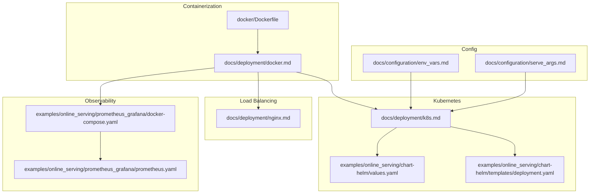
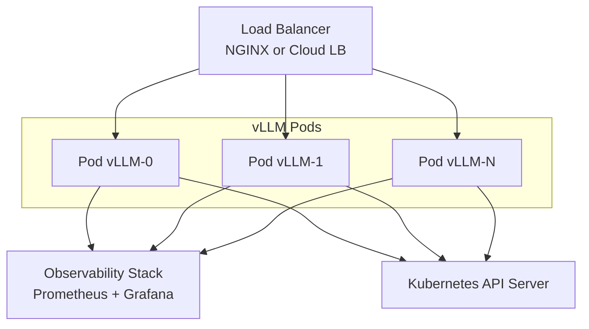
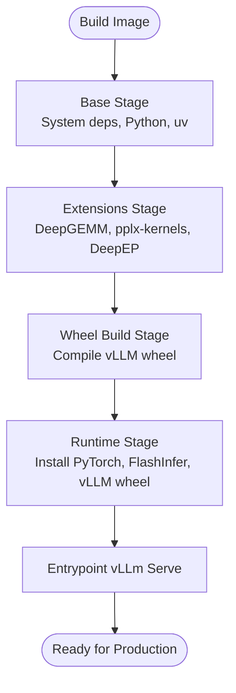
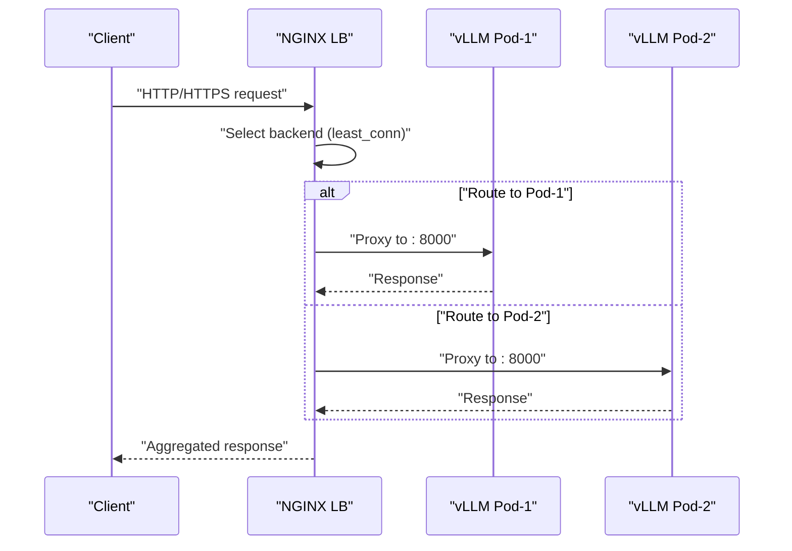
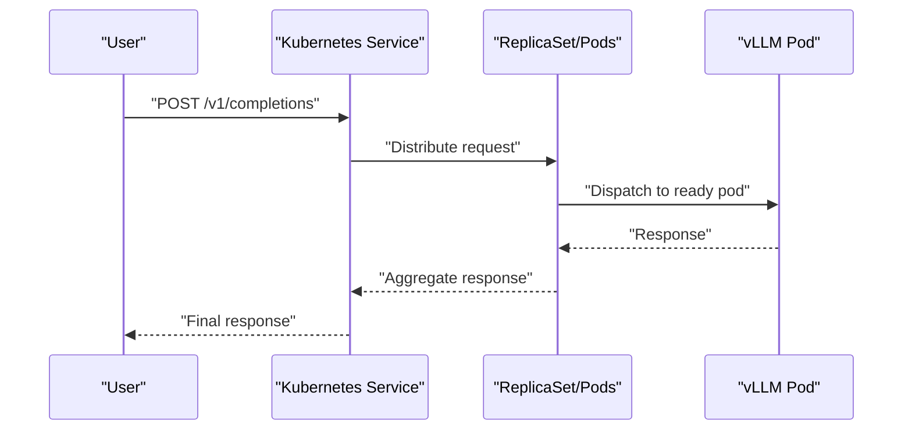
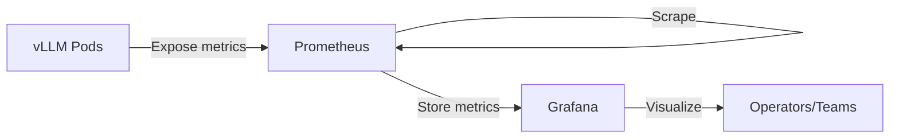
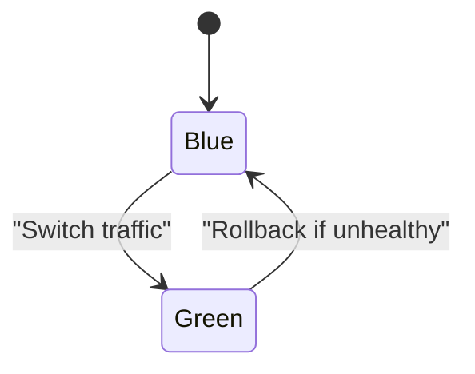
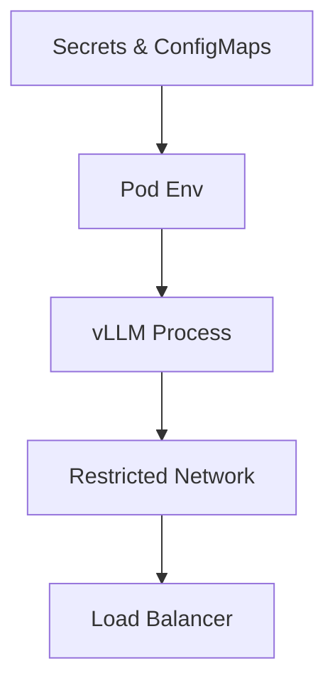
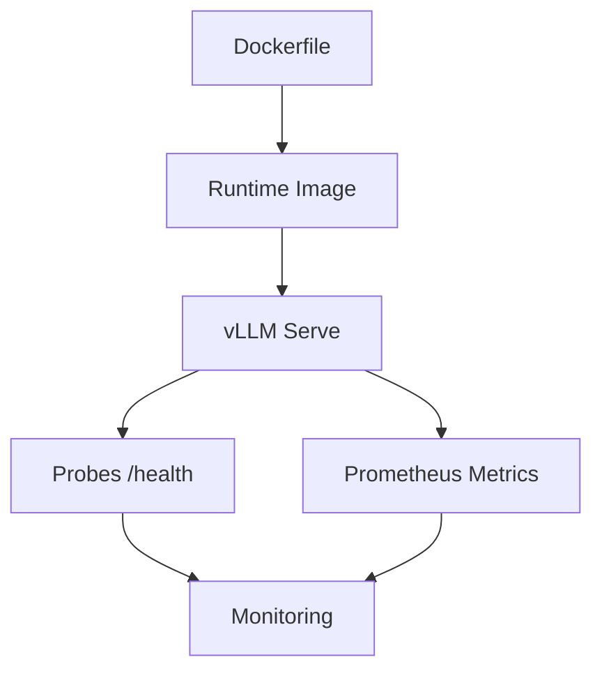

# Production Deployment Guide

<cite>
**Referenced Files in This Document**
- [docker/Dockerfile](file://docker/Dockerfile)
- [docs/deployment/docker.md](file://docs/deployment/docker.md)
- [docs/deployment/nginx.md](file://docs/deployment/nginx.md)
- [docs/deployment/k8s.md](file://docs/deployment/k8s.md)
- [examples/online_serving/prometheus_grafana/docker-compose.yaml](file://examples/online_serving/prometheus_grafana/docker-compose.yaml)
- [examples/online_serving/prometheus_grafana/prometheus.yaml](file://examples/online_serving/prometheus_grafana/prometheus.yaml)
- [examples/online_serving/chart-helm/values.yaml](file://examples/online_serving/chart-helm/values.yaml)
- [examples/online_serving/chart-helm/templates/deployment.yaml](file://examples/online_serving/chart-helm/templates/deployment.yaml)
- [docs/configuration/env_vars.md](file://docs/configuration/env_vars.md)
- [docs/configuration/serve_args.md](file://docs/configuration/serve_args.md)
- [docs/usage/security.md](file://docs/usage/security.md)
- [SECURITY.md](file://SECURITY.md)
</cite>

## Table of Contents
1. [Introduction](#introduction)
2. [Project Structure](#project-structure)
3. [Core Components](#core-components)
4. [Architecture Overview](#architecture-overview)
5. [Detailed Component Analysis](#detailed-component-analysis)
6. [Dependency Analysis](#dependency-analysis)
7. [Performance Considerations](#performance-considerations)
8. [Troubleshooting Guide](#troubleshooting-guide)
9. [Conclusion](#conclusion)
10. [Appendices](#appendices)

## Introduction
This guide provides a production-ready blueprint for deploying vLLM at scale. It covers containerization with Docker multi-stage builds, runtime optimization, and security hardening; load balancing with NGINX; monitoring and observability with Prometheus and Grafana; blue-green deployments, rolling updates, and zero-downtime scaling; backup and recovery, disaster recovery, and high availability; security posture including network segmentation and access controls; and performance tuning, capacity planning, and cost optimization strategies.

## Project Structure
The repository includes:
- A multi-stage Dockerfile tailored for CUDA and ROCm environments, enabling optimized builds and runtime JIT compilation support.
- Deployment guides for Docker, NGINX, and Kubernetes, including Helm charts and probes.
- Observability examples with Prometheus and Grafana, including a compose setup and scraping configuration.
- Configuration references for environment variables and server arguments.

**Diagram sources**
- [docker/Dockerfile](file://docker/Dockerfile#L1-L640)
- [docs/deployment/docker.md](file://docs/deployment/docker.md#L1-L153)
- [docs/deployment/nginx.md](file://docs/deployment/nginx.md#L1-L138)
- [docs/deployment/k8s.md](file://docs/deployment/k8s.md#L1-L398)
- [examples/online_serving/chart-helm/values.yaml](file://examples/online_serving/chart-helm/values.yaml#L1-L175)
- [examples/online_serving/chart-helm/templates/deployment.yaml](file://examples/online_serving/chart-helm/templates/deployment.yaml#L1-L131)
- [examples/online_serving/prometheus_grafana/docker-compose.yaml](file://examples/online_serving/prometheus_grafana/docker-compose.yaml#L1-L20)
- [examples/online_serving/prometheus_grafana/prometheus.yaml](file://examples/online_serving/prometheus_grafana/prometheus.yaml#L1-L11)
- [docs/configuration/env_vars.md](file://docs/configuration/env_vars.md#L1-L13)
- [docs/configuration/serve_args.md](file://docs/configuration/serve_args.md#L1-L36)

**Section sources**
- [docker/Dockerfile](file://docker/Dockerfile#L1-L640)
- [docs/deployment/docker.md](file://docs/deployment/docker.md#L1-L153)
- [docs/deployment/nginx.md](file://docs/deployment/nginx.md#L1-L138)
- [docs/deployment/k8s.md](file://docs/deployment/k8s.md#L1-L398)
- [examples/online_serving/chart-helm/values.yaml](file://examples/online_serving/chart-helm/values.yaml#L1-L175)
- [examples/online_serving/chart-helm/templates/deployment.yaml](file://examples/online_serving/chart-helm/templates/deployment.yaml#L1-L131)
- [examples/online_serving/prometheus_grafana/docker-compose.yaml](file://examples/online_serving/prometheus_grafana/docker-compose.yaml#L1-L20)
- [examples/online_serving/prometheus_grafana/prometheus.yaml](file://examples/online_serving/prometheus_grafana/prometheus.yaml#L1-L11)
- [docs/configuration/env_vars.md](file://docs/configuration/env_vars.md#L1-L13)
- [docs/configuration/serve_args.md](file://docs/configuration/serve_args.md#L1-L36)

## Core Components
- Container image build: Multi-stage Dockerfile with separate stages for base, extensions, wheel build, and runtime image, enabling fast rebuilds and minimized runtime footprint.
- Runtime entrypoint: OpenAI-compatible server entrypoint for production-grade serving.
- Kubernetes deployment: Helm values and templates for replica scaling, probes, GPU scheduling, and persistent storage.
- Observability stack: Prometheus scraping configuration and Grafana dashboards for performance and query statistics.
- Configuration surfaces: Environment variables and server arguments for host binding, port selection, and advanced tuning.

**Section sources**
- [docker/Dockerfile](file://docker/Dockerfile#L1-L640)
- [docs/deployment/docker.md](file://docs/deployment/docker.md#L1-L153)
- [examples/online_serving/chart-helm/values.yaml](file://examples/online_serving/chart-helm/values.yaml#L1-L175)
- [examples/online_serving/chart-helm/templates/deployment.yaml](file://examples/online_serving/chart-helm/templates/deployment.yaml#L1-L131)
- [examples/online_serving/prometheus_grafana/prometheus.yaml](file://examples/online_serving/prometheus_grafana/prometheus.yaml#L1-L11)
- [docs/configuration/env_vars.md](file://docs/configuration/env_vars.md#L1-L13)
- [docs/configuration/serve_args.md](file://docs/configuration/serve_args.md#L1-L36)

## Architecture Overview
A production vLLM deployment typically comprises:
- Multiple vLLM server replicas behind a load balancer (NGINX or cloud LB).
- Observability stack (Prometheus + Grafana) scraping metrics from the API servers.
- Kubernetes-native deployment with readiness/liveness probes, autoscaling, and persistent storage for model caches.
- Optional Helm-based rollout for blue-green or canary strategies.

**Diagram sources**
- [docs/deployment/nginx.md](file://docs/deployment/nginx.md#L1-L138)
- [docs/deployment/k8s.md](file://docs/deployment/k8s.md#L1-L398)
- [examples/online_serving/prometheus_grafana/docker-compose.yaml](file://examples/online_serving/prometheus_grafana/docker-compose.yaml#L1-L20)
- [examples/online_serving/prometheus_grafana/prometheus.yaml](file://examples/online_serving/prometheus_grafana/prometheus.yaml#L1-L11)

## Detailed Component Analysis

### Container Deployment with Docker
- Multi-stage build strategy:
  - Base stage installs system dependencies and Python tooling.
  - Extensions stage compiles optional kernels (DeepGEMM, pplx-kernels, DeepEP).
  - Wheel build stage compiles vLLM and produces a distributable wheel.
  - Runtime stage installs PyTorch, FlashInfer JIT cache, and vLLM wheel, enabling runtime JIT compilation.
- Runtime optimization:
  - Shared memory sizing via shared memory mounts or host IPC.
  - GPU visibility via container runtime and driver mounts.
  - Optional installation of optional dependencies (e.g., audio) and custom model sources.
- Security hardening:
  - Minimal base image for runtime.
  - Non-root user recommended in production (adjust as per your policy).
  - Limit exposed ports and mount only necessary volumes.

**Diagram sources**
- [docker/Dockerfile](file://docker/Dockerfile#L1-L640)

**Section sources**
- [docker/Dockerfile](file://docker/Dockerfile#L1-L640)
- [docs/deployment/docker.md](file://docs/deployment/docker.md#L1-L153)

### Load Balancer Configuration with NGINX
- Build a minimal NGINX container and supply a configuration that distributes traffic to multiple vLLM replicas.
- Use least_conn balancing and health-aware upstream entries.
- Expose port 80 on the NGINX container and route to vLLM’s 8000 port.
- Optionally terminate TLS at NGINX and forward to vLLM over HTTP.

**Diagram sources**
- [docs/deployment/nginx.md](file://docs/deployment/nginx.md#L1-L138)

**Section sources**
- [docs/deployment/nginx.md](file://docs/deployment/nginx.md#L1-L138)

### Kubernetes Deployment and Scaling
- CPU/GPU deployments:
  - CPU example uses PVC for model cache and a simple Deployment/Service.
  - GPU examples demonstrate scheduling with nvidia.com/gpu or amd.com/gpu, hostIPC/shared memory via emptyDir, and probes.
- Probes:
  - Readiness and liveness probes on /health endpoint to ensure safe rolling updates.
- Autoscaling:
  - HorizontalPodAutoscaler can be enabled via Helm values to scale on CPU/memory or custom metrics.
- Persistent storage:
  - Mount PVC to /root/.cache/huggingface to reuse model downloads and reduce cold-start latency.

**Diagram sources**
- [docs/deployment/k8s.md](file://docs/deployment/k8s.md#L1-L398)
- [examples/online_serving/chart-helm/values.yaml](file://examples/online_serving/chart-helm/values.yaml#L1-L175)
- [examples/online_serving/chart-helm/templates/deployment.yaml](file://examples/online_serving/chart-helm/templates/deployment.yaml#L1-L131)

**Section sources**
- [docs/deployment/k8s.md](file://docs/deployment/k8s.md#L1-L398)
- [examples/online_serving/chart-helm/values.yaml](file://examples/online_serving/chart-helm/values.yaml#L1-L175)
- [examples/online_serving/chart-helm/templates/deployment.yaml](file://examples/online_serving/chart-helm/templates/deployment.yaml#L1-L131)

### Monitoring and Observability with Prometheus and Grafana
- Prometheus scraping:
  - Configure Prometheus to scrape vLLM endpoints at a short interval.
  - Use docker-compose to run Prometheus and Grafana locally for testing.
- Grafana dashboards:
  - Use provided dashboards for performance and query statistics.
  - Import JSON dashboards into Grafana or apply via Perses/YAML.

**Diagram sources**
- [examples/online_serving/prometheus_grafana/docker-compose.yaml](file://examples/online_serving/prometheus_grafana/docker-compose.yaml#L1-L20)
- [examples/online_serving/prometheus_grafana/prometheus.yaml](file://examples/online_serving/prometheus_grafana/prometheus.yaml#L1-L11)

**Section sources**
- [examples/online_serving/prometheus_grafana/docker-compose.yaml](file://examples/online_serving/prometheus_grafana/docker-compose.yaml#L1-L20)
- [examples/online_serving/prometheus_grafana/prometheus.yaml](file://examples/online_serving/prometheus_grafana/prometheus.yaml#L1-L11)

### Blue-Green Deployments and Rolling Updates
- Blue-Green:
  - Maintain two identical deployments (blue/green) behind a single service.
  - Switch traffic to the new version by updating the service selector.
- Rolling Update:
  - Use Kubernetes RollingUpdate with maxUnavailable and maxSurge tuned for GPU warm-up times.
  - Combine with readiness probes to prevent routing to pods not yet ready.
- Zero-Downtime Scaling:
  - Scale up new replicas before terminating old ones.
  - Use HPA to scale based on CPU/memory or custom metrics.

**Diagram sources**
- [examples/online_serving/chart-helm/values.yaml](file://examples/online_serving/chart-helm/values.yaml#L1-L175)
- [examples/online_serving/chart-helm/templates/deployment.yaml](file://examples/online_serving/chart-helm/templates/deployment.yaml#L1-L131)

**Section sources**
- [examples/online_serving/chart-helm/values.yaml](file://examples/online_serving/chart-helm/values.yaml#L1-L175)
- [examples/online_serving/chart-helm/templates/deployment.yaml](file://examples/online_serving/chart-helm/templates/deployment.yaml#L1-L131)

### Backup and Recovery, Disaster Recovery, High Availability
- Model cache persistence:
  - Use PVC mounted to the model cache directory to persist downloads across restarts.
- Disaster recovery:
  - Snapshot persistent volumes regularly.
  - Maintain multiple replicas across zones/nodes for HA.
- High availability:
  - Spread pods across nodes and zones.
  - Use anti-affinity rules to avoid colocating replicas on the same node.

[No sources needed since this section provides general guidance]

### Security Hardening and Access Controls
- Network isolation:
  - Segment vLLM pods on dedicated networks and restrict inter-pod traffic.
- Access controls:
  - Enforce strict firewall rules and only expose necessary ports.
  - Use Kubernetes NetworkPolicies to limit ingress/egress.
- Audit logging:
  - Enable API server logs and integrate with SIEM.
- Secrets management:
  - Store tokens and credentials in Kubernetes Secrets and mount via envFrom.
- Environment variables:
  - Avoid conflicts with Kubernetes service environment variables; do not name services “vllm”.
  - Set VLLM_HOST_IP to a specific IP and avoid default binds.

**Diagram sources**
- [docs/configuration/env_vars.md](file://docs/configuration/env_vars.md#L1-L13)
- [examples/online_serving/chart-helm/templates/deployment.yaml](file://examples/online_serving/chart-helm/templates/deployment.yaml#L1-L131)

**Section sources**
- [docs/configuration/env_vars.md](file://docs/configuration/env_vars.md#L1-L13)
- [docs/usage/security.md](file://docs/usage/security.md#L44-L70)
- [SECURITY.md](file://SECURITY.md#L29-L35)

## Dependency Analysis
- Container build dependencies:
  - CUDA base images, PyTorch index URLs, and optional precompiled kernels influence build times and runtime performance.
- Runtime dependencies:
  - Shared memory (/dev/shm) and NCCL libraries are required for multi-GPU inference.
- Observability dependencies:
  - Prometheus scrape interval and target endpoints must align with vLLM metrics exposure.

**Diagram sources**
- [docker/Dockerfile](file://docker/Dockerfile#L1-L640)
- [docs/deployment/k8s.md](file://docs/deployment/k8s.md#L1-L398)
- [examples/online_serving/prometheus_grafana/prometheus.yaml](file://examples/online_serving/prometheus_grafana/prometheus.yaml#L1-L11)

**Section sources**
- [docker/Dockerfile](file://docker/Dockerfile#L1-L640)
- [docs/deployment/k8s.md](file://docs/deployment/k8s.md#L1-L398)
- [examples/online_serving/prometheus_grafana/prometheus.yaml](file://examples/online_serving/prometheus_grafana/prometheus.yaml#L1-L11)

## Performance Considerations
- Container-level:
  - Use appropriate max_jobs and nvcc_threads for builds; tune wheel size checks.
  - Prefer precompiled wheels for faster cold starts.
- Runtime-level:
  - Tune max_num_batched_tokens, enable chunked prefill, and adjust block size for KV cache efficiency.
  - Ensure sufficient shared memory for tensor parallelism.
- Observability-driven tuning:
  - Monitor latency and throughput; use Grafana dashboards to correlate spikes with concurrency and queue depth.
- Cost optimization:
  - Right-size GPU instances; use preemption-friendly instances for background loads.
  - Consolidate models on shared PVC to reduce repeated downloads.

[No sources needed since this section provides general guidance]

## Troubleshooting Guide
- Kubernetes startup/readiness probe failures:
  - Increase failureThreshold to accommodate cold-start delays; confirm /health endpoint is reachable.
- Shared memory issues:
  - Ensure /dev/shm is mounted as emptyDir with adequate size for multi-GPU setups.
- Environment variable conflicts:
  - Avoid naming Kubernetes services “vllm”; use VLLM_HOST_IP to bind to a specific interface.
- Security advisories:
  - Review severity classifications and remediation guidance in the security policy.

**Section sources**
- [docs/deployment/k8s.md](file://docs/deployment/k8s.md#L384-L398)
- [docs/configuration/env_vars.md](file://docs/configuration/env_vars.md#L1-L13)
- [SECURITY.md](file://SECURITY.md#L29-L35)

## Conclusion
This guide consolidates production-grade practices for deploying vLLM using Docker, NGINX, and Kubernetes, with robust observability, security, and operational excellence. By combining multi-stage container builds, careful runtime configuration, resilient load balancing, and comprehensive monitoring, teams can achieve reliable, scalable, and secure inference at enterprise scale.

[No sources needed since this section summarizes without analyzing specific files]

## Appendices
- Practical references:
  - Docker build targets and arguments for CUDA/ROCm and ARM64.
  - NGINX configuration for least_conn load balancing.
  - Kubernetes Deployment/Service examples with probes and GPU scheduling.
  - Prometheus scraping configuration and Grafana dashboard import steps.
  - Environment variables and server arguments for production tuning.

**Section sources**
- [docs/deployment/docker.md](file://docs/deployment/docker.md#L1-L153)
- [docs/deployment/nginx.md](file://docs/deployment/nginx.md#L1-L138)
- [docs/deployment/k8s.md](file://docs/deployment/k8s.md#L1-L398)
- [examples/online_serving/prometheus_grafana/docker-compose.yaml](file://examples/online_serving/prometheus_grafana/docker-compose.yaml#L1-L20)
- [examples/online_serving/prometheus_grafana/prometheus.yaml](file://examples/online_serving/prometheus_grafana/prometheus.yaml#L1-L11)
- [docs/configuration/env_vars.md](file://docs/configuration/env_vars.md#L1-L13)
- [docs/configuration/serve_args.md](file://docs/configuration/serve_args.md#L1-L36)