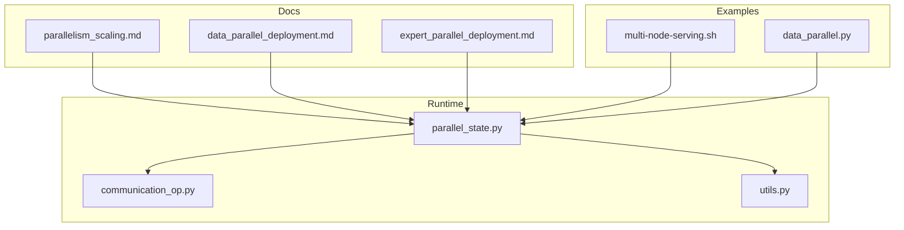
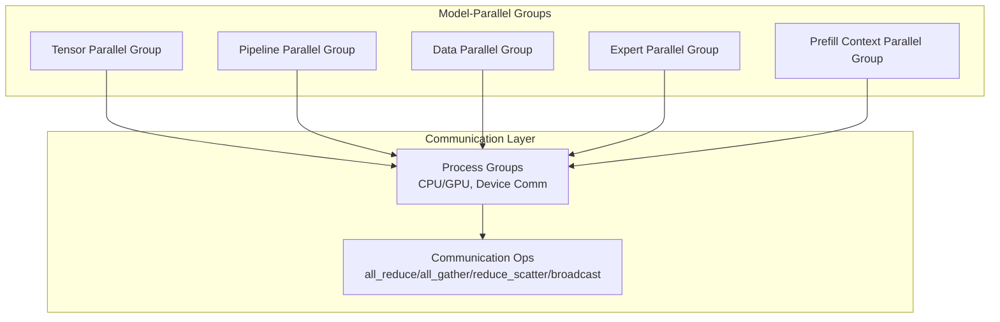
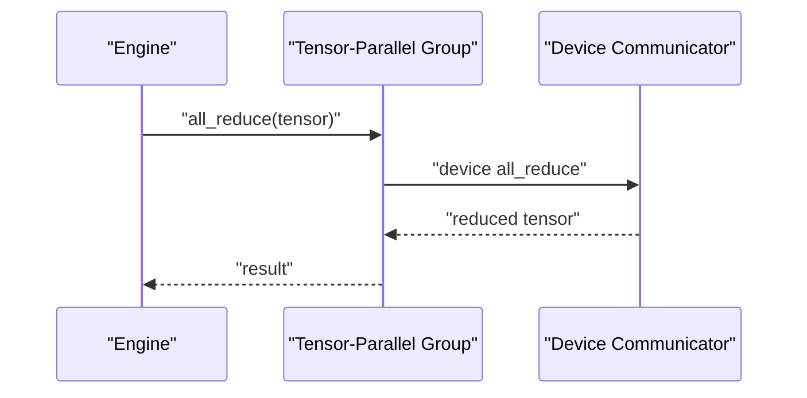
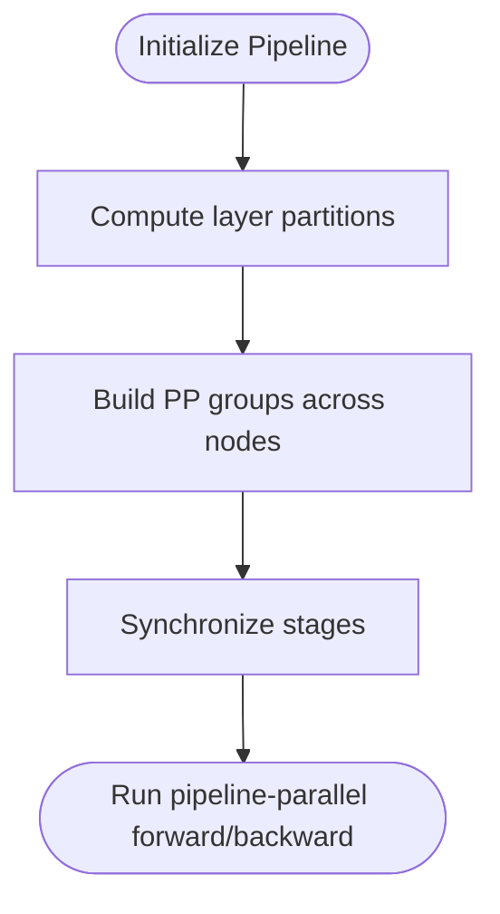
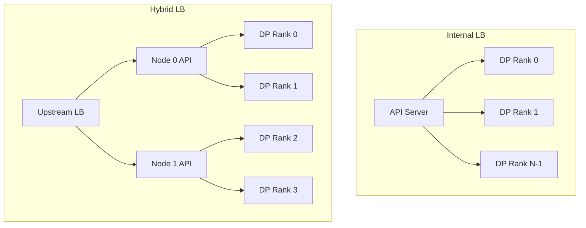
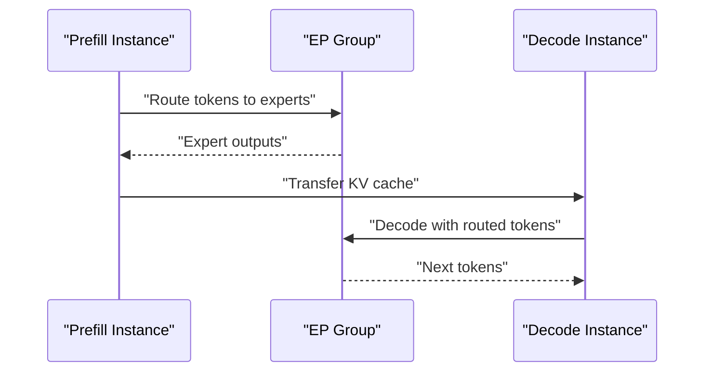
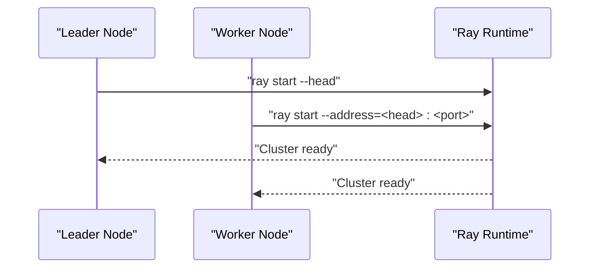
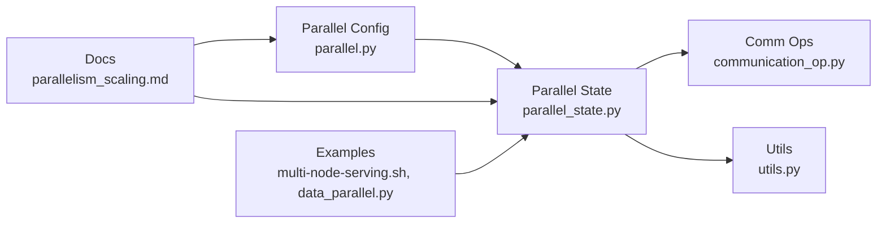

# Distributed Inference

<cite>
**Referenced Files in This Document**
- [parallelism_scaling.md](file://docs/serving/parallelism_scaling.md)
- [data_parallel_deployment.md](file://docs/serving/data_parallel_deployment.md)
- [expert_parallel_deployment.md](file://docs/serving/expert_parallel_deployment.md)
- [multi-node-serving.sh](file://examples/online_serving/multi-node-serving.sh)
- [data_parallel.py](file://examples/offline_inference/data_parallel.py)
- [parallel_state.py](file://vllm/distributed/parallel_state.py)
- [communication_op.py](file://vllm/distributed/communication_op.py)
- [utils.py](file://vllm/distributed/utils.py)
- [parallel.py](file://vllm/config/parallel.py)
- [arg_utils.py](file://vllm/engine/arg_utils.py)
- [test_multiproc_executor.py](file://tests/distributed/test_multiproc_executor.py)
- [test_multiproc_executor.py](file://tests/distributed/test_multiproc_executor.py#L291-L324)
- [test_multiproc_executor.py](file://tests/distributed/test_multiproc_executor.py#L390-L437)
- [parallel_utils.py](file://tests/kernels/moe/parallel_utils.py)
</cite>

## Table of Contents
1. [Introduction](#introduction)
2. [Project Structure](#project-structure)
3. [Core Components](#core-components)
4. [Architecture Overview](#architecture-overview)
5. [Detailed Component Analysis](#detailed-component-analysis)
6. [Dependency Analysis](#dependency-analysis)
7. [Performance Considerations](#performance-considerations)
8. [Troubleshooting Guide](#troubleshooting-guide)
9. [Conclusion](#conclusion)
10. [Appendices](#appendices)

## Introduction
This document explains vLLM’s distributed inference capabilities across multiple dimensions of parallelism and scaling strategies. It covers tensor parallelism, data parallelism, expert parallelism, and pipeline parallelism, and shows how they integrate with distributed deployment patterns, inter-process communication, and load balancing. Practical examples demonstrate multi-node setup, resource management, and monitoring. Guidance is included for integrating with cluster management tools and cloud platforms.

## Project Structure
The distributed inference system spans documentation, examples, and core runtime modules:
- Documentation: Guides for parallelism, data parallel deployment, expert parallel deployment, and multi-node serving.
- Examples: Scripts and offline examples for multi-node and multi-process deployments.
- Runtime: Distributed state, communication operators, and utilities for process groups and rendezvous.

**Diagram sources**
- [parallelism_scaling.md](file://docs/serving/parallelism_scaling.md#L1-L221)
- [data_parallel_deployment.md](file://docs/serving/data_parallel_deployment.md#L1-L134)
- [expert_parallel_deployment.md](file://docs/serving/expert_parallel_deployment.md#L1-L323)
- [multi-node-serving.sh](file://examples/online_serving/multi-node-serving.sh#L1-L120)
- [data_parallel.py](file://examples/offline_inference/data_parallel.py#L1-L269)
- [parallel_state.py](file://vllm/distributed/parallel_state.py#L1-L800)
- [communication_op.py](file://vllm/distributed/communication_op.py#L1-L44)
- [utils.py](file://vllm/distributed/utils.py#L1-L546)

**Section sources**
- [parallelism_scaling.md](file://docs/serving/parallelism_scaling.md#L1-L221)
- [data_parallel_deployment.md](file://docs/serving/data_parallel_deployment.md#L1-L134)
- [expert_parallel_deployment.md](file://docs/serving/expert_parallel_deployment.md#L1-L323)
- [multi-node-serving.sh](file://examples/online_serving/multi-node-serving.sh#L1-L120)
- [data_parallel.py](file://examples/offline_inference/data_parallel.py#L1-L269)
- [parallel_state.py](file://vllm/distributed/parallel_state.py#L1-L800)
- [communication_op.py](file://vllm/distributed/communication_op.py#L1-L44)
- [utils.py](file://vllm/distributed/utils.py#L1-L546)

## Core Components
- Parallel configuration and validation: Defines and validates parallelism sizes, world sizes, and optional features like dual-batch overlap and expert parallelism load balancing.
- Distributed state and groups: Manages model-parallel groups (tensor, pipeline, data, expert, context-parallel) and provides communication wrappers.
- Communication operators: Exposes tensor-parallel-aware all-reduce, all-gather, reduce-scatter, and broadcast helpers.
- Utilities: Stateless process groups, barrier, and rendezvous utilities for multi-node and multi-process initialization.

Key responsibilities:
- Validate and compute world sizes across TP, PP, DP, and PCP.
- Initialize and expose group coordinators for intra-/inter-node communication.
- Provide lightweight wrappers for collective operations.

**Section sources**
- [parallel.py](file://vllm/config/parallel.py#L297-L330)
- [parallel_state.py](file://vllm/distributed/parallel_state.py#L1101-L1416)
- [communication_op.py](file://vllm/distributed/communication_op.py#L1-L44)
- [utils.py](file://vllm/distributed/utils.py#L1-L546)

## Architecture Overview
The distributed inference stack orchestrates multiple parallelism axes:
- Tensor parallelism shards activations and weights across GPUs within a node.
- Pipeline parallelism partitions layers across nodes.
- Data parallelism replicates model weights across independent engine processes for independent batching.
- Expert parallelism shards MoE experts across ranks for improved locality and throughput.
- Context parallelism partitions attention context across ranks for prefill.

**Diagram sources**
- [parallel_state.py](file://vllm/distributed/parallel_state.py#L1101-L1416)
- [communication_op.py](file://vllm/distributed/communication_op.py#L1-L44)

## Detailed Component Analysis

### Tensor Parallelism
Tensor parallelism partitions tensors across GPUs within a node. vLLM builds tensor-parallel groups and exposes collective operations through dedicated wrappers.

Implementation highlights:
- Group creation and retrieval for tensor-parallel operations.
- Out-of-place collective wrappers that delegate to device communicators when available.
- Helpers for all_reduce, all_gather, reduce_scatter, and gather.

**Diagram sources**
- [communication_op.py](file://vllm/distributed/communication_op.py#L1-L44)
- [parallel_state.py](file://vllm/distributed/parallel_state.py#L480-L520)

**Section sources**
- [communication_op.py](file://vllm/distributed/communication_op.py#L1-L44)
- [parallel_state.py](file://vllm/distributed/parallel_state.py#L480-L520)

### Pipeline Parallelism
Pipeline parallelism partitions transformer layers across nodes. The runtime computes layer partitions and initializes pipeline-parallel groups accordingly.

Implementation highlights:
- Layer partition computation for pipeline stages.
- Group construction across nodes for pipeline-parallel execution.
- World-size accounting across TP, PP, DP, and PCP.

**Diagram sources**
- [utils.py](file://vllm/distributed/utils.py#L95-L141)
- [parallel_state.py](file://vllm/distributed/parallel_state.py#L1382-L1416)

**Section sources**
- [utils.py](file://vllm/distributed/utils.py#L95-L141)
- [parallel_state.py](file://vllm/distributed/parallel_state.py#L1382-L1416)

### Data Parallelism
Data parallelism replicates model weights across independent engine processes. Requests are load-balanced across DP ranks, with attention layers synchronized across ranks.

Deployment modes:
- Internal load balancing: single API server balances requests across DP ranks.
- Hybrid load balancing: per-node API servers with upstream load balancer.
- External load balancing: separate endpoints per DP rank with external routing.

**Diagram sources**
- [data_parallel_deployment.md](file://docs/serving/data_parallel_deployment.md#L23-L134)

**Section sources**
- [data_parallel_deployment.md](file://docs/serving/data_parallel_deployment.md#L1-L134)
- [arg_utils.py](file://vllm/engine/arg_utils.py#L1558-L1582)

### Expert Parallelism
Expert parallelism shards MoE experts across ranks, often combined with data parallelism. vLLM supports multiple all-to-all backends and optional expert parallelism load balancing (EPLB).

Key configuration:
- Enable expert parallelism and select all2all backend.
- Configure EPLB parameters for window size, step interval, redundant experts, and async mode.
- Disaggregated serving supports separate prefill and decode instances with KV transfer.

**Diagram sources**
- [expert_parallel_deployment.md](file://docs/serving/expert_parallel_deployment.md#L1-L323)

**Section sources**
- [expert_parallel_deployment.md](file://docs/serving/expert_parallel_deployment.md#L1-L323)
- [parallel.py](file://vllm/config/parallel.py#L297-L330)

### Multi-Node Setup and Inter-Process Communication
Two primary runtimes are supported:
- Ray: Recommended for multi-node inference with containerized environments and cluster orchestration.
- Multiprocessing: Native Python multiprocessing for single- or multi-node setups using torchrun-style initialization.

Helper scripts and examples:
- Ray cluster bootstrap with leader/worker roles and readiness checks.
- Offline multi-node data parallel example with torchrun-like semantics.

**Diagram sources**
- [multi-node-serving.sh](file://examples/online_serving/multi-node-serving.sh#L1-L120)

**Section sources**
- [multi-node-serving.sh](file://examples/online_serving/multi-node-serving.sh#L1-L120)
- [data_parallel.py](file://examples/offline_inference/data_parallel.py#L1-L269)
- [test_multiproc_executor.py](file://tests/distributed/test_multiproc_executor.py#L291-L324)
- [test_multiproc_executor.py](file://tests/distributed/test_multiproc_executor.py#L390-L437)
- [parallel_utils.py](file://tests/kernels/moe/parallel_utils.py#L44-L85)

### Load Balancing Strategies
- Data parallel internal LB: API server balances requests across DP ranks based on queues and KV state.
- Hybrid LB: Per-node API servers with upstream LB to reduce cross-node traffic.
- External LB: Separate endpoints per DP rank with external router leveraging telemetry.
- Expert parallel load balancing (EPLB): Redistributes expert mappings to balance token loads across EP ranks.

**Section sources**
- [data_parallel_deployment.md](file://docs/serving/data_parallel_deployment.md#L23-L134)
- [expert_parallel_deployment.md](file://docs/serving/expert_parallel_deployment.md#L137-L206)

## Dependency Analysis
The distributed subsystem composes cleanly:
- Configuration validates parallel sizes and world-size computations.
- Parallel state initializes model-parallel groups and exposes group getters.
- Communication operators wrap group operations for tensor-parallel contexts.
- Utilities provide stateless process groups and barriers for rendezvous and synchronization.

**Diagram sources**
- [parallel.py](file://vllm/config/parallel.py#L297-L330)
- [parallel_state.py](file://vllm/distributed/parallel_state.py#L1101-L1416)
- [communication_op.py](file://vllm/distributed/communication_op.py#L1-L44)
- [utils.py](file://vllm/distributed/utils.py#L1-L546)
- [parallelism_scaling.md](file://docs/serving/parallelism_scaling.md#L1-L221)
- [multi-node-serving.sh](file://examples/online_serving/multi-node-serving.sh#L1-L120)
- [data_parallel.py](file://examples/offline_inference/data_parallel.py#L1-L269)

**Section sources**
- [parallel.py](file://vllm/config/parallel.py#L297-L330)
- [parallel_state.py](file://vllm/distributed/parallel_state.py#L1101-L1416)
- [communication_op.py](file://vllm/distributed/communication_op.py#L1-L44)
- [utils.py](file://vllm/distributed/utils.py#L1-L546)

## Performance Considerations
- Network topology: Prefer high-speed interconnects (e.g., InfiniBand) and enable GPUDirect RDMA for efficient cross-node tensor parallelism.
- Backend selection: Choose all2all backends suited to workload patterns (prefill vs decode) and system topology.
- Dual-batch overlap (DBO): Overlap all-to-all communication with compute to improve throughput.
- Asynchronous scheduling: Overlap scheduling with execution for improved latency.
- Memory footprint: EPLB introduces redundant experts; assess memory budget carefully.

[No sources needed since this section provides general guidance]

## Troubleshooting Guide
Common issues and remedies:
- Ray cluster readiness: Use helper scripts to ensure head and workers connect and cluster reaches expected size.
- Multi-node initialization: Verify master address, ports, and node ranks; ensure rendezvous succeeds.
- NCCL/GPUDirect RDMA: Confirm network backend and driver configuration; check logs for transport selection.
- EPLB and EP backends: Validate backend compatibility and environment prerequisites; adjust redundant experts based on memory headroom.

**Section sources**
- [multi-node-serving.sh](file://examples/online_serving/multi-node-serving.sh#L1-L120)
- [data_parallel.py](file://examples/offline_inference/data_parallel.py#L1-L269)
- [expert_parallel_deployment.md](file://docs/serving/expert_parallel_deployment.md#L215-L226)

## Conclusion
vLLM’s distributed inference integrates tensor, pipeline, data, and expert parallelism with flexible deployment models. The runtime provides validated configuration, robust group management, and efficient communication primitives. With documented multi-node procedures, load balancing strategies, and backend tuning, users can scale to large models and clusters while maintaining strong performance and operability.

[No sources needed since this section summarizes without analyzing specific files]

## Appendices

### Practical Examples Index
- Single-node tensor parallel serving: see [parallelism_scaling.md](file://docs/serving/parallelism_scaling.md#L35-L57)
- Multi-node tensor + pipeline serving with Ray: see [parallelism_scaling.md](file://docs/serving/parallelism_scaling.md#L116-L131)
- Multiprocessing multi-node serving: see [parallelism_scaling.md](file://docs/serving/parallelism_scaling.md#L133-L153)
- Data parallel internal/hybrid/external LB: see [data_parallel_deployment.md](file://docs/serving/data_parallel_deployment.md#L23-L134)
- Expert parallel deployment and EPLB: see [expert_parallel_deployment.md](file://docs/serving/expert_parallel_deployment.md#L137-L206)
- Ray cluster bootstrap: see [multi-node-serving.sh](file://examples/online_serving/multi-node-serving.sh#L1-L120)
- Offline multi-node data parallel: see [data_parallel.py](file://examples/offline_inference/data_parallel.py#L1-L269)

**Section sources**
- [parallelism_scaling.md](file://docs/serving/parallelism_scaling.md#L35-L57)
- [parallelism_scaling.md](file://docs/serving/parallelism_scaling.md#L116-L153)
- [data_parallel_deployment.md](file://docs/serving/data_parallel_deployment.md#L23-L134)
- [expert_parallel_deployment.md](file://docs/serving/expert_parallel_deployment.md#L137-L206)
- [multi-node-serving.sh](file://examples/online_serving/multi-node-serving.sh#L1-L120)
- [data_parallel.py](file://examples/offline_inference/data_parallel.py#L1-L269)