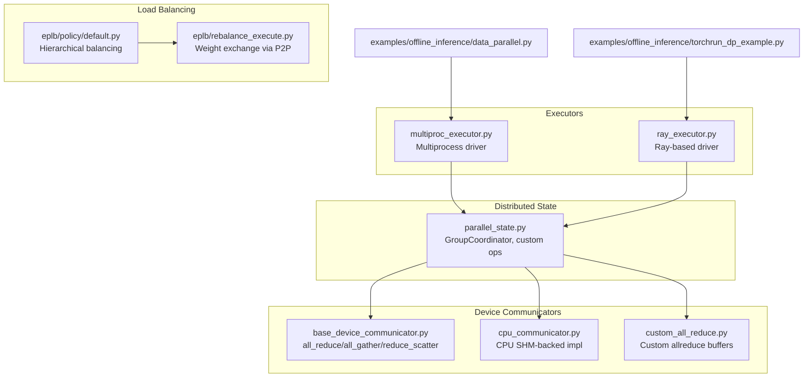
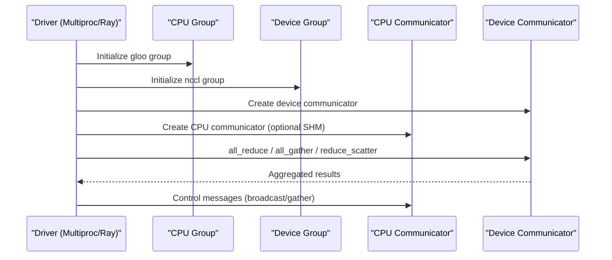
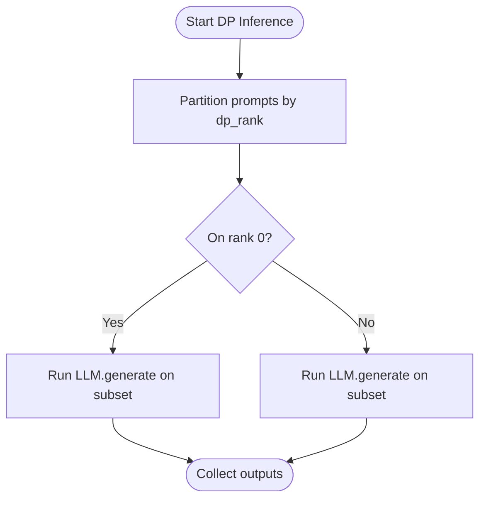
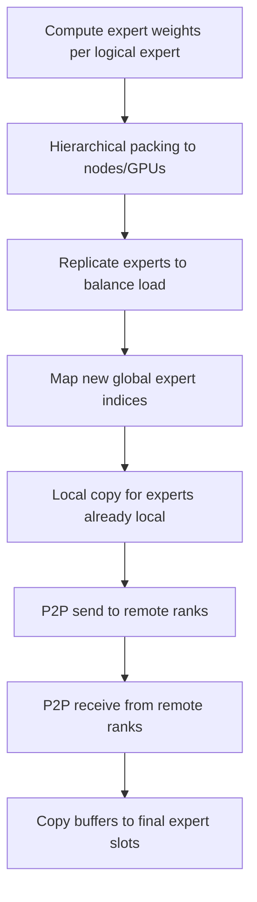
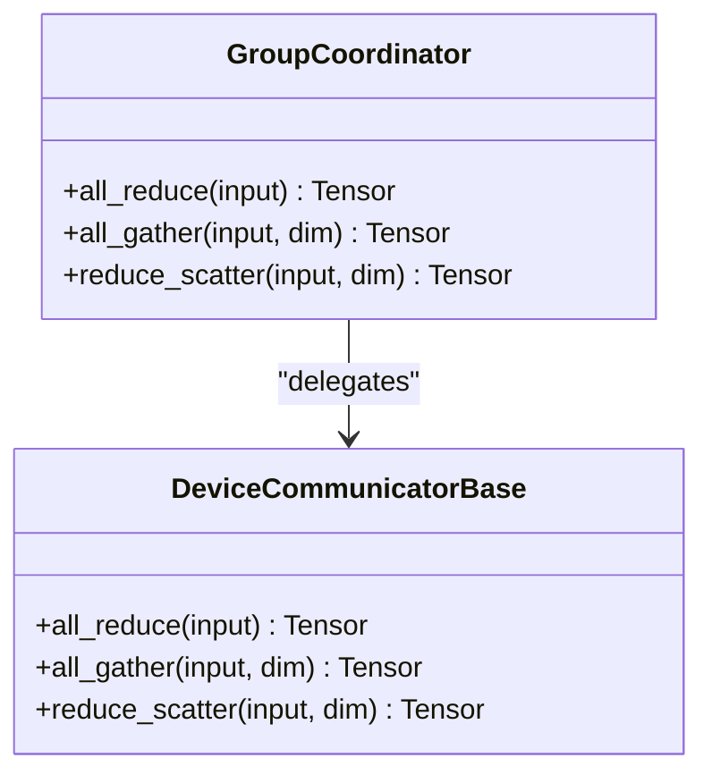
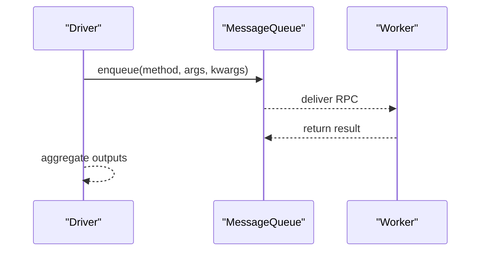
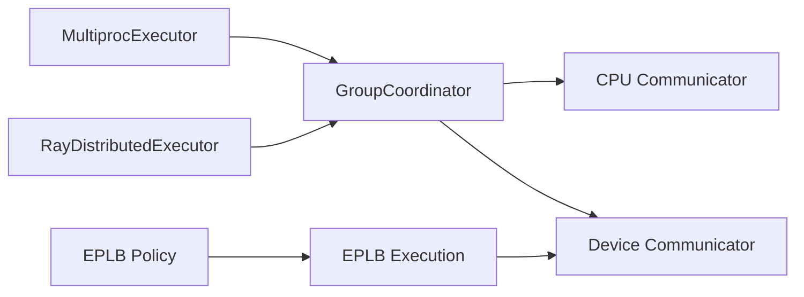

# Data Parallelism

<cite>
**Referenced Files in This Document**
- [examples/offline_inference/data_parallel.py](file://examples/offline_inference/data_parallel.py)
- [examples/offline_inference/torchrun_dp_example.py](file://examples/offline_inference/torchrun_dp_example.py)
- [vllm/distributed/parallel_state.py](file://vllm/distributed/parallel_state.py)
- [vllm/distributed/device_communicators/base_device_communicator.py](file://vllm/distributed/device_communicators/base_device_communicator.py)
- [vllm/distributed/device_communicators/cpu_communicator.py](file://vllm/distributed/device_communicators/cpu_communicator.py)
- [vllm/distributed/device_communicators/custom_all_reduce.py](file://vllm/distributed/device_communicators/custom_all_reduce.py)
- [vllm/v1/executor/multiproc_executor.py](file://vllm/v1/executor/multiproc_executor.py)
- [vllm/v1/executor/ray_executor.py](file://vllm/v1/executor/ray_executor.py)
- [vllm/distributed/eplb/policy/default.py](file://vllm/distributed/eplb/policy/default.py)
- [vllm/distributed/eplb/rebalance_execute.py](file://vllm/distributed/eplb/rebalance_execute.py)
- [tests/kernels/moe/parallel_utils.py](file://tests/kernels/moe/parallel_utils.py)
</cite>

## Table of Contents
1. [Introduction](#introduction)
2. [Project Structure](#project-structure)
3. [Core Components](#core-components)
4. [Architecture Overview](#architecture-overview)
5. [Detailed Component Analysis](#detailed-component-analysis)
6. [Dependency Analysis](#dependency-analysis)
7. [Performance Considerations](#performance-considerations)
8. [Troubleshooting Guide](#troubleshooting-guide)
9. [Conclusion](#conclusion)

## Introduction
This document explains how data parallelism is implemented in vLLM, focusing on how batches are distributed across workers, how gradients are synchronized, and how load is balanced across ranks. It covers the communication primitives (all_reduce, all_gather, reduce_scatter), executor patterns for distributed processing (multiprocessing and Ray-based), and practical examples from the codebase. It also discusses performance characteristics, memory usage, and scaling considerations for different cluster configurations.

## Project Structure
Data parallelism in vLLM spans several subsystems:
- Distributed state and group management
- Device communicators for NCCL/CPU backends
- Executor implementations for multiprocessing and Ray
- Expert parallelism load balancing (EPLB) for MoE workloads
- Examples demonstrating data-parallel inference with torchrun and manual multiprocessing

**Diagram sources**
- [vllm/distributed/parallel_state.py](file://vllm/distributed/parallel_state.py#L117-L163)
- [vllm/distributed/device_communicators/base_device_communicator.py](file://vllm/distributed/device_communicators/base_device_communicator.py#L135-L208)
- [vllm/distributed/device_communicators/cpu_communicator.py](file://vllm/distributed/device_communicators/cpu_communicator.py#L35-L112)
- [vllm/distributed/device_communicators/custom_all_reduce.py](file://vllm/distributed/device_communicators/custom_all_reduce.py#L172-L197)
- [vllm/v1/executor/multiproc_executor.py](file://vllm/v1/executor/multiproc_executor.py#L100-L177)
- [vllm/v1/executor/ray_executor.py](file://vllm/v1/executor/ray_executor.py#L80-L120)
- [vllm/distributed/eplb/policy/default.py](file://vllm/distributed/eplb/policy/default.py#L114-L208)
- [vllm/distributed/eplb/rebalance_execute.py](file://vllm/distributed/eplb/rebalance_execute.py#L146-L240)
- [examples/offline_inference/data_parallel.py](file://examples/offline_inference/data_parallel.py#L1-L120)
- [examples/offline_inference/torchrun_dp_example.py](file://examples/offline_inference/torchrun_dp_example.py#L1-L120)

**Section sources**
- [vllm/distributed/parallel_state.py](file://vllm/distributed/parallel_state.py#L117-L163)
- [vllm/distributed/device_communicators/base_device_communicator.py](file://vllm/distributed/device_communicators/base_device_communicator.py#L135-L208)
- [vllm/v1/executor/multiproc_executor.py](file://vllm/v1/executor/multiproc_executor.py#L100-L177)
- [vllm/v1/executor/ray_executor.py](file://vllm/v1/executor/ray_executor.py#L80-L120)
- [vllm/distributed/eplb/policy/default.py](file://vllm/distributed/eplb/policy/default.py#L114-L208)
- [vllm/distributed/eplb/rebalance_execute.py](file://vllm/distributed/eplb/rebalance_execute.py#L146-L240)
- [examples/offline_inference/data_parallel.py](file://examples/offline_inference/data_parallel.py#L1-L120)
- [examples/offline_inference/torchrun_dp_example.py](file://examples/offline_inference/torchrun_dp_example.py#L1-L120)

## Core Components
- GroupCoordinator and custom ops: Provides user-facing APIs for all_reduce, all_gather, reduce_scatter backed by device communicators. It selects between custom ops and fallback implementations depending on platform support.
- DeviceCommunicatorBase: Implements NCCL-backed all_reduce, all_gather, reduce_scatter using torch.distributed primitives. CPU communicator adds shared-memory optimizations for CPU groups.
- MultiprocExecutor: Manages multiple worker processes per node, initializes distributed groups, and routes RPC calls to workers. It exposes collective RPC and output aggregation.
- RayDistributedExecutor: Manages Ray actors, initializes distributed environments, and compiles a DAG for pipeline-parallel and tensor-parallel execution with optional NCCL-backed channels.
- EPLB policies and execution: Hierarchical expert load balancing and P2P-based weight exchange for expert parallelism; relevant for data-parallel MoE scenarios.

Key implementation references:
- Custom ops registration and dispatch: [vllm/distributed/parallel_state.py](file://vllm/distributed/parallel_state.py#L249-L276)
- GroupCoordinator methods: [vllm/distributed/parallel_state.py](file://vllm/distributed/parallel_state.py#L480-L567)
- DeviceCommunicatorBase methods: [vllm/distributed/device_communicators/base_device_communicator.py](file://vllm/distributed/device_communicators/base_device_communicator.py#L135-L208)
- CPU communicator optimizations: [vllm/distributed/device_communicators/cpu_communicator.py](file://vllm/distributed/device_communicators/cpu_communicator.py#L35-L112)
- MultiprocExecutor initialization and RPC: [vllm/v1/executor/multiproc_executor.py](file://vllm/v1/executor/multiproc_executor.py#L100-L203)
- RayDistributedExecutor DAG and collective RPC: [vllm/v1/executor/ray_executor.py](file://vllm/v1/executor/ray_executor.py#L360-L467)
- EPLB policy and execution: [vllm/distributed/eplb/policy/default.py](file://vllm/distributed/eplb/policy/default.py#L114-L208), [vllm/distributed/eplb/rebalance_execute.py](file://vllm/distributed/eplb/rebalance_execute.py#L146-L240)

**Section sources**
- [vllm/distributed/parallel_state.py](file://vllm/distributed/parallel_state.py#L249-L276)
- [vllm/distributed/parallel_state.py](file://vllm/distributed/parallel_state.py#L480-L567)
- [vllm/distributed/device_communicators/base_device_communicator.py](file://vllm/distributed/device_communicators/base_device_communicator.py#L135-L208)
- [vllm/distributed/device_communicators/cpu_communicator.py](file://vllm/distributed/device_communicators/cpu_communicator.py#L35-L112)
- [vllm/v1/executor/multiproc_executor.py](file://vllm/v1/executor/multiproc_executor.py#L100-L203)
- [vllm/v1/executor/ray_executor.py](file://vllm/v1/executor/ray_executor.py#L360-L467)
- [vllm/distributed/eplb/policy/default.py](file://vllm/distributed/eplb/policy/default.py#L114-L208)
- [vllm/distributed/eplb/rebalance_execute.py](file://vllm/distributed/eplb/rebalance_execute.py#L146-L240)

## Architecture Overview
The data-parallel execution model centers around:
- A driver process coordinating multiple worker processes (multiprocessing) or Ray actors (Ray).
- Each worker initializes its own distributed groups and device communicators.
- Communication primitives are invoked through GroupCoordinator APIs, which delegate to device communicators.
- For MoE workloads, EPLB computes expert placement and orchestrates weight exchanges via point-to-point operations.

**Diagram sources**
- [vllm/distributed/parallel_state.py](file://vllm/distributed/parallel_state.py#L307-L378)
- [vllm/distributed/device_communicators/base_device_communicator.py](file://vllm/distributed/device_communicators/base_device_communicator.py#L135-L208)
- [vllm/distributed/device_communicators/cpu_communicator.py](file://vllm/distributed/device_communicators/cpu_communicator.py#L35-L112)
- [vllm/v1/executor/multiproc_executor.py](file://vllm/v1/executor/multiproc_executor.py#L100-L177)
- [vllm/v1/executor/ray_executor.py](file://vllm/v1/executor/ray_executor.py#L360-L467)

## Detailed Component Analysis

### Batch Distribution Strategies Across Workers
- Manual multiprocessing example: Splits prompts across DP ranks and runs inference independently per rank. This is a pure data-parallel split where each rank processes a disjoint subset of the dataset.
  - See [examples/offline_inference/data_parallel.py](file://examples/offline_inference/data_parallel.py#L140-L205)
- torchrun-based example: Uses external launcher mode to create one worker per rank; prompts are partitioned so that each rank processes a subset determined by dp_rank modulo dp_size.
  - See [examples/offline_inference/torchrun_dp_example.py](file://examples/offline_inference/torchrun_dp_example.py#L100-L125)

**Diagram sources**
- [examples/offline_inference/data_parallel.py](file://examples/offline_inference/data_parallel.py#L140-L205)
- [examples/offline_inference/torchrun_dp_example.py](file://examples/offline_inference/torchrun_dp_example.py#L100-L125)

**Section sources**
- [examples/offline_inference/data_parallel.py](file://examples/offline_inference/data_parallel.py#L140-L205)
- [examples/offline_inference/torchrun_dp_example.py](file://examples/offline_inference/torchrun_dp_example.py#L100-L125)

### Gradient Synchronization Patterns
- vLLM’s data-parallel execution in inference examples does not perform gradient updates; synchronization is limited to control-plane operations (e.g., CPU broadcast for coordination).
- For training scenarios relying on data parallelism, gradients would be synchronized using all_reduce on parameter gradients. The framework provides:
  - GroupCoordinator.all_reduce for out-of-place reductions
  - DeviceCommunicatorBase.all_reduce for NCCL-backed reductions
  - CPU communicator with optional shared-memory optimizations

References:
- [vllm/distributed/parallel_state.py](file://vllm/distributed/parallel_state.py#L480-L508)
- [vllm/distributed/device_communicators/base_device_communicator.py](file://vllm/distributed/device_communicators/base_device_communicator.py#L135-L140)
- [vllm/distributed/device_communicators/cpu_communicator.py](file://vllm/distributed/device_communicators/cpu_communicator.py#L35-L40)

**Section sources**
- [vllm/distributed/parallel_state.py](file://vllm/distributed/parallel_state.py#L480-L508)
- [vllm/distributed/device_communicators/base_device_communicator.py](file://vllm/distributed/device_communicators/base_device_communicator.py#L135-L140)
- [vllm/distributed/device_communicators/cpu_communicator.py](file://vllm/distributed/device_communicators/cpu_communicator.py#L35-L40)

### Load Balancing Mechanisms
- Expert parallelism load balancing (EPLB) computes an optimal assignment of logical experts to physical replicas across ranks/nodes, minimizing maximum load. It uses:
  - Hierarchical packing across nodes and GPUs
  - Replication to balance loads
  - Point-to-point exchanges of expert weights to achieve the desired placement
- The execution phase performs:
  - Pre-copy of locally-received weights
  - P2P sends to remote ranks
  - P2P receives from remote ranks
  - Post-copy from buffers to final locations

**Diagram sources**
- [vllm/distributed/eplb/policy/default.py](file://vllm/distributed/eplb/policy/default.py#L114-L208)
- [vllm/distributed/eplb/rebalance_execute.py](file://vllm/distributed/eplb/rebalance_execute.py#L146-L240)

**Section sources**
- [vllm/distributed/eplb/policy/default.py](file://vllm/distributed/eplb/policy/default.py#L114-L208)
- [vllm/distributed/eplb/rebalance_execute.py](file://vllm/distributed/eplb/rebalance_execute.py#L146-L240)

### Communication Operations: all_reduce, all_gather, reduce_scatter
- all_reduce: Out-of-place reduction via GroupCoordinator or DeviceCommunicatorBase; uses torch.distributed.all_reduce under the hood.
- all_gather: Concat-style gather into a single tensor along a chosen dimension; reshapes output to include world_size copies.
- reduce_scatter: Splits input along a dimension, reduces chunks, and scatters reduced chunks to different ranks.

**Diagram sources**
- [vllm/distributed/parallel_state.py](file://vllm/distributed/parallel_state.py#L480-L567)
- [vllm/distributed/device_communicators/base_device_communicator.py](file://vllm/distributed/device_communicators/base_device_communicator.py#L135-L208)

**Section sources**
- [vllm/distributed/parallel_state.py](file://vllm/distributed/parallel_state.py#L480-L567)
- [vllm/distributed/device_communicators/base_device_communicator.py](file://vllm/distributed/device_communicators/base_device_communicator.py#L135-L208)

### Executor Patterns for Distributed Processing
- Multiprocessing executor:
  - Creates local workers per node, initializes message queues, and exposes collective RPC to workers.
  - Determines output rank and aggregates outputs from a designated worker.
  - References: [vllm/v1/executor/multiproc_executor.py](file://vllm/v1/executor/multiproc_executor.py#L100-L203), [vllm/v1/executor/multiproc_executor.py](file://vllm/v1/executor/multiproc_executor.py#L287-L360)
- Ray-based executor:
  - Initializes Ray cluster, creates actors, sorts workers by locality, and builds a compiled DAG for pipeline/tensor parallel execution.
  - Supports optional NCCL-backed channels and compiled graph execution.
  - References: [vllm/v1/executor/ray_executor.py](file://vllm/v1/executor/ray_executor.py#L80-L120), [vllm/v1/executor/ray_executor.py](file://vllm/v1/executor/ray_executor.py#L360-L467)

**Diagram sources**
- [vllm/v1/executor/multiproc_executor.py](file://vllm/v1/executor/multiproc_executor.py#L287-L360)
- [vllm/v1/executor/ray_executor.py](file://vllm/v1/executor/ray_executor.py#L468-L494)

**Section sources**
- [vllm/v1/executor/multiproc_executor.py](file://vllm/v1/executor/multiproc_executor.py#L100-L203)
- [vllm/v1/executor/multiproc_executor.py](file://vllm/v1/executor/multiproc_executor.py#L287-L360)
- [vllm/v1/executor/ray_executor.py](file://vllm/v1/executor/ray_executor.py#L80-L120)
- [vllm/v1/executor/ray_executor.py](file://vllm/v1/executor/ray_executor.py#L468-L494)

### Practical Examples from the Codebase
- Data-parallel inference with manual multiprocessing:
  - Demonstrates prompt partitioning and per-rank generation.
  - References: [examples/offline_inference/data_parallel.py](file://examples/offline_inference/data_parallel.py#L140-L205)
- Data-parallel inference with torchrun external launcher:
  - Shows dp_rank-based prompt filtering and environment setup for external launcher mode.
  - References: [examples/offline_inference/torchrun_dp_example.py](file://examples/offline_inference/torchrun_dp_example.py#L100-L125)
- Multiprocessing worker bootstrap and barrier:
  - Initializes process groups and synchronizes ranks across ranks.
  - References: [tests/kernels/moe/parallel_utils.py](file://tests/kernels/moe/parallel_utils.py#L44-L85)

**Section sources**
- [examples/offline_inference/data_parallel.py](file://examples/offline_inference/data_parallel.py#L140-L205)
- [examples/offline_inference/torchrun_dp_example.py](file://examples/offline_inference/torchrun_dp_example.py#L100-L125)
- [tests/kernels/moe/parallel_utils.py](file://tests/kernels/moe/parallel_utils.py#L44-L85)

## Dependency Analysis
- GroupCoordinator depends on device communicators and maintains CPU and device process groups.
- DeviceCommunicatorBase relies on torch.distributed primitives; CPU communicator optionally uses shared-memory optimizations.
- Executors depend on GroupCoordinator for collective operations and on message queues for inter-process communication.
- EPLB depends on torch.distributed P2POp for point-to-point exchanges.

**Diagram sources**
- [vllm/distributed/parallel_state.py](file://vllm/distributed/parallel_state.py#L307-L378)
- [vllm/distributed/device_communicators/base_device_communicator.py](file://vllm/distributed/device_communicators/base_device_communicator.py#L135-L208)
- [vllm/v1/executor/multiproc_executor.py](file://vllm/v1/executor/multiproc_executor.py#L100-L177)
- [vllm/v1/executor/ray_executor.py](file://vllm/v1/executor/ray_executor.py#L360-L467)
- [vllm/distributed/eplb/rebalance_execute.py](file://vllm/distributed/eplb/rebalance_execute.py#L146-L240)

**Section sources**
- [vllm/distributed/parallel_state.py](file://vllm/distributed/parallel_state.py#L307-L378)
- [vllm/distributed/device_communicators/base_device_communicator.py](file://vllm/distributed/device_communicators/base_device_communicator.py#L135-L208)
- [vllm/v1/executor/multiproc_executor.py](file://vllm/v1/executor/multiproc_executor.py#L100-L177)
- [vllm/v1/executor/ray_executor.py](file://vllm/v1/executor/ray_executor.py#L360-L467)
- [vllm/distributed/eplb/rebalance_execute.py](file://vllm/distributed/eplb/rebalance_execute.py#L146-L240)

## Performance Considerations
- Memory usage:
  - all_gather concatenates tensors across ranks; output size grows proportionally to world_size along the gather dimension.
  - reduce_scatter splits input into chunks; each rank receives a fraction of the input.
  - Custom allreduce buffers are pre-registered to reduce IPC overhead and synchronize across ranks.
  - References: [vllm/distributed/device_communicators/base_device_communicator.py](file://vllm/distributed/device_communicators/base_device_communicator.py#L139-L162), [vllm/distributed/device_communicators/base_device_communicator.py](file://vllm/distributed/device_communicators/base_device_communicator.py#L172-L204), [vllm/distributed/device_communicators/custom_all_reduce.py](file://vllm/distributed/device_communicators/custom_all_reduce.py#L172-L197)
- Throughput and latency:
  - CPU communicator with shared memory can accelerate CPU-side collectives on x86 systems.
  - MultiprocExecutor uses message queues and optional broadcast queues to minimize contention.
  - RayDistributedExecutor leverages compiled DAGs and optional NCCL channels for overlapping communication and computation.
  - References: [vllm/distributed/device_communicators/cpu_communicator.py](file://vllm/distributed/device_communicators/cpu_communicator.py#L114-L210), [vllm/v1/executor/multiproc_executor.py](file://vllm/v1/executor/multiproc_executor.py#L135-L203), [vllm/v1/executor/ray_executor.py](file://vllm/v1/executor/ray_executor.py#L558-L619)
- Scaling:
  - Hierarchical EPLB minimizes cross-node traffic by packing experts within nodes and balancing across GPUs.
  - References: [vllm/distributed/eplb/policy/default.py](file://vllm/distributed/eplb/policy/default.py#L114-L208)

[No sources needed since this section provides general guidance]

## Troubleshooting Guide
- Multiprocessing worker readiness and handshakes:
  - Ensure workers are created and become ready before proceeding; failures can lead to deadlocks.
  - References: [vllm/v1/executor/multiproc_executor.py](file://vllm/v1/executor/multiproc_executor.py#L630-L667)
- Ray cluster initialization and environment propagation:
  - Verify Ray placement groups and environment variables are propagated to workers; check node IP uniqueness and GPU allocations.
  - References: [vllm/v1/executor/ray_executor.py](file://vllm/v1/executor/ray_executor.py#L239-L308), [vllm/v1/executor/ray_executor.py](file://vllm/v1/executor/ray_executor.py#L337-L369)
- EPLB weight exchange correctness:
  - Confirm that send/recv ranks are computed correctly and that buffers are synchronized before copying.
  - References: [vllm/distributed/eplb/rebalance_execute.py](file://vllm/distributed/eplb/rebalance_execute.py#L146-L240)

**Section sources**
- [vllm/v1/executor/multiproc_executor.py](file://vllm/v1/executor/multiproc_executor.py#L630-L667)
- [vllm/v1/executor/ray_executor.py](file://vllm/v1/executor/ray_executor.py#L239-L308)
- [vllm/v1/executor/ray_executor.py](file://vllm/v1/executor/ray_executor.py#L337-L369)
- [vllm/distributed/eplb/rebalance_execute.py](file://vllm/distributed/eplb/rebalance_execute.py#L146-L240)

## Conclusion
vLLM’s data parallelism combines flexible executor patterns (multiprocessing and Ray) with robust communication primitives and load-balancing mechanisms. For inference, data-parallel examples demonstrate straightforward batch partitioning across ranks. For training-like scenarios, all_reduce, all_gather, and reduce_scatter are provided through GroupCoordinator and DeviceCommunicatorBase. EPLB ensures efficient expert placement and minimal cross-node communication for MoE workloads. Proper executor initialization, environment configuration, and careful buffer management are essential for performance and stability.

[No sources needed since this section summarizes without analyzing specific files]