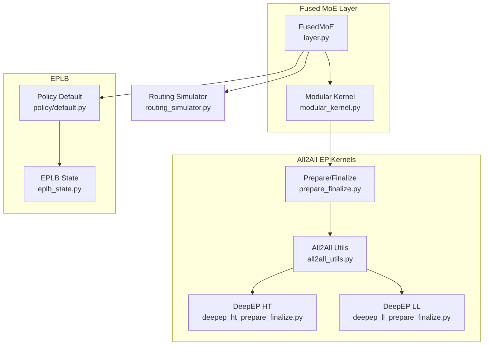
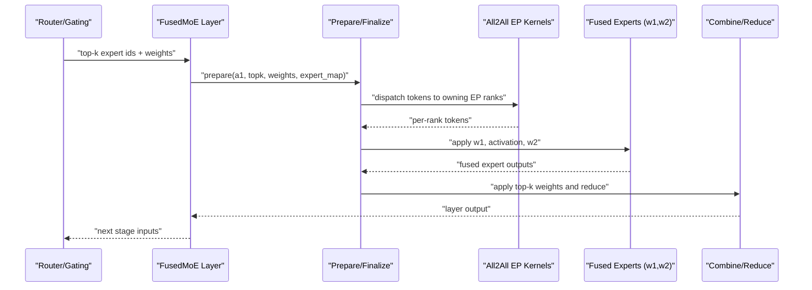
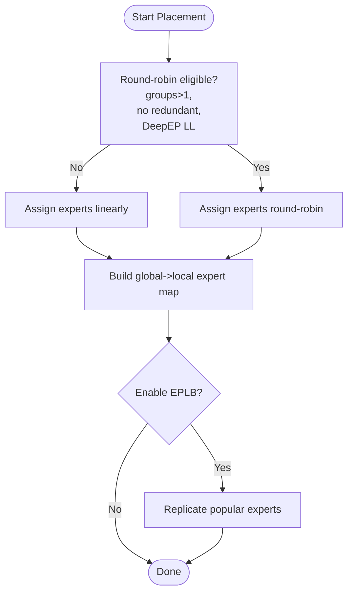
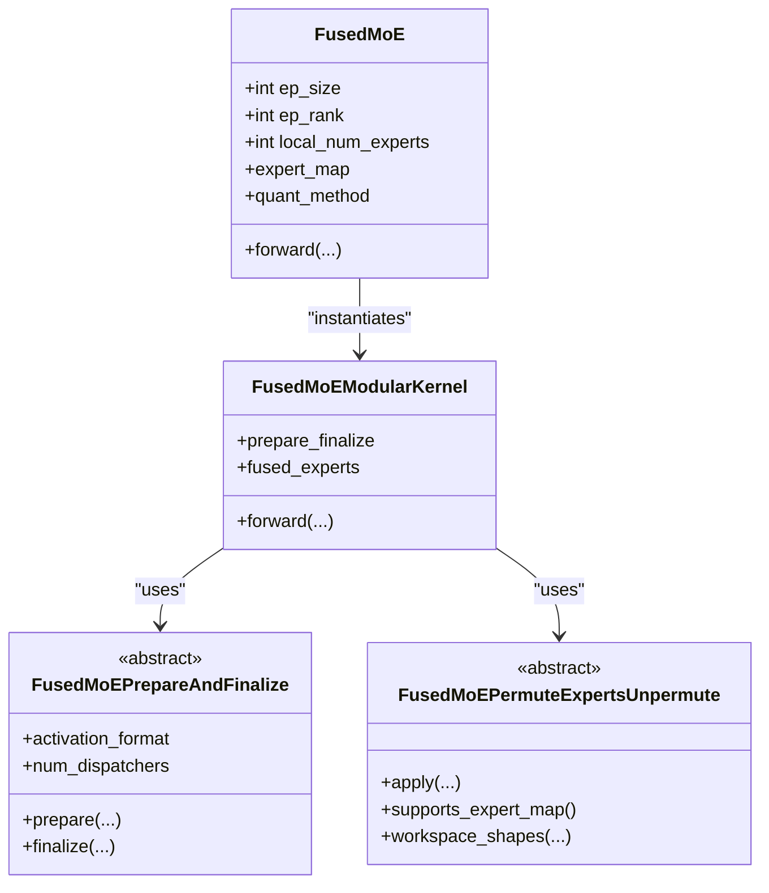
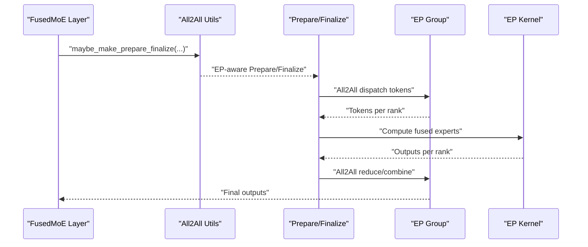
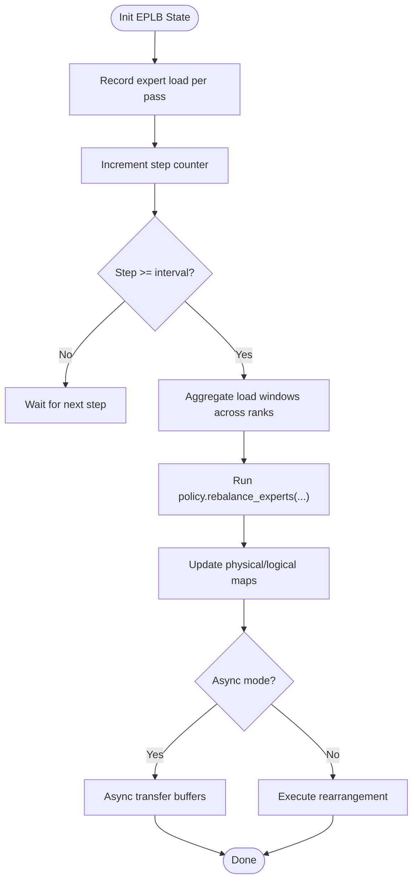
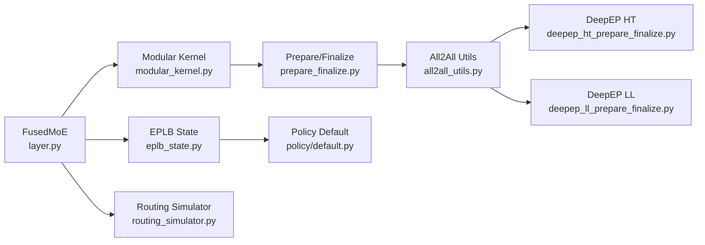

# Expert Parallelism

<cite>
**Referenced Files in This Document**
- [layer.py](file://vllm/model_executor/layers/fused_moe/layer.py)
- [modular_kernel.py](file://vllm/model_executor/layers/fused_moe/modular_kernel.py)
- [fused_moe.py](file://vllm/model_executor/layers/fused_moe/fused_moe.py)
- [prepare_finalize.py](file://vllm/model_executor/layers/fused_moe/prepare_finalize.py)
- [all2all_utils.py](file://vllm/model_executor/layers/fused_moe/all2all_utils.py)
- [default.py](file://vllm/distributed/eplb/policy/default.py)
- [__init__.py](file://vllm/distributed/eplb/__init__.py)
- [eplb_state.py](file://vllm/distributed/eplb/eplb_state.py)
- [routing_simulator.py](file://vllm/model_executor/layers/fused_moe/routing_simulator.py)
- [deepep_ht_prepare_finalize.py](file://vllm/model_executor/layers/fused_moe/deepep_ht_prepare_finalize.py)
- [deepep_ll_prepare_finalize.py](file://vllm/model_executor/layers/fused_moe/deepep_ll_prepare_finalize.py)
- [ernie45_moe.py](file://vllm/model_executor/models/ernie45_moe.py)
- [openpangu.py](file://vllm/model_executor/models/openpangu.py)
</cite>

## Table of Contents
1. [Introduction](#introduction)
2. [Project Structure](#project-structure)
3. [Core Components](#core-components)
4. [Architecture Overview](#architecture-overview)
5. [Detailed Component Analysis](#detailed-component-analysis)
6. [Dependency Analysis](#dependency-analysis)
7. [Performance Considerations](#performance-considerations)
8. [Troubleshooting Guide](#troubleshooting-guide)
9. [Conclusion](#conclusion)
10. [Appendices](#appendices)

## Introduction
This document explains expert parallelism in vLLM’s Mixture-of-Experts (MoE) stack with a focus on:
- Expert routing and capacity management
- Elastic Parallel Load Balancing (EPLB) for dynamic expert assignment
- Fused MoE layer implementations and modular kernel architecture
- Expert sharding across devices and communication patterns
- Practical configuration examples and performance/memory guidance

It synthesizes the implementation across the fused MoE layer, modular kernel, EPLB policy/state, and all2all preparation/finalization utilities.

## Project Structure
The expert parallelism implementation spans:
- Fused MoE layer and modular kernel abstractions
- All2all preparation/finalization for EP-aware dispatch
- EPLB policy and runtime state
- Routing simulator for strategy exploration

**Diagram sources**
- [layer.py](file://vllm/model_executor/layers/fused_moe/layer.py#L1-L200)
- [modular_kernel.py](file://vllm/model_executor/layers/fused_moe/modular_kernel.py#L1-L120)
- [prepare_finalize.py](file://vllm/model_executor/layers/fused_moe/prepare_finalize.py#L1-L79)
- [all2all_utils.py](file://vllm/model_executor/layers/fused_moe/all2all_utils.py#L1-L172)
- [deepep_ht_prepare_finalize.py](file://vllm/model_executor/layers/fused_moe/deepep_ht_prepare_finalize.py)
- [deepep_ll_prepare_finalize.py](file://vllm/model_executor/layers/fused_moe/deepep_ll_prepare_finalize.py)
- [default.py](file://vllm/distributed/eplb/policy/default.py#L1-L120)
- [eplb_state.py](file://vllm/distributed/eplb/eplb_state.py#L200-L320)
- [routing_simulator.py](file://vllm/model_executor/layers/fused_moe/routing_simulator.py#L48-L120)

**Section sources**
- [layer.py](file://vllm/model_executor/layers/fused_moe/layer.py#L1-L200)
- [modular_kernel.py](file://vllm/model_executor/layers/fused_moe/modular_kernel.py#L1-L120)
- [all2all_utils.py](file://vllm/model_executor/layers/fused_moe/all2all_utils.py#L1-L172)
- [eplb_state.py](file://vllm/distributed/eplb/eplb_state.py#L200-L320)

## Core Components
- FusedMoE layer: orchestrates expert selection, EP placement, quantization, dispatch, and combination. It manages EP rank/world size, expert maps, and modular kernel instantiation.
- Modular kernel: separates preparation/finalization (quantize/dispatch, combine/reduce) from the fused experts computation (permute/unpermute).
- All2all preparation/finalization: EP-aware dispatch/finalize for DeepEP/PPLX backends; handles hidden dim alignment and dispatcher counts.
- EPLB policy/state: computes dynamic expert replication and placement to balance load across ranks and GPUs; maintains sliding windows of expert load.
- Routing simulator: provides configurable routing strategies for testing and analysis.

**Section sources**
- [layer.py](file://vllm/model_executor/layers/fused_moe/layer.py#L100-L187)
- [modular_kernel.py](file://vllm/model_executor/layers/fused_moe/modular_kernel.py#L120-L220)
- [all2all_utils.py](file://vllm/model_executor/layers/fused_moe/all2all_utils.py#L66-L172)
- [default.py](file://vllm/distributed/eplb/policy/default.py#L210-L268)
- [eplb_state.py](file://vllm/distributed/eplb/eplb_state.py#L521-L660)
- [routing_simulator.py](file://vllm/model_executor/layers/fused_moe/routing_simulator.py#L48-L120)

## Architecture Overview
The fused MoE pipeline integrates routing, quantization/dispatch, expert computation, and reduction. EP-aware all2all preparation/finalization coordinates token-to-expert redistribution across ranks. EPLB periodically recomputes expert replicas and mappings to balance load.

**Diagram sources**
- [fused_moe.py](file://vllm/model_executor/layers/fused_moe/fused_moe.py#L1-L120)
- [prepare_finalize.py](file://vllm/model_executor/layers/fused_moe/prepare_finalize.py#L1-L79)
- [all2all_utils.py](file://vllm/model_executor/layers/fused_moe/all2all_utils.py#L66-L172)
- [modular_kernel.py](file://vllm/model_executor/layers/fused_moe/modular_kernel.py#L666-L760)

## Detailed Component Analysis

### Expert Placement and Capacity Management
- Expert placement strategies:
  - Linear: distribute experts evenly across EP ranks.
  - Round-robin: assign experts to ranks in a round-robin pattern; supported only under specific conditions (multiple expert groups, no redundant experts, and DeepEP low-latency backend).
- Expert maps:
  - Global-to-local mapping enables EP shards to index into their local experts.
  - Optional expert mask for ROCm AIter fused MoE.
- Redundant experts:
  - EPLB adds replicas to popular logical experts to improve load balance; only supported when EPLB is enabled.
- Capacity management:
  - Hidden dimension rounding for EP backends to align with kernel/block constraints.
  - Token batching and chunking for activation processing.

**Diagram sources**
- [layer.py](file://vllm/model_executor/layers/fused_moe/layer.py#L100-L187)
- [layer.py](file://vllm/model_executor/layers/fused_moe/layer.py#L189-L223)
- [layer.py](file://vllm/model_executor/layers/fused_moe/layer.py#L246-L299)

**Section sources**
- [layer.py](file://vllm/model_executor/layers/fused_moe/layer.py#L100-L187)
- [layer.py](file://vllm/model_executor/layers/fused_moe/layer.py#L189-L223)
- [layer.py](file://vllm/model_executor/layers/fused_moe/layer.py#L246-L299)

### Fused MoE Layer and Modular Kernel
- FusedMoE layer:
  - Maintains EP world size/rank, TP/DP/PCP sizes, and EP-specific flags.
  - Builds expert maps and masks; initializes quantization method and modular kernel.
  - Supports shared experts stream and ROCm AIter fusion flags.
- Modular kernel:
  - Separates preparation/finalization from fused experts computation.
  - Provides activation formats, workspace sizing, chunking, and expert map support.
  - Integrates with DP+EP contexts and parallel config.

**Diagram sources**
- [layer.py](file://vllm/model_executor/layers/fused_moe/layer.py#L300-L760)
- [modular_kernel.py](file://vllm/model_executor/layers/fused_moe/modular_kernel.py#L666-L800)
- [modular_kernel.py](file://vllm/model_executor/layers/fused_moe/modular_kernel.py#L1-L120)

**Section sources**
- [layer.py](file://vllm/model_executor/layers/fused_moe/layer.py#L300-L760)
- [modular_kernel.py](file://vllm/model_executor/layers/fused_moe/modular_kernel.py#L666-L800)
- [prepare_finalize.py](file://vllm/model_executor/layers/fused_moe/prepare_finalize.py#L1-L79)

### All2All Preparation/Finalization and Communication Patterns
- EP-aware preparation/finalization:
  - PPLX, DeepEP HT, and DeepEP LL backends supported.
  - Hidden dimension rounding and dispatcher counts derived from all2all manager.
  - Round-robin routing tables for DeepEP LL with round-robin placement.
- Communication patterns:
  - Dispatch tokens to owning EP ranks based on expert ownership.
  - Per-rank token buffers and optional FP8 dispatch for bandwidth reduction.

**Diagram sources**
- [all2all_utils.py](file://vllm/model_executor/layers/fused_moe/all2all_utils.py#L66-L172)
- [deepep_ht_prepare_finalize.py](file://vllm/model_executor/layers/fused_moe/deepep_ht_prepare_finalize.py)
- [deepep_ll_prepare_finalize.py](file://vllm/model_executor/layers/fused_moe/deepep_ll_prepare_finalize.py)

**Section sources**
- [all2all_utils.py](file://vllm/model_executor/layers/fused_moe/all2all_utils.py#L1-L172)
- [layer.py](file://vllm/model_executor/layers/fused_moe/layer.py#L798-L833)

### Elastic Parallel Load Balancing (EPLB)
- Policy:
  - Hierarchical and global load balancing strategies to pack expert groups to nodes/GPUs and replicate popular experts.
  - Computes physical-to-logical maps, logical-to-physical maps, and replica counts.
- State:
  - Maintains sliding window of expert load, rearrangement intervals, and async transfer coordination.
  - Supports sync and async modes; logs balancedness metrics.
- Dynamic expert assignment:
  - Uses global expert load windows aggregated across ranks to compute new mappings.
  - Supports scaling scenarios with rank mapping updates.

**Diagram sources**
- [eplb_state.py](file://vllm/distributed/eplb/eplb_state.py#L521-L660)
- [default.py](file://vllm/distributed/eplb/policy/default.py#L210-L268)

**Section sources**
- [default.py](file://vllm/distributed/eplb/policy/default.py#L210-L268)
- [eplb_state.py](file://vllm/distributed/eplb/eplb_state.py#L521-L660)

### Routing Strategies and Simulation
- Routing simulator:
  - Provides distribution-based strategies (uniform, normal) for testing routing patterns.
  - Useful for capacity planning and understanding token distribution impacts on EP load.

**Section sources**
- [routing_simulator.py](file://vllm/model_executor/layers/fused_moe/routing_simulator.py#L48-L120)

### Model Integration Examples
- Expert parallel configuration in models:
  - Logical vs physical experts, redundant experts, and EP shard boundaries.
  - Shared experts support and EP rank-based expert ranges.

**Section sources**
- [ernie45_moe.py](file://vllm/model_executor/models/ernie45_moe.py#L147-L174)
- [openpangu.py](file://vllm/model_executor/models/openpangu.py#L160-L186)

## Dependency Analysis
Key dependencies and coupling:
- FusedMoE depends on modular kernel abstractions and quantization method selection.
- All2all preparation/finalization depends on EP group and platform capabilities.
- EPLB policy interacts with EP state and requires synchronized load windows across ranks.
- Routing simulator is independent and used for strategy evaluation.

**Diagram sources**
- [layer.py](file://vllm/model_executor/layers/fused_moe/layer.py#L300-L760)
- [modular_kernel.py](file://vllm/model_executor/layers/fused_moe/modular_kernel.py#L666-L800)
- [prepare_finalize.py](file://vllm/model_executor/layers/fused_moe/prepare_finalize.py#L1-L79)
- [all2all_utils.py](file://vllm/model_executor/layers/fused_moe/all2all_utils.py#L66-L172)
- [deepep_ht_prepare_finalize.py](file://vllm/model_executor/layers/fused_moe/deepep_ht_prepare_finalize.py)
- [deepep_ll_prepare_finalize.py](file://vllm/model_executor/layers/fused_moe/deepep_ll_prepare_finalize.py)
- [eplb_state.py](file://vllm/distributed/eplb/eplb_state.py#L521-L660)
- [default.py](file://vllm/distributed/eplb/policy/default.py#L210-L268)
- [routing_simulator.py](file://vllm/model_executor/layers/fused_moe/routing_simulator.py#L48-L120)

**Section sources**
- [layer.py](file://vllm/model_executor/layers/fused_moe/layer.py#L300-L760)
- [modular_kernel.py](file://vllm/model_executor/layers/fused_moe/modular_kernel.py#L666-L800)
- [all2all_utils.py](file://vllm/model_executor/layers/fused_moe/all2all_utils.py#L66-L172)
- [eplb_state.py](file://vllm/distributed/eplb/eplb_state.py#L521-L660)
- [default.py](file://vllm/distributed/eplb/policy/default.py#L210-L268)
- [routing_simulator.py](file://vllm/model_executor/layers/fused_moe/routing_simulator.py#L48-L120)

## Performance Considerations
- EP backend selection:
  - DeepEP low-latency and high-throughput backends offer different trade-offs; round-robin placement is restricted to specific configurations.
- Hidden dimension alignment:
  - Rounding improves kernel performance and reduces misalignment overhead.
- Activation chunking:
  - Enables processing large token counts in chunks to manage memory footprint.
- Quantization-aware dispatch:
  - FP8 dispatch can reduce bandwidth in DeepEP LL when quantization dtype and block shape permit.
- EPLB cadence:
  - Adjust step interval and window size to balance accuracy of load estimates against overhead.

[No sources needed since this section provides general guidance]

## Troubleshooting Guide
- Round-robin placement disabled:
  - If round-robin is requested but unsupported, the layer falls back to linear placement and logs a warning.
- EPLB compatibility:
  - EPLB currently supports FP8 quantization; attempting to enable EPLB with unsupported quantization raises an error.
- EP configuration validation:
  - EPLB expects even distribution of experts across ranks; mismatches trigger assertions.
- Asynchronous EPLB:
  - Requires coordinated readiness across ranks; ensure buffer readiness events and pending checks are handled consistently.

**Section sources**
- [layer.py](file://vllm/model_executor/layers/fused_moe/layer.py#L189-L223)
- [layer.py](file://vllm/model_executor/layers/fused_moe/layer.py#L623-L635)
- [eplb_state.py](file://vllm/distributed/eplb/eplb_state.py#L288-L323)
- [eplb_state.py](file://vllm/distributed/eplb/eplb_state.py#L615-L660)

## Conclusion
vLLM’s expert parallelism stack cleanly separates concerns between routing, quantization/dispatch, fused expert computation, and reduction. The modular kernel abstraction allows flexible combinations of EP-aware preparation/finalization and backend kernels. EPLB dynamically balances load by replicating popular experts and adjusting mappings across ranks and GPUs. Proper configuration of expert placement, capacity management, and EPLB parameters yields strong performance and scalability across diverse hardware setups.

[No sources needed since this section summarizes without analyzing specific files]

## Appendices
- Practical configuration tips:
  - Prefer linear placement unless round-robin is required and supported.
  - Enable EPLB for highly imbalanced routing; tune step interval and window size.
  - Use DeepEP LL with round-robin placement for lower-latency all2all when constraints allow.
  - Monitor balancedness metrics to validate EPLB effectiveness.

[No sources needed since this section provides general guidance]