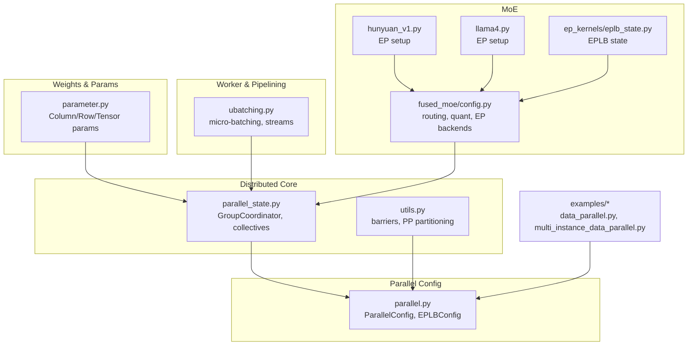
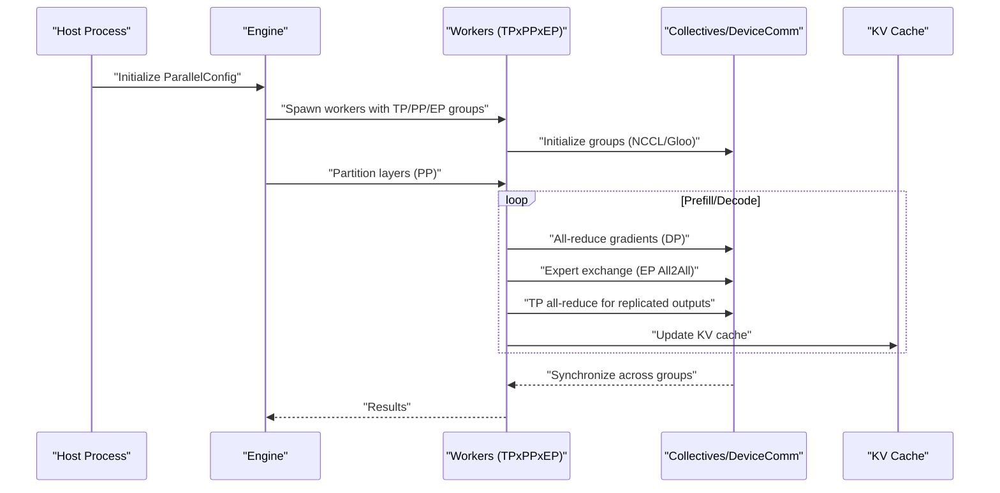
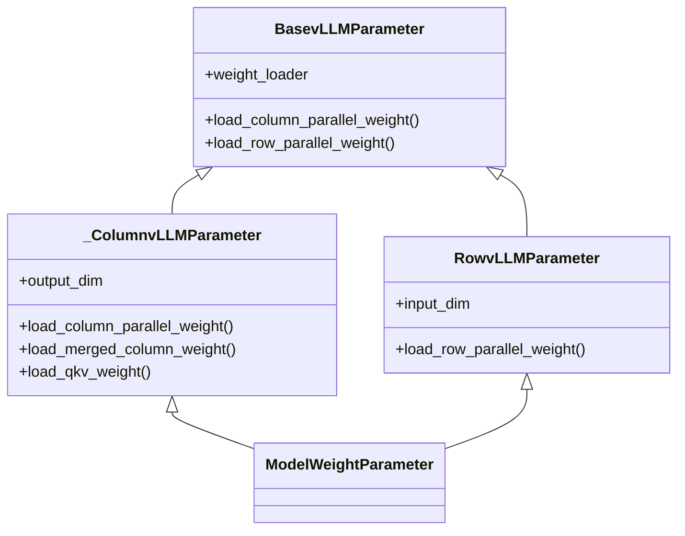
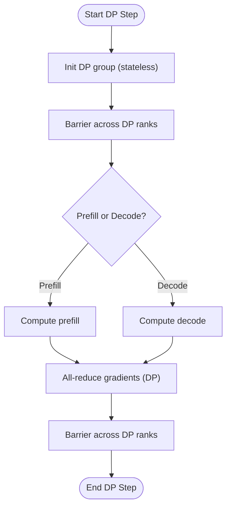
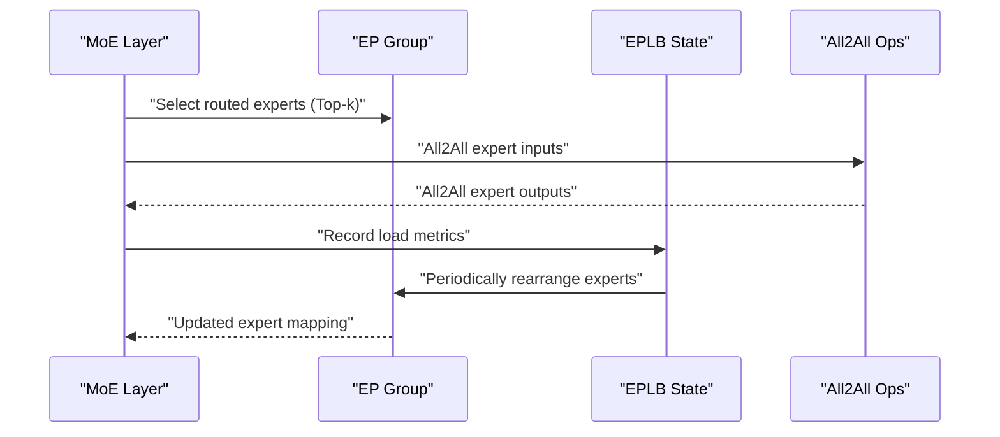
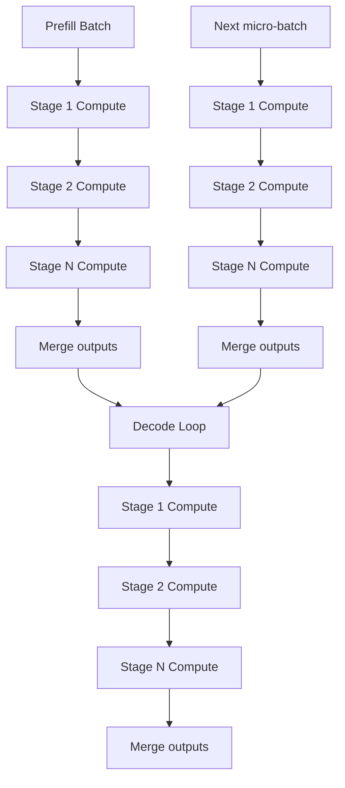
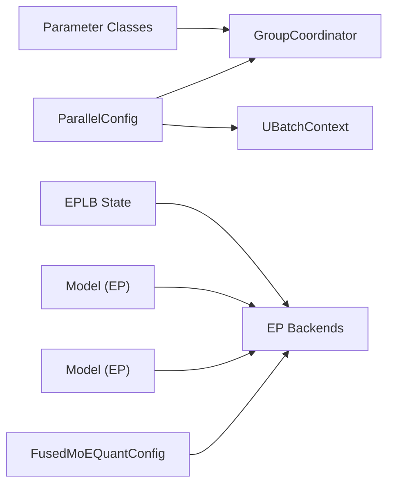

# Parallelism Strategies

<cite>
**Referenced Files in This Document**
- [parallel_state.py](file://vllm/distributed/parallel_state.py)
- [utils.py](file://vllm/distributed/utils.py)
- [parallel.py](file://vllm/config/parallel.py)
- [parameter.py](file://vllm/model_executor/parameter.py)
- [ubatching.py](file://vllm/v1/worker/ubatching.py)
- [fused_moe/config.py](file://vllm/model_executor/layers/fused_moe/config.py)
- [hunyuan_v1.py](file://vllm/model_executor/models/hunyuan_v1.py)
- [llama4.py](file://vllm/model_executor/models/llama4.py)
- [ep_kernels/eplb_state.py](file://vllm/distributed/eplb/eplb_state.py)
- [data_parallel.py](file://examples/offline_inference/data_parallel.py)
- [multi_instance_data_parallel.py](file://examples/online_serving/multi_instance_data_parallel.py)
- [test_expert_parallel.py](file://tests/distributed/test_expert_parallel.py)
- [test_pipeline_parallel.py](file://tests/distributed/test_pipeline_parallel.py)
- [test_pipeline_partition.py](file://tests/distributed/test_pipeline_partition.py)
- [test_distributed_oot.py](file://tests/distributed/test_distributed_oot.py)
- [test_multiproc_executor.py](file://tests/distributed/test_multiproc_executor.py)
- [test_pynccl.py](file://tests/distributed/test_pynccl.py)
- [test_quick_all_reduce.py](file://tests/distributed/test_quick_all_reduce.py)
- [test_symm_mem_allreduce.py](file://tests/distributed/test_symm_mem_allreduce.py)
- [test_context_parallel.py](file://tests/distributed/test_context_parallel.py)
- [test_sequence_parallel.py](file://tests/distributed/test_sequence_parallel.py)
- [test_expert_placement.py](file://tests/distributed/test_expert_placement.py)
- [test_custom_all_reduce.py](file://tests/distributed/test_custom_all_reduce.py)
- [test_comm_ops.py](file://tests/distributed/test_comm_ops.py)
- [test_node_count.py](file://tests/distributed/test_node_count.py)
- [test_torchrun_example.py](file://tests/distributed/test_torchrun_example.py)
- [test_torchrun_example_moe.py](file://tests/distributed/test_torchrun_example_moe.py)
- [test_utils.py](file://tests/distributed/test_utils.py)
</cite>

## Table of Contents
1. [Introduction](#introduction)
2. [Project Structure](#project-structure)
3. [Core Components](#core-components)
4. [Architecture Overview](#architecture-overview)
5. [Detailed Component Analysis](#detailed-component-analysis)
6. [Dependency Analysis](#dependency-analysis)
7. [Performance Considerations](#performance-considerations)
8. [Troubleshooting Guide](#troubleshooting-guide)
9. [Conclusion](#conclusion)
10. [Appendices](#appendices)

## Introduction
This document explains vLLM’s parallelism strategies across tensor parallelism, data parallelism, expert parallelism, and pipeline parallelism. It covers how models are partitioned, how weights and gradients are distributed, how workers are orchestrated, and how communication is performed. It also provides concrete references to code locations where parallelism is configured and executed, along with performance and memory considerations for different model sizes and hardware setups.

## Project Structure
Parallelism in vLLM spans several subsystems:
- Distributed primitives and group management
- Communication operations and device communicators
- Parallel configuration model
- Weight parameterization and tensor/row/column parallel loading
- Micro-batching and dual batch overlap (ubatching)
- Expert parallelism and load balancing for MoE
- Pipeline partitioning and orchestration
- Examples and tests validating parallel configurations

**Diagram sources**
- [parallel_state.py](file://vllm/distributed/parallel_state.py#L1-L120)
- [utils.py](file://vllm/distributed/utils.py#L95-L141)
- [parallel.py](file://vllm/config/parallel.py#L81-L160)
- [parameter.py](file://vllm/model_executor/parameter.py#L129-L231)
- [ubatching.py](file://vllm/v1/worker/ubatching.py#L1-L120)
- [fused_moe/config.py](file://vllm/model_executor/layers/fused_moe/config.py#L100-L120)
- [hunyuan_v1.py](file://vllm/model_executor/models/hunyuan_v1.py#L370-L396)
- [llama4.py](file://vllm/model_executor/models/llama4.py#L101-L124)
- [ep_kernels/eplb_state.py](file://vllm/distributed/eplb/eplb_state.py#L373-L414)
- [data_parallel.py](file://examples/offline_inference/data_parallel.py#L1-L200)
- [multi_instance_data_parallel.py](file://examples/online_serving/multi_instance_data_parallel.py#L1-L200)

**Section sources**
- [parallel_state.py](file://vllm/distributed/parallel_state.py#L1-L120)
- [parallel.py](file://vllm/config/parallel.py#L81-L160)
- [parameter.py](file://vllm/model_executor/parameter.py#L129-L231)
- [ubatching.py](file://vllm/v1/worker/ubatching.py#L1-L120)
- [fused_moe/config.py](file://vllm/model_executor/layers/fused_moe/config.py#L100-L120)
- [hunyuan_v1.py](file://vllm/model_executor/models/hunyuan_v1.py#L370-L396)
- [llama4.py](file://vllm/model_executor/models/llama4.py#L101-L124)
- [ep_kernels/eplb_state.py](file://vllm/distributed/eplb/eplb_state.py#L373-L414)
- [data_parallel.py](file://examples/offline_inference/data_parallel.py#L1-L200)
- [multi_instance_data_parallel.py](file://examples/online_serving/multi_instance_data_parallel.py#L1-L200)

## Core Components
- Distributed state and collectives: GroupCoordinator encapsulates device and CPU process groups, and exposes all_reduce, all_gather, reduce_scatter, and broadcast operations. It integrates platform-specific device communicators and custom ops for performance.
- Parallel configuration: ParallelConfig defines pipeline_parallel_size, tensor_parallel_size, data_parallel_size, expert_parallel flags, and EPLB settings. It validates combinations and computes derived world sizes.
- Weight parameterization: Column/Row/Tensor parameter classes implement tensor-parallel-aware weight loading for column/row-parallel layers and fused QKV/merged weights.
- Micro-batching and dual batch overlap: UBatchContext coordinates compute and communication streams across micro-batches, enabling overlapped execution and synchronization.
- Expert parallelism: FusedMoE config defines routing methods and EP backends; model classes set up EP groups, logical/physical expert counts, and optional EPLB.

**Section sources**
- [parallel_state.py](file://vllm/distributed/parallel_state.py#L278-L570)
- [parallel.py](file://vllm/config/parallel.py#L81-L160)
- [parameter.py](file://vllm/model_executor/parameter.py#L129-L231)
- [ubatching.py](file://vllm/v1/worker/ubatching.py#L1-L120)
- [fused_moe/config.py](file://vllm/model_executor/layers/fused_moe/config.py#L100-L120)

## Architecture Overview
The vLLM parallelism architecture composes multiple axes:
- Tensor parallelism: splits tensors across TP ranks for linear layers and QKV fusion.
- Data parallelism: synchronizes gradients and batches across DP ranks (optionally with external or hybrid load balancing).
- Expert parallelism: shards MoE experts across EP ranks, optionally with EPLB for load balancing.
- Pipeline parallelism: partitions transformer layers across PP ranks with micro-batching and stage pipelining.

**Diagram sources**
- [parallel.py](file://vllm/config/parallel.py#L508-L555)
- [parallel_state.py](file://vllm/distributed/parallel_state.py#L278-L570)
- [fused_moe/config.py](file://vllm/model_executor/layers/fused_moe/config.py#L100-L120)
- [hunyuan_v1.py](file://vllm/model_executor/models/hunyuan_v1.py#L370-L396)
- [llama4.py](file://vllm/model_executor/models/llama4.py#L101-L124)

## Detailed Component Analysis

### Tensor Parallelism
Tensor parallelism partitions tensors across TP ranks for linear layers:
- Column-parallel layers: output dimension is split across ranks; each rank loads a shard.
- Row-parallel layers: input dimension is split; results are all-reduced to reassemble outputs.
- Merged QKV and fused parameters: specialized loaders slice and place shards based on TP rank and packed layouts.

Key implementation points:
- Column/Row parameter classes implement shard-aware loading and assertions for shape compatibility.
- Weight loader utilities narrow tensors along the appropriate dimension and copy into local shards.
- Some parameter types intentionally restrict TP support to ensure correctness.

**Diagram sources**
- [parameter.py](file://vllm/model_executor/parameter.py#L129-L231)
- [parameter.py](file://vllm/model_executor/parameter.py#L233-L240)

Practical references:
- Column/row loading and merged QKV slicing: [parameter.py](file://vllm/model_executor/parameter.py#L148-L202), [parameter.py](file://vllm/model_executor/parameter.py#L220-L231)
- Merged column and QKV handling: [parameter.py](file://vllm/model_executor/parameter.py#L156-L202)

**Section sources**
- [parameter.py](file://vllm/model_executor/parameter.py#L129-L231)
- [parameter.py](file://vllm/model_executor/parameter.py#L148-L202)
- [parameter.py](file://vllm/model_executor/parameter.py#L220-L231)

### Data Parallelism with Pipeline Orchestration
Data parallelism synchronizes gradients across DP ranks. vLLM supports:
- Local DP size and rank
- External or hybrid load balancing modes
- Stateless DP group initialization with retries and gloo fallback
- Barrier and all_reduce helpers for DP synchronization

Pipeline orchestration:
- Pipeline partitioning distributes layers across PP ranks; the partitioning logic balances layers and can be overridden via environment variables.
- Micro-batching and dual batch overlap (ubatching) coordinate compute and communication streams to hide latency.

**Diagram sources**
- [parallel.py](file://vllm/config/parallel.py#L353-L390)
- [parallel.py](file://vllm/config/parallel.py#L415-L452)
- [utils.py](file://vllm/distributed/utils.py#L95-L141)
- [ubatching.py](file://vllm/v1/worker/ubatching.py#L1-L120)

Concrete references:
- DP group initialization and retries: [parallel.py](file://vllm/config/parallel.py#L353-L390)
- Barrier implementation and DP helpers: [utils.py](file://vllm/distributed/utils.py#L232-L366)
- Pipeline partitioning indices: [utils.py](file://vllm/distributed/utils.py#L95-L141)
- UBatch contexts and stream coordination: [ubatching.py](file://vllm/v1/worker/ubatching.py#L1-L120)

**Section sources**
- [parallel.py](file://vllm/config/parallel.py#L353-L390)
- [parallel.py](file://vllm/config/parallel.py#L415-L452)
- [utils.py](file://vllm/distributed/utils.py#L95-L141)
- [utils.py](file://vllm/distributed/utils.py#L232-L366)
- [ubatching.py](file://vllm/v1/worker/ubatching.py#L1-L120)

### Expert Parallelism for MoE
Expert parallelism shards MoE experts across EP ranks. vLLM supports:
- EP group creation and rank/world size
- Logical vs physical experts, with optional redundant experts for EPLB
- Multiple routing methods and quantization descriptors
- All2All backends for EP communication (naive, allgather-reducescatter, deepep variants, flashinfer)

Load balancing:
- EPLB tracks expert load windows and rearranges experts periodically to improve balancedness.
- Redundant experts increase resilience and balance.

**Diagram sources**
- [fused_moe/config.py](file://vllm/model_executor/layers/fused_moe/config.py#L100-L120)
- [hunyuan_v1.py](file://vllm/model_executor/models/hunyuan_v1.py#L370-L396)
- [llama4.py](file://vllm/model_executor/models/llama4.py#L101-L124)
- [ep_kernels/eplb_state.py](file://vllm/distributed/eplb/eplb_state.py#L373-L414)

Concrete references:
- EP setup and expert counts: [hunyuan_v1.py](file://vllm/model_executor/models/hunyuan_v1.py#L370-L396), [llama4.py](file://vllm/model_executor/models/llama4.py#L101-L124)
- Routing method enumeration: [fused_moe/config.py](file://vllm/model_executor/layers/fused_moe/config.py#L100-L120)
- EPLB state arrays and window sizing: [ep_kernels/eplb_state.py](file://vllm/distributed/eplb/eplb_state.py#L373-L414)

**Section sources**
- [fused_moe/config.py](file://vllm/model_executor/layers/fused_moe/config.py#L100-L120)
- [hunyuan_v1.py](file://vllm/model_executor/models/hunyuan_v1.py#L370-L396)
- [llama4.py](file://vllm/model_executor/models/llama4.py#L101-L124)
- [ep_kernels/eplb_state.py](file://vllm/distributed/eplb/eplb_state.py#L373-L414)

### Pipeline Parallelism with Micro-batching and Memory Optimization
Pipeline parallelism partitions transformer layers across PP ranks. vLLM employs:
- Layer partitioning across PP ranks with optional manual overrides.
- Micro-batching (ubatching) to pipeline stages and overlap compute with communication.
- Stream-based synchronization between compute and communication to maximize utilization.

**Diagram sources**
- [utils.py](file://vllm/distributed/utils.py#L95-L141)
- [ubatching.py](file://vllm/v1/worker/ubatching.py#L1-L120)
- [ubatching.py](file://vllm/v1/worker/ubatching.py#L203-L242)

Concrete references:
- PP partition indices calculation: [utils.py](file://vllm/distributed/utils.py#L95-L141)
- UBatch context creation and synchronization: [ubatching.py](file://vllm/v1/worker/ubatching.py#L203-L242)

**Section sources**
- [utils.py](file://vllm/distributed/utils.py#L95-L141)
- [ubatching.py](file://vllm/v1/worker/ubatching.py#L1-L120)
- [ubatching.py](file://vllm/v1/worker/ubatching.py#L203-L242)

## Dependency Analysis
Parallelism relies on coordinated components:
- GroupCoordinator manages device and CPU groups and exposes collective operations.
- ParallelConfig drives world size computation and validates DP/EP/Tensor combinations.
- Parameter classes depend on TP rank/world size to shard weights.
- UBatchContext depends on CUDA streams and barriers to coordinate micro-batches.
- EP backends and routing methods are configured via FusedMoEQuantConfig and model classes.

**Diagram sources**
- [parallel.py](file://vllm/config/parallel.py#L508-L555)
- [parallel_state.py](file://vllm/distributed/parallel_state.py#L278-L570)
- [parameter.py](file://vllm/model_executor/parameter.py#L129-L231)
- [ubatching.py](file://vllm/v1/worker/ubatching.py#L1-L120)
- [fused_moe/config.py](file://vllm/model_executor/layers/fused_moe/config.py#L100-L120)
- [hunyuan_v1.py](file://vllm/model_executor/models/hunyuan_v1.py#L370-L396)
- [llama4.py](file://vllm/model_executor/models/llama4.py#L101-L124)
- [ep_kernels/eplb_state.py](file://vllm/distributed/eplb/eplb_state.py#L373-L414)

**Section sources**
- [parallel.py](file://vllm/config/parallel.py#L508-L555)
- [parallel_state.py](file://vllm/distributed/parallel_state.py#L278-L570)
- [parameter.py](file://vllm/model_executor/parameter.py#L129-L231)
- [ubatching.py](file://vllm/v1/worker/ubatching.py#L1-L120)
- [fused_moe/config.py](file://vllm/model_executor/layers/fused_moe/config.py#L100-L120)
- [hunyuan_v1.py](file://vllm/model_executor/models/hunyuan_v1.py#L370-L396)
- [llama4.py](file://vllm/model_executor/models/llama4.py#L101-L124)
- [ep_kernels/eplb_state.py](file://vllm/distributed/eplb/eplb_state.py#L373-L414)

## Performance Considerations
- Tensor parallelism:
  - Prefer column/row parallel splits aligned with layer shapes to minimize fragmentation.
  - Use packed weight layouts and adjusted shard indexes for quantized kernels to reduce overhead.
- Data parallelism:
  - Use external/hybrid load balancing for multi-node deployments to avoid hotspots.
  - Stateless DP initialization with retries avoids port conflicts in multi-process DP setup.
- Expert parallelism:
  - Enable EPLB with redundant experts for improved balancedness on heterogeneous workloads.
  - Choose All2All backends based on hardware and kernel availability (e.g., allgather-reducescatter, deepep variants).
- Pipeline parallelism:
  - Micro-batching and dual batch overlap reduce stall time by overlapping compute and communication.
  - Carefully tune PP partitioning to balance layer compute and avoid extreme tail latencies.

[No sources needed since this section provides general guidance]

## Troubleshooting Guide
Common issues and diagnostics:
- DP group initialization failures:
  - Address “address already in use” errors by retrying with fresh ports and gloo fallback.
  - Verify DP rank bounds and backend selection.
- Pipeline partition mismatches:
  - Ensure PP partition indices match model layers and hidden dimensions.
- EP configuration errors:
  - Validate EP enabled only when TP×DP > 1 and tensor parallel size ≤ number of experts.
  - Confirm EPLB enabled implies enable_expert_parallel and supported platform.
- Collectives and streams:
  - Use GroupCoordinator wrappers to ensure correct group names and device communicators.
  - Verify CUDA stream usage in ubatching contexts to avoid deadlocks.

Concrete references:
- DP initialization and retries: [parallel.py](file://vllm/config/parallel.py#L353-L390)
- PP partition validation: [utils.py](file://vllm/distributed/utils.py#L95-L141)
- EP/EPLB validation: [parallel.py](file://vllm/config/parallel.py#L297-L321)
- GroupCoordinator collectives: [parallel_state.py](file://vllm/distributed/parallel_state.py#L480-L570)
- UBatch stream usage: [ubatching.py](file://vllm/v1/worker/ubatching.py#L1-L120)

**Section sources**
- [parallel.py](file://vllm/config/parallel.py#L297-L321)
- [parallel.py](file://vllm/config/parallel.py#L353-L390)
- [utils.py](file://vllm/distributed/utils.py#L95-L141)
- [parallel_state.py](file://vllm/distributed/parallel_state.py#L480-L570)
- [ubatching.py](file://vllm/v1/worker/ubatching.py#L1-L120)

## Conclusion
vLLM’s parallelism stack combines robust distributed primitives, flexible configuration, and efficient execution patterns. Tensor parallelism partitions weights and outputs, data parallelism synchronizes gradients with configurable load balancing, expert parallelism shards MoE experts with EPLB, and pipeline parallelism leverages micro-batching and stream synchronization. Together, these strategies enable scalable inference across diverse hardware and model sizes.

[No sources needed since this section summarizes without analyzing specific files]

## Appendices
- Example configurations:
  - Offline data parallel example: [data_parallel.py](file://examples/offline_inference/data_parallel.py#L1-L200)
  - Online multi-instance data parallel example: [multi_instance_data_parallel.py](file://examples/online_serving/multi_instance_data_parallel.py#L1-L200)
- Tests validating parallelism:
  - Expert parallelism: [test_expert_parallel.py](file://tests/distributed/test_expert_parallel.py#L1-L200)
  - Pipeline parallelism: [test_pipeline_parallel.py](file://tests/distributed/test_pipeline_parallel.py#L1-L200), [test_pipeline_partition.py](file://tests/distributed/test_pipeline_partition.py#L1-L200)
  - Distributed orchestration: [test_distributed_oot.py](file://tests/distributed/test_distributed_oot.py#L1-L200), [test_multiproc_executor.py](file://tests/distributed/test_multiproc_executor.py#L1-L200)
  - NCCL and all-reduce: [test_pynccl.py](file://tests/distributed/test_pynccl.py#L1-L200), [test_custom_all_reduce.py](file://tests/distributed/test_custom_all_reduce.py#L1-L200), [test_quick_all_reduce.py](file://tests/distributed/test_quick_all_reduce.py#L1-L200), [test_symm_mem_allreduce.py](file://tests/distributed/test_symm_mem_allreduce.py#L1-L200)
  - Context and sequence parallel: [test_context_parallel.py](file://tests/distributed/test_context_parallel.py#L1-L200), [test_sequence_parallel.py](file://tests/distributed/test_sequence_parallel.py#L1-L200)
  - Expert placement: [test_expert_placement.py](file://tests/distributed/test_expert_placement.py#L1-L200)
  - Communication ops: [test_comm_ops.py](file://tests/distributed/test_comm_ops.py#L1-L200)
  - Node count and torchrun examples: [test_node_count.py](file://tests/distributed/test_node_count.py#L1-L200), [test_torchrun_example.py](file://tests/distributed/test_torchrun_example.py#L1-L200), [test_torchrun_example_moe.py](file://tests/distributed/test_torchrun_example_moe.py#L1-L200), [test_utils.py](file://tests/distributed/test_utils.py#L1-L200)