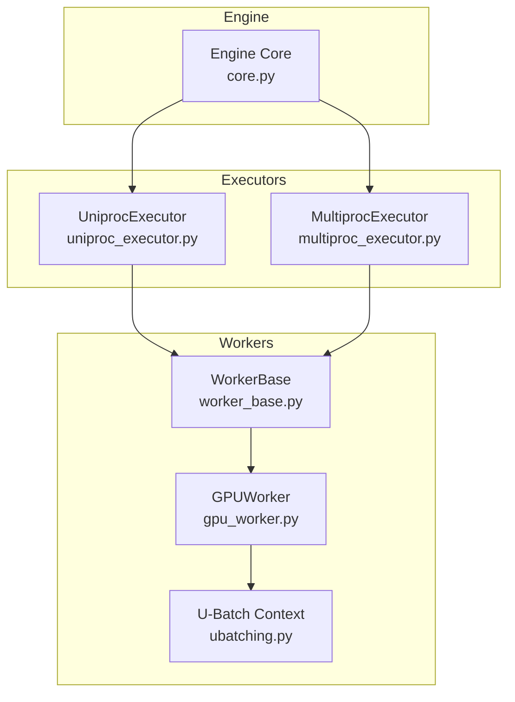
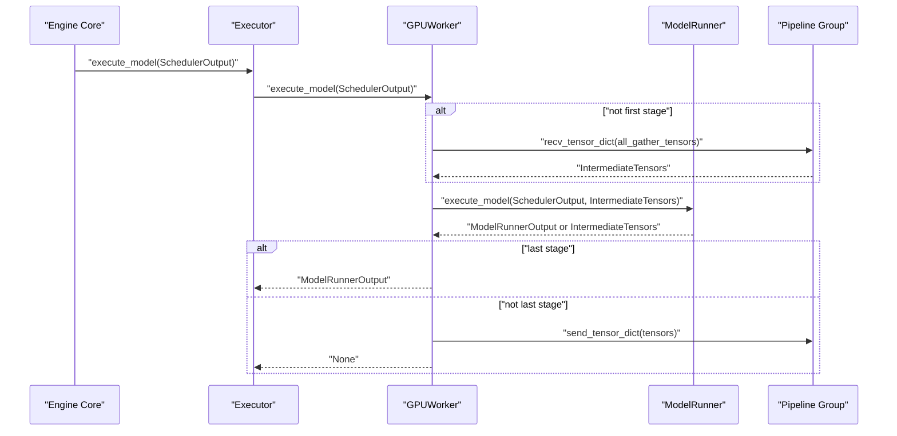
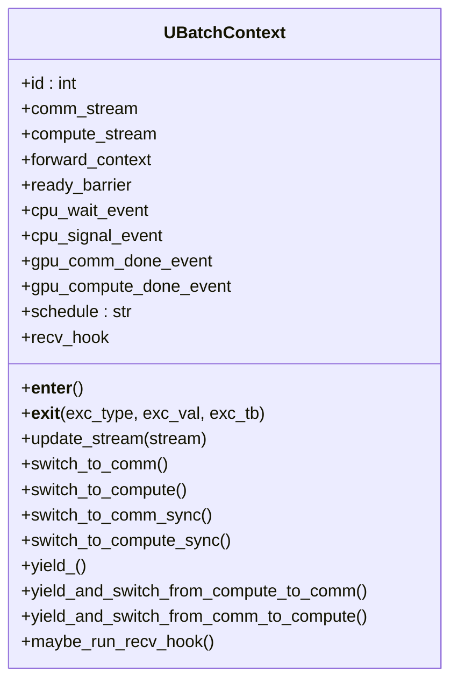
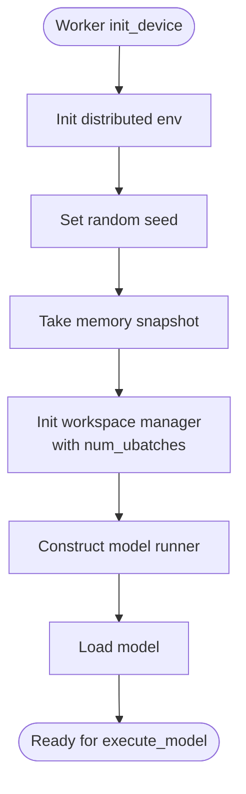
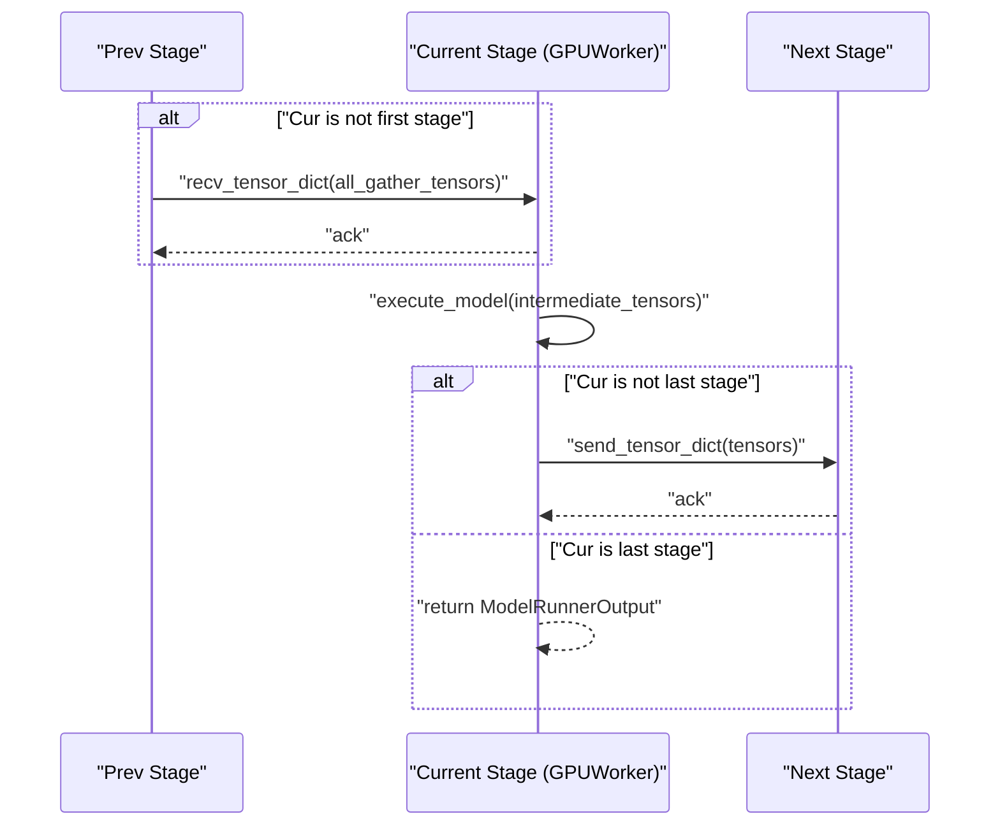
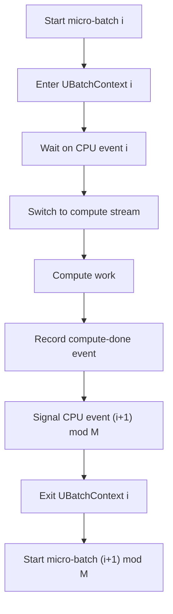
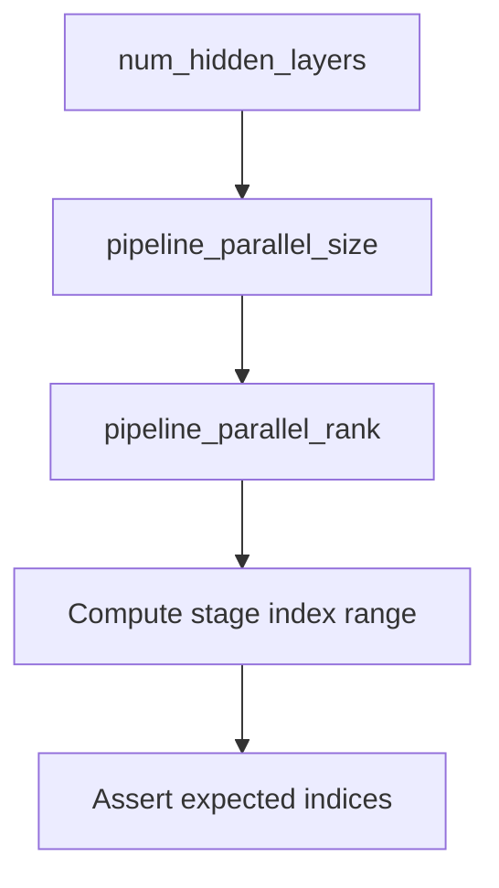
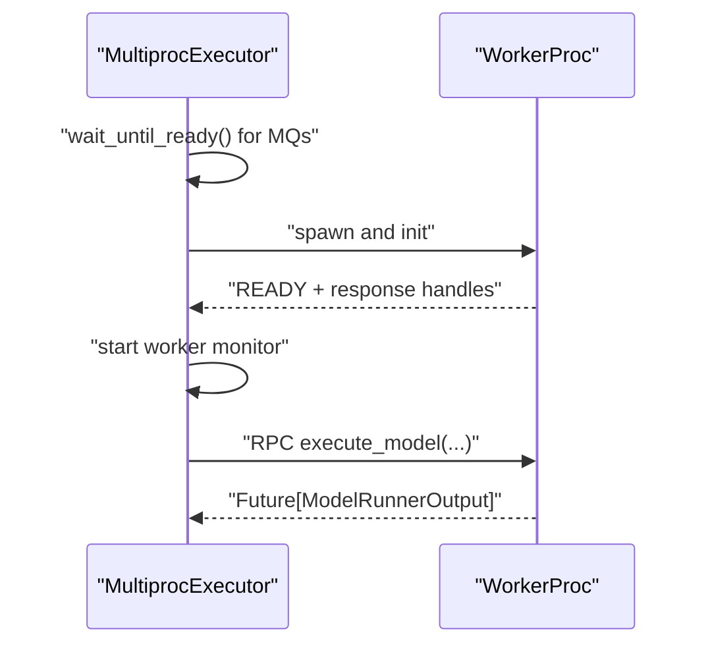
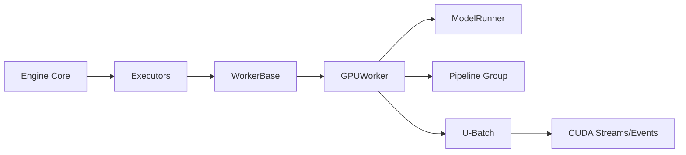

# Pipeline Parallelism

<cite>
**Referenced Files in This Document**
- [ubatching.py](file://vllm/v1/worker/ubatching.py)
- [worker_base.py](file://vllm/v1/worker/worker_base.py)
- [gpu_worker.py](file://vllm/v1/worker/gpu_worker.py)
- [uniproc_executor.py](file://vllm/v1/executor/uniproc_executor.py)
- [multiproc_executor.py](file://vllm/v1/executor/multiproc_executor.py)
- [test_pipeline_partition.py](file://tests/distributed/test_pipeline_partition.py)
- [core.py](file://vllm/v1/engine/core.py)
</cite>

## Table of Contents
1. [Introduction](#introduction)
2. [Project Structure](#project-structure)
3. [Core Components](#core-components)
4. [Architecture Overview](#architecture-overview)
5. [Detailed Component Analysis](#detailed-component-analysis)
6. [Dependency Analysis](#dependency-analysis)
7. [Performance Considerations](#performance-considerations)
8. [Troubleshooting Guide](#troubleshooting-guide)
9. [Conclusion](#conclusion)

## Introduction
This document explains pipeline parallelism in vLLM’s v1 runtime, focusing on stage pipelining, micro-batching (unified batching, U-Batch), memory optimization, and the orchestration of worker initialization and inter-stage communication. It synthesizes the implementation details from the worker, executor, and engine layers, and provides guidance on configuration, stage partitioning, and micro-batch scheduling. The goal is to help users understand how sequential model execution is overlapped across pipeline stages, how memory is optimized, and how to select pipeline depth for different model architectures and hardware.

## Project Structure
The pipeline parallelism implementation spans several modules:
- Worker layer: orchestrates model execution, manages KV cache, and coordinates pipeline stage boundaries.
- Executor layer: initializes workers, sets up inter-process communication, and executes model runs.
- Engine layer: schedules requests and coordinates execution flow.
- Unified batching (U-Batch): synchronizes compute and communication streams across micro-batches to overlap comms and compute.

**Diagram sources**
- [core.py](file://vllm/v1/engine/core.py#L341-L364)
- [uniproc_executor.py](file://vllm/v1/executor/uniproc_executor.py#L74-L105)
- [multiproc_executor.py](file://vllm/v1/executor/multiproc_executor.py#L193-L212)
- [worker_base.py](file://vllm/v1/worker/worker_base.py#L114-L155)
- [gpu_worker.py](file://vllm/v1/worker/gpu_worker.py#L562-L631)
- [ubatching.py](file://vllm/v1/worker/ubatching.py#L21-L242)

**Section sources**
- [core.py](file://vllm/v1/engine/core.py#L341-L364)
- [uniproc_executor.py](file://vllm/v1/executor/uniproc_executor.py#L74-L105)
- [multiproc_executor.py](file://vllm/v1/executor/multiproc_executor.py#L193-L212)
- [worker_base.py](file://vllm/v1/worker/worker_base.py#L114-L155)
- [gpu_worker.py](file://vllm/v1/worker/gpu_worker.py#L562-L631)
- [ubatching.py](file://vllm/v1/worker/ubatching.py#L21-L242)

## Core Components
- Unified Batching (U-Batch) contexts: synchronize CPU threads and GPU streams across micro-batches to overlap communication and compute.
- WorkerBase and GPUWorker: define the worker interface and pipeline-aware execution, including inter-stage tensor exchanges.
- Executors: initialize workers and coordinate RPC and readiness across processes.
- Engine: schedules requests and triggers model execution.

Key responsibilities:
- U-Batch: maintain per-micro-batch GPU/CPU events, stream switching, and barrier synchronization.
- WorkerBase: abstracts device initialization, model loading, and execution contract.
- GPUWorker: implements pipeline-aware receive/send of intermediate tensors, and delegates to the model runner.
- Executors: manage worker lifecycle and RPC execution.

**Section sources**
- [ubatching.py](file://vllm/v1/worker/ubatching.py#L21-L242)
- [worker_base.py](file://vllm/v1/worker/worker_base.py#L114-L155)
- [gpu_worker.py](file://vllm/v1/worker/gpu_worker.py#L562-L631)
- [uniproc_executor.py](file://vllm/v1/executor/uniproc_executor.py#L74-L105)
- [multiproc_executor.py](file://vllm/v1/executor/multiproc_executor.py#L193-L212)

## Architecture Overview
The pipeline parallel runtime integrates scheduling, worker execution, and inter-stage communication. At a high level:
- Engine schedules requests and submits a batch to the executor.
- Executor invokes the worker’s execute_model with a SchedulerOutput.
- GPUWorker conditionally receives tensors from the previous pipeline stage, executes the model runner, and sends tensors to the next stage.
- U-Batch contexts coordinate micro-batches to overlap communication and compute.

**Diagram sources**
- [core.py](file://vllm/v1/engine/core.py#L341-L364)
- [gpu_worker.py](file://vllm/v1/worker/gpu_worker.py#L602-L630)

**Section sources**
- [core.py](file://vllm/v1/engine/core.py#L341-L364)
- [gpu_worker.py](file://vllm/v1/worker/gpu_worker.py#L602-L630)

## Detailed Component Analysis

### Unified Batching (U-Batch) System
U-Batch synchronizes micro-batches across CPU threads and GPU streams to overlap communication and compute. It uses:
- Per-micro-batch CPU events to serialize threads.
- Per-micro-batch GPU events to synchronize streams.
- A barrier to align all micro-batches at stage boundaries.
- Stream switching helpers to move work between compute and communication streams.

Implementation highlights:
- Context creation builds a ring of CPU events and per-micro-batch GPU events.
- Enter/exit manage thread-local context restoration and signaling.
- Helpers record GPU events on compute/comm streams and wait on cross-stream events.
- Utility functions register hooks and route event waits to the appropriate stream.

**Diagram sources**
- [ubatching.py](file://vllm/v1/worker/ubatching.py#L21-L202)

**Section sources**
- [ubatching.py](file://vllm/v1/worker/ubatching.py#L21-L242)

### Worker Initialization Patterns and Model Runner Orchestration
WorkerBase defines the worker interface and lifecycle:
- Device initialization, KV cache initialization, model loading, and execution contract.
- Methods to load model, execute model, and sample tokens.

GPUWorker adds pipeline-aware behavior:
- Initializes distributed environment and device.
- Optionally adjusts local rank for data parallel scenarios.
- Initializes workspace manager with U-Batch count.
- Constructs the model runner (v1 or v2) and loads the model.
- Implements execute_model to conditionally receive tensors from the previous stage, run the model, and send tensors to the next stage.

**Diagram sources**
- [gpu_worker.py](file://vllm/v1/worker/gpu_worker.py#L181-L267)

**Section sources**
- [worker_base.py](file://vllm/v1/worker/worker_base.py#L114-L155)
- [gpu_worker.py](file://vllm/v1/worker/gpu_worker.py#L181-L267)

### Inter-Stage Communication Mechanisms
GPUWorker coordinates pipeline stage boundaries via:
- Receive tensors from the previous stage if not the first stage.
- Execute model runner with optional intermediate tensors.
- Send tensors to the next stage if not the last stage.

This relies on the pipeline group abstractions for all-gather and tensor exchange.

**Diagram sources**
- [gpu_worker.py](file://vllm/v1/worker/gpu_worker.py#L602-L630)

**Section sources**
- [gpu_worker.py](file://vllm/v1/worker/gpu_worker.py#L602-L630)

### Stage Pipelining and Micro-Batch Scheduling
U-Batch enables micro-batching to overlap communication and compute:
- Creates a ring of CPU events and GPU events across micro-batches.
- Uses barriers to synchronize all micro-batches at stage boundaries.
- Provides helpers to switch streams and record/wait events for correctness.

**Diagram sources**
- [ubatching.py](file://vllm/v1/worker/ubatching.py#L52-L107)
- [ubatching.py](file://vllm/v1/worker/ubatching.py#L108-L150)

**Section sources**
- [ubatching.py](file://vllm/v1/worker/ubatching.py#L21-L242)

### Pipeline Partitioning and Depth Selection
Stage partitioning is validated by tests that compute stage index ranges for uneven partitioning across pipeline stages. This demonstrates how hidden layers are divided among pipeline ranks.

**Diagram sources**
- [test_pipeline_partition.py](file://tests/distributed/test_pipeline_partition.py#L41-L67)

**Section sources**
- [test_pipeline_partition.py](file://tests/distributed/test_pipeline_partition.py#L41-L67)

### Executor Initialization and Worker Lifecycle
Executors manage worker readiness and RPC:
- Ensure message queues are ready and broadcast readiness.
- Monitor parent death and terminate gracefully.
- Execute methods via RPC and handle futures.

**Diagram sources**
- [multiproc_executor.py](file://vllm/v1/executor/multiproc_executor.py#L193-L212)
- [multiproc_executor.py](file://vllm/v1/executor/multiproc_executor.py#L703-L732)
- [uniproc_executor.py](file://vllm/v1/executor/uniproc_executor.py#L74-L105)

**Section sources**
- [multiproc_executor.py](file://vllm/v1/executor/multiproc_executor.py#L193-L212)
- [multiproc_executor.py](file://vllm/v1/executor/multiproc_executor.py#L703-L732)
- [uniproc_executor.py](file://vllm/v1/executor/uniproc_executor.py#L74-L105)

## Dependency Analysis
- GPUWorker depends on pipeline group APIs for receiving/sending tensors.
- U-Batch contexts depend on CUDA streams and events to coordinate micro-batches.
- Executors depend on worker wrappers to initialize and execute methods.
- Engine depends on executor to run model execution and sampling.

**Diagram sources**
- [core.py](file://vllm/v1/engine/core.py#L341-L364)
- [gpu_worker.py](file://vllm/v1/worker/gpu_worker.py#L602-L630)
- [ubatching.py](file://vllm/v1/worker/ubatching.py#L21-L242)

**Section sources**
- [core.py](file://vllm/v1/engine/core.py#L341-L364)
- [gpu_worker.py](file://vllm/v1/worker/gpu_worker.py#L602-L630)
- [ubatching.py](file://vllm/v1/worker/ubatching.py#L21-L242)

## Performance Considerations
- Overlap compute and communication: U-Batch synchronizes micro-batches to minimize idle time between compute and communication streams.
- Memory optimization: Sleep mode and memory pools reduce peak memory footprint; KV cache sizing is determined via profiling and configuration.
- Pipeline depth: Deeper pipelines increase overlap opportunities but also increase stage boundary overhead. Select depth based on model size and hardware topology.
- Stage partitioning: Uneven partitioning affects latency and throughput; tests demonstrate index range computation for uneven partitions.

[No sources needed since this section provides general guidance]

## Troubleshooting Guide
- Deadlocks in distributed execution: Exceptions during RPC execution can cause deadlocks; ensure proper error propagation and logging.
- Pipeline stage mismatch: Verify that receive/send tensors occur only between adjacent stages and that the last stage returns outputs directly.
- Memory profiling: If OOM occurs, review KV cache memory suggestions and adjust utilization or explicit KV cache memory settings.

**Section sources**
- [worker_base.py](file://vllm/v1/worker/worker_base.py#L328-L346)
- [gpu_worker.py](file://vllm/v1/worker/gpu_worker.py#L562-L631)
- [gpu_worker.py](file://vllm/v1/worker/gpu_worker.py#L319-L371)

## Conclusion
vLLM’s pipeline parallelism leverages U-Batch to synchronize micro-batches across compute and communication streams, enabling overlap between stages. GPUWorker implements stage boundaries with pipeline group communications, while executors manage worker initialization and RPC coordination. Stage partitioning and depth selection should balance overlap benefits against stage boundary overhead, guided by model characteristics and hardware constraints.

[No sources needed since this section summarizes without analyzing specific files]