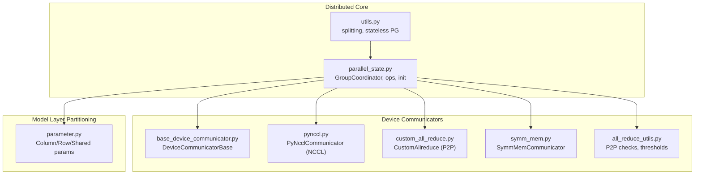
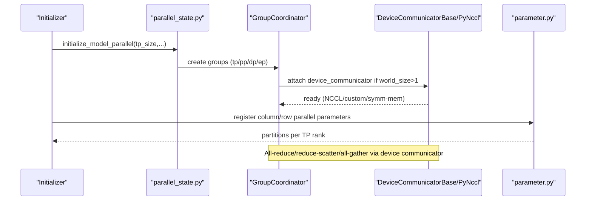
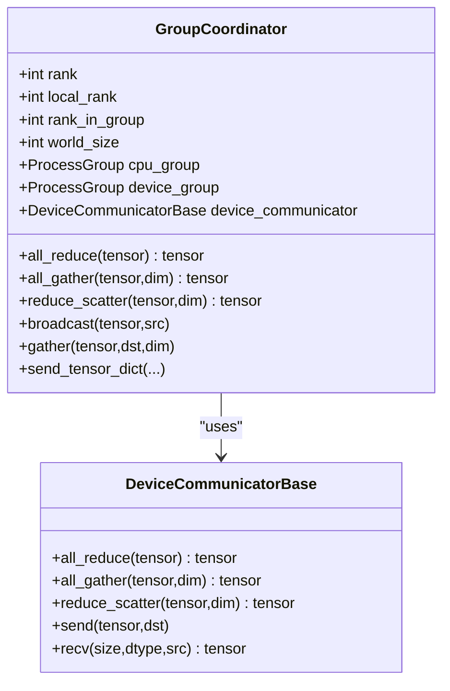
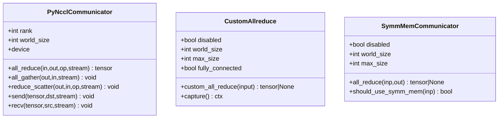
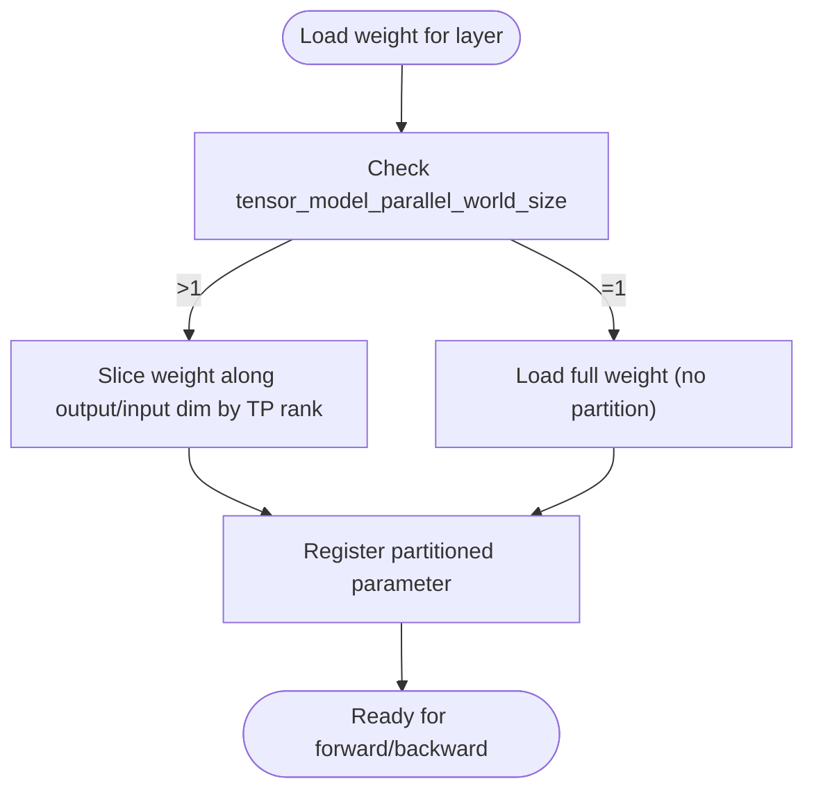
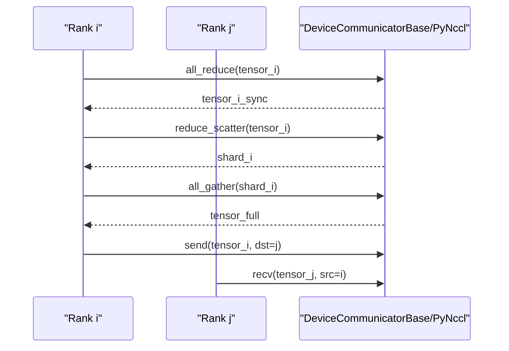
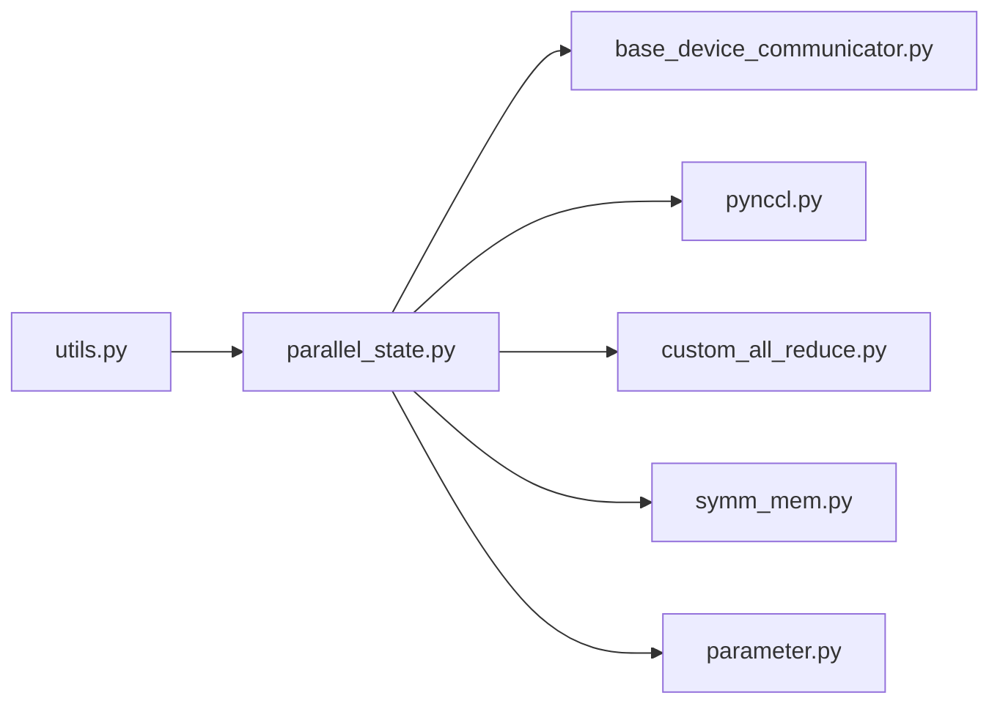

# Tensor Parallelism

<cite>
**Referenced Files in This Document**
- [parallel_state.py](file://vllm/distributed/parallel_state.py)
- [base_device_communicator.py](file://vllm/distributed/device_communicators/base_device_communicator.py)
- [pynccl.py](file://vllm/distributed/device_communicators/pynccl.py)
- [custom_all_reduce.py](file://vllm/distributed/device_communicators/custom_all_reduce.py)
- [all_reduce_utils.py](file://vllm/distributed/device_communicators/all_reduce_utils.py)
- [symm_mem.py](file://vllm/distributed/device_communicators/symm_mem.py)
- [parameter.py](file://vllm/model_executor/parameter.py)
- [utils.py](file://vllm/distributed/utils.py)
- [test_custom_all_reduce.py](file://tests/distributed/test_custom_all_reduce.py)
- [test_quick_all_reduce.py](file://tests/distributed/test_quick_all_reduce.py)
</cite>

## Table of Contents
1. [Introduction](#introduction)
2. [Project Structure](#project-structure)
3. [Core Components](#core-components)
4. [Architecture Overview](#architecture-overview)
5. [Detailed Component Analysis](#detailed-component-analysis)
6. [Dependency Analysis](#dependency-analysis)
7. [Performance Considerations](#performance-considerations)
8. [Troubleshooting Guide](#troubleshooting-guide)
9. [Conclusion](#conclusion)

## Introduction
This document explains tensor parallelism in vLLM, focusing on how model layers are partitioned across multiple GPUs, how gradients and activations are synchronized, and how communication is orchestrated. It covers the GroupCoordinator abstraction, device communicators (including NCCL-backed PyNcclCommunicator), and concrete examples from the codebase that show initialization, layer partitioning, and inter-process communication. It also discusses performance characteristics, memory usage patterns, and practical partitioning strategies for different model architectures and GPU configurations.

## Project Structure
Tensor parallelism in vLLM is implemented across several modules:
- Distributed state and group management: GroupCoordinator and related helpers
- Device communicators: NCCL-backed PyNcclCommunicator, custom allreduce, symmetric memory, and fallback base communicator
- Weight parameterization and partitioning: Column/row parallel weight loaders and partitioned parameters
- Utilities: Tensor splitting, process group utilities, and P2P capability checks

**Diagram sources**
- [parallel_state.py](file://vllm/distributed/parallel_state.py#L278-L800)
- [base_device_communicator.py](file://vllm/distributed/device_communicators/base_device_communicator.py#L92-L303)
- [pynccl.py](file://vllm/distributed/device_communicators/pynccl.py#L58-L205)
- [custom_all_reduce.py](file://vllm/distributed/device_communicators/custom_all_reduce.py#L51-L120)
- [symm_mem.py](file://vllm/distributed/device_communicators/symm_mem.py#L27-L116)
- [all_reduce_utils.py](file://vllm/distributed/device_communicators/all_reduce_utils.py#L30-L120)
- [parameter.py](file://vllm/model_executor/parameter.py#L129-L231)
- [utils.py](file://vllm/distributed/utils.py#L60-L93)

**Section sources**
- [parallel_state.py](file://vllm/distributed/parallel_state.py#L1254-L1470)
- [utils.py](file://vllm/distributed/utils.py#L60-L93)

## Core Components
- GroupCoordinator: Manages per-group process groups, device communicators, and exposes user-friendly collective operations (all_reduce, all_gather, reduce_scatter). It binds to CPU and device process groups and can attach a device communicator for optimized GPU-to-GPU operations.
- DeviceCommunicatorBase: Provides default implementations using torch.distributed primitives (all_reduce, all_gather, reduce_scatter) and supports send/recv and gather operations.
- PyNcclCommunicator: An NCCL-backed communicator that performs all_reduce, all_gather, reduce_scatter, and point-to-point send/recv directly via NCCL APIs. It initializes per-device communicators and warms them up.
- CustomAllreduce: A high-performance custom allreduce leveraging GPU P2P and shared buffers for intra-node allreduce on supported world sizes and architectures.
- SymmMemCommunicator: Uses PyTorch’s symmetric memory to perform allreduce without explicit copies for supported device capabilities and world sizes.
- Weight Parameterization: Column/row parallel weight loaders and partitioned parameters enable per-partition weight loading and slicing aligned with tensor model parallel ranks.

**Section sources**
- [parallel_state.py](file://vllm/distributed/parallel_state.py#L278-L800)
- [base_device_communicator.py](file://vllm/distributed/device_communicators/base_device_communicator.py#L135-L204)
- [pynccl.py](file://vllm/distributed/device_communicators/pynccl.py#L143-L181)
- [custom_all_reduce.py](file://vllm/distributed/device_communicators/custom_all_reduce.py#L248-L284)
- [symm_mem.py](file://vllm/distributed/device_communicators/symm_mem.py#L117-L157)
- [parameter.py](file://vllm/model_executor/parameter.py#L129-L231)

## Architecture Overview
The tensor parallel runtime orchestrates:
- Initialization of model-parallel groups (tensor, pipeline, data, expert)
- Selection of device communicator per rank (NCCL, custom allreduce, symmetric memory)
- Partitioning of linear layer weights along appropriate dimensions
- Synchronization of gradients and activation boundaries across tensor-parallel ranks

**Diagram sources**
- [parallel_state.py](file://vllm/distributed/parallel_state.py#L1278-L1430)
- [parallel_state.py](file://vllm/distributed/parallel_state.py#L480-L567)
- [base_device_communicator.py](file://vllm/distributed/device_communicators/base_device_communicator.py#L135-L204)
- [pynccl.py](file://vllm/distributed/device_communicators/pynccl.py#L143-L181)
- [parameter.py](file://vllm/model_executor/parameter.py#L129-L231)

## Detailed Component Analysis

### GroupCoordinator: Managing Tensor-Parallel Groups
- Creates per-group process groups (CPU and device) and selects a device communicator when world_size > 1.
- Exposes user-facing collective operations that route to device communicator implementations or PyTorch custom ops.
- Supports broadcast, gather, send/recv, and tensor dictionary broadcast for metadata and tensor slices.

Key responsibilities:
- Group creation and lifecycle
- Device communicator attachment and selection
- Graph capture integration for CUDA graphs

**Diagram sources**
- [parallel_state.py](file://vllm/distributed/parallel_state.py#L278-L800)
- [base_device_communicator.py](file://vllm/distributed/device_communicators/base_device_communicator.py#L135-L204)

**Section sources**
- [parallel_state.py](file://vllm/distributed/parallel_state.py#L278-L800)

### Device Communicators: NCCL, Custom Allreduce, Symmetric Memory
- PyNcclCommunicator: Initializes NCCL communicator per device, validates device affinity, and performs all_reduce/all_gather/reduce_scatter/send/recv. Includes warmup all_reduce to ensure lazy initialization readiness.
- CustomAllreduce: Enables fast intra-node allreduce using GPU P2P and shared buffers when supported by topology and device capability; integrates with CUDA graph capture.
- SymmMemCommunicator: Uses PyTorch symmetric memory to perform allreduce without copying for supported world sizes and device capabilities.

**Diagram sources**
- [pynccl.py](file://vllm/distributed/device_communicators/pynccl.py#L143-L205)
- [custom_all_reduce.py](file://vllm/distributed/device_communicators/custom_all_reduce.py#L248-L284)
- [symm_mem.py](file://vllm/distributed/device_communicators/symm_mem.py#L117-L157)

**Section sources**
- [pynccl.py](file://vllm/distributed/device_communicators/pynccl.py#L58-L181)
- [custom_all_reduce.py](file://vllm/distributed/device_communicators/custom_all_reduce.py#L51-L120)
- [symm_mem.py](file://vllm/distributed/device_communicators/symm_mem.py#L27-L116)

### Weight Distribution Strategies and Layer Partitioning
- Column parallel parameters: sliced along output dimension; each TP rank loads a contiguous shard of the weight matrix.
- Row parallel parameters: sliced along input dimension; each TP rank loads a contiguous shard.
- SharedWeightParameter: supports partitioned weights with shared underlying tensors keyed by data_key; used for certain transform-weight scenarios.

**Diagram sources**
- [parameter.py](file://vllm/model_executor/parameter.py#L129-L231)
- [parameter.py](file://vllm/model_executor/parameter.py#L467-L496)

**Section sources**
- [parameter.py](file://vllm/model_executor/parameter.py#L129-L231)
- [parameter.py](file://vllm/model_executor/parameter.py#L467-L496)

### Inter-Process Communication Patterns
- All-reduce: Used to synchronize gradients across tensor-parallel ranks (via device communicator).
- Reduce-scatter: Used to scatter reduced gradients across ranks (e.g., for optimizer states).
- All-gather: Used to reconstruct full tensors across ranks (e.g., for activation gathering).
- Point-to-point send/recv: Used for specialized inter-rank data movement.

**Diagram sources**
- [base_device_communicator.py](file://vllm/distributed/device_communicators/base_device_communicator.py#L135-L204)
- [pynccl.py](file://vllm/distributed/device_communicators/pynccl.py#L143-L205)

**Section sources**
- [base_device_communicator.py](file://vllm/distributed/device_communicators/base_device_communicator.py#L135-L204)
- [pynccl.py](file://vllm/distributed/device_communicators/pynccl.py#L143-L205)

### Concrete Examples from the Codebase
- Tensor parallel initialization and group creation:
  - [initialize_model_parallel(...)](file://vllm/distributed/parallel_state.py#L1278-L1430)
  - [ensure_model_parallel_initialized(...)](file://vllm/distributed/parallel_state.py#L1432-L1470)
- Weight partitioning during loading:
  - [load_column_parallel_weight(...)](file://vllm/model_executor/parameter.py#L148-L177)
  - [load_row_parallel_weight(...)](file://vllm/model_executor/parameter.py#L220-L231)
- Device communicator warmup and NCCL usage:
  - [PyNcclCommunicator.__init__ all_reduce warmup](file://vllm/distributed/device_communicators/pynccl.py#L143-L148)
  - [PyNcclCommunicator.all_reduce(...)](file://vllm/distributed/device_communicators/pynccl.py#L150-L181)
- Custom allreduce and P2P capability checks:
  - [CustomAllreduce.__init__ P2P and connectivity checks](file://vllm/distributed/device_communicators/custom_all_reduce.py#L90-L171)
  - [gpu_p2p_access_check(...)](file://vllm/distributed/device_communicators/all_reduce_utils.py#L266-L336)
- Tests demonstrating communicator warmup and independent group usage:
  - [test_custom_all_reduce warmup](file://tests/distributed/test_custom_all_reduce.py#L42-L58)
  - [test_quick_all_reduce warmup](file://tests/distributed/test_quick_all_reduce.py#L47-L63)

**Section sources**
- [parallel_state.py](file://vllm/distributed/parallel_state.py#L1278-L1470)
- [parameter.py](file://vllm/model_executor/parameter.py#L148-L231)
- [pynccl.py](file://vllm/distributed/device_communicators/pynccl.py#L143-L181)
- [custom_all_reduce.py](file://vllm/distributed/device_communicators/custom_all_reduce.py#L90-L171)
- [all_reduce_utils.py](file://vllm/distributed/device_communicators/all_reduce_utils.py#L266-L336)
- [test_custom_all_reduce.py](file://tests/distributed/test_custom_all_reduce.py#L42-L58)
- [test_quick_all_reduce.py](file://tests/distributed/test_quick_all_reduce.py#L47-L63)

## Dependency Analysis
- GroupCoordinator depends on:
  - Torch process groups (CPU and device)
  - Platform-specific device communicator selection
  - Optional message-queue broadcaster for CPU coordination
- DeviceCommunicatorBase depends on torch.distributed primitives and can be backed by:
  - PyNcclCommunicator (NCCL)
  - CustomAllreduce (P2P IPC buffers)
  - SymmMemCommunicator (symmetric memory)
- Weight parameterization depends on tensor model parallel rank/world size to compute shard offsets and shapes.

**Diagram sources**
- [parallel_state.py](file://vllm/distributed/parallel_state.py#L278-L800)
- [base_device_communicator.py](file://vllm/distributed/device_communicators/base_device_communicator.py#L135-L204)
- [pynccl.py](file://vllm/distributed/device_communicators/pynccl.py#L143-L181)
- [custom_all_reduce.py](file://vllm/distributed/device_communicators/custom_all_reduce.py#L248-L284)
- [symm_mem.py](file://vllm/distributed/device_communicators/symm_mem.py#L117-L157)
- [parameter.py](file://vllm/model_executor/parameter.py#L129-L231)
- [utils.py](file://vllm/distributed/utils.py#L60-L93)

**Section sources**
- [parallel_state.py](file://vllm/distributed/parallel_state.py#L278-L800)
- [base_device_communicator.py](file://vllm/distributed/device_communicators/base_device_communicator.py#L135-L204)
- [pynccl.py](file://vllm/distributed/device_communicators/pynccl.py#L143-L181)
- [custom_all_reduce.py](file://vllm/distributed/device_communicators/custom_all_reduce.py#L248-L284)
- [symm_mem.py](file://vllm/distributed/device_communicators/symm_mem.py#L117-L157)
- [parameter.py](file://vllm/model_executor/parameter.py#L129-L231)
- [utils.py](file://vllm/distributed/utils.py#L60-L93)

## Performance Considerations
- Device communicator selection:
  - NCCL-backed PyNcclCommunicator is used when available and device communicators are enabled.
  - CustomAllreduce leverages GPU P2P and shared buffers for intra-node allreduce on supported world sizes and device capabilities.
  - SymmMemCommunicator uses symmetric memory to avoid explicit copies for supported configurations.
- P2P and topology:
  - P2P capability is validated via actual IPC access checks; cache is used to avoid repeated expensive checks.
  - Fully-connected NVLink/XGMI topologies enable higher-performance paths.
- Warmup:
  - Device communicators perform a small all_reduce warmup to ensure lazy initialization readiness for CUDA graph capture.
- Contiguity and alignment:
  - Custom allreduce requires input tensors to be properly aligned and contiguous for best performance.

Practical partitioning strategies:
- Prefer column/row parallel splits aligned with the model’s linear layers (QKV, MLP, output projections).
- Ensure output dimension splits for column-parallel layers and input dimension splits for row-parallel layers.
- For models with fused operations (e.g., QKV), ensure shard offsets account for packing/tile sizes when applicable.

**Section sources**
- [all_reduce_utils.py](file://vllm/distributed/device_communicators/all_reduce_utils.py#L30-L120)
- [custom_all_reduce.py](file://vllm/distributed/device_communicators/custom_all_reduce.py#L248-L284)
- [symm_mem.py](file://vllm/distributed/device_communicators/symm_mem.py#L117-L157)
- [pynccl.py](file://vllm/distributed/device_communicators/pynccl.py#L143-L148)
- [parameter.py](file://vllm/model_executor/parameter.py#L148-L231)

## Troubleshooting Guide
Common issues and diagnostics:
- NCCL device mismatch: Ensure tensors are moved to the device bound to the communicator; mismatches cause illegal memory access errors.
- P2P disabled or unreliable: Use the built-in P2P capability checks and cache; if P2P fails, custom allreduce falls back to NCCL.
- CUDA graph capture: Warmup all_reduce ensures communicators are ready; tests demonstrate warmup usage.
- Symmetric memory not available: SymmMemCommunicator disables itself gracefully when not supported by device or configuration.

Helpful references:
- [PyNcclCommunicator assertion for device affinity](file://vllm/distributed/device_communicators/pynccl.py#L160-L166)
- [P2P capability checks and caching](file://vllm/distributed/device_communicators/all_reduce_utils.py#L266-L336)
- [Warmup all_reduce in PyNcclCommunicator](file://vllm/distributed/device_communicators/pynccl.py#L143-L148)
- [Warmup all_reduce in tests](file://tests/distributed/test_custom_all_reduce.py#L42-L58)
- [Warmup all_reduce in tests](file://tests/distributed/test_quick_all_reduce.py#L47-L63)

**Section sources**
- [pynccl.py](file://vllm/distributed/device_communicators/pynccl.py#L160-L166)
- [all_reduce_utils.py](file://vllm/distributed/device_communicators/all_reduce_utils.py#L266-L336)
- [test_custom_all_reduce.py](file://tests/distributed/test_custom_all_reduce.py#L42-L58)
- [test_quick_all_reduce.py](file://tests/distributed/test_quick_all_reduce.py#L47-L63)

## Conclusion
vLLM’s tensor parallelism is built around a clear separation of concerns:
- GroupCoordinator encapsulates group management and exposes unified collective operations.
- Device communicators provide high-performance, backend-specific implementations (NCCL, custom allreduce, symmetric memory).
- Weight parameterization cleanly separates partitioning logic from model execution.
Together, these components enable scalable, efficient multi-GPU training and inference with robust fallbacks and diagnostics.