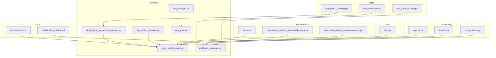
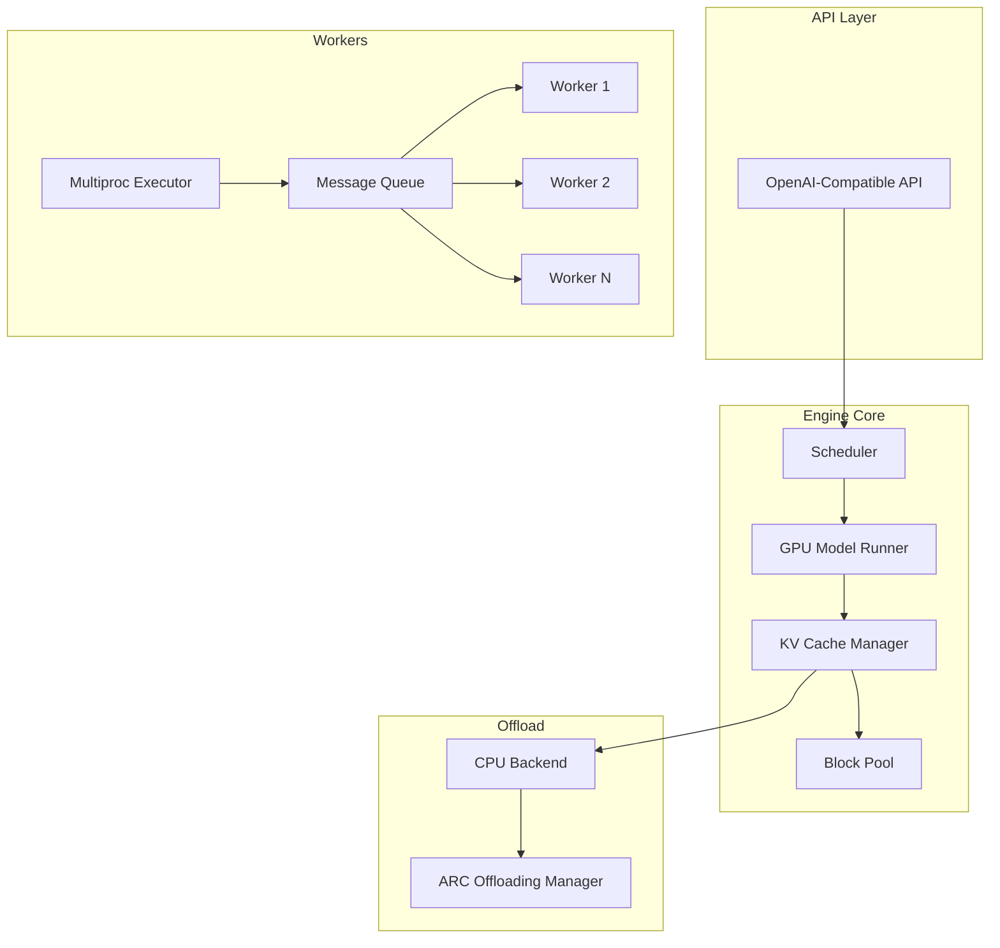
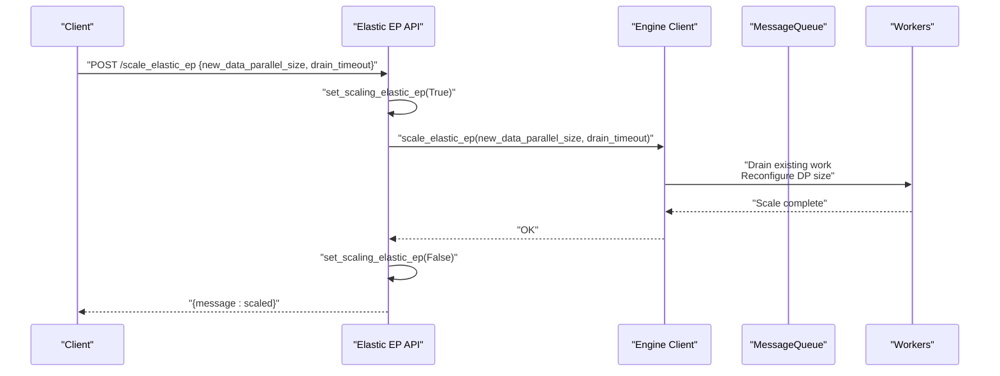
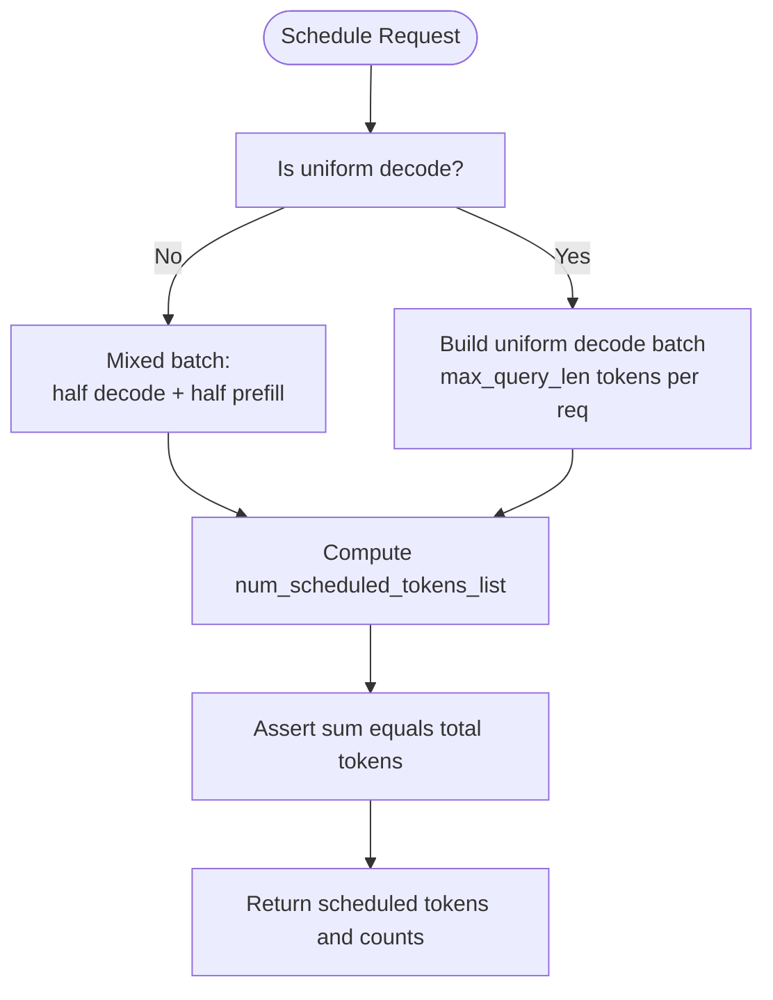
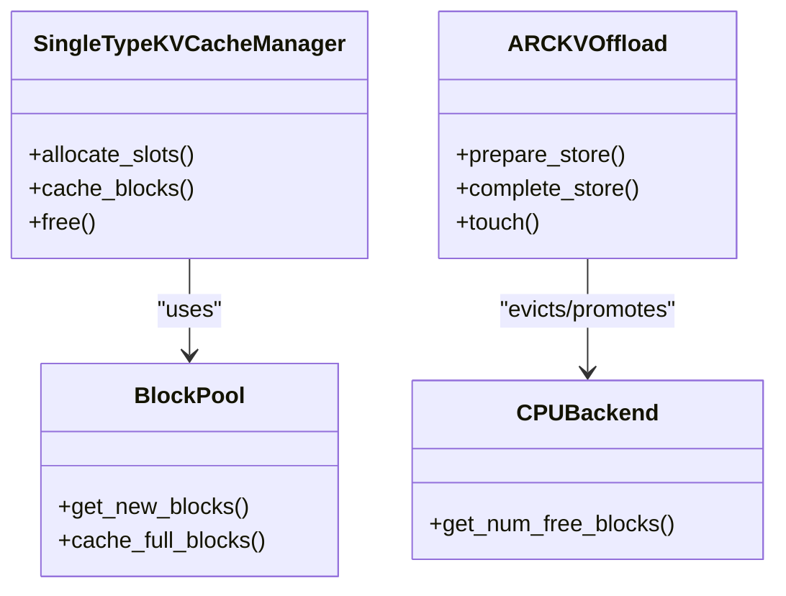
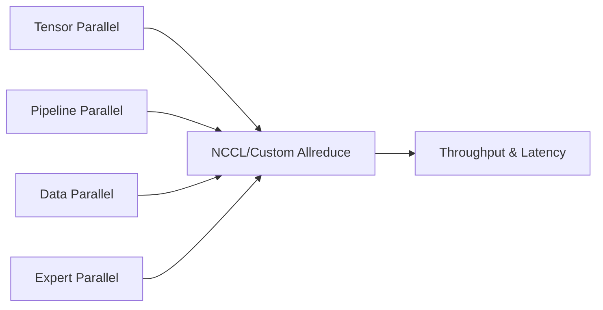
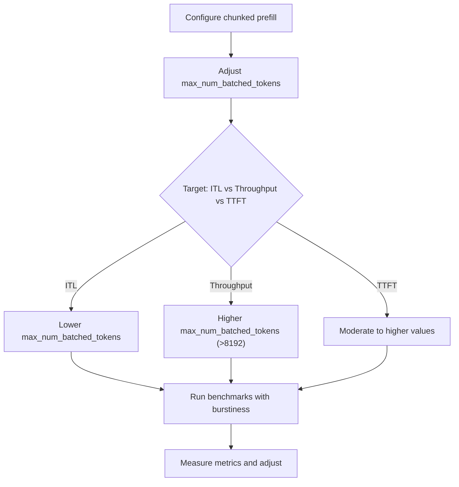
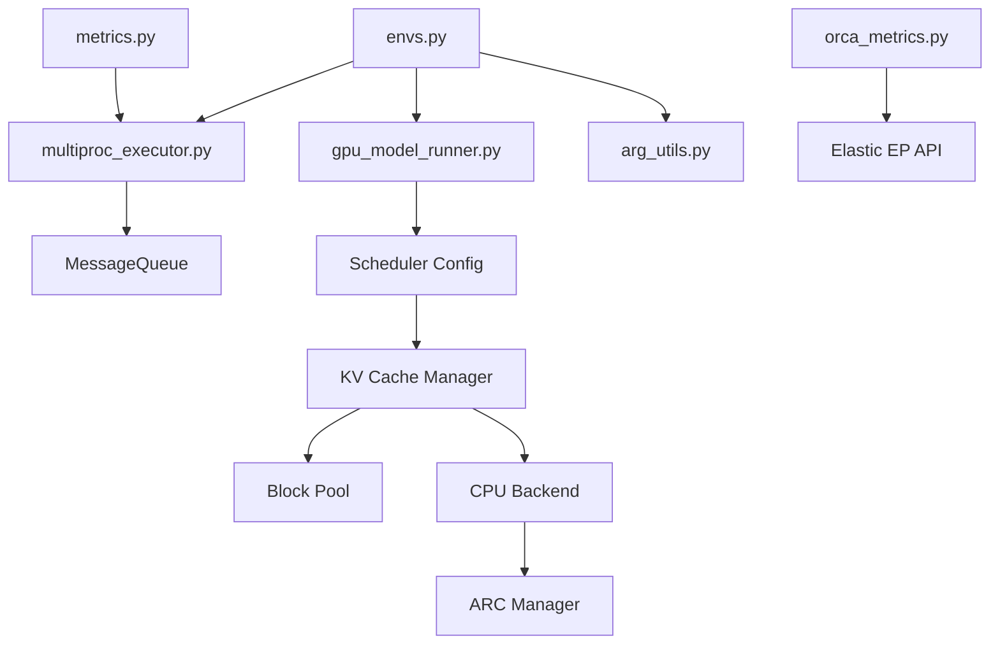

# Scaling and Optimization

<cite>
**Referenced Files in This Document**
- [envs.py](file://vllm/envs.py)
- [optimization.md](file://docs/configuration/optimization.md)
- [parallelism_scaling.md](file://docs/serving/parallelism_scaling.md)
- [serve.py](file://vllm/benchmarks/serve.py)
- [benchmark_serving_structured_output.py](file://benchmarks/benchmark_serving_structured_output.py)
- [gpu_model_runner.py](file://vllm/v1/worker/gpu_model_runner.py)
- [single_type_kv_cache_manager.py](file://vllm/v1/core/single_type_kv_cache_manager.py)
- [kv_cache_manager.py](file://vllm/v1/core/kv_cache_manager.py)
- [cpu_gpu.py](file://vllm/v1/kv_offload/worker/cpu_gpu.py)
- [arc_manager.py](file://vllm/v1/kv_offload/arc_manager.py)
- [test_prefix_caching.py](file://tests/v1/core/test_prefix_caching.py)
- [test_scheduler.py](file://tests/v1/core/test_scheduler.py)
- [arg_utils.py](file://vllm/engine/arg_utils.py)
- [api_router.py](file://vllm/entrypoints/serve/elastic_ep/api_router.py)
- [multiproc_executor.py](file://vllm/v1/executor/multiproc_executor.py)
- [benchmark_device_communicators.py](file://benchmarks/kernels/benchmark_device_communicators.py)
- [metrics.py](file://vllm/v1/metrics/ray_wrappers.py)
- [orca_metrics.py](file://vllm/entrypoints/openai/orca_metrics.py)
- [pynvml.py](file://vllm/third_party/pynvml.py)
- [test_shm_storage.py](file://tests/distributed/test_shm_storage.py)
</cite>

## Table of Contents
1. [Introduction](#introduction)
2. [Project Structure](#project-structure)
3. [Core Components](#core-components)
4. [Architecture Overview](#architecture-overview)
5. [Detailed Component Analysis](#detailed-component-analysis)
6. [Dependency Analysis](#dependency-analysis)
7. [Performance Considerations](#performance-considerations)
8. [Troubleshooting Guide](#troubleshooting-guide)
9. [Conclusion](#conclusion)
10. [Appendices](#appendices)

## Introduction
This document provides a comprehensive guide to scaling and optimization strategies for distributed vLLM deployments. It focuses on horizontal scaling patterns, worker pool management, load balancing, dynamic scaling, memory optimization (KV cache sharing, block pooling, offloading), performance tuning (communication optimization, batch consolidation, adaptive scheduling), and practical configuration examples. It also covers monitoring key metrics and optimizing for different workload patterns (burst scaling, steady-state, cost-effective scaling), network bandwidth optimization, storage tiering, and resource utilization tracking.

## Project Structure
The repository organizes scaling and optimization concerns across configuration guides, environment variables, runtime components, and benchmarking utilities:
- Configuration and tuning guides define recommended strategies and tunables.
- Environment variables expose runtime knobs for distributed execution, memory, and performance.
- Core runtime components implement KV cache management, scheduling, and worker orchestration.
- Benchmarks and tests quantify performance characteristics and validate scaling behaviors.

**Diagram sources**
- [optimization.md](file://docs/configuration/optimization.md#L1-L289)
- [parallelism_scaling.md](file://docs/serving/parallelism_scaling.md#L1-L221)
- [envs.py](file://vllm/envs.py#L448-L800)
- [gpu_model_runner.py](file://vllm/v1/worker/gpu_model_runner.py#L4072-L4121)
- [single_type_kv_cache_manager.py](file://vllm/v1/core/single_type_kv_cache_manager.py#L134-L175)
- [kv_cache_manager.py](file://vllm/v1/core/kv_cache_manager.py#L237-L260)
- [cpu_gpu.py](file://vllm/v1/kv_offload/worker/cpu_gpu.py#L76-L98)
- [arc_manager.py](file://vllm/v1/kv_offload/arc_manager.py#L39-L64)
- [multiproc_executor.py](file://vllm/v1/executor/multiproc_executor.py#L127-L166)
- [serve.py](file://vllm/benchmarks/serve.py#L178-L236)
- [benchmark_serving_structured_output.py](file://benchmarks/benchmark_serving_structured_output.py#L292-L309)
- [benchmark_device_communicators.py](file://benchmarks/kernels/benchmark_device_communicators.py#L85-L341)
- [metrics.py](file://vllm/v1/metrics/ray_wrappers.py#L74-L112)
- [orca_metrics.py](file://vllm/entrypoints/openai/orca_metrics.py#L43-L79)
- [pynvml.py](file://vllm/third_party/pynvml.py#L5571-L5582)
- [test_prefix_caching.py](file://tests/v1/core/test_prefix_caching.py#L779-L868)
- [test_scheduler.py](file://tests/v1/core/test_scheduler.py#L571-L613)
- [test_shm_storage.py](file://tests/distributed/test_shm_storage.py#L112-L138)

**Section sources**
- [optimization.md](file://docs/configuration/optimization.md#L1-L289)
- [parallelism_scaling.md](file://docs/serving/parallelism_scaling.md#L1-L221)
- [envs.py](file://vllm/envs.py#L448-L800)

## Core Components
This section highlights the core runtime components that enable scaling and optimization:
- KV cache management: block pooling, allocation, caching, and freeing.
- Offloading and replacement: adaptive replacement cache (ARC) for CPU offload.
- Worker orchestration: multiprocess executor and message queue management for distributed workers.
- Scheduling and batching: adaptive scheduling policies and batch consolidation strategies.
- Communication and parallelism: environment-driven parallelism strategies and communication backends.

Key implementation references:
- KV cache allocation and caching: [single_type_kv_cache_manager.py](file://vllm/v1/core/single_type_kv_cache_manager.py#L134-L175)
- KV cache layout and block management: [kv_cache_manager.py](file://vllm/v1/core/kv_cache_manager.py#L237-L260)
- CPU-GPU KV transfer and block factors: [cpu_gpu.py](file://vllm/v1/kv_offload/worker/cpu_gpu.py#L76-L98)
- ARC offloading manager: [arc_manager.py](file://vllm/v1/kv_offload/arc_manager.py#L39-L64)
- Multiprocess worker creation and MQ: [multiproc_executor.py](file://vllm/v1/executor/multiproc_executor.py#L127-L166)
- Scheduling and batch composition: [gpu_model_runner.py](file://vllm/v1/worker/gpu_model_runner.py#L4072-L4121)
- Argument-driven defaults for batching: [arg_utils.py](file://vllm/engine/arg_utils.py#L1956-L1991)

**Section sources**
- [single_type_kv_cache_manager.py](file://vllm/v1/core/single_type_kv_cache_manager.py#L134-L175)
- [kv_cache_manager.py](file://vllm/v1/core/kv_cache_manager.py#L237-L260)
- [cpu_gpu.py](file://vllm/v1/kv_offload/worker/cpu_gpu.py#L76-L98)
- [arc_manager.py](file://vllm/v1/kv_offload/arc_manager.py#L39-L64)
- [multiproc_executor.py](file://vllm/v1/executor/multiproc_executor.py#L127-L166)
- [gpu_model_runner.py](file://vllm/v1/worker/gpu_model_runner.py#L4072-L4121)
- [arg_utils.py](file://vllm/engine/arg_utils.py#L1956-L1991)

## Architecture Overview
The distributed vLLM architecture integrates parallelism strategies, worker orchestration, and adaptive scheduling to support scalable serving. The following diagram maps key components and their interactions:

**Diagram sources**
- [multiproc_executor.py](file://vllm/v1/executor/multiproc_executor.py#L127-L166)
- [gpu_model_runner.py](file://vllm/v1/worker/gpu_model_runner.py#L4072-L4121)
- [single_type_kv_cache_manager.py](file://vllm/v1/core/single_type_kv_cache_manager.py#L134-L175)
- [arc_manager.py](file://vllm/v1/kv_offload/arc_manager.py#L39-L64)

## Detailed Component Analysis

### Horizontal Scaling Patterns and Worker Pool Management
- Worker pool orchestration: The multiprocess executor initializes workers per local rank and coordinates message queues for inter-process communication. It sets up broadcast MQ handles and manages worker lifecycle locks.
- Dynamic scaling: Elastic endpoint exposes a scaling API to adjust data parallel size with drain timeouts to safely transition workloads.

**Diagram sources**
- [api_router.py](file://vllm/entrypoints/serve/elastic_ep/api_router.py#L48-L96)
- [multiproc_executor.py](file://vllm/v1/executor/multiproc_executor.py#L127-L166)

**Section sources**
- [multiproc_executor.py](file://vllm/v1/executor/multiproc_executor.py#L127-L166)
- [api_router.py](file://vllm/entrypoints/serve/elastic_ep/api_router.py#L48-L96)

### Load Balancing and Adaptive Scheduling
- Scheduling policy: The model runner constructs mixed batches with decode and prefill tokens, adapting to uniform decode scenarios and mixed workloads. It computes scheduled token lists and request counts based on configured limits.
- Batch consolidation: The scheduler supports concurrent batch scheduling and respects max_num_batched_tokens and max_num_seqs constraints.

**Diagram sources**
- [gpu_model_runner.py](file://vllm/v1/worker/gpu_model_runner.py#L4072-L4121)
- [arg_utils.py](file://vllm/engine/arg_utils.py#L1956-L1991)
- [test_scheduler.py](file://tests/v1/core/test_scheduler.py#L571-L613)

**Section sources**
- [gpu_model_runner.py](file://vllm/v1/worker/gpu_model_runner.py#L4072-L4121)
- [arg_utils.py](file://vllm/engine/arg_utils.py#L1956-L1991)
- [test_scheduler.py](file://tests/v1/core/test_scheduler.py#L571-L613)

### Memory Optimization: KV Cache Sharing, Block Pooling, and Offloading
- Block pooling and allocation: The single-type KV cache manager allocates new blocks when required and caches full blocks to the block pool, tracking cached block counts per request.
- Prefix caching correctness: Unit tests demonstrate correct caching of full blocks and multi-group caching behavior.
- Offloading and replacement: The ARC manager implements adaptive replacement with T1/T2 lists and ghost buffers, self-tuning the recency vs frequency trade-off.
- CPU-GPU transfer: KV transfer utilities define source/destination tensors, block size factors, and priorities for efficient movement.

**Diagram sources**
- [single_type_kv_cache_manager.py](file://vllm/v1/core/single_type_kv_cache_manager.py#L134-L175)
- [kv_cache_manager.py](file://vllm/v1/core/kv_cache_manager.py#L237-L260)
- [arc_manager.py](file://vllm/v1/kv_offload/arc_manager.py#L39-L64)
- [cpu_gpu.py](file://vllm/v1/kv_offload/worker/cpu_gpu.py#L76-L98)
- [test_prefix_caching.py](file://tests/v1/core/test_prefix_caching.py#L779-L868)

**Section sources**
- [single_type_kv_cache_manager.py](file://vllm/v1/core/single_type_kv_cache_manager.py#L134-L175)
- [kv_cache_manager.py](file://vllm/v1/core/kv_cache_manager.py#L237-L260)
- [arc_manager.py](file://vllm/v1/kv_offload/arc_manager.py#L39-L64)
- [cpu_gpu.py](file://vllm/v1/kv_offload/worker/cpu_gpu.py#L76-L98)
- [test_prefix_caching.py](file://tests/v1/core/test_prefix_caching.py#L779-L868)

### Communication Optimization and Parallelism Strategies
- Parallelism strategies: Tensor, pipeline, data, and expert parallelism are configurable and combinable. Network optimization guidance includes InfiniBand and GPUDirect RDMA.
- Device communicators: Benchmark utilities compare custom allreduce and PyNccl communicators, reporting speedups and initialization diagnostics.
- Environment-driven settings: Numerous environment variables control parallelism, communication channels, and overlap behavior.

**Diagram sources**
- [parallelism_scaling.md](file://docs/serving/parallelism_scaling.md#L1-L221)
- [benchmark_device_communicators.py](file://benchmarks/kernels/benchmark_device_communicators.py#L85-L341)
- [envs.py](file://vllm/envs.py#L448-L800)

**Section sources**
- [parallelism_scaling.md](file://docs/serving/parallelism_scaling.md#L1-L221)
- [benchmark_device_communicators.py](file://benchmarks/kernels/benchmark_device_communicators.py#L85-L341)
- [envs.py](file://vllm/envs.py#L448-L800)

### Performance Tuning and Workload Patterns
- Chunked prefill and scheduling: The configuration guide recommends enabling chunked prefill and tuning max_num_batched_tokens for latency, throughput, and TTFT trade-offs.
- Burst scaling and ramp-up: Benchmark utilities support gamma-distributed inter-arrival times and ramp-up strategies to emulate realistic or bursty loads.
- Goodput and SLO tracking: Benchmark scripts compute goodput against SLO targets for TTFT, TPOT, and end-to-end latency.

**Diagram sources**
- [optimization.md](file://docs/configuration/optimization.md#L1-L289)
- [serve.py](file://vllm/benchmarks/serve.py#L178-L236)
- [benchmark_serving_structured_output.py](file://benchmarks/benchmark_serving_structured_output.py#L292-L309)

**Section sources**
- [optimization.md](file://docs/configuration/optimization.md#L1-L289)
- [serve.py](file://vllm/benchmarks/serve.py#L178-L236)
- [benchmark_serving_structured_output.py](file://benchmarks/benchmark_serving_structured_output.py#L292-L309)

## Dependency Analysis
This section maps dependencies among scaling-related components and highlights coupling and cohesion:
- Multiproc executor depends on environment-provided distributed init method and message queue configuration.
- GPU model runner depends on scheduler configuration defaults and environment-driven parallelism settings.
- KV cache manager relies on block pool and hashing utilities; ARC manager depends on CPU backend.
- Monitoring wrappers integrate with Ray metrics and OpenAI-compatible headers.

**Diagram sources**
- [envs.py](file://vllm/envs.py#L448-L800)
- [multiproc_executor.py](file://vllm/v1/executor/multiproc_executor.py#L127-L166)
- [gpu_model_runner.py](file://vllm/v1/worker/gpu_model_runner.py#L4072-L4121)
- [arg_utils.py](file://vllm/engine/arg_utils.py#L1956-L1991)
- [single_type_kv_cache_manager.py](file://vllm/v1/core/single_type_kv_cache_manager.py#L134-L175)
- [arc_manager.py](file://vllm/v1/kv_offload/arc_manager.py#L39-L64)
- [metrics.py](file://vllm/v1/metrics/ray_wrappers.py#L74-L112)
- [orca_metrics.py](file://vllm/entrypoints/openai/orca_metrics.py#L43-L79)

**Section sources**
- [envs.py](file://vllm/envs.py#L448-L800)
- [multiproc_executor.py](file://vllm/v1/executor/multiproc_executor.py#L127-L166)
- [gpu_model_runner.py](file://vllm/v1/worker/gpu_model_runner.py#L4072-L4121)
- [arg_utils.py](file://vllm/engine/arg_utils.py#L1956-L1991)
- [single_type_kv_cache_manager.py](file://vllm/v1/core/single_type_kv_cache_manager.py#L134-L175)
- [arc_manager.py](file://vllm/v1/kv_offload/arc_manager.py#L39-L64)
- [metrics.py](file://vllm/v1/metrics/ray_wrappers.py#L74-L112)
- [orca_metrics.py](file://vllm/entrypoints/openai/orca_metrics.py#L43-L79)

## Performance Considerations
- Parallelism selection: Choose tensor, pipeline, data, and expert parallelism combinations aligned with model size and hardware topology. Prefer pipeline parallelism for uneven splits and when NVLink is unavailable.
- Communication optimization: Use high-speed interconnects (e.g., InfiniBand) and enable GPUDirect RDMA for efficient cross-node transfers. Validate NCCL configuration and channel types.
- Batch consolidation: Tune max_num_batched_tokens and max_num_seqs to balance ITL, TTFT, and throughput. Enable chunked prefill to co-locate compute-bound and memory-bound requests.
- Memory efficiency: Utilize block pooling, prefix caching, and ARC-based offloading to maximize cache hit rates and reduce recomputation.
- Monitoring: Track named metrics via Prometheus and OpenAI-compatible headers to drive operational decisions.

[No sources needed since this section provides general guidance]

## Troubleshooting Guide
Common issues and remedies:
- Out-of-memory and preemption: Increase gpu_memory_utilization, reduce max_num_seqs or max_num_batched_tokens, or increase tensor/pipeline parallel sizes. Monitor preemption metrics.
- Communication bottlenecks: Verify NCCL configuration, channel types, and RDMA setup. Benchmark device communicators to identify slow paths.
- Distributed connectivity: Ensure VLLM_HOST_IP uniqueness per node and proper firewall/security settings. Confirm Ray cluster health and node visibility.
- IPC and shared memory: Validate shared memory mounts and SHM sizes for cross-node communication.

**Section sources**
- [optimization.md](file://docs/configuration/optimization.md#L1-L289)
- [parallelism_scaling.md](file://docs/serving/parallelism_scaling.md#L155-L221)
- [benchmark_device_communicators.py](file://benchmarks/kernels/benchmark_device_communicators.py#L85-L341)
- [test_shm_storage.py](file://tests/distributed/test_shm_storage.py#L112-L138)

## Conclusion
Effective scaling and optimization in distributed vLLM require coordinated strategies across worker orchestration, adaptive scheduling, memory management, and communication. By leveraging environment-driven parallelism, block pooling, prefix caching, and ARC offloading, operators can achieve high throughput and low latency. Monitoring and benchmarking enable continuous tuning for burst scaling, steady-state optimization, and cost-effective resource utilization.

[No sources needed since this section summarizes without analyzing specific files]

## Appendices

### Practical Configuration Examples and Tuning Parameters
- Parallelism and scaling:
  - Single-node tensor parallel: [parallelism_scaling.md](file://docs/serving/parallelism_scaling.md#L29-L58)
  - Multi-node pipeline and tensor parallel: [parallelism_scaling.md](file://docs/serving/parallelism_scaling.md#L116-L132)
  - Network optimization and GPUDirect RDMA: [parallelism_scaling.md](file://docs/serving/parallelism_scaling.md#L155-L215)
- Memory tuning:
  - Chunked prefill and max_num_batched_tokens: [optimization.md](file://docs/configuration/optimization.md#L30-L80)
  - KV cache sizing and concurrency estimates: [parallelism_scaling.md](file://docs/serving/parallelism_scaling.md#L13-L21)
- Workload emulation:
  - Gamma-distributed inter-arrival and ramp-up: [serve.py](file://vllm/benchmarks/serve.py#L178-L236), [benchmark_serving_structured_output.py](file://benchmarks/benchmark_serving_structured_output.py#L292-L309)
- Monitoring:
  - Named metrics via Prometheus and OpenAI headers: [metrics.py](file://vllm/v1/metrics/ray_wrappers.py#L74-L112), [orca_metrics.py](file://vllm/entrypoints/openai/orca_metrics.py#L43-L79)
  - GPU metrics identifiers: [pynvml.py](file://vllm/third_party/pynvml.py#L5571-L5582)

**Section sources**
- [parallelism_scaling.md](file://docs/serving/parallelism_scaling.md#L13-L21)
- [parallelism_scaling.md](file://docs/serving/parallelism_scaling.md#L116-L132)
- [parallelism_scaling.md](file://docs/serving/parallelism_scaling.md#L155-L215)
- [optimization.md](file://docs/configuration/optimization.md#L30-L80)
- [serve.py](file://vllm/benchmarks/serve.py#L178-L236)
- [benchmark_serving_structured_output.py](file://benchmarks/benchmark_serving_structured_output.py#L292-L309)
- [metrics.py](file://vllm/v1/metrics/ray_wrappers.py#L74-L112)
- [orca_metrics.py](file://vllm/entrypoints/openai/orca_metrics.py#L43-L79)
- [pynvml.py](file://vllm/third_party/pynvml.py#L5571-L5582)