# Advanced Offline Features

<cite>
**Referenced Files in This Document**
- [async_llm_streaming.py](file://examples/offline_inference/async_llm_streaming.py)
- [batch_llm_inference.py](file://examples/offline_inference/batch_llm_inference.py)
- [prefix_caching.py](file://examples/offline_inference/prefix_caching.py)
- [spec_decode.py](file://examples/offline_inference/spec_decode.py)
- [multilora_inference.py](file://examples/offline_inference/multilora_inference.py)
- [structured_outputs.py](file://examples/offline_inference/structured_outputs.py)
- [chat_with_tools.py](file://examples/offline_inference/chat_with_tools.py)
- [logits_process.py](file://vllm/logits_process.py)
- [custom_logitsprocs.md](file://docs/features/custom_logitsprocs.md)
- [conserving_memory.md](file://docs/configuration/conserving_memory.md)
- [optimization.md](file://docs/configuration/optimization.md)
- [llm.py](file://vllm/entrypoints/llm.py)
- [llm_engine_example.py](file://examples/offline_inference/llm_engine_example.py)
- [gpu_input_batch.py](file://vllm/v1/worker/gpu/input_batch.py)
- [states.py](file://vllm/v1/worker/gpu/states.py)
- [suffix_decoding.py](file://vllm/v1/spec_decode/suffix_decoding.py)
</cite>

## Table of Contents
1. [Introduction](#introduction)
2. [Project Structure](#project-structure)
3. [Core Components](#core-components)
4. [Architecture Overview](#architecture-overview)
5. [Detailed Component Analysis](#detailed-component-analysis)
6. [Dependency Analysis](#dependency-analysis)
7. [Performance Considerations](#performance-considerations)
8. [Troubleshooting Guide](#troubleshooting-guide)
9. [Conclusion](#conclusion)
10. [Appendices](#appendices)

## Introduction
This document presents advanced offline inference features in vLLM, focusing on asynchronous streaming, batch processing, prefix caching, speculative decoding, multi-LoRA inference, structured outputs, and tool calling. It explains implementation patterns for high-throughput scenarios, memory optimization strategies, and performance tuning. It also documents advanced configuration options, custom logits processors, and specialized inference workflows, with practical examples and troubleshooting guidance.

## Project Structure
The repository organizes advanced offline features across:
- Examples for offline inference workflows (streaming, batching, prefix caching, spec decode, multi-LoRA, structured outputs, tool calling)
- Core libraries for logits processing and sampling
- Documentation for configuration, optimization, and memory conservation
- V1 engine internals supporting streaming, batching, and speculative decoding

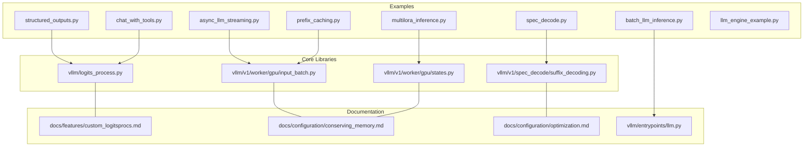

**Diagram sources**
- [async_llm_streaming.py](file://examples/offline_inference/async_llm_streaming.py#L1-L112)
- [batch_llm_inference.py](file://examples/offline_inference/batch_llm_inference.py#L1-L94)
- [prefix_caching.py](file://examples/offline_inference/prefix_caching.py#L1-L99)
- [spec_decode.py](file://examples/offline_inference/spec_decode.py#L1-L235)
- [multilora_inference.py](file://examples/offline_inference/multilora_inference.py#L1-L107)
- [structured_outputs.py](file://examples/offline_inference/structured_outputs.py#L1-L114)
- [chat_with_tools.py](file://examples/offline_inference/chat_with_tools.py#L1-L148)
- [logits_process.py](file://vllm/logits_process.py#L1-L122)
- [custom_logitsprocs.md](file://docs/features/custom_logitsprocs.md#L94-L469)
- [conserving_memory.md](file://docs/configuration/conserving_memory.md#L1-L186)
- [optimization.md](file://docs/configuration/optimization.md#L21-L32)
- [llm.py](file://vllm/entrypoints/llm.py#L161-L188)
- [llm_engine_example.py](file://examples/offline_inference/llm_engine_example.py#L1-L75)
- [gpu_input_batch.py](file://vllm/v1/worker/gpu/input_batch.py#L82-L110)
- [states.py](file://vllm/v1/worker/gpu/states.py#L71-L99)
- [suffix_decoding.py](file://vllm/v1/spec_decode/suffix_decoding.py#L32-L60)

**Section sources**
- [async_llm_streaming.py](file://examples/offline_inference/async_llm_streaming.py#L1-L112)
- [batch_llm_inference.py](file://examples/offline_inference/batch_llm_inference.py#L1-L94)
- [prefix_caching.py](file://examples/offline_inference/prefix_caching.py#L1-L99)
- [spec_decode.py](file://examples/offline_inference/spec_decode.py#L1-L235)
- [multilora_inference.py](file://examples/offline_inference/multilora_inference.py#L1-L107)
- [structured_outputs.py](file://examples/offline_inference/structured_outputs.py#L1-L114)
- [chat_with_tools.py](file://examples/offline_inference/chat_with_tools.py#L1-L148)
- [logits_process.py](file://vllm/logits_process.py#L1-L122)
- [custom_logitsprocs.md](file://docs/features/custom_logitsprocs.md#L94-L469)
- [conserving_memory.md](file://docs/configuration/conserving_memory.md#L1-L186)
- [optimization.md](file://docs/configuration/optimization.md#L21-L32)
- [llm.py](file://vllm/entrypoints/llm.py#L161-L188)
- [llm_engine_example.py](file://examples/offline_inference/llm_engine_example.py#L1-L75)
- [gpu_input_batch.py](file://vllm/v1/worker/gpu/input_batch.py#L82-L110)
- [states.py](file://vllm/v1/worker/gpu/states.py#L71-L99)
- [suffix_decoding.py](file://vllm/v1/spec_decode/suffix_decoding.py#L32-L60)

## Core Components
- Asynchronous streaming: Demonstrated via the AsyncLLM engine with delta output kind for token-by-token streaming.
- Batch processing: Ray Data integration for continuous batching and data-parallel inference.
- Prefix caching: Shared KV-cache reuse across prompts with identical prefixes.
- Speculative decoding: Multiple proposer methods (ngram, eagle, eagle3, mtp) with metrics reporting.
- Multi-LoRA inference: Engine-level LoRA support with configurable ranks and CPU caches.
- Structured outputs: Choice, regex, JSON schema, and grammar constraints for deterministic formats.
- Tool calling: Function/tool definitions with multi-turn chat orchestration.
- Custom logits processors: Extensible logits manipulation pipeline with validation and batch-aware updates.

**Section sources**
- [async_llm_streaming.py](file://examples/offline_inference/async_llm_streaming.py#L1-L112)
- [batch_llm_inference.py](file://examples/offline_inference/batch_llm_inference.py#L1-L94)
- [prefix_caching.py](file://examples/offline_inference/prefix_caching.py#L1-L99)
- [spec_decode.py](file://examples/offline_inference/spec_decode.py#L1-L235)
- [multilora_inference.py](file://examples/offline_inference/multilora_inference.py#L1-L107)
- [structured_outputs.py](file://examples/offline_inference/structured_outputs.py#L1-L114)
- [chat_with_tools.py](file://examples/offline_inference/chat_with_tools.py#L1-L148)
- [logits_process.py](file://vllm/logits_process.py#L1-L122)
- [custom_logitsprocs.md](file://docs/features/custom_logitsprocs.md#L94-L469)

## Architecture Overview
The advanced offline features are integrated through:
- Entry points for offline inference (LLM, AsyncLLM, LLMEngine)
- Worker and V1 engine internals for batching, KV cache management, and speculative decoding
- Logging and metrics for performance monitoring
- Configuration surfaces for memory, attention, and compilation

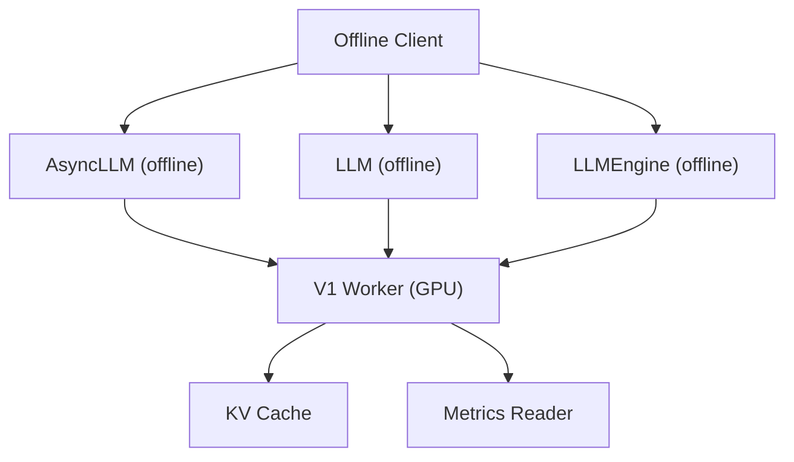

**Diagram sources**
- [llm.py](file://vllm/entrypoints/llm.py#L161-L188)
- [async_llm_streaming.py](file://examples/offline_inference/async_llm_streaming.py#L1-L112)
- [llm_engine_example.py](file://examples/offline_inference/llm_engine_example.py#L1-L75)
- [gpu_input_batch.py](file://vllm/v1/worker/gpu/input_batch.py#L82-L110)
- [states.py](file://vllm/v1/worker/gpu/states.py#L71-L99)

## Detailed Component Analysis

### Asynchronous Streaming
Asynchronous streaming enables token-by-token generation with delta output kind. The example demonstrates:
- Creating SamplingParams with delta output kind
- Iterating over the async generator
- Handling finished flags to detect completion

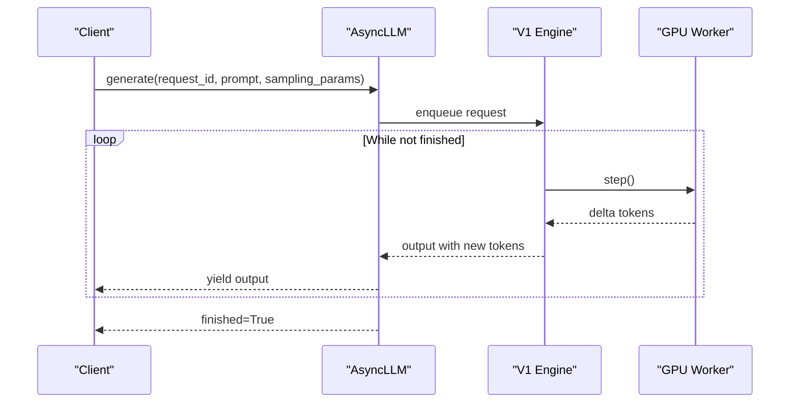

**Diagram sources**
- [async_llm_streaming.py](file://examples/offline_inference/async_llm_streaming.py#L22-L64)
- [gpu_input_batch.py](file://vllm/v1/worker/gpu/input_batch.py#L82-L110)

**Section sources**
- [async_llm_streaming.py](file://examples/offline_inference/async_llm_streaming.py#L1-L112)
- [gpu_input_batch.py](file://vllm/v1/worker/gpu/input_batch.py#L82-L110)

### Batch Processing with Ray Data
Continuous batching and data-parallel inference are demonstrated with Ray Data:
- Dataset ingestion and schema inspection
- vLLM engine processor configuration with chunked prefill and concurrency
- Pre/post-processing hooks for structured prompts and outputs
- Streaming execution and optional writes to cloud storage

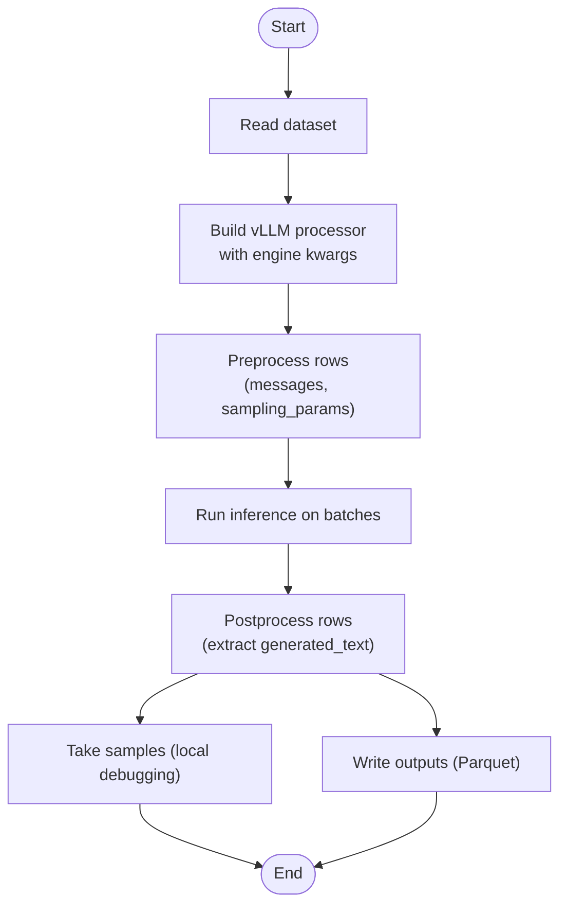

**Diagram sources**
- [batch_llm_inference.py](file://examples/offline_inference/batch_llm_inference.py#L1-L94)

**Section sources**
- [batch_llm_inference.py](file://examples/offline_inference/batch_llm_inference.py#L1-L94)

### Prefix Caching
Prefix caching reuses shared KV-cache across prompts with identical prefixes:
- Baseline generation without prefix caching
- Cleanup and warmup with prefix caching enabled
- Verification of identical outputs and observed speedup

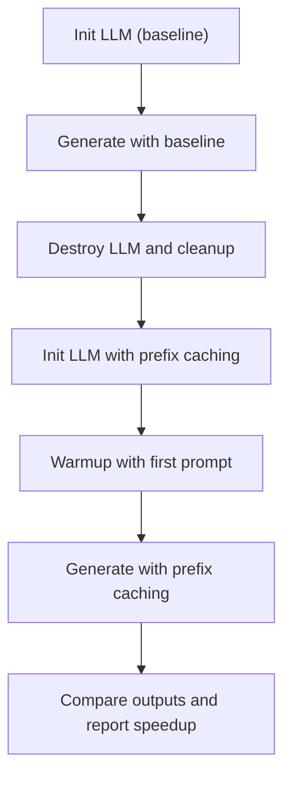

**Diagram sources**
- [prefix_caching.py](file://examples/offline_inference/prefix_caching.py#L1-L99)

**Section sources**
- [prefix_caching.py](file://examples/offline_inference/prefix_caching.py#L1-L99)

### Speculative Decoding
Speculative decoding accelerates generation by proposing multiple tokens ahead of acceptance:
- Configurable proposer methods (ngram, eagle, eagle3, mtp)
- Metrics collection for drafts, accepted tokens, and acceptance length per position
- Optional multimodal prompts and chunked prefill

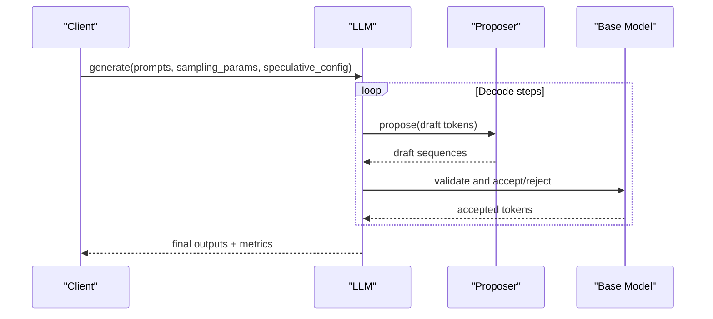

**Diagram sources**
- [spec_decode.py](file://examples/offline_inference/spec_decode.py#L1-L235)
- [suffix_decoding.py](file://vllm/v1/spec_decode/suffix_decoding.py#L32-L60)

**Section sources**
- [spec_decode.py](file://examples/offline_inference/spec_decode.py#L1-L235)
- [suffix_decoding.py](file://vllm/v1/spec_decode/suffix_decoding.py#L32-L60)

### Multi-LoRA Inference
Multi-LoRA inference supports multiple adapters with configurable ranks and CPU caches:
- EngineArgs enabling LoRA with max_loras, max_lora_rank, and max_cpu_loras
- Request scheduling with LoRARequest per prompt
- Step-based processing and completion detection

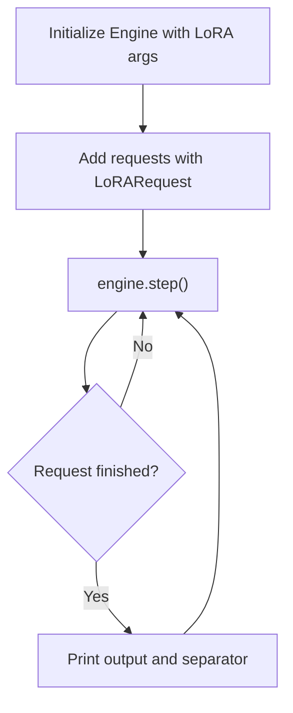

**Diagram sources**
- [multilora_inference.py](file://examples/offline_inference/multilora_inference.py#L1-L107)
- [states.py](file://vllm/v1/worker/gpu/states.py#L71-L99)

**Section sources**
- [multilora_inference.py](file://examples/offline_inference/multilora_inference.py#L1-L107)
- [states.py](file://vllm/v1/worker/gpu/states.py#L71-L99)

### Structured Outputs
Structured outputs constrain generation to specific formats:
- Choice constraints (discrete options)
- Regex constraints (stop and max_tokens)
- JSON schema constraints (Pydantic)
- Grammar constraints (EBNF-style)

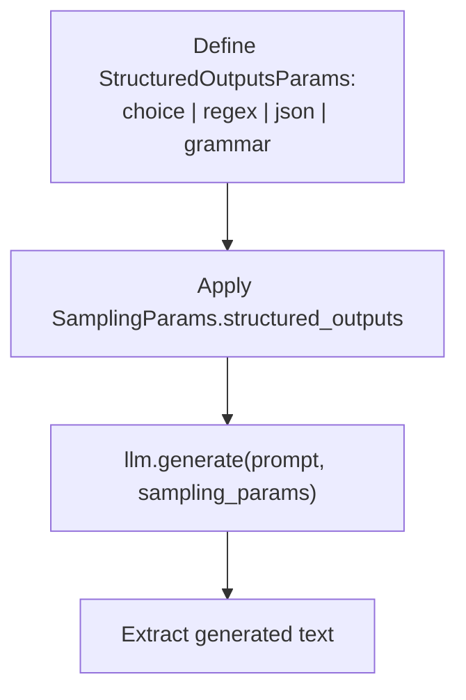

**Diagram sources**
- [structured_outputs.py](file://examples/offline_inference/structured_outputs.py#L1-L114)

**Section sources**
- [structured_outputs.py](file://examples/offline_inference/structured_outputs.py#L1-L114)

### Tool Calling
Tool calling orchestrates function/tool use with multi-turn chat:
- Define tools with function signatures
- Chat with tools to produce tool-callable responses
- Parse tool calls, execute functions, and append tool results for refinement

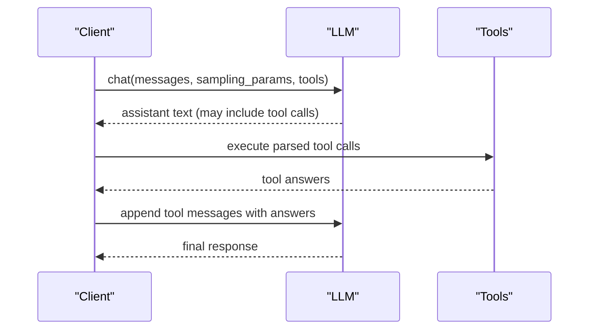

**Diagram sources**
- [chat_with_tools.py](file://examples/offline_inference/chat_with_tools.py#L1-L148)

**Section sources**
- [chat_with_tools.py](file://examples/offline_inference/chat_with_tools.py#L1-L148)

### Custom Logits Processors
Custom logits processors enable request-specific token masking and biasing:
- Define a LogitsProcessor subclass with validate_params, update_state, and apply
- Integrate via build_logitsprocs and custom_logitsprocs configuration
- Batch-aware optimizations and argmax invariance considerations

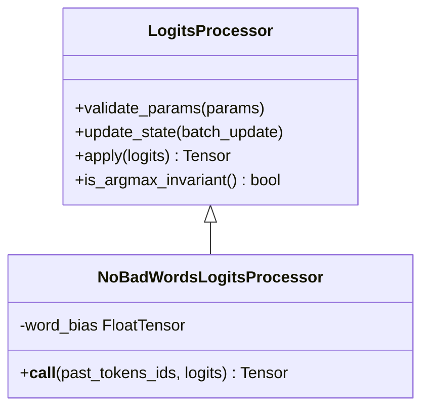

**Diagram sources**
- [logits_process.py](file://vllm/logits_process.py#L1-L122)
- [custom_logitsprocs.md](file://docs/features/custom_logitsprocs.md#L94-L469)

**Section sources**
- [logits_process.py](file://vllm/logits_process.py#L1-L122)
- [custom_logitsprocs.md](file://docs/features/custom_logitsprocs.md#L94-L469)

## Dependency Analysis
Key dependencies and relationships:
- Streaming relies on AsyncLLM and V1 worker batching structures
- Batch processing integrates with Ray Data and engine kwargs
- Prefix caching depends on shared KV-cache management
- Speculative decoding depends on proposer implementations and metrics
- Multi-LoRA depends on engine args and LoRA state arrays
- Structured outputs depend on SamplingParams and structured output params
- Tool calling depends on chat APIs and tool definitions
- Custom logits processors depend on build_logitsprocs and platform support

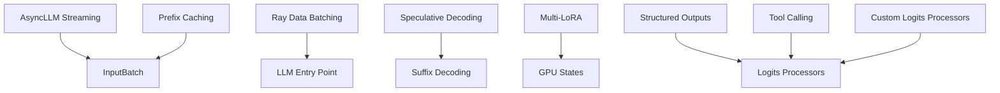

**Diagram sources**
- [async_llm_streaming.py](file://examples/offline_inference/async_llm_streaming.py#L1-L112)
- [batch_llm_inference.py](file://examples/offline_inference/batch_llm_inference.py#L1-L94)
- [prefix_caching.py](file://examples/offline_inference/prefix_caching.py#L1-L99)
- [spec_decode.py](file://examples/offline_inference/spec_decode.py#L1-L235)
- [multilora_inference.py](file://examples/offline_inference/multilora_inference.py#L1-L107)
- [structured_outputs.py](file://examples/offline_inference/structured_outputs.py#L1-L114)
- [chat_with_tools.py](file://examples/offline_inference/chat_with_tools.py#L1-L148)
- [logits_process.py](file://vllm/logits_process.py#L1-L122)
- [gpu_input_batch.py](file://vllm/v1/worker/gpu/input_batch.py#L82-L110)
- [states.py](file://vllm/v1/worker/gpu/states.py#L71-L99)
- [suffix_decoding.py](file://vllm/v1/spec_decode/suffix_decoding.py#L32-L60)
- [llm.py](file://vllm/entrypoints/llm.py#L161-L188)

**Section sources**
- [gpu_input_batch.py](file://vllm/v1/worker/gpu/input_batch.py#L82-L110)
- [states.py](file://vllm/v1/worker/gpu/states.py#L71-L99)
- [suffix_decoding.py](file://vllm/v1/spec_decode/suffix_decoding.py#L32-L60)
- [llm.py](file://vllm/entrypoints/llm.py#L161-L188)

## Performance Considerations
- Throughput and latency tuning:
  - Increase gpu_memory_utilization to expand KV cache capacity
  - Adjust max_num_seqs and max_num_batched_tokens to balance memory and concurrency
  - Use tensor_parallel_size and pipeline_parallel_size judiciously to manage memory and latency
  - Enable chunked prefill to balance prefill and decode workloads
- Monitoring:
  - Track preemption requests and throughput capacity via Prometheus metrics
  - Use disable_log_stats to log cumulative preemption counts
- Compilation and memory:
  - Tune compilation_config and consider enforce_eager to balance speed and memory usage
  - Reduce CUDA graph capture sizes for memory-constrained environments
- Multi-modal memory:
  - Limit multi-modal items per prompt and configure mm_processor_kwargs to profile and reserve memory appropriately

**Section sources**
- [optimization.md](file://docs/configuration/optimization.md#L21-L32)
- [conserving_memory.md](file://docs/configuration/conserving_memory.md#L1-L186)

## Troubleshooting Guide
Common issues and resolutions:
- Out-of-memory (OOM):
  - Reduce max_model_len, max_num_seqs, or enable tensor parallelism
  - Use enforce_eager or reduce compilation graph sizes
  - Limit multi-modal inputs via limit_mm_per_prompt and mm_processor_kwargs
- Excessive preemptions:
  - Lower concurrency or increase gpu_memory_utilization
  - Monitor preemption metrics and adjust workload distribution
- LoRA scheduling conflicts:
  - Set max_loras according to available memory and expected concurrency
  - Ensure max_lora_rank matches adapter ranks to avoid oversized allocations
- Structured output mismatches:
  - Verify regex and JSON schema constraints align with model capabilities
  - Use stop tokens and max_tokens to bound generation
- Tool calling failures:
  - Validate tool definitions and ensure required parameters are present
  - Re-run with refined tool results appended as tool messages

**Section sources**
- [conserving_memory.md](file://docs/configuration/conserving_memory.md#L1-L186)
- [multilora_inference.py](file://examples/offline_inference/multilora_inference.py#L1-L107)
- [structured_outputs.py](file://examples/offline_inference/structured_outputs.py#L1-L114)
- [chat_with_tools.py](file://examples/offline_inference/chat_with_tools.py#L1-L148)

## Conclusion
vLLM’s advanced offline features provide a comprehensive toolkit for high-throughput, memory-efficient inference. Asynchronous streaming, continuous batching, prefix caching, speculative decoding, multi-LoRA, structured outputs, and tool calling can be combined with careful configuration and monitoring to achieve strong performance. Custom logits processors offer extensibility for specialized inference workflows.

## Appendices
- Practical examples:
  - Streaming: [async_llm_streaming.py](file://examples/offline_inference/async_llm_streaming.py#L1-L112)
  - Batching: [batch_llm_inference.py](file://examples/offline_inference/batch_llm_inference.py#L1-L94)
  - Prefix caching: [prefix_caching.py](file://examples/offline_inference/prefix_caching.py#L1-L99)
  - Speculative decoding: [spec_decode.py](file://examples/offline_inference/spec_decode.py#L1-L235)
  - Multi-LoRA: [multilora_inference.py](file://examples/offline_inference/multilora_inference.py#L1-L107)
  - Structured outputs: [structured_outputs.py](file://examples/offline_inference/structured_outputs.py#L1-L114)
  - Tool calling: [chat_with_tools.py](file://examples/offline_inference/chat_with_tools.py#L1-L148)
  - Engine-level usage: [llm_engine_example.py](file://examples/offline_inference/llm_engine_example.py#L1-L75)
- Core internals:
  - Input batching: [gpu_input_batch.py](file://vllm/v1/worker/gpu/input_batch.py#L82-L110)
  - GPU states: [states.py](file://vllm/v1/worker/gpu/states.py#L71-L99)
  - Speculative suffix decoding: [suffix_decoding.py](file://vllm/v1/spec_decode/suffix_decoding.py#L32-L60)
  - Logits processors: [logits_process.py](file://vllm/logits_process.py#L1-L122)
- Documentation:
  - Custom logits processors: [custom_logitsprocs.md](file://docs/features/custom_logitsprocs.md#L94-L469)
  - Memory conservation: [conserving_memory.md](file://docs/configuration/conserving_memory.md#L1-L186)
  - Optimization: [optimization.md](file://docs/configuration/optimization.md#L21-L32)
  - Offline entry points: [llm.py](file://vllm/entrypoints/llm.py#L161-L188)