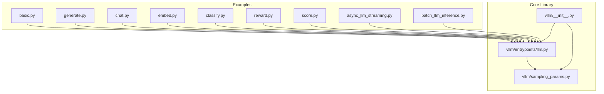
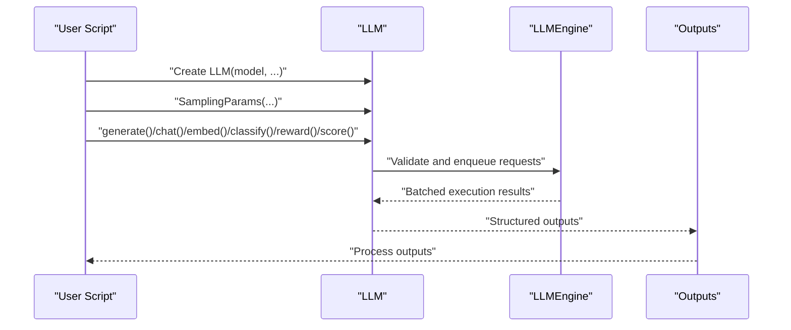
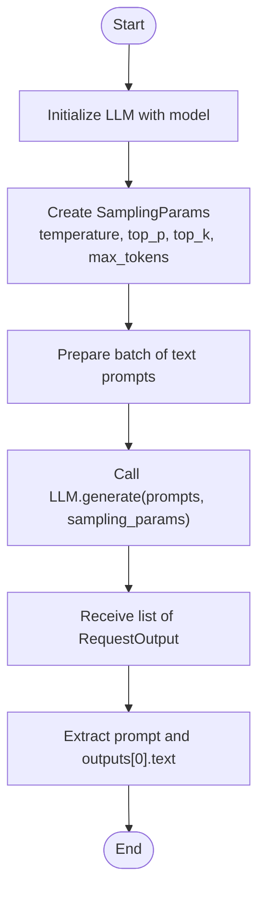
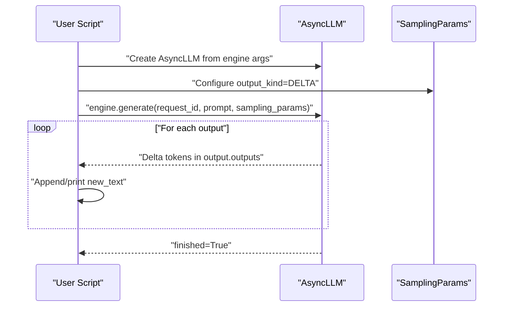
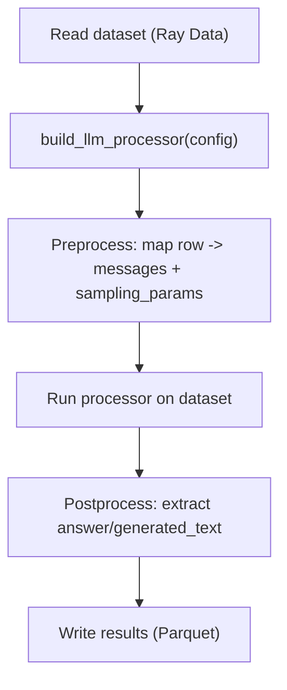
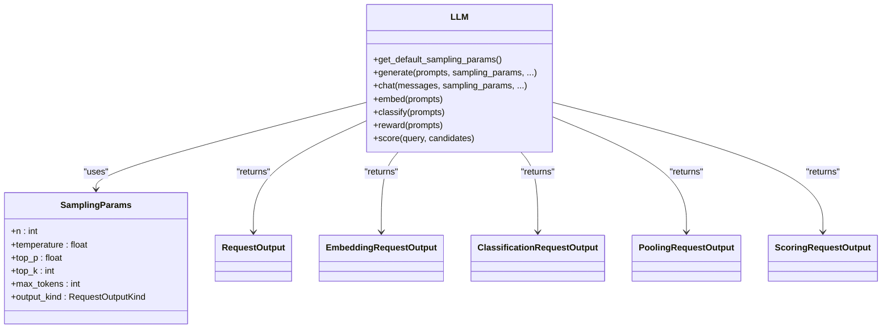

# Basic Offline Inference Examples

<cite>
**Referenced Files in This Document**
- [README.md](file://examples/offline_inference/basic/README.md)
- [basic.py](file://examples/offline_inference/basic/basic.py)
- [generate.py](file://examples/offline_inference/basic/generate.py)
- [chat.py](file://examples/offline_inference/basic/chat.py)
- [embed.py](file://examples/offline_inference/basic/embed.py)
- [classify.py](file://examples/offline_inference/basic/classify.py)
- [reward.py](file://examples/offline_inference/basic/reward.py)
- [score.py](file://examples/offline_inference/basic/score.py)
- [async_llm_streaming.py](file://examples/offline_inference/async_llm_streaming.py)
- [batch_llm_inference.py](file://examples/offline_inference/batch_llm_inference.py)
- [llm.py](file://vllm/entrypoints/llm.py)
- [sampling_params.py](file://vllm/sampling_params.py)
- [__init__.py](file://vllm/__init__.py)
</cite>

## Table of Contents
1. [Introduction](#introduction)
2. [Project Structure](#project-structure)
3. [Core Components](#core-components)
4. [Architecture Overview](#architecture-overview)
5. [Detailed Component Analysis](#detailed-component-analysis)
6. [Dependency Analysis](#dependency-analysis)
7. [Performance Considerations](#performance-considerations)
8. [Troubleshooting Guide](#troubleshooting-guide)
9. [Conclusion](#conclusion)
10. [Appendices](#appendices)

## Introduction
This document presents basic offline inference examples using vLLM. It focuses on fundamental usage patterns for text generation, chat interactions, embeddings, classification, reward modeling, and scoring. You will learn how to initialize models, configure generation parameters, handle different input types, process various output formats, enable batch processing, and stream results. Practical walkthroughs emphasize best practices and performance optimization techniques for common inference scenarios.

## Project Structure
The examples covered here reside under the offline inference examples directory and demonstrate the LLM class usage and related APIs. The core LLM class and sampling parameters are implemented in the vLLM package.

**Diagram sources**
- [basic.py](file://examples/offline_inference/basic/basic.py#L1-L36)
- [generate.py](file://examples/offline_inference/basic/generate.py#L1-L66)
- [chat.py](file://examples/offline_inference/basic/chat.py#L1-L97)
- [embed.py](file://examples/offline_inference/basic/embed.py#L1-L60)
- [classify.py](file://examples/offline_inference/basic/classify.py#L1-L53)
- [reward.py](file://examples/offline_inference/basic/reward.py#L1-L54)
- [score.py](file://examples/offline_inference/basic/score.py#L1-L56)
- [async_llm_streaming.py](file://examples/offline_inference/async_llm_streaming.py#L1-L112)
- [batch_llm_inference.py](file://examples/offline_inference/batch_llm_inference.py#L1-L94)
- [llm.py](file://vllm/entrypoints/llm.py#L93-L435)
- [sampling_params.py](file://vllm/sampling_params.py#L111-L233)
- [__init__.py](file://vllm/__init__.py#L16-L107)

**Section sources**
- [README.md](file://examples/offline_inference/basic/README.md#L1-L81)
- [llm.py](file://vllm/entrypoints/llm.py#L93-L435)
- [sampling_params.py](file://vllm/sampling_params.py#L111-L233)
- [__init__.py](file://vllm/__init__.py#L16-L107)

## Core Components
- LLM class: Provides the primary Python interface for offline inference. It encapsulates a tokenizer, language model, and KV cache, and performs intelligent batching and memory management.
- SamplingParams: Encapsulates generation configuration such as temperature, top-p, top-k, max tokens, stop criteria, and streaming output kind.
- Output types: Different tasks return distinct output wrappers (e.g., RequestOutput for generation, EmbeddingRequestOutput for embeddings, ClassificationRequestOutput for classification, PoolingRequestOutput for reward scoring, ScoringRequestOutput for cross-encoder scoring).

Key responsibilities:
- Initialization and configuration of the model and engine.
- Batched generation and chat preprocessing.
- Embedding, classification, reward, and scoring workflows.
- Streaming and progress reporting controls.

**Section sources**
- [llm.py](file://vllm/entrypoints/llm.py#L93-L435)
- [sampling_params.py](file://vllm/sampling_params.py#L111-L233)
- [__init__.py](file://vllm/__init__.py#L16-L107)

## Architecture Overview
The offline inference flow centers around the LLM class, which validates inputs, constructs sampling parameters, and routes requests to the underlying engine. For streaming, the AsyncLLM engine exposes token-by-token delta updates.

**Diagram sources**
- [llm.py](file://vllm/entrypoints/llm.py#L358-L435)
- [sampling_params.py](file://vllm/sampling_params.py#L111-L233)
- [__init__.py](file://vllm/__init__.py#L16-L107)

## Detailed Component Analysis

### Text Generation
- Purpose: Generate continuations for text prompts.
- Typical usage:
  - Initialize LLM with a generative model.
  - Create SamplingParams with desired generation settings.
  - Call generate() with a list of prompts.
  - Iterate over RequestOutput to extract prompt and generated text.

Best practices:
- Pass all prompts in a single batch to maximize throughput.
- Use use_tqdm to monitor progress for large batches.
- Configure max_tokens, temperature, top_p, top_k appropriately.

**Diagram sources**
- [basic.py](file://examples/offline_inference/basic/basic.py#L1-L36)
- [generate.py](file://examples/offline_inference/basic/generate.py#L1-L66)
- [llm.py](file://vllm/entrypoints/llm.py#L365-L435)
- [sampling_params.py](file://vllm/sampling_params.py#L111-L233)

**Section sources**
- [basic.py](file://examples/offline_inference/basic/basic.py#L1-L36)
- [generate.py](file://examples/offline_inference/basic/generate.py#L1-L66)
- [llm.py](file://vllm/entrypoints/llm.py#L365-L435)
- [sampling_params.py](file://vllm/sampling_params.py#L111-L233)

### Chat Interactions
- Purpose: Perform conversational inference using chat templates.
- Typical usage:
  - Prepare a conversation list of message dicts (role/content).
  - Optionally supply a custom chat template.
  - Call chat() with sampling parameters.
  - Supports batched conversations with progress indication.

Notes:
- The LLM class preprocesses chat inputs and converts them to token prompts internally.
- Batch inference is supported; use tqdm to observe progress.

**Section sources**
- [chat.py](file://examples/offline_inference/basic/chat.py#L1-L97)
- [llm.py](file://vllm/entrypoints/llm.py#L769-L800)

### Embeddings
- Purpose: Compute dense vector representations for text prompts.
- Typical usage:
  - Initialize LLM with a pooling-capable model and runner="pooling".
  - Call embed() with a list of prompts.
  - Access outputs.embedding from EmbeddingRequestOutput.

Optimization:
- Use enforce_eager for simpler setups when prototyping.
- On ROCm, adjust attention backend if needed.

**Section sources**
- [embed.py](file://examples/offline_inference/basic/embed.py#L1-L60)
- [llm.py](file://vllm/entrypoints/llm.py#L93-L188)

### Classification
- Purpose: Obtain class probabilities for classification tasks.
- Typical usage:
  - Initialize LLM with a pooling-capable model and runner="pooling".
  - Call classify() with prompts.
  - Access outputs.probs from ClassificationRequestOutput.

**Section sources**
- [classify.py](file://examples/offline_inference/basic/classify.py#L1-L53)
- [llm.py](file://vllm/entrypoints/llm.py#L93-L188)

### Reward Modeling
- Purpose: Score sequences using reward models.
- Typical usage:
  - Initialize LLM with a reward model and runner="pooling".
  - Call reward() with prompts.
  - Access outputs.data from PoolingRequestOutput.

**Section sources**
- [reward.py](file://examples/offline_inference/basic/reward.py#L1-L54)
- [llm.py](file://vllm/entrypoints/llm.py#L93-L188)

### Scoring (Cross-Encoder)
- Purpose: Compute relevance scores between a query and multiple candidates.
- Typical usage:
  - Initialize LLM with a cross-encoder model and runner="pooling".
  - Call score(query, candidates).
  - Access outputs.score from ScoringRequestOutput.

**Section sources**
- [score.py](file://examples/offline_inference/basic/score.py#L1-L56)
- [llm.py](file://vllm/entrypoints/llm.py#L93-L188)

### Streaming Offline Inference (AsyncLLM)
- Purpose: Receive token-by-token deltas during generation.
- Typical usage:
  - Initialize AsyncLLM with AsyncEngineArgs.
  - Create SamplingParams with output_kind=DELTA.
  - Iterate over engine.generate() to process new tokens as they arrive.
  - Use finished flag to detect completion.

**Diagram sources**
- [async_llm_streaming.py](file://examples/offline_inference/async_llm_streaming.py#L1-L112)
- [sampling_params.py](file://vllm/sampling_params.py#L102-L109)

**Section sources**
- [async_llm_streaming.py](file://examples/offline_inference/async_llm_streaming.py#L1-L112)
- [sampling_params.py](file://vllm/sampling_params.py#L102-L109)

### Batch Processing with Ray Data
- Purpose: Scale offline inference on large datasets with continuous batching and fault tolerance.
- Typical usage:
  - Build a Ray Dataset from text files.
  - Configure vLLM engine via build_llm_processor with engine_kwargs and batch_size.
  - Preprocess rows to messages and sampling_params; postprocess to extract generated_text.
  - Execute processor and write results to Parquet.

**Diagram sources**
- [batch_llm_inference.py](file://examples/offline_inference/batch_llm_inference.py#L1-L94)

**Section sources**
- [batch_llm_inference.py](file://examples/offline_inference/batch_llm_inference.py#L1-L94)

## Dependency Analysis
The LLM class aggregates engine configuration and delegates execution to the underlying engine. SamplingParams defines the generation behavior and output kind. The public API surface exposes LLM, SamplingParams, and output types.

**Diagram sources**
- [llm.py](file://vllm/entrypoints/llm.py#L358-L435)
- [sampling_params.py](file://vllm/sampling_params.py#L111-L233)
- [__init__.py](file://vllm/__init__.py#L16-L107)

**Section sources**
- [llm.py](file://vllm/entrypoints/llm.py#L358-L435)
- [sampling_params.py](file://vllm/sampling_params.py#L111-L233)
- [__init__.py](file://vllm/__init__.py#L16-L107)

## Performance Considerations
- Batch sizing:
  - Group all prompts into a single call to generate() for optimal batching.
  - For pooling tasks, batch prompts to embed/classify/reward/score for throughput.
- Memory and KV cache:
  - Adjust gpu_memory_utilization and kv_cache_memory_bytes to fit larger contexts.
  - Consider cpu_offload_gb for models exceeding GPU memory, noting CPU-GPU bandwidth trade-offs.
- Quantization and dtype:
  - Use appropriate quantization and dtype to balance quality and speed.
- Attention backend:
  - On ROCm, select attention backend suitable for stability and performance.
- Streaming:
  - Use RequestOutputKind.DELTA for token-by-token streaming to reduce latency.
- Progress and monitoring:
  - Enable use_tqdm for long-running batch jobs to track progress.
- Engine configuration:
  - For Ray Data batch inference, tune concurrency and batch_size to saturate GPUs.

[No sources needed since this section provides general guidance]

## Troubleshooting Guide
Common issues and resolutions:
- Wrong runner option:
  - Embedding/classification/reward/scoring require runner="pooling". Using generate() on pooling models raises an error.
- Invalid LoRA request length:
  - When providing LoRA requests for beam search, ensure the length matches the number of prompts.
- Stop strings with detokenization disabled:
  - Stop strings require detokenize=True; otherwise, an error is raised.
- Greedy sampling constraints:
  - Greedy sampling (zero temperature) enforces n=1; setting n>1 triggers an error.
- Data parallel misuse:
  - Single-process usage with data_parallel_size>1 is unsupported and may hang; use the explicit multi-process example.

**Section sources**
- [llm.py](file://vllm/entrypoints/llm.py#L410-L435)
- [llm.py](file://vllm/entrypoints/llm.py#L570-L585)
- [sampling_params.py](file://vllm/sampling_params.py#L443-L448)
- [sampling_params.py](file://vllm/sampling_params.py#L449-L453)

## Conclusion
These examples demonstrate how to perform basic offline inference tasks with vLLM. By initializing the LLM class, configuring SamplingParams, and selecting the appropriate API (generate, chat, embed, classify, reward, score), you can implement text generation, chat, embeddings, classification, reward modeling, and scoring. For streaming and large-scale batch processing, leverage AsyncLLM and Ray Data integration. Follow best practices for batching, memory tuning, and output handling to achieve reliable and performant inference.

[No sources needed since this section summarizes without analyzing specific files]

## Appendices

### Quick Start References
- Basic generation example: [basic.py](file://examples/offline_inference/basic/basic.py#L1-L36)
- CLI-driven generation with sampling params: [generate.py](file://examples/offline_inference/basic/generate.py#L1-L66)
- Chat with optional template and batching: [chat.py](file://examples/offline_inference/basic/chat.py#L1-L97)
- Embeddings with pooling runner: [embed.py](file://examples/offline_inference/basic/embed.py#L1-L60)
- Classification with pooling runner: [classify.py](file://examples/offline_inference/basic/classify.py#L1-L53)
- Reward modeling with pooling runner: [reward.py](file://examples/offline_inference/basic/reward.py#L1-L54)
- Cross-encoder scoring: [score.py](file://examples/offline_inference/basic/score.py#L1-L56)
- Streaming with AsyncLLM: [async_llm_streaming.py](file://examples/offline_inference/async_llm_streaming.py#L1-L112)
- Batch inference with Ray Data: [batch_llm_inference.py](file://examples/offline_inference/batch_llm_inference.py#L1-L94)

**Section sources**
- [basic.py](file://examples/offline_inference/basic/basic.py#L1-L36)
- [generate.py](file://examples/offline_inference/basic/generate.py#L1-L66)
- [chat.py](file://examples/offline_inference/basic/chat.py#L1-L97)
- [embed.py](file://examples/offline_inference/basic/embed.py#L1-L60)
- [classify.py](file://examples/offline_inference/basic/classify.py#L1-L53)
- [reward.py](file://examples/offline_inference/basic/reward.py#L1-L54)
- [score.py](file://examples/offline_inference/basic/score.py#L1-L56)
- [async_llm_streaming.py](file://examples/offline_inference/async_llm_streaming.py#L1-L112)
- [batch_llm_inference.py](file://examples/offline_inference/batch_llm_inference.py#L1-L94)