# Deployment and Integration Examples

<cite>
**Referenced Files in This Document**
- [README.md](file://README.md)
- [docs/deployment/docker.md](file://docs/deployment/docker.md)
- [docs/deployment/k8s.md](file://docs/deployment/k8s.md)
- [docs/deployment/nginx.md](file://docs/deployment/nginx.md)
- [examples/online_serving/prometheus_grafana/README.md](file://examples/online_serving/prometheus_grafana/README.md)
- [examples/online_serving/opentelemetry/README.md](file://examples/online_serving/opentelemetry/README.md)
- [examples/online_serving/chart-helm/README.md](file://examples/online_serving/chart-helm/README.md)
- [examples/online_serving/dashboards/README.md](file://examples/online_serving/dashboards/README.md)
- [docker/Dockerfile](file://docker/Dockerfile)
- [docker/Dockerfile.cpu](file://docker/Dockerfile.cpu)
- [docker/Dockerfile.rocm](file://docker/Dockerfile.rocm)
- [docker/Dockerfile.tpu](file://docker/Dockerfile.tpu)
- [examples/online_serving/multi-node-serving.sh](file://examples/online_serving/multi-node-serving.sh)
- [examples/online_serving/run_cluster.sh](file://examples/online_serving/run_cluster.sh)
- [examples/offline_inference/data_parallel.py](file://examples/offline_inference/data_parallel.py)
- [examples/offline_inference/torchrun_dp_example.py](file://examples/offline_inference/torchrun_dp_example.py)
- [examples/offline_inference/torchrun_example.py](file://examples/offline_inference/torchrun_example.py)
- [docs/deployment/integrations/production-stack.md](file://docs/deployment/integrations/production-stack.md)
- [docs/deployment/frameworks/helm.md](file://docs/deployment/frameworks/helm.md)
- [docs/serving/context_parallel_deployment.md](file://docs/serving/context_parallel_deployment.md)
- [docs/serving/data_parallel_deployment.md](file://docs/serving/data_parallel_deployment.md)
- [docs/serving/expert_parallel_deployment.md](file://docs/serving/expert_parallel_deployment.md)
- [docs/serving/parallelism_scaling.md](file://docs/serving/parallelism_scaling.md)
- [docs/serving/openai_compatible_server.md](file://docs/serving/openai_compatible_server.md)
- [docs/configuration/engine_args.md](file://docs/configuration/engine_args.md)
- [docs/configuration/serve_args.md](file://docs/configuration/serve_args.md)
- [docs/usage/security.md](file://docs/usage/security.md)
- [docs/usage/troubleshooting.md](file://docs/usage/troubleshooting.md)
- [docs/usage/reproducibility.md](file://docs/usage/reproducibility.md)
- [docs/usage/usage_stats.md](file://docs/usage/usage_stats.md)
- [docs/design/metrics.md](file://docs/design/metrics.md)
- [docs/design/distributed_troubleshooting.md](file://docs/design/distributed_troubleshooting.md)
</cite>

## Table of Contents
1. [Introduction](#introduction)
2. [Project Structure](#project-structure)
3. [Core Components](#core-components)
4. [Architecture Overview](#architecture-overview)
5. [Detailed Component Analysis](#detailed-component-analysis)
6. [Dependency Analysis](#dependency-analysis)
7. [Performance Considerations](#performance-considerations)
8. [Troubleshooting Guide](#troubleshooting-guide)
9. [Conclusion](#conclusion)
10. [Appendices](#appendices)

## Introduction
This document provides comprehensive deployment and integration examples for vLLM, covering containerization, orchestration, monitoring, observability, CI/CD, autoscaling, and production best practices. It synthesizes official documentation and example materials from the repository to help teams deploy vLLM reliably at scale, monitor performance, integrate with Prometheus/Grafana and OpenTelemetry, operate multi-node clusters, and manage security and disaster recovery.

## Project Structure
The repository organizes deployment-related content across:
- Official deployment guides for Docker, Kubernetes, and Nginx load balancing
- Example stacks for Prometheus/Grafana and OpenTelemetry
- Helm chart scaffolding and testing
- Monitoring dashboards for Grafana and Perses
- Distributed serving guides and parallelism scaling
- Security, troubleshooting, and usage guidance

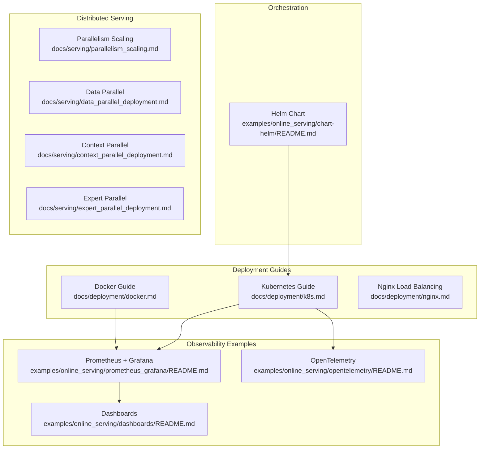

**Diagram sources**
- [docs/deployment/docker.md](file://docs/deployment/docker.md#L1-L153)
- [docs/deployment/k8s.md](file://docs/deployment/k8s.md#L1-L398)
- [docs/deployment/nginx.md](file://docs/deployment/nginx.md#L1-L138)
- [examples/online_serving/prometheus_grafana/README.md](file://examples/online_serving/prometheus_grafana/README.md#L1-L58)
- [examples/online_serving/opentelemetry/README.md](file://examples/online_serving/opentelemetry/README.md#L1-L95)
- [examples/online_serving/dashboards/README.md](file://examples/online_serving/dashboards/README.md#L1-L88)
- [examples/online_serving/chart-helm/README.md](file://examples/online_serving/chart-helm/README.md#L1-L34)
- [docs/serving/parallelism_scaling.md](file://docs/serving/parallelism_scaling.md#L1-L200)

**Section sources**
- [README.md](file://README.md#L1-L191)
- [docs/deployment/docker.md](file://docs/deployment/docker.md#L1-L153)
- [docs/deployment/k8s.md](file://docs/deployment/k8s.md#L1-L398)
- [docs/deployment/nginx.md](file://docs/deployment/nginx.md#L1-L138)
- [examples/online_serving/prometheus_grafana/README.md](file://examples/online_serving/prometheus_grafana/README.md#L1-L58)
- [examples/online_serving/opentelemetry/README.md](file://examples/online_serving/opentelemetry/README.md#L1-L95)
- [examples/online_serving/chart-helm/README.md](file://examples/online_serving/chart-helm/README.md#L1-L34)
- [examples/online_serving/dashboards/README.md](file://examples/online_serving/dashboards/README.md#L1-L88)
- [docs/serving/parallelism_scaling.md](file://docs/serving/parallelism_scaling.md#L1-L200)

## Core Components
- Containerization
  - Official Docker images and multi-arch builds for GPU and CPU backends
  - Custom Dockerfiles for optional dependencies and cross-compilation
- Orchestration
  - Kubernetes manifests for CPU and GPU deployments, probes, and shared memory tuning
  - Nginx-based load balancing for multi-instance deployments
  - Helm chart scaffolding with templates for Deployment, HPA, PVC, Secrets, and Service
- Observability
  - Prometheus metrics endpoint and Grafana dashboards
  - OpenTelemetry tracing with OTLP exporters and FastAPI instrumentation
- Distributed Serving
  - Data, context, and expert parallelism scaling guides
  - Multi-node scripts and cluster runbooks
- Production Operations
  - Security hardening, troubleshooting, and usage statistics

**Section sources**
- [docs/deployment/docker.md](file://docs/deployment/docker.md#L1-L153)
- [docs/deployment/k8s.md](file://docs/deployment/k8s.md#L1-L398)
- [docs/deployment/nginx.md](file://docs/deployment/nginx.md#L1-L138)
- [examples/online_serving/prometheus_grafana/README.md](file://examples/online_serving/prometheus_grafana/README.md#L1-L58)
- [examples/online_serving/opentelemetry/README.md](file://examples/online_serving/opentelemetry/README.md#L1-L95)
- [examples/online_serving/chart-helm/README.md](file://examples/online_serving/chart-helm/README.md#L1-L34)
- [examples/online_serving/dashboards/README.md](file://examples/online_serving/dashboards/README.md#L1-L88)
- [docs/serving/parallelism_scaling.md](file://docs/serving/parallelism_scaling.md#L1-L200)

## Architecture Overview
The deployment architecture integrates vLLM’s OpenAI-compatible server with monitoring and orchestration layers. At scale, traffic is routed through ingress/load balancers to multiple replicated vLLM pods or containers, with Prometheus scraping metrics and OpenTelemetry exporting traces to a backend (e.g., Jaeger).

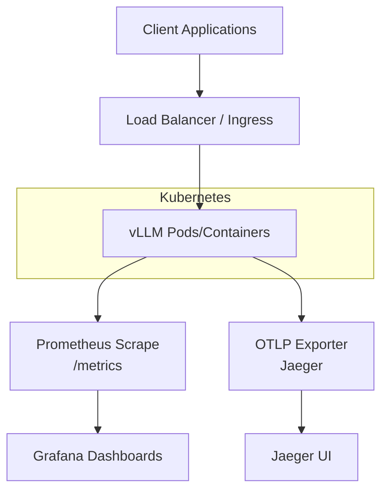

**Diagram sources**
- [docs/deployment/k8s.md](file://docs/deployment/k8s.md#L1-L398)
- [examples/online_serving/prometheus_grafana/README.md](file://examples/online_serving/prometheus_grafana/README.md#L1-L58)
- [examples/online_serving/opentelemetry/README.md](file://examples/online_serving/opentelemetry/README.md#L1-L95)

## Detailed Component Analysis

### Containerization Strategies
- Official images
  - GPU and CPU variants are provided; GPU runs typically require shared memory tuning and GPU runtime flags
  - Optional dependencies can be layered via custom Dockerfiles
- Multi-arch and cross-compilation
  - ARM64 builds supported with explicit CUDA arch lists and parallel build arguments
- Environment and mounts
  - Hugging Face cache mounted for model persistence
  - IPC/shared memory tuned for tensor parallel inference

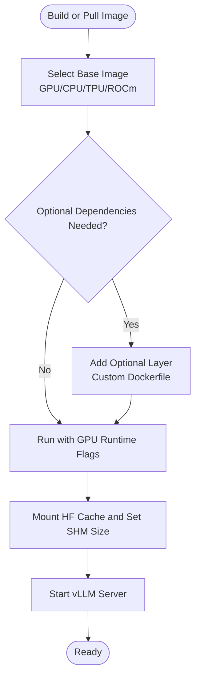

**Diagram sources**
- [docs/deployment/docker.md](file://docs/deployment/docker.md#L1-L153)
- [docker/Dockerfile](file://docker/Dockerfile#L1-L200)
- [docker/Dockerfile.cpu](file://docker/Dockerfile.cpu#L1-L200)
- [docker/Dockerfile.tpu](file://docker/Dockerfile.tpu#L1-L200)
- [docker/Dockerfile.rocm](file://docker/Dockerfile.rocm#L1-L200)

**Section sources**
- [docs/deployment/docker.md](file://docs/deployment/docker.md#L1-L153)

### Kubernetes Deployment Patterns
- CPU and GPU deployments
  - PVC for model cache, Secret for gated models, and probes for health checks
  - Shared memory via emptyDir with size limits and host IPC for ROCm
- GPU scheduling and resource requests/limits
  - Vendor-specific GPU resource keys and appropriate CPU/memory allocations
- Service exposure and testing
  - ClusterIP service and curl-based verification

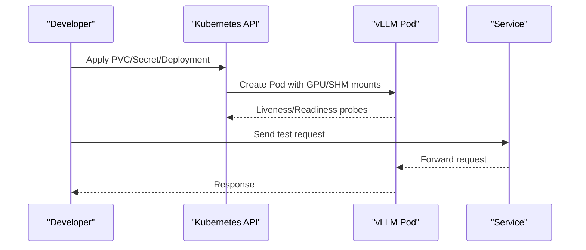

**Diagram sources**
- [docs/deployment/k8s.md](file://docs/deployment/k8s.md#L1-L398)

**Section sources**
- [docs/deployment/k8s.md](file://docs/deployment/k8s.md#L1-L398)

### Nginx Load Balancing
- Multi-instance vLLM containers on a user-defined bridge network
- Upstream least_conn configuration and proxy headers
- Shared Hugging Face cache to avoid redundant downloads

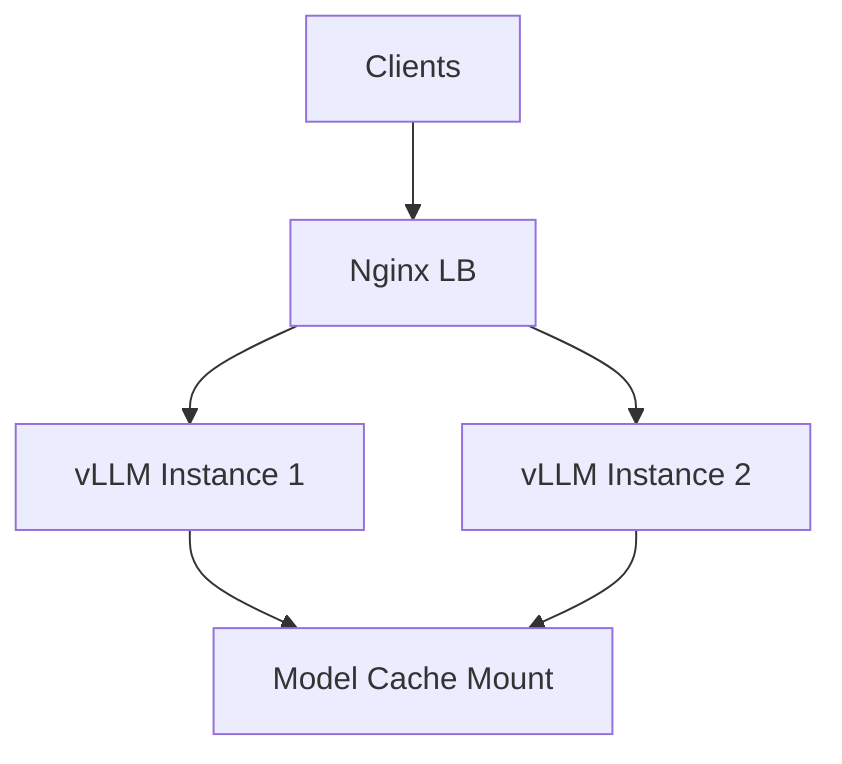

**Diagram sources**
- [docs/deployment/nginx.md](file://docs/deployment/nginx.md#L1-L138)

**Section sources**
- [docs/deployment/nginx.md](file://docs/deployment/nginx.md#L1-L138)

### Monitoring with Prometheus and Grafana
- vLLM exposes Prometheus metrics by default at the metrics endpoint
- Example compose setup launches Prometheus and Grafana and demonstrates importing a dashboard
- Raw metrics endpoint and dashboard import steps are documented

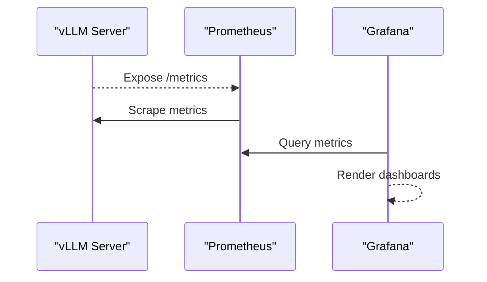

**Diagram sources**
- [examples/online_serving/prometheus_grafana/README.md](file://examples/online_serving/prometheus_grafana/README.md#L1-L58)
- [examples/online_serving/dashboards/README.md](file://examples/online_serving/dashboards/README.md#L1-L88)

**Section sources**
- [examples/online_serving/prometheus_grafana/README.md](file://examples/online_serving/prometheus_grafana/README.md#L1-L58)
- [examples/online_serving/dashboards/README.md](file://examples/online_serving/dashboards/README.md#L1-L88)

### OpenTelemetry Integration
- OTLP exporter configuration for traces
- Jaeger as a tracing backend with UI access
- FastAPI automatic instrumentation option

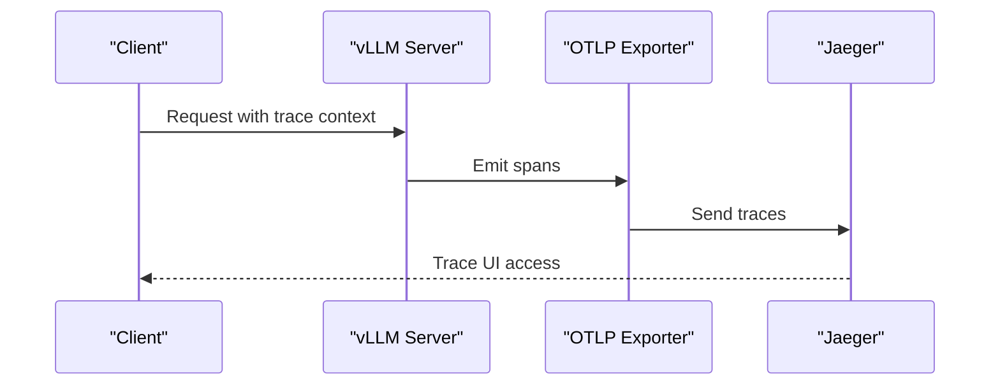

**Diagram sources**
- [examples/online_serving/opentelemetry/README.md](file://examples/online_serving/opentelemetry/README.md#L1-L95)

**Section sources**
- [examples/online_serving/opentelemetry/README.md](file://examples/online_serving/opentelemetry/README.md#L1-L95)

### Helm Chart Deployments
- Chart includes templates for Deployment, HPA, PVC, Secrets, Service, PodDisruptionBudget, and Jobs
- Testing via helm-unittest plugin
- Validation via JSON schema for values

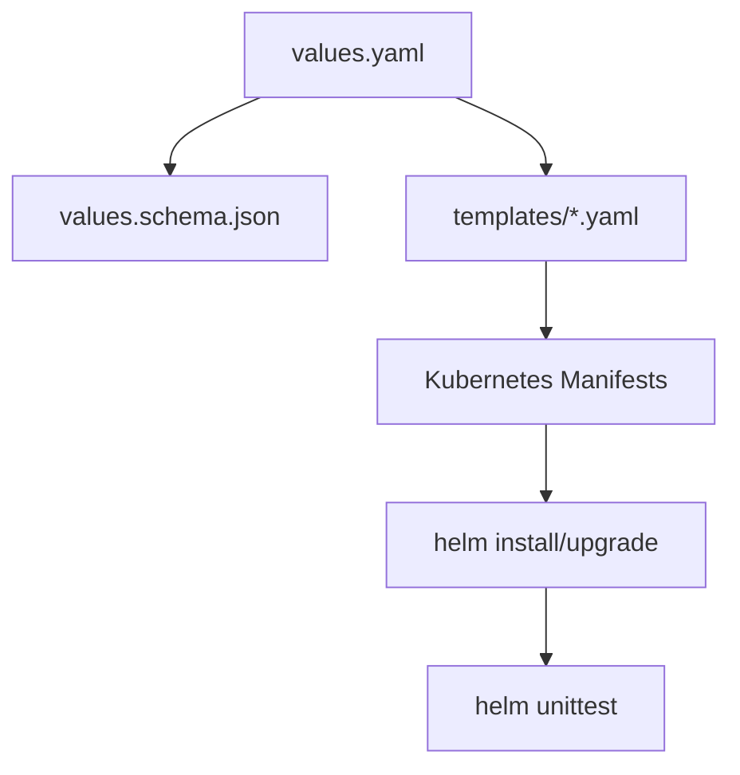

**Diagram sources**
- [examples/online_serving/chart-helm/README.md](file://examples/online_serving/chart-helm/README.md#L1-L34)

**Section sources**
- [examples/online_serving/chart-helm/README.md](file://examples/online_serving/chart-helm/README.md#L1-L34)

### Multi-Node Cluster Management
- Multi-node serving scripts demonstrate coordinated startup across nodes
- Offline examples illustrate torchrun-based distributed training/inference patterns applicable to multi-node serving

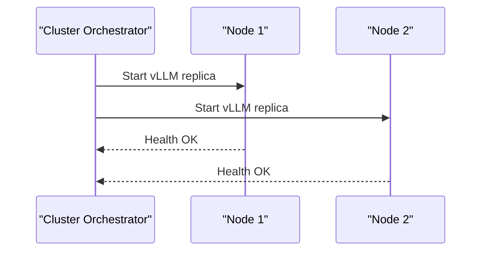

**Diagram sources**
- [examples/online_serving/multi-node-serving.sh](file://examples/online_serving/multi-node-serving.sh#L1-L200)
- [examples/online_serving/run_cluster.sh](file://examples/online_serving/run_cluster.sh#L1-L200)
- [examples/offline_inference/torchrun_example.py](file://examples/offline_inference/torchrun_example.py#L1-L200)
- [examples/offline_inference/torchrun_dp_example.py](file://examples/offline_inference/torchrun_dp_example.py#L1-L200)
- [examples/offline_inference/data_parallel.py](file://examples/offline_inference/data_parallel.py#L1-L200)

**Section sources**
- [examples/online_serving/multi-node-serving.sh](file://examples/online_serving/multi-node-serving.sh#L1-L200)
- [examples/online_serving/run_cluster.sh](file://examples/online_serving/run_cluster.sh#L1-L200)
- [examples/offline_inference/torchrun_example.py](file://examples/offline_inference/torchrun_example.py#L1-L200)
- [examples/offline_inference/torchrun_dp_example.py](file://examples/offline_inference/torchrun_dp_example.py#L1-L200)
- [examples/offline_inference/data_parallel.py](file://examples/offline_inference/data_parallel.py#L1-L200)

### Distributed Serving and Parallelism
- Data, context, and expert parallelism scaling guides
- Practical arguments for serving and engine tuning

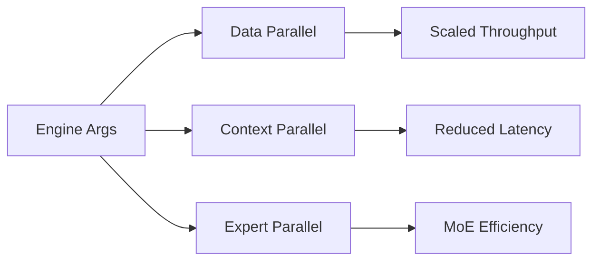

**Diagram sources**
- [docs/serving/parallelism_scaling.md](file://docs/serving/parallelism_scaling.md#L1-L200)
- [docs/serving/data_parallel_deployment.md](file://docs/serving/data_parallel_deployment.md#L1-L200)
- [docs/serving/context_parallel_deployment.md](file://docs/serving/context_parallel_deployment.md#L1-L200)
- [docs/serving/expert_parallel_deployment.md](file://docs/serving/expert_parallel_deployment.md#L1-L200)
- [docs/configuration/engine_args.md](file://docs/configuration/engine_args.md#L1-L200)
- [docs/configuration/serve_args.md](file://docs/configuration/serve_args.md#L1-L200)

**Section sources**
- [docs/serving/parallelism_scaling.md](file://docs/serving/parallelism_scaling.md#L1-L200)
- [docs/serving/data_parallel_deployment.md](file://docs/serving/data_parallel_deployment.md#L1-L200)
- [docs/serving/context_parallel_deployment.md](file://docs/serving/context_parallel_deployment.md#L1-L200)
- [docs/serving/expert_parallel_deployment.md](file://docs/serving/expert_parallel_deployment.md#L1-L200)
- [docs/configuration/engine_args.md](file://docs/configuration/engine_args.md#L1-L200)
- [docs/configuration/serve_args.md](file://docs/configuration/serve_args.md#L1-L200)

### Logging Setup and Observability Pipelines
- Prometheus metrics endpoint and Grafana dashboards
- OpenTelemetry tracing with configurable protocols and exporters
- Dashboard formats for Grafana (JSON) and Perses (YAML)

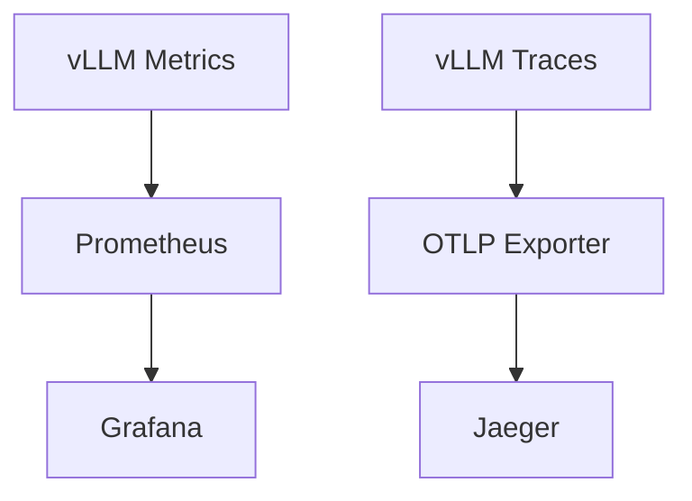

**Diagram sources**
- [examples/online_serving/prometheus_grafana/README.md](file://examples/online_serving/prometheus_grafana/README.md#L1-L58)
- [examples/online_serving/opentelemetry/README.md](file://examples/online_serving/opentelemetry/README.md#L1-L95)
- [examples/online_serving/dashboards/README.md](file://examples/online_serving/dashboards/README.md#L1-L88)

**Section sources**
- [examples/online_serving/prometheus_grafana/README.md](file://examples/online_serving/prometheus_grafana/README.md#L1-L58)
- [examples/online_serving/opentelemetry/README.md](file://examples/online_serving/opentelemetry/README.md#L1-L95)
- [examples/online_serving/dashboards/README.md](file://examples/online_serving/dashboards/README.md#L1-L88)

### CI/CD Integration and Infrastructure as Code
- Helm chart testing with helm-unittest plugin
- Values schema validation for safe IaC pipelines
- Example compose-based local observability for CI demos

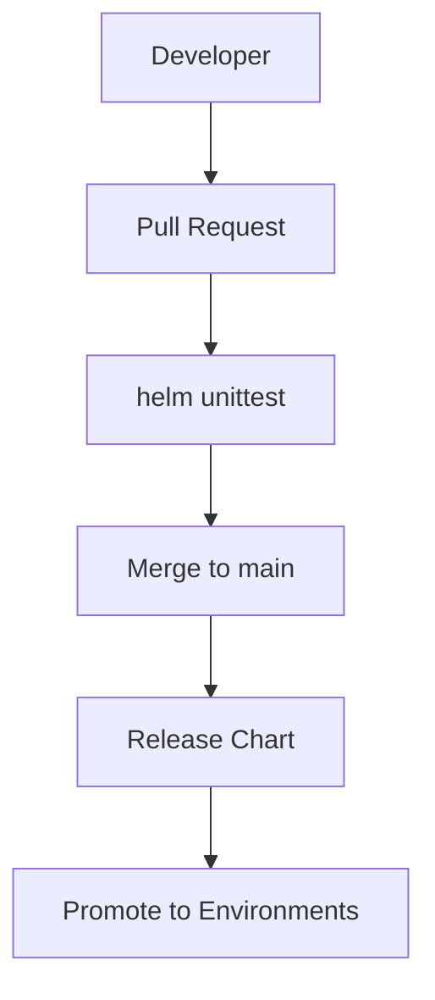

**Diagram sources**
- [examples/online_serving/chart-helm/README.md](file://examples/online_serving/chart-helm/README.md#L1-L34)
- [examples/online_serving/prometheus_grafana/README.md](file://examples/online_serving/prometheus_grafana/README.md#L1-L58)

**Section sources**
- [examples/online_serving/chart-helm/README.md](file://examples/online_serving/chart-helm/README.md#L1-L34)
- [examples/online_serving/prometheus_grafana/README.md](file://examples/online_serving/prometheus_grafana/README.md#L1-L58)

### Automated Scaling
- Horizontal Pod Autoscaler template included in Helm chart
- Resource requests/limits and probe tuning for predictable autoscaling behavior

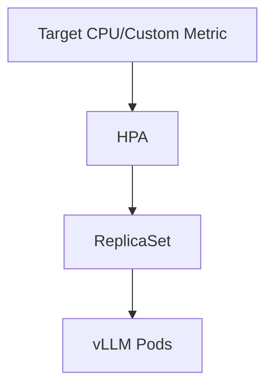

**Diagram sources**
- [examples/online_serving/chart-helm/templates/hpa.yaml](file://examples/online_serving/chart-helm/templates/hpa.yaml#L1-L200)

**Section sources**
- [examples/online_serving/chart-helm/README.md](file://examples/online_serving/chart-helm/README.md#L1-L34)

### Security Hardening and Disaster Recovery
- Security guidance and best practices
- Troubleshooting and distributed troubleshooting references
- Reproducibility and usage statistics for operational hygiene

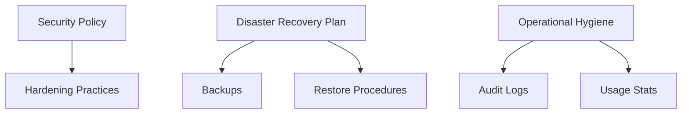

**Diagram sources**
- [docs/usage/security.md](file://docs/usage/security.md#L1-L200)
- [docs/usage/troubleshooting.md](file://docs/usage/troubleshooting.md#L1-L200)
- [docs/design/distributed_troubleshooting.md](file://docs/design/distributed_troubleshooting.md#L1-L200)
- [docs/usage/reproducibility.md](file://docs/usage/reproducibility.md#L1-L200)
- [docs/usage/usage_stats.md](file://docs/usage/usage_stats.md#L1-L200)

**Section sources**
- [docs/usage/security.md](file://docs/usage/security.md#L1-L200)
- [docs/usage/troubleshooting.md](file://docs/usage/troubleshooting.md#L1-L200)
- [docs/design/distributed_troubleshooting.md](file://docs/design/distributed_troubleshooting.md#L1-L200)
- [docs/usage/reproducibility.md](file://docs/usage/reproducibility.md#L1-L200)
- [docs/usage/usage_stats.md](file://docs/usage/usage_stats.md#L1-L200)

## Dependency Analysis
- Container images depend on base OS and runtime libraries; GPU variants require vendor device plugins and drivers
- Kubernetes deployments depend on cluster GPU scheduling and shared memory configuration
- Observability depends on Prometheus scrape targets and OTLP exporter endpoints
- Helm chart depends on values schema and templates to render manifests consistently

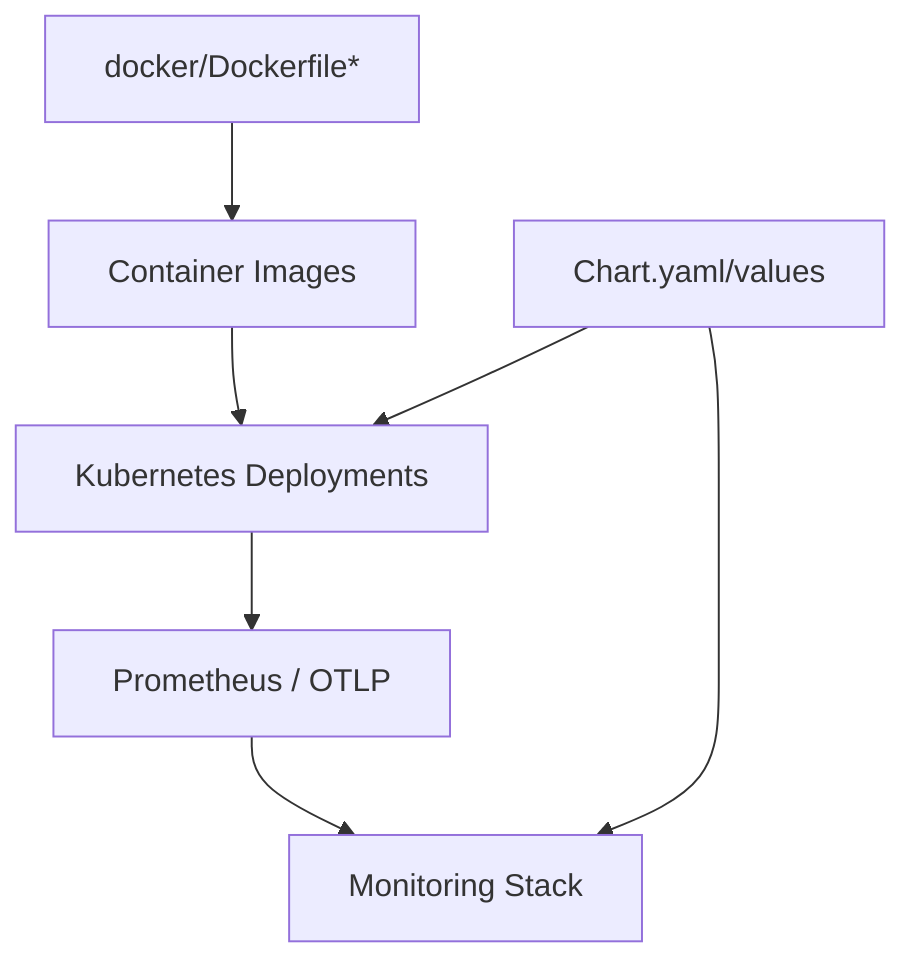

**Diagram sources**
- [docker/Dockerfile](file://docker/Dockerfile#L1-L200)
- [docs/deployment/k8s.md](file://docs/deployment/k8s.md#L1-L398)
- [examples/online_serving/prometheus_grafana/README.md](file://examples/online_serving/prometheus_grafana/README.md#L1-L58)
- [examples/online_serving/opentelemetry/README.md](file://examples/online_serving/opentelemetry/README.md#L1-L95)
- [examples/online_serving/chart-helm/README.md](file://examples/online_serving/chart-helm/README.md#L1-L34)

**Section sources**
- [docker/Dockerfile](file://docker/Dockerfile#L1-L200)
- [docs/deployment/k8s.md](file://docs/deployment/k8s.md#L1-L398)
- [examples/online_serving/prometheus_grafana/README.md](file://examples/online_serving/prometheus_grafana/README.md#L1-L58)
- [examples/online_serving/opentelemetry/README.md](file://examples/online_serving/opentelemetry/README.md#L1-L95)
- [examples/online_serving/chart-helm/README.md](file://examples/online_serving/chart-helm/README.md#L1-L34)

## Performance Considerations
- Tune shared memory and IPC for tensor parallel inference
- Configure probes and resource limits to prevent premature restarts
- Enable chunked prefill and appropriate max batched tokens for throughput
- Use multi-node and multi-replica strategies for horizontal scaling

[No sources needed since this section provides general guidance]

## Troubleshooting Guide
- Startup/readiness probe failures often indicate insufficient warm-up time; adjust thresholds accordingly
- Health endpoints and logs are essential for diagnosing startup issues
- Distributed troubleshooting references cover multi-node and multi-process scenarios

**Section sources**
- [docs/deployment/k8s.md](file://docs/deployment/k8s.md#L384-L398)
- [docs/design/distributed_troubleshooting.md](file://docs/design/distributed_troubleshooting.md#L1-L200)
- [docs/usage/troubleshooting.md](file://docs/usage/troubleshooting.md#L1-L200)

## Conclusion
This guide consolidates vLLM deployment patterns and integration examples across containerization, orchestration, observability, and production operations. By combining official guides, example stacks, and Helm scaffolding, teams can deploy reliable, observable, and scalable vLLM services tailored to their infrastructure and workload characteristics.

[No sources needed since this section summarizes without analyzing specific files]

## Appendices
- Additional references for production-grade integrations and frameworks are available in the deployment documentation index.

**Section sources**
- [docs/deployment/integrations/production-stack.md](file://docs/deployment/integrations/production-stack.md#L1-L200)
- [docs/deployment/frameworks/helm.md](file://docs/deployment/frameworks/helm.md#L1-L200)
- [docs/serving/openai_compatible_server.md](file://docs/serving/openai_compatible_server.md#L1-L200)