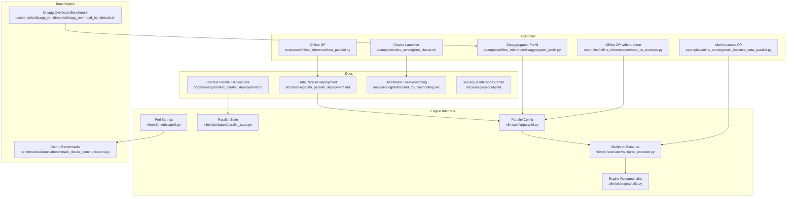
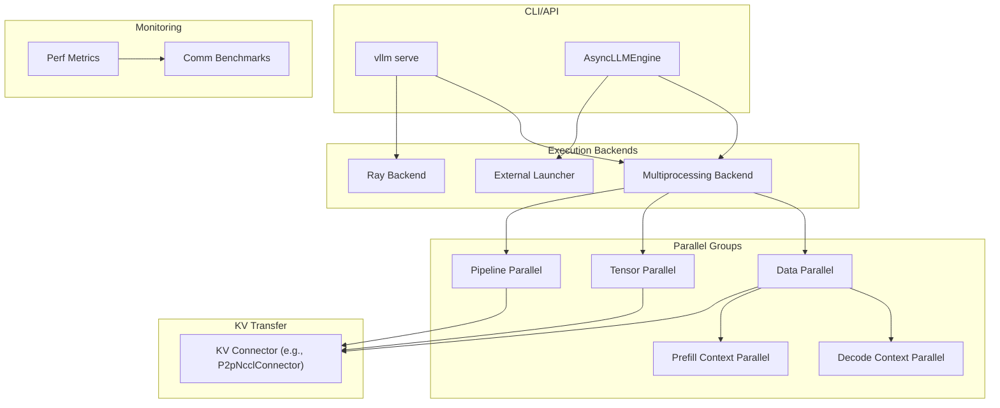
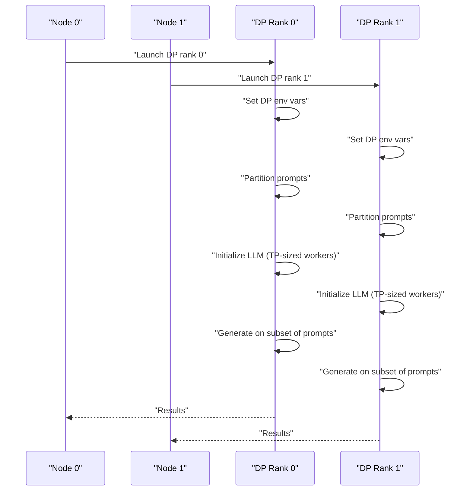
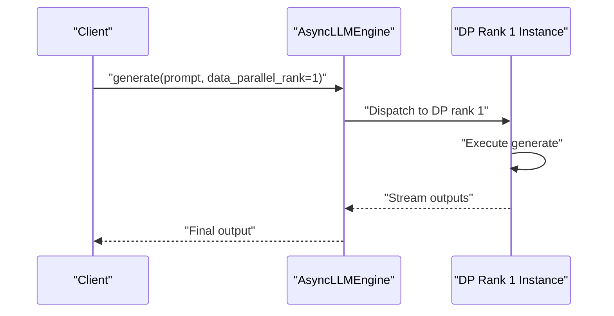
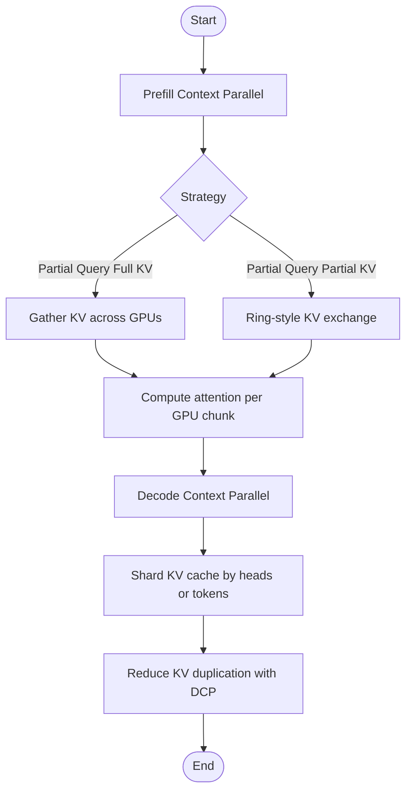
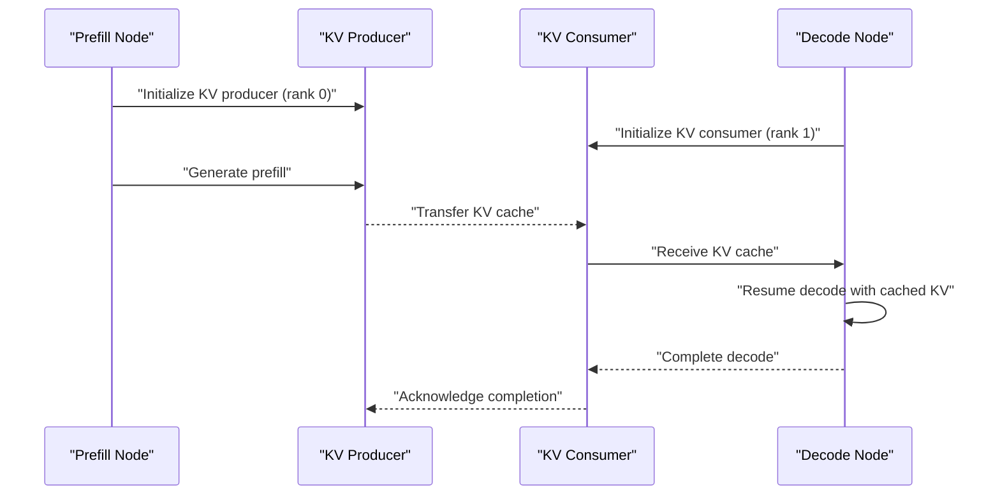
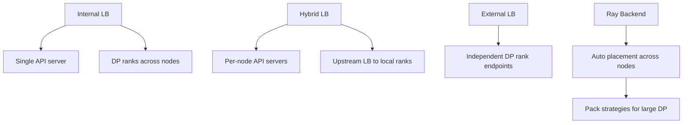
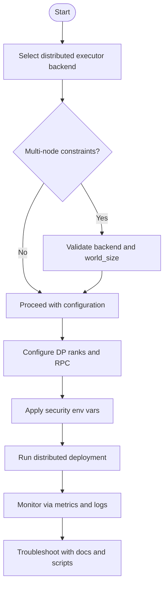
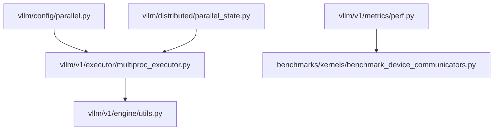

# Distributed Inference Examples

<cite>
**Referenced Files in This Document**
- [data_parallel.py](file://examples/offline_inference/data_parallel.py)
- [torchrun_dp_example.py](file://examples/offline_inference/torchrun_dp_example.py)
- [disaggregated_prefill.py](file://examples/offline_inference/disaggregated_prefill.py)
- [multi_instance_data_parallel.py](file://examples/online_serving/multi_instance_data_parallel.py)
- [run_cluster.sh](file://examples/online_serving/run_cluster.sh)
- [data_parallel_deployment.md](file://docs/serving/data_parallel_deployment.md)
- [context_parallel_deployment.md](file://docs/serving/context_parallel_deployment.md)
- [parallel.py](file://vllm/config/parallel.py)
- [multiproc_executor.py](file://vllm/v1/executor/multiproc_executor.py)
- [parallel_state.py](file://vllm/distributed/parallel_state.py)
- [utils.py](file://vllm/v1/engine/utils.py)
- [perf.py](file://vllm/v1/metrics/perf.py)
- [benchmark_device_communicators.py](file://benchmarks/kernels/benchmark_device_communicators.py)
- [disagg_overhead_benchmark.sh](file://benchmarks/disagg_benchmarks/disagg_overhead_benchmark.sh)
- [distributed_troubleshooting.md](file://docs/serving/distributed_troubleshooting.md)
- [security.md](file://docs/usage/security.md)
</cite>

## Table of Contents
1. [Introduction](#introduction)
2. [Project Structure](#project-structure)
3. [Core Components](#core-components)
4. [Architecture Overview](#architecture-overview)
5. [Detailed Component Analysis](#detailed-component-analysis)
6. [Dependency Analysis](#dependency-analysis)
7. [Performance Considerations](#performance-considerations)
8. [Troubleshooting Guide](#troubleshooting-guide)
9. [Conclusion](#conclusion)
10. [Appendices](#appendices)

## Introduction
This document provides practical, code-backed guidance for distributed inference using vLLM. It covers:
- Data parallelism for scaling throughput across independent batches
- Tensor and context parallelism for efficient model and KV cache distribution
- Disaggregated prefill architectures for separating prefill and decode workloads
- Multi-node deployment patterns, resource allocation strategies, and scaling considerations
- Configuration options, fault tolerance mechanisms, and performance optimization
- Practical examples for cluster setup, workload distribution, and monitoring
- Troubleshooting distributed deployments and optimizing inter-node communication

## Project Structure
The repository organizes distributed inference examples and documentation across:
- Examples for offline and online serving
- Serving documentation for deployment modes
- Engine internals for parallel configuration and execution
- Benchmarks for performance measurement and communication tuning

**Diagram sources**
- [data_parallel.py](file://examples/offline_inference/data_parallel.py#L1-L269)
- [torchrun_dp_example.py](file://examples/offline_inference/torchrun_dp_example.py#L1-L152)
- [disaggregated_prefill.py](file://examples/offline_inference/disaggregated_prefill.py#L1-L128)
- [multi_instance_data_parallel.py](file://examples/online_serving/multi_instance_data_parallel.py#L1-L88)
- [run_cluster.sh](file://examples/online_serving/run_cluster.sh#L1-L132)
- [data_parallel_deployment.md](file://docs/serving/data_parallel_deployment.md#L1-L134)
- [context_parallel_deployment.md](file://docs/serving/context_parallel_deployment.md#L1-L48)
- [parallel.py](file://vllm/config/parallel.py#L588-L619)
- [multiproc_executor.py](file://vllm/v1/executor/multiproc_executor.py#L107-L125)
- [parallel_state.py](file://vllm/distributed/parallel_state.py#L1353-L1380)
- [utils.py](file://vllm/v1/engine/utils.py#L438-L484)
- [perf.py](file://vllm/v1/metrics/perf.py#L1177-L1213)
- [benchmark_device_communicators.py](file://benchmarks/kernels/benchmark_device_communicators.py#L143-L341)
- [disagg_overhead_benchmark.sh](file://benchmarks/disagg_benchmarks/disagg_overhead_benchmark.sh#L93-L143)

**Section sources**
- [data_parallel.py](file://examples/offline_inference/data_parallel.py#L1-L269)
- [multi_instance_data_parallel.py](file://examples/online_serving/multi_instance_data_parallel.py#L1-L88)
- [data_parallel_deployment.md](file://docs/serving/data_parallel_deployment.md#L1-L134)

## Core Components
- Data Parallel Inference (offline and online)
  - Offline example demonstrates multi-node DP with explicit rank assignment and environment variables for DP coordination.
  - Online example shows multi-instance DP with explicit DP rank targeting and RPC configuration.
- Tensor and Context Parallelism
  - Context parallel deployment doc explains prefill and decode strategies and KV cache sharding trade-offs.
  - Engine parallel state initializes model-parallel groups for decode and prefill context parallel.
- Disaggregated Prefill
  - Example separates prefill and decode onto different GPUs with KV cache transfer via a connector.
  - Benchmark script measures overhead of disagg prefill implementation.
- Cluster Setup and Monitoring
  - Cluster launcher script provisions Ray head and worker nodes with host networking and GPU access.
  - Performance metrics and communication benchmarks quantify throughput and bandwidth usage.

**Section sources**
- [data_parallel.py](file://examples/offline_inference/data_parallel.py#L1-L269)
- [multi_instance_data_parallel.py](file://examples/online_serving/multi_instance_data_parallel.py#L1-L88)
- [context_parallel_deployment.md](file://docs/serving/context_parallel_deployment.md#L1-L48)
- [parallel_state.py](file://vllm/distributed/parallel_state.py#L1353-L1380)
- [disaggregated_prefill.py](file://examples/offline_inference/disaggregated_prefill.py#L1-L128)
- [disagg_overhead_benchmark.sh](file://benchmarks/disagg_benchmarks/disagg_overhead_benchmark.sh#L93-L143)
- [run_cluster.sh](file://examples/online_serving/run_cluster.sh#L1-L132)
- [perf.py](file://vllm/v1/metrics/perf.py#L1177-L1213)

## Architecture Overview
The distributed inference stack integrates:
- Command-line and programmatic configuration for DP/TP/PP/DCP
- Multiprocessing and executor backends for multi-node orchestration
- KV cache transfer connectors for disagg prefill
- Metrics and benchmarks for performance tuning

**Diagram sources**
- [data_parallel_deployment.md](file://docs/serving/data_parallel_deployment.md#L1-L134)
- [context_parallel_deployment.md](file://docs/serving/context_parallel_deployment.md#L1-L48)
- [parallel.py](file://vllm/config/parallel.py#L588-L619)
- [multiproc_executor.py](file://vllm/v1/executor/multiproc_executor.py#L107-L125)
- [parallel_state.py](file://vllm/distributed/parallel_state.py#L1353-L1380)
- [disaggregated_prefill.py](file://examples/offline_inference/disaggregated_prefill.py#L1-L128)
- [perf.py](file://vllm/v1/metrics/perf.py#L1177-L1213)
- [benchmark_device_communicators.py](file://benchmarks/kernels/benchmark_device_communicators.py#L143-L341)

## Detailed Component Analysis

### Data Parallel Inference (Offline)
This example demonstrates multi-node data parallel inference with:
- Explicit DP rank assignment and environment variables for DP master and local/global ranks
- Per-rank prompt partitioning and independent sampling parameters
- Multi-processing launch with configurable timeout and GPU visibility

**Diagram sources**
- [data_parallel.py](file://examples/offline_inference/data_parallel.py#L1-L269)

**Section sources**
- [data_parallel.py](file://examples/offline_inference/data_parallel.py#L1-L269)

### Data Parallel Inference (Online Multi-Instance)
This example targets specific DP ranks on separate instances and coordinates via RPC:
- Uses AsyncLLMEngine with explicit data_parallel_rank selection
- Demonstrates headless mode and RPC address/port configuration
- Background logging via aggregated stat logger

**Diagram sources**
- [multi_instance_data_parallel.py](file://examples/online_serving/multi_instance_data_parallel.py#L1-L88)

**Section sources**
- [multi_instance_data_parallel.py](file://examples/online_serving/multi_instance_data_parallel.py#L1-L88)

### Tensor and Context Parallelism
Context parallel deployment doc outlines:
- Prefill strategies: partial query/full KV and partial query/partial KV with ring-style communication
- Decode strategies: KV cache sharding along heads and token dimension, reducing duplication with DCP
- Practical guidance for choosing TP and DCP sizes based on model KV heads and GPU counts

**Diagram sources**
- [context_parallel_deployment.md](file://docs/serving/context_parallel_deployment.md#L1-L48)
- [parallel_state.py](file://vllm/distributed/parallel_state.py#L1353-L1380)

**Section sources**
- [context_parallel_deployment.md](file://docs/serving/context_parallel_deployment.md#L1-L48)
- [parallel_state.py](file://vllm/distributed/parallel_state.py#L1353-L1380)

### Disaggregated Prefill Architecture
The example separates prefill and decode across GPUs with KV cache transfer:
- Prefill node sets up KV transfer config as producer
- Decode node consumes KV cache and resumes generation
- Coordination via event synchronization and connector role/rank

**Diagram sources**
- [disaggregated_prefill.py](file://examples/offline_inference/disaggregated_prefill.py#L1-L128)

**Section sources**
- [disaggregated_prefill.py](file://examples/offline_inference/disaggregated_prefill.py#L1-L128)
- [disagg_overhead_benchmark.sh](file://benchmarks/disagg_benchmarks/disagg_overhead_benchmark.sh#L93-L143)

### Multi-Node Deployment Patterns and Resource Allocation
- Internal load balancing: single API server exposing a single endpoint; DP ranks distributed across nodes with RPC and HTTP ports configured per node.
- Hybrid load balancing: per-node API servers queuing to colocated DP ranks; upstream load balancer distributes requests.
- External load balancing: independent deployments per DP rank with separate endpoints; external router balances traffic.
- Ray backend: simplified multi-node launch with automatic placement; pack strategies for large DP sizes spanning nodes.

**Diagram sources**
- [data_parallel_deployment.md](file://docs/serving/data_parallel_deployment.md#L1-L134)
- [utils.py](file://vllm/v1/engine/utils.py#L438-L484)

**Section sources**
- [data_parallel_deployment.md](file://docs/serving/data_parallel_deployment.md#L1-L134)
- [utils.py](file://vllm/v1/engine/utils.py#L438-L484)

### Configuration Options and Fault Tolerance
- Distributed executor backend selection and constraints for multi-node scenarios
- DP rank and RPC configuration for multi-node deployments
- Security considerations for inter-node communications (environment variables and isolation)
- Troubleshooting guidance for GPU communication verification and Ray observability

**Diagram sources**
- [parallel.py](file://vllm/config/parallel.py#L588-L619)
- [data_parallel_deployment.md](file://docs/serving/data_parallel_deployment.md#L1-L134)
- [security.md](file://docs/usage/security.md#L1-L42)
- [distributed_troubleshooting.md](file://docs/serving/distributed_troubleshooting.md#L1-L17)

**Section sources**
- [parallel.py](file://vllm/config/parallel.py#L588-L619)
- [data_parallel_deployment.md](file://docs/serving/data_parallel_deployment.md#L1-L134)
- [security.md](file://docs/usage/security.md#L1-L42)
- [distributed_troubleshooting.md](file://docs/serving/distributed_troubleshooting.md#L1-L17)

## Dependency Analysis
The following diagram highlights key dependencies among components involved in distributed inference:

**Diagram sources**
- [parallel.py](file://vllm/config/parallel.py#L588-L619)
- [multiproc_executor.py](file://vllm/v1/executor/multiproc_executor.py#L107-L125)
- [parallel_state.py](file://vllm/distributed/parallel_state.py#L1353-L1380)
- [utils.py](file://vllm/v1/engine/utils.py#L438-L484)
- [perf.py](file://vllm/v1/metrics/perf.py#L1177-L1213)
- [benchmark_device_communicators.py](file://benchmarks/kernels/benchmark_device_communicators.py#L143-L341)

**Section sources**
- [parallel.py](file://vllm/config/parallel.py#L588-L619)
- [multiproc_executor.py](file://vllm/v1/executor/multiproc_executor.py#L107-L125)
- [parallel_state.py](file://vllm/distributed/parallel_state.py#L1353-L1380)
- [utils.py](file://vllm/v1/engine/utils.py#L438-L484)
- [perf.py](file://vllm/v1/metrics/perf.py#L1177-L1213)
- [benchmark_device_communicators.py](file://benchmarks/kernels/benchmark_device_communicators.py#L143-L341)

## Performance Considerations
- Inter-node communication optimization
  - Use communication benchmarks to compare device communicators and select optimal backends for your hardware.
  - Tune environment variables for network interfaces and transport layers to improve bandwidth and reduce latency.
- Throughput and latency metrics
  - Track TFLOPs and GB/s metrics to assess utilization and identify bottlenecks.
  - Monitor service level objectives (SLOs) such as TTFT, TPOT, and end-to-end latency for SLA-driven tuning.
- KV cache transfer overhead
  - Measure disagg prefill overhead and tune connector settings and batching to minimize cross-node transfer costs.

**Section sources**
- [benchmark_device_communicators.py](file://benchmarks/kernels/benchmark_device_communicators.py#L143-L341)
- [perf.py](file://vllm/v1/metrics/perf.py#L1177-L1213)
- [disagg_overhead_benchmark.sh](file://benchmarks/disagg_benchmarks/disagg_overhead_benchmark.sh#L93-L143)

## Troubleshooting Guide
Common issues and remedies:
- Inter-node GPU communication verification
  - After launching Ray clusters, verify GPU-to-GPU communication; set environment variables during cluster creation to propagate to all nodes.
- Node IP selection problems
  - Ensure consistent IP addresses across vLLM and Ray; use VLLM_HOST_IP to align addresses and inspect node IPs with Ray status commands.
- Ray observability and debugging
  - Leverage Ray’s observability tools for monitoring, debugging, and multi-node GPU troubleshooting.

**Section sources**
- [distributed_troubleshooting.md](file://docs/serving/distributed_troubleshooting.md#L1-L17)
- [run_cluster.sh](file://examples/online_serving/run_cluster.sh#L1-L132)

## Conclusion
This document mapped distributed inference patterns in vLLM to concrete examples and internals:
- Data parallel scaling with internal, hybrid, and external load balancing
- Tensor and context parallel strategies for efficient prefill and decode
- Disaggregated prefill with KV cache transfer
- Multi-node deployment, resource allocation, and monitoring
- Performance tuning via metrics and communication benchmarks
- Troubleshooting with documented scripts and Ray observability

Adopt the examples and configurations that match your workload characteristics and infrastructure constraints.

## Appendices
- Practical cluster setup
  - Use the cluster launcher script to provision head and worker nodes with host networking and GPU access.
- Workload distribution
  - Choose internal, hybrid, or external load balancing based on scale and operational preferences.
- Monitoring
  - Enable aggregated logging and track TFLOPs/throughput metrics; leverage Ray observability for diagnostics.

**Section sources**
- [run_cluster.sh](file://examples/online_serving/run_cluster.sh#L1-L132)
- [multi_instance_data_parallel.py](file://examples/online_serving/multi_instance_data_parallel.py#L1-L88)
- [perf.py](file://vllm/v1/metrics/perf.py#L1177-L1213)