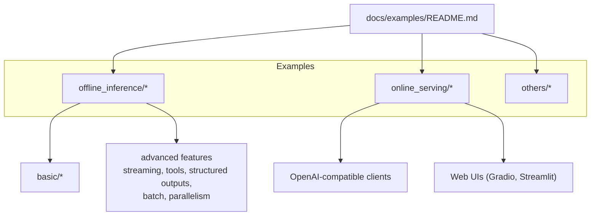
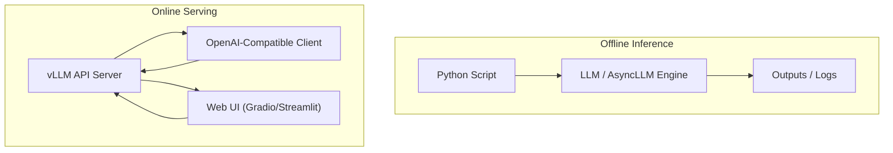
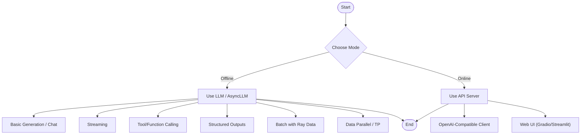
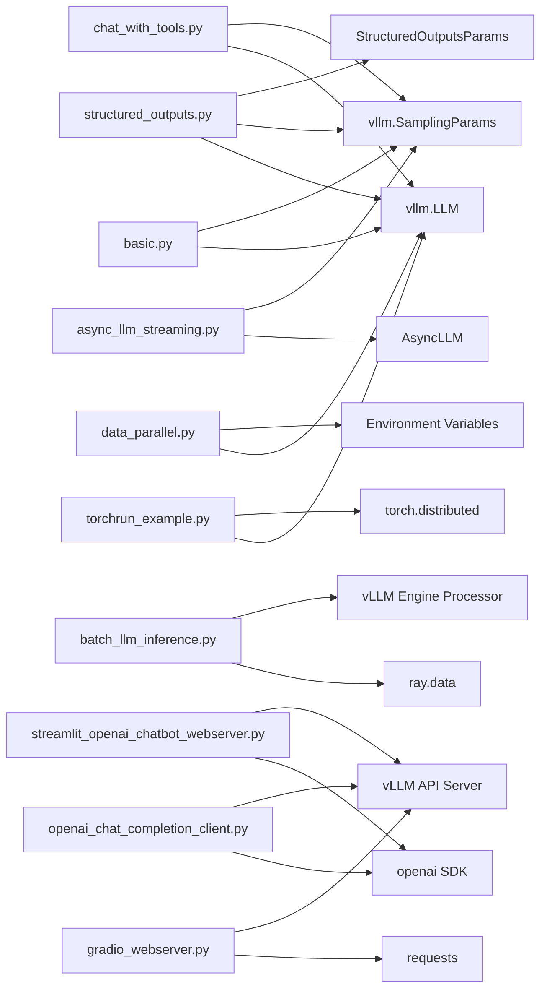

# Examples and Tutorials

<cite>
**Referenced Files in This Document**
- [examples/offline_inference/basic/README.md](file://examples/offline_inference/basic/README.md)
- [examples/offline_inference/basic/basic.py](file://examples/offline_inference/basic/basic.py)
- [examples/offline_inference/batch_llm_inference.py](file://examples/offline_inference/batch_llm_inference.py)
- [examples/offline_inference/async_llm_streaming.py](file://examples/offline_inference/async_llm_streaming.py)
- [examples/offline_inference/chat_with_tools.py](file://examples/offline_inference/chat_with_tools.py)
- [examples/offline_inference/structured_outputs.py](file://examples/offline_inference/structured_outputs.py)
- [examples/offline_inference/data_parallel.py](file://examples/offline_inference/data_parallel.py)
- [examples/offline_inference/torchrun_example.py](file://examples/offline_inference/torchrun_example.py)
- [examples/online_serving/openai_chat_completion_client.py](file://examples/online_serving/openai_chat_completion_client.py)
- [examples/online_serving/gradio_webserver.py](file://examples/online_serving/gradio_webserver.py)
- [examples/online_serving/streamlit_openai_chatbot_webserver.py](file://examples/online_serving/streamlit_openai_chatbot_webserver.py)
- [docs/examples/README.md](file://docs/examples/README.md)
</cite>

## Table of Contents
1. [Introduction](#introduction)
2. [Project Structure](#project-structure)
3. [Core Components](#core-components)
4. [Architecture Overview](#architecture-overview)
5. [Detailed Component Analysis](#detailed-component-analysis)
6. [Dependency Analysis](#dependency-analysis)
7. [Performance Considerations](#performance-considerations)
8. [Troubleshooting Guide](#troubleshooting-guide)
9. [Conclusion](#conclusion)
10. [Appendices](#appendices)

## Introduction
This section presents practical examples and tutorials for vLLM covering offline inference, streaming, structured outputs, tool/function calling, batch processing, and online serving. It consolidates runnable patterns from the repository’s examples directory, explains configuration options, and provides guidance for real-world deployments and integrations. The goal is to help you move from basic usage to advanced scenarios such as multi-node data parallel inference, streaming responses, and integrating with web frontends and OpenAI-compatible clients.

## Project Structure
The examples are organized by use case:
- Offline inference: direct Python usage for generating, chatting, embedding, classification, and specialized features (structured outputs, streaming, tools, etc.).
- Online serving: clients and web servers that integrate with vLLM’s API server.
- Others: advanced features not tied to offline or online serving (e.g., LMCache, Tensorizer).

**Diagram sources**
- [docs/examples/README.md](file://docs/examples/README.md#L1-L8)

**Section sources**
- [docs/examples/README.md](file://docs/examples/README.md#L1-L8)

## Core Components
This section highlights representative example scripts and their roles:

- Basic offline inference: minimal generation and chat flows.
- Batch inference with Ray Data: continuous batching and large-scale processing.
- Streaming offline inference: token-by-token generation using the AsyncLLM engine.
- Tool/function calling: offline chat with tool definitions and simulated execution.
- Structured outputs: enforcing choices, regex, JSON schema, and grammar constraints.
- Data parallel inference: multi-process, multi-node data-parallel execution.
- Torchrun tensor-parallel example: experimental torchrun-based tensor parallelism.
- Online serving clients and web UIs: OpenAI-compatible client and web apps.

Key capabilities demonstrated:
- Offline generation, chat, embeddings, classification, scoring, and rewards.
- Streaming generation with delta output kinds.
- Structured output enforcement via sampling parameters.
- Tool/function calling with message augmentation.
- Batch processing with Ray Data and vLLM engine processors.
- Multi-node data parallelism and tensor parallelism orchestration.

**Section sources**
- [examples/offline_inference/basic/basic.py](file://examples/offline_inference/basic/basic.py#L1-L36)
- [examples/offline_inference/batch_llm_inference.py](file://examples/offline_inference/batch_llm_inference.py#L1-L94)
- [examples/offline_inference/async_llm_streaming.py](file://examples/offline_inference/async_llm_streaming.py#L1-L112)
- [examples/offline_inference/chat_with_tools.py](file://examples/offline_inference/chat_with_tools.py#L1-L148)
- [examples/offline_inference/structured_outputs.py](file://examples/offline_inference/structured_outputs.py#L1-L114)
- [examples/offline_inference/data_parallel.py](file://examples/offline_inference/data_parallel.py#L1-L269)
- [examples/offline_inference/torchrun_example.py](file://examples/offline_inference/torchrun_example.py#L1-L77)
- [examples/online_serving/openai_chat_completion_client.py](file://examples/online_serving/openai_chat_completion_client.py#L1-L65)
- [examples/online_serving/gradio_webserver.py](file://examples/online_serving/gradio_webserver.py#L1-L76)
- [examples/online_serving/streamlit_openai_chatbot_webserver.py](file://examples/online_serving/streamlit_openai_chatbot_webserver.py#L1-L312)

## Architecture Overview
The examples span two primary modes:
- Offline inference: Python APIs (LLM, AsyncLLM) invoked directly in-process.
- Online serving: HTTP API server exposing OpenAI-compatible endpoints, consumed by clients or web UIs.

[No sources needed since this diagram shows conceptual workflow, not actual code structure]

## Detailed Component Analysis

### Basic Offline Inference
Demonstrates minimal generation and chat flows using the LLM class. It covers:
- Creating an LLM instance.
- Defining SamplingParams.
- Generating text from prompts.
- Iterating over outputs to extract prompt and generated text.

Best practices:
- Keep prompts concise for faster iteration.
- Tune SamplingParams for quality/performance trade-offs.
- Use model-specific tokenizer/tokenizer_mode when required.

**Section sources**
- [examples/offline_inference/basic/basic.py](file://examples/offline_inference/basic/basic.py#L1-L36)

### Batch Processing with Ray Data
Shows how to scale offline inference using Ray Data with vLLM:
- Reading datasets from cloud/object storage.
- Building a processor with vLLM engine configuration.
- Configuring continuous batching, chunked prefill, and max tokens.
- Streaming execution and autoscaling across a cluster.
- Writing results to Parquet.

Operational tips:
- Adjust concurrency and batch size to saturate GPUs.
- Enable chunked prefill for long contexts.
- Use preprocessing/postprocessing lambdas to adapt data formats.

**Section sources**
- [examples/offline_inference/batch_llm_inference.py](file://examples/offline_inference/batch_llm_inference.py#L1-L94)

### Streaming Responses (Offline)
Illustrates token-by-token streaming using AsyncLLM:
- Configure SamplingParams with delta output kind.
- Iterate over the async generator to print new tokens as they arrive.
- Detect completion via finished flag.

Use cases:
- Real-time chatbots.
- Interactive coding assistants.
- Live summarization.

**Section sources**
- [examples/offline_inference/async_llm_streaming.py](file://examples/offline_inference/async_llm_streaming.py#L1-L112)

### Tool and Function Calling (Offline)
Demonstrates offline function/tool calling:
- Define tools with JSON schema-like structure.
- Generate assistant output containing tool calls.
- Simulate tool execution and append tool results.
- Run a second chat turn to produce a final response.

Integration notes:
- Align tool schemas with model capabilities.
- Handle partial or malformed tool call outputs gracefully.

**Section sources**
- [examples/offline_inference/chat_with_tools.py](file://examples/offline_inference/chat_with_tools.py#L1-L148)

### Structured Outputs
Shows how to constrain generation to structured formats:
- Choice constraints (discrete options).
- Regex constraints.
- JSON schema constraints via Pydantic.
- Grammar constraints using EBNF-like grammars.

Guidance:
- Provide clear instructions and stop tokens for regex/schema.
- Keep max tokens reasonable to avoid truncation.
- Validate outputs against intended schemas.

**Section sources**
- [examples/offline_inference/structured_outputs.py](file://examples/offline_inference/structured_outputs.py#L1-L114)

### Data Parallel Inference (Multi-Process, Multi-Node)
Demonstrates multi-node data parallelism:
- Command-line arguments for dp-size, tp-size, node topology.
- Per-rank prompt partitioning and independent sampling params.
- Environment variables to coordinate ranks.
- Process spawning and timeout handling.

Deployment tips:
- Ensure master address/port are reachable across nodes.
- Set GPU memory utilization and max model length per rank.
- Use expert parallel and compilation configs for performance.

**Section sources**
- [examples/offline_inference/data_parallel.py](file://examples/offline_inference/data_parallel.py#L1-L269)

### Experimental Torchrun Tensor Parallel Example
Highlights experimental torchrun-based tensor-parallel inference:
- Using torchrun with nproc-per-node matching tensor_parallel_size.
- External launcher backend to control worker creation.
- Deterministic seeding across ranks.

Notes:
- Intended for advanced users and testing.
- Refer to unit tests for expected behavior.

**Section sources**
- [examples/offline_inference/torchrun_example.py](file://examples/offline_inference/torchrun_example.py#L1-L77)

### Online Serving: OpenAI-Compatible Client
Demonstrates consuming vLLM’s API server with an OpenAI-compatible client:
- Configure API key/base to point to vLLM server.
- List available models and issue chat completions.
- Toggle streaming mode.

Integration patterns:
- Use streaming for UI responsiveness.
- Wrap client calls with retry/backoff for resilience.

**Section sources**
- [examples/online_serving/openai_chat_completion_client.py](file://examples/online_serving/openai_chat_completion_client.py#L1-L65)

### Online Serving: Gradio Web Server
Shows a Gradio-based web UI:
- Connects to vLLM API server generate endpoint.
- Streams tokens using server-sent events.
- Launches a public demo link with optional host/port.

Operational tips:
- Ensure model URL matches your API server endpoint.
- Handle chunk parsing robustly.

**Section sources**
- [examples/online_serving/gradio_webserver.py](file://examples/online_serving/gradio_webserver.py#L1-L76)

### Online Serving: Streamlit Chatbot Web Server
Demonstrates a Streamlit chatbot:
- Manages multiple chat sessions with session state.
- Streams reasoning and content when supported.
- Allows runtime configuration of API base URL.
- Displays chat history and reasoning expander.

Patterns:
- Use extra_body to enable reasoning when supported.
- Maintain separate placeholders for reasoning and content.

**Section sources**
- [examples/online_serving/streamlit_openai_chatbot_webserver.py](file://examples/online_serving/streamlit_openai_chatbot_webserver.py#L1-L312)

### Conceptual Overview
This section provides conceptual workflows for common patterns.

[No sources needed since this diagram shows conceptual workflow, not actual code structure]

## Dependency Analysis
The examples depend on core vLLM modules and external libraries:
- Offline examples rely on LLM, AsyncLLM, SamplingParams, StructuredOutputsParams, and engine arguments.
- Online examples rely on OpenAI client SDK and web frameworks (Gradio, Streamlit).
- Batch example depends on Ray Data and vLLM engine processor configuration.

**Diagram sources**
- [examples/offline_inference/basic/basic.py](file://examples/offline_inference/basic/basic.py#L1-L36)
- [examples/offline_inference/batch_llm_inference.py](file://examples/offline_inference/batch_llm_inference.py#L1-L94)
- [examples/offline_inference/async_llm_streaming.py](file://examples/offline_inference/async_llm_streaming.py#L1-L112)
- [examples/offline_inference/chat_with_tools.py](file://examples/offline_inference/chat_with_tools.py#L1-L148)
- [examples/offline_inference/structured_outputs.py](file://examples/offline_inference/structured_outputs.py#L1-L114)
- [examples/offline_inference/data_parallel.py](file://examples/offline_inference/data_parallel.py#L1-L269)
- [examples/offline_inference/torchrun_example.py](file://examples/offline_inference/torchrun_example.py#L1-L77)
- [examples/online_serving/openai_chat_completion_client.py](file://examples/online_serving/openai_chat_completion_client.py#L1-L65)
- [examples/online_serving/gradio_webserver.py](file://examples/online_serving/gradio_webserver.py#L1-L76)
- [examples/online_serving/streamlit_openai_chatbot_webserver.py](file://examples/online_serving/streamlit_openai_chatbot_webserver.py#L1-L312)

**Section sources**
- [examples/offline_inference/basic/basic.py](file://examples/offline_inference/basic/basic.py#L1-L36)
- [examples/offline_inference/batch_llm_inference.py](file://examples/offline_inference/batch_llm_inference.py#L1-L94)
- [examples/offline_inference/async_llm_streaming.py](file://examples/offline_inference/async_llm_streaming.py#L1-L112)
- [examples/offline_inference/chat_with_tools.py](file://examples/offline_inference/chat_with_tools.py#L1-L148)
- [examples/offline_inference/structured_outputs.py](file://examples/offline_inference/structured_outputs.py#L1-L114)
- [examples/offline_inference/data_parallel.py](file://examples/offline_inference/data_parallel.py#L1-L269)
- [examples/offline_inference/torchrun_example.py](file://examples/offline_inference/torchrun_example.py#L1-L77)
- [examples/online_serving/openai_chat_completion_client.py](file://examples/online_serving/openai_chat_completion_client.py#L1-L65)
- [examples/online_serving/gradio_webserver.py](file://examples/online_serving/gradio_webserver.py#L1-L76)
- [examples/online_serving/streamlit_openai_chatbot_webserver.py](file://examples/online_serving/streamlit_openai_chatbot_webserver.py#L1-L312)

## Performance Considerations
- Offline inference
  - Use chunked prefill and adjust max tokens for long contexts.
  - Tune max_num_seqs and max_model_len to balance throughput and memory.
  - Enable CPU offload when GPU memory is constrained.
- Streaming
  - Prefer delta output kind for minimal bandwidth and latency.
  - Keep sampling params conservative to reduce token churn.
- Batch processing
  - Increase concurrency and batch size to keep GPUs busy.
  - Use continuous batching and autoscaling for large datasets.
- Data parallel
  - Set dp-size and tp-size according to available GPUs and model size.
  - Control memory allocation with gpu_memory_utilization.
- Online serving
  - Use streaming clients for responsive UIs.
  - Configure rate limiting and health checks at ingress.

[No sources needed since this section provides general guidance]

## Troubleshooting Guide
Common issues and remedies:
- Model resolution and tokenizer mismatches
  - Ensure tokenizer_mode/tokenizer is set appropriately for specific models.
  - Validate model path and weights format.
- Memory pressure
  - Reduce max_model_len or enable CPU offload.
  - Lower max_num_seqs or batch size.
- Streaming stalls
  - Verify server-side streaming is enabled and network is stable.
  - Check client-side chunk parsing and buffering.
- Tool/function calling failures
  - Validate tool schemas and ensure model supports function-calling.
  - Handle partial outputs by retrying or falling back to plain generation.
- Multi-node data parallel
  - Confirm master address/port reachability and firewall rules.
  - Ensure environment variables are propagated to all ranks.
  - Monitor timeouts and kill hanging processes.

**Section sources**
- [examples/offline_inference/basic/README.md](file://examples/offline_inference/basic/README.md#L1-L81)
- [examples/offline_inference/data_parallel.py](file://examples/offline_inference/data_parallel.py#L1-L269)
- [examples/online_serving/openai_chat_completion_client.py](file://examples/online_serving/openai_chat_completion_client.py#L1-L65)
- [examples/online_serving/streamlit_openai_chatbot_webserver.py](file://examples/online_serving/streamlit_openai_chatbot_webserver.py#L1-L312)

## Conclusion
The examples showcase practical patterns for building applications with vLLM across offline and online scenarios. Start with basic generation, progress to streaming and structured outputs, and adopt batch and parallel techniques for scale. For serving, integrate with OpenAI-compatible clients or lightweight web UIs. Tailor configurations to your hardware and workload characteristics, and leverage the troubleshooting tips for resilient deployments.

[No sources needed since this section summarizes without analyzing specific files]

## Appendices

### Quick Reference: Example Scripts and Use Cases
- Offline
  - Basic generation and chat: [basic.py](file://examples/offline_inference/basic/basic.py#L1-L36)
  - Streaming: [async_llm_streaming.py](file://examples/offline_inference/async_llm_streaming.py#L1-L112)
  - Tools/functions: [chat_with_tools.py](file://examples/offline_inference/chat_with_tools.py#L1-L148)
  - Structured outputs: [structured_outputs.py](file://examples/offline_inference/structured_outputs.py#L1-L114)
  - Batch with Ray Data: [batch_llm_inference.py](file://examples/offline_inference/batch_llm_inference.py#L1-L94)
  - Data parallel: [data_parallel.py](file://examples/offline_inference/data_parallel.py#L1-L269)
  - Torchrun tensor parallel: [torchrun_example.py](file://examples/offline_inference/torchrun_example.py#L1-L77)
- Online Serving
  - OpenAI-compatible client: [openai_chat_completion_client.py](file://examples/online_serving/openai_chat_completion_client.py#L1-L65)
  - Gradio web server: [gradio_webserver.py](file://examples/online_serving/gradio_webserver.py#L1-L76)
  - Streamlit chatbot: [streamlit_openai_chatbot_webserver.py](file://examples/online_serving/streamlit_openai_chatbot_webserver.py#L1-L312)

**Section sources**
- [examples/offline_inference/basic/basic.py](file://examples/offline_inference/basic/basic.py#L1-L36)
- [examples/offline_inference/async_llm_streaming.py](file://examples/offline_inference/async_llm_streaming.py#L1-L112)
- [examples/offline_inference/chat_with_tools.py](file://examples/offline_inference/chat_with_tools.py#L1-L148)
- [examples/offline_inference/structured_outputs.py](file://examples/offline_inference/structured_outputs.py#L1-L114)
- [examples/offline_inference/batch_llm_inference.py](file://examples/offline_inference/batch_llm_inference.py#L1-L94)
- [examples/offline_inference/data_parallel.py](file://examples/offline_inference/data_parallel.py#L1-L269)
- [examples/offline_inference/torchrun_example.py](file://examples/offline_inference/torchrun_example.py#L1-L77)
- [examples/online_serving/openai_chat_completion_client.py](file://examples/online_serving/openai_chat_completion_client.py#L1-L65)
- [examples/online_serving/gradio_webserver.py](file://examples/online_serving/gradio_webserver.py#L1-L76)
- [examples/online_serving/streamlit_openai_chatbot_webserver.py](file://examples/online_serving/streamlit_openai_chatbot_webserver.py#L1-L312)