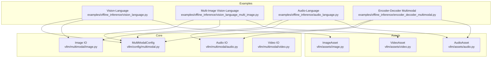
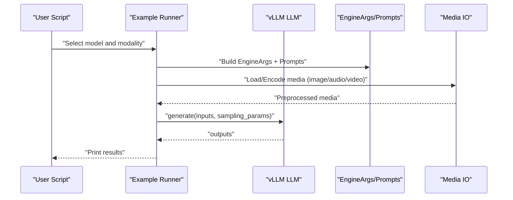
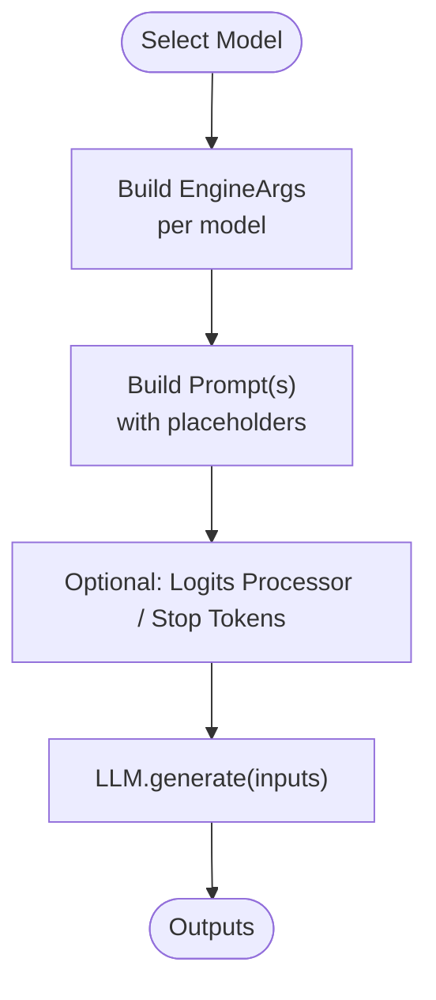
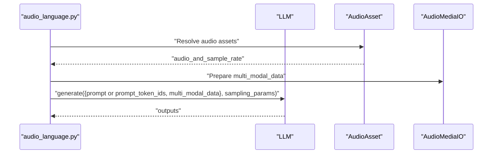
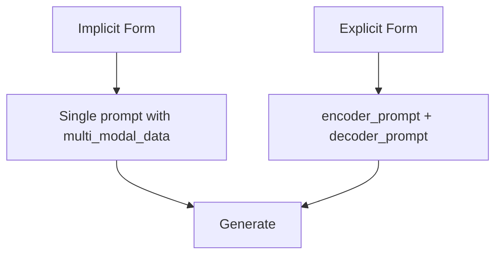
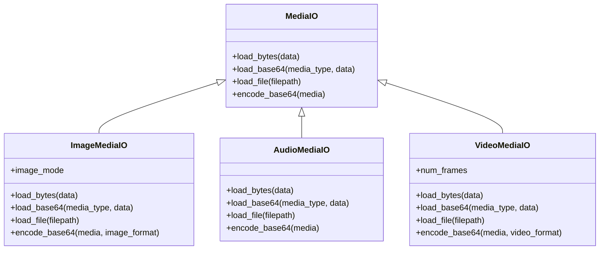
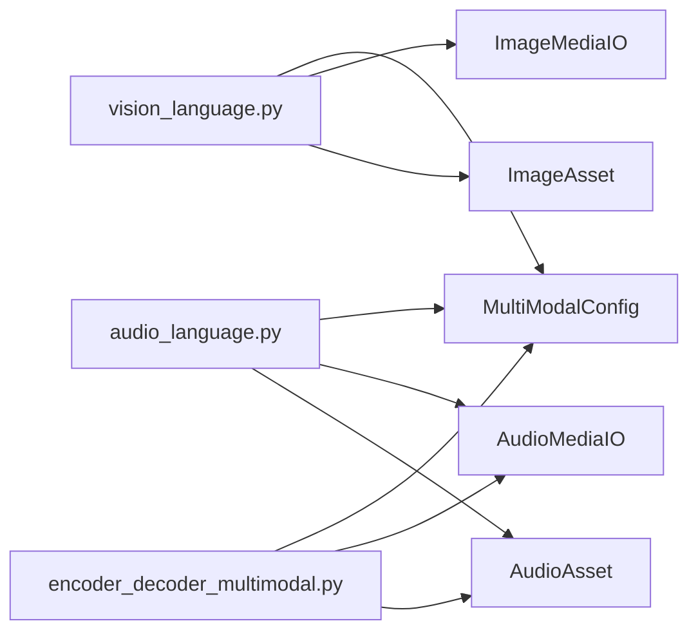

# Multimodal Examples

<cite>
**Referenced Files in This Document**
- [vision_language.py](file://examples/offline_inference/vision_language.py)
- [vision_language_multi_image.py](file://examples/offline_inference/vision_language_multi_image.py)
- [audio_language.py](file://examples/offline_inference/audio_language.py)
- [encoder_decoder_multimodal.py](file://examples/offline_inference/encoder_decoder_multimodal.py)
- [multimodal.py](file://vllm/config/multimodal.py)
- [image.py](file://vllm/multimodal/image.py)
- [audio.py](file://vllm/multimodal/audio.py)
- [video.py](file://vllm/multimodal/video.py)
- [image_asset.py](file://vllm/assets/image.py)
- [audio_asset.py](file://vllm/assets/audio.py)
- [video_asset.py](file://vllm/assets/video.py)
</cite>

## Table of Contents
1. [Introduction](#introduction)
2. [Project Structure](#project-structure)
3. [Core Components](#core-components)
4. [Architecture Overview](#architecture-overview)
5. [Detailed Component Analysis](#detailed-component-analysis)
6. [Dependency Analysis](#dependency-analysis)
7. [Performance Considerations](#performance-considerations)
8. [Troubleshooting Guide](#troubleshooting-guide)
9. [Conclusion](#conclusion)
10. [Appendices](#appendices)

## Introduction
This document presents practical, code-backed examples for multimodal inference using the vLLM library. It focuses on:
- Vision-language models (image-text generation)
- Audio-language models (audio transcription)
- Encoder-decoder multimodal architectures (explicit/implicit prompts)
It explains input preprocessing, modality handling, cross-modal processing patterns, configuration options, batch processing strategies, and output formatting. Practical examples demonstrate image-text generation, audio transcription, video understanding, and building custom multimodal workflows. Guidance is provided on model selection, input validation, and performance optimization for multimodal scenarios.

## Project Structure
The multimodal examples are organized under the offline inference examples and leverage core multimodal infrastructure:
- Offline inference examples:
  - Vision-language: [vision_language.py](file://examples/offline_inference/vision_language.py), [vision_language_multi_image.py](file://examples/offline_inference/vision_language_multi_image.py)
  - Audio-language: [audio_language.py](file://examples/offline_inference/audio_language.py)
  - Encoder-decoder multimodal: [encoder_decoder_multimodal.py](file://examples/offline_inference/encoder_decoder_multimodal.py)
- Multimodal configuration and IO:
  - Configuration: [multimodal.py](file://vllm/config/multimodal.py)
  - Media IO: [image.py](file://vllm/multimodal/image.py), [audio.py](file://vllm/multimodal/audio.py), [video.py](file://vllm/multimodal/video.py)
- Assets:
  - Images: [image_asset.py](file://vllm/assets/image.py)
  - Audio: [audio_asset.py](file://vllm/assets/audio.py)
  - Video: [video_asset.py](file://vllm/assets/video.py)

**Diagram sources**
- [vision_language.py](file://examples/offline_inference/vision_language.py#L1-L200)
- [vision_language_multi_image.py](file://examples/offline_inference/vision_language_multi_image.py#L1-L120)
- [audio_language.py](file://examples/offline_inference/audio_language.py#L1-L120)
- [encoder_decoder_multimodal.py](file://examples/offline_inference/encoder_decoder_multimodal.py#L1-L80)
- [multimodal.py](file://vllm/config/multimodal.py#L53-L148)
- [image.py](file://vllm/multimodal/image.py#L46-L118)
- [audio.py](file://vllm/multimodal/audio.py#L90-L148)
- [video.py](file://vllm/multimodal/video.py#L270-L341)
- [image_asset.py](file://vllm/assets/image.py#L1-L60)
- [audio_asset.py](file://vllm/assets/audio.py#L1-L44)
- [video_asset.py](file://vllm/assets/video.py#L1-L150)

**Section sources**
- [vision_language.py](file://examples/offline_inference/vision_language.py#L1-L200)
- [audio_language.py](file://examples/offline_inference/audio_language.py#L1-L120)
- [encoder_decoder_multimodal.py](file://examples/offline_inference/encoder_decoder_multimodal.py#L1-L80)
- [multimodal.py](file://vllm/config/multimodal.py#L53-L148)

## Core Components
- MultiModalConfig controls multimodal behavior:
  - Per-modality limits, processor kwargs, caching, encoder attention backend, pruning, and encoder tensor-parallel modes.
- Media IO abstractions:
  - ImageMediaIO, AudioMediaIO, VideoMediaIO provide standardized loading, encoding, and preprocessing for images, audio, and videos.
- Assets:
  - Pre-packaged assets for images, audio, and video simplify example runs.

Key configuration highlights:
- limit_per_prompt: Enforces maximum items per modality per prompt.
- mm_processor_kwargs: Passes model-specific processor overrides.
- mm_processor_cache_*: Controls processor cache behavior and size.
- mm_encoder_attn_backend: Selects attention backend for encoders.
- video_pruning_rate: Enables Efficient Video Sampling pruning.

**Section sources**
- [multimodal.py](file://vllm/config/multimodal.py#L53-L148)
- [image.py](file://vllm/multimodal/image.py#L46-L118)
- [audio.py](file://vllm/multimodal/audio.py#L90-L148)
- [video.py](file://vllm/multimodal/video.py#L270-L341)
- [image_asset.py](file://vllm/assets/image.py#L1-L60)
- [audio_asset.py](file://vllm/assets/audio.py#L1-L44)
- [video_asset.py](file://vllm/assets/video.py#L1-L150)

## Architecture Overview
The examples orchestrate multimodal inference by constructing EngineArgs and prompts, then invoking LLM.generate with optional multi_modal_data. The pipeline integrates:
- Prompt construction tailored to each model family
- Modality-specific preprocessing via Media IO
- Optional LoRA requests and logits processors
- Batched generation with SamplingParams

**Diagram sources**
- [vision_language.py](file://examples/offline_inference/vision_language.py#L41-L120)
- [audio_language.py](file://examples/offline_inference/audio_language.py#L448-L540)
- [encoder_decoder_multimodal.py](file://examples/offline_inference/encoder_decoder_multimodal.py#L86-L134)
- [image.py](file://vllm/multimodal/image.py#L90-L118)
- [audio.py](file://vllm/multimodal/audio.py#L90-L148)
- [video.py](file://vllm/multimodal/video.py#L270-L341)

## Detailed Component Analysis

### Vision-Language Models (Image-Text Generation)
Patterns:
- Model-specific prompt templates and placeholders
- Per-model EngineArgs (max_model_len, max_num_seqs, dtype, trust_remote_code)
- Optional logits processors and stop token IDs
- Multi-image support via limit_mm_per_prompt

Representative flows:
- Aria, Aya Vision, Bee, BLIP-2, Chameleon, Command-A-Vision, Deepseek-VL2, Deepseek-OCR, Dots-OCR, Ernie4.5-VL, Fuyu, Gemma3/Gemma3N, GLM-4v, GLM-4.1V/4.5V, H2OVL-Mississippi, HunyuanOCR, HyperCLOVAX-SEED-Vision, Idefics3, Intern-S1, InternVL, Keye-VL

**Diagram sources**
- [vision_language.py](file://examples/offline_inference/vision_language.py#L41-L200)
- [vision_language.py](file://examples/offline_inference/vision_language.py#L206-L271)
- [vision_language.py](file://examples/offline_inference/vision_language.py#L290-L364)
- [vision_language.py](file://examples/offline_inference/vision_language.py#L366-L423)
- [vision_language.py](file://examples/offline_inference/vision_language.py#L425-L533)
- [vision_language.py](file://examples/offline_inference/vision_language.py#L535-L670)
- [vision_language.py](file://examples/offline_inference/vision_language.py#L671-L770)
- [vision_language.py](file://examples/offline_inference/vision_language.py#L772-L800)

Practical example references:
- Single image generation: [vision_language.py](file://examples/offline_inference/vision_language.py#L41-L120)
- Multi-image generation: [vision_language_multi_image.py](file://examples/offline_inference/vision_language_multi_image.py#L1-L120)
- OCR workflows: [vision_language.py](file://examples/offline_inference/vision_language.py#L230-L271)

**Section sources**
- [vision_language.py](file://examples/offline_inference/vision_language.py#L41-L200)
- [vision_language.py](file://examples/offline_inference/vision_language.py#L206-L271)
- [vision_language.py](file://examples/offline_inference/vision_language.py#L290-L364)
- [vision_language.py](file://examples/offline_inference/vision_language.py#L366-L423)
- [vision_language.py](file://examples/offline_inference/vision_language.py#L425-L533)
- [vision_language.py](file://examples/offline_inference/vision_language.py#L535-L670)
- [vision_language.py](file://examples/offline_inference/vision_language.py#L671-L770)
- [vision_language.py](file://examples/offline_inference/vision_language.py#L772-L800)
- [vision_language_multi_image.py](file://examples/offline_inference/vision_language_multi_image.py#L1-L120)

### Audio-Language Models (Audio Transcription)
Patterns:
- Model-specific placeholders for audio tokens
- LoRA requests for speech-specialized adapters (e.g., Granite Speech)
- Tokenizer-based chat templates for some models
- Explicit token IDs for certain models (e.g., Voxtral)
- Whisper supports encoder/decoder prompt forms

**Diagram sources**
- [audio_language.py](file://examples/offline_inference/audio_language.py#L448-L540)
- [audio_asset.py](file://vllm/assets/audio.py#L1-L44)
- [audio.py](file://vllm/multimodal/audio.py#L90-L148)

Practical example references:
- AudioFlamingo3, Gemma3N, Granite Speech, MiniCPM-O, Phi-4-multimodal, Qwen2-Audio, Qwen2.5-Omni, Ultravox, Voxtral, Whisper
- Encoder-decoder Whisper: [encoder_decoder_multimodal.py](file://examples/offline_inference/encoder_decoder_multimodal.py#L24-L57)

**Section sources**
- [audio_language.py](file://examples/offline_inference/audio_language.py#L45-L120)
- [audio_language.py](file://examples/offline_inference/audio_language.py#L123-L214)
- [audio_language.py](file://examples/offline_inference/audio_language.py#L216-L310)
- [audio_language.py](file://examples/offline_inference/audio_language.py#L311-L391)
- [audio_language.py](file://examples/offline_inference/audio_language.py#L392-L410)
- [encoder_decoder_multimodal.py](file://examples/offline_inference/encoder_decoder_multimodal.py#L24-L57)
- [audio_asset.py](file://vllm/assets/audio.py#L1-L44)
- [audio.py](file://vllm/multimodal/audio.py#L90-L148)

### Encoder-Decoder Multimodal Architectures
Patterns:
- Implicit prompt: prompt string + multi_modal_data
- Explicit encoder/decoder prompts: separate encoder_prompt and decoder_prompt
- Whisper example demonstrates both forms

**Diagram sources**
- [encoder_decoder_multimodal.py](file://examples/offline_inference/encoder_decoder_multimodal.py#L24-L57)

**Section sources**
- [encoder_decoder_multimodal.py](file://examples/offline_inference/encoder_decoder_multimodal.py#L24-L57)

### Cross-Modal Processing Patterns
- Image preprocessing:
  - Mode conversion (RGBA to RGB), rescaling, and base64 encoding
- Audio preprocessing:
  - Resampling via librosa or scipy, base64 encoding
- Video preprocessing:
  - Backend-agnostic loaders (OpenCV, dynamic sampling), frame sampling, resizing, and metadata
- Unified media IO interface ensures consistent handling across modalities

**Diagram sources**
- [image.py](file://vllm/multimodal/image.py#L46-L118)
- [audio.py](file://vllm/multimodal/audio.py#L90-L148)
- [video.py](file://vllm/multimodal/video.py#L270-L341)

**Section sources**
- [image.py](file://vllm/multimodal/image.py#L1-L143)
- [audio.py](file://vllm/multimodal/audio.py#L1-L148)
- [video.py](file://vllm/multimodal/video.py#L1-L341)

## Dependency Analysis
- Examples depend on:
  - vllm.LLM and EngineArgs for inference
  - vllm.multimodal.* for media IO
  - vllm.assets.* for packaged assets
  - Transformers tokenizer for chat templates (when required)
- Configuration:
  - MultiModalConfig governs limits, processor kwargs, caching, and encoder optimization
  - Examples override per-model defaults via EngineArgs and limit_mm_per_prompt

**Diagram sources**
- [vision_language.py](file://examples/offline_inference/vision_language.py#L1-L120)
- [audio_language.py](file://examples/offline_inference/audio_language.py#L1-L120)
- [encoder_decoder_multimodal.py](file://examples/offline_inference/encoder_decoder_multimodal.py#L1-L80)
- [multimodal.py](file://vllm/config/multimodal.py#L53-L148)
- [image.py](file://vllm/multimodal/image.py#L46-L118)
- [audio.py](file://vllm/multimodal/audio.py#L90-L148)
- [image_asset.py](file://vllm/assets/image.py#L1-L60)
- [audio_asset.py](file://vllm/assets/audio.py#L1-L44)

**Section sources**
- [vision_language.py](file://examples/offline_inference/vision_language.py#L1-L120)
- [audio_language.py](file://examples/offline_inference/audio_language.py#L1-L120)
- [encoder_decoder_multimodal.py](file://examples/offline_inference/encoder_decoder_multimodal.py#L1-L80)
- [multimodal.py](file://vllm/config/multimodal.py#L53-L148)

## Performance Considerations
- Memory footprint:
  - Adjust max_model_len and max_num_seqs per model to fit GPU memory.
  - Use dtype and enforce_eager selectively to balance speed and memory.
- Batch processing:
  - Replicate inputs for batch inference; ensure LoRA requests are replicated accordingly.
- Modality limits:
  - Use limit_mm_per_prompt to constrain per-prompt media counts and reduce memory pressure.
- Processor cache:
  - Configure mm_processor_cache_gb and cache type to trade off startup time vs. runtime memory.
- Video optimization:
  - Control video_pruning_rate and sampling via media-io-kwargs to reduce token count.
- Encoder optimization:
  - Choose mm_encoder_attn_backend and encoder TP mode per model support.

[No sources needed since this section provides general guidance]

## Troubleshooting Guide
Common issues and resolutions:
- Out-of-memory errors:
  - Reduce max_model_len, max_num_seqs, or use smaller dtype.
  - Limit media counts per prompt via limit_mm_per_prompt.
- Incorrect stop tokens:
  - Verify model-specific stop token IDs or tokens from tokenizer.
- Audio transcription differences:
  - Some models require LoRA adapters (e.g., Granite Speech).
- OCR accuracy:
  - Use custom logits processors (e.g., NGramPerReqLogitsProcessor) and avoid skipping special tokens for optimal OCR.
- Video sampling problems:
  - Ensure video backend and sampling parameters are set appropriately; verify metadata and frame indices.

**Section sources**
- [vision_language.py](file://examples/offline_inference/vision_language.py#L230-L271)
- [audio_language.py](file://examples/offline_inference/audio_language.py#L92-L121)
- [encoder_decoder_multimodal.py](file://examples/offline_inference/encoder_decoder_multimodal.py#L24-L57)

## Conclusion
The examples demonstrate robust, reusable patterns for multimodal inference in vLLM:
- Construct EngineArgs and prompts per model family
- Use Media IO for consistent preprocessing
- Apply MultiModalConfig for limits, caching, and encoder optimization
- Employ batch processing and LoRA when needed
These patterns enable reliable image-text generation, audio transcription, video understanding, and custom multimodal workflows.

[No sources needed since this section summarizes without analyzing specific files]

## Appendices

### Practical Examples Index
- Image-text generation:
  - Single image: [vision_language.py](file://examples/offline_inference/vision_language.py#L41-L120)
  - Multi-image: [vision_language_multi_image.py](file://examples/offline_inference/vision_language_multi_image.py#L1-L120)
- Audio transcription:
  - General audio-language: [audio_language.py](file://examples/offline_inference/audio_language.py#L448-L540)
  - Whisper encoder/decoder: [encoder_decoder_multimodal.py](file://examples/offline_inference/encoder_decoder_multimodal.py#L24-L57)
- Video understanding:
  - Video loader backends and sampling: [video.py](file://vllm/multimodal/video.py#L119-L209)
  - Dynamic sampling: [video.py](file://vllm/multimodal/video.py#L198-L268)

**Section sources**
- [vision_language.py](file://examples/offline_inference/vision_language.py#L41-L120)
- [vision_language_multi_image.py](file://examples/offline_inference/vision_language_multi_image.py#L1-L120)
- [audio_language.py](file://examples/offline_inference/audio_language.py#L448-L540)
- [encoder_decoder_multimodal.py](file://examples/offline_inference/encoder_decoder_multimodal.py#L24-L57)
- [video.py](file://vllm/multimodal/video.py#L119-L209)
- [video.py](file://vllm/multimodal/video.py#L198-L268)