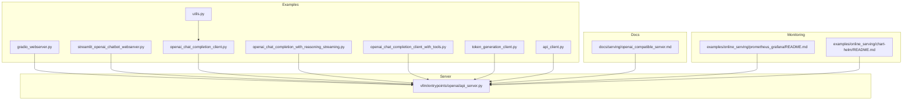
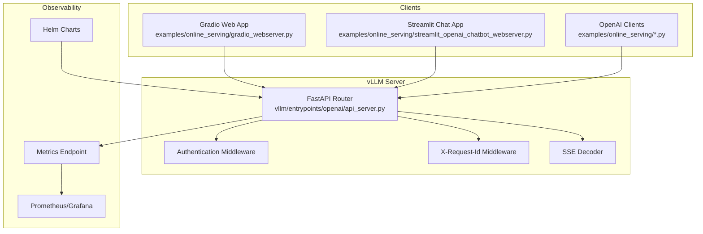
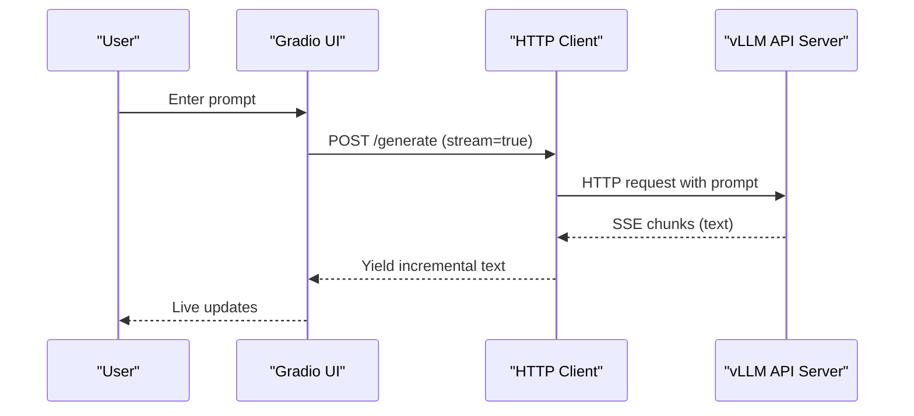
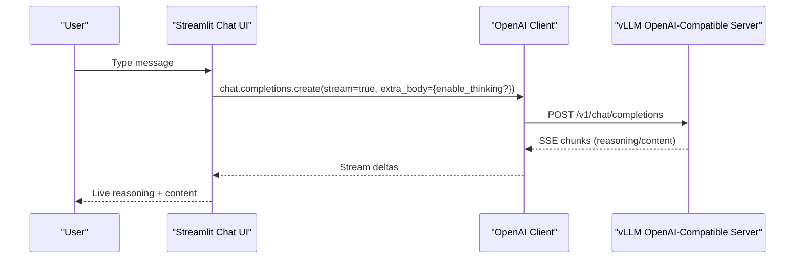
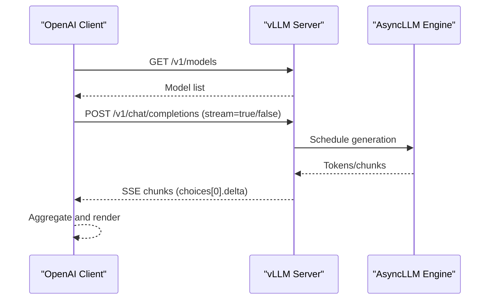
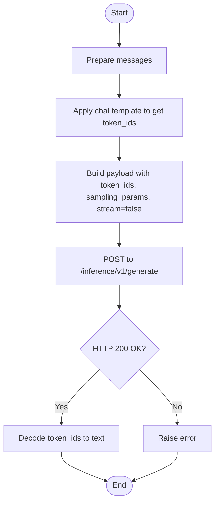
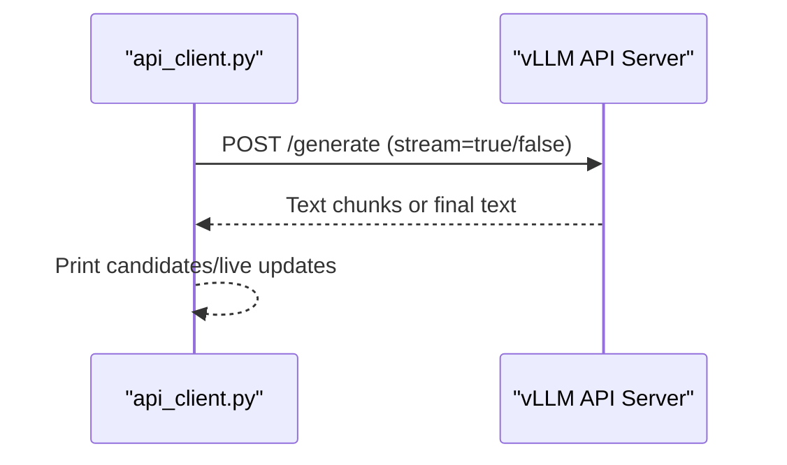
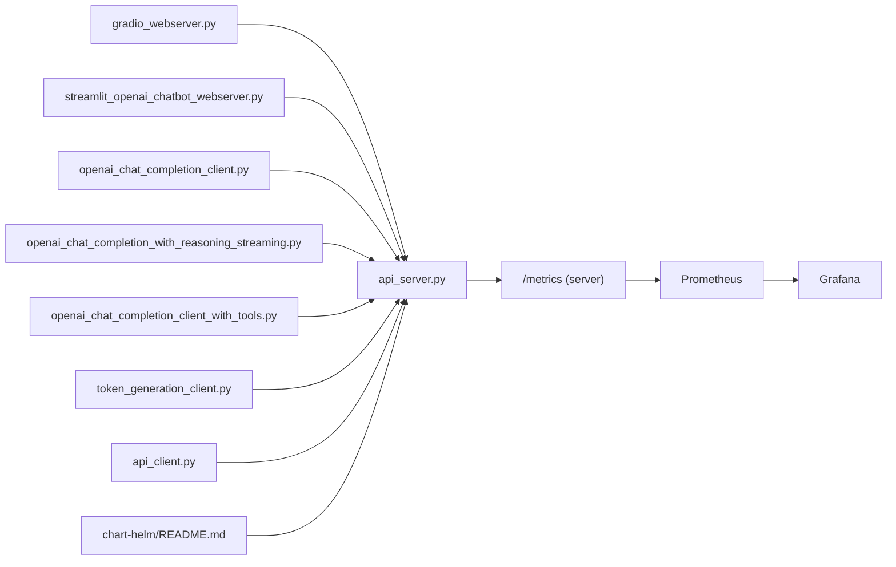

# Online Serving Examples

<cite>
**Referenced Files in This Document**
- [gradio_webserver.py](file://examples/online_serving/gradio_webserver.py)
- [streamlit_openai_chatbot_webserver.py](file://examples/online_serving/streamlit_openai_chatbot_webserver.py)
- [openai_chat_completion_client.py](file://examples/online_serving/openai_chat_completion_client.py)
- [openai_chat_completion_with_reasoning_streaming.py](file://examples/online_serving/openai_chat_completion_with_reasoning_streaming.py)
- [openai_chat_completion_client_with_tools.py](file://examples/online_serving/openai_chat_completion_client_with_tools.py)
- [token_generation_client.py](file://examples/online_serving/token_generation_client.py)
- [api_client.py](file://examples/online_serving/api_client.py)
- [utils.py](file://examples/online_serving/utils.py)
- [api_server.py](file://vllm/entrypoints/openai/api_server.py)
- [openai_compatible_server.md](file://docs/serving/openai_compatible_server.md)
- [prometheus_grafana README.md](file://examples/online_serving/prometheus_grafana/README.md)
- [chart-helm README.md](file://examples/online_serving/chart-helm/README.md)
- [test_sagemaker_middleware_integration.py](file://tests/entrypoints/sagemaker/test_sagemaker_middleware_integration.py)
</cite>

## Table of Contents
1. [Introduction](#introduction)
2. [Project Structure](#project-structure)
3. [Core Components](#core-components)
4. [Architecture Overview](#architecture-overview)
5. [Detailed Component Analysis](#detailed-component-analysis)
6. [Dependency Analysis](#dependency-analysis)
7. [Performance Considerations](#performance-considerations)
8. [Troubleshooting Guide](#troubleshooting-guide)
9. [Conclusion](#conclusion)
10. [Appendices](#appendices)

## Introduction
This document presents practical, production-focused guidance for online serving with vLLM. It covers:
- Web server frontends using Gradio and Streamlit
- OpenAI-compatible API clients and token generation interfaces
- Deployment patterns, API endpoint configurations, and client–server communication
- Authentication, rate limiting, and scalability considerations
- Real-time inference, streaming responses, and monitoring/logging/troubleshooting

The goal is to help you build reliable, scalable, and observable online serving systems using vLLM’s OpenAI-compatible server and example clients.

## Project Structure
The online serving examples are organized under examples/online_serving and demonstrate:
- Frontend web apps (Gradio and Streamlit)
- OpenAI-compatible clients for chat, completions, tools, reasoning, and multimodal tasks
- Token generation interface examples
- Monitoring and deployment helpers (Prometheus/Grafana, Helm charts)

**Diagram sources**
- [gradio_webserver.py](file://examples/online_serving/gradio_webserver.py#L1-L76)
- [streamlit_openai_chatbot_webserver.py](file://examples/online_serving/streamlit_openai_chatbot_webserver.py#L1-L312)
- [openai_chat_completion_client.py](file://examples/online_serving/openai_chat_completion_client.py#L1-L65)
- [openai_chat_completion_with_reasoning_streaming.py](file://examples/online_serving/openai_chat_completion_with_reasoning_streaming.py#L1-L74)
- [openai_chat_completion_client_with_tools.py](file://examples/online_serving/openai_chat_completion_client_with_tools.py#L1-L196)
- [token_generation_client.py](file://examples/online_serving/token_generation_client.py#L1-L50)
- [api_client.py](file://examples/online_serving/api_client.py#L1-L94)
- [utils.py](file://examples/online_serving/utils.py#L1-L27)
- [api_server.py](file://vllm/entrypoints/openai/api_server.py#L1-L1381)
- [openai_compatible_server.md](file://docs/serving/openai_compatible_server.md#L1-L962)
- [prometheus_grafana README.md](file://examples/online_serving/prometheus_grafana/README.md#L1-L58)
- [chart-helm README.md](file://examples/online_serving/chart-helm/README.md#L1-L34)

**Section sources**
- [gradio_webserver.py](file://examples/online_serving/gradio_webserver.py#L1-L76)
- [streamlit_openai_chatbot_webserver.py](file://examples/online_serving/streamlit_openai_chatbot_webserver.py#L1-L312)
- [openai_chat_completion_client.py](file://examples/online_serving/openai_chat_completion_client.py#L1-L65)
- [openai_chat_completion_with_reasoning_streaming.py](file://examples/online_serving/openai_chat_completion_with_reasoning_streaming.py#L1-L74)
- [openai_chat_completion_client_with_tools.py](file://examples/online_serving/openai_chat_completion_client_with_tools.py#L1-L196)
- [token_generation_client.py](file://examples/online_serving/token_generation_client.py#L1-L50)
- [api_client.py](file://examples/online_serving/api_client.py#L1-L94)
- [utils.py](file://examples/online_serving/utils.py#L1-L27)
- [api_server.py](file://vllm/entrypoints/openai/api_server.py#L1-L1381)
- [openai_compatible_server.md](file://docs/serving/openai_compatible_server.md#L1-L962)
- [prometheus_grafana README.md](file://examples/online_serving/prometheus_grafana/README.md#L1-L58)
- [chart-helm README.md](file://examples/online_serving/chart-helm/README.md#L1-L34)

## Core Components
- OpenAI-compatible server: Implements OpenAI-style endpoints, streaming, and auxiliary APIs. It includes authentication middleware, request ID propagation, SSE decoding, and metrics headers.
- Example clients:
  - Gradio web app that posts to the server generate endpoint and streams responses.
  - Streamlit chat app using the OpenAI client against /v1 endpoints with streaming and reasoning support.
  - OpenAI client scripts for chat, completions, tools, and reasoning streaming.
  - Token generation client that posts token IDs and receives decoded text.
  - Low-level HTTP client for the legacy generate endpoint.

Key runtime behaviors:
- Streaming: Server emits Server-Sent Events (SSE) for streaming responses; clients consume and render progressively.
- Authentication: Bearer token verification for /v1 endpoints; OPTIONS and non-/v1 paths bypass checks.
- Observability: Metrics endpoint, Prometheus/Grafana integration, and Helm charts for Kubernetes.

**Section sources**
- [api_server.py](file://vllm/entrypoints/openai/api_server.py#L281-L361)
- [api_server.py](file://vllm/entrypoints/openai/api_server.py#L476-L561)
- [api_server.py](file://vllm/entrypoints/openai/api_server.py#L654-L700)
- [api_server.py](file://vllm/entrypoints/openai/api_server.py#L702-L731)
- [api_server.py](file://vllm/entrypoints/openai/api_server.py#L733-L800)
- [api_server.py](file://vllm/entrypoints/openai/api_server.py#L800-L856)
- [openai_compatible_server.md](file://docs/serving/openai_compatible_server.md#L1-L175)
- [prometheus_grafana README.md](file://examples/online_serving/prometheus_grafana/README.md#L1-L58)
- [chart-helm README.md](file://examples/online_serving/chart-helm/README.md#L1-L34)

## Architecture Overview
The serving stack connects clients to the vLLM OpenAI-compatible server, which orchestrates model execution and returns responses (including streaming).

**Diagram sources**
- [gradio_webserver.py](file://examples/online_serving/gradio_webserver.py#L1-L76)
- [streamlit_openai_chatbot_webserver.py](file://examples/online_serving/streamlit_openai_chatbot_webserver.py#L1-L312)
- [openai_chat_completion_client.py](file://examples/online_serving/openai_chat_completion_client.py#L1-L65)
- [openai_chat_completion_with_reasoning_streaming.py](file://examples/online_serving/openai_chat_completion_with_reasoning_streaming.py#L1-L74)
- [openai_chat_completion_client_with_tools.py](file://examples/online_serving/openai_chat_completion_client_with_tools.py#L1-L196)
- [token_generation_client.py](file://examples/online_serving/token_generation_client.py#L1-L50)
- [api_server.py](file://vllm/entrypoints/openai/api_server.py#L281-L361)
- [api_server.py](file://vllm/entrypoints/openai/api_server.py#L476-L561)
- [api_server.py](file://vllm/entrypoints/openai/api_server.py#L654-L700)
- [api_server.py](file://vllm/entrypoints/openai/api_server.py#L702-L731)
- [api_server.py](file://vllm/entrypoints/openai/api_server.py#L733-L800)
- [api_server.py](file://vllm/entrypoints/openai/api_server.py#L800-L856)
- [prometheus_grafana README.md](file://examples/online_serving/prometheus_grafana/README.md#L1-L58)
- [chart-helm README.md](file://examples/online_serving/chart-helm/README.md#L1-L34)

## Detailed Component Analysis

### Gradio Web Server
- Purpose: Minimal web UI that posts prompts to the server generate endpoint and streams partial outputs.
- Behavior:
  - Sends POST with prompt, max tokens, and stream flag.
  - Iterates over streamed chunks and yields incremental text to the UI.
- Configuration: Host/port and model URL are configurable via CLI arguments.

**Diagram sources**
- [gradio_webserver.py](file://examples/online_serving/gradio_webserver.py#L29-L45)
- [api_server.py](file://vllm/entrypoints/openai/api_server.py#L281-L361)

**Section sources**
- [gradio_webserver.py](file://examples/online_serving/gradio_webserver.py#L1-L76)

### Streamlit OpenAI Chatbot Web Server
- Purpose: Chat UI using the OpenAI client against /v1 endpoints with streaming and optional reasoning visualization.
- Behavior:
  - Manages multiple chat sessions with timestamps.
  - Streams reasoning and content separately when supported.
  - Uses environment variables for API base and key.
  - Detects server reasoning support and toggles UI accordingly.

**Diagram sources**
- [streamlit_openai_chatbot_webserver.py](file://examples/online_serving/streamlit_openai_chatbot_webserver.py#L110-L179)
- [api_server.py](file://vllm/entrypoints/openai/api_server.py#L476-L561)

**Section sources**
- [streamlit_openai_chatbot_webserver.py](file://examples/online_serving/streamlit_openai_chatbot_webserver.py#L1-L312)

### OpenAI-Compatible API Clients
- Chat and Completions:
  - Demonstrates listing models and invoking chat/completions with optional streaming.
- Tools:
  - Shows tool definitions, streaming tool call deltas, and assembling arguments across chunks.
- Reasoning Streaming:
  - Streams reasoning and content concurrently, handling optional presence of content.

**Diagram sources**
- [openai_chat_completion_client.py](file://examples/online_serving/openai_chat_completion_client.py#L27-L61)
- [openai_chat_completion_client_with_tools.py](file://examples/online_serving/openai_chat_completion_client_with_tools.py#L126-L191)
- [openai_chat_completion_with_reasoning_streaming.py](file://examples/online_serving/openai_chat_completion_with_reasoning_streaming.py#L36-L71)
- [api_server.py](file://vllm/entrypoints/openai/api_server.py#L300-L306)
- [api_server.py](file://vllm/entrypoints/openai/api_server.py#L476-L561)

**Section sources**
- [openai_chat_completion_client.py](file://examples/online_serving/openai_chat_completion_client.py#L1-L65)
- [openai_chat_completion_client_with_tools.py](file://examples/online_serving/openai_chat_completion_client_with_tools.py#L1-L196)
- [openai_chat_completion_with_reasoning_streaming.py](file://examples/online_serving/openai_chat_completion_with_reasoning_streaming.py#L1-L74)

### Token Generation Interface
- Purpose: Demonstrates token-level generation and decoding via a dedicated endpoint.
- Behavior:
  - Applies chat template with tokenizer.
  - Posts token IDs and sampling parameters.
  - Receives token IDs and decodes to text.

**Diagram sources**
- [token_generation_client.py](file://examples/online_serving/token_generation_client.py#L24-L46)

**Section sources**
- [token_generation_client.py](file://examples/online_serving/token_generation_client.py#L1-L50)

### Legacy HTTP Client (Low-level)
- Purpose: Sends prompts to the generate endpoint and prints beam candidates, optionally streaming.
- Behavior:
  - Builds payload with prompt, n, temperature, max tokens.
  - Streams and parses chunks; clears previous lines for live updates.

**Diagram sources**
- [api_client.py](file://examples/online_serving/api_client.py#L27-L56)
- [api_server.py](file://vllm/entrypoints/openai/api_server.py#L281-L361)

**Section sources**
- [api_client.py](file://examples/online_serving/api_client.py#L1-L94)

## Dependency Analysis
- Frontends depend on the OpenAI-compatible server endpoints (/v1/*) and the legacy generate endpoint for the Gradio example.
- Server enforces authentication for /v1 endpoints and injects request IDs; it streams responses using SSE.
- Monitoring stack (Prometheus/Grafana) consumes server metrics; Helm charts assist in Kubernetes deployments.

**Diagram sources**
- [gradio_webserver.py](file://examples/online_serving/gradio_webserver.py#L1-L76)
- [streamlit_openai_chatbot_webserver.py](file://examples/online_serving/streamlit_openai_chatbot_webserver.py#L1-L312)
- [openai_chat_completion_client.py](file://examples/online_serving/openai_chat_completion_client.py#L1-L65)
- [openai_chat_completion_with_reasoning_streaming.py](file://examples/online_serving/openai_chat_completion_with_reasoning_streaming.py#L1-L74)
- [openai_chat_completion_client_with_tools.py](file://examples/online_serving/openai_chat_completion_client_with_tools.py#L1-L196)
- [token_generation_client.py](file://examples/online_serving/token_generation_client.py#L1-L50)
- [api_client.py](file://examples/online_serving/api_client.py#L1-L94)
- [api_server.py](file://vllm/entrypoints/openai/api_server.py#L281-L361)
- [prometheus_grafana README.md](file://examples/online_serving/prometheus_grafana/README.md#L1-L58)
- [chart-helm README.md](file://examples/online_serving/chart-helm/README.md#L1-L34)

**Section sources**
- [api_server.py](file://vllm/entrypoints/openai/api_server.py#L281-L361)
- [prometheus_grafana README.md](file://examples/online_serving/prometheus_grafana/README.md#L1-L58)
- [chart-helm README.md](file://examples/online_serving/chart-helm/README.md#L1-L34)

## Performance Considerations
- Streaming efficiency: Server-side SSE minimizes latency for real-time UI updates; ensure clients handle partial chunks and backpressure.
- Concurrency and batching: Tune server concurrency and request rates to avoid GPU saturation; leverage autoscaling in production deployments.
- Token-level generation: Useful for specialized pipelines; ensure tokenizer alignment and prompt formatting.
- Observability: Enable metrics and dashboards to track latency, throughput, and GPU utilization; use Prometheus/Grafana for alerting.

[No sources needed since this section provides general guidance]

## Troubleshooting Guide
Common issues and remedies:
- Authentication failures:
  - Ensure Authorization header matches configured token for /v1 endpoints; OPTIONS and non-/v1 paths bypass checks.
- No models returned:
  - Confirm server is running and reachable; use the helper to fetch the first model and validate base URL and API key.
- Streaming anomalies:
  - Server decodes SSE robustly; verify client-side SSE handling and network interruptions.
- Monitoring gaps:
  - Check Prometheus scraping and Grafana data source configuration; validate metrics endpoint exposure.

**Section sources**
- [api_server.py](file://vllm/entrypoints/openai/api_server.py#L654-L700)
- [utils.py](file://examples/online_serving/utils.py#L1-L27)
- [prometheus_grafana README.md](file://examples/online_serving/prometheus_grafana/README.md#L1-L58)

## Conclusion
The examples and server implementation provide a solid foundation for building production-grade online serving:
- Use the OpenAI-compatible server for broad compatibility and streaming.
- Choose frontends (Gradio/Streamlit) aligned with your UX needs.
- Integrate monitoring and scaling via Prometheus/Grafana and Helm charts.
- Apply authentication and request ID propagation for security and observability.

[No sources needed since this section summarizes without analyzing specific files]

## Appendices

### Authentication and Rate Limiting
- Authentication:
  - Bearer token verification for /v1 endpoints; OPTIONS and non-/v1 paths are excluded.
- Rate limiting and throttling:
  - Middleware patterns demonstrated in tests indicate extensibility for customer throttling and processing hooks.

**Section sources**
- [api_server.py](file://vllm/entrypoints/openai/api_server.py#L654-L700)
- [test_sagemaker_middleware_integration.py](file://tests/entrypoints/sagemaker/test_sagemaker_middleware_integration.py#L150-L175)
- [test_sagemaker_middleware_integration.py](file://tests/entrypoints/sagemaker/test_sagemaker_middleware_integration.py#L319-L345)

### Deployment Patterns and Scalability
- Kubernetes:
  - Helm chart templates for deployment, autoscaling, services, and secrets.
- Observability:
  - Prometheus/Grafana stack with ready-to-use dashboard and metrics endpoint.

**Section sources**
- [chart-helm README.md](file://examples/online_serving/chart-helm/README.md#L1-L34)
- [prometheus_grafana README.md](file://examples/online_serving/prometheus_grafana/README.md#L1-L58)

### API Endpoint Configuration References
- OpenAI-compatible server documentation outlines supported endpoints, parameters, and extras.

**Section sources**
- [openai_compatible_server.md](file://docs/serving/openai_compatible_server.md#L1-L175)
- [openai_compatible_server.md](file://docs/serving/openai_compatible_server.md#L176-L391)
- [openai_compatible_server.md](file://docs/serving/openai_compatible_server.md#L392-L531)
- [openai_compatible_server.md](file://docs/serving/openai_compatible_server.md#L532-L700)
- [openai_compatible_server.md](file://docs/serving/openai_compatible_server.md#L700-L962)