# Specialized Workflows and Use Cases

<cite>
**Referenced Files in This Document**
- [rlhf.py](file://examples/offline_inference/rlhf.py)
- [rlhf_online_quant.py](file://examples/offline_inference/rlhf_online_quant.py)
- [rlhf_utils.py](file://examples/offline_inference/rlhf_utils.py)
- [rlhf_colocate.py](file://examples/offline_inference/rlhf_colocate.py)
- [context_extension.py](file://examples/offline_inference/context_extension.py)
- [reproducibility.py](file://examples/offline_inference/reproducibility.py)
- [simple_profiling.py](file://examples/offline_inference/simple_profiling.py)
- [save_sharded_state.py](file://examples/offline_inference/save_sharded_state.py)
- [load_sharded_state.py](file://examples/offline_inference/load_sharded_state.py)
- [rlhf.md](file://docs/training/rlhf.md)
- [trl.md](file://docs/training/trl.md)
- [optimization.md](file://docs/configuration/optimization.md)
- [reproducibility.md](file://docs/usage/reproducibility.md)
- [layerwise_profile.py](file://vllm/profiler/layerwise_profile.py)
- [visualize_layerwise_profile.py](file://tools/profiler/visualize_layerwise_profile.py)
- [initialize_dummy_weights](file://vllm/model_executor/model_loader/weight_utils.py)
- [fused_moe.py](file://vllm/model_executor/layers/fused_moe/fused_moe.py)
- [benchmark_w8a8_block_fp8.py](file://benchmarks/kernels/benchmark_w8a8_block_fp8.py)
- [benchmark_machete.py](file://benchmarks/kernels/benchmark_machete.py)
- [sparse_benchmarks.py](file://benchmarks/cutlass_benchmarks/sparse_benchmarks.py)
- [benchmark_bitblas.py](file://benchmarks/kernels/benchmark_bitblas.py)
- [phi4mm_utils.py](file://vllm/model_executor/models/phi4mm_utils.py)
- [tpu_distributed_utils.py](file://vllm/distributed/tpu_distributed_utils.py)
- [shm.cpp](file://csrc/cpu/shm.cpp)
</cite>

## Table of Contents
1. [Introduction](#introduction)
2. [Project Structure](#project-structure)
3. [Core Components](#core-components)
4. [Architecture Overview](#architecture-overview)
5. [Detailed Component Analysis](#detailed-component-analysis)
6. [Dependency Analysis](#dependency-analysis)
7. [Performance Considerations](#performance-considerations)
8. [Troubleshooting Guide](#troubleshooting-guide)
9. [Conclusion](#conclusion)
10. [Appendices](#appendices)

## Introduction
This document focuses on specialized workflows and use cases in the vLLM codebase, including:
- Reinforcement Learning from Human Feedback (RLHF) training and evaluation
- Model sharding and state management for large tensor-parallel models
- Context extension techniques for long-context models
- Reproducibility practices for scientific computing
- Profiling and performance analysis methodologies
- Weight initialization strategies and specialized model configurations
- Research-oriented workflows, experimental setups, and advanced optimization techniques
- Practical examples demonstrating large-scale experimentation and benchmarking

## Project Structure
The repository organizes specialized workflows primarily under:
- examples/offline_inference: runnable examples for RLHF, context extension, reproducibility, profiling, and sharded state management
- docs/training: integration guidance for RLHF and TRL
- docs/configuration: optimization and tuning strategies
- docs/usage: reproducibility guidance
- vllm/profiler: layer-wise profiling utilities
- tools/profiler: visualization helpers for profiling outputs
- vllm/model_executor: model loader utilities and initialization helpers
- vllm/distributed: model sharding utilities (TPU/XLA)
- csrc/cpu: shared memory utilities for inter-process coordination

```mermaid
graph TB
subgraph "Examples"
E1["examples/offline_inference/rlhf.py"]
E2["examples/offline_inference/rlhf_online_quant.py"]
E3["examples/offline_inference/rlhf_utils.py"]
E4["examples/offline_inference/rlhf_colocate.py"]
E5["examples/offline_inference/context_extension.py"]
E6["examples/offline_inference/reproducibility.py"]
E7["examples/offline_inference/simple_profiling.py"]
E8["examples/offline_inference/save_sharded_state.py"]
E9["examples/offline_inference/load_sharded_state.py"]
end
subgraph "Docs"
D1["docs/training/rlhf.md"]
D2["docs/training/trl.md"]
D3["docs/configuration/optimization.md"]
D4["docs/usage/reproducibility.md"]
end
subgraph "Profiler"
P1["vllm/profiler/layerwise_profile.py"]
P2["tools/profiler/visualize_layerwise_profile.py"]
end
subgraph "Model Loader & Init"
M1["vllm/model_executor/model_loader/weight_utils.py"]
M2["vllm/model_executor/models/phi4mm_utils.py"]
end
subgraph "Distributed"
R1["vllm/distributed/tpu_distributed_utils.py"]
R2["csrc/cpu/shm.cpp"]
end
subgraph "Benchmarks"
B1["benchmarks/kernels/benchmark_w8a8_block_fp8.py"]
B2["benchmarks/kernels/benchmark_machete.py"]
B3["benchmarks/cutlass_benchmarks/sparse_benchmarks.py"]
B4["benchmarks/kernels/benchmark_bitblas.py"]
end
E1 --- D1
E2 --- D1
E3 --- D1
E4 --- D1
E5 --- D3
E6 --- D4
E7 --- P1
P1 --- P2
E8 --- E9
E8 --- M1
E9 --- M1
R1 --- M2
B1 --- B2
B3 --- B4
```

**Diagram sources**
- [rlhf.py](file://examples/offline_inference/rlhf.py#L1-L147)
- [rlhf_online_quant.py](file://examples/offline_inference/rlhf_online_quant.py#L1-L140)
- [rlhf_utils.py](file://examples/offline_inference/rlhf_utils.py#L1-L169)
- [rlhf_colocate.py](file://examples/offline_inference/rlhf_colocate.py#L1-L252)
- [context_extension.py](file://examples/offline_inference/context_extension.py#L1-L69)
- [reproducibility.py](file://examples/offline_inference/reproducibility.py#L1-L47)
- [simple_profiling.py](file://examples/offline_inference/simple_profiling.py#L1-L53)
- [save_sharded_state.py](file://examples/offline_inference/save_sharded_state.py#L1-L88)
- [load_sharded_state.py](file://examples/offline_inference/load_sharded_state.py#L1-L95)
- [rlhf.md](file://docs/training/rlhf.md#L1-L28)
- [trl.md](file://docs/training/trl.md#L1-L55)
- [optimization.md](file://docs/configuration/optimization.md#L1-L289)
- [reproducibility.md](file://docs/usage/reproducibility.md#L1-L33)
- [layerwise_profile.py](file://vllm/profiler/layerwise_profile.py#L332-L392)
- [visualize_layerwise_profile.py](file://tools/profiler/visualize_layerwise_profile.py#L428-L465)
- [weight_utils.py](file://vllm/model_executor/model_loader/weight_utils.py#L1040-L1054)
- [phi4mm_utils.py](file://vllm/model_executor/models/phi4mm_utils.py#L1437-L1460)
- [tpu_distributed_utils.py](file://vllm/distributed/tpu_distributed_utils.py#L116-L160)
- [shm.cpp](file://csrc/cpu/shm.cpp#L808-L818)
- [benchmark_w8a8_block_fp8.py](file://benchmarks/kernels/benchmark_w8a8_block_fp8.py#L276-L319)
- [benchmark_machete.py](file://benchmarks/kernels/benchmark_machete.py#L696-L745)
- [sparse_benchmarks.py](file://benchmarks/cutlass_benchmarks/sparse_benchmarks.py#L489-L515)
- [benchmark_bitblas.py](file://benchmarks/kernels/benchmark_bitblas.py#L225-L244)

**Section sources**
- [rlhf.py](file://examples/offline_inference/rlhf.py#L1-L147)
- [rlhf.md](file://docs/training/rlhf.md#L1-L28)

## Core Components
- RLHF training and evaluation:
  - Example scripts demonstrate training/inference separation and colocated execution with Ray, weight synchronization via process groups and IPC, and verification of updates.
  - Utilities encapsulate process group creation, weight update protocols, and IPC tensor reconstruction.
- Model sharding and state management:
  - Sharded state saving/loading enables fast restoration of tensor-parallel models by dumping per-worker shards and reloading deterministically.
- Context extension techniques:
  - Demonstrates extending Qwen’s context window using YARN RoPE parameters and HF overrides.
- Reproducibility practices:
  - Environment toggles for deterministic scheduling and batch invariance; documented guidance for seeds and version/hardware constraints.
- Profiling and performance analysis:
  - Layerwise profiling with Torch profiler integration and visualization tooling for trace inspection.
- Weight initialization strategies:
  - Dummy weight initializer for unbiased performance measurement; model-specific reset logic for specialized architectures.
- Specialized model configurations:
  - Parallelism strategies (TP/PP/EP/Dataparallel), chunked prefill, and multi-modal caching controls.

**Section sources**
- [rlhf.py](file://examples/offline_inference/rlhf.py#L1-L147)
- [rlhf_online_quant.py](file://examples/offline_inference/rlhf_online_quant.py#L1-L140)
- [rlhf_utils.py](file://examples/offline_inference/rlhf_utils.py#L1-L169)
- [rlhf_colocate.py](file://examples/offline_inference/rlhf_colocate.py#L1-L252)
- [save_sharded_state.py](file://examples/offline_inference/save_sharded_state.py#L1-L88)
- [load_sharded_state.py](file://examples/offline_inference/load_sharded_state.py#L1-L95)
- [context_extension.py](file://examples/offline_inference/context_extension.py#L1-L69)
- [reproducibility.py](file://examples/offline_inference/reproducibility.py#L1-L47)
- [simple_profiling.py](file://examples/offline_inference/simple_profiling.py#L1-L53)
- [layerwise_profile.py](file://vllm/profiler/layerwise_profile.py#L332-L392)
- [initialize_dummy_weights](file://vllm/model_executor/model_loader/weight_utils.py#L1040-L1054)
- [phi4mm_utils.py](file://vllm/model_executor/models/phi4mm_utils.py#L1437-L1460)
- [optimization.md](file://docs/configuration/optimization.md#L1-L289)
- [reproducibility.md](file://docs/usage/reproducibility.md#L1-L33)

## Architecture Overview
The RLHF workflows integrate training and inference components with explicit orchestration:
- Separate GPUs: training on one GPU, tensor-parallel inference on multiple GPUs; synchronized via process groups and weight broadcasts.
- Colocated GPUs: colocate training actors and inference workers on the same GPUs using Ray placement groups; exchange tensors via CUDA IPC and ZMQ.
- Utilities abstract process group setup, weight update semantics, and IPC tensor reconstruction.

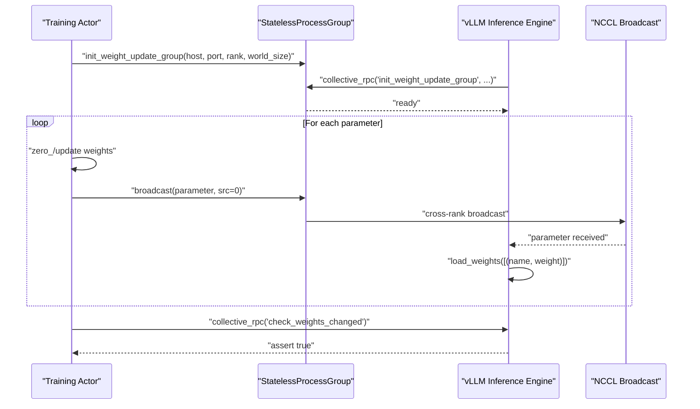

**Diagram sources**
- [rlhf.py](file://examples/offline_inference/rlhf.py#L107-L147)
- [rlhf_utils.py](file://examples/offline_inference/rlhf_utils.py#L1-L169)

## Detailed Component Analysis

### RLHF Training and Evaluation
- Separation on distinct GPUs:
  - Training model on one GPU; tensor-parallel inference on multiple GPUs; weight updates broadcasted via a process group.
  - Verified by checking that updated weights propagate to inference workers.
- Colocated execution with Ray:
  - Uses placement groups to bind training actors and inference workers to the same GPU bundles.
  - Exchanges tensors via CUDA IPC and ZMQ; inference workers reconstruct GPU tensors from IPC handles and load updated weights.
- Integration with TRL:
  - vLLM can be used for rollouts in online RL training; supports server and colocate modes.

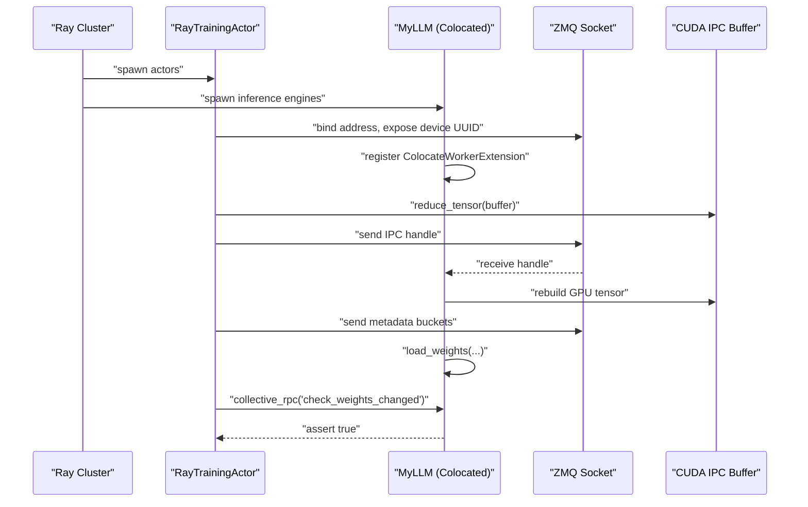

**Diagram sources**
- [rlhf_colocate.py](file://examples/offline_inference/rlhf_colocate.py#L1-L252)
- [rlhf_utils.py](file://examples/offline_inference/rlhf_utils.py#L95-L169)

**Section sources**
- [rlhf.py](file://examples/offline_inference/rlhf.py#L1-L147)
- [rlhf_online_quant.py](file://examples/offline_inference/rlhf_online_quant.py#L1-L140)
- [rlhf_utils.py](file://examples/offline_inference/rlhf_utils.py#L1-L169)
- [rlhf_colocate.py](file://examples/offline_inference/rlhf_colocate.py#L1-L252)
- [rlhf.md](file://docs/training/rlhf.md#L1-L28)
- [trl.md](file://docs/training/trl.md#L1-L55)

### Model Sharding and State Management
- Save sharded state:
  - Iterates over engine workers and dumps per-rank state dicts to files; preserves metadata; supports configurable filename pattern and max file size.
- Load sharded state:
  - Loads model with explicit load_format; generates a simple completion to validate correctness.
- Combined with quantization:
  - EngineArgs integrates quantization selection and device mapping for online quantization scenarios.

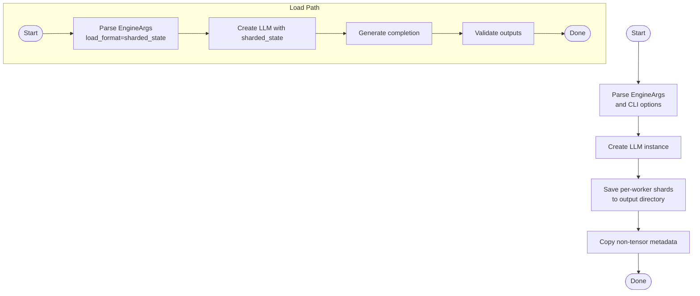

**Diagram sources**
- [save_sharded_state.py](file://examples/offline_inference/save_sharded_state.py#L1-L88)
- [load_sharded_state.py](file://examples/offline_inference/load_sharded_state.py#L1-L95)

**Section sources**
- [save_sharded_state.py](file://examples/offline_inference/save_sharded_state.py#L1-L88)
- [load_sharded_state.py](file://examples/offline_inference/load_sharded_state.py#L1-L95)

### Context Extension Techniques
- Extending Qwen context using YARN RoPE:
  - Overrides include RoPE theta, rope_type, factor, and original_max_position_embeddings; sets max_model_len accordingly.
  - Demonstrates chat-style interaction with extended context.

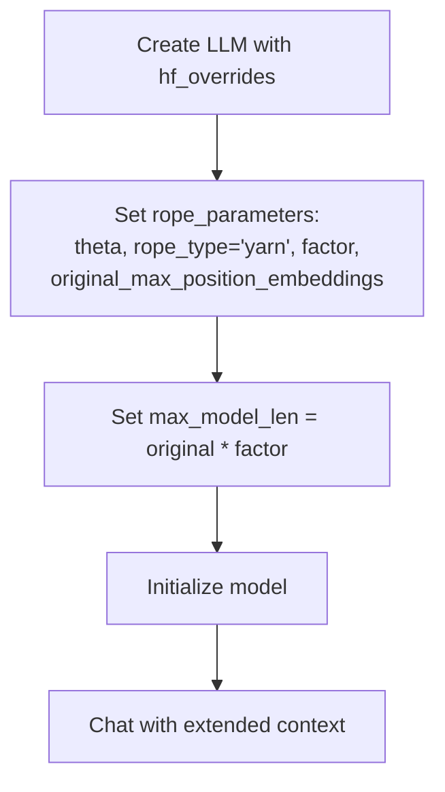

**Diagram sources**
- [context_extension.py](file://examples/offline_inference/context_extension.py#L1-L69)

**Section sources**
- [context_extension.py](file://examples/offline_inference/context_extension.py#L1-L69)

### Reproducibility Practices
- Deterministic scheduling vs. batch invariance:
  - Environment toggles to stabilize randomness; batch invariance insulates outputs from scheduling variance.
- Seeding behavior:
  - Global seed controls RNG states; defaults differ between V0 and V1.

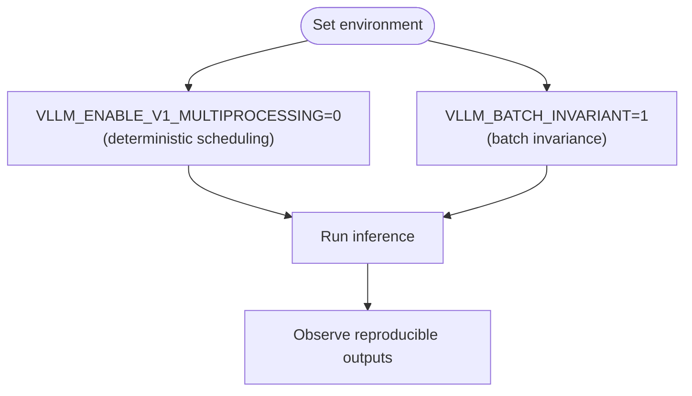

**Diagram sources**
- [reproducibility.py](file://examples/offline_inference/reproducibility.py#L1-L47)
- [reproducibility.md](file://docs/usage/reproducibility.md#L1-L33)

**Section sources**
- [reproducibility.py](file://examples/offline_inference/reproducibility.py#L1-L47)
- [reproducibility.md](file://docs/usage/reproducibility.md#L1-L33)

### Profiling and Performance Analysis
- Layerwise profiling:
  - Wraps Torch profiler with module tracing and stack collection; produces structured results consumable by visualization tools.
- Visualization:
  - Tooling to fold nodes, select depth, and render top-k contributions per phase.

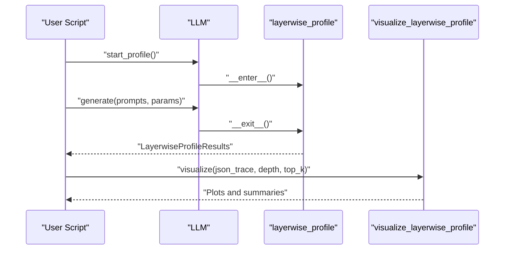

**Diagram sources**
- [simple_profiling.py](file://examples/offline_inference/simple_profiling.py#L1-L53)
- [layerwise_profile.py](file://vllm/profiler/layerwise_profile.py#L332-L392)
- [visualize_layerwise_profile.py](file://tools/profiler/visualize_layerwise_profile.py#L428-L465)

**Section sources**
- [simple_profiling.py](file://examples/offline_inference/simple_profiling.py#L1-L53)
- [layerwise_profile.py](file://vllm/profiler/layerwise_profile.py#L332-L392)
- [visualize_layerwise_profile.py](file://tools/profiler/visualize_layerwise_profile.py#L428-L465)

### Weight Initialization Strategies
- Dummy weights:
  - Initializes model weights with small random values to avoid NaNs and enable fair performance measurement.
- Model-specific resets:
  - Specialized initialization routines for certain architectures to maintain numerical stability.

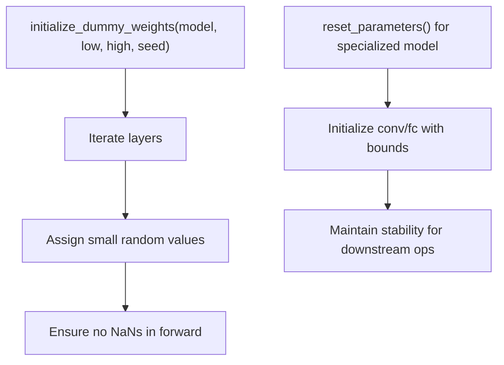

**Diagram sources**
- [initialize_dummy_weights](file://vllm/model_executor/model_loader/weight_utils.py#L1040-L1054)
- [phi4mm_utils.py](file://vllm/model_executor/models/phi4mm_utils.py#L1437-L1460)

**Section sources**
- [initialize_dummy_weights](file://vllm/model_executor/model_loader/weight_utils.py#L1040-L1054)
- [phi4mm_utils.py](file://vllm/model_executor/models/phi4mm_utils.py#L1437-L1460)

### Specialized Model Configurations
- Parallelism strategies:
  - Tensor parallelism, pipeline parallelism, expert parallelism, and data parallelism; combinations for large models.
- Chunked prefill:
  - Balances compute-bound prefill and memory-bound decode; tuning knobs for ITL/TTFT/throughput.
- Multi-modal caching:
  - Processor caching and IPC caching (key-replicated/shared memory) with adjustable sizes.

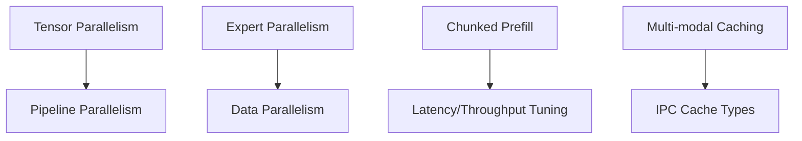

**Diagram sources**
- [optimization.md](file://docs/configuration/optimization.md#L1-L289)

**Section sources**
- [optimization.md](file://docs/configuration/optimization.md#L1-L289)

### Advanced Optimization Techniques and Benchmarks
- Kernel benchmarks:
  - Automated tuning and sweeping across shapes, TP sizes, and batch sizes for FP8/Machete/CUTLASS/Marlin/BitBLAS.
- MOE configuration discovery:
  - Looks up tuned configs from user-defined or default locations to optimize fused MoE execution.

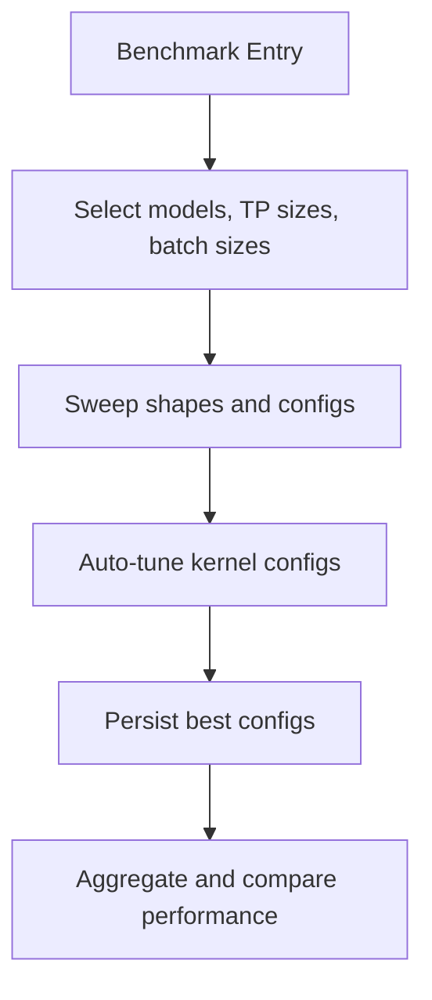

**Diagram sources**
- [benchmark_w8a8_block_fp8.py](file://benchmarks/kernels/benchmark_w8a8_block_fp8.py#L276-L319)
- [benchmark_machete.py](file://benchmarks/kernels/benchmark_machete.py#L696-L745)
- [sparse_benchmarks.py](file://benchmarks/cutlass_benchmarks/sparse_benchmarks.py#L489-L515)
- [benchmark_bitblas.py](file://benchmarks/kernels/benchmark_bitblas.py#L225-L244)
- [fused_moe.py](file://vllm/model_executor/layers/fused_moe/fused_moe.py#L849-L871)

**Section sources**
- [benchmark_w8a8_block_fp8.py](file://benchmarks/kernels/benchmark_w8a8_block_fp8.py#L276-L319)
- [benchmark_machete.py](file://benchmarks/kernels/benchmark_machete.py#L696-L745)
- [sparse_benchmarks.py](file://benchmarks/cutlass_benchmarks/sparse_benchmarks.py#L489-L515)
- [benchmark_bitblas.py](file://benchmarks/kernels/benchmark_bitblas.py#L225-L244)
- [fused_moe.py](file://vllm/model_executor/layers/fused_moe/fused_moe.py#L849-L871)

### Research-Oriented Workflows and Experimental Setups
- RLHF with TRL:
  - Two operational modes: server and colocate; supports sleep mode for memory reduction.
- Large-scale experimentation:
  - Benchmark suites provide standardized shapes, TP sizes, and batch ranges for reproducible comparisons.

**Section sources**
- [trl.md](file://docs/training/trl.md#L1-L55)

## Dependency Analysis
- RLHF utilities depend on distributed communication abstractions and model loader utilities for weight updates.
- Sharded state relies on engine core internals and CLI argument parsing.
- Profiling depends on Torch profiler and visualization tooling.
- Parallelism and caching controls are exposed via engine arguments and environment variables.

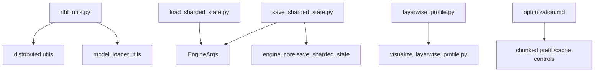

**Diagram sources**
- [rlhf_utils.py](file://examples/offline_inference/rlhf_utils.py#L1-L169)
- [save_sharded_state.py](file://examples/offline_inference/save_sharded_state.py#L1-L88)
- [load_sharded_state.py](file://examples/offline_inference/load_sharded_state.py#L1-L95)
- [layerwise_profile.py](file://vllm/profiler/layerwise_profile.py#L332-L392)
- [visualize_layerwise_profile.py](file://tools/profiler/visualize_layerwise_profile.py#L428-L465)
- [optimization.md](file://docs/configuration/optimization.md#L1-L289)

**Section sources**
- [rlhf_utils.py](file://examples/offline_inference/rlhf_utils.py#L1-L169)
- [save_sharded_state.py](file://examples/offline_inference/save_sharded_state.py#L1-L88)
- [load_sharded_state.py](file://examples/offline_inference/load_sharded_state.py#L1-L95)
- [layerwise_profile.py](file://vllm/profiler/layerwise_profile.py#L332-L392)
- [visualize_layerwise_profile.py](file://tools/profiler/visualize_layerwise_profile.py#L428-L465)
- [optimization.md](file://docs/configuration/optimization.md#L1-L289)

## Performance Considerations
- Preemption and recomputation:
  - Tune KV cache allocation and concurrency limits to minimize preemptions.
- Chunked prefill:
  - Adjust max_num_batched_tokens to balance ITL/TTFT/throughput.
- Parallelism trade-offs:
  - TP/PP/EP/DP combinations affect memory, latency, and throughput; choose based on model size and hardware.
- Multi-modal caching:
  - Select cache type and size to reduce redundant processing/transfers.

[No sources needed since this section provides general guidance]

## Troubleshooting Guide
- RLHF weight synchronization:
  - Verify process group initialization and successful broadcast; confirm inference workers reflect updated weights.
- Sharded state loading:
  - Ensure load_format is set correctly and output metadata is preserved; validate with a short generation.
- Profiling:
  - Confirm profiler is started/stopped around workload; allow time for background writers to flush; use visualization tooling to inspect traces.
- Reproducibility:
  - Apply deterministic scheduling or batch invariance; ensure identical hardware/version across runs.

**Section sources**
- [rlhf.py](file://examples/offline_inference/rlhf.py#L107-L147)
- [rlhf_colocate.py](file://examples/offline_inference/rlhf_colocate.py#L233-L252)
- [load_sharded_state.py](file://examples/offline_inference/load_sharded_state.py#L60-L95)
- [simple_profiling.py](file://examples/offline_inference/simple_profiling.py#L19-L53)
- [reproducibility.md](file://docs/usage/reproducibility.md#L1-L33)

## Conclusion
The vLLM repository provides robust, production-grade building blocks for specialized workflows:
- RLHF training and evaluation with flexible deployment modes
- Efficient model sharding and state management for large-scale inference
- Context extension for long-context models
- Strong reproducibility controls and profiling tooling
- Comprehensive optimization strategies and benchmark suites for advanced experimentation

These components enable researchers and practitioners to design reproducible, scalable, and high-performance systems for modern language model workloads.

## Appendices
- Additional resources:
  - RLHF and TRL integration documentation
  - Optimization and memory conservation guides
  - Metrics and observability considerations

[No sources needed since this section summarizes without analyzing specific files]