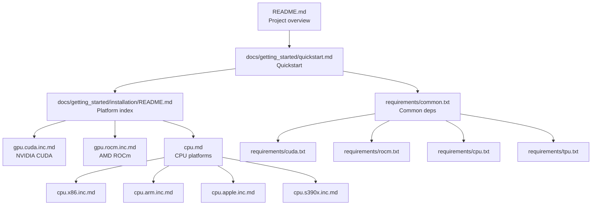
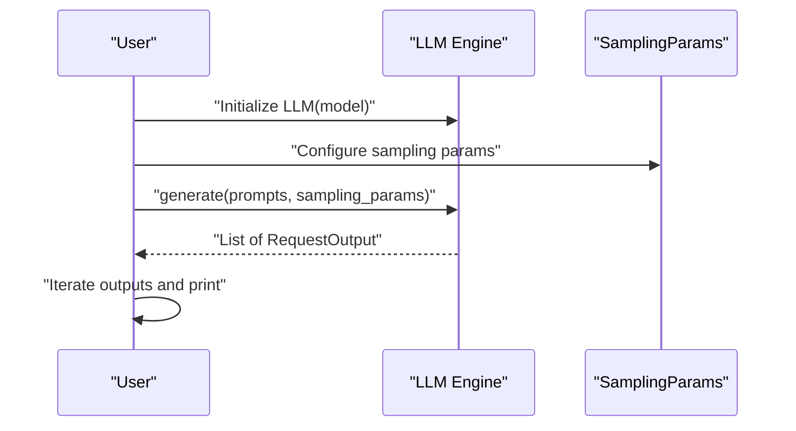
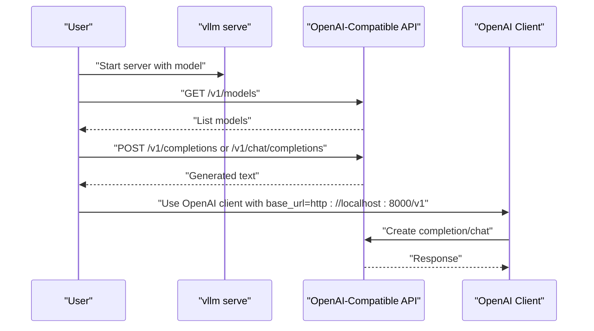
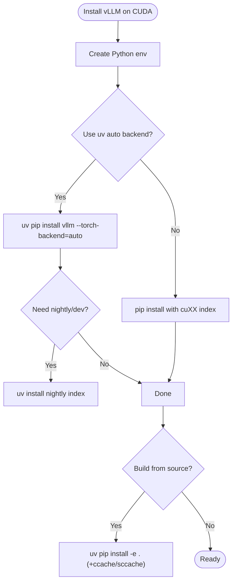
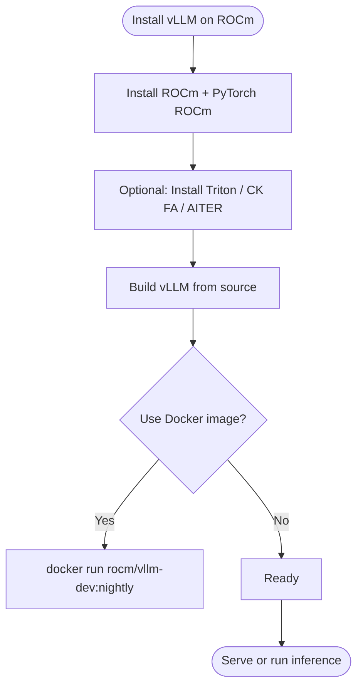
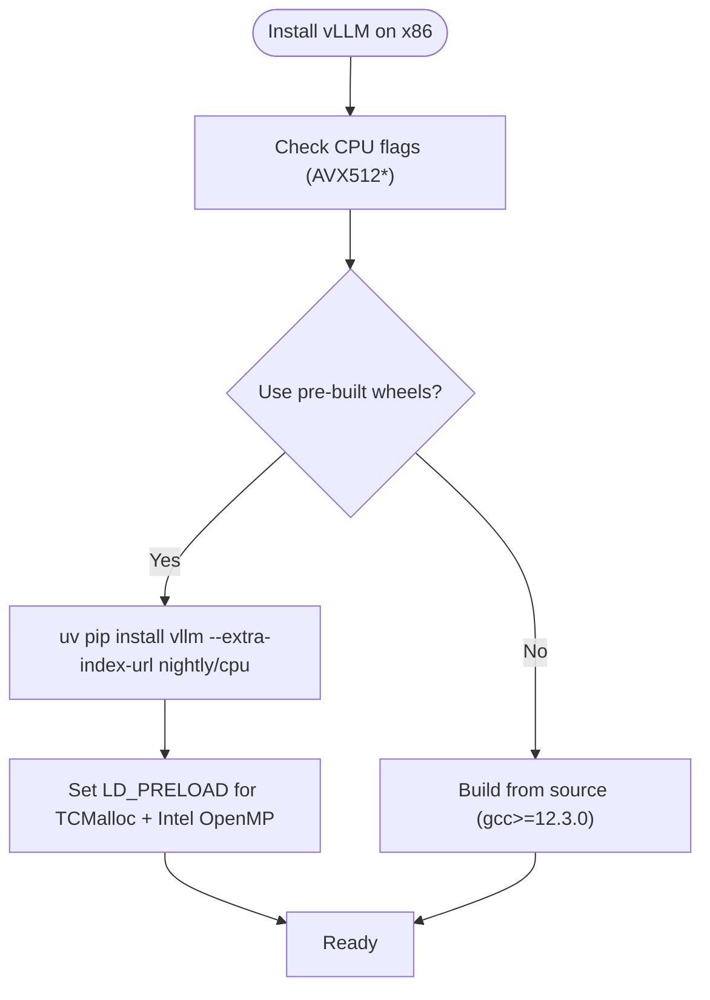
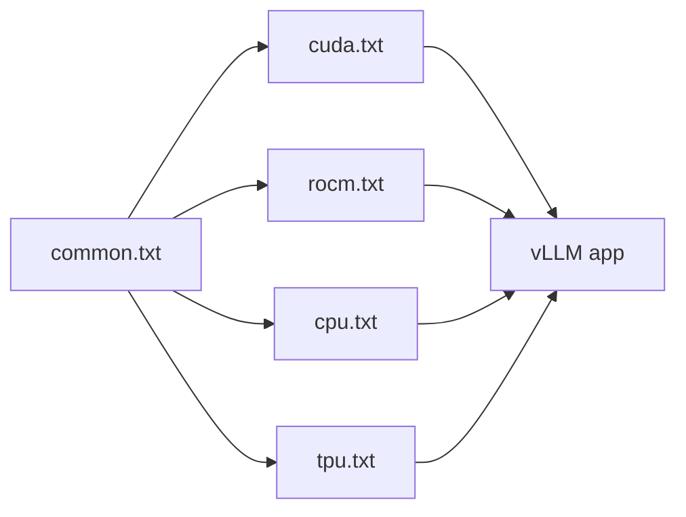

# Getting Started

<cite>
**Referenced Files in This Document**
- [README.md](file://README.md)
- [docs/getting_started/quickstart.md](file://docs/getting_started/quickstart.md)
- [docs/getting_started/installation/README.md](file://docs/getting_started/installation/README.md)
- [docs/getting_started/installation/gpu.cuda.inc.md](file://docs/getting_started/installation/gpu.cuda.inc.md)
- [docs/getting_started/installation/gpu.rocm.inc.md](file://docs/getting_started/installation/gpu.rocm.inc.md)
- [docs/getting_started/installation/cpu.md](file://docs/getting_started/installation/cpu.md)
- [docs/getting_started/installation/cpu.x86.inc.md](file://docs/getting_started/installation/cpu.x86.inc.md)
- [docs/getting_started/installation/cpu.arm.inc.md](file://docs/getting_started/installation/cpu.arm.inc.md)
- [docs/getting_started/installation/cpu.apple.inc.md](file://docs/getting_started/installation/cpu.apple.inc.md)
- [docs/getting_started/installation/cpu.s390x.inc.md](file://docs/getting_started/installation/cpu.s390x.inc.md)
- [requirements/common.txt](file://requirements/common.txt)
- [requirements/cuda.txt](file://requirements/cuda.txt)
- [requirements/rocm.txt](file://requirements/rocm.txt)
- [requirements/cpu.txt](file://requirements/cpu.txt)
- [requirements/tpu.txt](file://requirements/tpu.txt)
</cite>

## Table of Contents
1. [Introduction](#introduction)
2. [Project Structure](#project-structure)
3. [Core Components](#core-components)
4. [Architecture Overview](#architecture-overview)
5. [Detailed Component Analysis](#detailed-component-analysis)
6. [Dependency Analysis](#dependency-analysis)
7. [Performance Considerations](#performance-considerations)
8. [Troubleshooting Guide](#troubleshooting-guide)
9. [Conclusion](#conclusion)
10. [Appendices](#appendices)

## Introduction
This Getting Started guide helps you quickly begin using vLLM for LLM inference. It covers installation across platforms (NVIDIA CUDA, AMD ROCm, Intel/AMD x86, ARM AArch64, Apple Silicon, IBM Z s390x, and Google TPU), environment setup, quickstart examples for single inference, batch processing, and streaming responses, plus configuration and troubleshooting.

Key highlights:
- vLLM supports offline batched inference and an OpenAI-compatible server.
- Platform-specific wheels and Docker images are provided for many platforms.
- CPU builds require explicit environment variables and sometimes TCMalloc in preload.

## Project Structure
The Getting Started content is organized across:
- Top-level quickstart and installation docs
- Per-platform installation guides
- Requirements files for each platform
- Examples for offline inference and server usage

**Diagram sources**
- [README.md](file://README.md#L100-L115)
- [docs/getting_started/quickstart.md](file://docs/getting_started/quickstart.md#L1-L30)
- [docs/getting_started/installation/README.md](file://docs/getting_started/installation/README.md#L1-L31)
- [docs/getting_started/installation/gpu.cuda.inc.md](file://docs/getting_started/installation/gpu.cuda.inc.md#L1-L40)
- [docs/getting_started/installation/gpu.rocm.inc.md](file://docs/getting_started/installation/gpu.rocm.inc.md#L1-L20)
- [docs/getting_started/installation/cpu.md](file://docs/getting_started/installation/cpu.md#L1-L40)
- [requirements/common.txt](file://requirements/common.txt#L1-L55)

**Section sources**
- [README.md](file://README.md#L100-L115)
- [docs/getting_started/quickstart.md](file://docs/getting_started/quickstart.md#L1-L30)
- [docs/getting_started/installation/README.md](file://docs/getting_started/installation/README.md#L1-L31)

## Core Components
- Offline batched inference: Use the LLM class and SamplingParams to generate outputs for a batch of prompts.
- OpenAI-compatible server: Serve a model and query via completions or chat completions endpoints.
- Attention backends: Choose among supported backends depending on platform.

Practical quickstart steps:
- Install vLLM for your platform (see platform sections).
- Run offline batched inference with a small prompt list.
- Start the OpenAI-compatible server and query it via curl or the OpenAI Python client.

**Section sources**
- [docs/getting_started/quickstart.md](file://docs/getting_started/quickstart.md#L80-L170)
- [docs/getting_started/quickstart.md](file://docs/getting_started/quickstart.md#L171-L280)
- [docs/getting_started/quickstart.md](file://docs/getting_started/quickstart.md#L280-L308)

## Architecture Overview
High-level flow for quickstart usage:
- Offline batched inference: initialize LLM, define prompts and sampling params, call generate, iterate outputs.
- OpenAI-compatible server: start vllm serve with a model, query via HTTP endpoints.

**Diagram sources**
- [docs/getting_started/quickstart.md](file://docs/getting_started/quickstart.md#L80-L170)

**Diagram sources**
- [docs/getting_started/quickstart.md](file://docs/getting_started/quickstart.md#L171-L280)

## Detailed Component Analysis

### NVIDIA CUDA
- Requirements: GPU compute capability 7.0+; CUDA-aware PyTorch wheels.
- Recommended installation: use uv with automatic backend selection or specify a CUDA wheel index.
- Nightly wheels and commit-specific wheels are available.
- Building from source: optional; use ccache/sccache for faster rebuilds; use Docker image if toolkit setup is tricky.
- Attention backends: FLASH_ATTN or FLASHINFER on CUDA.

**Diagram sources**
- [docs/getting_started/installation/gpu.cuda.inc.md](file://docs/getting_started/installation/gpu.cuda.inc.md#L20-L120)
- [docs/getting_started/installation/gpu.cuda.inc.md](file://docs/getting_started/installation/gpu.cuda.inc.md#L120-L210)

**Section sources**
- [docs/getting_started/installation/gpu.cuda.inc.md](file://docs/getting_started/installation/gpu.cuda.inc.md#L1-L40)
- [docs/getting_started/installation/gpu.cuda.inc.md](file://docs/getting_started/installation/gpu.cuda.inc.md#L20-L120)
- [docs/getting_started/installation/gpu.cuda.inc.md](file://docs/getting_started/installation/gpu.cuda.inc.md#L120-L210)
- [docs/getting_started/installation/gpu.cuda.inc.md](file://docs/getting_started/installation/gpu.cuda.inc.md#L210-L265)

### AMD ROCm
- Requirements: ROCm 6.3+ and compatible GPUs; PyTorch ROCm wheels.
- Pre-built wheels: Not available; build from source or use Docker images.
- Steps: install ROCm, PyTorch ROCm, optional Triton/CK FA/AITER, then build vLLM; or use provided Docker images.
- Attention backends: TRITON_ATTN, ROCM_ATTN, ROCM_AITER_FA, ROCM_AITER_UNIFIED_ATTN; environment toggles for unified vs prefill-decode attention.

**Diagram sources**
- [docs/getting_started/installation/gpu.rocm.inc.md](file://docs/getting_started/installation/gpu.rocm.inc.md#L1-L40)
- [docs/getting_started/installation/gpu.rocm.inc.md](file://docs/getting_started/installation/gpu.rocm.inc.md#L100-L140)
- [docs/getting_started/installation/gpu.rocm.inc.md](file://docs/getting_started/installation/gpu.rocm.inc.md#L140-L210)

**Section sources**
- [docs/getting_started/installation/gpu.rocm.inc.md](file://docs/getting_started/installation/gpu.rocm.inc.md#L1-L40)
- [docs/getting_started/installation/gpu.rocm.inc.md](file://docs/getting_started/installation/gpu.rocm.inc.md#L100-L140)
- [docs/getting_started/installation/gpu.rocm.inc.md](file://docs/getting_started/installation/gpu.rocm.inc.md#L140-L210)
- [docs/getting_started/installation/gpu.rocm.inc.md](file://docs/getting_started/installation/gpu.rocm.inc.md#L210-L246)

### Intel/AMD x86 (Linux)
- Requirements: AVX512 recommended; Linux OS.
- Wheels: AVX512 wheels available; TCMalloc and Intel OpenMP should be in LD_PRELOAD for wheels.
- Install: use uv with CPU torch backend and extra index; or build from source with gcc/g++ >= 12.3.0.
- Docker: pre-built images available; disable AVX512 features if CPU lacks them.

**Diagram sources**
- [docs/getting_started/installation/cpu.x86.inc.md](file://docs/getting_started/installation/cpu.x86.inc.md#L1-L40)
- [docs/getting_started/installation/cpu.x86.inc.md](file://docs/getting_started/installation/cpu.x86.inc.md#L160-L196)

**Section sources**
- [docs/getting_started/installation/cpu.x86.inc.md](file://docs/getting_started/installation/cpu.x86.inc.md#L1-L40)
- [docs/getting_started/installation/cpu.x86.inc.md](file://docs/getting_started/installation/cpu.x86.inc.md#L160-L196)

### ARM AArch64 (Linux)
- Wheels: pre-built wheels available since v0.11.2; TCMalloc must be in LD_PRELOAD.
- Install: uv with nightly CPU index; or build from source with gcc/g++ >= 12.3.0.
- Docker: pre-built images available; use nightly images for latest code.

**Section sources**
- [docs/getting_started/installation/cpu.arm.inc.md](file://docs/getting_started/installation/cpu.arm.inc.md#L1-L40)
- [docs/getting_started/installation/cpu.arm.inc.md](file://docs/getting_started/installation/cpu.arm.inc.md#L120-L182)

### Apple Silicon (macOS)
- No pre-built wheels; must build from source.
- Requirements: macOS Sonoma+, Xcode 15.4+, Apple Clang >= 15.0.0.
- Build: uv with CPU torch backend; adjust C++ standard if needed.

**Section sources**
- [docs/getting_started/installation/cpu.apple.inc.md](file://docs/getting_started/installation/cpu.apple.inc.md#L1-L40)
- [docs/getting_started/installation/cpu.apple.inc.md](file://docs/getting_started/installation/cpu.apple.inc.md#L40-L76)

### IBM Z s390x (Linux)
- No pre-built wheels; must build from source.
- Requirements: gcc/g++ >= 12.3.0, VXE ISA, Rust for dependencies.
- Build: install dependencies from source, then build vLLM wheel and install.

**Section sources**
- [docs/getting_started/installation/cpu.s390x.inc.md](file://docs/getting_started/installation/cpu.s390x.inc.md#L1-L40)
- [docs/getting_started/installation/cpu.s390x.inc.md](file://docs/getting_started/installation/cpu.s390x.inc.md#L40-L68)

### Google TPU
- Install the specialized package for TPU.
- Refer to TPU documentation for Docker, source build, and troubleshooting.

**Section sources**
- [docs/getting_started/quickstart.md](file://docs/getting_started/quickstart.md#L66-L78)
- [requirements/tpu.txt](file://requirements/tpu.txt#L1-L15)

## Dependency Analysis
Common dependencies across platforms include tokenizers, Transformers, OpenAI client, Prometheus instrumentation, and multimedia libraries. Platform-specific requirements add:
- CUDA: FlashInfer, Ray compiled graph, Torch versions aligned with CUDA.
- ROCm: Triton for ROCm, CK flash attention, AITER, Timm, fast safetensors.
- CPU: CPU-specific Torch variants, Intel OpenMP (x86), TCMalloc, py-cpuinfo (ARM), and platform-specific extras.
- TPU: Ray, TPU inference packages.

**Diagram sources**
- [requirements/common.txt](file://requirements/common.txt#L1-L55)
- [requirements/cuda.txt](file://requirements/cuda.txt#L1-L14)
- [requirements/rocm.txt](file://requirements/rocm.txt#L1-L19)
- [requirements/cpu.txt](file://requirements/cpu.txt#L1-L23)
- [requirements/tpu.txt](file://requirements/tpu.txt#L1-L15)

**Section sources**
- [requirements/common.txt](file://requirements/common.txt#L1-L55)
- [requirements/cuda.txt](file://requirements/cuda.txt#L1-L14)
- [requirements/rocm.txt](file://requirements/rocm.txt#L1-L19)
- [requirements/cpu.txt](file://requirements/cpu.txt#L1-L23)
- [requirements/tpu.txt](file://requirements/tpu.txt#L1-L15)

## Performance Considerations
- CUDA: Use uv auto backend selection; consider FlashInfer or FlashAttention backends; build with ccache/sccache for faster rebuilds.
- ROCm: Match ROCm driver version with PyTorch ROCm; tune AITER/Unified Attention modes; follow AMD performance guides.
- CPU: Tune KV cache space, thread binding, and batch sizes; prefer AVX512-enabled wheels when available; disable unsupported AVX512 features in Docker if needed.

[No sources needed since this section provides general guidance]

## Troubleshooting Guide
- CUDA
  - NCCL conflicts with conda-installed PyTorch; use a fresh environment.
  - Nightly installs require uv; pip caveats documented.
  - Toolkit verification: nvcc in PATH and CUDA_HOME set.
- ROCm
  - Use Docker images if building is complex; ensure Triton/FA/AITER versions match validated branches.
- CPU
  - LD_PRELOAD for TCMalloc and Intel OpenMP (x86); missing AVX512 in Docker images leads to illegal instruction; disable AVX512 features accordingly.
  - macOS: fix C++ standard or adjust CMake to use C++17.
  - s390x: build dependencies from source; install Rust; use nightly Torch CPU wheels.

**Section sources**
- [docs/getting_started/installation/gpu.cuda.inc.md](file://docs/getting_started/installation/gpu.cuda.inc.md#L10-L20)
- [docs/getting_started/installation/gpu.cuda.inc.md](file://docs/getting_started/installation/gpu.cuda.inc.md#L60-L85)
- [docs/getting_started/installation/gpu.cuda.inc.md](file://docs/getting_started/installation/gpu.cuda.inc.md#L210-L230)
- [docs/getting_started/installation/gpu.rocm.inc.md](file://docs/getting_started/installation/gpu.rocm.inc.md#L40-L85)
- [docs/getting_started/installation/cpu.x86.inc.md](file://docs/getting_started/installation/cpu.x86.inc.md#L130-L160)
- [docs/getting_started/installation/cpu.arm.inc.md](file://docs/getting_started/installation/cpu.arm.inc.md#L30-L45)
- [docs/getting_started/installation/cpu.apple.inc.md](file://docs/getting_started/installation/cpu.apple.inc.md#L40-L76)
- [docs/getting_started/installation/cpu.s390x.inc.md](file://docs/getting_started/installation/cpu.s390x.inc.md#L40-L68)

## Conclusion
You can start quickly with vLLM by selecting the right installation method for your platform, running offline batched inference, and serving via the OpenAI-compatible API. For advanced usage, tune attention backends, environment variables, and batch parameters according to your hardware.

[No sources needed since this section summarizes without analyzing specific files]

## Appendices

### Quickstart: Single Inference and Batch Processing
- Offline batched inference: import LLM and SamplingParams, define prompts and sampling parameters, initialize LLM with a model, call generate, and iterate outputs.
- Chat templates: when using instruct/chat models, apply chat templates manually or use the chat interface.

**Section sources**
- [docs/getting_started/quickstart.md](file://docs/getting_started/quickstart.md#L80-L170)

### Quickstart: OpenAI-Compatible Server
- Start the server with a model; query via /v1/models, /v1/completions, or /v1/chat/completions.
- Override chat template and generation config defaults if needed.

**Section sources**
- [docs/getting_started/quickstart.md](file://docs/getting_started/quickstart.md#L171-L280)

### Platform Index
- Hardware platforms supported by vLLM and links to platform-specific installation guides.

**Section sources**
- [docs/getting_started/installation/README.md](file://docs/getting_started/installation/README.md#L1-L31)