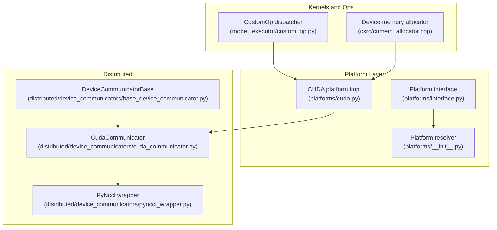
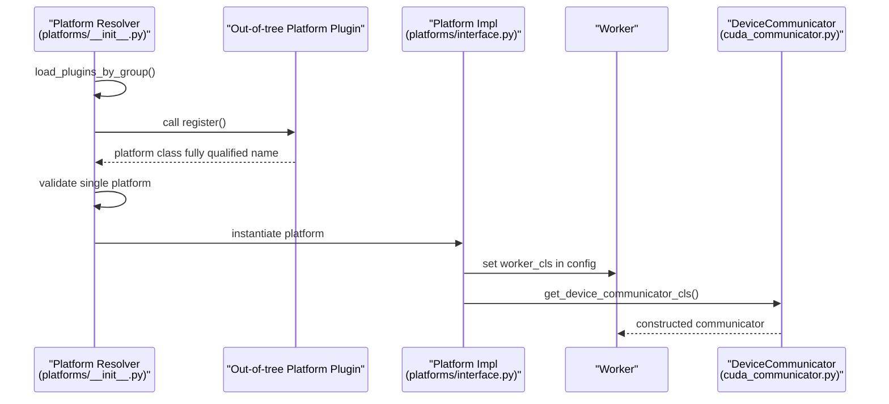
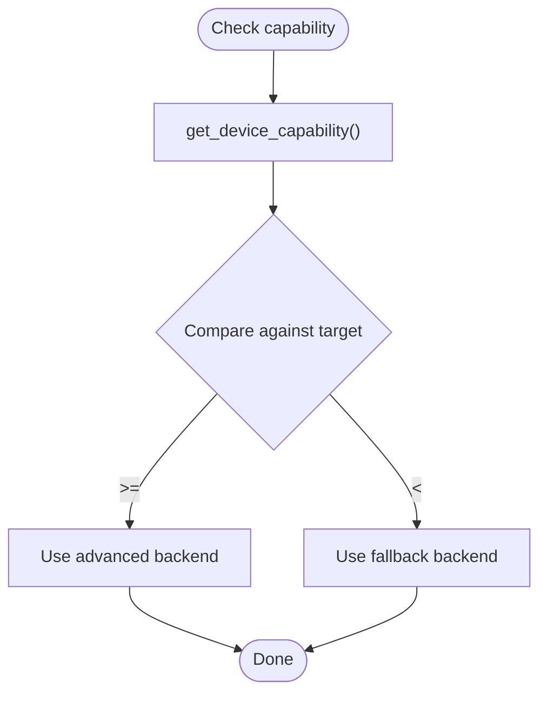
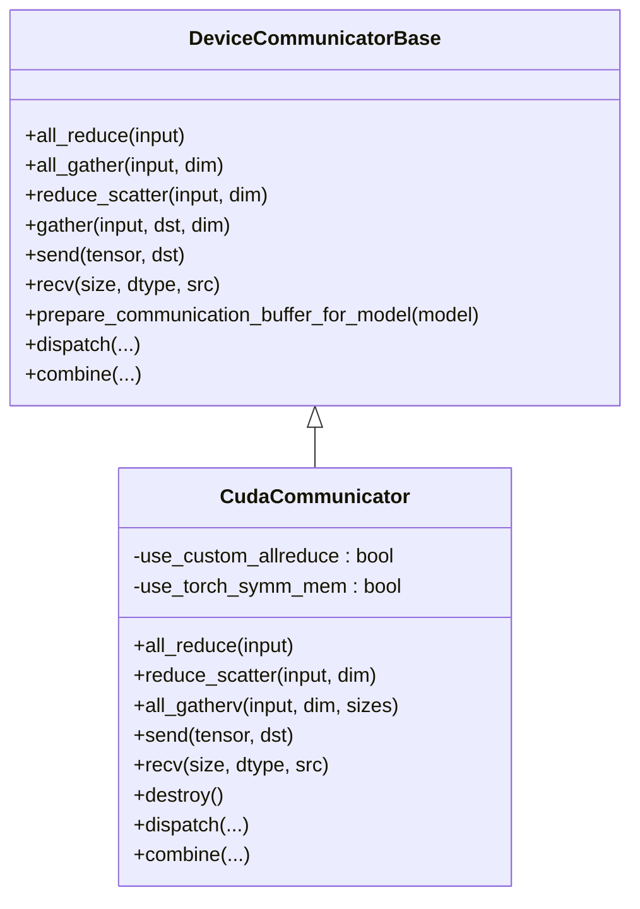
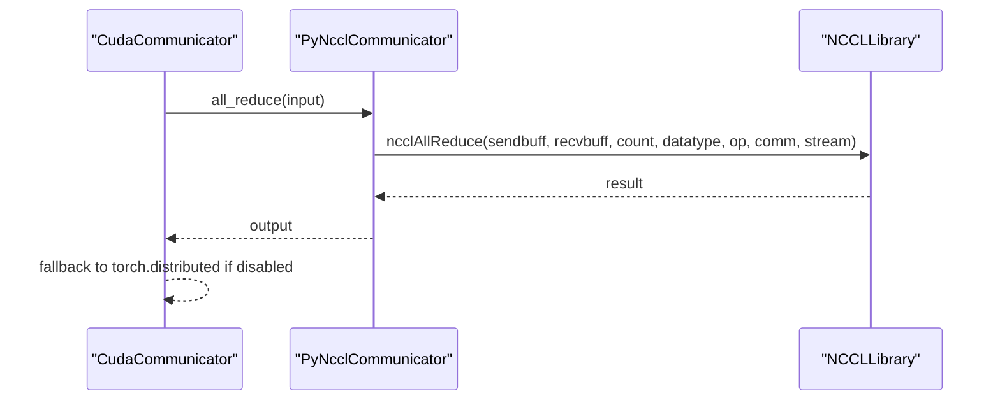
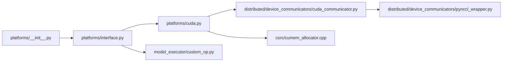

# Custom Hardware Integration

<cite>
**Referenced Files in This Document**
- [interface.py](file://vllm/platforms/interface.py)
- [__init__.py](file://vllm/platforms/__init__.py)
- [cuda.py](file://vllm/platforms/cuda.py)
- [base_device_communicator.py](file://vllm/distributed/device_communicators/base_device_communicator.py)
- [cuda_communicator.py](file://vllm/distributed/device_communicators/cuda_communicator.py)
- [custom_op.py](file://vllm/model_executor/custom_op.py)
- [cumem_allocator.cpp](file://csrc/cumem_allocator.cpp)
- [plugin_system.md](file://docs/design/plugin_system.md)
- [pynccl_wrapper.py](file://vllm/distributed/device_communicators/pynccl_wrapper.py)
</cite>

## Table of Contents
1. [Introduction](#introduction)
2. [Project Structure](#project-structure)
3. [Core Components](#core-components)
4. [Architecture Overview](#architecture-overview)
5. [Detailed Component Analysis](#detailed-component-analysis)
6. [Dependency Analysis](#dependency-analysis)
7. [Performance Considerations](#performance-considerations)
8. [Troubleshooting Guide](#troubleshooting-guide)
9. [Conclusion](#conclusion)
10. [Appendices](#appendices)

## Introduction
This document explains how to integrate custom hardware platforms into vLLM. It covers the Platform interface, device communicator contracts, the plugin system for out-of-tree platforms, custom kernel development, hardware capability detection, and performance optimization strategies. It also provides step-by-step guidance for implementing new platform plugins, custom device communicators, and hardware-specific optimizations, with references to concrete source files for verification.

## Project Structure
The custom hardware integration spans several subsystems:
- Platform abstraction and discovery
- Device communicators for distributed operations
- Custom operator dispatch and out-of-tree registration
- Memory management helpers for device memory
- Distributed NCCL bindings and wrappers

**Diagram sources**
- [interface.py](file://vllm/platforms/interface.py#L100-L220)
- [__init__.py](file://vllm/platforms/__init__.py#L182-L238)
- [cuda.py](file://vllm/platforms/cuda.py#L97-L170)
- [base_device_communicator.py](file://vllm/distributed/device_communicators/base_device_communicator.py#L92-L160)
- [cuda_communicator.py](file://vllm/distributed/device_communicators/cuda_communicator.py#L24-L120)
- [custom_op.py](file://vllm/model_executor/custom_op.py#L84-L113)
- [cumem_allocator.cpp](file://csrc/cumem_allocator.cpp#L120-L175)
- [pynccl_wrapper.py](file://vllm/distributed/device_communicators/pynccl_wrapper.py#L132-L170)

**Section sources**
- [interface.py](file://vllm/platforms/interface.py#L100-L220)
- [__init__.py](file://vllm/platforms/__init__.py#L182-L238)
- [cuda.py](file://vllm/platforms/cuda.py#L97-L170)
- [base_device_communicator.py](file://vllm/distributed/device_communicators/base_device_communicator.py#L92-L160)
- [cuda_communicator.py](file://vllm/distributed/device_communicators/cuda_communicator.py#L24-L120)
- [custom_op.py](file://vllm/model_executor/custom_op.py#L84-L113)
- [cumem_allocator.cpp](file://csrc/cumem_allocator.cpp#L120-L175)
- [pynccl_wrapper.py](file://vllm/distributed/device_communicators/pynccl_wrapper.py#L132-L170)

## Core Components
- Platform interface: Defines capabilities, device metadata, attention backend selection, and distributed backend selection.
- Platform resolver: Detects built-in platforms or loads out-of-tree platform plugins.
- Device communicator base and concrete implementations: Provide collective operations and all-to-all dispatch.
- Custom operator dispatcher: Routes op execution to platform-specific implementations.
- Device memory allocator: Provides low-level device memory allocation and mapping for specialized use cases.

Key responsibilities:
- Platform interface: [Platform](file://vllm/platforms/interface.py#L100-L220), [DeviceCapability](file://vllm/platforms/interface.py#L58-L98)
- Platform resolver: [resolve_current_platform_cls_qualname](file://vllm/platforms/__init__.py#L191-L238)
- Device communicator base: [DeviceCommunicatorBase](file://vllm/distributed/device_communicators/base_device_communicator.py#L92-L160)
- CUDA communicator: [CudaCommunicator](file://vllm/distributed/device_communicators/cuda_communicator.py#L24-L120)
- Custom op dispatcher: [CustomOp.dispatch_forward](file://vllm/model_executor/custom_op.py#L84-L113)
- Device memory allocator: [create_and_map](file://csrc/cumem_allocator.cpp#L120-L175)

**Section sources**
- [interface.py](file://vllm/platforms/interface.py#L58-L98)
- [interface.py](file://vllm/platforms/interface.py#L100-L220)
- [__init__.py](file://vllm/platforms/__init__.py#L191-L238)
- [base_device_communicator.py](file://vllm/distributed/device_communicators/base_device_communicator.py#L92-L160)
- [cuda_communicator.py](file://vllm/distributed/device_communicators/cuda_communicator.py#L24-L120)
- [custom_op.py](file://vllm/model_executor/custom_op.py#L84-L113)
- [cumem_allocator.cpp](file://csrc/cumem_allocator.cpp#L120-L175)

## Architecture Overview
The platform system resolves a single active platform at runtime. Out-of-tree platforms are discovered via entry points and must return a fully qualified platform class name. The platform determines attention backends, device communicators, and device-specific capabilities. Device communicators encapsulate distributed operations and can leverage platform-specific optimizations (e.g., custom all-reduce, symmetric memory, NCCL).

**Diagram sources**
- [__init__.py](file://vllm/platforms/__init__.py#L191-L238)
- [interface.py](file://vllm/platforms/interface.py#L100-L220)
- [cuda_communicator.py](file://vllm/distributed/device_communicators/cuda_communicator.py#L24-L120)

**Section sources**
- [__init__.py](file://vllm/platforms/__init__.py#L191-L238)
- [plugin_system.md](file://docs/design/plugin_system.md#L62-L144)

## Detailed Component Analysis

### Platform Interface and Capability Detection
The Platform interface defines:
- Device capability queries and comparisons
- Device metadata accessors (name, UUID, memory)
- Attention backend selection and validation
- Distributed backend selection
- Custom op and graph mode toggles
- Memory and dtype checks

Important methods and properties:
- [DeviceCapability](file://vllm/platforms/interface.py#L58-L98)
- [has_device_capability](file://vllm/platforms/interface.py#L279-L323)
- [is_device_capability](file://vllm/platforms/interface.py#L304-L326)
- [get_device_name/get_device_uuid/get_device_total_memory](file://vllm/platforms/interface.py#L343-L356)
- [get_attn_backend_cls](file://vllm/platforms/interface.py#L226-L233)
- [get_device_communicator_cls](file://vllm/platforms/interface.py#L510-L515)

CUDA platform demonstrates capability-based backend selection and memory/block-size tuning:
- [CudaPlatformBase.get_valid_backends](file://vllm/platforms/cuda.py#L258-L288)
- [CudaPlatformBase.get_attn_backend_cls](file://vllm/platforms/cuda.py#L289-L359)
- [CudaPlatformBase.check_and_update_config](file://vllm/platforms/cuda.py#L149-L249)

**Diagram sources**
- [interface.py](file://vllm/platforms/interface.py#L279-L323)
- [cuda.py](file://vllm/platforms/cuda.py#L258-L288)

**Section sources**
- [interface.py](file://vllm/platforms/interface.py#L58-L98)
- [interface.py](file://vllm/platforms/interface.py#L279-L323)
- [interface.py](file://vllm/platforms/interface.py#L343-L356)
- [interface.py](file://vllm/platforms/interface.py#L226-L233)
- [interface.py](file://vllm/platforms/interface.py#L510-L515)
- [cuda.py](file://vllm/platforms/cuda.py#L258-L288)
- [cuda.py](file://vllm/platforms/cuda.py#L289-L359)
- [cuda.py](file://vllm/platforms/cuda.py#L149-L249)

### Device Communicator Contracts and Optimizations
DeviceCommunicatorBase defines the contract for distributed operations:
- all_reduce, all_gather, reduce_scatter, gather, send, recv
- EP/all2all dispatch and combine hooks
- Buffer preparation for MoE modular kernels

Concrete CUDA communicator adds:
- Priority fallback: symmetric-memory all-reduce, custom all-reduce, quick all-reduce, PyNccl, then default torch.distributed
- All2All managers selection based on configuration
- NCCL symmetric memory registration and group operations

**Diagram sources**
- [base_device_communicator.py](file://vllm/distributed/device_communicators/base_device_communicator.py#L92-L160)
- [base_device_communicator.py](file://vllm/distributed/device_communicators/base_device_communicator.py#L263-L303)
- [cuda_communicator.py](file://vllm/distributed/device_communicators/cuda_communicator.py#L24-L120)
- [cuda_communicator.py](file://vllm/distributed/device_communicators/cuda_communicator.py#L126-L175)
- [cuda_communicator.py](file://vllm/distributed/device_communicators/cuda_communicator.py#L236-L263)
- [cuda_communicator.py](file://vllm/distributed/device_communicators/cuda_communicator.py#L321-L347)

**Section sources**
- [base_device_communicator.py](file://vllm/distributed/device_communicators/base_device_communicator.py#L92-L160)
- [base_device_communicator.py](file://vllm/distributed/device_communicators/base_device_communicator.py#L263-L303)
- [cuda_communicator.py](file://vllm/distributed/device_communicators/cuda_communicator.py#L24-L120)
- [cuda_communicator.py](file://vllm/distributed/device_communicators/cuda_communicator.py#L126-L175)
- [cuda_communicator.py](file://vllm/distributed/device_communicators/cuda_communicator.py#L236-L263)
- [cuda_communicator.py](file://vllm/distributed/device_communicators/cuda_communicator.py#L321-L347)

### Distributed Communication Primitives and NCCL Integration
The CUDA communicator integrates with NCCL via a Python wrapper that exposes typed function bindings for NCCL operations. This enables optimized collectives and window registration.

Key elements:
- [NCCLLibrary exported functions](file://vllm/distributed/device_communicators/pynccl_wrapper.py#L132-L170)
- [NCCL collective wrappers](file://vllm/distributed/device_communicators/pynccl_wrapper.py#L396-L564)

**Diagram sources**
- [cuda_communicator.py](file://vllm/distributed/device_communicators/cuda_communicator.py#L126-L175)
- [pynccl_wrapper.py](file://vllm/distributed/device_communicators/pynccl_wrapper.py#L132-L170)
- [pynccl_wrapper.py](file://vllm/distributed/device_communicators/pynccl_wrapper.py#L396-L564)

**Section sources**
- [cuda_communicator.py](file://vllm/distributed/device_communicators/cuda_communicator.py#L126-L175)
- [pynccl_wrapper.py](file://vllm/distributed/device_communicators/pynccl_wrapper.py#L132-L170)
- [pynccl_wrapper.py](file://vllm/distributed/device_communicators/pynccl_wrapper.py#L396-L564)

### Custom Kernel Development and Out-of-Tree Registration
vLLM supports custom operators through a dispatcher that selects platform-specific implementations:
- Dispatch logic chooses CUDA/HIP/CPU/TPU/OOT based on current platform
- Out-of-tree custom ops can override in-tree implementations via registration

Key elements:
- [CustomOp.dispatch_forward](file://vllm/model_executor/custom_op.py#L84-L113)
- [CustomOp.register_oot](file://vllm/model_executor/custom_op.py#L168-L200)

For C++/CSRC ops, vLLM exposes a C++ extension surface and registers torch custom ops. Device memory allocation helpers are provided in C++ for advanced scenarios.

**Section sources**
- [custom_op.py](file://vllm/model_executor/custom_op.py#L84-L113)
- [custom_op.py](file://vllm/model_executor/custom_op.py#L168-L200)
- [cumem_allocator.cpp](file://csrc/cumem_allocator.cpp#L120-L175)
- [cumem_allocator.cpp](file://csrc/cumem_allocator.cpp#L283-L313)

### Step-by-Step: Implementing a New Platform Plugin
Follow the documented plugin system to add an out-of-tree platform:
1. Create a package with a platform class inheriting from [Platform](file://vllm/platforms/interface.py#L100-L220).
2. Implement required properties and methods:
   - [device_type](file://vllm/platforms/interface.py#L100-L120)
   - [get_device_capability/get_device_name/get_device_total_memory](file://vllm/platforms/interface.py#L272-L356)
   - [get_attn_backend_cls](file://vllm/platforms/interface.py#L226-L233)
   - [get_device_communicator_cls](file://vllm/platforms/interface.py#L510-L515)
   - [check_and_update_config](file://vllm/platforms/interface.py#L404-L414) to set worker class and tune config
3. Add entry point in setup.py under group `vllm.platform_plugins` returning the platform class’s fully qualified name.
4. Optionally implement:
   - A custom worker class
   - A custom attention backend
   - A custom device communicator inheriting from [DeviceCommunicatorBase](file://vllm/distributed/device_communicators/base_device_communicator.py#L92-L160)
   - Out-of-tree custom ops via [CustomOp.register_oot](file://vllm/model_executor/custom_op.py#L168-L200)

Verification steps:
- Confirm single platform activation: [resolve_current_platform_cls_qualname](file://vllm/platforms/__init__.py#L191-L238)
- Ensure platform detection logic returns your platform class

**Section sources**
- [plugin_system.md](file://docs/design/plugin_system.md#L62-L144)
- [interface.py](file://vllm/platforms/interface.py#L100-L220)
- [interface.py](file://vllm/platforms/interface.py#L226-L233)
- [interface.py](file://vllm/platforms/interface.py#L510-L515)
- [interface.py](file://vllm/platforms/interface.py#L404-L414)
- [__init__.py](file://vllm/platforms/__init__.py#L191-L238)
- [base_device_communicator.py](file://vllm/distributed/device_communicators/base_device_communicator.py#L92-L160)
- [custom_op.py](file://vllm/model_executor/custom_op.py#L168-L200)

### Step-by-Step: Implementing a Custom Device Communicator
1. Derive from [DeviceCommunicatorBase](file://vllm/distributed/device_communicators/base_device_communicator.py#L92-L160).
2. Implement core methods:
   - [all_reduce](file://vllm/distributed/device_communicators/base_device_communicator.py#L135-L138)
   - [reduce_scatter](file://vllm/distributed/device_communicators/base_device_communicator.py#L172-L204)
   - [all_gather](file://vllm/distributed/device_communicators/base_device_communicator.py#L139-L162)
   - [gather/send/recv](file://vllm/distributed/device_communicators/base_device_communicator.py#L210-L259)
3. Integrate platform-specific optimizations:
   - Use [CudaCommunicator](file://vllm/distributed/device_communicators/cuda_communicator.py#L126-L175) as a reference for priority fallback and NCCL integration.
4. Register the communicator via [Platform.get_device_communicator_cls](file://vllm/platforms/interface.py#L510-L515).

**Section sources**
- [base_device_communicator.py](file://vllm/distributed/device_communicators/base_device_communicator.py#L92-L160)
- [base_device_communicator.py](file://vllm/distributed/device_communicators/base_device_communicator.py#L135-L138)
- [base_device_communicator.py](file://vllm/distributed/device_communicators/base_device_communicator.py#L172-L204)
- [base_device_communicator.py](file://vllm/distributed/device_communicators/base_device_communicator.py#L210-L259)
- [cuda_communicator.py](file://vllm/distributed/device_communicators/cuda_communicator.py#L126-L175)
- [interface.py](file://vllm/platforms/interface.py#L510-L515)

### Step-by-Step: Adding Custom CUDA Kernels and Device Memory Management
1. Implement custom kernels in C++/CUDA under csrc and expose them as Torch custom ops.
2. Use the device memory allocator for advanced allocations:
   - [create_and_map](file://csrc/cumem_allocator.cpp#L120-L175)
   - [unmap_and_release](file://csrc/cumem_allocator.cpp#L176-L207)
   - [cuMemCreate/cuMemMap](file://csrc/cumem_allocator.cpp#L120-L161)
3. Integrate with the platform’s kernel import hook:
   - [Platform.import_kernels](file://vllm/platforms/interface.py#L216-L225)
   - CUDA platform imports vllm._C: [CudaPlatformBase](file://vllm/platforms/cuda.py#L15-L20)

**Section sources**
- [cumem_allocator.cpp](file://csrc/cumem_allocator.cpp#L120-L175)
- [cumem_allocator.cpp](file://csrc/cumem_allocator.cpp#L176-L207)
- [cumem_allocator.cpp](file://csrc/cumem_allocator.cpp#L283-L313)
- [interface.py](file://vllm/platforms/interface.py#L216-L225)
- [cuda.py](file://vllm/platforms/cuda.py#L15-L20)

## Dependency Analysis
The platform system depends on:
- Platform resolver to select a single platform
- Platform to supply attention backends and device communicators
- Device communicator to provide collectives and all2all
- Custom op dispatcher to route to platform-specific implementations
- NCCL library wrapper for optimized collectives

**Diagram sources**
- [__init__.py](file://vllm/platforms/__init__.py#L191-L238)
- [interface.py](file://vllm/platforms/interface.py#L100-L220)
- [cuda.py](file://vllm/platforms/cuda.py#L97-L170)
- [cuda_communicator.py](file://vllm/distributed/device_communicators/cuda_communicator.py#L24-L120)
- [pynccl_wrapper.py](file://vllm/distributed/device_communicators/pynccl_wrapper.py#L132-L170)
- [custom_op.py](file://vllm/model_executor/custom_op.py#L84-L113)
- [cumem_allocator.cpp](file://csrc/cumem_allocator.cpp#L120-L175)

**Section sources**
- [__init__.py](file://vllm/platforms/__init__.py#L191-L238)
- [interface.py](file://vllm/platforms/interface.py#L100-L220)
- [cuda.py](file://vllm/platforms/cuda.py#L97-L170)
- [cuda_communicator.py](file://vllm/distributed/device_communicators/cuda_communicator.py#L24-L120)
- [pynccl_wrapper.py](file://vllm/distributed/device_communicators/pynccl_wrapper.py#L132-L170)
- [custom_op.py](file://vllm/model_executor/custom_op.py#L84-L113)
- [cumem_allocator.cpp](file://csrc/cumem_allocator.cpp#L120-L175)

## Performance Considerations
- Prefer platform-specific attention backends and block sizes tuned by the platform:
  - [CudaPlatformBase.check_and_update_config](file://vllm/platforms/cuda.py#L149-L249)
- Use symmetric memory all-reduce and custom all-reduce when available:
  - [CudaCommunicator.all_reduce](file://vllm/distributed/device_communicators/cuda_communicator.py#L126-L175)
- Leverage NCCL collectives and group operations:
  - [PyNcclCommunicator](file://vllm/distributed/device_communicators/cuda_communicator.py#L56-L68)
  - [NCCLLibrary](file://vllm/distributed/device_communicators/pynccl_wrapper.py#L132-L170)
- Optimize device memory allocations with granular mapping and access descriptors:
  - [create_and_map/unmap_and_release](file://csrc/cumem_allocator.cpp#L120-L207)
- Enable platform-specific custom ops selectively:
  - [CustomOp.dispatch_forward](file://vllm/model_executor/custom_op.py#L84-L113)

[No sources needed since this section provides general guidance]

## Troubleshooting Guide
- Platform detection conflicts: Only one platform plugin can be active. If multiple are detected, a runtime error is raised:
  - [resolve_current_platform_cls_qualname](file://vllm/platforms/__init__.py#L210-L215)
- Capability mismatches: Use capability checks before selecting advanced backends:
  - [has_device_capability/is_device_capability](file://vllm/platforms/interface.py#L279-L326)
- NCCL-related issues: Verify NCCL availability and environment configuration; fallback to default torch.distributed is handled in communicator:
  - [CudaCommunicator.all_reduce fallback](file://vllm/distributed/device_communicators/cuda_communicator.py#L160-L174)
- Device memory errors: Ensure proper alignment and granularity when allocating device memory:
  - [cuMemGetAllocationGranularity](file://csrc/cumem_allocator.cpp#L293-L300)

**Section sources**
- [__init__.py](file://vllm/platforms/__init__.py#L210-L215)
- [interface.py](file://vllm/platforms/interface.py#L279-L326)
- [cuda_communicator.py](file://vllm/distributed/device_communicators/cuda_communicator.py#L160-L174)
- [cumem_allocator.cpp](file://csrc/cumem_allocator.cpp#L293-L300)

## Conclusion
vLLM’s platform abstraction and plugin system provide a robust foundation for integrating custom hardware. By implementing a platform class, device communicator, and custom ops, you can tailor attention backends, distributed collectives, and memory management to your hardware. Use capability detection, symmetric memory optimizations, and NCCL integration to achieve high performance, and rely on the plugin system for out-of-tree extensibility.

[No sources needed since this section summarizes without analyzing specific files]

## Appendices
- Example platform plugin structure and entry points:
  - [Plugin system guide](file://docs/design/plugin_system.md#L62-L144)
- CUDA platform reference for attention backend selection and memory tuning:
  - [CudaPlatformBase](file://vllm/platforms/cuda.py#L97-L170)
  - [CudaPlatformBase.check_and_update_config](file://vllm/platforms/cuda.py#L149-L249)
- Device communicator base contract:
  - [DeviceCommunicatorBase](file://vllm/distributed/device_communicators/base_device_communicator.py#L92-L160)
- Custom op dispatcher:
  - [CustomOp.dispatch_forward](file://vllm/model_executor/custom_op.py#L84-L113)