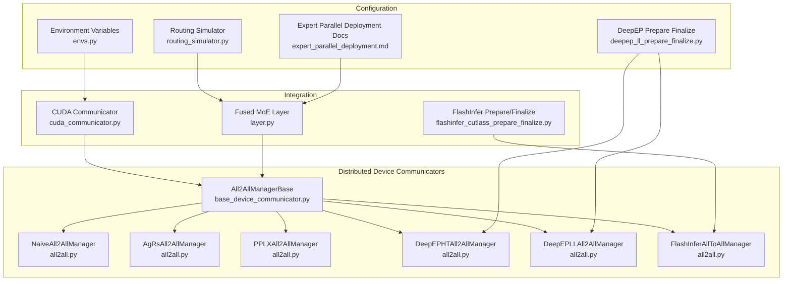
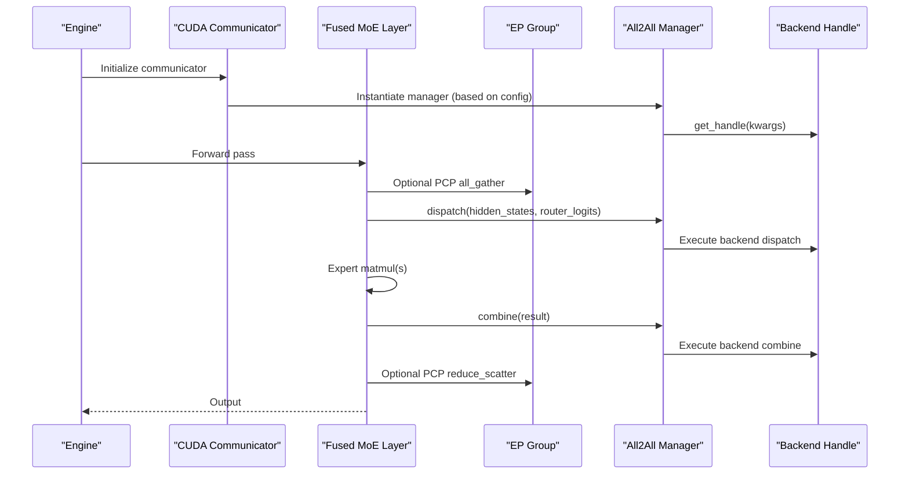
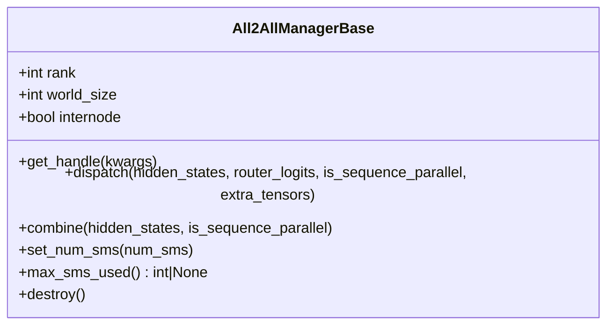
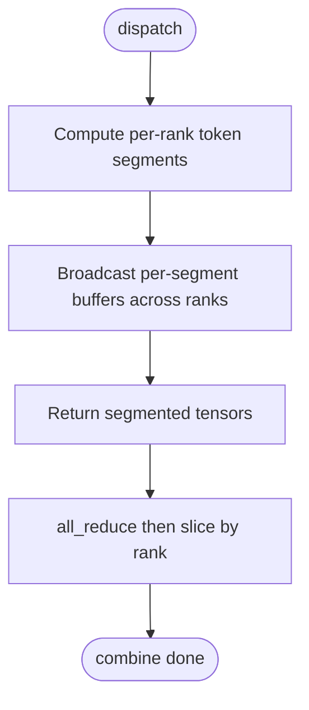
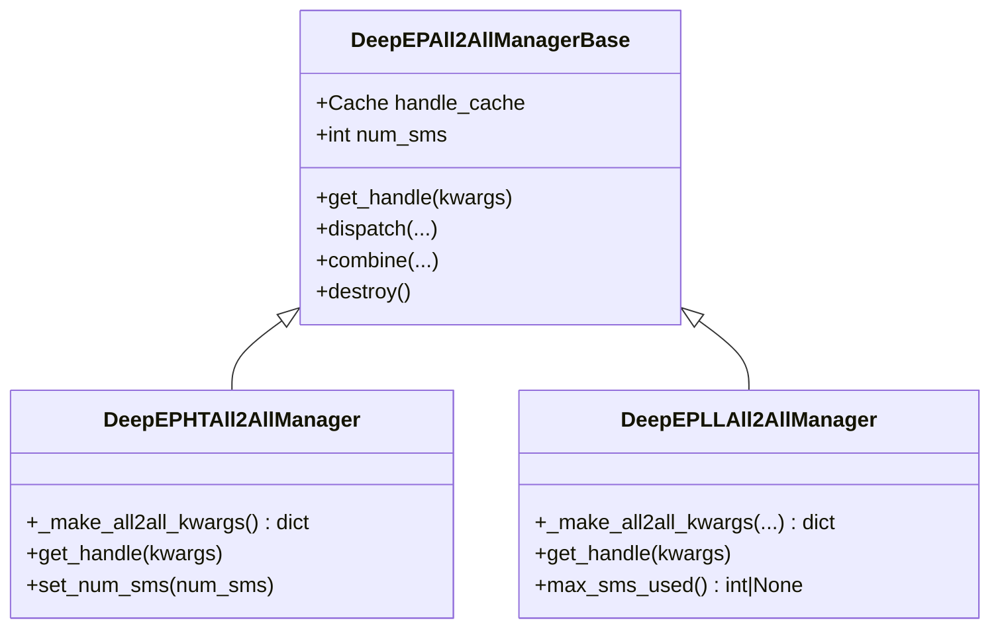
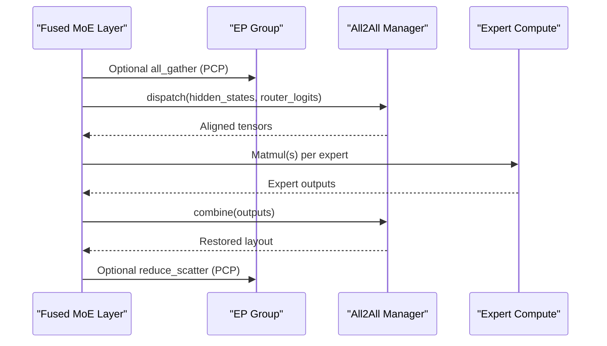
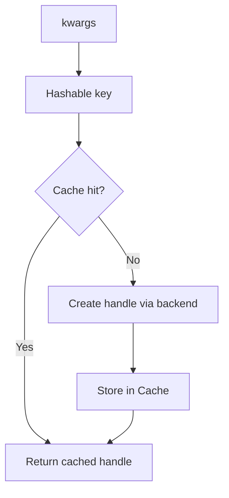
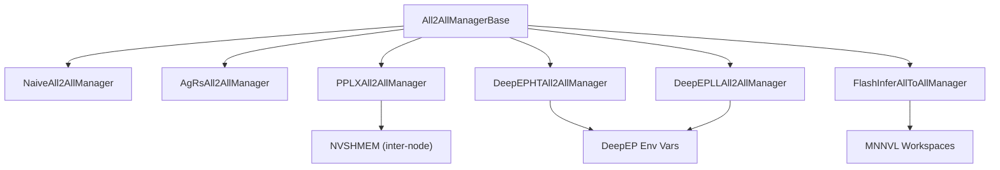

# All2All Manager

<cite>
**Referenced Files in This Document**
- [base_device_communicator.py](file://vllm/distributed/device_communicators/base_device_communicator.py)
- [all2all.py](file://vllm/distributed/device_communicators/all2all.py)
- [cuda_communicator.py](file://vllm/distributed/device_communicators/cuda_communicator.py)
- [layer.py](file://vllm/model_executor/layers/fused_moe/layer.py)
- [flashinfer_cutlass_prepare_finalize.py](file://vllm/model_executor/layers/fused_moe/flashinfer_cutlass_prepare_finalize.py)
- [envs.py](file://vllm/envs.py)
- [routing_simulator.py](file://vllm/model_executor/layers/fused_moe/routing_simulator.py)
- [deepep_ll_prepare_finalize.py](file://vllm/model_executor/layers/fused_moe/deepep_ll_prepare_finalize.py)
- [expert_parallel_deployment.md](file://docs/serving/expert_parallel_deployment.md)
</cite>

## Table of Contents
1. [Introduction](#introduction)
2. [Project Structure](#project-structure)
3. [Core Components](#core-components)
4. [Architecture Overview](#architecture-overview)
5. [Detailed Component Analysis](#detailed-component-analysis)
6. [Dependency Analysis](#dependency-analysis)
7. [Performance Considerations](#performance-considerations)
8. [Troubleshooting Guide](#troubleshooting-guide)
9. [Conclusion](#conclusion)
10. [Appendices](#appendices)

## Introduction
This document explains the All2All communication manager system used by expert-parallel Mixture-of-Experts (MoE) layers in vLLM. It covers the All2AllManagerBase class architecture, concrete implementations for different backends, expert routing and dispatch/combine operations, intra-node versus inter-node communication strategies, handle caching, configuration-driven optimization, and integration with MoE layers. It also provides practical guidance on configuration, expert routing patterns, and debugging communication bottlenecks.

## Project Structure
The All2All system spans several modules:
- Distributed device communicators define the All2All abstraction and concrete managers.
- CUDA communicator selects the manager based on configuration.
- Fused MoE layer integrates All2All for dispatch and combine.
- Environment variables control backend selection and tuning.
- Routing simulator demonstrates expert routing patterns.

**Diagram sources**
- [base_device_communicator.py](file://vllm/distributed/device_communicators/base_device_communicator.py#L28-L88)
- [all2all.py](file://vllm/distributed/device_communicators/all2all.py#L27-L168)
- [cuda_communicator.py](file://vllm/distributed/device_communicators/cuda_communicator.py#L104-L118)
- [layer.py](file://vllm/model_executor/layers/fused_moe/layer.py#L1980-L2058)
- [flashinfer_cutlass_prepare_finalize.py](file://vllm/model_executor/layers/fused_moe/flashinfer_cutlass_prepare_finalize.py#L244-L343)
- [envs.py](file://vllm/envs.py#L183-L190)
- [routing_simulator.py](file://vllm/model_executor/layers/fused_moe/routing_simulator.py#L48-L78)
- [deepep_ll_prepare_finalize.py](file://vllm/model_executor/layers/fused_moe/deepep_ll_prepare_finalize.py#L85-L115)
- [expert_parallel_deployment.md](file://docs/serving/expert_parallel_deployment.md#L38-L50)

**Section sources**
- [base_device_communicator.py](file://vllm/distributed/device_communicators/base_device_communicator.py#L28-L88)
- [all2all.py](file://vllm/distributed/device_communicators/all2all.py#L27-L168)
- [cuda_communicator.py](file://vllm/distributed/device_communicators/cuda_communicator.py#L104-L118)
- [layer.py](file://vllm/model_executor/layers/fused_moe/layer.py#L1980-L2058)
- [envs.py](file://vllm/envs.py#L183-L190)
- [routing_simulator.py](file://vllm/model_executor/layers/fused_moe/routing_simulator.py#L48-L78)
- [deepep_ll_prepare_finalize.py](file://vllm/model_executor/layers/fused_moe/deepep_ll_prepare_finalize.py#L85-L115)
- [expert_parallel_deployment.md](file://docs/serving/expert_parallel_deployment.md#L38-L50)

## Core Components
- All2AllManagerBase: Defines the interface for dispatch, combine, handle creation, and lifecycle management. It computes DP/TP group info and determines intra-node versus inter-node modes.
- Concrete Managers:
  - NaiveAll2AllManager: Broadcast-allreduce-based multicast for debugging/testing.
  - AgRsAll2AllManager: Uses all_gatherv for dispatch and reduce_scatterv for combine.
  - PPLXAll2AllManager: Backend via pplx kernels; initializes NVSHMEM for inter-node.
  - DeepEPHTAll2AllManager and DeepEPLLAll2AllManager: High-throughput and low-latency DeepEP variants with handle caching and SMS control.
  - FlashInferAllToAllManager: FlashInfer-based implementation with workspace preparation and MNNVL integration.
- CUDA Communicator: Selects the All2All backend according to configuration and initializes the manager.
- Fused MoE Layer: Orchestrates dispatch/combine around expert computation, optionally integrating PCP and sequence parallelism.
- Environment Variables: Control backend selection and tuning knobs for DeepEP and FlashInfer.

Key responsibilities:
- Dispatch: Gather or multicast tokens and router logits to align per-expert workload.
- Combine: Scatter or reduce-scatter results back to the original layout.
- Handle caching: Reuse backend handles per configuration to minimize initialization overhead.
- Configuration-driven optimization: Choose backend and tune buffer sizes and SM usage.

**Section sources**
- [base_device_communicator.py](file://vllm/distributed/device_communicators/base_device_communicator.py#L28-L88)
- [all2all.py](file://vllm/distributed/device_communicators/all2all.py#L27-L168)
- [all2all.py](file://vllm/distributed/device_communicators/all2all.py#L169-L245)
- [all2all.py](file://vllm/distributed/device_communicators/all2all.py#L246-L404)
- [all2all.py](file://vllm/distributed/device_communicators/all2all.py#L408-L510)
- [cuda_communicator.py](file://vllm/distributed/device_communicators/cuda_communicator.py#L104-L118)
- [layer.py](file://vllm/model_executor/layers/fused_moe/layer.py#L1980-L2058)
- [envs.py](file://vllm/envs.py#L183-L190)
- [envs.py](file://vllm/envs.py#L1501-L1525)

## Architecture Overview
The All2All system is integrated into the MoE pipeline. The CUDA communicator selects a backend based on configuration, and the Fused MoE layer invokes dispatch and combine around expert computation. FlashInfer and DeepEP managers encapsulate backend-specific optimizations.

**Diagram sources**
- [cuda_communicator.py](file://vllm/distributed/device_communicators/cuda_communicator.py#L104-L118)
- [layer.py](file://vllm/model_executor/layers/fused_moe/layer.py#L1980-L2058)
- [all2all.py](file://vllm/distributed/device_communicators/all2all.py#L27-L168)
- [flashinfer_cutlass_prepare_finalize.py](file://vllm/model_executor/layers/fused_moe/flashinfer_cutlass_prepare_finalize.py#L244-L343)

## Detailed Component Analysis

### All2AllManagerBase Class
- Purpose: Abstract interface for expert-parallel all-to-all communications.
- Key fields: CPU group, DP/TP groups, DP rank/world size, EP rank/world size, internode flag.
- Methods:
  - get_handle: Create or reuse a backend handle based on kwargs.
  - dispatch: Align tokens/router logits for per-expert execution.
  - combine: Restore tensor layout after expert computation.
  - set_num_sms/max_sms_used: Control GPU SM usage for certain backends.
  - destroy: Release resources.

**Diagram sources**
- [base_device_communicator.py](file://vllm/distributed/device_communicators/base_device_communicator.py#L28-L88)

**Section sources**
- [base_device_communicator.py](file://vllm/distributed/device_communicators/base_device_communicator.py#L28-L88)

### Concrete Managers

#### NaiveAll2AllManager
- Strategy: Multicast via broadcast-allreduce per rank segment; combine via all-reduce slice extraction.
- Use case: Debugging/testing only.
- Complexity: Quadratic in ranks for broadcasts; not suitable for large EP sizes.

**Diagram sources**
- [all2all.py](file://vllm/distributed/device_communicators/all2all.py#L27-L104)

**Section sources**
- [all2all.py](file://vllm/distributed/device_communicators/all2all.py#L27-L104)

#### AgRsAll2AllManager
- Strategy: all_gatherv for dispatch, reduce_scatterv for combine.
- Supports extra tensors; leverages DP metadata for chunk sizes.
- Suitable for balanced or predictable routing.

**Section sources**
- [all2all.py](file://vllm/distributed/device_communicators/all2all.py#L108-L168)

#### PPLXAll2AllManager
- Strategy: Backend via pplx kernels.
- Inter-node: Initializes NVSHMEM and synchronizes unique ID across CPU group.
- Handle caching: Reuse handles per kwargs.

**Section sources**
- [all2all.py](file://vllm/distributed/device_communicators/all2all.py#L169-L245)

#### DeepEP Managers
- High-Throughput (DeepEPHTAll2AllManager):
  - Computes buffer kwargs based on internode/intranode conditions.
  - Handle caching; optional set_num_sms to cap GPU SM usage.
- Low-Latency (DeepEPLLAll2AllManager):
  - RDMA-based; size hint computed from tokens, hidden size, ranks, experts.
  - max_sms_used returns 0 (no SMs used for communication).
  - Handle caching; MNNVL toggle controlled by environment.

**Diagram sources**
- [all2all.py](file://vllm/distributed/device_communicators/all2all.py#L246-L404)

**Section sources**
- [all2all.py](file://vllm/distributed/device_communicators/all2all.py#L246-L404)
- [envs.py](file://vllm/envs.py#L1501-L1525)

#### FlashInferAllToAllManager
- Strategy: FlashInfer MNNVL-based all-to-all with workspace preparation.
- Initialization: Builds mapping and MNNVL workspaces; ensures initialization before use.
- Integration: Provides prepare/finalize helpers for dispatch/combine.

**Section sources**
- [all2all.py](file://vllm/distributed/device_communicators/all2all.py#L408-L510)
- [flashinfer_cutlass_prepare_finalize.py](file://vllm/model_executor/layers/fused_moe/flashinfer_cutlass_prepare_finalize.py#L244-L343)

### Dispatch and Combine Operations in MoE Layers
- Dispatch: Align tokens/router logits across EP ranks for per-expert compute.
- Combine: Aggregate results back to the original layout; optional PCP all_gather/reduce_scatter.
- Optional PCP: When PCP size > 1, all_gather router logits and hidden states before compute, then reduce_scatter afterward.

**Diagram sources**
- [layer.py](file://vllm/model_executor/layers/fused_moe/layer.py#L1980-L2058)
- [all2all.py](file://vllm/distributed/device_communicators/all2all.py#L108-L168)

**Section sources**
- [layer.py](file://vllm/model_executor/layers/fused_moe/layer.py#L1980-L2058)

### Intra-node vs Inter-node Communication Strategies
- Internode detection: Based on whether all ranks share the same node.
- PPLXAll2AllManager:
  - Inter-node: Initialize NVSHMEM and synchronize unique ID across CPU group.
  - Intranode: Use peer-to-peer mapping directly.
- DeepEP:
  - High-throughput: May force intranode RDMA depending on environment variable.
  - Low-latency: RDMA-based; MNNVL toggle controlled by environment variable.
- FlashInfer:
  - Uses MNNVL workspaces; backend selection is explicit via manager.

**Section sources**
- [base_device_communicator.py](file://vllm/distributed/device_communicators/base_device_communicator.py#L28-L56)
- [all2all.py](file://vllm/distributed/device_communicators/all2all.py#L169-L245)
- [all2all.py](file://vllm/distributed/device_communicators/all2all.py#L293-L340)
- [all2all.py](file://vllm/distributed/device_communicators/all2all.py#L341-L404)
- [envs.py](file://vllm/envs.py#L1501-L1525)

### Handle Caching Mechanism
- Cache class: Thread-safe WeakValueDictionary keyed by sorted kwargs to reuse handles.
- Managers:
  - PPLXAll2AllManager: Creates handles via pplx AllToAll factory and stores in Cache.
  - DeepEP managers: Create deep_ep.Buffer handles and store in Cache.
  - FlashInferAllToAllManager: Returns self as handle; workspace prepared once.

**Diagram sources**
- [base_device_communicator.py](file://vllm/distributed/device_communicators/base_device_communicator.py#L12-L27)
- [all2all.py](file://vllm/distributed/device_communicators/all2all.py#L210-L217)
- [all2all.py](file://vllm/distributed/device_communicators/all2all.py#L324-L329)
- [all2all.py](file://vllm/distributed/device_communicators/all2all.py#L396-L401)

**Sectionources**
- [base_device_communicator.py](file://vllm/distributed/device_communicators/base_device_communicator.py#L12-L27)
- [all2all.py](file://vllm/distributed/device_communicators/all2all.py#L210-L217)
- [all2all.py](file://vllm/distributed/device_communicators/all2all.py#L324-L401)

### Configuration-Based Communication Optimization
- Backend selection:
  - CUDA communicator chooses backend based on environment variable.
  - Options include naive, pplx, deepep_high_throughput, deepep_low_latency, allgather_reducescatter, flashinfer_all2allv.
- Tuning:
  - DeepEP buffer size, RDMA bytes, QPs per rank, MNNVL usage, and SMS allocation.
  - FlashInfer workspace buffer size.

**Section sources**
- [cuda_communicator.py](file://vllm/distributed/device_communicators/cuda_communicator.py#L104-L118)
- [envs.py](file://vllm/envs.py#L183-L190)
- [envs.py](file://vllm/envs.py#L1501-L1525)

### Integration with MoE Layers
- Fused MoE layer:
  - Calls dispatch/combine around expert matmul(s).
  - Handles PCP all_gather/reduce_scatter when applicable.
  - Integrates with modular kernels and quantization methods.
- Routing:
  - Distribution-based routing simulator demonstrates expert assignment patterns.

**Section sources**
- [layer.py](file://vllm/model_executor/layers/fused_moe/layer.py#L1980-L2058)
- [routing_simulator.py](file://vllm/model_executor/layers/fused_moe/routing_simulator.py#L48-L78)

## Dependency Analysis
- Coupling:
  - All2AllManagerBase depends on DP/TP groups and EP group utilities.
  - Concrete managers depend on backend libraries (pplx, deep_ep, flashinfer).
- Cohesion:
  - Each manager encapsulates backend-specific logic and handle caching.
- External dependencies:
  - NVSHMEM for inter-node PPLX.
  - MNNVL for FlashInfer.
  - Environment variables for tuning.

**Diagram sources**
- [base_device_communicator.py](file://vllm/distributed/device_communicators/base_device_communicator.py#L28-L88)
- [all2all.py](file://vllm/distributed/device_communicators/all2all.py#L169-L245)
- [all2all.py](file://vllm/distributed/device_communicators/all2all.py#L408-L510)
- [envs.py](file://vllm/envs.py#L1501-L1525)

**Section sources**
- [base_device_communicator.py](file://vllm/distributed/device_communicators/base_device_communicator.py#L28-L88)
- [all2all.py](file://vllm/distributed/device_communicators/all2all.py#L169-L245)
- [all2all.py](file://vllm/distributed/device_communicators/all2all.py#L408-L510)
- [envs.py](file://vllm/envs.py#L1501-L1525)

## Performance Considerations
- Backend selection:
  - Prefer allgather-reducescatter for balanced routing and moderate loads.
  - Use DeepEP low-latency for small-token bursts; high-throughput for sustained throughput.
  - Use FlashInfer for large EP sizes with MNNVL-capable fabrics.
- Buffer sizing:
  - Adjust DeepEP buffer size and RDMA hints; enable MNNVL for low-latency inter-node.
- SM allocation:
  - Cap SMs for DeepEP high-throughput to balance compute and communication.
- Chunking:
  - Use DP chunking and PCP all_gather/reduce_scatter to manage memory and bandwidth.
- Quantization and dispatch:
  - FlashInfer path supports FP8-like scales and block-scaled paths to reduce bandwidth.

[No sources needed since this section provides general guidance]

## Troubleshooting Guide
Common issues and remedies:
- Unknown all2all backend:
  - Ensure VLLM_ALL2ALL_BACKEND is set to a supported option.
- DeepEP/FlashInfer not found:
  - Install required kernels and libraries; verify availability checks.
- Inter-node NVSHMEM errors:
  - Confirm NVSHMEM UID broadcast and initialization across CPU group.
- Excessive SM usage:
  - Reduce SMS for DeepEP high-throughput or switch to low-latency variant.
- Imbalanced expert loads:
  - Use routing simulator to evaluate distributions; consider load balancing policies.

**Section sources**
- [cuda_communicator.py](file://vllm/distributed/device_communicators/cuda_communicator.py#L104-L118)
- [all2all.py](file://vllm/distributed/device_communicators/all2all.py#L169-L245)
- [envs.py](file://vllm/envs.py#L183-L190)
- [routing_simulator.py](file://vllm/model_executor/layers/fused_moe/routing_simulator.py#L48-L78)

## Conclusion
The All2All manager system provides a flexible, backend-agnostic abstraction for expert-parallel communication in MoE layers. By selecting appropriate managers, leveraging handle caching, and tuning environment variables, vLLM achieves scalable and efficient expert routing across diverse hardware configurations. The integration with Fused MoE layers and routing simulators enables robust experimentation and production-grade performance.

[No sources needed since this section summarizes without analyzing specific files]

## Appendices

### A. All2All Configuration Examples
- Backend selection:
  - Set VLLM_ALL2ALL_BACKEND to one of: naive, pplx, deepep_high_throughput, deepep_low_latency, allgather_reducescatter, flashinfer_all2allv.
- DeepEP tuning:
  - VLLM_DEEPEP_BUFFER_SIZE_MB: Adjust buffer size in MB.
  - VLLM_DEEPEP_HIGH_THROUGHPUT_FORCE_INTRA_NODE: Force intranode kernel for inter-node high-throughput.
  - VLLM_DEEPEP_LOW_LATENCY_USE_MNNVL: Enable MNNVL for low-latency inter-node.
  - VLLM_DBO_COMM_SMS: Number of SMs allocated for communication.
- FlashInfer tuning:
  - VLLM_FLASHINFER_WORKSPACE_BUFFER_SIZE: Workspace buffer size in bytes.

**Section sources**
- [envs.py](file://vllm/envs.py#L183-L190)
- [envs.py](file://vllm/envs.py#L1501-L1525)

### B. Expert Routing Patterns
- Distribution-based routing:
  - Uniform or normal distributions for testing routing imbalance and load balancing.
- Integration:
  - Use routing simulator to generate expert assignments and validate token counts per expert.

**Section sources**
- [routing_simulator.py](file://vllm/model_executor/layers/fused_moe/routing_simulator.py#L48-L78)

### C. EP Size and Scaling
- EP_SIZE = TP_SIZE × DP_SIZE; EP group controls expert sharding and communication.

**Section sources**
- [expert_parallel_deployment.md](file://docs/serving/expert_parallel_deployment.md#L38-L50)