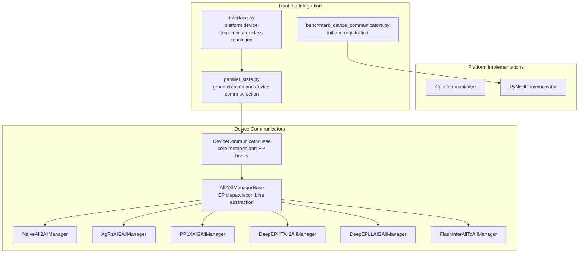
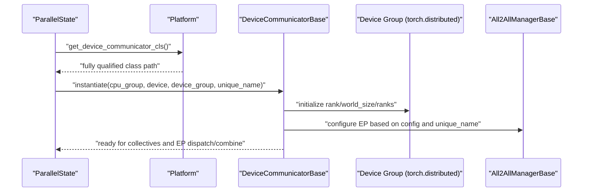
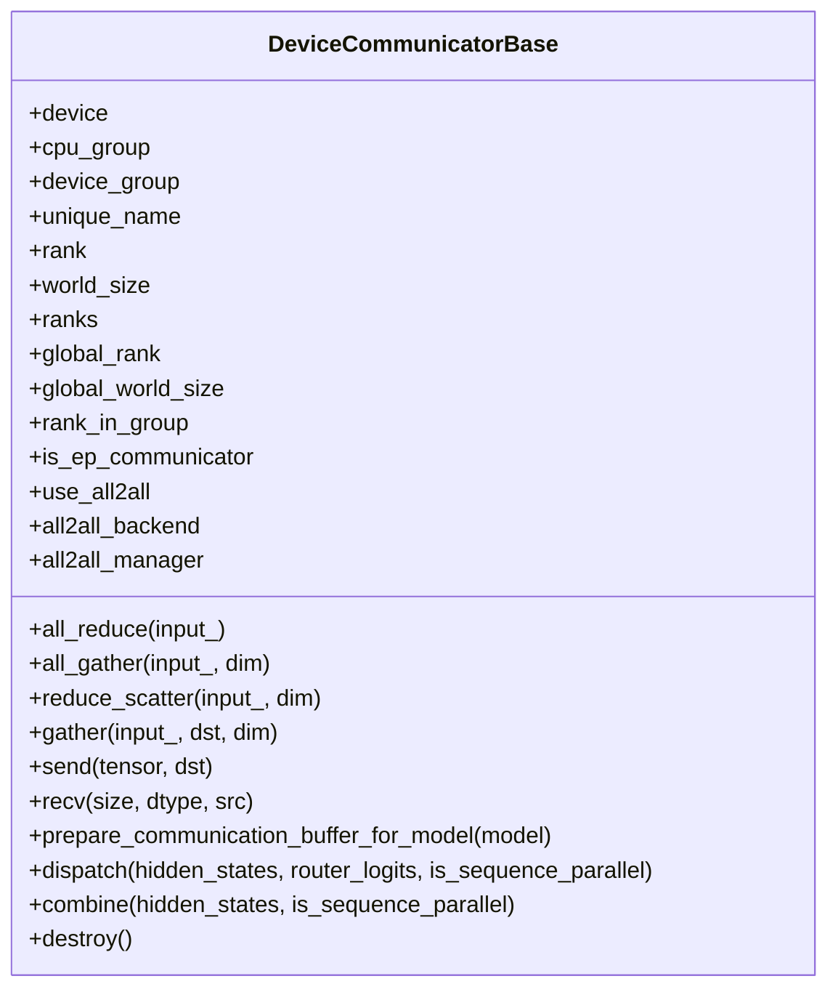
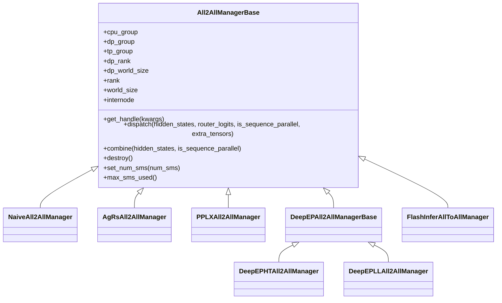
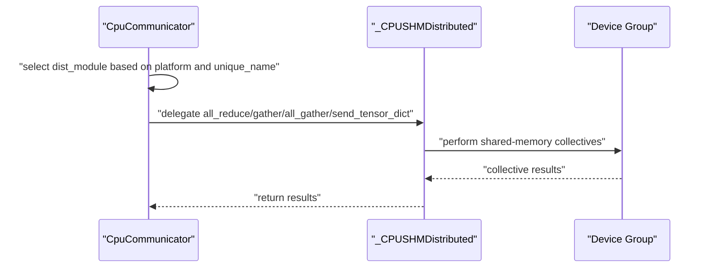
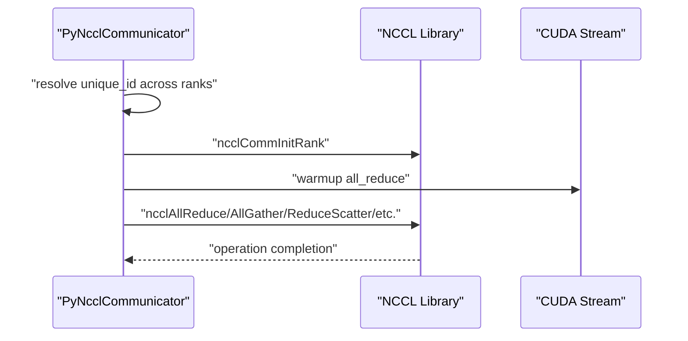
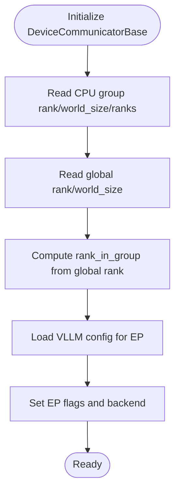
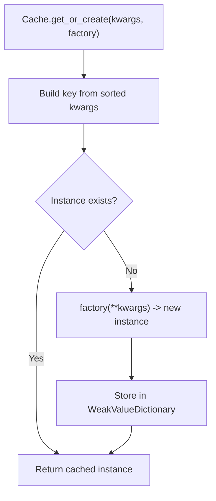
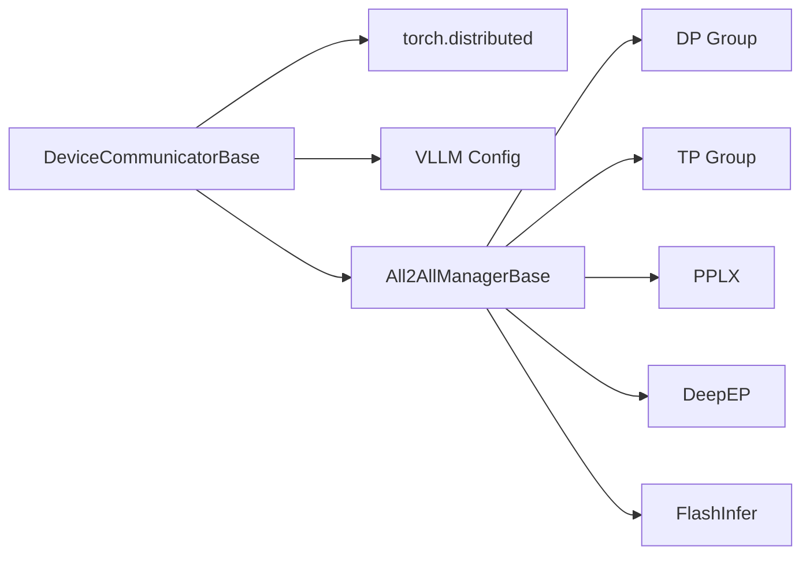

# Base Communicator Interface

<cite>
**Referenced Files in This Document**
- [base_device_communicator.py](file://vllm/distributed/device_communicators/base_device_communicator.py)
- [all2all.py](file://vllm/distributed/device_communicators/all2all.py)
- [cpu_communicator.py](file://vllm/distributed/device_communicators/cpu_communicator.py)
- [pynccl.py](file://vllm/distributed/device_communicators/pynccl.py)
- [parallel_state.py](file://vllm/distributed/parallel_state.py)
- [interface.py](file://vllm/platforms/interface.py)
- [benchmark_device_communicators.py](file://benchmarks/kernels/benchmark_device_communicators.py)
</cite>

## Table of Contents
1. [Introduction](#introduction)
2. [Project Structure](#project-structure)
3. [Core Components](#core-components)
4. [Architecture Overview](#architecture-overview)
5. [Detailed Component Analysis](#detailed-component-analysis)
6. [Dependency Analysis](#dependency-analysis)
7. [Performance Considerations](#performance-considerations)
8. [Troubleshooting Guide](#troubleshooting-guide)
9. [Conclusion](#conclusion)
10. [Appendices](#appendices)

## Introduction
This document describes the base device communicator interface used in vLLM’s distributed runtime. It focuses on the DeviceCommunicatorBase class, its core communication methods (all_reduce, all_gather, reduce_scatter, gather, send, recv), collective operation implementations, device group management, initialization and rank tracking, integration with PyTorch’s distributed backend, abstract methods for subclasses, caching mechanisms for communicator instances, and expert parallel communication support via All2AllManagerBase. Practical examples show how to extend the base class and implement custom communication patterns.

## Project Structure
The base communicator interface and related components live under the distributed device communicators package. Platform-specific implementations and expert parallel managers are integrated into the broader distributed runtime and parallel state initialization.

**Diagram sources**
- [base_device_communicator.py](file://vllm/distributed/device_communicators/base_device_communicator.py#L92-L303)
- [all2all.py](file://vllm/distributed/device_communicators/all2all.py#L1-L510)
- [cpu_communicator.py](file://vllm/distributed/device_communicators/cpu_communicator.py#L1-L210)
- [pynccl.py](file://vllm/distributed/device_communicators/pynccl.py#L1-L387)
- [parallel_state.py](file://vllm/distributed/parallel_state.py#L288-L392)
- [interface.py](file://vllm/platforms/interface.py#L510-L521)
- [benchmark_device_communicators.py](file://benchmarks/kernels/benchmark_device_communicators.py#L85-L141)

**Section sources**
- [base_device_communicator.py](file://vllm/distributed/device_communicators/base_device_communicator.py#L92-L303)
- [all2all.py](file://vllm/distributed/device_communicators/all2all.py#L1-L510)
- [parallel_state.py](file://vllm/distributed/parallel_state.py#L288-L392)
- [interface.py](file://vllm/platforms/interface.py#L510-L521)
- [benchmark_device_communicators.py](file://benchmarks/kernels/benchmark_device_communicators.py#L85-L141)

## Core Components
- DeviceCommunicatorBase: Provides a unified interface for device-side collectives and point-to-point operations, integrates with PyTorch distributed groups, and exposes hooks for expert parallel dispatch/combine.
- All2AllManagerBase: Abstract manager for expert parallel all-to-all communication, with concrete implementations for different backends.
- CpuCommunicator: CPU-bound communicator leveraging shared-memory operations for TP/PP groups on x86.
- PyNcclCommunicator: NCCL-backed communicator for GPU devices, with symmetric memory operations and optional warmup.

Key responsibilities:
- Initialization and rank tracking using PyTorch process groups.
- Collective operations (all_reduce, all_gather, reduce_scatter, gather) and point-to-point send/recv.
- Expert parallel dispatch/combine hooks for token routing and MoE kernels.
- Optional caching of manager handles and communicator instances.

**Section sources**
- [base_device_communicator.py](file://vllm/distributed/device_communicators/base_device_communicator.py#L92-L303)
- [all2all.py](file://vllm/distributed/device_communicators/all2all.py#L1-L120)
- [cpu_communicator.py](file://vllm/distributed/device_communicators/cpu_communicator.py#L1-L210)
- [pynccl.py](file://vllm/distributed/device_communicators/pynccl.py#L1-L148)

## Architecture Overview
The base communicator sits at the intersection of PyTorch distributed groups and platform-specific backends. Parallel state constructs groups and conditionally instantiates a device communicator per platform. Expert parallel logic is delegated to All2AllManagerBase implementations.

**Diagram sources**
- [parallel_state.py](file://vllm/distributed/parallel_state.py#L358-L392)
- [interface.py](file://vllm/platforms/interface.py#L510-L521)
- [base_device_communicator.py](file://vllm/distributed/device_communicators/base_device_communicator.py#L92-L133)

## Detailed Component Analysis

### DeviceCommunicatorBase
DeviceCommunicatorBase defines the canonical set of device-side communication primitives and EP hooks. It:
- Initializes rank tracking and group membership from the provided CPU process group and optional device group.
- Implements core collectives:
  - all_reduce: Uses the device group.
  - all_gather: Concat-style all-gather to avoid torch.compile compatibility issues.
  - reduce_scatter: Ensures input contiguity and correct chunking.
  - gather: Gathers to a specific local rank destination.
  - send/recv: Blocking point-to-point operations using global ranks mapped from local ranks.
- Provides EP hooks:
  - prepare_communication_buffer_for_model: Initializes modular kernels for MoE modules when in an EP communicator.
  - dispatch/combine: No-op base behavior; intended to be overridden by subclasses or All2All managers.

Initialization highlights:
- Reads VLLM configuration to determine whether expert parallel is enabled and which backend to use.
- Sets flags indicating EP usage and stores a reference to the All2All manager (None by default).

**Diagram sources**
- [base_device_communicator.py](file://vllm/distributed/device_communicators/base_device_communicator.py#L92-L303)

**Section sources**
- [base_device_communicator.py](file://vllm/distributed/device_communicators/base_device_communicator.py#L92-L303)

### All2AllManagerBase and Implementations
All2AllManagerBase encapsulates expert parallel all-to-all logic. It computes DP/TP group contexts, determines internode vs intranode communication, and exposes:
- get_handle: Factory method to create/reuse backend-specific handles based on kwargs.
- dispatch: Dispatch tokens/activations across DP ranks (optionally SP-aware).
- combine: Reduce-scatter or aggregation across DP ranks.
- destroy: Cleanup resources.

Concrete managers:
- NaiveAll2AllManager: Broadcast-based multicast for testing/debugging.
- AgRsAll2AllManager: Uses all_gather + reduce_scatter for correctness and portability.
- PPLXAll2AllManager: Integrates PPLX kernels with NVSHMEM for inter-node.
- DeepEPHTAll2AllManager / DeepEPLLAll2AllManager: Integrates DeepEP high-throughput and low-latency kernels with buffer caching and SMS tuning.
- FlashInferAllToAllManager: Integrates FlashInfer MNNVL-based all-to-all with workspace initialization.

**Diagram sources**
- [all2all.py](file://vllm/distributed/device_communicators/all2all.py#L1-L120)
- [all2all.py](file://vllm/distributed/device_communicators/all2all.py#L120-L510)

**Section sources**
- [all2all.py](file://vllm/distributed/device_communicators/all2all.py#L1-L120)
- [all2all.py](file://vllm/distributed/device_communicators/all2all.py#L120-L510)

### CpuCommunicator
CpuCommunicator extends DeviceCommunicatorBase and adapts to platform capabilities:
- Uses torch.distributed by default.
- On x86 with shared-memory capability, switches to a CPU shared-memory backend via _CPUSHMDistributed for TP/PP groups, enabling optimized local collectives and tensor dictionary send/recv.

Key behaviors:
- all_reduce/gather/all_gather delegate to the selected dist module.
- send_tensor_dict/recv_tensor_dict pack/unpack dictionaries with metadata for cross-rank transport.

**Diagram sources**
- [cpu_communicator.py](file://vllm/distributed/device_communicators/cpu_communicator.py#L1-L210)

**Section sources**
- [cpu_communicator.py](file://vllm/distributed/device_communicators/cpu_communicator.py#L1-L210)

### PyNcclCommunicator
PyNcclCommunicator provides an NCCL-backed communicator for GPU devices:
- Validates group backend (must not be NCCL) and initializes an NCCL communicator bound to a specific device.
- Supports all_reduce, all_gather, reduce_scatter, reduce_scatterv, send, recv, broadcast, and NCCL group operations.
- Registers symmetric memory custom ops for certain kernels and performs a warmup all_reduce.

**Diagram sources**
- [pynccl.py](file://vllm/distributed/device_communicators/pynccl.py#L58-L148)
- [pynccl.py](file://vllm/distributed/device_communicators/pynccl.py#L150-L340)

**Section sources**
- [pynccl.py](file://vllm/distributed/device_communicators/pynccl.py#L58-L148)
- [pynccl.py](file://vllm/distributed/device_communicators/pynccl.py#L150-L340)

### Initialization and Rank Tracking
DeviceCommunicatorBase reads process group metadata to populate:
- rank, world_size, ranks (global ranks in the CPU group)
- global_rank, global_world_size (global ranks across all groups)
- rank_in_group (rank within the CPU group mapped to global rank)

These fields are used by collective operations and EP logic.

**Diagram sources**
- [base_device_communicator.py](file://vllm/distributed/device_communicators/base_device_communicator.py#L92-L133)

**Section sources**
- [base_device_communicator.py](file://vllm/distributed/device_communicators/base_device_communicator.py#L92-L133)

### Integration with PyTorch Distributed Backend
DeviceCommunicatorBase relies on torch.distributed for:
- all_reduce, all_gather_into_tensor, reduce_scatter_tensor, gather, send, recv
- Determining ranks and world size from the provided CPU and device process groups

Parallel state constructs device communicators and selects platform-specific classes via platform interface.

**Section sources**
- [base_device_communicator.py](file://vllm/distributed/device_communicators/base_device_communicator.py#L134-L203)
- [parallel_state.py](file://vllm/distributed/parallel_state.py#L358-L392)
- [interface.py](file://vllm/platforms/interface.py#L510-L521)

### Abstract Methods and Subclass Contracts
Subclasses must implement:
- For All2AllManagerBase:
  - get_handle(kwargs): Return a handle for a given configuration.
  - dispatch(...): Dispatch tokens/activations across DP ranks.
  - combine(...): Combine results across DP ranks.
  - destroy(): Release resources.
- For DeviceCommunicatorBase:
  - The base class provides robust defaults for most methods; subclasses may override to integrate specialized backends (e.g., GPU-specific collectives).

Optional extension points:
- prepare_communication_buffer_for_model: Initialize EP-related buffers or kernels for MoE modules.

**Section sources**
- [all2all.py](file://vllm/distributed/device_communicators/all2all.py#L58-L90)
- [base_device_communicator.py](file://vllm/distributed/device_communicators/base_device_communicator.py#L263-L303)

### Caching Mechanism for Communicator Instances
DeviceCommunicatorBase includes a Cache utility with a WeakValueDictionary to cache instances keyed by a hashable representation of constructor kwargs. This reduces redundant allocations and enables reuse across similar configurations.

**Diagram sources**
- [base_device_communicator.py](file://vllm/distributed/device_communicators/base_device_communicator.py#L12-L27)

**Section sources**
- [base_device_communicator.py](file://vllm/distributed/device_communicators/base_device_communicator.py#L12-L27)

### Expert Parallel Communication Support
Expert parallel dispatch/combine is controlled by:
- is_ep_communicator flag derived from unique_name
- use_all2all determined by VLLM config (data_parallel_size > 1)
- all2all_backend configured in parallel config

Dispatch/combine are invoked during MoE routing and recomposition. Managers encapsulate backend-specific implementations.

**Section sources**
- [base_device_communicator.py](file://vllm/distributed/device_communicators/base_device_communicator.py#L118-L133)
- [all2all.py](file://vllm/distributed/device_communicators/all2all.py#L1-L120)

### Practical Examples

#### Extending DeviceCommunicatorBase
To add a new device backend:
- Subclass DeviceCommunicatorBase and override core methods (e.g., all_reduce, all_gather) to use your backend.
- Optionally override dispatch/combine to integrate with All2AllManagerBase.
- Use the provided rank tracking fields to route operations correctly.

Implementation references:
- [DeviceCommunicatorBase core methods](file://vllm/distributed/device_communicators/base_device_communicator.py#L134-L258)
- [EP hooks](file://vllm/distributed/device_communicators/base_device_communicator.py#L263-L303)

#### Implementing a Custom All2All Manager
To implement a new EP backend:
- Subclass All2AllManagerBase and implement get_handle, dispatch, combine.
- Use DP/TP group information and is_sequence_parallel to route tokens appropriately.
- Manage resource lifecycle via destroy.

Implementation references:
- [All2AllManagerBase contract](file://vllm/distributed/device_communicators/all2all.py#L29-L90)
- [Example managers](file://vllm/distributed/device_communicators/all2all.py#L120-L510)

#### Using PyNcclCommunicator
Initialize and use NCCL-backed collectives:
- Ensure the group is not NCCL and bind to a unique device.
- Warmup with a small all_reduce.
- Use all_reduce, all_gather, reduce_scatter, send, recv.

Implementation references:
- [PyNccl initialization and warmup](file://vllm/distributed/device_communicators/pynccl.py#L118-L148)
- [Collective methods](file://vllm/distributed/device_communicators/pynccl.py#L150-L340)

#### Benchmark Initialization Pattern
The benchmark runner demonstrates initializing multiple communicators and registering symmetric ops for NCCL.

Implementation references:
- [Benchmark communicator initialization](file://benchmarks/kernels/benchmark_device_communicators.py#L85-L141)

## Dependency Analysis
DeviceCommunicatorBase depends on:
- torch.distributed for collectives and group metadata.
- VLLM configuration for EP enablement and backend selection.
- All2AllManagerBase subclasses for EP dispatch/combine.

All2AllManagerBase depends on:
- DP/TP group accessors and EP group context.
- Backend libraries (PPLX, DeepEP, FlashInfer) when instantiated.

**Diagram sources**
- [base_device_communicator.py](file://vllm/distributed/device_communicators/base_device_communicator.py#L92-L133)
- [all2all.py](file://vllm/distributed/device_communicators/all2all.py#L1-L120)

**Section sources**
- [base_device_communicator.py](file://vllm/distributed/device_communicators/base_device_communicator.py#L92-L133)
- [all2all.py](file://vllm/distributed/device_communicators/all2all.py#L1-L120)

## Performance Considerations
- Prefer concat-style all_gather in DeviceCommunicatorBase to maintain torch.compile compatibility.
- Ensure input contiguity for reduce_scatter to avoid incorrect results.
- Use backend-specific All2All managers for EP workloads; DeepEP and PPLX offer high-throughput paths, while NaiveAll2AllManager is for testing.
- Leverage caching for manager handles and communicator instances to minimize overhead.

## Troubleshooting Guide
Common issues and checks:
- NCCL device mismatch: PyNcclCommunicator asserts that tensors are on the same device as the communicator; ensure device binding is correct.
  - Reference: [PyNccl device assertions](file://vllm/distributed/device_communicators/pynccl.py#L150-L181)
- World size == 1: DeviceCommunicatorBase bypasses reduce_scatter early; verify world_size and group membership.
  - Reference: [reduce_scatter bypass](file://vllm/distributed/device_communicators/base_device_communicator.py#L172-L176)
- EP not enabled: Verify VLLM config and unique_name; ensure is_ep_communicator and use_all2all flags are set.
  - Reference: [EP flags](file://vllm/distributed/device_communicators/base_device_communicator.py#L118-L133)
- Backend availability: Some managers require optional libraries; ensure dependencies are installed.
  - Reference: [PPLX/DeepEP/FlashInfer assertions](file://vllm/distributed/device_communicators/all2all.py#L170-L245)

**Section sources**
- [pynccl.py](file://vllm/distributed/device_communicators/pynccl.py#L150-L181)
- [base_device_communicator.py](file://vllm/distributed/device_communicators/base_device_communicator.py#L172-L176)
- [base_device_communicator.py](file://vllm/distributed/device_communicators/base_device_communicator.py#L118-L133)
- [all2all.py](file://vllm/distributed/device_communicators/all2all.py#L170-L245)

## Conclusion
DeviceCommunicatorBase provides a consistent, PyTorch-integrated interface for device-side communication with robust collective operations and expert parallel hooks. Combined with All2AllManagerBase implementations, it supports diverse backends and performance profiles. Subclasses can specialize behavior while reusing the base’s rank tracking, caching, and EP integration.

## Appendices

### API Summary: DeviceCommunicatorBase
- all_reduce(input_): In-place all_reduce on device group.
- all_gather(input_, dim): Concat-style all-gather with reshape.
- reduce_scatter(input_, dim): Contiguous input required; chunked reduce-scatter.
- gather(input_, dst, dim): Gather to a specific local rank.
- send(tensor, dst): Blocking send to destination rank.
- recv(size, dtype, src): Blocking receive into allocated tensor.
- prepare_communication_buffer_for_model(model): Initialize EP buffers for MoE modules.
- dispatch/combine: EP hooks for token routing and recomposition.

**Section sources**
- [base_device_communicator.py](file://vllm/distributed/device_communicators/base_device_communicator.py#L134-L303)

### API Summary: All2AllManagerBase
- get_handle(kwargs): Backend-specific handle factory.
- dispatch(hidden_states, router_logits, is_sequence_parallel, extra_tensors): Dispatch tokens across DP ranks.
- combine(hidden_states, is_sequence_parallel): Combine tokens across DP ranks.
- destroy(): Release backend resources.
- set_num_sms/max_sms_used(): Control and query GPU SM usage for certain backends.

**Section sources**
- [all2all.py](file://vllm/distributed/device_communicators/all2all.py#L29-L90)
- [all2all.py](file://vllm/distributed/device_communicators/all2all.py#L247-L510)