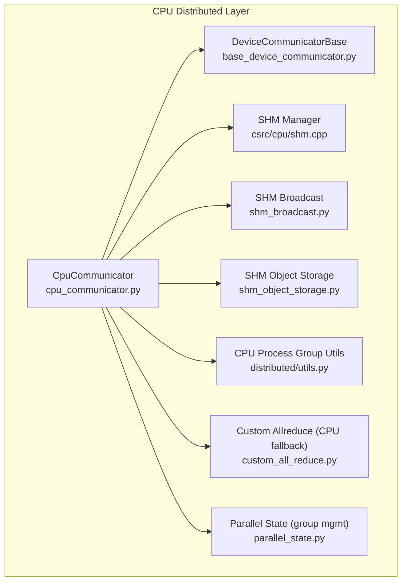
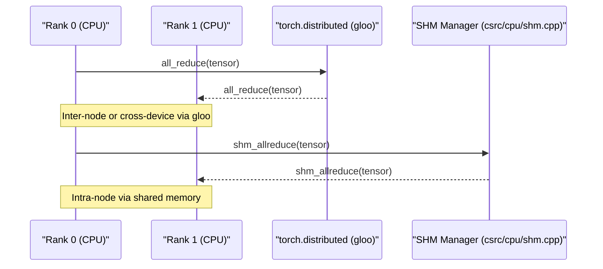
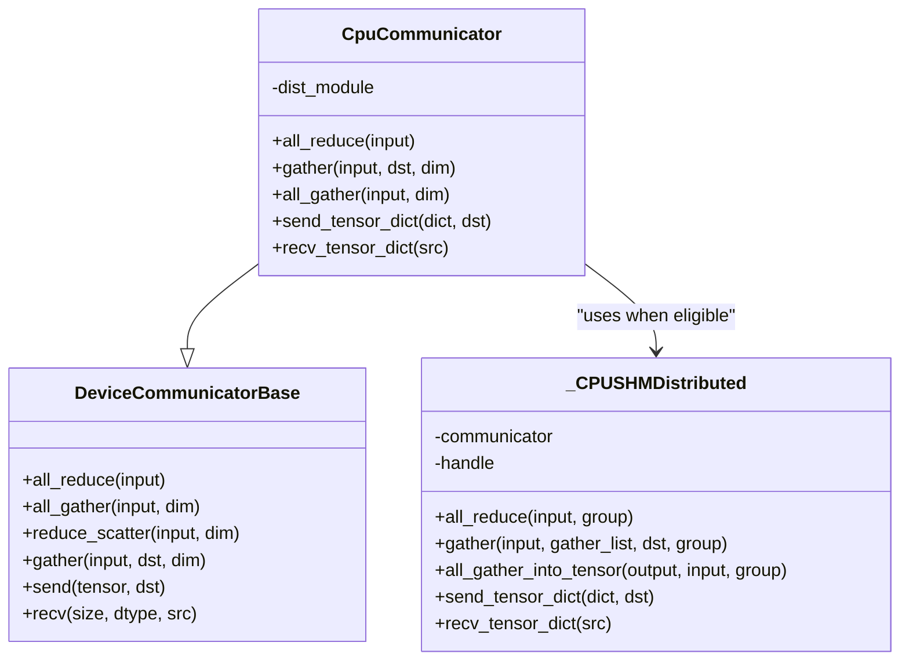
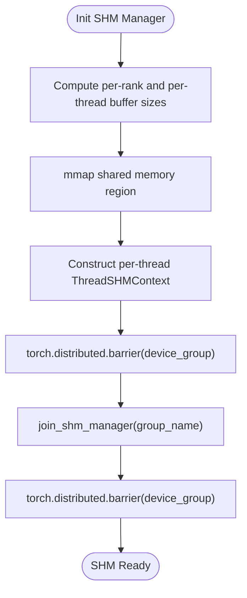
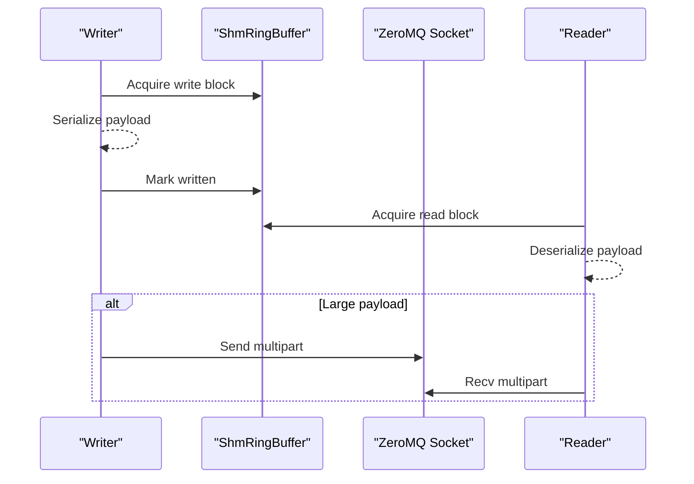
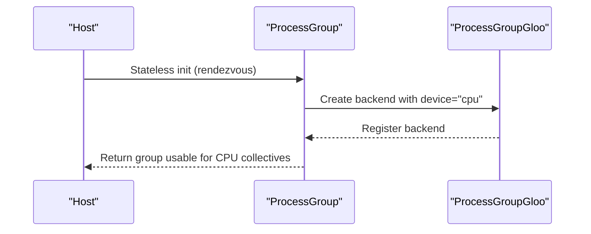
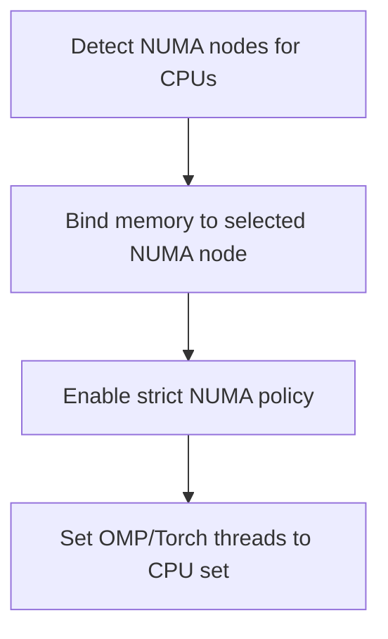
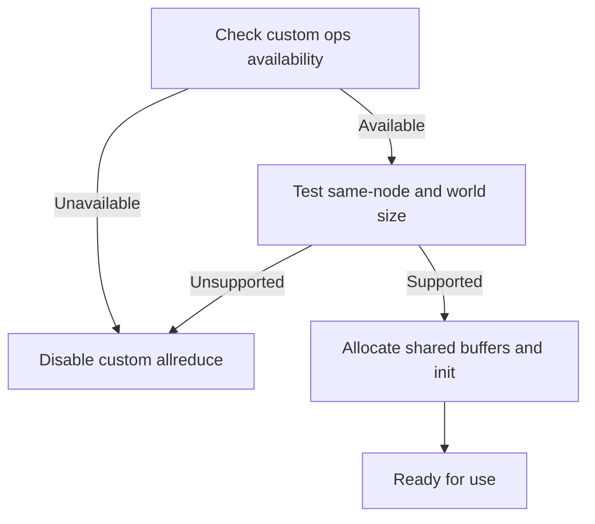
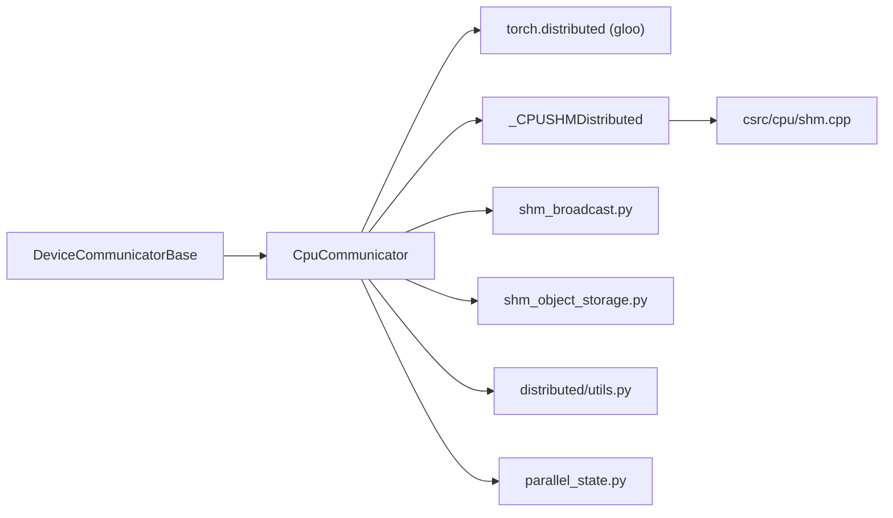

# CPU Communicator

<cite>
**Referenced Files in This Document**
- [cpu_communicator.py](file://vllm/distributed/device_communicators/cpu_communicator.py)
- [base_device_communicator.py](file://vllm/distributed/device_communicators/base_device_communicator.py)
- [utils.py](file://vllm/distributed/utils.py)
- [shm.cpp](file://csrc/cpu/shm.cpp)
- [shm_broadcast.py](file://vllm/distributed/device_communicators/shm_broadcast.py)
- [shm_object_storage.py](file://vllm/distributed/device_communicators/shm_object_storage.py)
- [custom_all_reduce.py](file://vllm/distributed/device_communicators/custom_all_reduce.py)
- [parallel_state.py](file://vllm/distributed/parallel_state.py)
- [benchmark_device_communicators.py](file://benchmarks/kernels/benchmark_device_communicators.py)
- [utils.cpp](file://csrc/cpu/utils.cpp)
</cite>

## Table of Contents
1. [Introduction](#introduction)
2. [Project Structure](#project-structure)
3. [Core Components](#core-components)
4. [Architecture Overview](#architecture-overview)
5. [Detailed Component Analysis](#detailed-component-analysis)
6. [Dependency Analysis](#dependency-analysis)
7. [Performance Considerations](#performance-considerations)
8. [Troubleshooting Guide](#troubleshooting-guide)
9. [Conclusion](#conclusion)
10. [Appendices](#appendices)

## Introduction
This document explains the CPU device communicator implementation in the repository. It focuses on CPU-side communication patterns, memory management across CPU ranks, and inter-process communication strategies. It covers how collective operations are implemented on CPU devices, how shared memory is used, and how NUMA awareness is integrated. It also documents integration with CPU backends (notably MPI-compatible gloo), process group management, and performance considerations for multi-core systems. Practical configuration examples, scaling patterns, and debugging guidance for CPU communication bottlenecks are included.

## Project Structure
The CPU communicator sits within the distributed subsystem and integrates with shared memory primitives and CPU-friendly backends. The key areas are:
- CPU communicator wrapper and SHM-backed dispatcher
- Shared memory manager and ring buffers
- CPU broadcast and object storage utilities
- CPU process group initialization utilities
- Optional CPU-side custom allreduce (for heterogeneous environments)
- NUMA-aware CPU thread/memory binding helpers

**Diagram sources**
- [cpu_communicator.py](file://vllm/distributed/device_communicators/cpu_communicator.py#L1-L210)
- [base_device_communicator.py](file://vllm/distributed/device_communicators/base_device_communicator.py#L92-L303)
- [shm.cpp](file://csrc/cpu/shm.cpp#L1-L200)
- [shm_broadcast.py](file://vllm/distributed/device_communicators/shm_broadcast.py#L1-L200)
- [shm_object_storage.py](file://vllm/distributed/device_communicators/shm_object_storage.py#L1-L120)
- [utils.py](file://vllm/distributed/utils.py#L420-L546)
- [custom_all_reduce.py](file://vllm/distributed/device_communicators/custom_all_reduce.py#L1-L120)
- [parallel_state.py](file://vllm/distributed/parallel_state.py#L1-L120)

**Section sources**
- [cpu_communicator.py](file://vllm/distributed/device_communicators/cpu_communicator.py#L1-L210)
- [base_device_communicator.py](file://vllm/distributed/device_communicators/base_device_communicator.py#L92-L303)
- [utils.py](file://vllm/distributed/utils.py#L420-L546)
- [shm.cpp](file://csrc/cpu/shm.cpp#L1-L200)
- [shm_broadcast.py](file://vllm/distributed/device_communicators/shm_broadcast.py#L1-L200)
- [shm_object_storage.py](file://vllm/distributed/device_communicators/shm_object_storage.py#L1-L120)
- [custom_all_reduce.py](file://vllm/distributed/device_communicators/custom_all_reduce.py#L1-L120)
- [parallel_state.py](file://vllm/distributed/parallel_state.py#L1-L120)

## Core Components
- CpuCommunicator: CPU-side communicator that optionally switches to a SHM-backed dispatcher for intra-node CPU collectives and tensor dict send/recv.
- DeviceCommunicatorBase: Base class providing generic collective APIs (all_reduce, all_gather, reduce_scatter, gather, send/recv) and EP/all2all integration hooks.
- SHM Manager: C++ shared memory manager coordinating per-thread buffers and synchronization across ranks.
- SHM Broadcast: ZeroMQ-based broadcast with shared memory ring buffer for small messages and socket fallback for large ones.
- SHM Object Storage: Ring-buffer-backed object storage with reference counting and FIFO eviction.
- CPU Process Group Utils: Stateless initialization of CPU ProcessGroups with gloo backend and safe teardown.
- Custom Allreduce (CPU fallback): Optional CPU-side allreduce path for non-GPU environments; logs and disables itself when not applicable.
- Parallel State: Centralized group management and named group lookup used by higher-level collectives.

**Section sources**
- [cpu_communicator.py](file://vllm/distributed/device_communicators/cpu_communicator.py#L1-L210)
- [base_device_communicator.py](file://vllm/distributed/device_communicators/base_device_communicator.py#L92-L303)
- [shm.cpp](file://csrc/cpu/shm.cpp#L1-L200)
- [shm_broadcast.py](file://vllm/distributed/device_communicators/shm_broadcast.py#L1-L200)
- [shm_object_storage.py](file://vllm/distributed/device_communicators/shm_object_storage.py#L1-L120)
- [utils.py](file://vllm/distributed/utils.py#L420-L546)
- [custom_all_reduce.py](file://vllm/distributed/device_communicators/custom_all_reduce.py#L1-L120)
- [parallel_state.py](file://vllm/distributed/parallel_state.py#L1-L120)

## Architecture Overview
The CPU communicator integrates multiple strategies:
- CPU collectives via torch.distributed (gloo backend) for inter-node and cross-device communication.
- Intra-node CPU collectives via SHM-backed operations for low-latency, lock-free transfers.
- Shared memory broadcast and object storage for efficient CPU-to-CPU messaging.
- Optional CPU-side custom allreduce for environments without GPU backends.

**Diagram sources**
- [cpu_communicator.py](file://vllm/distributed/device_communicators/cpu_communicator.py#L35-L112)
- [shm.cpp](file://csrc/cpu/shm.cpp#L808-L818)
- [utils.py](file://vllm/distributed/utils.py#L420-L460)

## Detailed Component Analysis

### CPU Communicator and SHM Dispatcher
- Initialization selects a SHM-backed dispatcher when on X86, torch.ops expose SHM manager, and the communicator has a TP/PP-like unique name.
- SHM dispatcher exposes all_reduce, gather, all_gather_into_tensor, and tensor dict send/recv using torch.ops that call into the C++ SHM manager.
- The base communicator provides fallbacks for all_reduce/all_gather/reduce_scatter/gather/send/recv using torch.distributed.

**Diagram sources**
- [base_device_communicator.py](file://vllm/distributed/device_communicators/base_device_communicator.py#L135-L303)
- [cpu_communicator.py](file://vllm/distributed/device_communicators/cpu_communicator.py#L17-L210)

**Section sources**
- [cpu_communicator.py](file://vllm/distributed/device_communicators/cpu_communicator.py#L17-L210)
- [base_device_communicator.py](file://vllm/distributed/device_communicators/base_device_communicator.py#L135-L303)

### Shared Memory Manager and Synchronization
- The SHM manager creates per-rank shared memory regions and initializes per-thread contexts with double-buffered regions.
- ThreadSHMContext coordinates stamp-based synchronization across ranks and provides wait routines for coordination.
- The manager computes aligned sizes and uses mmap to expose shared memory; it exposes init/join APIs for collective initialization.

**Diagram sources**
- [shm.cpp](file://csrc/cpu/shm.cpp#L190-L345)
- [shm.cpp](file://csrc/cpu/shm.cpp#L808-L818)
- [cpu_communicator.py](file://vllm/distributed/device_communicators/cpu_communicator.py#L127-L140)

**Section sources**
- [shm.cpp](file://csrc/cpu/shm.cpp#L1-L200)
- [shm.cpp](file://csrc/cpu/shm.cpp#L190-L345)
- [shm.cpp](file://csrc/cpu/shm.cpp#L808-L818)
- [cpu_communicator.py](file://vllm/distributed/device_communicators/cpu_communicator.py#L114-L140)

### SHM Broadcast and Object Storage
- SHM Broadcast provides a ring buffer for small messages and ZeroMQ sockets for large payloads, with memory fences for cross-process visibility.
- Object Storage builds on a single-writer ring buffer to provide FIFO eviction, reference counting, and cross-process serialization.

**Diagram sources**
- [shm_broadcast.py](file://vllm/distributed/device_communicators/shm_broadcast.py#L127-L200)
- [shm_broadcast.py](file://vllm/distributed/device_communicators/shm_broadcast.py#L439-L564)
- [shm_object_storage.py](file://vllm/distributed/device_communicators/shm_object_storage.py#L1-L120)

**Section sources**
- [shm_broadcast.py](file://vllm/distributed/device_communicators/shm_broadcast.py#L1-L200)
- [shm_broadcast.py](file://vllm/distributed/device_communicators/shm_broadcast.py#L439-L564)
- [shm_object_storage.py](file://vllm/distributed/device_communicators/shm_object_storage.py#L1-L120)

### CPU Process Group Management and Backends
- CPU ProcessGroups are created statelessly with gloo backend, ensuring no global state pollution and compatibility across torch versions.
- Stateless init supports TCP rendezvous and registers a CPU gloo backend for the group.

**Diagram sources**
- [utils.py](file://vllm/distributed/utils.py#L420-L460)
- [utils.py](file://vllm/distributed/utils.py#L462-L546)

**Section sources**
- [utils.py](file://vllm/distributed/utils.py#L420-L546)

### NUMA-Aware CPU Binding and Threading
- CPU thread and memory binding utilities detect NUMA topology and migrate pages to bind memory allocation to a specific NUMA node.
- Thread counts are synchronized with OpenMP and Torch thread pools for predictable parallelism.

**Diagram sources**
- [utils.cpp](file://csrc/cpu/utils.cpp#L45-L108)

**Section sources**
- [utils.cpp](file://csrc/cpu/utils.cpp#L45-L108)

### CPU Custom Allreduce (Fallback Path)
- For non-GPU environments, a CPU-side custom allreduce path is attempted; it logs and disables itself when not applicable (e.g., missing custom ops).
- It manages shared buffers and IPC handles for CUDA graph registration when available.

**Diagram sources**
- [custom_all_reduce.py](file://vllm/distributed/device_communicators/custom_all_reduce.py#L1-L120)

**Section sources**
- [custom_all_reduce.py](file://vllm/distributed/device_communicators/custom_all_reduce.py#L1-L120)

## Dependency Analysis
- CpuCommunicator depends on DeviceCommunicatorBase for fallbacks and on torch.distributed for cross-node collectives.
- SHM dispatcher relies on torch.ops that call into csrc/cpu/shm.cpp for low-level synchronization.
- SHM Broadcast and Object Storage rely on multiprocessing shared_memory and ZeroMQ for transport.
- CPU Process Group utilities are used to construct CPU-only groups with gloo backend.
- Parallel State maintains named groups and resolves communicators by name.

**Diagram sources**
- [cpu_communicator.py](file://vllm/distributed/device_communicators/cpu_communicator.py#L17-L210)
- [base_device_communicator.py](file://vllm/distributed/device_communicators/base_device_communicator.py#L135-L303)
- [shm.cpp](file://csrc/cpu/shm.cpp#L1-L200)
- [shm_broadcast.py](file://vllm/distributed/device_communicators/shm_broadcast.py#L1-L200)
- [shm_object_storage.py](file://vllm/distributed/device_communicators/shm_object_storage.py#L1-L120)
- [utils.py](file://vllm/distributed/utils.py#L420-L546)
- [parallel_state.py](file://vllm/distributed/parallel_state.py#L1-L120)

**Section sources**
- [cpu_communicator.py](file://vllm/distributed/device_communicators/cpu_communicator.py#L17-L210)
- [base_device_communicator.py](file://vllm/distributed/device_communicators/base_device_communicator.py#L135-L303)
- [utils.py](file://vllm/distributed/utils.py#L420-L546)
- [parallel_state.py](file://vllm/distributed/parallel_state.py#L1-L120)

## Performance Considerations
- Prefer SHM-backed collectives for intra-node CPU collectives to avoid network overhead.
- Use SHM Broadcast for small, frequent CPU-to-CPU messages; ZeroMQ sockets handle large payloads efficiently.
- Align shared memory allocations and use double-buffering to minimize contention.
- Bind threads and memory to the same NUMA node to reduce cross-NUMA latency.
- Keep tensors contiguous to avoid extra copies in reduce_scatter/all_gather.
- For CPU-only environments, enable CPU custom allreduce when supported to reduce overhead.

[No sources needed since this section provides general guidance]

## Troubleshooting Guide
Common issues and remedies:
- SHM initialization failures: Verify shared memory permissions and that all ranks can open the same SHM name; ensure barriers are called around init/join.
- Deadlocks in SHM: Check stamp-based synchronization loops and ensure memory fences are applied around metadata updates.
- Slow CPU broadcast: Tune ring buffer sizes and chunk limits; consider switching to ZeroMQ for large payloads.
- NUMA imbalance: Confirm CPU and memory binding; ensure all ranks use the same NUMA node for optimal locality.
- Custom allreduce disabled: Logs indicate reasons (unsupported world size, multi-node, missing ops). Switch to torch.distributed gloo collectives.

**Section sources**
- [cpu_communicator.py](file://vllm/distributed/device_communicators/cpu_communicator.py#L127-L140)
- [shm.cpp](file://csrc/cpu/shm.cpp#L276-L337)
- [shm_broadcast.py](file://vllm/distributed/device_communicators/shm_broadcast.py#L439-L564)
- [utils.cpp](file://csrc/cpu/utils.cpp#L45-L108)
- [custom_all_reduce.py](file://vllm/distributed/device_communicators/custom_all_reduce.py#L1-L120)

## Conclusion
The CPU communicator leverages a flexible combination of torch.distributed gloo for cross-node and cross-device collectives and SHM-backed operations for intra-node CPU collectives. It integrates shared memory broadcast and object storage for efficient CPU-to-CPU messaging, and it includes NUMA-aware CPU binding utilities. Optional CPU-side custom allreduce provides a fallback for non-GPU environments. Proper configuration of process groups, careful tuning of shared memory parameters, and NUMA alignment are essential for achieving strong performance and avoiding bottlenecks.

[No sources needed since this section summarizes without analyzing specific files]

## Appendices

### CPU Communicator Configuration Examples
- Creating a CPU ProcessGroup with gloo backend:
  - Use stateless initialization to avoid global state and register a CPU gloo backend.
  - Reference: [init_gloo_process_group](file://vllm/distributed/utils.py#L420-L460), [stateless_init_torch_distributed_process_group](file://vllm/distributed/utils.py#L462-L546)
- Initializing CpuCommunicator with SHM:
  - Ensure X86 CPU, torch.ops expose SHM manager, and unique_name indicates TP/PP grouping.
  - Reference: [_CPUSHMDistributed.__init__](file://vllm/distributed/device_communicators/cpu_communicator.py#L114-L140)
- Enabling CPU custom allreduce:
  - The module attempts to initialize and logs when disabled; ensure environment allows it.
  - Reference: [CustomAllreduce.__init__](file://vllm/distributed/device_communicators/custom_all_reduce.py#L1-L120)
- Scaling patterns:
  - Use named groups and group lookup to manage multiple CPU communicators.
  - Reference: [parallel_state.py](file://vllm/distributed/parallel_state.py#L1-L120)

**Section sources**
- [utils.py](file://vllm/distributed/utils.py#L420-L546)
- [cpu_communicator.py](file://vllm/distributed/device_communicators/cpu_communicator.py#L114-L140)
- [custom_all_reduce.py](file://vllm/distributed/device_communicators/custom_all_reduce.py#L1-L120)
- [parallel_state.py](file://vllm/distributed/parallel_state.py#L1-L120)