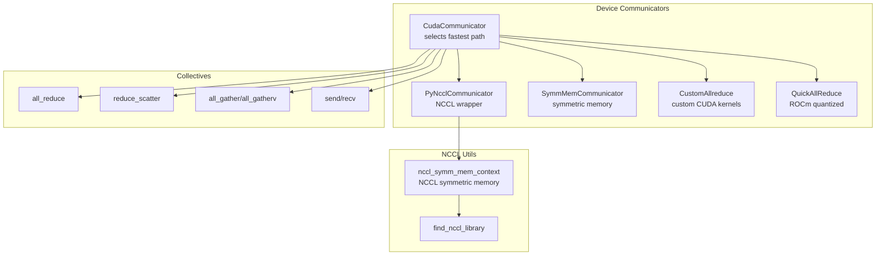
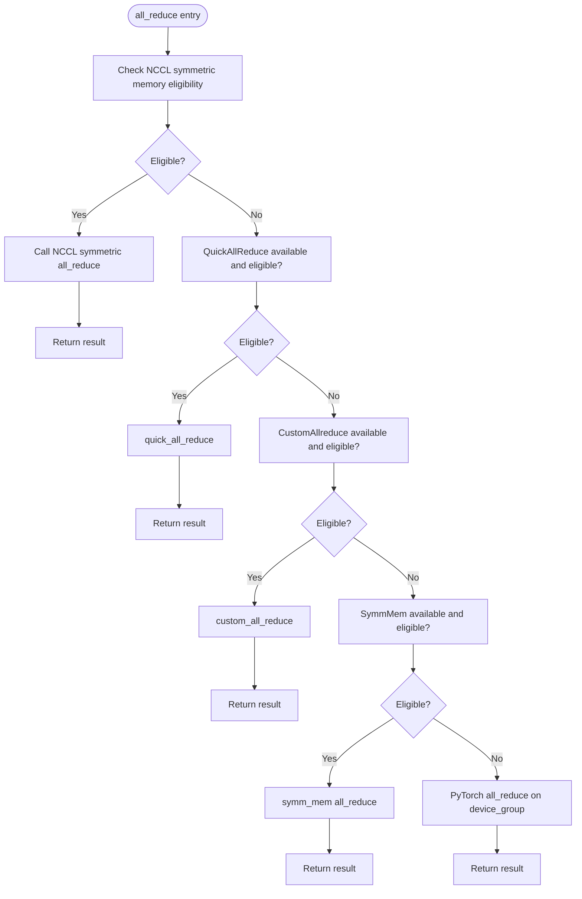
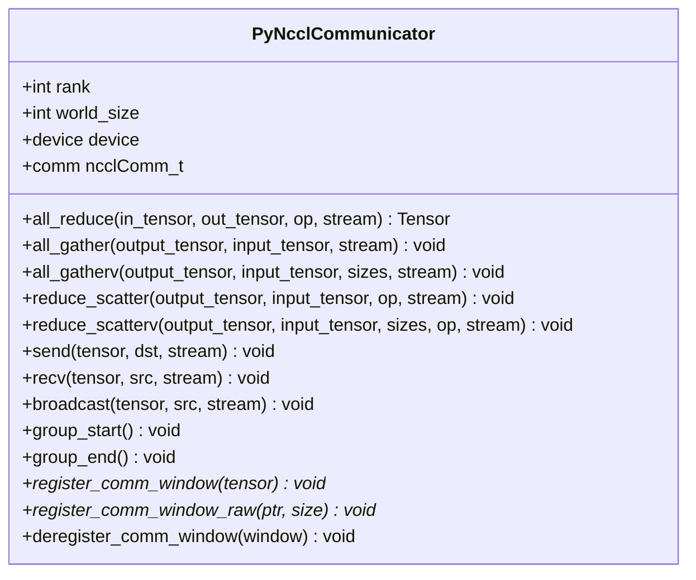
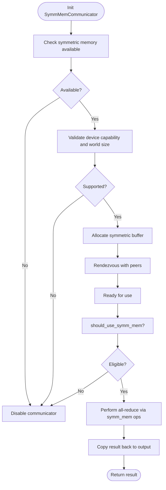
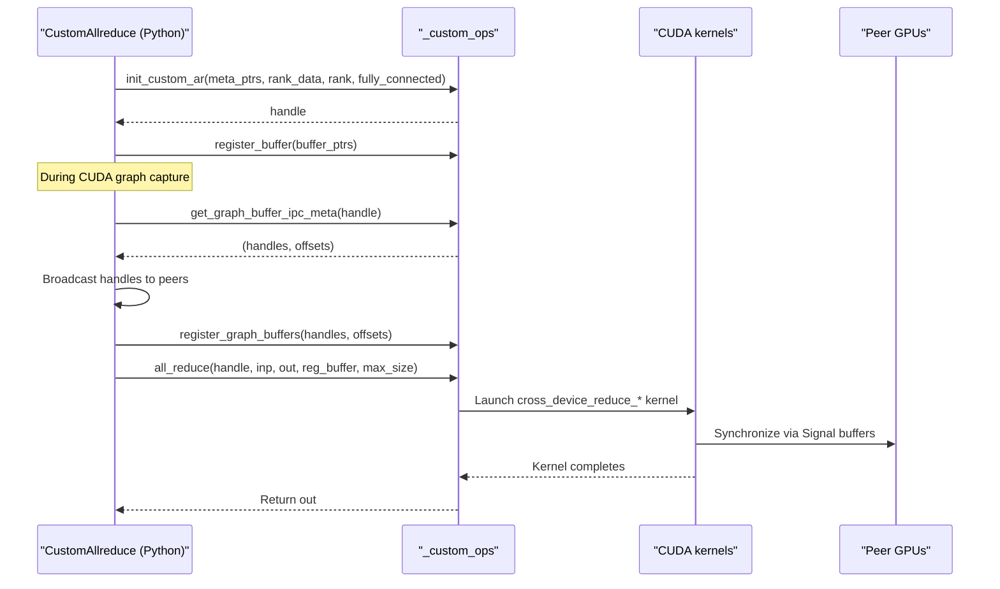
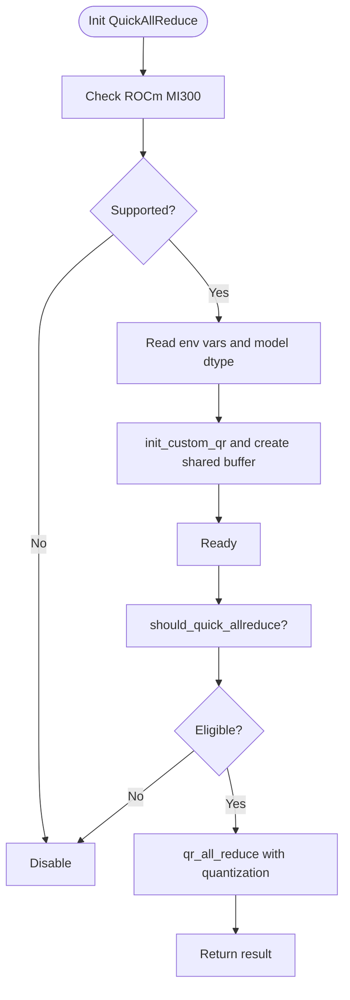
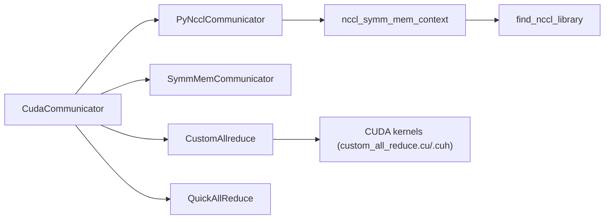

# CUDA Communicator

<cite>
**Referenced Files in This Document**
- [cuda_communicator.py](file://vllm/distributed/device_communicators/cuda_communicator.py)
- [base_device_communicator.py](file://vllm/distributed/device_communicators/base_device_communicator.py)
- [custom_all_reduce.py](file://vllm/distributed/device_communicators/custom_all_reduce.py)
- [custom_all_reduce.cu](file://csrc/custom_all_reduce.cu)
- [custom_all_reduce.cuh](file://csrc/custom_all_reduce.cuh)
- [pynccl.py](file://vllm/distributed/device_communicators/pynccl.py)
- [pynccl_allocator.py](file://vllm/distributed/device_communicators/pynccl_allocator.py)
- [symm_mem.py](file://vllm/distributed/device_communicators/symm_mem.py)
- [quick_all_reduce.py](file://vllm/distributed/device_communicators/quick_all_reduce.py)
- [nccl.py](file://vllm/utils/nccl.py)
- [test_custom_all_reduce.py](file://tests/distributed/test_custom_all_reduce.py)
- [test_pynccl.py](file://tests/distributed/test_pynccl.py)
- [test_nccl_symm_mem_allreduce.py](file://tests/distributed/test_nccl_symm_mem_allreduce.py)
</cite>

## Table of Contents
1. [Introduction](#introduction)
2. [Project Structure](#project-structure)
3. [Core Components](#core-components)
4. [Architecture Overview](#architecture-overview)
5. [Detailed Component Analysis](#detailed-component-analysis)
6. [Dependency Analysis](#dependency-analysis)
7. [Performance Considerations](#performance-considerations)
8. [Troubleshooting Guide](#troubleshooting-guide)
9. [Conclusion](#conclusion)
10. [Appendices](#appendices)

## Introduction
This document explains the CUDA device communicator implementation in vLLM, focusing on CUDA-specific communication optimizations, NCCL backend integration, and GPU memory management strategies. It covers collective operations on CUDA devices, memory transfer patterns, and performance tuning. It also details the integration with PyTorch’s CUDA distributed backend, custom all-reduce implementations, and GPU-to-GPU communication patterns. Practical usage guidance, tuning tips, and troubleshooting advice are included.

## Project Structure
The CUDA device communicator is implemented as a device-specific communicator layered on top of PyTorch process groups. It selects among several optimized paths depending on environment, topology, and tensor characteristics:
- PyNcclCommunicator: thin wrapper around NCCL for GPU-to-GPU collectives.
- SymmMemCommunicator: symmetric memory-backed all-reduce via PyTorch’s symmetric memory ops.
- CustomAllreduce: custom CUDA kernels with IPC buffers and optional CUDA graph support.
- QuickAllReduce: quantized all-reduce path for ROCm MI300 series.
- All-to-all managers: specialized dispatch/combine managers for expert parallel scenarios.

**Diagram sources**
- [cuda_communicator.py](file://vllm/distributed/device_communicators/cuda_communicator.py#L1-L347)
- [pynccl.py](file://vllm/distributed/device_communicators/pynccl.py#L1-L387)
- [pynccl_allocator.py](file://vllm/distributed/device_communicators/pynccl_allocator.py#L1-L192)
- [symm_mem.py](file://vllm/distributed/device_communicators/symm_mem.py#L1-L157)
- [custom_all_reduce.py](file://vllm/distributed/device_communicators/custom_all_reduce.py#L1-L327)
- [quick_all_reduce.py](file://vllm/distributed/device_communicators/quick_all_reduce.py#L1-L291)
- [nccl.py](file://vllm/utils/nccl.py#L1-L65)

**Section sources**
- [cuda_communicator.py](file://vllm/distributed/device_communicators/cuda_communicator.py#L1-L120)
- [base_device_communicator.py](file://vllm/distributed/device_communicators/base_device_communicator.py#L92-L303)

## Core Components
- CudaCommunicator: orchestrates selection of the fastest all-reduce path and exposes collective APIs for reduce-scatter, all-gather, send/recv, and all-to-all dispatch/combine for expert parallel.
- PyNcclCommunicator: initializes and wraps NCCL for GPU collectives, broadcasting unique IDs across ranks and performing all_reduce/all_gather/reduce_scatter/send/recv.
- SymmMemCommunicator: uses PyTorch symmetric memory to accelerate all-reduce for supported devices/world sizes and dtypes.
- CustomAllreduce: custom CUDA kernels with IPC buffer sharing, optional CUDA graph registration, and environment-driven algorithm selection.
- QuickAllReduce: quantized all-reduce path for ROCm MI300 with configurable quantization regimes and dtype casting.
- NCCL utilities: library discovery and include path resolution for NCCL/RCCL.

Key responsibilities:
- Path selection: CudaCommunicator evaluates NCCL symmetric memory, custom all-reduce, symmetric memory, and falls back to PyTorch distributed all-reduce.
- Memory management: IPC buffers for custom all-reduce, symmetric memory windows for PyTorch symmetric memory, and NCCL pluggable allocator for NCCL symmetric memory.
- Topology-awareness: validates NVLink/NVSwitch connectivity, peer-to-peer capabilities, and world-size constraints.

**Section sources**
- [cuda_communicator.py](file://vllm/distributed/device_communicators/cuda_communicator.py#L120-L347)
- [pynccl.py](file://vllm/distributed/device_communicators/pynccl.py#L58-L387)
- [symm_mem.py](file://vllm/distributed/device_communicators/symm_mem.py#L1-L157)
- [custom_all_reduce.py](file://vllm/distributed/device_communicators/custom_all_reduce.py#L1-L327)
- [quick_all_reduce.py](file://vllm/distributed/device_communicators/quick_all_reduce.py#L1-L291)
- [nccl.py](file://vllm/utils/nccl.py#L1-L65)

## Architecture Overview
The CUDA communicator integrates with PyTorch process groups and NCCL. It dynamically chooses the optimal path per tensor and per invocation, minimizing CPU overhead and leveraging GPU-native collectives.

```mermaid
sequenceDiagram
participant U as "User Code"
participant CC as "CudaCommunicator"
participant SM as "SymmMemCommunicator"
participant CA as "CustomAllreduce"
participant QR as "QuickAllReduce"
participant PN as "PyNcclCommunicator"
participant PG as "PyTorch ProcessGroup"
U->>CC : all_reduce(tensor)
alt NCCL symmetric memory candidate
CC->>PN : check symmetric memory eligibility
PN-->>CC : eligible?
end
alt QuickAllReduce eligible
CC->>QR : should_quick_allreduce?
QR-->>CC : yes/no
CC->>QR : quick_all_reduce
QR-->>U : result
else Custom all-reduce eligible
CC->>CA : should_custom_ar?
CA-->>CC : yes/no
CC->>CA : custom_all_reduce
CA-->>U : result
else Symmetric memory eligible
CC->>SM : should_use_symm_mem?
SM-->>CC : yes/no
CC->>SM : all_reduce
SM-->>U : result
else Fallback to PyTorch
CC->>PG : all_reduce on device_group
PG-->>U : result
end
```

**Diagram sources**
- [cuda_communicator.py](file://vllm/distributed/device_communicators/cuda_communicator.py#L120-L174)
- [pynccl.py](file://vllm/distributed/device_communicators/pynccl.py#L150-L181)
- [symm_mem.py](file://vllm/distributed/device_communicators/symm_mem.py#L117-L157)
- [custom_all_reduce.py](file://vllm/distributed/device_communicators/custom_all_reduce.py#L233-L284)
- [quick_all_reduce.py](file://vllm/distributed/device_communicators/quick_all_reduce.py#L247-L281)

## Detailed Component Analysis

### CudaCommunicator
Responsibilities:
- Initializes optional communicators: PyNccl, SymmMem, CustomAllreduce, QuickAllReduce, and All2All managers.
- Implements all_reduce with a prioritized fallback chain.
- Provides reduce_scatter, reduce_scatterv, all_gather/all_gatherv, send/recv, and all2all dispatch/combine.

Selection logic highlights:
- Prefer NCCL symmetric memory when eligible and available.
- Try QuickAllReduce first on ROCm MI300 with compatible tensors.
- Use CustomAllreduce with IPC buffers and optional CUDA graph registration.
- Use SymmMemCommunicator for supported configurations.
- Fallback to PyTorch distributed all_reduce on device_group.

**Diagram sources**
- [cuda_communicator.py](file://vllm/distributed/device_communicators/cuda_communicator.py#L120-L174)

**Section sources**
- [cuda_communicator.py](file://vllm/distributed/device_communicators/cuda_communicator.py#L1-L347)
- [base_device_communicator.py](file://vllm/distributed/device_communicators/base_device_communicator.py#L135-L204)

### PyNcclCommunicator and NCCL Integration
- Initializes NCCL communicator per device, broadcasts unique ID across ranks, and performs warmup.
- Exposes all_reduce, all_gather, all_gatherv, reduce_scatter, reduce_scatterv, send, recv, and group operations.
- Integrates with NCCL symmetric memory via a custom op registration and a memory pool context manager.

Key behaviors:
- Device affinity: asserts tensors reside on the same device as the communicator.
- Group operations: supports ncclGroupStart/End for batching.
- Symmetric memory: registers communicator windows over NCCL-managed memory pools for zero-copy access.

**Diagram sources**
- [pynccl.py](file://vllm/distributed/device_communicators/pynccl.py#L58-L387)

**Section sources**
- [pynccl.py](file://vllm/distributed/device_communicators/pynccl.py#L1-L387)
- [pynccl_allocator.py](file://vllm/distributed/device_communicators/pynccl_allocator.py#L1-L192)
- [nccl.py](file://vllm/utils/nccl.py#L1-L65)

### SymmMemCommunicator
- Validates symmetric memory availability and device capability/world size support.
- Allocates a symmetric memory buffer and rendezvous with peers.
- Chooses multimem or two-shot all-reduce based on device capability and world size.
- Copies input into the symmetric buffer, performs all-reduce, and copies result back.

**Diagram sources**
- [symm_mem.py](file://vllm/distributed/device_communicators/symm_mem.py#L1-L157)

**Section sources**
- [symm_mem.py](file://vllm/distributed/device_communicators/symm_mem.py#L1-L157)

### CustomAllreduce (Python + CUDA)
- Python side:
  - Validates environment, node locality, world size, and NVLink/XGMI connectivity.
  - Creates shared IPC buffers and registers them with the C++ backend.
  - Supports CUDA graph capture by registering graph buffer IPC metadata across ranks.
- CUDA side:
  - Provides allreduce kernels with two-stage (reduce-scatter + allgather) and one-stage variants.
  - Uses packed vectorized loads/stores and atomic barriers for synchronization across GPUs.
  - Supports float16, float32, and bfloat16 depending on architecture.

**Diagram sources**
- [custom_all_reduce.py](file://vllm/distributed/device_communicators/custom_all_reduce.py#L199-L327)
- [custom_all_reduce.cu](file://csrc/custom_all_reduce.cu#L1-L190)
- [custom_all_reduce.cuh](file://csrc/custom_all_reduce.cuh#L372-L632)

**Section sources**
- [custom_all_reduce.py](file://vllm/distributed/device_communicators/custom_all_reduce.py#L1-L327)
- [custom_all_reduce.cu](file://csrc/custom_all_reduce.cu#L1-L190)
- [custom_all_reduce.cuh](file://csrc/custom_all_reduce.cuh#L1-L632)

### QuickAllReduce (ROCm MI300)
- Validates ROCm architecture and environment variables for quantization regimes and dtype casting.
- Creates shared buffers and opens peer handles for static IPC.
- Applies quantization regimes (FP, INT8, INT6, INT4) to accelerate all-reduce on ROCm MI300.

**Diagram sources**
- [quick_all_reduce.py](file://vllm/distributed/device_communicators/quick_all_reduce.py#L1-L291)

**Section sources**
- [quick_all_reduce.py](file://vllm/distributed/device_communicators/quick_all_reduce.py#L1-L291)

### All-to-All Managers (Expert Parallel)
- CudaCommunicator delegates dispatch and combine operations to All2All managers when configured for expert parallel.
- Multiple backends are supported (naive, allgather_reducescatter, PPLX, DeepEP high-throughput/low-latency, FlashInfer all2allv).

Usage:
- dispatch(hidden_states, router_logits, is_sequence_parallel, extra_tensors)
- combine(hidden_states, is_sequence_parallel)

**Section sources**
- [cuda_communicator.py](file://vllm/distributed/device_communicators/cuda_communicator.py#L92-L119)
- [base_device_communicator.py](file://vllm/distributed/device_communicators/base_device_communicator.py#L28-L90)

## Dependency Analysis
- CudaCommunicator depends on:
  - PyNcclCommunicator for NCCL-backed collectives.
  - SymmMemCommunicator for symmetric memory all-reduce.
  - CustomAllreduce for custom CUDA kernels with IPC buffers.
  - QuickAllReduce for ROCm quantized all-reduce.
  - All2All managers for expert parallel dispatch/combine.
- PyNcclCommunicator depends on:
  - NCCL library discovery and include paths.
  - NCCL symmetric memory allocator and registration context.
- CustomAllreduce depends on:
  - CUDA kernels compiled with packed vectorization and synchronization primitives.
  - IPC buffer creation/opening and graph registration.

**Diagram sources**
- [cuda_communicator.py](file://vllm/distributed/device_communicators/cuda_communicator.py#L1-L120)
- [pynccl.py](file://vllm/distributed/device_communicators/pynccl.py#L1-L120)
- [pynccl_allocator.py](file://vllm/distributed/device_communicators/pynccl_allocator.py#L1-L120)
- [nccl.py](file://vllm/utils/nccl.py#L1-L65)
- [custom_all_reduce.cu](file://csrc/custom_all_reduce.cu#L1-L190)
- [custom_all_reduce.cuh](file://csrc/custom_all_reduce.cuh#L1-L200)

**Section sources**
- [cuda_communicator.py](file://vllm/distributed/device_communicators/cuda_communicator.py#L1-L120)
- [pynccl.py](file://vllm/distributed/device_communicators/pynccl.py#L1-L120)
- [pynccl_allocator.py](file://vllm/distributed/device_communicators/pynccl_allocator.py#L1-L120)
- [nccl.py](file://vllm/utils/nccl.py#L1-L65)
- [custom_all_reduce.cu](file://csrc/custom_all_reduce.cu#L1-L190)
- [custom_all_reduce.cuh](file://csrc/custom_all_reduce.cuh#L1-L200)

## Performance Considerations
- Path selection:
  - Prefer NCCL symmetric memory for supported devices and world sizes to avoid host-side copies.
  - Use CustomAllreduce for small-to-medium tensors on fully connected topologies; ensure tensors are weakly contiguous and size thresholds are met.
  - Use QuickAllReduce on ROCm MI300 with appropriate quantization regimes and dtype casting.
- Memory:
  - CustomAllreduce uses IPC buffers; minimize buffer allocations by reusing handles across invocations.
  - SymmMemCommunicator relies on symmetric memory rendezvous; ensure device capability and world size are supported.
  - NCCL symmetric memory uses a pluggable allocator; ensure NCCL headers are available and compatible.
- Topology:
  - Fully connected NVLink/XGMI reduces synchronization overhead; custom all-reduce favors fully connected or small world sizes.
  - Peer-to-peer capability is validated; otherwise custom all-reduce is disabled.
- CUDA graphs:
  - CustomAllreduce supports graph capture; register graph buffers to avoid runtime IPC handle exchange.
- Dtype and alignment:
  - CustomAllreduce and QuickAllReduce require 16-byte aligned sizes and specific dtypes; ensure tensors satisfy these constraints.

[No sources needed since this section provides general guidance]

## Troubleshooting Guide
Common issues and resolutions:
- NCCL symmetric memory disabled:
  - Ensure NCCL version and device capability support symmetric memory; verify VLLM_USE_NCCL_SYMM_MEM and environment.
  - Check that the NCCL include path is resolvable and the allocator compiles.
- Custom all-reduce disabled:
  - Verify single-node process group, supported world size, NVLink/XGMI connectivity, and P2P capability.
  - Confirm tensors are weakly contiguous and size meets thresholds.
- Quick all-reduce not used:
  - Confirm ROCm MI300 architecture and environment variables for quantization regime and dtype casting.
- PyTorch fallback unexpectedly used:
  - Check device affinity for PyNcclCommunicator and ensure device_group is set appropriately.
- All-to-all failures:
  - Validate all2all backend configuration and ensure All2All manager is initialized for expert parallel.

**Section sources**
- [pynccl_allocator.py](file://vllm/distributed/device_communicators/pynccl_allocator.py#L1-L120)
- [custom_all_reduce.py](file://vllm/distributed/device_communicators/custom_all_reduce.py#L1-L120)
- [quick_all_reduce.py](file://vllm/distributed/device_communicators/quick_all_reduce.py#L1-L120)
- [cuda_communicator.py](file://vllm/distributed/device_communicators/cuda_communicator.py#L120-L174)

## Conclusion
The CUDA device communicator in vLLM provides a flexible, high-performance communication layer tailored to modern GPU clusters. By intelligently selecting among NCCL, symmetric memory, custom CUDA kernels, and ROCm quantized paths, it minimizes latency and maximizes throughput. Proper configuration of environment variables, device capabilities, and tensor properties ensures optimal performance and reliability.

[No sources needed since this section summarizes without analyzing specific files]

## Appendices

### Example Usage Scenarios
- All-reduce with automatic path selection:
  - Call CudaCommunicator.all_reduce on tensors sized appropriately for custom or symmetric memory paths.
- Expert parallel dispatch/combine:
  - Use CudaCommunicator.dispatch and combine with configured all2all backend for MoE routing.
- ROCm quantized all-reduce:
  - Ensure ROCm MI300 and environment variables are set; tensors must satisfy size and dtype constraints.

**Section sources**
- [cuda_communicator.py](file://vllm/distributed/device_communicators/cuda_communicator.py#L120-L347)
- [quick_all_reduce.py](file://vllm/distributed/device_communicators/quick_all_reduce.py#L1-L291)

### Tests and Validation
- Custom all-reduce correctness and performance:
  - See [test_custom_all_reduce.py](file://tests/distributed/test_custom_all_reduce.py).
- PyNccl communicator functionality:
  - See [test_pynccl.py](file://tests/distributed/test_pynccl.py).
- NCCL symmetric memory all-reduce:
  - See [test_nccl_symm_mem_allreduce.py](file://tests/distributed/test_nccl_symm_mem_allreduce.py).

**Section sources**
- [test_custom_all_reduce.py](file://tests/distributed/test_custom_all_reduce.py)
- [test_pynccl.py](file://tests/distributed/test_pynccl.py)
- [test_nccl_symm_mem_allreduce.py](file://tests/distributed/test_nccl_symm_mem_allreduce.py)