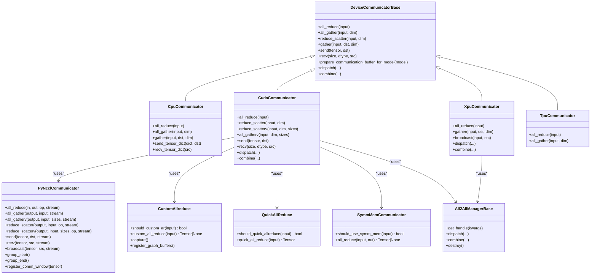
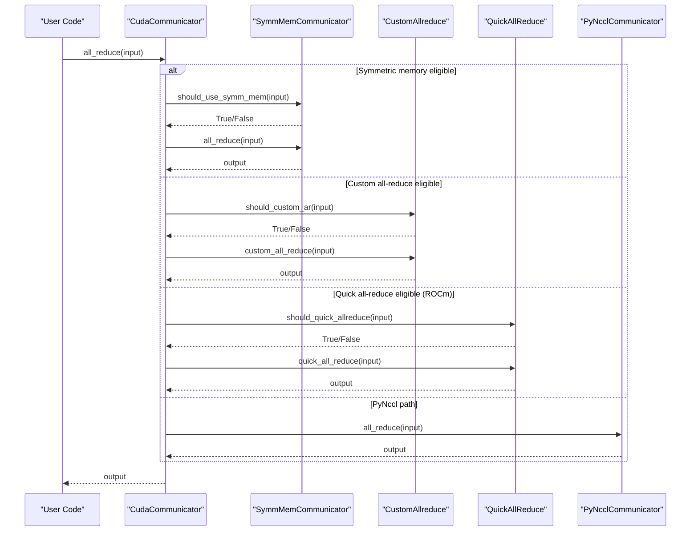
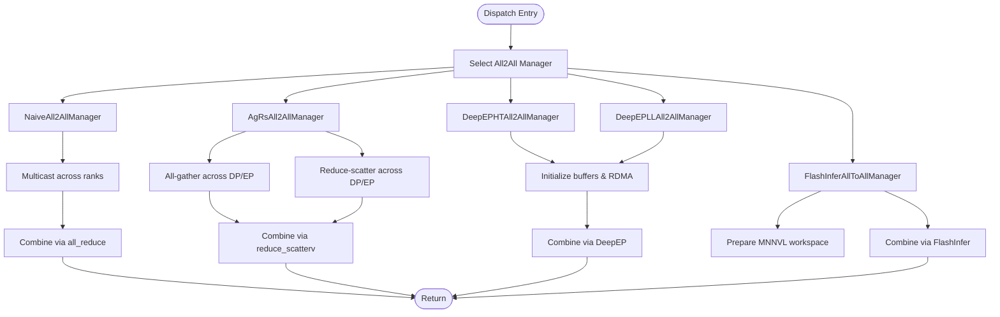
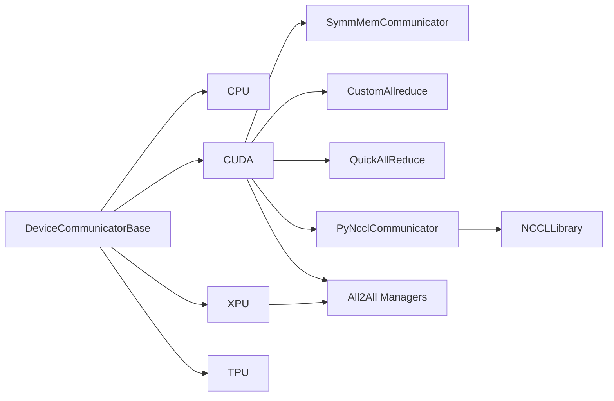

# Device Communicators

<cite>
**Referenced Files in This Document**
- [base_device_communicator.py](file://vllm/distributed/device_communicators/base_device_communicator.py)
- [cpu_communicator.py](file://vllm/distributed/device_communicators/cpu_communicator.py)
- [cuda_communicator.py](file://vllm/distributed/device_communicators/cuda_communicator.py)
- [xpu_communicator.py](file://vllm/distributed/device_communicators/xpu_communicator.py)
- [tpu_communicator.py](file://vllm/distributed/device_communicators/tpu_communicator.py)
- [custom_all_reduce.py](file://vllm/distributed/device_communicators/custom_all_reduce.py)
- [quick_all_reduce.py](file://vllm/distributed/device_communicators/quick_all_reduce.py)
- [symm_mem.py](file://vllm/distributed/device_communicators/symm_mem.py)
- [pynccl.py](file://vllm/distributed/device_communicators/pynccl.py)
- [pynccl_wrapper.py](file://vllm/distributed/device_communicators/pynccl_wrapper.py)
- [all2all.py](file://vllm/distributed/device_communicators/all2all.py)
- [shm_broadcast.py](file://vllm/distributed/device_communicators/shm_broadcast.py)
- [shm_object_storage.py](file://vllm/distributed/device_communicators/shm_object_storage.py)
- [parallel_state.py](file://vllm/distributed/parallel_state.py)
- [benchmark_device_communicators.py](file://benchmarks/kernels/benchmark_device_communicators.py)
</cite>

## Table of Contents
1. [Introduction](#introduction)
2. [Project Structure](#project-structure)
3. [Core Components](#core-components)
4. [Architecture Overview](#architecture-overview)
5. [Detailed Component Analysis](#detailed-component-analysis)
6. [Dependency Analysis](#dependency-analysis)
7. [Performance Considerations](#performance-considerations)
8. [Troubleshooting Guide](#troubleshooting-guide)
9. [Conclusion](#conclusion)
10. [Appendices](#appendices)

## Introduction
This document explains device communicators for distributed inference in vLLM, focusing on inter-device communication abstractions and platform-specific implementations for CPU, CUDA, ROCm, XPU, and TPU devices. It covers communication patterns (collective operations), memory synchronization, performance optimization techniques, integration with PyTorch’s distributed backend, custom all-reduce implementations, and hardware-specific optimizations. Practical usage examples, a guide to implementing a custom communicator, and debugging tips are included.

## Project Structure
The device communication subsystem resides under vLLM’s distributed package, organized by platform and functionality:
- Base abstraction and common operations
- Platform-specific communicators
- Hardware-optimized collectives and wrappers
- All-to-all dispatch/combine managers
- Shared-memory broadcast and object storage utilities
- Benchmarks for performance evaluation

```mermaid
graph TB
subgraph "Base Abstractions"
BDC["DeviceCommunicatorBase<br/>base_device_communicator.py"]
A2AM["All2AllManagerBase<br/>base_device_communicator.py"]
end
subgraph "CPU"
CPU["CpuCommunicator<br/>cpu_communicator.py"]
SHM["CPU SHM Bridge<br/>cpu_communicator.py"]
end
subgraph "CUDA"
CUDA["CudaCommunicator<br/>cuda_communicator.py"]
NCCL["PyNcclCommunicator<br/>pynccl.py"]
NCCLW["NCCL Wrapper<br/>pynccl_wrapper.py"]
CAR["CustomAllreduce<br/>custom_all_reduce.py"]
QR["QuickAllReduce (ROCm)<br/>quick_all_reduce.py"]
SM["SymmMemCommunicator<br/>symm_mem.py"]
A2A_CUDA["All2All Managers<br/>all2all.py"]
end
subgraph "XPU"
XPU["XpuCommunicator<br/>xpu_communicator.py"]
A2A_XPU["All2All Managers<br/>all2all.py"]
end
subgraph "TPU"
TPU["TpuCommunicator<br/>tpu_communicator.py"]
end
subgraph "Utilities"
SHMB["ShmBroadcast<br/>shm_broadcast.py"]
SHMOS["ShmObjectStorage<br/>shm_object_storage.py"]
end
BDC --> CPU
BDC --> CUDA
BDC --> XPU
BDC --> TPU
CUDA --> NCCL
NCCL --> NCCLW
CUDA --> CAR
CUDA --> QR
CUDA --> SM
CUDA --> A2A_CUDA
XPU --> A2A_XPU
CPU --> SHM
SHMB -.-> CPU
SHMOS -.-> CPU
```

**Diagram sources**
- [base_device_communicator.py](file://vllm/distributed/device_communicators/base_device_communicator.py#L92-L303)
- [cpu_communicator.py](file://vllm/distributed/device_communicators/cpu_communicator.py#L1-L210)
- [cuda_communicator.py](file://vllm/distributed/device_communicators/cuda_communicator.py#L1-L347)
- [xpu_communicator.py](file://vllm/distributed/device_communicators/xpu_communicator.py#L1-L96)
- [tpu_communicator.py](file://vllm/distributed/device_communicators/tpu_communicator.py#L1-L100)
- [pynccl.py](file://vllm/distributed/device_communicators/pynccl.py#L58-L387)
- [pynccl_wrapper.py](file://vllm/distributed/device_communicators/pynccl_wrapper.py#L1-L565)
- [custom_all_reduce.py](file://vllm/distributed/device_communicators/custom_all_reduce.py#L1-L327)
- [quick_all_reduce.py](file://vllm/distributed/device_communicators/quick_all_reduce.py#L1-L291)
- [symm_mem.py](file://vllm/distributed/device_communicators/symm_mem.py#L1-L157)
- [all2all.py](file://vllm/distributed/device_communicators/all2all.py#L1-L510)
- [shm_broadcast.py](file://vllm/distributed/device_communicators/shm_broadcast.py#L1-L779)
- [shm_object_storage.py](file://vllm/distributed/device_communicators/shm_object_storage.py#L1-L698)

**Section sources**
- [base_device_communicator.py](file://vllm/distributed/device_communicators/base_device_communicator.py#L92-L303)
- [cuda_communicator.py](file://vllm/distributed/device_communicators/cuda_communicator.py#L1-L347)
- [all2all.py](file://vllm/distributed/device_communicators/all2all.py#L1-L510)

## Core Components
- DeviceCommunicatorBase: Defines the unified interface for collective operations (all_reduce, all_gather, reduce_scatter, gather, send, recv) and expert parallel dispatch/combine hooks. It integrates with PyTorch process groups and exposes device-specific capabilities.
- Platform-specific communicators:
  - CpuCommunicator: Uses PyTorch gloo backend and optionally optimized CPU shared-memory transport.
  - CudaCommunicator: Orchestrates multiple fast paths (custom all-reduce, quick all-reduce, symmetric memory, PyNccl) and all-to-all managers.
  - XpuCommunicator: Falls back to PyTorch gloo for collectives and uses all-to-all “naive” manager on XPU.
  - TpuCommunicator: Integrates with PyTorch/XLA for all_reduce and all_gather on TPUs.
- Optimizations:
  - CustomAllreduce: High-performance custom all-reduce with IPC buffers and CUDA graph support.
  - QuickAllReduce (ROCm): Quantized fast all-reduce for MI300-series GPUs.
  - SymmMemCommunicator: Uses symmetric memory-backed all-reduce for supported architectures.
  - PyNcclCommunicator: Low-level NCCL bindings for CUDA collectives and stream control.
  - All2All managers: Multiple implementations (naive, all-gather+reduce-scatter, DeepEP, FlashInfer) for expert parallel dispatch/combine.

**Section sources**
- [base_device_communicator.py](file://vllm/distributed/device_communicators/base_device_communicator.py#L92-L303)
- [cpu_communicator.py](file://vllm/distributed/device_communicators/cpu_communicator.py#L1-L210)
- [cuda_communicator.py](file://vllm/distributed/device_communicators/cuda_communicator.py#L1-L347)
- [xpu_communicator.py](file://vllm/distributed/device_communicators/xpu_communicator.py#L1-L96)
- [tpu_communicator.py](file://vllm/distributed/device_communicators/tpu_communicator.py#L1-L100)
- [custom_all_reduce.py](file://vllm/distributed/device_communicators/custom_all_reduce.py#L1-L327)
- [quick_all_reduce.py](file://vllm/distributed/device_communicators/quick_all_reduce.py#L1-L291)
- [symm_mem.py](file://vllm/distributed/device_communicators/symm_mem.py#L1-L157)
- [pynccl.py](file://vllm/distributed/device_communicators/pynccl.py#L58-L387)
- [all2all.py](file://vllm/distributed/device_communicators/all2all.py#L1-L510)

## Architecture Overview
The device communicator architecture layers platform-agnostic operations atop platform-specific transports and hardware-optimized kernels. The base class centralizes collective semantics and device-group coordination, while platform-specific subclasses select the fastest available path.



**Diagram sources**
- [base_device_communicator.py](file://vllm/distributed/device_communicators/base_device_communicator.py#L92-L303)
- [cpu_communicator.py](file://vllm/distributed/device_communicators/cpu_communicator.py#L1-L210)
- [cuda_communicator.py](file://vllm/distributed/device_communicators/cuda_communicator.py#L1-L347)
- [xpu_communicator.py](file://vllm/distributed/device_communicators/xpu_communicator.py#L1-L96)
- [tpu_communicator.py](file://vllm/distributed/device_communicators/tpu_communicator.py#L1-L100)
- [pynccl.py](file://vllm/distributed/device_communicators/pynccl.py#L58-L387)
- [custom_all_reduce.py](file://vllm/distributed/device_communicators/custom_all_reduce.py#L1-L327)
- [quick_all_reduce.py](file://vllm/distributed/device_communicators/quick_all_reduce.py#L1-L291)
- [symm_mem.py](file://vllm/distributed/device_communicators/symm_mem.py#L1-L157)
- [all2all.py](file://vllm/distributed/device_communicators/all2all.py#L1-L510)

## Detailed Component Analysis

### Base Device Communicator
- Purpose: Unified interface for collective operations and expert parallel dispatch/combine.
- Key responsibilities:
  - all_reduce, all_gather, reduce_scatter, gather, send, recv
  - Device-awareness and group rank resolution
  - Optional expert parallel dispatch/combine integration
- Notable behaviors:
  - all_gather uses concatenation-style reshape to avoid torch.compile compatibility issues.
  - reduce_scatter requires input contiguity and reshapes after operation.

**Section sources**
- [base_device_communicator.py](file://vllm/distributed/device_communicators/base_device_communicator.py#L92-L303)

### CPU Communicator
- Integrates with PyTorch gloo backend.
- Optional CPU shared-memory bridge for intra-node optimization on supported architectures and contexts.
- Provides tensor dictionary send/recv helpers for CPU-side coordination.

**Section sources**
- [cpu_communicator.py](file://vllm/distributed/device_communicators/cpu_communicator.py#L1-L210)

### CUDA Communicator
- Orchestrates multiple fast paths:
  - Symmetric memory all-reduce (when available and eligible)
  - Custom all-reduce (IPC buffers, CUDA graph support)
  - Quick all-reduce (ROCm MI300-series)
  - PyNcclCommunicator (low-level NCCL bindings)
- All-to-all dispatch/combine via configurable managers (naive, all-gather+reduce-scatter, DeepEP variants, FlashInfer).
- Robust fallback to PyTorch collectives when specialized paths are disabled or unavailable.



**Diagram sources**
- [cuda_communicator.py](file://vllm/distributed/device_communicators/cuda_communicator.py#L126-L175)
- [symm_mem.py](file://vllm/distributed/device_communicators/symm_mem.py#L117-L157)
- [custom_all_reduce.py](file://vllm/distributed/device_communicators/custom_all_reduce.py#L233-L284)
- [quick_all_reduce.py](file://vllm/distributed/device_communicators/quick_all_reduce.py#L247-L281)
- [pynccl.py](file://vllm/distributed/device_communicators/pynccl.py#L150-L182)

**Section sources**
- [cuda_communicator.py](file://vllm/distributed/device_communicators/cuda_communicator.py#L1-L347)
- [symm_mem.py](file://vllm/distributed/device_communicators/symm_mem.py#L1-L157)
- [custom_all_reduce.py](file://vllm/distributed/device_communicators/custom_all_reduce.py#L1-L327)
- [quick_all_reduce.py](file://vllm/distributed/device_communicators/quick_all_reduce.py#L1-L291)
- [pynccl.py](file://vllm/distributed/device_communicators/pynccl.py#L58-L387)

### XPU Communicator
- Uses PyTorch gloo for collectives.
- All-to-all dispatch/combine restricted to “naive” manager on XPU.
- Broadcast and gather adapted to environment constraints.

**Section sources**
- [xpu_communicator.py](file://vllm/distributed/device_communicators/xpu_communicator.py#L1-L96)

### TPU Communicator
- Integrates with PyTorch/XLA for all_reduce and all_gather.
- Handles multihost and single-host environments, ensuring environment variables are set for visibility.

**Section sources**
- [tpu_communicator.py](file://vllm/distributed/device_communicators/tpu_communicator.py#L1-L100)

### All-to-All Managers
- NaiveAll2AllManager: Broadcast-based multicast for testing and debugging.
- AgRsAll2AllManager: Dispatch via all-gather, combine via reduce-scatter.
- DeepEP variants: High-throughput and low-latency implementations with RDMA and buffer sizing.
- FlashInferAllToAllManager: FlashInfer-based all-to-all with workspace preparation and MNNVL integration.



**Diagram sources**
- [all2all.py](file://vllm/distributed/device_communicators/all2all.py#L27-L106)
- [all2all.py](file://vllm/distributed/device_communicators/all2all.py#L108-L168)
- [all2all.py](file://vllm/distributed/device_communicators/all2all.py#L247-L407)
- [all2all.py](file://vllm/distributed/device_communicators/all2all.py#L408-L510)

**Section sources**
- [all2all.py](file://vllm/distributed/device_communicators/all2all.py#L1-L510)

### PyNccl and NCCL Wrapper
- PyNcclCommunicator wraps NCCL operations with explicit device binding, stream control, and group batching.
- NCCLLibrary provides ctypes bindings to NCCL symbols, enabling flexible NCCL version handling and safe error propagation.

**Section sources**
- [pynccl.py](file://vllm/distributed/device_communicators/pynccl.py#L58-L387)
- [pynccl_wrapper.py](file://vllm/distributed/device_communicators/pynccl_wrapper.py#L1-L565)

### Shared-Memory Utilities
- ShmBroadcast: Lock-free ring-buffer broadcast with local shared memory and remote ZeroMQ fallback.
- ShmObjectStorage: Single-writer, multiple-reader object storage over shared memory with reference counting and FIFO eviction.

**Section sources**
- [shm_broadcast.py](file://vllm/distributed/device_communicators/shm_broadcast.py#L1-L779)
- [shm_object_storage.py](file://vllm/distributed/device_communicators/shm_object_storage.py#L1-L698)

## Dependency Analysis
- DeviceCommunicatorBase depends on PyTorch distributed primitives and resolves ranks/groups.
- CudaCommunicator composes SymmMemCommunicator, CustomAllreduce, QuickAllReduce, and PyNcclCommunicator, selecting the optimal path based on environment and tensor properties.
- All2All managers depend on process group metadata and optional external libraries (DeepEP, FlashInfer).
- PyNcclCommunicator depends on NCCLLibrary and current CUDA stream.



**Diagram sources**
- [base_device_communicator.py](file://vllm/distributed/device_communicators/base_device_communicator.py#L92-L303)
- [cuda_communicator.py](file://vllm/distributed/device_communicators/cuda_communicator.py#L1-L347)
- [pynccl.py](file://vllm/distributed/device_communicators/pynccl.py#L58-L387)
- [pynccl_wrapper.py](file://vllm/distributed/device_communicators/pynccl_wrapper.py#L1-L565)
- [all2all.py](file://vllm/distributed/device_communicators/all2all.py#L1-L510)

**Section sources**
- [base_device_communicator.py](file://vllm/distributed/device_communicators/base_device_communicator.py#L92-L303)
- [cuda_communicator.py](file://vllm/distributed/device_communicators/cuda_communicator.py#L1-L347)
- [pynccl.py](file://vllm/distributed/device_communicators/pynccl.py#L58-L387)
- [all2all.py](file://vllm/distributed/device_communicators/all2all.py#L1-L510)

## Performance Considerations
- Path selection:
  - Prefer symmetric memory all-reduce for supported architectures and dtypes.
  - Use custom all-reduce for intra-node, NVLink-connected GPUs with suitable sizes.
  - Use quick all-reduce on ROCm MI300-series with quantization regimes.
  - Fallback to PyNccl or PyTorch collectives when specialized paths are disabled.
- Contiguity and alignment:
  - Many operations require contiguous inputs; ensure tensors are contiguous before reduce_scatter.
  - Custom/quick all-reduce paths require sizes aligned to 16-byte boundaries.
- All-to-all tuning:
  - Choose DeepEP high-throughput for large-scale, low-latency modes for DeepEP low-latency.
  - FlashInfer all-to-all requires workspace initialization and MNNVL configuration.
- Stream and grouping:
  - PyNcclCommunicator supports group_start/group_end for batching multiple NCCL calls.
- Benchmarking:
  - Use the provided benchmark suite to compare implementations across tensor sizes and world sizes.

**Section sources**
- [cuda_communicator.py](file://vllm/distributed/device_communicators/cuda_communicator.py#L126-L175)
- [custom_all_reduce.py](file://vllm/distributed/device_communicators/custom_all_reduce.py#L233-L284)
- [quick_all_reduce.py](file://vllm/distributed/device_communicators/quick_all_reduce.py#L247-L281)
- [symm_mem.py](file://vllm/distributed/device_communicators/symm_mem.py#L117-L157)
- [pynccl.py](file://vllm/distributed/device_communicators/pynccl.py#L368-L387)
- [all2all.py](file://vllm/distributed/device_communicators/all2all.py#L285-L407)
- [benchmark_device_communicators.py](file://benchmarks/kernels/benchmark_device_communicators.py#L85-L119)
- [benchmark_device_communicators.py](file://benchmarks/kernels/benchmark_device_communicators.py#L344-L425)

## Troubleshooting Guide
- NCCL errors:
  - NCCLLibrary raises runtime errors with decoded messages; ensure NCCL library path and version compatibility.
  - Some NCCL symbols are optional; absence on certain platforms is handled gracefully.
- CUDA graph capture:
  - CustomAllreduce uses CUDA graph capture; ensure inputs are contiguous and sizes satisfy alignment constraints.
  - Graph registration registers buffer IPC handles across ranks; mismatches cause failures.
- ROCm-specific:
  - QuickAllReduce requires MI300 architecture and specific quantization regimes; verify environment variables and dtype support.
- All-to-all:
  - DeepEP and FlashInfer managers require optional dependencies; ensure they are installed and configured.
  - Internode vs intranode paths differ; verify network and RDMA settings.
- CPU shared memory:
  - ShmBroadcast uses shared memory ring buffers; long waits indicate stalled readers or heavy workloads.

**Section sources**
- [pynccl_wrapper.py](file://vllm/distributed/device_communicators/pynccl_wrapper.py#L330-L359)
- [custom_all_reduce.py](file://vllm/distributed/device_communicators/custom_all_reduce.py#L214-L232)
- [quick_all_reduce.py](file://vllm/distributed/device_communicators/quick_all_reduce.py#L164-L209)
- [all2all.py](file://vllm/distributed/device_communicators/all2all.py#L170-L245)
- [shm_broadcast.py](file://vllm/distributed/device_communicators/shm_broadcast.py#L438-L506)

## Conclusion
vLLM’s device communicators provide a robust, layered abstraction for distributed inference across diverse hardware. The base interface unifies collective semantics, while platform-specific implementations select optimal paths—symmetric memory, custom all-reduce, quick all-reduce, and NCCL—ensuring high performance and reliability. All-to-all dispatch/combine is modular and extensible, supporting advanced backends like DeepEP and FlashInfer. The included utilities and benchmarks facilitate integration, tuning, and debugging.

## Appendices

### Practical Usage Examples
- Using CudaCommunicator for all-reduce:
  - Instantiate with cpu_group and device_group.
  - Call all_reduce on tensors; the communicator selects the fastest available path.
  - For expert parallel, use dispatch/combine to route tokens across ranks.
- CPU shared-memory coordination:
  - Use CpuCommunicator’s send_tensor_dict/recv_tensor_dict for CPU-side object exchange.
- XPU and TPU:
  - XpuCommunicator relies on PyTorch gloo; TpuCommunicator uses PyTorch/XLA.

**Section sources**
- [cuda_communicator.py](file://vllm/distributed/device_communicators/cuda_communicator.py#L126-L175)
- [cpu_communicator.py](file://vllm/distributed/device_communicators/cpu_communicator.py#L100-L210)
- [xpu_communicator.py](file://vllm/distributed/device_communicators/xpu_communicator.py#L39-L96)
- [tpu_communicator.py](file://vllm/distributed/device_communicators/tpu_communicator.py#L92-L100)

### Custom Communicator Implementation Guide
Steps to implement a new device communicator:
1. Subclass DeviceCommunicatorBase and implement required collective methods.
2. Integrate with the platform’s native backend (e.g., NCCL, ROCm MI300, XLA).
3. Optionally add fast-path optimizations (e.g., IPC buffers, quantization).
4. Support all-to-all dispatch/combine if needed.
5. Register environment flags and fallbacks to PyTorch collectives.
6. Add unit tests and benchmark coverage.

Reference implementations:
- Base interface: [DeviceCommunicatorBase](file://vllm/distributed/device_communicators/base_device_communicator.py#L92-L303)
- CUDA fast paths: [CudaCommunicator](file://vllm/distributed/device_communicators/cuda_communicator.py#L1-L347), [PyNcclCommunicator](file://vllm/distributed/device_communicators/pynccl.py#L58-L387), [CustomAllreduce](file://vllm/distributed/device_communicators/custom_all_reduce.py#L1-L327), [QuickAllReduce](file://vllm/distributed/device_communicators/quick_all_reduce.py#L1-L291), [SymmMemCommunicator](file://vllm/distributed/device_communicators/symm_mem.py#L1-L157)
- All-to-all managers: [All2AllManagerBase](file://vllm/distributed/device_communicators/all2all.py#L27-L106), [AgRsAll2AllManager](file://vllm/distributed/device_communicators/all2all.py#L108-L168), [DeepEP variants](file://vllm/distributed/device_communicators/all2all.py#L285-L407), [FlashInferAllToAllManager](file://vllm/distributed/device_communicators/all2all.py#L408-L510)

**Section sources**
- [base_device_communicator.py](file://vllm/distributed/device_communicators/base_device_communicator.py#L92-L303)
- [cuda_communicator.py](file://vllm/distributed/device_communicators/cuda_communicator.py#L1-L347)
- [pynccl.py](file://vllm/distributed/device_communicators/pynccl.py#L58-L387)
- [custom_all_reduce.py](file://vllm/distributed/device_communicators/custom_all_reduce.py#L1-L327)
- [quick_all_reduce.py](file://vllm/distributed/device_communicators/quick_all_reduce.py#L1-L291)
- [symm_mem.py](file://vllm/distributed/device_communicators/symm_mem.py#L1-L157)
- [all2all.py](file://vllm/distributed/device_communicators/all2all.py#L1-L510)

### Integration with PyTorch Distributed Backend
- DeviceCommunicatorBase uses torch.distributed primitives for collectives and group management.
- Process group ranks are resolved against both device and CPU groups.
- Parallel state integration:
  - Sending/receiving tensors via the active device communicator.
  - Destroying communicators and process groups cleanly.

**Section sources**
- [base_device_communicator.py](file://vllm/distributed/device_communicators/base_device_communicator.py#L135-L263)
- [parallel_state.py](file://vllm/distributed/parallel_state.py#L973-L1003)