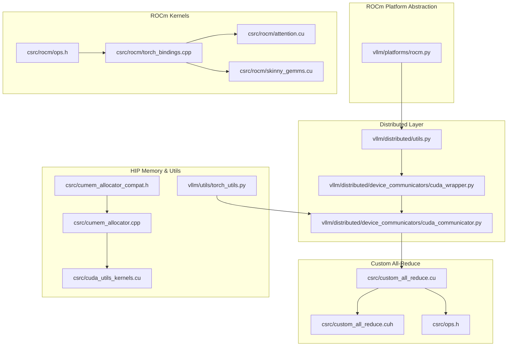
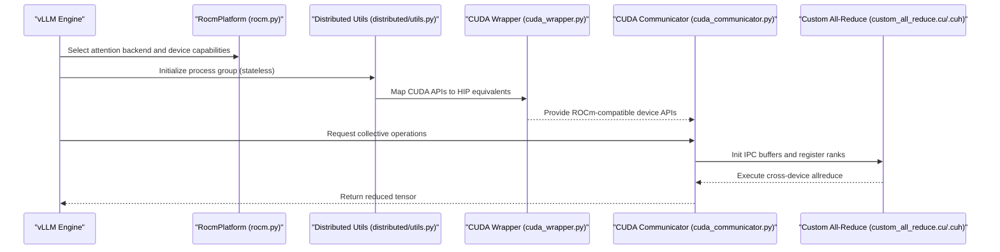
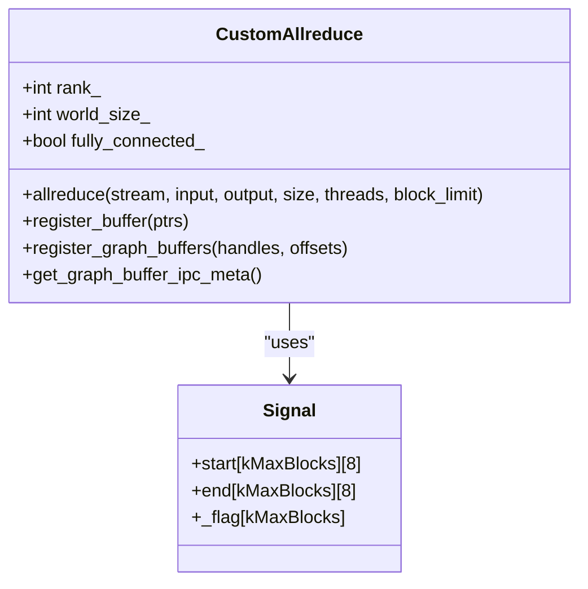
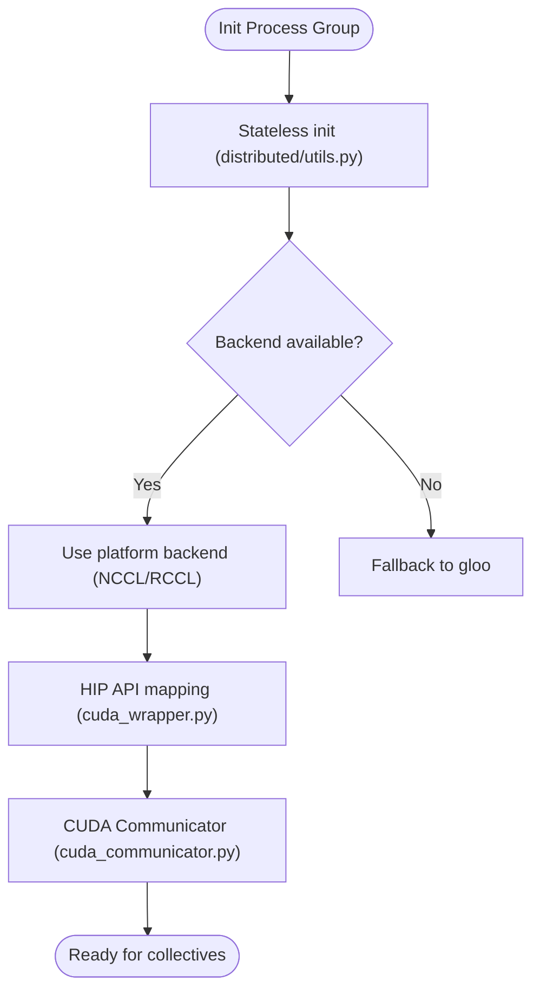
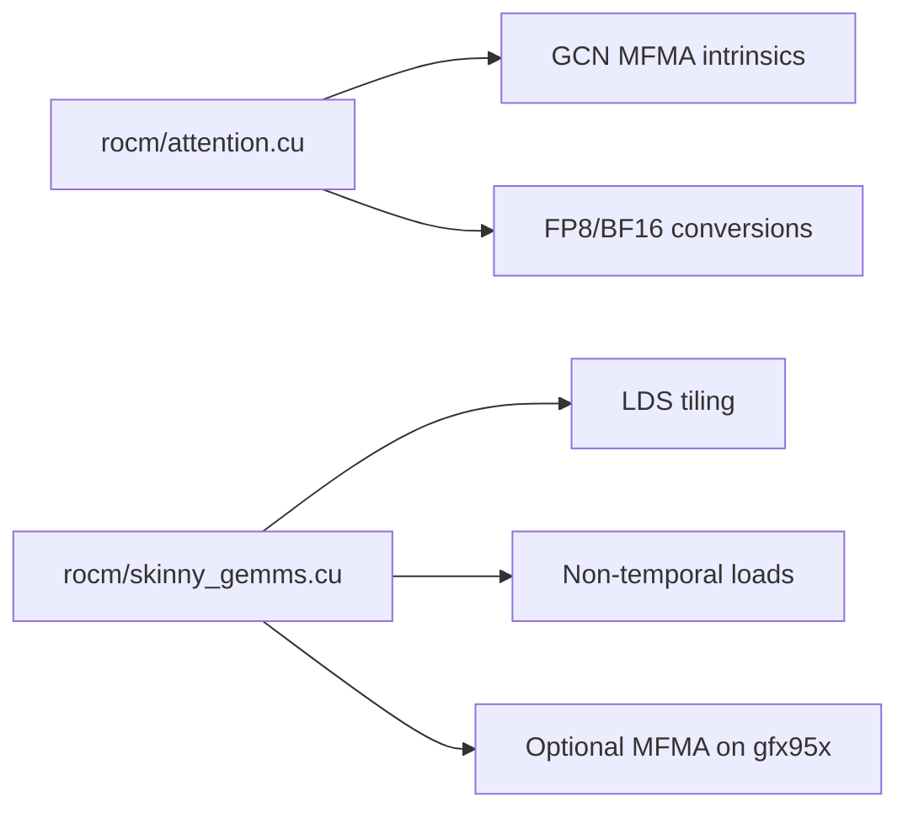
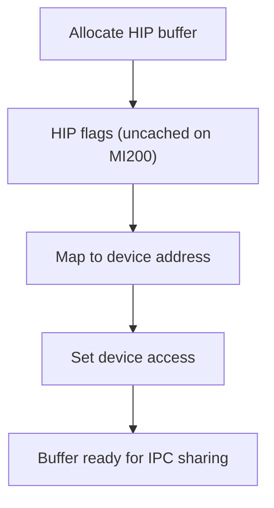
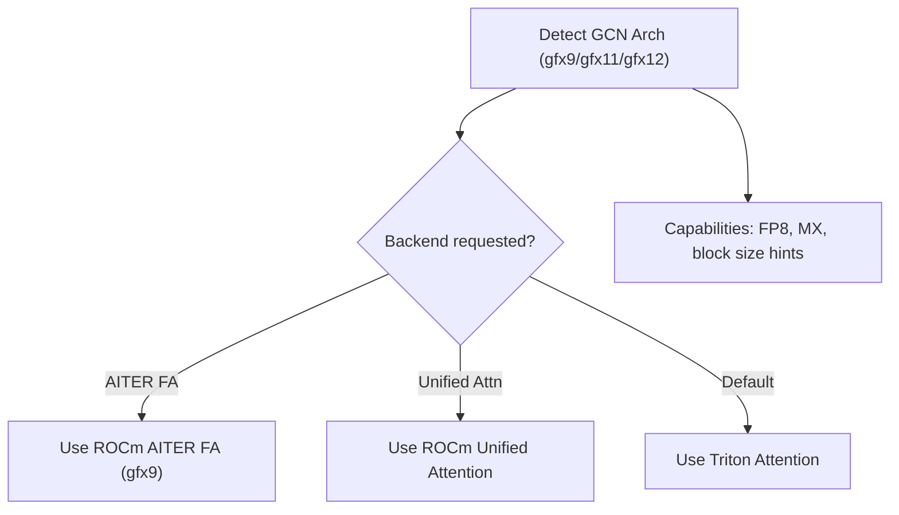
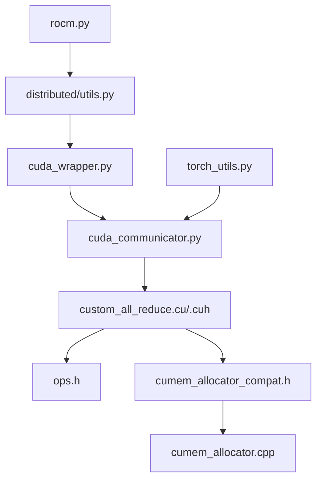

# ROCm Communicator

<cite>
**Referenced Files in This Document**
- [custom_all_reduce.cu](file://csrc/custom_all_reduce.cu)
- [custom_all_reduce.cuh](file://csrc/custom_all_reduce.cuh)
- [ops.h](file://csrc/ops.h)
- [cuda_wrapper.py](file://vllm/distributed/device_communicators/cuda_wrapper.py)
- [cuda_communicator.py](file://vllm/distributed/device_communicators/cuda_communicator.py)
- [rocm.py](file://vllm/platforms/rocm.py)
- [rocm/ops.h](file://csrc/rocm/ops.h)
- [rocm/torch_bindings.cpp](file://csrc/rocm/torch_bindings.cpp)
- [rocm/attention.cu](file://csrc/rocm/attention.cu)
- [rocm/skinny_gemms.cu](file://csrc/rocm/skinny_gemms.cu)
- [cumem_allocator_compat.h](file://csrc/cumem_allocator_compat.h)
- [cumem_allocator.cpp](file://csrc/cumem_allocator.cpp)
- [cuda_utils_kernels.cu](file://csrc/cuda_utils_kernels.cu)
- [torch_utils.py](file://vllm/utils/torch_utils.py)
- [setup.py](file://setup.py)
- [distributed/utils.py](file://vllm/distributed/utils.py)
- [test_rocm_attention_backends_selection.py](file://tests/v1/attention/test_rocm_attention_backends_selection.py)
</cite>

## Table of Contents
1. [Introduction](#introduction)
2. [Project Structure](#project-structure)
3. [Core Components](#core-components)
4. [Architecture Overview](#architecture-overview)
5. [Detailed Component Analysis](#detailed-component-analysis)
6. [Dependency Analysis](#dependency-analysis)
7. [Performance Considerations](#performance-considerations)
8. [Troubleshooting Guide](#troubleshooting-guide)
9. [Conclusion](#conclusion)
10. [Appendices](#appendices)

## Introduction
This document explains the ROCm device communicator implementation in vLLM, focusing on AMD GPU communication optimizations, HCCL/RCCL backend integration, HIP memory management strategies, and custom all-reduce implementations. It covers collective operations on ROCm devices, GPU memory transfer patterns, and performance tuning for AMD hardware. It also documents integration with PyTorch’s ROCm distributed backend, usage examples, and troubleshooting ROCm-specific communication issues.

## Project Structure
The ROCm-related implementation spans several areas:
- Custom all-reduce kernels and host wrappers for cross-device reductions
- ROCm attention and skinny GEMM kernels with AMD GCN/MFMA specializations
- ROCm platform abstraction and attention backend selection
- Distributed utilities and HIP/ROCm compatibility shims
- ROCm device communicator bindings and ROCm-aware stream management

**Diagram sources**
- [rocm.py](file://vllm/platforms/rocm.py#L161-L562)
- [distributed/utils.py](file://vllm/distributed/utils.py#L458-L545)
- [cuda_wrapper.py](file://vllm/distributed/device_communicators/cuda_wrapper.py#L94-L129)
- [cuda_communicator.py](file://vllm/distributed/device_communicators/cuda_communicator.py#L104-L124)
- [custom_all_reduce.cuh](file://csrc/custom_all_reduce.cuh#L1-L120)
- [custom_all_reduce.cu](file://csrc/custom_all_reduce.cu#L156-L190)
- [ops.h](file://csrc/ops.h#L387-L398)
- [cumem_allocator_compat.h](file://csrc/cumem_allocator_compat.h#L1-L75)
- [cumem_allocator.cpp](file://csrc/cumem_allocator.cpp#L120-L174)
- [cuda_utils_kernels.cu](file://csrc/cuda_utils_kernels.cu#L1-L35)
- [torch_utils.py](file://vllm/utils/torch_utils.py#L464-L493)
- [rocm/ops.h](file://csrc/rocm/ops.h#L1-L27)
- [rocm/torch_bindings.cpp](file://csrc/rocm/torch_bindings.cpp#L1-L58)
- [rocm/attention.cu](file://csrc/rocm/attention.cu#L1-L120)
- [rocm/skinny_gemms.cu](file://csrc/rocm/skinny_gemms.cu#L1-L120)

**Section sources**
- [rocm.py](file://vllm/platforms/rocm.py#L161-L562)
- [distributed/utils.py](file://vllm/distributed/utils.py#L458-L545)
- [cuda_wrapper.py](file://vllm/distributed/device_communicators/cuda_wrapper.py#L94-L129)
- [cuda_communicator.py](file://vllm/distributed/device_communicators/cuda_communicator.py#L104-L124)
- [custom_all_reduce.cuh](file://csrc/custom_all_reduce.cuh#L1-L120)
- [custom_all_reduce.cu](file://csrc/custom_all_reduce.cu#L156-L190)
- [ops.h](file://csrc/ops.h#L387-L398)
- [cumem_allocator_compat.h](file://csrc/cumem_allocator_compat.h#L1-L75)
- [cumem_allocator.cpp](file://csrc/cumem_allocator.cpp#L120-L174)
- [cuda_utils_kernels.cu](file://csrc/cuda_utils_kernels.cu#L1-L35)
- [torch_utils.py](file://vllm/utils/torch_utils.py#L464-L493)
- [rocm/ops.h](file://csrc/rocm/ops.h#L1-L27)
- [rocm/torch_bindings.cpp](file://csrc/rocm/torch_bindings.cpp#L1-L58)
- [rocm/attention.cu](file://csrc/rocm/attention.cu#L1-L120)
- [rocm/skinny_gemms.cu](file://csrc/rocm/skinny_gemms.cu#L1-L120)

## Core Components
- Custom all-reduce host and device implementation for cross-GPU reductions with IPC-backed buffers and HIP-aware allocation.
- ROCm platform abstraction that selects attention backends, determines device connectivity, and enables ROCm-specific features.
- ROCm kernels for attention and skinny GEMMs leveraging AMD GCN and MFMA intrinsics.
- Distributed utilities and HIP/ROCm compatibility shims for CUDA/ROCm interop.
- HIP memory allocation helpers and device attribute utilities for ROCm builds.

Key implementation references:
- Custom all-reduce initialization, registration, and execution: [custom_all_reduce.cu](file://csrc/custom_all_reduce.cu#L13-L105)
- Cross-device reduction kernels and barriers: [custom_all_reduce.cuh](file://csrc/custom_all_reduce.cuh#L243-L286)
- ROCm platform capabilities and attention backend selection: [rocm.py](file://vllm/platforms/rocm.py#L161-L306)
- ROCm attention kernel entry points and MFMA usage: [rocm/attention.cu](file://csrc/rocm/attention.cu#L1-L120)
- ROCm skinny GEMM kernels and LDS sizing: [rocm/skinny_gemms.cu](file://csrc/rocm/skinny_gemms.cu#L1-L120)
- HIP memory allocation compatibility and chunked mapping: [cumem_allocator_compat.h](file://csrc/cumem_allocator_compat.h#L1-L75), [cumem_allocator.cpp](file://csrc/cumem_allocator.cpp#L120-L174)
- ROCm device attribute access: [cuda_utils_kernels.cu](file://csrc/cuda_utils_kernels.cu#L1-L35)
- ROCm-aware stream management: [torch_utils.py](file://vllm/utils/torch_utils.py#L464-L493)

**Section sources**
- [custom_all_reduce.cu](file://csrc/custom_all_reduce.cu#L13-L105)
- [custom_all_reduce.cuh](file://csrc/custom_all_reduce.cuh#L243-L286)
- [rocm.py](file://vllm/platforms/rocm.py#L161-L306)
- [rocm/attention.cu](file://csrc/rocm/attention.cu#L1-L120)
- [rocm/skinny_gemms.cu](file://csrc/rocm/skinny_gemms.cu#L1-L120)
- [cumem_allocator_compat.h](file://csrc/cumem_allocator_compat.h#L1-L75)
- [cumem_allocator.cpp](file://csrc/cumem_allocator.cpp#L120-L174)
- [cuda_utils_kernels.cu](file://csrc/cuda_utils_kernels.cu#L1-L35)
- [torch_utils.py](file://vllm/utils/torch_utils.py#L464-L493)

## Architecture Overview
The ROCm communicator integrates with PyTorch’s distributed backend (NCCL/RCCL) and vLLM’s custom all-reduce path. The ROCm platform module selects attention backends and device capabilities, while distributed utilities provide stateless process group creation. Custom all-reduce uses IPC-backed buffers and HIP allocations to minimize PCIe traffic and synchronize across GPUs.

**Diagram sources**
- [rocm.py](file://vllm/platforms/rocm.py#L161-L306)
- [distributed/utils.py](file://vllm/distributed/utils.py#L458-L545)
- [cuda_wrapper.py](file://vllm/distributed/device_communicators/cuda_wrapper.py#L94-L129)
- [cuda_communicator.py](file://vllm/distributed/device_communicators/cuda_communicator.py#L104-L124)
- [custom_all_reduce.cu](file://csrc/custom_all_reduce.cu#L13-L105)
- [custom_all_reduce.cuh](file://csrc/custom_all_reduce.cuh#L243-L286)

## Detailed Component Analysis

### Custom All-Reduce Implementation
The custom all-reduce provides a fast cross-device reduction path for small to medium tensors. It uses:
- IPC-backed shared buffers for zero-copy access across GPUs
- HIP-aware allocation with uncached flags for signal buffers on MI200-class devices
- Packed vectorized loads/stores and accumulation to improve bandwidth utilization
- Two-stage vs one-stage algorithms with adaptive selection based on world size and buffer size

**Diagram sources**
- [custom_all_reduce.cuh](file://csrc/custom_all_reduce.cuh#L368-L632)

Key behaviors:
- Initialization and buffer registration: [custom_all_reduce.cu](file://csrc/custom_all_reduce.cu#L13-L105)
- HIP allocation and IPC handle exchange: [custom_all_reduce.cu](file://csrc/custom_all_reduce.cu#L156-L190)
- Kernel barriers and packed reductions: [custom_all_reduce.cuh](file://csrc/custom_all_reduce.cuh#L243-L286)
- Algorithm selection and grid configuration: [custom_all_reduce.cuh](file://csrc/custom_all_reduce.cuh#L518-L617)

**Section sources**
- [custom_all_reduce.cu](file://csrc/custom_all_reduce.cu#L13-L105)
- [custom_all_reduce.cu](file://csrc/custom_all_reduce.cu#L156-L190)
- [custom_all_reduce.cuh](file://csrc/custom_all_reduce.cuh#L243-L286)
- [custom_all_reduce.cuh](file://csrc/custom_all_reduce.cuh#L518-L617)

### ROCm Device Communicator and Distributed Utilities
- The ROCm platform sets the distributed backend to NCCL/RCCL and provides device communicators.
- Distributed utilities support stateless initialization of process groups and backend selection fallbacks.
- CUDA wrapper maps CUDA runtime functions to HIP equivalents for ROCm builds.

**Diagram sources**
- [distributed/utils.py](file://vllm/distributed/utils.py#L458-L545)
- [cuda_wrapper.py](file://vllm/distributed/device_communicators/cuda_wrapper.py#L94-L129)
- [cuda_communicator.py](file://vllm/distributed/device_communicators/cuda_communicator.py#L104-L124)
- [rocm.py](file://vllm/platforms/rocm.py#L483-L488)

**Section sources**
- [distributed/utils.py](file://vllm/distributed/utils.py#L458-L545)
- [cuda_wrapper.py](file://vllm/distributed/device_communicators/cuda_wrapper.py#L94-L129)
- [cuda_communicator.py](file://vllm/distributed/device_communicators/cuda_communicator.py#L104-L124)
- [rocm.py](file://vllm/platforms/rocm.py#L483-L488)

### ROCm Attention and Skinny GEMM Kernels
ROCm kernels leverage AMD GCN and MFMA intrinsics:
- Attention kernel with MFMA-based QK and softmax stages, architecture-specific branches for gfx9/gfx11/gfx12, and FP8/BF16 support.
- Skinny GEMM kernels with LDS tiling, non-temporal loads, and optional MFMA usage on supported architectures.

**Diagram sources**
- [rocm/attention.cu](file://csrc/rocm/attention.cu#L1-L120)
- [rocm/skinny_gemms.cu](file://csrc/rocm/skinny_gemms.cu#L1-L120)

**Section sources**
- [rocm/attention.cu](file://csrc/rocm/attention.cu#L1-L120)
- [rocm/skinny_gemms.cu](file://csrc/rocm/skinny_gemms.cu#L1-L120)

### HIP Memory Management Strategies
HIP memory management is handled via compatibility shims and ROCm-specific allocation utilities:
- Compatibility layer maps CUDA driver/runtime types/functions to HIP equivalents.
- Chunked virtual memory mapping for large allocations on ROCm.
- Device attribute access abstraction for shared memory limits.

**Diagram sources**
- [custom_all_reduce.cu](file://csrc/custom_all_reduce.cu#L156-L190)
- [cumem_allocator_compat.h](file://csrc/cumem_allocator_compat.h#L1-L75)
- [cumem_allocator.cpp](file://csrc/cumem_allocator.cpp#L120-L174)
- [cuda_utils_kernels.cu](file://csrc/cuda_utils_kernels.cu#L1-L35)

**Section sources**
- [custom_all_reduce.cu](file://csrc/custom_all_reduce.cu#L156-L190)
- [cumem_allocator_compat.h](file://csrc/cumem_allocator_compat.h#L1-L75)
- [cumem_allocator.cpp](file://csrc/cumem_allocator.cpp#L120-L174)
- [cuda_utils_kernels.cu](file://csrc/cuda_utils_kernels.cu#L1-L35)

### ROCm Platform and Attention Backend Selection
The ROCm platform:
- Determines device architecture and enables ROCm-specific features (FP8, MX, unified attention).
- Selects attention backends based on environment variables and hardware capabilities.
- Provides device connectivity checks and memory helpers.

**Diagram sources**
- [rocm.py](file://vllm/platforms/rocm.py#L161-L306)
- [test_rocm_attention_backends_selection.py](file://tests/v1/attention/test_rocm_attention_backends_selection.py#L244-L296)

**Section sources**
- [rocm.py](file://vllm/platforms/rocm.py#L161-L306)
- [test_rocm_attention_backends_selection.py](file://tests/v1/attention/test_rocm_attention_backends_selection.py#L244-L296)

## Dependency Analysis
The ROCm communicator relies on:
- ROCm platform module for backend selection and device capability checks
- Distributed utilities for process group creation and backend fallback
- CUDA wrapper for HIP API mapping
- Custom all-reduce for cross-device collectives
- HIP memory allocators for IPC-backed buffers

**Diagram sources**
- [rocm.py](file://vllm/platforms/rocm.py#L161-L306)
- [distributed/utils.py](file://vllm/distributed/utils.py#L458-L545)
- [cuda_wrapper.py](file://vllm/distributed/device_communicators/cuda_wrapper.py#L94-L129)
- [cuda_communicator.py](file://vllm/distributed/device_communicators/cuda_communicator.py#L104-L124)
- [custom_all_reduce.cu](file://csrc/custom_all_reduce.cu#L13-L105)
- [custom_all_reduce.cuh](file://csrc/custom_all_reduce.cuh#L368-L632)
- [ops.h](file://csrc/ops.h#L387-L398)
- [cumem_allocator_compat.h](file://csrc/cumem_allocator_compat.h#L1-L75)
- [cumem_allocator.cpp](file://csrc/cumem_allocator.cpp#L120-L174)
- [torch_utils.py](file://vllm/utils/torch_utils.py#L464-L493)

**Section sources**
- [rocm.py](file://vllm/platforms/rocm.py#L161-L306)
- [distributed/utils.py](file://vllm/distributed/utils.py#L458-L545)
- [cuda_wrapper.py](file://vllm/distributed/device_communicators/cuda_wrapper.py#L94-L129)
- [cuda_communicator.py](file://vllm/distributed/device_communicators/cuda_communicator.py#L104-L124)
- [custom_all_reduce.cu](file://csrc/custom_all_reduce.cu#L13-L105)
- [custom_all_reduce.cuh](file://csrc/custom_all_reduce.cuh#L368-L632)
- [ops.h](file://csrc/ops.h#L387-L398)
- [cumem_allocator_compat.h](file://csrc/cumem_allocator_compat.h#L1-L75)
- [cumem_allocator.cpp](file://csrc/cumem_allocator.cpp#L120-L174)
- [torch_utils.py](file://vllm/utils/torch_utils.py#L464-L493)

## Performance Considerations
- Use ROCm-specific attention backends and FP8/BF16 where supported to maximize throughput.
- Prefer custom all-reduce for small tensors and tightly coupled collectives; rely on NCCL/RCCL for large-scale multi-node scenarios.
- Enable ROCm-aware streams to avoid default stream contention with RCCL.
- Leverage ROCm device attribute helpers to tune shared memory and block configurations.
- On MI200-class devices, use uncached HIP allocations for signal buffers to reduce PCIe traffic.

[No sources needed since this section provides general guidance]

## Troubleshooting Guide
Common ROCm communication issues and resolutions:
- Backend selection conflicts: Verify attention backend selection logic and environment variables for ROCm backends.
- IPC handle failures: Ensure IPC handles are exchanged and opened correctly before registration.
- Stream contention with RCCL: Use ROCm-aware stream management to avoid default stream usage.
- Device attribute mismatches: Confirm device shared memory limits and block size constraints.

**Section sources**
- [rocm.py](file://vllm/platforms/rocm.py#L161-L306)
- [test_rocm_attention_backends_selection.py](file://tests/v1/attention/test_rocm_attention_backends_selection.py#L244-L296)
- [custom_all_reduce.cu](file://csrc/custom_all_reduce.cu#L13-L105)
- [torch_utils.py](file://vllm/utils/torch_utils.py#L464-L493)

## Conclusion
The ROCm communicator in vLLM combines ROCm-aware platform abstractions, distributed utilities, and custom all-reduce kernels to deliver efficient GPU communication on AMD hardware. ROCm attention and GEMM kernels exploit GCN/MFMA capabilities, while HIP memory management and ROCm-aware streams optimize performance. Integration with PyTorch’s distributed backend ensures seamless scaling across nodes and devices.

[No sources needed since this section summarizes without analyzing specific files]

## Appendices

### Example: ROCm Communicator Usage
- Initialize process group statelessly and select ROCm backend:
  - [distributed/utils.py](file://vllm/distributed/utils.py#L458-L545)
- Configure ROCm attention backends and device capabilities:
  - [rocm.py](file://vllm/platforms/rocm.py#L161-L306)
- Perform custom all-reduce with IPC buffers:
  - [custom_all_reduce.cu](file://csrc/custom_all_reduce.cu#L13-L105)
  - [custom_all_reduce.cuh](file://csrc/custom_all_reduce.cuh#L368-L632)

**Section sources**
- [distributed/utils.py](file://vllm/distributed/utils.py#L458-L545)
- [rocm.py](file://vllm/platforms/rocm.py#L161-L306)
- [custom_all_reduce.cu](file://csrc/custom_all_reduce.cu#L13-L105)
- [custom_all_reduce.cuh](file://csrc/custom_all_reduce.cuh#L368-L632)

### ROCm Build and Environment Notes
- ROCm version detection and build flags:
  - [setup.py](file://setup.py#L600-L633)
- HIP API mapping for ROCm builds:
  - [cuda_wrapper.py](file://vllm/distributed/device_communicators/cuda_wrapper.py#L94-L129)

**Section sources**
- [setup.py](file://setup.py#L600-L633)
- [cuda_wrapper.py](file://vllm/distributed/device_communicators/cuda_wrapper.py#L94-L129)