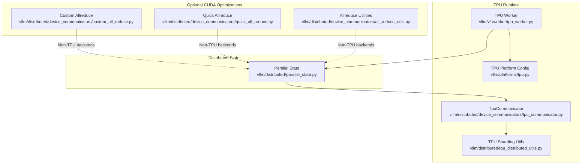
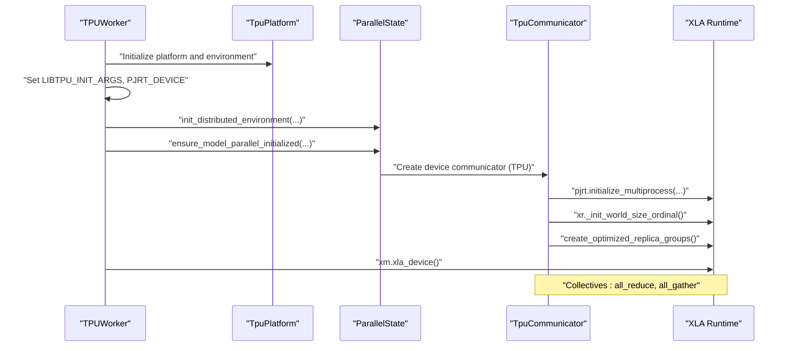
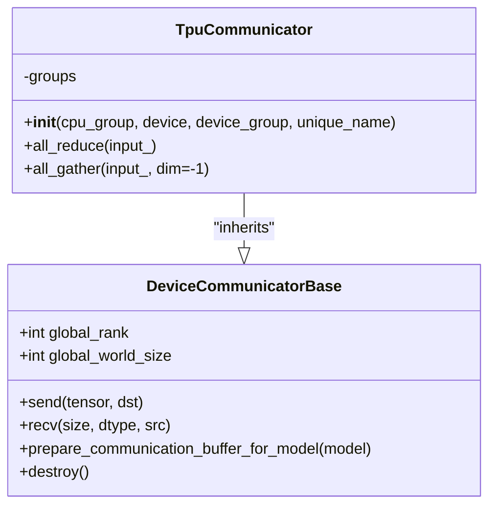
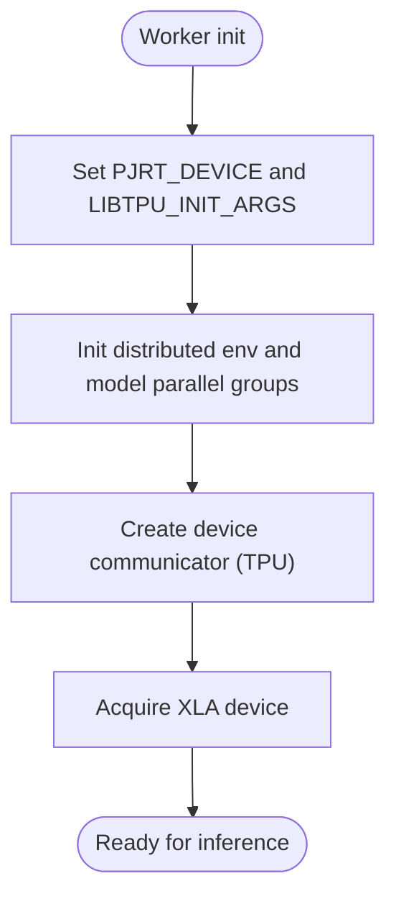
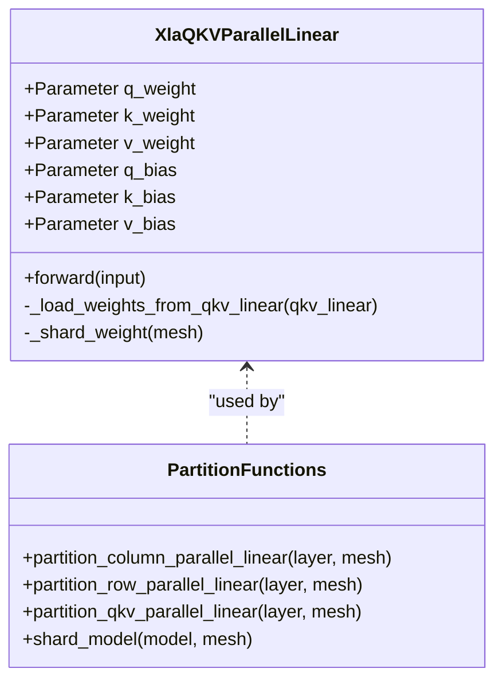
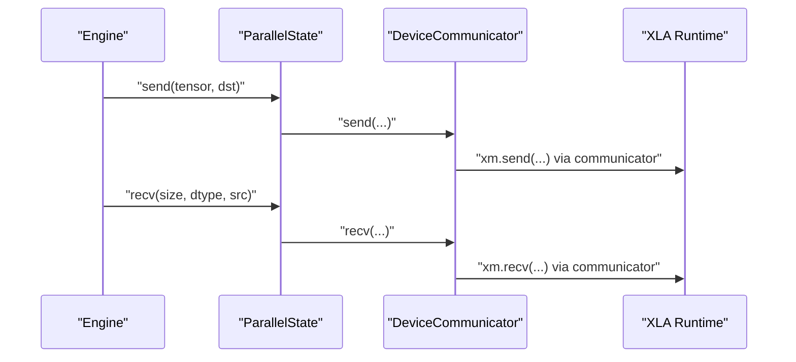
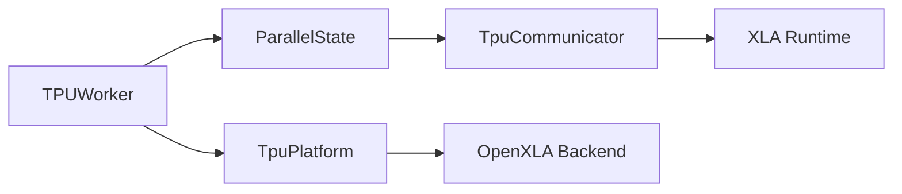

# TPU Communicator

<cite>
**Referenced Files in This Document**
- [tpu_communicator.py](file://vllm/distributed/device_communicators/tpu_communicator.py)
- [tpu_distributed_utils.py](file://vllm/distributed/tpu_distributed_utils.py)
- [tpu.py](file://vllm/platforms/tpu.py)
- [tpu_worker.py](file://vllm/v1/worker/tpu_worker.py)
- [parallel_state.py](file://vllm/distributed/parallel_state.py)
- [custom_all_reduce.py](file://vllm/distributed/device_communicators/custom_all_reduce.py)
- [quick_all_reduce.py](file://vllm/distributed/device_communicators/quick_all_reduce.py)
- [all_reduce_utils.py](file://vllm/distributed/device_communicators/all_reduce_utils.py)
</cite>

## Table of Contents
1. [Introduction](#introduction)
2. [Project Structure](#project-structure)
3. [Core Components](#core-components)
4. [Architecture Overview](#architecture-overview)
5. [Detailed Component Analysis](#detailed-component-analysis)
6. [Dependency Analysis](#dependency-analysis)
7. [Performance Considerations](#performance-considerations)
8. [Troubleshooting Guide](#troubleshooting-guide)
9. [Conclusion](#conclusion)

## Introduction
This document explains the TPU device communicator implementation in the repository, focusing on how distributed communication is orchestrated on TPU devices via the PyTorch/XLA runtime. It covers collective operations, communication backends, memory and compilation considerations, and integration with JAX/XLA-style runtime patterns. It also outlines configuration, performance tuning, and troubleshooting steps for TPU communication.

## Project Structure
The TPU communication stack is primarily implemented under the distributed subsystem and platform-specific modules:
- Device communicator for TPU: vllm/distributed/device_communicators/tpu_communicator.py
- XLA SPMD sharding helpers for TPU: vllm/distributed/tpu_distributed_utils.py
- Platform configuration and constraints for TPU: vllm/platforms/tpu.py
- Worker initialization and environment setup for TPU: vllm/v1/worker/tpu_worker.py
- Distributed state and device communicator lifecycle: vllm/distributed/parallel_state.py
- Optional custom allreduce pathways (non-TPU): vllm/distributed/device_communicators/custom_all_reduce.py, quick_all_reduce.py, all_reduce_utils.py

**Diagram sources**
- [tpu_communicator.py](file://vllm/distributed/device_communicators/tpu_communicator.py#L1-L100)
- [tpu_distributed_utils.py](file://vllm/distributed/tpu_distributed_utils.py#L1-L189)
- [tpu.py](file://vllm/platforms/tpu.py#L1-L296)
- [tpu_worker.py](file://vllm/vllm/v1/worker/tpu_worker.py#L1-L353)
- [parallel_state.py](file://vllm/distributed/parallel_state.py#L973-L1003)
- [custom_all_reduce.py](file://vllm/distributed/device_communicators/custom_all_reduce.py#L1-L327)
- [quick_all_reduce.py](file://vllm/distributed/device_communicators/quick_all_reduce.py#L1-L291)
- [all_reduce_utils.py](file://vllm/distributed/device_communicators/all_reduce_utils.py#L1-L345)

**Section sources**
- [tpu_communicator.py](file://vllm/distributed/device_communicators/tpu_communicator.py#L1-L100)
- [tpu_distributed_utils.py](file://vllm/distributed/tpu_distributed_utils.py#L1-L189)
- [tpu.py](file://vllm/platforms/tpu.py#L1-L296)
- [tpu_worker.py](file://vllm/v1/worker/tpu_worker.py#L1-L353)
- [parallel_state.py](file://vllm/distributed/parallel_state.py#L973-L1003)
- [custom_all_reduce.py](file://vllm/distributed/device_communicators/custom_all_reduce.py#L1-L327)
- [quick_all_reduce.py](file://vllm/distributed/device_communicators/quick_all_reduce.py#L1-L291)
- [all_reduce_utils.py](file://vllm/distributed/device_communicators/all_reduce_utils.py#L1-L345)

## Core Components
- TpuCommunicator: Implements device-side collectives for TPU using XLA’s all_reduce and all_gather with optimized replica groups.
- TPU Platform: Enforces TPU-specific constraints, sets compilation mode, attention backend, and device communicator class.
- TPU Worker: Initializes PJRT/XLA runtime, sets environment flags, and initializes distributed groups before device acquisition.
- Parallel State: Provides send/recv wrappers and device communicator lifecycle management.
- TPU Sharding Utils: Helper utilities for applying XLA SPMD sharding to linear layers and models.

Key responsibilities:
- Communication: all_reduce and all_gather on TPU via XLA.
- Environment: Ensures correct device visibility and multiprocess initialization.
- Constraints: Disables unsupported features (e.g., CUDA graphs) and adjusts dtypes.

**Section sources**
- [tpu_communicator.py](file://vllm/distributed/device_communicators/tpu_communicator.py#L37-L100)
- [tpu.py](file://vllm/platforms/tpu.py#L133-L223)
- [tpu_worker.py](file://vllm/v1/worker/tpu_worker.py#L109-L141)
- [parallel_state.py](file://vllm/distributed/parallel_state.py#L973-L1003)
- [tpu_distributed_utils.py](file://vllm/distributed/tpu_distributed_utils.py#L116-L189)

## Architecture Overview
The TPU communicator integrates with the broader distributed runtime:
- Worker initialization sets PJRT device and environment flags, then initializes distributed groups.
- Parallel state holds device communicators and exposes send/recv APIs.
- TpuCommunicator encapsulates XLA collectives and optimized replica groups.
- Platform enforces TPU-specific policies and defaults.

**Diagram sources**
- [tpu_worker.py](file://vllm/v1/worker/tpu_worker.py#L109-L141)
- [tpu.py](file://vllm/platforms/tpu.py#L133-L223)
- [parallel_state.py](file://vllm/distributed/parallel_state.py#L973-L1003)
- [tpu_communicator.py](file://vllm/distributed/device_communicators/tpu_communicator.py#L47-L100)

## Detailed Component Analysis

### TpuCommunicator
- Initialization:
  - Determines local world size and rank depending on deployment mode (Ray vs. native multiprocessing).
  - Sets environment variables for multihost visibility.
  - Initializes PJRT multiprocess and XLA ordinal, then constructs optimized replica groups for collectives.
- Collectives:
  - all_reduce: Uses XLA all_reduce with SUM and precomputed replica groups.
  - all_gather: Supports only dim=-1 on TPU.

**Diagram sources**
- [tpu_communicator.py](file://vllm/distributed/device_communicators/tpu_communicator.py#L37-L100)
- [parallel_state.py](file://vllm/distributed/parallel_state.py#L973-L1003)

**Section sources**
- [tpu_communicator.py](file://vllm/distributed/device_communicators/tpu_communicator.py#L47-L100)

### TPU Platform and Worker
- Platform:
  - Enforces compilation mode (DYNAMO_TRACE_ONCE), disables CUDA graphs, selects OpenXLA backend, and restricts dtype to bfloat16 when needed.
  - Selects Pallas attention backend and sets worker class for TPU.
- Worker:
  - Sets PJRT device to TPU and environment flags for XLA/TPU.
  - Initializes distributed environment and XLA device, then prepares model runner and KV cache.

**Diagram sources**
- [tpu_worker.py](file://vllm/v1/worker/tpu_worker.py#L109-L141)
- [tpu.py](file://vllm/platforms/tpu.py#L133-L223)

**Section sources**
- [tpu.py](file://vllm/platforms/tpu.py#L133-L223)
- [tpu_worker.py](file://vllm/v1/worker/tpu_worker.py#L109-L141)

### TPU Sharding Utilities (SPMD)
- Provides helpers to shard linear layers and QKV projections across logical mesh axes using XLA SPMD.
- Wraps QKVParallelLinear into separate projections and marks sharding on weights and optional biases.

**Diagram sources**
- [tpu_distributed_utils.py](file://vllm/distributed/tpu_distributed_utils.py#L22-L189)

**Section sources**
- [tpu_distributed_utils.py](file://vllm/distributed/tpu_distributed_utils.py#L22-L189)

### Parallel State Integration
- Exposes send/recv wrappers that delegate to the active device communicator.
- Manages destruction of process groups and device communicator.

**Diagram sources**
- [parallel_state.py](file://vllm/distributed/parallel_state.py#L973-L1003)
- [tpu_communicator.py](file://vllm/distributed/device_communicators/tpu_communicator.py#L92-L100)

**Section sources**
- [parallel_state.py](file://vllm/distributed/parallel_state.py#L973-L1003)

### Optional Custom Allreduce Pathways (Non-TPU Backends)
While TPU relies on XLA collectives, the repository includes custom allreduce implementations for CUDA-like platforms. These are not used on TPU but inform the design of buffer management and graph capture:
- CustomAllreduce: IPC-based custom allreduce with buffer registration and CUDA graph support.
- QuickAllReduce: Quantized reduction pathway for ROCm MI300 series.
- Allreduce Utilities: P2P capability checks and symmetric memory thresholds.

These components illustrate buffer sharing, graph registration, and environment-driven thresholds that are conceptually relevant when designing efficient collectives on other backends.

**Section sources**
- [custom_all_reduce.py](file://vllm/distributed/device_communicators/custom_all_reduce.py#L1-L327)
- [quick_all_reduce.py](file://vllm/distributed/device_communicators/quick_all_reduce.py#L1-L291)
- [all_reduce_utils.py](file://vllm/distributed/device_communicators/all_reduce_utils.py#L1-L345)

## Dependency Analysis
- TpuCommunicator depends on:
  - XLA runtime for multiprocess initialization and collectives.
  - Optimized replica groups for ring ordering.
- TPU Worker depends on:
  - Platform configuration and environment variables.
  - Parallel state for group initialization.
- Platform enforces:
  - Compilation mode and backend selection.
  - Attention backend and worker class assignment.

**Diagram sources**
- [tpu_worker.py](file://vllm/v1/worker/tpu_worker.py#L109-L141)
- [tpu.py](file://vllm/platforms/tpu.py#L133-L223)
- [parallel_state.py](file://vllm/distributed/parallel_state.py#L973-L1003)
- [tpu_communicator.py](file://vllm/distributed/device_communicators/tpu_communicator.py#L47-L100)

**Section sources**
- [tpu_worker.py](file://vllm/v1/worker/tpu_worker.py#L109-L141)
- [tpu.py](file://vllm/platforms/tpu.py#L133-L223)
- [parallel_state.py](file://vllm/distributed/parallel_state.py#L973-L1003)
- [tpu_communicator.py](file://vllm/distributed/device_communicators/tpu_communicator.py#L47-L100)

## Performance Considerations
- Compilation and Graph Mode:
  - TPU forces a specific compilation mode and disables CUDA graphs.
  - OpenXLA backend is selected by default on TPU.
- Dtype Handling:
  - Float16/Float32 are coerced to bfloat16 on TPU for compatibility.
- Attention Backend:
  - Pallas V1 is used for attention on TPU.
- Environment Flags:
  - XLA flags are set to influence allreduce strategy and fusion behavior.
- Memory Management:
  - Worker profiles memory usage and computes KV cache capacity considering head-size alignment and padding.
- SPMD Sharding:
  - Weight sharding for column/row/QKV layers reduces activation and weight transfers across shards.

Practical tips:
- Prefer bfloat16 for TPU workloads to align with platform constraints.
- Use SPMD sharding utilities to distribute layers across logical mesh axes.
- Keep world size within supported configurations for collectives.
- Tune XLA flags for your workload characteristics.

**Section sources**
- [tpu.py](file://vllm/platforms/tpu.py#L133-L223)
- [tpu_worker.py](file://vllm/v1/worker/tpu_worker.py#L109-L141)
- [tpu_distributed_utils.py](file://vllm/distributed/tpu_distributed_utils.py#L116-L189)

## Troubleshooting Guide
Common issues and resolutions:
- Multi-host visibility:
  - Ensure environment variables for task ID and visible chips are set before device initialization.
- Single-host assumption:
  - TPU communicator asserts single-host deployment; verify cluster topology matches expectations.
- Unsupported features:
  - CUDA graphs are disabled on TPU; expect lower compilation flexibility.
  - Speculative decoding is not supported on TPU.
- Dtype mismatches:
  - If model dtype is float16/float32, platform will coerce to bfloat16 automatically.
- Attention backend:
  - Sparse attention is not supported on TPU; use dense attention backends.
- Compilation mode:
  - Compilation mode is forced to a trace-once mode; avoid expecting dynamic recompilation behavior.

Operational checks:
- Confirm worker initialization sequence: environment setup, distributed init, device acquisition.
- Validate that device communicator is present and active before issuing collectives.
- Review logs for warnings about dtype coercion, backend selection, or feature unavailability.

**Section sources**
- [tpu_communicator.py](file://vllm/distributed/device_communicators/tpu_communicator.py#L47-L100)
- [tpu.py](file://vllm/platforms/tpu.py#L133-L223)
- [parallel_state.py](file://vllm/distributed/parallel_state.py#L973-L1003)

## Conclusion
The TPU communicator integrates tightly with PyTorch/XLA to provide efficient distributed communication on TPU devices. It leverages XLA collectives with optimized replica groups, enforces platform-specific constraints, and integrates with SPMD sharding utilities. While optional custom allreduce pathways exist for other backends, TPU relies on XLA’s runtime for collective operations. Proper configuration of environment variables, compilation modes, and attention backends ensures optimal performance and stability on TPU.