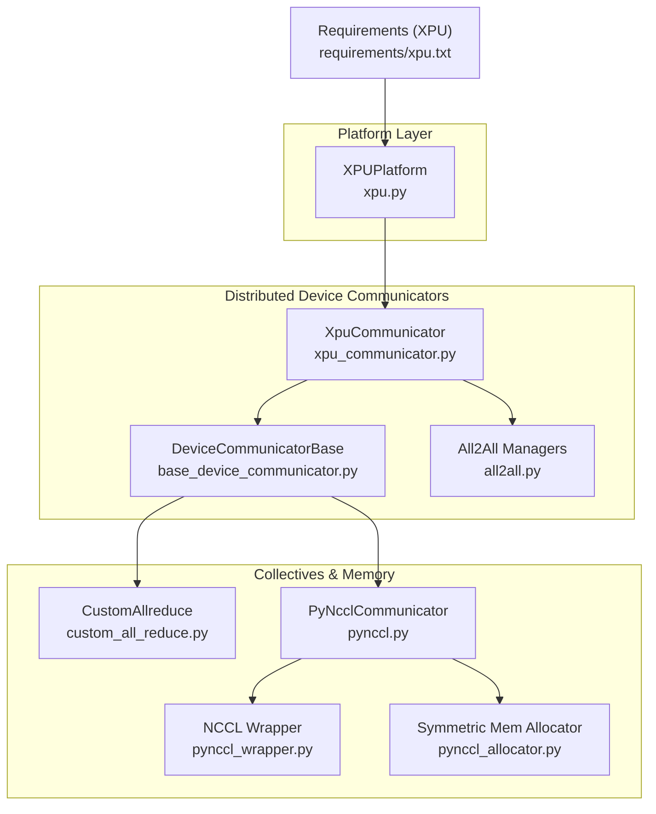
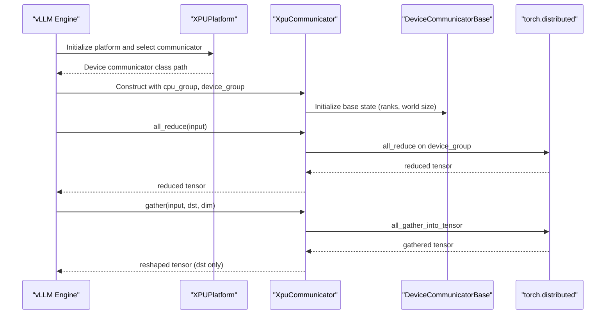
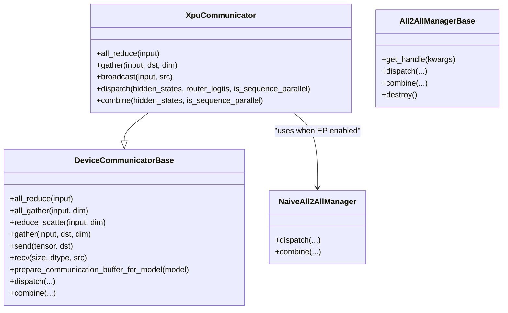
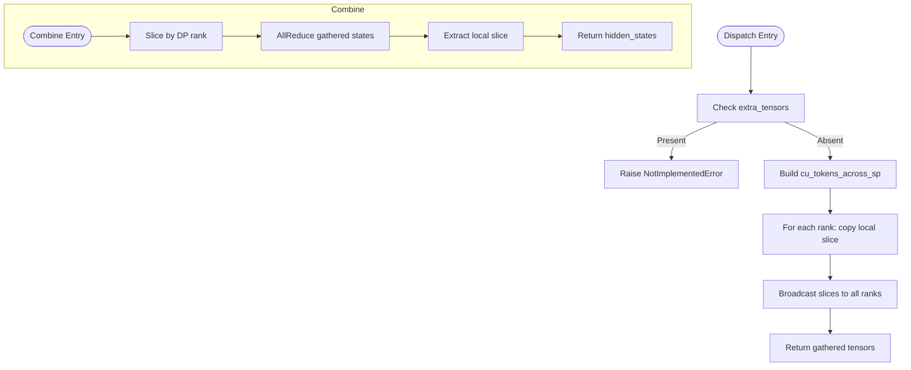
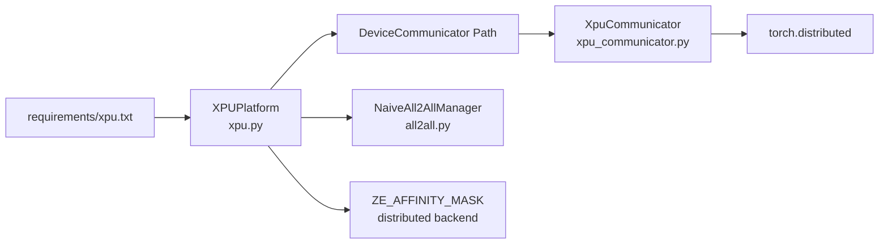

# XPU Communicator

<cite>
**Referenced Files in This Document**
- [xpu_communicator.py](file://vllm/distributed/device_communicators/xpu_communicator.py)
- [base_device_communicator.py](file://vllm/distributed/device_communicators/base_device_communicator.py)
- [all2all.py](file://vllm/distributed/device_communicators/all2all.py)
- [xpu.py](file://vllm/platforms/xpu.py)
- [custom_all_reduce.py](file://vllm/distributed/device_communicators/custom_all_reduce.py)
- [pynccl.py](file://vllm/distributed/device_communicators/pynccl.py)
- [pynccl_wrapper.py](file://vllm/distributed/device_communicators/pynccl_wrapper.py)
- [pynccl_allocator.py](file://vllm/distributed/device_communicators/pynccl_allocator.py)
- [xpu.txt](file://requirements/xpu.txt)
</cite>

## Table of Contents
1. [Introduction](#introduction)
2. [Project Structure](#project-structure)
3. [Core Components](#core-components)
4. [Architecture Overview](#architecture-overview)
5. [Detailed Component Analysis](#detailed-component-analysis)
6. [Dependency Analysis](#dependency-analysis)
7. [Performance Considerations](#performance-considerations)
8. [Troubleshooting Guide](#troubleshooting-guide)
9. [Conclusion](#conclusion)
10. [Appendices](#appendices)

## Introduction
This document explains the Intel XPU device communicator implementation in vLLM. It covers how the XPU communicator integrates with the distributed runtime, how collective operations are executed on Intel hardware, and how device memory management is handled. It also describes the all2all dispatch/combine mechanisms, memory transfer patterns, and performance tuning strategies tailored for Intel XPU platforms. Finally, it provides usage guidance, integration tips with Intel’s distributed communication libraries, and troubleshooting advice for XPU-specific communication challenges.

## Project Structure
The XPU communicator sits within the distributed device communicators subsystem and is selected by the XPU platform abstraction. The platform configures the distributed backend and device capabilities, while the communicator provides device-side primitives for collectives and expert parallel all2all.

**Diagram sources**
- [xpu.py](file://vllm/platforms/xpu.py#L1-L281)
- [xpu_communicator.py](file://vllm/distributed/device_communicators/xpu_communicator.py#L1-L96)
- [base_device_communicator.py](file://vllm/distributed/device_communicators/base_device_communicator.py#L1-L303)
- [all2all.py](file://vllm/distributed/device_communicators/all2all.py#L1-L510)
- [custom_all_reduce.py](file://vllm/distributed/device_communicators/custom_all_reduce.py#L1-L327)
- [pynccl.py](file://vllm/distributed/device_communicators/pynccl.py#L1-L387)
- [pynccl_wrapper.py](file://vllm/distributed/device_communicators/pynccl_wrapper.py#L1-L565)
- [pynccl_allocator.py](file://vllm/distributed/device_communicators/pynccl_allocator.py#L1-L192)
- [xpu.txt](file://requirements/xpu.txt#L1-L19)

**Section sources**
- [xpu.py](file://vllm/platforms/xpu.py#L1-L281)
- [xpu_communicator.py](file://vllm/distributed/device_communicators/xpu_communicator.py#L1-L96)
- [base_device_communicator.py](file://vllm/distributed/device_communicators/base_device_communicator.py#L1-L303)
- [all2all.py](file://vllm/distributed/device_communicators/all2all.py#L1-L510)
- [custom_all_reduce.py](file://vllm/distributed/device_communicators/custom_all_reduce.py#L1-L327)
- [pynccl.py](file://vllm/distributed/device_communicators/pynccl.py#L1-L387)
- [pynccl_wrapper.py](file://vllm/distributed/device_communicators/pynccl_wrapper.py#L1-L565)
- [pynccl_allocator.py](file://vllm/distributed/device_communicators/pynccl_allocator.py#L1-L192)
- [xpu.txt](file://requirements/xpu.txt#L1-L19)

## Core Components
- XPU Platform: Defines device characteristics, distributed backend selection, device control environment variable, attention backend choices, and worker/class overrides for XPU.
- XPU Device Communicator: Implements device-side collectives and all2all dispatch/combine for XPU, with a fallback to naive all2all manager when needed.
- Base Device Communicator: Provides generic collective primitives (all_reduce, all_gather, reduce_scatter, gather, send/recv) and EP/all2all integration hooks.
- All2All Managers: Naive, Aggregated-Reduce-Scatter (AgRs), FlashInfer-based, and DeepEP-based managers; XPU selects a naive manager for compatibility.
- Collectives Utilities: Custom allreduce and PyNccl-based collectives are available for other backends; XPU relies on torch.distributed collectives via the base communicator.

Key responsibilities:
- Device-side collectives on XPU use torch.distributed primitives.
- All2All on XPU uses a naive manager to avoid backend-specific assumptions.
- Platform sets distributed backend and device control environment variables for Intel XPU.

**Section sources**
- [xpu.py](file://vllm/platforms/xpu.py#L1-L281)
- [xpu_communicator.py](file://vllm/distributed/device_communicators/xpu_communicator.py#L1-L96)
- [base_device_communicator.py](file://vllm/distributed/device_communicators/base_device_communicator.py#L1-L303)
- [all2all.py](file://vllm/distributed/device_communicators/all2all.py#L1-L510)

## Architecture Overview
The XPU communicator participates in the broader distributed runtime by:
- Being selected by the XPU platform.
- Using the CPU process group to derive ranks and world size.
- Optionally using a device process group for device-side collectives.
- Executing collectives via torch.distributed on XPU.
- Performing all2all using a naive manager when expert parallel is enabled.

**Diagram sources**
- [xpu.py](file://vllm/platforms/xpu.py#L1-L281)
- [xpu_communicator.py](file://vllm/distributed/device_communicators/xpu_communicator.py#L1-L96)
- [base_device_communicator.py](file://vllm/distributed/device_communicators/base_device_communicator.py#L1-L303)

## Detailed Component Analysis

### XPU Platform (Intel XPU)
Responsibilities:
- Sets distributed backend to a CCL-compatible backend suitable for Intel XPU.
- Exposes device control environment variable for device affinity.
- Selects attention backends and enforces supported configurations.
- Overrides worker class and KV transfer behavior for XPU.
- Provides device capability and memory queries for XPU.

Notable behaviors:
- Enforces “naive” all2all manager for XPU when expert parallel is used.
- Disables CUDA graph mode on XPU.
- Supports hybrid KV cache and pin-memory availability.
- Provides device memory statistics and FP8 dtype for XPU.

**Section sources**
- [xpu.py](file://vllm/platforms/xpu.py#L1-L281)

### XPU Device Communicator
Responsibilities:
- Initializes all2all manager only when expert parallel is active.
- Uses naive all2all manager on XPU to ensure compatibility.
- Implements all_reduce via torch.distributed on the device group.
- Implements gather using all_gather_into_tensor and reshapes to emulate gather semantics.
- Broadcast uses torch.distributed broadcast on the device group.
- Dispatch and combine delegate to the all2all manager.

Important notes:
- The communicator warns and falls back to “naive” all2all backend on XPU if a non-naive backend is requested.
- The gather path uses all_gather_into_tensor and reshaping to match gather semantics; this avoids issues with gather in Ray clusters.

**Diagram sources**
- [base_device_communicator.py](file://vllm/distributed/device_communicators/base_device_communicator.py#L1-L303)
- [xpu_communicator.py](file://vllm/distributed/device_communicators/xpu_communicator.py#L1-L96)
- [all2all.py](file://vllm/distributed/device_communicators/all2all.py#L1-L510)

**Section sources**
- [xpu_communicator.py](file://vllm/distributed/device_communicators/xpu_communicator.py#L1-L96)
- [base_device_communicator.py](file://vllm/distributed/device_communicators/base_device_communicator.py#L1-L303)
- [all2all.py](file://vllm/distributed/device_communicators/all2all.py#L1-L510)

### All2All Managers (Naive Implementation)
The naive manager is used on XPU to avoid backend-specific assumptions. It:
- Gathers tokens per DP rank using broadcasts.
- Scatters tokens across ranks using all_reduce and slicing.

**Diagram sources**
- [all2all.py](file://vllm/distributed/device_communicators/all2all.py#L1-L510)

**Section sources**
- [all2all.py](file://vllm/distributed/device_communicators/all2all.py#L1-L510)

### Base Device Communicator (Generic Primitives)
Provides:
- all_reduce, all_gather, reduce_scatter, gather, send, recv.
- EP/all2all integration hooks.
- Buffer preparation for expert parallel modules.

Important implementation details:
- all_gather uses all_gather_into_tensor with reshape-style concatenation along the chosen dimension.
- reduce_scatter ensures input contiguity and uses reduce_scatter_tensor with proper dimension movement.
- gather uses torch.distributed.gather with optional dst-side concatenation.

These primitives are used by XpuCommunicator and form the foundation for device-side collectives.

**Section sources**
- [base_device_communicator.py](file://vllm/distributed/device_communicators/base_device_communicator.py#L1-L303)

### Custom Allreduce and PyNccl Collectives (Context)
While not used by XPU, these components illustrate the broader collectives ecosystem:
- CustomAllreduce: IPC/shared-buffer-based allreduce with CUDA graph support; disabled on XPU.
- PyNcclCommunicator: Pure-Python NCCL wrapper enabling NCCL-backed collectives with CUDA graph compatibility; primarily for CUDA-like platforms.

These are included for completeness and to clarify when platform-specific collectives are applicable.

**Section sources**
- [custom_all_reduce.py](file://vllm/distributed/device_communicators/custom_all_reduce.py#L1-L327)
- [pynccl.py](file://vllm/distributed/device_communicators/pynccl.py#L1-L387)
- [pynccl_wrapper.py](file://vllm/distributed/device_communicators/pynccl_wrapper.py#L1-L565)
- [pynccl_allocator.py](file://vllm/distributed/device_communicators/pynccl_allocator.py#L1-L192)

## Dependency Analysis
- Platform-to-Communicator: XPUPlatform exposes the device communicator class path; the platform also configures distributed backend and device control environment variables.
- Communicator-to-Distributed: XpuCommunicator relies on torch.distributed for all_reduce, all_gather_into_tensor, and broadcast.
- All2All Manager Selection: XPUPlatform forces “naive” all2all manager when expert parallel is used; other managers (AgRs, FlashInfer, DeepEP) are not used on XPU.
- Requirements: XPU runtime depends on Intel XPU-enabled PyTorch and IPEX.

**Diagram sources**
- [xpu.py](file://vllm/platforms/xpu.py#L1-L281)
- [xpu_communicator.py](file://vllm/distributed/device_communicators/xpu_communicator.py#L1-L96)
- [all2all.py](file://vllm/distributed/device_communicators/all2all.py#L1-L510)
- [xpu.txt](file://requirements/xpu.txt#L1-L19)

**Section sources**
- [xpu.py](file://vllm/platforms/xpu.py#L1-L281)
- [xpu_communicator.py](file://vllm/distributed/device_communicators/xpu_communicator.py#L1-L96)
- [all2all.py](file://vllm/distributed/device_communicators/all2all.py#L1-L510)
- [xpu.txt](file://requirements/xpu.txt#L1-L19)

## Performance Considerations
- All2All on XPU: The naive manager is intentionally simple and compatible; it avoids backend-specific complexity but may not be optimal for large-scale or high-throughput scenarios. Consider this when designing expert-parallel workloads on XPU.
- Collective primitives: XPU uses torch.distributed collectives on the device group; ensure tensors are contiguous and aligned to minimize overhead.
- Memory: XPU platform reports peak memory usage and supports pin-memory; leverage pinned memory for host-device transfers when applicable.
- Attention backends: XPU attention backends are constrained; selecting supported backends reduces overhead and improves stability.
- Distributed backend: The platform sets a CCL-compatible distributed backend; ensure cluster-level CCL/XCCL configuration aligns with your environment.

[No sources needed since this section provides general guidance]

## Troubleshooting Guide
Common XPU communication issues and resolutions:
- All2All backend mismatch: XPU forces “naive” all2all manager. If you see warnings about unsupported backends, confirm that the naive manager is being used.
- Gather behavior in Ray clusters: XPU gather path uses all_gather_into_tensor and reshaping to emulate gather semantics. If cross-node Ray clusters exhibit unexpected behavior, prefer all_gather variants or adjust topology.
- Device affinity and environment: Ensure the device control environment variable is set appropriately for your workload.
- Dtype limitations: Some XPU devices have known precision limitations for certain dtypes; adjust dtype settings accordingly.
- Worker process model: XPU worker multiprocess method may require explicit spawn; the platform logs a warning and adjusts the environment variable if needed.

**Section sources**
- [xpu_communicator.py](file://vllm/distributed/device_communicators/xpu_communicator.py#L1-L96)
- [xpu.py](file://vllm/platforms/xpu.py#L1-L281)

## Conclusion
The XPU communicator in vLLM provides a minimal, robust, and compatible implementation for device-side collectives on Intel XPU devices. By relying on torch.distributed primitives and a naive all2all manager, it avoids backend-specific complexities while integrating cleanly with the broader distributed runtime. Platform-level configuration ensures attention backends, worker classes, and memory behavior are tuned for XPU. For performance-sensitive deployments, consider the trade-offs of the naive all2all manager and align distributed backend settings with your environment.

[No sources needed since this section summarizes without analyzing specific files]

## Appendices

### Example Usage Scenarios
- Expert parallel with all2all on XPU: When expert parallel is enabled, the XPU communicator initializes a naive all2all manager and performs dispatch/combine using broadcast/all_reduce patterns.
- Device-side collectives: Use all_reduce, all_gather_into_tensor, and broadcast through the XPU communicator for device-local reductions and broadcasting.
- Host-device transfers: Use pinned memory and appropriate attention backends to minimize overhead on XPU.

[No sources needed since this section provides general guidance]

### Environment and Dependencies
- XPU runtime dependencies include Intel XPU-enabled PyTorch and IPEX. Ensure the environment matches the requirements.

**Section sources**
- [xpu.txt](file://requirements/xpu.txt#L1-L19)