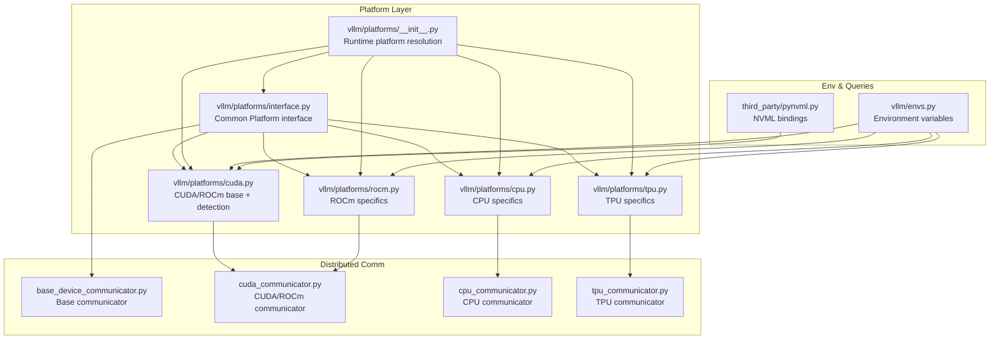
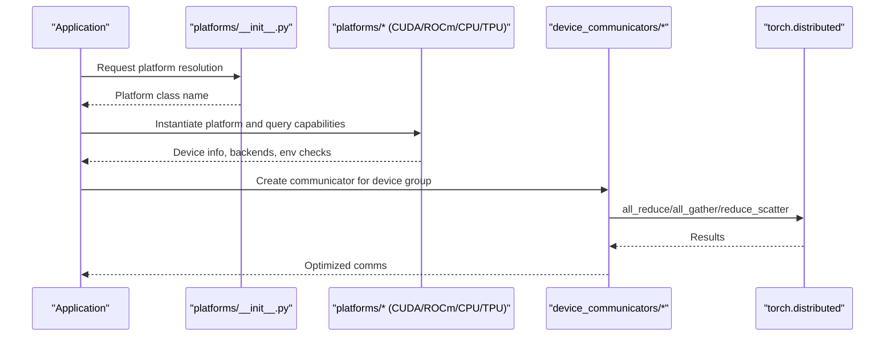
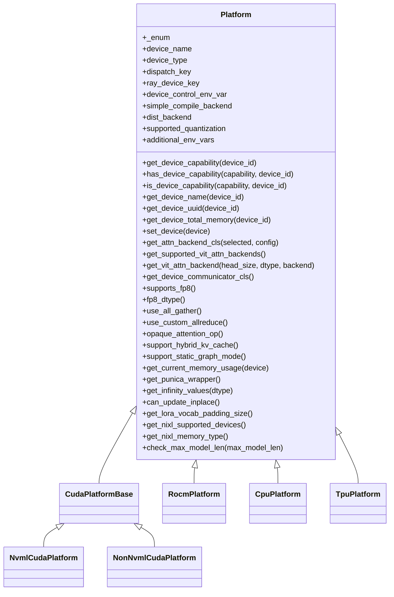
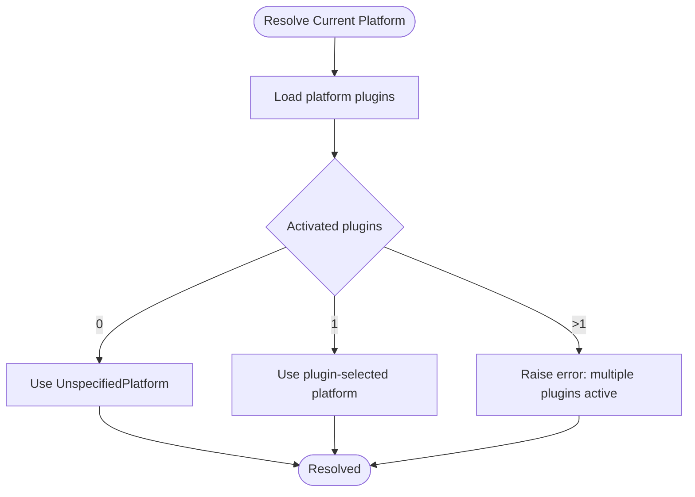
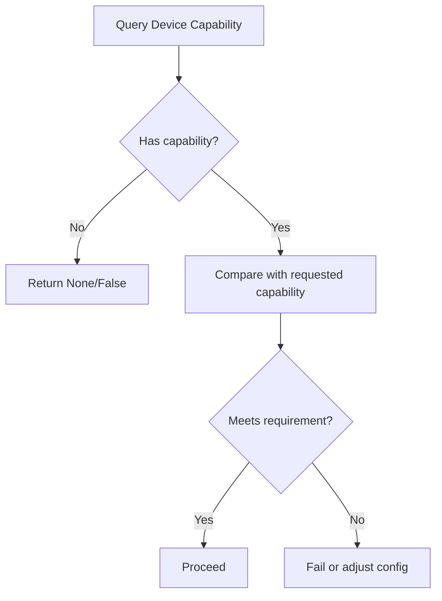
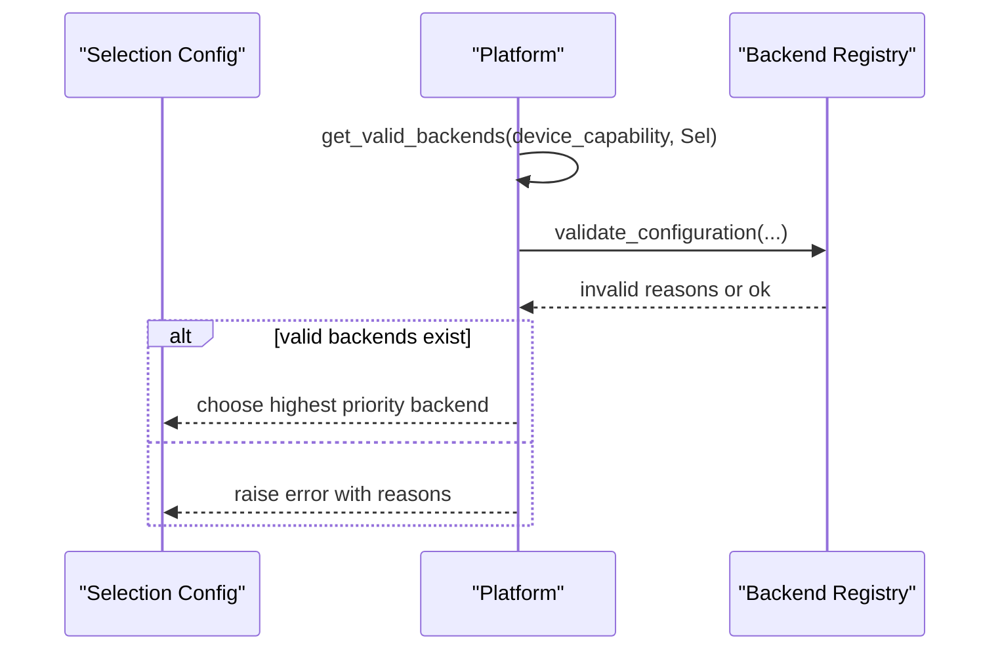
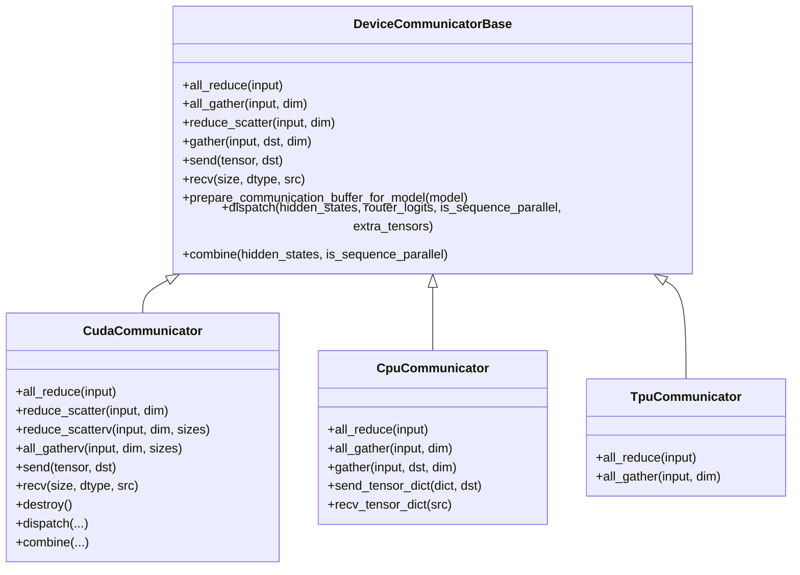
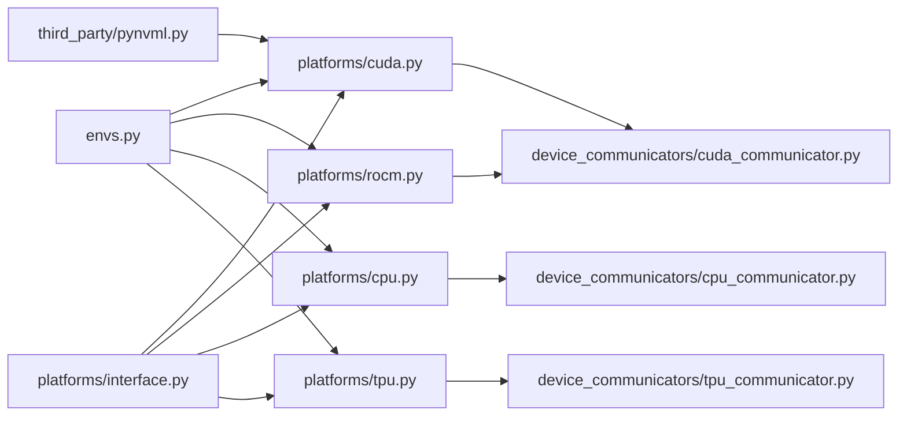

# Hardware Abstraction

<cite>
**Referenced Files in This Document**
- [platforms/interface.py](file://vllm/platforms/interface.py)
- [platforms/__init__.py](file://vllm/platforms/__init__.py)
- [platforms/cuda.py](file://vllm/platforms/cuda.py)
- [platforms/rocm.py](file://vllm/platforms/rocm.py)
- [platforms/cpu.py](file://vllm/platforms/cpu.py)
- [platforms/tpu.py](file://vllm/platforms/tpu.py)
- [envs.py](file://vllm/envs.py)
- [distributed/device_communicators/base_device_communicator.py](file://vllm/distributed/device_communicators/base_device_communicator.py)
- [distributed/device_communicators/cuda_communicator.py](file://vllm/distributed/device_communicators/cuda_communicator.py)
- [distributed/device_communicators/cpu_communicator.py](file://vllm/distributed/device_communicators/cpu_communicator.py)
- [distributed/device_communicators/tpu_communicator.py](file://vllm/distributed/device_communicators/tpu_communicator.py)
- [third_party/pynvml.py](file://vllm/third_party/pynvml.py)
</cite>

## Table of Contents
1. [Introduction](#introduction)
2. [Project Structure](#project-structure)
3. [Core Components](#core-components)
4. [Architecture Overview](#architecture-overview)
5. [Detailed Component Analysis](#detailed-component-analysis)
6. [Dependency Analysis](#dependency-analysis)
7. [Performance Considerations](#performance-considerations)
8. [Troubleshooting Guide](#troubleshooting-guide)
9. [Conclusion](#conclusion)
10. [Appendices](#appendices)

## Introduction
This document explains vLLM’s hardware abstraction layer and how it supports diverse hardware platforms and custom hardware integration. It covers:
- Platform abstraction layer and runtime selection
- Device communicators and distributed communication backends
- Hardware capability queries and platform detection
- Device-specific optimizations and attention backend selection
- Practical configuration examples for NVIDIA CUDA, AMD ROCm, Intel CPU/GPU, ARM, PowerPC, and TPU platforms
- Guidance for integrating custom hardware and tuning performance across architectures

## Project Structure
The hardware abstraction spans several modules:
- Platform layer: a common interface and platform-specific implementations
- Distributed device communicators: platform-specific communication backends
- Environment and configuration: environment variables controlling target device and runtime behavior
- Third-party device query libraries: NVML for NVIDIA GPUs

**Diagram sources**
- [platforms/interface.py](file://vllm/platforms/interface.py#L1-L120)
- [platforms/__init__.py](file://vllm/platforms/__init__.py#L191-L238)
- [platforms/cuda.py](file://vllm/platforms/cuda.py#L1-L120)
- [platforms/rocm.py](file://vllm/platforms/rocm.py#L1-L120)
- [platforms/cpu.py](file://vllm/platforms/cpu.py#L1-L120)
- [platforms/tpu.py](file://vllm/platforms/tpu.py#L1-L120)
- [distributed/device_communicators/base_device_communicator.py](file://vllm/distributed/device_communicators/base_device_communicator.py#L92-L160)
- [distributed/device_communicators/cuda_communicator.py](file://vllm/distributed/device_communicators/cuda_communicator.py#L24-L90)
- [distributed/device_communicators/cpu_communicator.py](file://vllm/distributed/device_communicators/cpu_communicator.py#L17-L40)
- [distributed/device_communicators/tpu_communicator.py](file://vllm/distributed/device_communicators/tpu_communicator.py#L37-L100)
- [envs.py](file://vllm/envs.py#L448-L520)
- [third_party/pynvml.py](file://vllm/third_party/pynvml.py#L2596-L2620)

**Section sources**
- [platforms/interface.py](file://vllm/platforms/interface.py#L1-L120)
- [platforms/__init__.py](file://vllm/platforms/__init__.py#L191-L238)
- [envs.py](file://vllm/envs.py#L448-L520)

## Core Components
- Platform interface: defines capabilities, device queries, attention backend selection, and distributed communication hooks.
- Platform implementations: CUDA, ROCm, CPU, TPU, with platform-specific behavior and environment controls.
- Device communicators: platform-specific wrappers around torch.distributed and vendor-specific fast paths.
- Environment variables: control target device, dtype precision, attention backends, and platform-specific toggles.

Key responsibilities:
- Capability detection and validation (compute capability, FP8 support, dtype support)
- Attention backend selection tailored to device families
- Distributed communication with platform-aware optimizations (NCCL, Gloo, XLA, SHM)
- CPU architecture detection and environment tuning for optimal performance

**Section sources**
- [platforms/interface.py](file://vllm/platforms/interface.py#L100-L220)
- [platforms/cuda.py](file://vllm/platforms/cuda.py#L97-L170)
- [platforms/rocm.py](file://vllm/platforms/rocm.py#L161-L220)
- [platforms/cpu.py](file://vllm/platforms/cpu.py#L71-L120)
- [platforms/tpu.py](file://vllm/platforms/tpu.py#L37-L96)
- [distributed/device_communicators/base_device_communicator.py](file://vllm/distributed/device_communicators/base_device_communicator.py#L92-L160)
- [envs.py](file://vllm/envs.py#L448-L520)

## Architecture Overview
The platform abstraction layer resolves the current platform at runtime and delegates device-specific logic to platform classes. Device communicators encapsulate distributed operations with platform-aware optimizations.

**Diagram sources**
- [platforms/__init__.py](file://vllm/platforms/__init__.py#L191-L238)
- [platforms/interface.py](file://vllm/platforms/interface.py#L279-L323)
- [distributed/device_communicators/base_device_communicator.py](file://vllm/distributed/device_communicators/base_device_communicator.py#L135-L205)
- [distributed/device_communicators/cuda_communicator.py](file://vllm/distributed/device_communicators/cuda_communicator.py#L126-L175)

## Detailed Component Analysis

### Platform Abstraction Layer
- Defines enums for platform types and device capability representation.
- Provides capability queries (compute capability, FP8 support, dtype support).
- Exposes hooks for attention backend selection and distributed process group initialization.
- Offers helpers for CPU architecture detection and pin-memory availability.

**Diagram sources**
- [platforms/interface.py](file://vllm/platforms/interface.py#L100-L220)
- [platforms/cuda.py](file://vllm/platforms/cuda.py#L97-L170)
- [platforms/rocm.py](file://vllm/platforms/rocm.py#L161-L220)
- [platforms/cpu.py](file://vllm/platforms/cpu.py#L71-L120)
- [platforms/tpu.py](file://vllm/platforms/tpu.py#L37-L96)

**Section sources**
- [platforms/interface.py](file://vllm/platforms/interface.py#L279-L323)
- [platforms/interface.py](file://vllm/platforms/interface.py#L439-L543)

### Platform Detection and Resolution
- Runtime resolution selects a platform implementation based on environment and installed libraries.
- Falls back to an unspecified platform if none match.
- The target device can be controlled via environment variables.

**Diagram sources**
- [platforms/__init__.py](file://vllm/platforms/__init__.py#L191-L238)

**Section sources**
- [platforms/__init__.py](file://vllm/platforms/__init__.py#L191-L238)
- [envs.py](file://vllm/envs.py#L448-L469)

### Device Capability Queries and Validation
- Compute capability detection via NVML (NVIDIA) or torch for CUDA/ROCm.
- Capability comparisons and exact matches for device families.
- Dtype support checks and FP8 preference handling.

**Diagram sources**
- [platforms/interface.py](file://vllm/platforms/interface.py#L279-L323)
- [platforms/cuda.py](file://vllm/platforms/cuda.py#L480-L560)
- [third_party/pynvml.py](file://vllm/third_party/pynvml.py#L2596-L2620)

**Section sources**
- [platforms/interface.py](file://vllm/platforms/interface.py#L279-L323)
- [platforms/cuda.py](file://vllm/platforms/cuda.py#L480-L560)
- [third_party/pynvml.py](file://vllm/third_party/pynvml.py#L2596-L2620)

### Attention Backend Selection
- Platform-specific prioritization and validation of attention backends.
- Automatic fallback and warnings when selected backends are unavailable.
- Special handling for MLA, sparse attention, and ViT backends.

**Diagram sources**
- [platforms/cuda.py](file://vllm/platforms/cuda.py#L259-L359)
- [platforms/rocm.py](file://vllm/platforms/rocm.py#L189-L299)
- [platforms/cpu.py](file://vllm/platforms/cpu.py#L122-L140)
- [platforms/tpu.py](file://vllm/platforms/tpu.py#L58-L96)

**Section sources**
- [platforms/cuda.py](file://vllm/platforms/cuda.py#L259-L359)
- [platforms/rocm.py](file://vllm/platforms/rocm.py#L189-L299)
- [platforms/cpu.py](file://vllm/platforms/cpu.py#L122-L140)
- [platforms/tpu.py](file://vllm/platforms/tpu.py#L58-L96)

### Distributed Communication Backends
- Base communicator defines common APIs for all-reduce, all-gather, reduce-scatter, send/recv, and expert-parallel all2all dispatch/combine.
- CUDA/ROCm communicator adds vendor-specific optimizations (custom allreduce, symmetric memory, PyNccl, quick reduce).
- CPU communicator optionally uses shared-memory transport for intra-node comms on supported architectures.
- TPU communicator integrates with XLA for all-reduce and all-gather.

**Diagram sources**
- [distributed/device_communicators/base_device_communicator.py](file://vllm/distributed/device_communicators/base_device_communicator.py#L92-L303)
- [distributed/device_communicators/cuda_communicator.py](file://vllm/distributed/device_communicators/cuda_communicator.py#L24-L175)
- [distributed/device_communicators/cpu_communicator.py](file://vllm/distributed/device_communicators/cpu_communicator.py#L17-L112)
- [distributed/device_communicators/tpu_communicator.py](file://vllm/distributed/device_communicators/tpu_communicator.py#L37-L100)

**Section sources**
- [distributed/device_communicators/base_device_communicator.py](file://vllm/distributed/device_communicators/base_device_communicator.py#L92-L205)
- [distributed/device_communicators/cuda_communicator.py](file://vllm/distributed/device_communicators/cuda_communicator.py#L126-L175)
- [distributed/device_communicators/cpu_communicator.py](file://vllm/distributed/device_communicators/cpu_communicator.py#L17-L112)
- [distributed/device_communicators/tpu_communicator.py](file://vllm/distributed/device_communicators/tpu_communicator.py#L37-L100)

### Environment Variables and Configuration
- Target device selection and dtype precision control.
- Attention backend selection and platform-specific toggles.
- Memory and compilation-related flags affecting performance.

Examples of relevant environment variables:
- Target device and precision: VLLM_TARGET_DEVICE, VLLM_FLOAT32_MATMUL_PRECISION
- Attention backend: VLLM_ATTENTION_BACKEND, VLLM_USE_FLASHINFER_SAMPLER
- ROCm-specific: VLLM_ROCM_USE_AITER, VLLM_ROCM_USE_AITER_UNIFIED_ATTENTION, VLLM_ROCM_CUSTOM_PAGED_ATTN
- CPU-specific: VLLM_CPU_KVCACHE_SPACE, VLLM_CPU_OMP_THREADS_BIND
- TPU-specific: additional env vars for device chips and bounds
- CUDA/NCCL: VLLM_NCCL_SO_PATH, CUDA_HOME, CUDA_VISIBLE_DEVICES

**Section sources**
- [envs.py](file://vllm/envs.py#L448-L520)
- [envs.py](file://vllm/envs.py#L520-L800)
- [platforms/rocm.py](file://vllm/platforms/rocm.py#L161-L220)
- [platforms/cpu.py](file://vllm/platforms/cpu.py#L270-L342)
- [platforms/tpu.py](file://vllm/platforms/tpu.py#L47-L56)

### Platform-Specific Implementations

#### NVIDIA CUDA
- NVML-based capability detection and device queries.
- Attention backend prioritization by compute capability family.
- FP8 support checks and dtype validation.
- Custom allreduce and symmetric memory optimizations.

Practical configuration tips:
- Prefer Flash-Attention or Triton backends on modern GPUs; adjust block sizes accordingly.
- Enable symmetric memory all-reduce when available.
- Use FP8 when supported and appropriate for workload.

**Section sources**
- [platforms/cuda.py](file://vllm/platforms/cuda.py#L480-L560)
- [platforms/cuda.py](file://vllm/platforms/cuda.py#L259-L359)
- [platforms/cuda.py](file://vllm/platforms/cuda.py#L400-L418)
- [platforms/cuda.py](file://vllm/platforms/cuda.py#L426-L446)

#### AMD ROCm
- AMDSMI-based topology and capability checks.
- AITER and Triton backends with environment-driven selection.
- FP8 support and FNUZ dtype preference on specific architectures.
- Custom allreduce and symmetric memory optimizations.

Practical configuration tips:
- Enable AITER unified attention selectively via environment flags.
- Adjust block sizes for ROCm-specific backends.
- Use FP8 with FNUZ on supported MI300-series devices.

**Section sources**
- [platforms/rocm.py](file://vllm/platforms/rocm.py#L351-L386)
- [platforms/rocm.py](file://vllm/platforms/rocm.py#L189-L299)
- [platforms/rocm.py](file://vllm/platforms/rocm.py#L489-L510)
- [platforms/rocm.py](file://vllm/platforms/rocm.py#L512-L521)

#### Intel CPU/GPU (including ARM, PowerPC)
- CPU architecture detection and dtype preferences per architecture.
- CPU-specific attention backend selection and KV cache sizing.
- Shared-memory transport for intra-node comms on supported architectures.
- Environment tuning for OpenMP and thread binding.

Practical configuration tips:
- Set CPU-visible memory nodes and thread counts appropriately.
- Prefer block sizes divisible by 32 for CPU backend.
- Use FP32 on certain RISC-V systems due to scheduler constraints.

**Section sources**
- [platforms/cpu.py](file://vllm/platforms/cpu.py#L41-L70)
- [platforms/cpu.py](file://vllm/platforms/cpu.py#L80-L121)
- [platforms/cpu.py](file://vllm/platforms/cpu.py#L122-L210)
- [platforms/cpu.py](file://vllm/platforms/cpu.py#L355-L422)
- [distributed/device_communicators/cpu_communicator.py](file://vllm/distributed/device_communicators/cpu_communicator.py#L17-L40)

#### TPU Platforms
- XLA-based attention backend selection and compilation mode enforcement.
- In-place update restrictions and dtype adjustments.
- Specialized all-reduce and all-gather for XLA.

Practical configuration tips:
- Use DYNAMO_TRACE_ONCE and disable CUDA graphs on TPU.
- Adjust block sizes to page size requirements for Pallas backend.
- Avoid per-request seeds on XLA.

**Section sources**
- [platforms/tpu.py](file://vllm/platforms/tpu.py#L37-L96)
- [platforms/tpu.py](file://vllm/platforms/tpu.py#L134-L214)
- [platforms/tpu.py](file://vllm/platforms/tpu.py#L221-L270)

### Custom Hardware Integration
- Out-of-tree platform plugins can be activated to supply a platform class.
- The resolver enforces single active platform (built-in or plugin).
- Platform classes can override capability queries, attention selection, and communicators.

Integration steps:
- Implement a platform class inheriting from the base interface.
- Register a plugin that returns the platform class’ qualified name.
- Ensure device capability queries and communicators are implemented for the target device.

**Section sources**
- [platforms/__init__.py](file://vllm/platforms/__init__.py#L191-L238)
- [platforms/interface.py](file://vllm/platforms/interface.py#L100-L160)

## Dependency Analysis
- Platform implementations depend on torch device APIs and optional vendor libraries (NVML, AMDSMI).
- Device communicators depend on torch.distributed and platform-specific fast-path libraries.
- Environment variables influence platform selection, attention backends, and runtime behavior.

**Diagram sources**
- [envs.py](file://vllm/envs.py#L448-L520)
- [platforms/cuda.py](file://vllm/platforms/cuda.py#L1-L60)
- [platforms/rocm.py](file://vllm/platforms/rocm.py#L1-L45)
- [platforms/cpu.py](file://vllm/platforms/cpu.py#L1-L30)
- [platforms/tpu.py](file://vllm/platforms/tpu.py#L1-L36)
- [third_party/pynvml.py](file://vllm/third_party/pynvml.py#L2596-L2620)
- [distributed/device_communicators/cuda_communicator.py](file://vllm/distributed/device_communicators/cuda_communicator.py#L24-L90)
- [distributed/device_communicators/cpu_communicator.py](file://vllm/distributed/device_communicators/cpu_communicator.py#L17-L40)
- [distributed/device_communicators/tpu_communicator.py](file://vllm/distributed/device_communicators/tpu_communicator.py#L37-L100)
- [platforms/interface.py](file://vllm/platforms/interface.py#L100-L160)

**Section sources**
- [envs.py](file://vllm/envs.py#L448-L520)
- [platforms/cuda.py](file://vllm/platforms/cuda.py#L1-L60)
- [platforms/rocm.py](file://vllm/platforms/rocm.py#L1-L45)
- [platforms/cpu.py](file://vllm/platforms/cpu.py#L1-L30)
- [platforms/tpu.py](file://vllm/platforms/tpu.py#L1-L36)
- [third_party/pynvml.py](file://vllm/third_party/pynvml.py#L2596-L2620)
- [distributed/device_communicators/cuda_communicator.py](file://vllm/distributed/device_communicators/cuda_communicator.py#L24-L90)
- [distributed/device_communicators/cpu_communicator.py](file://vllm/distributed/device_communicators/cpu_communicator.py#L17-L40)
- [distributed/device_communicators/tpu_communicator.py](file://vllm/distributed/device_communicators/tpu_communicator.py#L37-L100)
- [platforms/interface.py](file://vllm/platforms/interface.py#L100-L160)

## Performance Considerations
- Attention backend selection depends on compute capability and model configuration; choose backends aligned with device capabilities.
- FP8 support varies by platform; ensure dtype and FP8 variant (FNUZ vs OCP) are appropriate.
- Distributed communication optimizations:
  - CUDA/ROCm: leverage custom allreduce, symmetric memory, and PyNccl fast paths.
  - CPU: shared-memory transport for intra-node comms on supported architectures.
  - TPU: XLA-based all-reduce and all-gather; avoid CUDA graphs.
- CPU backend prefers block sizes divisible by 32; adjust KV cache block size accordingly.
- Environment variables can significantly impact performance; tune attention backends, dtype precision, and platform-specific toggles.

[No sources needed since this section provides general guidance]

## Troubleshooting Guide
- Platform detection issues:
  - Ensure only one platform plugin is active; multiple activations are not allowed.
  - If no platform is detected, vLLM falls back to an unspecified platform; verify environment and installed libraries.
- Capability mismatches:
  - BF16 support requires compute capability thresholds; adjust dtype or device.
  - FP8 availability differs by device family; verify platform support and dtype preference.
- Distributed communication errors:
  - CUDA/ROCm: verify NCCL and symmetric memory configurations; check custom allreduce availability.
  - CPU: ensure shared-memory transport is available and configured for intra-node comms.
  - TPU: confirm XLA initialization and replica groups; avoid per-request seeds.

**Section sources**
- [platforms/__init__.py](file://vllm/platforms/__init__.py#L191-L238)
- [platforms/cuda.py](file://vllm/platforms/cuda.py#L426-L446)
- [platforms/rocm.py](file://vllm/platforms/rocm.py#L489-L510)
- [platforms/tpu.py](file://vllm/platforms/tpu.py#L221-L241)
- [distributed/device_communicators/cuda_communicator.py](file://vllm/distributed/device_communicators/cuda_communicator.py#L126-L175)
- [distributed/device_communicators/cpu_communicator.py](file://vllm/distributed/device_communicators/cpu_communicator.py#L113-L210)

## Conclusion
vLLM’s hardware abstraction layer cleanly separates platform-specific concerns from distributed communication logic. Through capability queries, attention backend selection, and platform-aware communicators, it delivers high performance across NVIDIA CUDA, AMD ROCm, Intel CPU/GPU, ARM, PowerPC, and TPU platforms. Environment variables provide flexible runtime control, while the platform plugin mechanism enables custom hardware integration. Proper configuration and tuning yield significant performance gains across diverse hardware architectures.

[No sources needed since this section summarizes without analyzing specific files]

## Appendices

### Practical Configuration Examples
- NVIDIA CUDA
  - Set target device and precision: VLLM_TARGET_DEVICE=cuda, VLLM_FLOAT32_MATMUL_PRECISION=tf32
  - Choose attention backend via VLLM_ATTENTION_BACKEND
  - Enable symmetric memory all-reduce when available
- AMD ROCm
  - Enable AITER backends via VLLM_ROCM_USE_AITER and related toggles
  - Adjust block sizes for ROCm-specific backends
  - Use FP8 with FNUZ on supported MI300-series devices
- Intel CPU/GPU
  - Configure CPU-visible memory nodes and thread counts
  - Prefer block sizes divisible by 32 for CPU backend
  - Use FP32 on certain RISC-V systems due to scheduler constraints
- TPU
  - Enforce DYNAMO_TRACE_ONCE and disable CUDA graphs
  - Align block sizes with Pallas page size
  - Avoid per-request seeds on XLA

**Section sources**
- [envs.py](file://vllm/envs.py#L448-L520)
- [platforms/rocm.py](file://vllm/platforms/rocm.py#L161-L220)
- [platforms/cpu.py](file://vllm/platforms/cpu.py#L270-L342)
- [platforms/tpu.py](file://vllm/platforms/tpu.py#L134-L214)