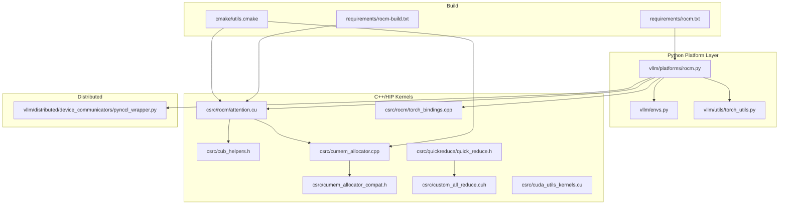
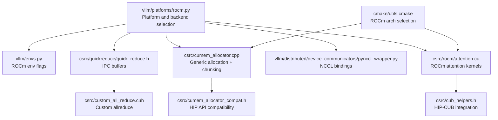
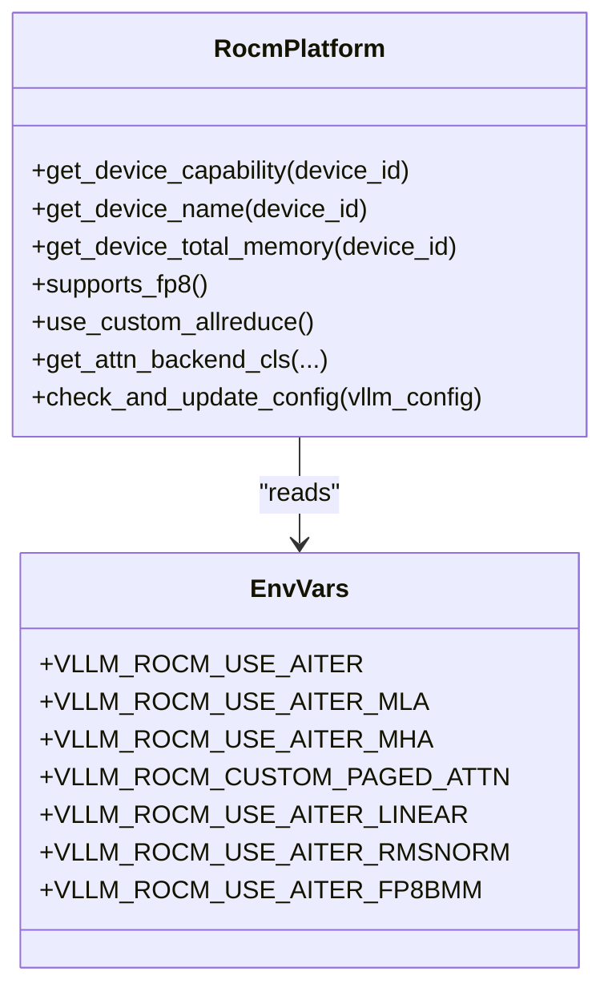
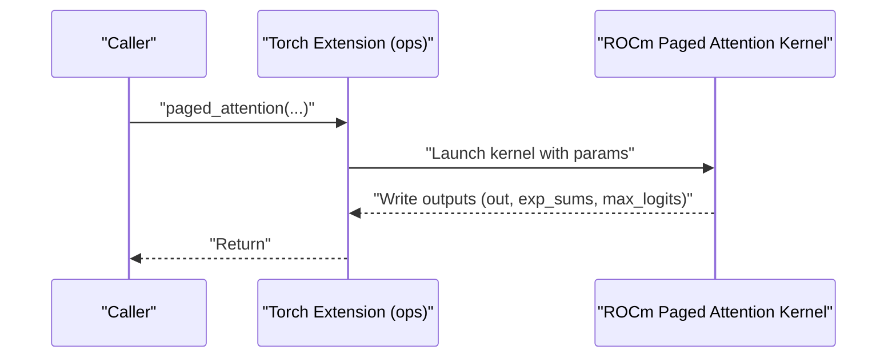
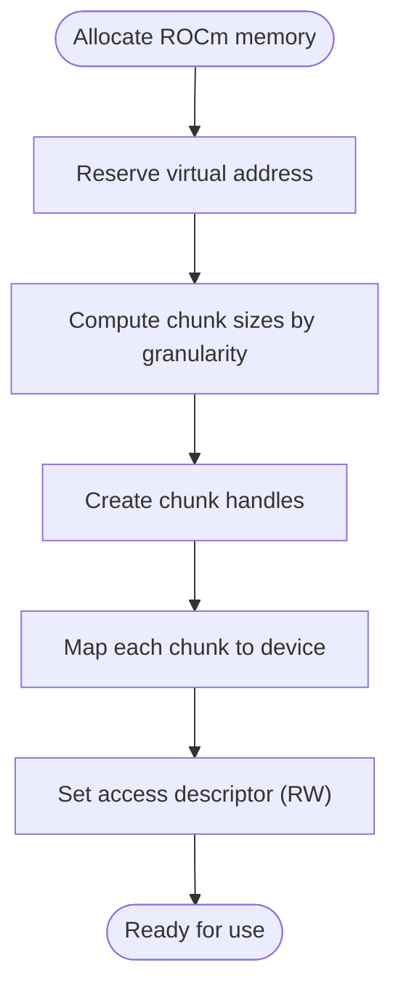
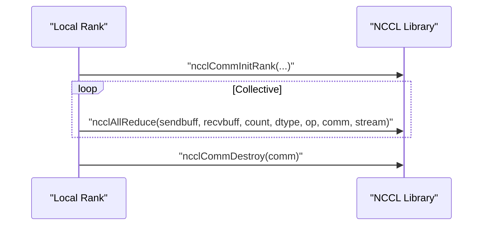
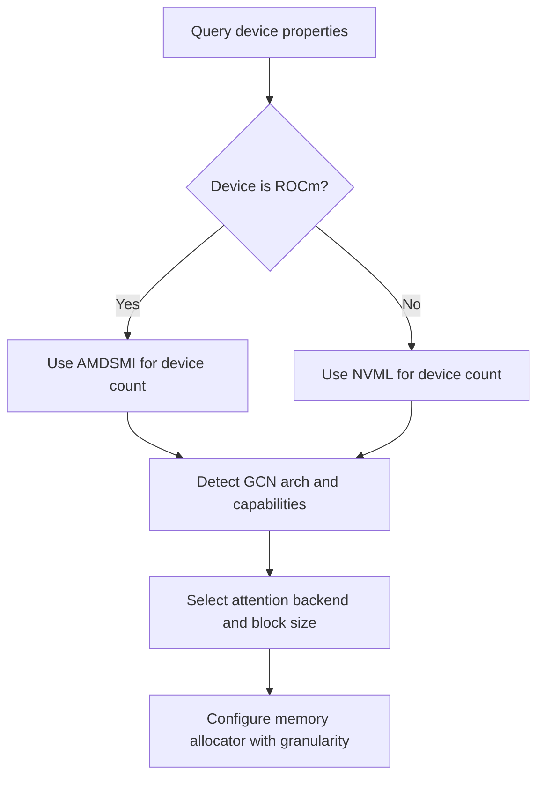
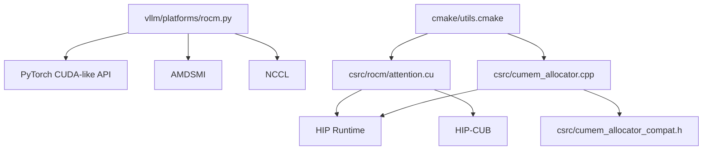

# AMD ROCm Platform

<cite>
**Referenced Files in This Document**
- [vllm/platforms/rocm.py](file://vllm/platforms/rocm.py)
- [vllm/envs.py](file://vllm/envs.py)
- [vllm/utils/torch_utils.py](file://vllm/utils/torch_utils.py)
- [vllm/distributed/device_communicators/pynccl_wrapper.py](file://vllm/distributed/device_communicators/pynccl_wrapper.py)
- [csrc/rocm/attention.cu](file://csrc/rocm/attention.cu)
- [csrc/rocm/torch_bindings.cpp](file://csrc/rocm/torch_bindings.cpp)
- [csrc/cub_helpers.h](file://csrc/cub_helpers.h)
- [csrc/cumem_allocator.cpp](file://csrc/cumem_allocator.cpp)
- [csrc/cumem_allocator_compat.h](file://csrc/cumem_allocator_compat.h)
- [csrc/quickreduce/quick_reduce.h](file://csrc/quickreduce/quick_reduce.h)
- [csrc/custom_all_reduce.cuh](file://csrc/custom_all_reduce.cuh)
- [csrc/cuda_utils_kernels.cu](file://csrc/cuda_utils_kernels.cu)
- [benchmarks/kernels/benchmark_paged_attention.py](file://benchmarks/kernels/benchmark_paged_attention.py)
- [vllm/attention/ops/chunked_prefill_paged_decode.py](file://vllm/attention/ops/chunked_prefill_paged_decode.py)
- [tests/kernels/attention/test_attention.py](file://tests/kernels/attention/test_attention.py)
- [requirements/rocm.txt](file://requirements/rocm.txt)
- [requirements/rocm-build.txt](file://requirements/rocm-build.txt)
- [cmake/utils.cmake](file://cmake/utils.cmake)
</cite>

## Table of Contents
1. [Introduction](#introduction)
2. [Project Structure](#project-structure)
3. [Core Components](#core-components)
4. [Architecture Overview](#architecture-overview)
5. [Detailed Component Analysis](#detailed-component-analysis)
6. [Dependency Analysis](#dependency-analysis)
7. [Performance Considerations](#performance-considerations)
8. [Troubleshooting Guide](#troubleshooting-guide)
9. [Conclusion](#conclusion)
10. [Appendices](#appendices)

## Introduction
This document explains AMD ROCm platform support in vLLM. It covers HIP runtime integration, device capability detection, ROCm-specific attention backends, memory management strategies, distributed communication via NCCL, device enumeration, and environment configuration. Practical guidance is included for ROCm compilation, kernel optimization for AMD GPUs, and troubleshooting.

## Project Structure
The ROCm platform spans Python platform abstraction, environment configuration, ROCm-specific attention kernels, memory allocators, and distributed NCCL bindings. Key areas:
- Platform abstraction and device capability checks
- Environment variables controlling ROCm behavior
- ROCm attention kernels and operator bindings
- Memory allocation and HIP-CUB integration
- Distributed NCCL wrappers and custom allreduce paths
- Build-time ROCm architecture selection

**Diagram sources**
- [vllm/platforms/rocm.py](file://vllm/platforms/rocm.py#L1-L562)
- [vllm/envs.py](file://vllm/envs.py#L448-L800)
- [vllm/utils/torch_utils.py](file://vllm/utils/torch_utils.py#L496-L542)
- [csrc/rocm/attention.cu](file://csrc/rocm/attention.cu#L1-L800)
- [csrc/rocm/torch_bindings.cpp](file://csrc/rocm/torch_bindings.cpp#L1-L58)
- [csrc/cub_helpers.h](file://csrc/cub_helpers.h#L1-L19)
- [csrc/cumem_allocator.cpp](file://csrc/cumem_allocator.cpp#L120-L536)
- [csrc/cumem_allocator_compat.h](file://csrc/cumem_allocator_compat.h#L1-L38)
- [csrc/quickreduce/quick_reduce.h](file://csrc/quickreduce/quick_reduce.h#L120-L162)
- [csrc/custom_all_reduce.cuh](file://csrc/custom_all_reduce.cuh#L484-L516)
- [csrc/cuda_utils_kernels.cu](file://csrc/cuda_utils_kernels.cu#L1-L35)
- [vllm/distributed/device_communicators/pynccl_wrapper.py](file://vllm/distributed/device_communicators/pynccl_wrapper.py#L131-L564)
- [cmake/utils.cmake](file://cmake/utils.cmake#L427-L458)
- [requirements/rocm.txt](file://requirements/rocm.txt#L1-L19)
- [requirements/rocm-build.txt](file://requirements/rocm-build.txt#L1-L18)

**Section sources**
- [vllm/platforms/rocm.py](file://vllm/platforms/rocm.py#L1-L562)
- [vllm/envs.py](file://vllm/envs.py#L448-L800)
- [cmake/utils.cmake](file://cmake/utils.cmake#L427-L458)

## Core Components
- ROCm platform abstraction and backend selection:
  - Device capability checks, device naming, memory queries, and dtype support checks
  - Automatic attention backend selection for ROCm (AITer MLA, Triton, and ROCm-specific backends)
  - Quantization and compilation configuration adjustments for ROCm
- ROCm attention kernels and operators:
  - AMD GFX9/GFX11/GFX12-aware kernels and MFMA intrinsics
  - Custom paged attention operator binding for ROCm
- Memory management:
  - HIP-CUB integration for reductions
  - Generic allocation and mapping with granular chunking for ROCm
  - Compatibility shims for HIP vs CUDA APIs
- Distributed communication:
  - NCCL wrapper for collective operations
  - Custom allreduce IPC buffers for intra-node optimization on supported architectures
- Build and environment:
  - ROCm architecture selection and intersection with supported architectures
  - Environment variables controlling ROCm behavior and attention backends

**Section sources**
- [vllm/platforms/rocm.py](file://vllm/platforms/rocm.py#L161-L562)
- [csrc/rocm/attention.cu](file://csrc/rocm/attention.cu#L1-L800)
- [csrc/rocm/torch_bindings.cpp](file://csrc/rocm/torch_bindings.cpp#L1-L58)
- [csrc/cub_helpers.h](file://csrc/cub_helpers.h#L1-L19)
- [csrc/cumem_allocator.cpp](file://csrc/cumem_allocator.cpp#L120-L536)
- [csrc/cumem_allocator_compat.h](file://csrc/cumem_allocator_compat.h#L1-L38)
- [csrc/quickreduce/quick_reduce.h](file://csrc/quickreduce/quick_reduce.h#L120-L162)
- [csrc/custom_all_reduce.cuh](file://csrc/custom_all_reduce.cuh#L484-L516)
- [vllm/distributed/device_communicators/pynccl_wrapper.py](file://vllm/distributed/device_communicators/pynccl_wrapper.py#L131-L564)
- [cmake/utils.cmake](file://cmake/utils.cmake#L427-L458)
- [vllm/envs.py](file://vllm/envs.py#L448-L800)

## Architecture Overview
The ROCm platform integrates tightly with PyTorch’s CUDA-like device API while leveraging HIP runtime and ROCm libraries. The platform selects attention backends based on device generation and environment flags, compiles ROCm kernels for target architectures, and uses NCCL for inter-device communication. Memory management uses generic allocation with chunking and HIP-CUB for reductions.

**Diagram sources**
- [vllm/platforms/rocm.py](file://vllm/platforms/rocm.py#L161-L562)
- [vllm/envs.py](file://vllm/envs.py#L448-L800)
- [csrc/rocm/attention.cu](file://csrc/rocm/attention.cu#L1-L800)
- [csrc/cub_helpers.h](file://csrc/cub_helpers.h#L1-L19)
- [csrc/cumem_allocator.cpp](file://csrc/cumem_allocator.cpp#L120-L536)
- [csrc/cumem_allocator_compat.h](file://csrc/cumem_allocator_compat.h#L1-L38)
- [csrc/quickreduce/quick_reduce.h](file://csrc/quickreduce/quick_reduce.h#L120-L162)
- [csrc/custom_all_reduce.cuh](file://csrc/custom_all_reduce.cuh#L484-L516)
- [cmake/utils.cmake](file://cmake/utils.cmake#L427-L458)

## Detailed Component Analysis

### ROCm Platform Abstraction and Backend Selection
- Device capability detection:
  - Retrieves compute capability and device name via PyTorch and AMDSMI
  - Determines FP8 support and device generation (gfx9/gfx11/gfx12)
- Attention backend selection:
  - Chooses AIter MLA, Triton, or ROCm-specific backends depending on environment flags and device generation
  - Enforces constraints for sliding window, head sizes, block sizes, and dtype support
- Quantization and compilation:
  - Adjusts block size defaults and enables custom ops for AIter RMSNorm and FP8 linear
  - Validates and enforces environment flags for quantization backends

**Diagram sources**
- [vllm/platforms/rocm.py](file://vllm/platforms/rocm.py#L161-L562)
- [vllm/envs.py](file://vllm/envs.py#L448-L800)

**Section sources**
- [vllm/platforms/rocm.py](file://vllm/platforms/rocm.py#L161-L562)
- [vllm/envs.py](file://vllm/envs.py#L448-L800)

### ROCm Attention Backends and Kernels
- ROCm attention kernels:
  - GFX9/GFX11/GFX12 detection and kernel specialization
  - MFMA intrinsics and vectorized conversions for FP8/FP16/BF16
  - Paged attention kernel with partitioning and shared memory layouts
- Operator bindings:
  - Torch extension exposes paged_attention operator for ROCm
  - Benchmarks and tests exercise ROCm attention path

**Diagram sources**
- [csrc/rocm/torch_bindings.cpp](file://csrc/rocm/torch_bindings.cpp#L1-L58)
- [csrc/rocm/attention.cu](file://csrc/rocm/attention.cu#L320-L800)
- [benchmarks/kernels/benchmark_paged_attention.py](file://benchmarks/kernels/benchmark_paged_attention.py#L113-L154)
- [vllm/attention/ops/chunked_prefill_paged_decode.py](file://vllm/attention/ops/chunked_prefill_paged_decode.py#L334-L376)
- [tests/kernels/attention/test_attention.py](file://tests/kernels/attention/test_attention.py#L245-L331)

**Section sources**
- [csrc/rocm/attention.cu](file://csrc/rocm/attention.cu#L1-L800)
- [csrc/rocm/torch_bindings.cpp](file://csrc/rocm/torch_bindings.cpp#L1-L58)
- [benchmarks/kernels/benchmark_paged_attention.py](file://benchmarks/kernels/benchmark_paged_attention.py#L113-L154)
- [vllm/attention/ops/chunked_prefill_paged_decode.py](file://vllm/attention/ops/chunked_prefill_paged_decode.py#L334-L376)
- [tests/kernels/attention/test_attention.py](file://tests/kernels/attention/test_attention.py#L245-L331)

### Memory Management and HIP-CUB Integration
- HIP-CUB integration:
  - Uses hipcub for reductions and max operations in ROCm builds
- Generic allocation and mapping:
  - Allocates pinned device memory, maps in chunks respecting granularity
  - Supports chunk sizing controlled by environment variable
- Compatibility shims:
  - Provides HIP-compatible typedefs and error handling macros for CUDA-style code

**Diagram sources**
- [csrc/cub_helpers.h](file://csrc/cub_helpers.h#L1-L19)
- [csrc/cumem_allocator.cpp](file://csrc/cumem_allocator.cpp#L120-L536)
- [csrc/cumem_allocator_compat.h](file://csrc/cumem_allocator_compat.h#L1-L38)
- [vllm/envs.py](file://vllm/envs.py#L555-L558)

**Section sources**
- [csrc/cub_helpers.h](file://csrc/cub_helpers.h#L1-L19)
- [csrc/cumem_allocator.cpp](file://csrc/cumem_allocator.cpp#L120-L536)
- [csrc/cumem_allocator_compat.h](file://csrc/cumem_allocator_compat.h#L1-L38)
- [vllm/envs.py](file://vllm/envs.py#L555-L558)

### Distributed Communication via NCCL
- NCCL bindings:
  - ctypes wrapper for NCCL functions (init, allreduce, broadcast, group ops)
- Custom allreduce:
  - IPC handle-based buffers for intra-node allreduce on supported architectures
  - Registration and graph buffer handling for CUDA graphs

**Diagram sources**
- [vllm/distributed/device_communicators/pynccl_wrapper.py](file://vllm/distributed/device_communicators/pynccl_wrapper.py#L131-L564)
- [csrc/custom_all_reduce.cuh](file://csrc/custom_all_reduce.cuh#L484-L516)
- [csrc/quickreduce/quick_reduce.h](file://csrc/quickreduce/quick_reduce.h#L120-L162)

**Section sources**
- [vllm/distributed/device_communicators/pynccl_wrapper.py](file://vllm/distributed/device_communicators/pynccl_wrapper.py#L131-L564)
- [csrc/custom_all_reduce.cuh](file://csrc/custom_all_reduce.cuh#L484-L516)
- [csrc/quickreduce/quick_reduce.h](file://csrc/quickreduce/quick_reduce.h#L120-L162)

### Device Enumeration, Capability Checking, and Memory Allocation Strategies
- Device enumeration:
  - Uses AMDSMI for stateless device count on ROCm; falls back to CUDA device count
- Capability checks:
  - Device capability and FP8/FNuz dtype detection based on GCN architecture
  - Shared memory attribute handling for ROCm vs CUDA
- Memory allocation:
  - Granularity-aware chunking and aligned mapping
  - Environment-controlled chunk size for sleeping memory

**Diagram sources**
- [vllm/utils/torch_utils.py](file://vllm/utils/torch_utils.py#L496-L542)
- [vllm/platforms/rocm.py](file://vllm/platforms/rocm.py#L337-L562)
- [csrc/cuda_utils_kernels.cu](file://csrc/cuda_utils_kernels.cu#L1-L35)
- [csrc/cumem_allocator.cpp](file://csrc/cumem_allocator.cpp#L286-L351)

**Section sources**
- [vllm/utils/torch_utils.py](file://vllm/utils/torch_utils.py#L496-L542)
- [vllm/platforms/rocm.py](file://vllm/platforms/rocm.py#L337-L562)
- [csrc/cuda_utils_kernels.cu](file://csrc/cuda_utils_kernels.cu#L1-L35)
- [csrc/cumem_allocator.cpp](file://csrc/cumem_allocator.cpp#L286-L351)

### Configuration Examples for ROCm
- Environment variables:
  - VLLM_TARGET_DEVICE=rocm
  - VLLM_ROCM_USE_AITER=1, VLLM_ROCM_USE_AITER_MLA=1, VLLM_ROCM_USE_AITER_MHA=1
  - VLLM_ROCM_CUSTOM_PAGED_ATTN=1
  - VLLM_ROCM_USE_AITER_LINEAR=1, VLLM_ROCM_USE_AITER_RMSNORM=1, VLLM_ROCM_USE_AITER_FP8BMM=1
  - VLLM_ROCM_SLEEP_MEM_CHUNK_SIZE=<MB>
- Device selection:
  - CUDA_VISIBLE_DEVICES controls device visibility; ROCm mirrors CUDA semantics
- Performance tuning:
  - Adjust block size and attention backend via environment flags
  - Enable AIter custom ops for RMSNorm and FP8 linear when using full CUDA graphs

**Section sources**
- [vllm/envs.py](file://vllm/envs.py#L448-L800)
- [vllm/platforms/rocm.py](file://vllm/platforms/rocm.py#L388-L461)

### ROCm-Specific Compilation Requirements and Kernel Optimization
- Build-time ROCm architecture selection:
  - Intersects detected HIP architectures with supported list and sets offload arch flags
- Kernel optimization:
  - GFX9/GFX11/GFX12 specialization with MFMA intrinsics
  - Vectorized FP8/BF16 conversions and partitioned softmax
- Dependencies:
  - ROCm build requirements include specific PyTorch and ROCm packages

**Section sources**
- [cmake/utils.cmake](file://cmake/utils.cmake#L427-L458)
- [csrc/rocm/attention.cu](file://csrc/rocm/attention.cu#L1-L800)
- [requirements/rocm-build.txt](file://requirements/rocm-build.txt#L1-L18)

## Dependency Analysis
ROCm platform components depend on:
- PyTorch CUDA-like device API for device queries and streams
- AMDSMI for device enumeration and topology on ROCm
- HIP runtime and HIP-CUB for device-side primitives
- NCCL for multi-rank communication
- CMake for ROCm architecture targeting

**Diagram sources**
- [vllm/platforms/rocm.py](file://vllm/platforms/rocm.py#L1-L562)
- [csrc/rocm/attention.cu](file://csrc/rocm/attention.cu#L1-L800)
- [csrc/cub_helpers.h](file://csrc/cub_helpers.h#L1-L19)
- [csrc/cumem_allocator.cpp](file://csrc/cumem_allocator.cpp#L120-L536)
- [csrc/cumem_allocator_compat.h](file://csrc/cumem_allocator_compat.h#L1-L38)
- [cmake/utils.cmake](file://cmake/utils.cmake#L427-L458)

**Section sources**
- [vllm/platforms/rocm.py](file://vllm/platforms/rocm.py#L1-L562)
- [csrc/rocm/attention.cu](file://csrc/rocm/attention.cu#L1-L800)
- [csrc/cub_helpers.h](file://csrc/cub_helpers.h#L1-L19)
- [csrc/cumem_allocator.cpp](file://csrc/cumem_allocator.cpp#L120-L536)
- [csrc/cumem_allocator_compat.h](file://csrc/cumem_allocator_compat.h#L1-L38)
- [cmake/utils.cmake](file://cmake/utils.cmake#L427-L458)

## Performance Considerations
- Attention backend selection:
  - Prefer AIter MLA on GFX9; unified attention on GFX11/GFX12 when constraints allow
  - Use ROCm custom paged attention when enabled and supported
- Memory allocation:
  - Tune VLLM_ROCM_SLEEP_MEM_CHUNK_SIZE for large allocations to reduce fragmentation
  - Ensure alignment with device granularity to minimize mapping overhead
- Quantization:
  - FP8 support varies by architecture; select appropriate dtype and backend
- Compilation:
  - Full CUDA graphs pair well with AIter RMSNorm and FP8 linear custom ops

[No sources needed since this section provides general guidance]

## Troubleshooting Guide
Common issues and remedies:
- Backend selection errors:
  - Ensure environment flags match device generation (gfx9 vs gfx11/gfx12)
  - Verify constraints for sliding window, head size, block size, and dtype
- Memory allocation failures:
  - Check VLLM_ROCM_SLEEP_MEM_CHUNK_SIZE and device granularity
  - Confirm sufficient device memory and adjust batch/block sizes
- NCCL communication problems:
  - Validate NCCL library path and environment
  - Confirm ranks and device visibility via CUDA_VISIBLE_DEVICES
- Device capability mismatches:
  - BF16 requires compute capability ≥ 8.0; fall back to FP16 if unsupported

**Section sources**
- [vllm/platforms/rocm.py](file://vllm/platforms/rocm.py#L388-L562)
- [vllm/envs.py](file://vllm/envs.py#L448-L800)
- [vllm/distributed/device_communicators/pynccl_wrapper.py](file://vllm/distributed/device_communicators/pynccl_wrapper.py#L131-L564)

## Conclusion
vLLM’s ROCm support integrates HIP runtime, AMDSMI, and ROCm-specific kernels to deliver efficient attention and memory management. Backend selection adapts to device generation and environment flags, while NCCL enables scalable distributed inference. Proper configuration of environment variables and build-time ROCm architecture selection ensures optimal performance on AMD GPUs.

[No sources needed since this section summarizes without analyzing specific files]

## Appendices
- ROCm build dependencies:
  - See [requirements/rocm-build.txt](file://requirements/rocm-build.txt#L1-L18)
- Common ROCm runtime dependencies:
  - See [requirements/rocm.txt](file://requirements/rocm.txt#L1-L19)

**Section sources**
- [requirements/rocm-build.txt](file://requirements/rocm-build.txt#L1-L18)
- [requirements/rocm.txt](file://requirements/rocm.txt#L1-L19)