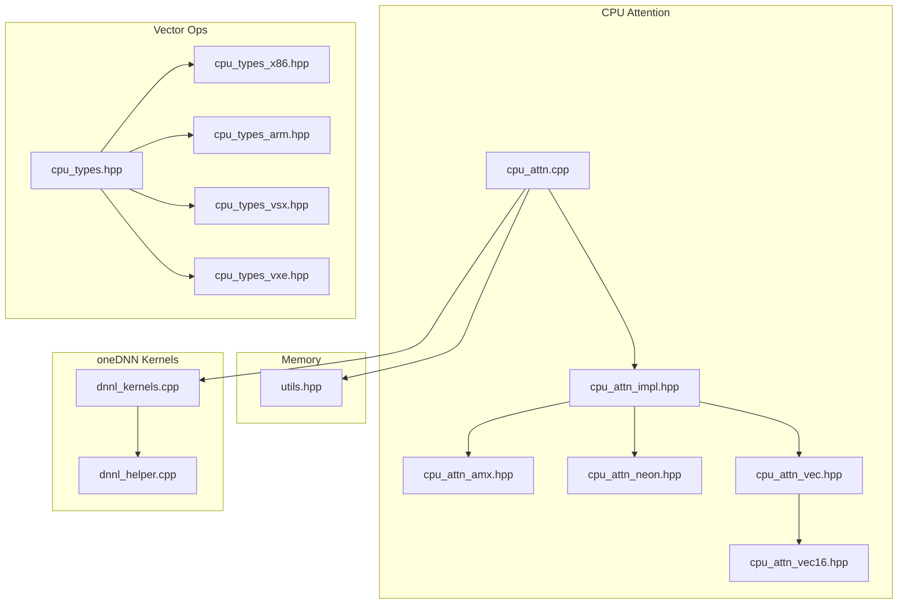
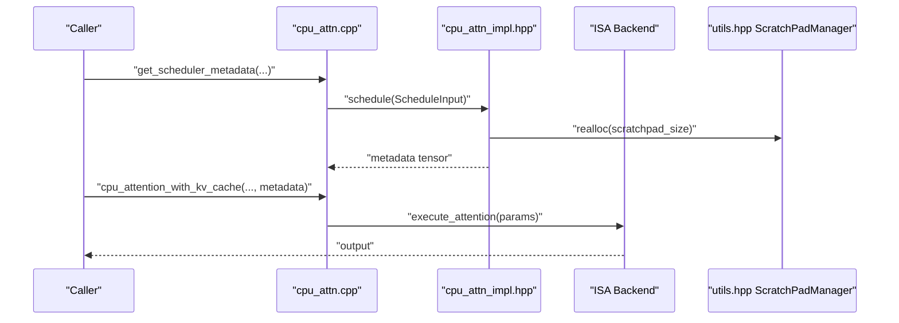
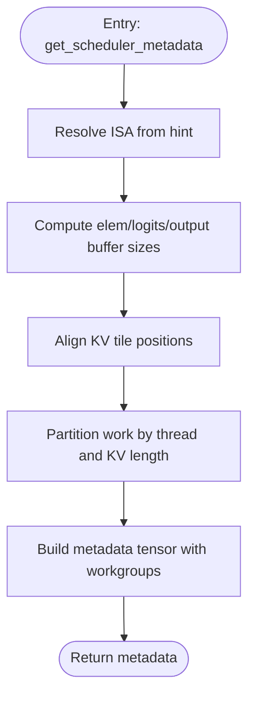
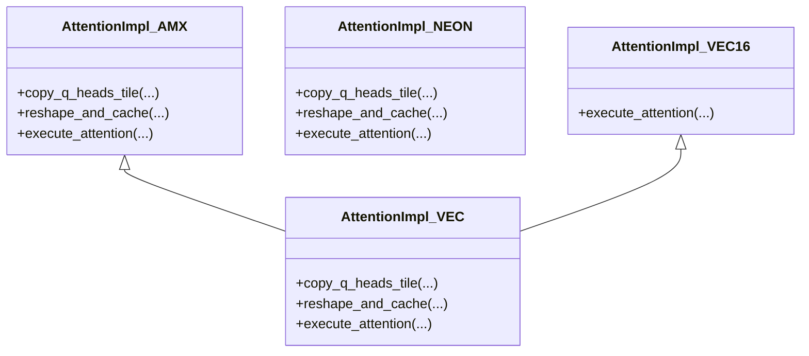
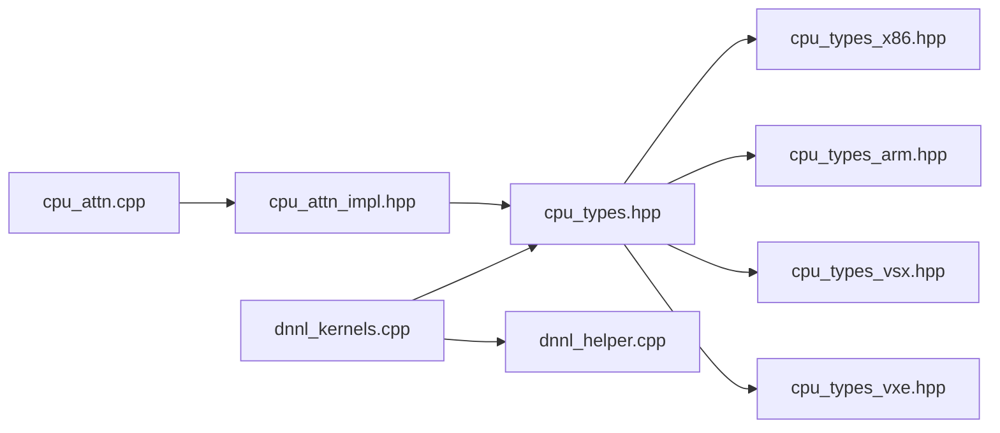

# CPU Platform

<cite>
**Referenced Files in This Document**
- [cpu_attn.cpp](file://csrc/cpu/cpu_attn.cpp)
- [cpu_attn_impl.hpp](file://csrc/cpu/cpu_attn_impl.hpp)
- [cpu_attn_amx.hpp](file://csrc/cpu/cpu_attn_amx.hpp)
- [cpu_attn_neon.hpp](file://csrc/cpu/cpu_attn_neon.hpp)
- [cpu_attn_vec.hpp](file://csrc/cpu/cpu_attn_vec.hpp)
- [cpu_attn_vec16.hpp](file://csrc/cpu/cpu_attn_vec16.hpp)
- [cpu_types.hpp](file://csrc/cpu/cpu_types.hpp)
- [cpu_types_x86.hpp](file://csrc/cpu/cpu_types_x86.hpp)
- [cpu_types_arm.hpp](file://csrc/cpu/cpu_types_arm.hpp)
- [cpu_types_vsx.hpp](file://csrc/cpu/cpu_types_vsx.hpp)
- [cpu_types_vxe.hpp](file://csrc/cpu/cpu_types_vxe.hpp)
- [utils.hpp](file://csrc/cpu/utils.hpp)
- [dnnl_helper.cpp](file://csrc/cpu/dnnl_helper.cpp)
- [dnnl_kernels.cpp](file://csrc/cpu/dnnl_kernels.cpp)
- [cpu_fused_moe.cpp](file://csrc/cpu/cpu_fused_moe.cpp)
- [requirements/cpu.txt](file://requirements/cpu.txt)
- [requirements/cpu-build.txt](file://requirements/cpu-build.txt)
- [cmake/cpu_extension.cmake](file://cmake/cpu_extension.cmake)
- [cmake/utils.cmake](file://cmake/utils.cmake)
</cite>

## Table of Contents
1. [Introduction](#introduction)
2. [Project Structure](#project-structure)
3. [Core Components](#core-components)
4. [Architecture Overview](#architecture-overview)
5. [Detailed Component Analysis](#detailed-component-analysis)
6. [Dependency Analysis](#dependency-analysis)
7. [Performance Considerations](#performance-considerations)
8. [Troubleshooting Guide](#troubleshooting-guide)
9. [Conclusion](#conclusion)
10. [Appendices](#appendices)

## Introduction
This document explains CPU platform support in vLLM, focusing on multi-threading, SIMD/vectorization, and CPU-specific attention implementations. It covers attention backends (ISA dispatch, scheduling, and execution), memory management via a scratchpad allocator, and performance optimizations across major CPU architectures (x86, ARM, POWER/VSX, S390X). It also documents CPU device capability detection, thread affinity considerations, compilation requirements, and practical configuration and tuning guidance.

## Project Structure
The CPU platform implementation resides primarily under csrc/cpu, with attention kernels, vector operation abstractions, and oneDNN-backed kernels. Key areas:
- Attention: dispatcher, scheduler, and architecture-specific kernels (AMX, NEON, generic vector).
- Vector ops: architecture-specific vector types and operations (x86 AVX/AVX512, ARM NEON, POWER VSX, S390X vector).
- Memory: scratchpad manager for attention and quantized matmul workspaces.
- oneDNN: reusable primitives for quantized matmul and packing.

**Diagram sources**
- [cpu_attn.cpp](file://csrc/cpu/cpu_attn.cpp#L1-L266)
- [cpu_attn_impl.hpp](file://csrc/cpu/cpu_attn_impl.hpp#L1-L200)
- [cpu_attn_amx.hpp](file://csrc/cpu/cpu_attn_amx.hpp#L1-L120)
- [cpu_attn_neon.hpp](file://csrc/cpu/cpu_attn_neon.hpp#L1-L120)
- [cpu_attn_vec.hpp](file://csrc/cpu/cpu_attn_vec.hpp#L1-L120)
- [cpu_attn_vec16.hpp](file://csrc/cpu/cpu_attn_vec16.hpp#L1-L120)
- [cpu_types.hpp](file://csrc/cpu/cpu_types.hpp#L1-L25)
- [cpu_types_x86.hpp](file://csrc/cpu/cpu_types_x86.hpp#L1-L120)
- [cpu_types_arm.hpp](file://csrc/cpu/cpu_types_arm.hpp#L1-L120)
- [cpu_types_vsx.hpp](file://csrc/cpu/cpu_types_vsx.hpp#L1-L120)
- [cpu_types_vxe.hpp](file://csrc/cpu/cpu_types_vxe.hpp#L1-L120)
- [utils.hpp](file://csrc/cpu/utils.hpp#L1-L119)
- [dnnl_helper.cpp](file://csrc/cpu/dnnl_helper.cpp#L1-L120)
- [dnnl_kernels.cpp](file://csrc/cpu/dnnl_kernels.cpp#L1-L120)

**Section sources**
- [cpu_attn.cpp](file://csrc/cpu/cpu_attn.cpp#L1-L266)
- [cpu_attn_impl.hpp](file://csrc/cpu/cpu_attn_impl.hpp#L1-L200)
- [cpu_types.hpp](file://csrc/cpu/cpu_types.hpp#L1-L25)

## Core Components
- Attention dispatcher and scheduler: select ISA/backend, compute tile sizes, and schedule work across threads.
- Architecture-specific attention kernels: AMX (Intel), NEON (ARM), and vectorized kernels (x86, POWER, S390X).
- Vector operation abstractions: architecture-specific vector types and arithmetic for conversion, scaling, reductions, and stores.
- Memory management: scratchpad allocator sized from L2 cache hints and reused across kernels.
- oneDNN-backed kernels: quantized matmul and packing for performance and compatibility.

**Section sources**
- [cpu_attn.cpp](file://csrc/cpu/cpu_attn.cpp#L1-L266)
- [cpu_attn_impl.hpp](file://csrc/cpu/cpu_attn_impl.hpp#L1-L200)
- [cpu_types_x86.hpp](file://csrc/cpu/cpu_types_x86.hpp#L1-L120)
- [cpu_types_arm.hpp](file://csrc/cpu/cpu_types_arm.hpp#L1-L120)
- [cpu_types_vsx.hpp](file://csrc/cpu/cpu_types_vsx.hpp#L1-L120)
- [cpu_types_vxe.hpp](file://csrc/cpu/cpu_types_vxe.hpp#L1-L120)
- [utils.hpp](file://csrc/cpu/utils.hpp#L1-L119)
- [dnnl_helper.cpp](file://csrc/cpu/dnnl_helper.cpp#L1-L120)
- [dnnl_kernels.cpp](file://csrc/cpu/dnnl_kernels.cpp#L1-L120)

## Architecture Overview
The CPU attention pipeline:
- Input tensors are validated and metadata computed (head dim, dtypes, strides).
- Scheduler determines tile sizes and thread assignment based on available L2 cache and requested head counts.
- Per-thread scratchpad memory is allocated and sized to fit intermediate buffers (Q, logits, partial outputs).
- Attention execution dispatches to the selected ISA backend (AMX, NEON, or vectorized), performing tiled GEMMs and reductions.
- KV-cache reshaping is performed in a vectorized manner per architecture.

**Diagram sources**
- [cpu_attn.cpp](file://csrc/cpu/cpu_attn.cpp#L75-L138)
- [cpu_attn_impl.hpp](file://csrc/cpu/cpu_attn_impl.hpp#L355-L676)
- [utils.hpp](file://csrc/cpu/utils.hpp#L93-L119)

## Detailed Component Analysis

### Attention Dispatcher and Scheduler
- Dispatcher validates shapes and dtypes, resolves ISA hint, and computes buffer sizes per ISA backend.
- Scheduler computes tile sizes using L2 cache hints, aligns KV lengths, and partitions work among OpenMP threads. It builds a metadata tensor describing work-item groups and reduction items, plus per-thread offsets and buffer sizes.

**Diagram sources**
- [cpu_attn.cpp](file://csrc/cpu/cpu_attn.cpp#L75-L138)
- [cpu_attn_impl.hpp](file://csrc/cpu/cpu_attn_impl.hpp#L355-L676)

**Section sources**
- [cpu_attn.cpp](file://csrc/cpu/cpu_attn.cpp#L75-L138)
- [cpu_attn_impl.hpp](file://csrc/cpu/cpu_attn_impl.hpp#L355-L676)

### CPU Attention Backends
- AMX (Intel): Uses 2-2-4 and 1-2-2 tiling patterns with tile config and DPBF16 dot products for BF16. Reshapes KV caches to tile-friendly layouts and uses vectorized loads/stores.
- NEON (ARM): Implements a vectorized GEMM microkernel with 8-wide loads and FMA sequences, supporting Mx8 tiles and per-architecture BF16 handling.
- Vectorized (x86/POWER/S390X): Provides 8-2-16 and 16-1-16 micro-kernels using vector types (FP32Vec8/16, BF16Vec8/16/32, INT8Vec16/64) and unrolled loops.

**Diagram sources**
- [cpu_attn_amx.hpp](file://csrc/cpu/cpu_attn_amx.hpp#L307-L510)
- [cpu_attn_neon.hpp](file://csrc/cpu/cpu_attn_neon.hpp#L247-L383)
- [cpu_attn_vec.hpp](file://csrc/cpu/cpu_attn_vec.hpp#L114-L246)
- [cpu_attn_vec16.hpp](file://csrc/cpu/cpu_attn_vec16.hpp#L118-L169)

**Section sources**
- [cpu_attn_amx.hpp](file://csrc/cpu/cpu_attn_amx.hpp#L1-L120)
- [cpu_attn_neon.hpp](file://csrc/cpu/cpu_attn_neon.hpp#L1-L120)
- [cpu_attn_vec.hpp](file://csrc/cpu/cpu_attn_vec.hpp#L1-L120)
- [cpu_attn_vec16.hpp](file://csrc/cpu/cpu_attn_vec16.hpp#L1-L120)

### Vector Operation Abstractions
- x86: AVX/AVX2/AVX512-based vector types (FP32Vec8/16, BF16Vec8/16/32, FP16Vec8/16, INT8Vec16/64), FMA intrinsics, non-temporal stores, and conversions.
- ARM: NEON-based vector types (FP32Vec8/16, BF16Vec8/16/32 when supported), conversions, reductions, and masked stores.
- POWER (VSX): Vector types and operations leveraging vector extensions, including BF16 conversions and masked stores.
- S390X (VXE): Vector types and optimized FMA variants using vector instructions, plus BF16 conversions and masked stores.

**Section sources**
- [cpu_types_x86.hpp](file://csrc/cpu/cpu_types_x86.hpp#L1-L200)
- [cpu_types_arm.hpp](file://csrc/cpu/cpu_types_arm.hpp#L1-L200)
- [cpu_types_vsx.hpp](file://csrc/cpu/cpu_types_vsx.hpp#L1-L200)
- [cpu_types_vxe.hpp](file://csrc/cpu/cpu_types_vxe.hpp#L1-L200)

### Memory Management and Scratchpad
- L2 cache size is queried and halved for working set sizing.
- A global scratchpad manager allocates aligned buffers sized per thread and per reduction head, with rounding to allocation units.
- Attention kernels allocate per-thread buffers for Q tiles, logits, partial outputs, and reduction flags/max/sum arrays.

**Section sources**
- [utils.hpp](file://csrc/cpu/utils.hpp#L56-L119)
- [cpu_attn_impl.hpp](file://csrc/cpu/cpu_attn_impl.hpp#L180-L354)

### oneDNN Kernels and Quantization
- oneDNN matmul handlers prepack weights and reuse primitives across sizes, with user-specified scratchpad storage.
- Quantized matmul supports per-tensor/per-channel scales and optional zero points; dynamic per-token quantization applies scales/zps in a post-epilogue stage.
- Static and dynamic quantization paths for activations are provided.

**Section sources**
- [dnnl_helper.cpp](file://csrc/cpu/dnnl_helper.cpp#L1-L120)
- [dnnl_kernels.cpp](file://csrc/cpu/dnnl_kernels.cpp#L1-L120)

### Multi-threading and Affinity
- OpenMP controls parallelism for attention reshaping and quantization kernels.
- Thread-local scratchpad buffers are indexed by thread id; scheduling distributes KV-length workload across threads.
- No explicit thread affinity is enforced in the code reviewed; affinity can be controlled externally via environment or process settings.

**Section sources**
- [cpu_attn_vec.hpp](file://csrc/cpu/cpu_attn_vec.hpp#L206-L244)
- [cpu_attn_neon.hpp](file://csrc/cpu/cpu_attn_neon.hpp#L344-L382)
- [cpu_attn_impl.hpp](file://csrc/cpu/cpu_attn_impl.hpp#L380-L420)

## Dependency Analysis
- cpu_attn.cpp depends on cpu_attn_impl.hpp and includes architecture-specific headers for dispatch.
- cpu_attn_impl.hpp depends on cpu_types.hpp and cpu_utils.hpp for vector ops and cache hints.
- Vector op headers are selected by cpu_types.hpp based on compiler macros (__x86_64__, __aarch64__, __POWER9_VECTOR__, __s390x__).
- dnnl_kernels.cpp depends on dnnl_helper.cpp and cpu_types.hpp for data type conversions and vectorization.

**Diagram sources**
- [cpu_attn.cpp](file://csrc/cpu/cpu_attn.cpp#L1-L20)
- [cpu_attn_impl.hpp](file://csrc/cpu/cpu_attn_impl.hpp#L1-L40)
- [cpu_types.hpp](file://csrc/cpu/cpu_types.hpp#L1-L25)
- [cpu_types_x86.hpp](file://csrc/cpu/cpu_types_x86.hpp#L1-L40)
- [cpu_types_arm.hpp](file://csrc/cpu/cpu_types_arm.hpp#L1-L40)
- [cpu_types_vsx.hpp](file://csrc/cpu/cpu_types_vsx.hpp#L1-L40)
- [cpu_types_vxe.hpp](file://csrc/cpu/cpu_types_vxe.hpp#L1-L40)
- [dnnl_kernels.cpp](file://csrc/cpu/dnnl_kernels.cpp#L1-L40)
- [dnnl_helper.cpp](file://csrc/cpu/dnnl_helper.cpp#L1-L40)

**Section sources**
- [cpu_attn.cpp](file://csrc/cpu/cpu_attn.cpp#L1-L20)
- [cpu_attn_impl.hpp](file://csrc/cpu/cpu_attn_impl.hpp#L1-L40)
- [cpu_types.hpp](file://csrc/cpu/cpu_types.hpp#L1-L25)

## Performance Considerations
- ISA selection: Prefer AMX on supported Intel CPUs for BF16 attention; otherwise choose NEON on ARM or vectorized kernels on x86/POWER/S390X.
- Tile sizing: Scheduler uses L2 cache hints to maximize occupancy; ensure head dimensions and block sizes align to backend-specific alignments for best performance.
- Vectorization: Use vectorized kernels to exploit wider registers and reduce memory bandwidth pressure; ensure data layouts match backend expectations (reshaping routines handle this).
- oneDNN: Reuse prepacked weights and user-specified scratchpad to minimize allocations and improve cache locality.
- Quantization: Dynamic per-token quantization incurs post-processing cost; per-tensor quantization reduces overhead.

[No sources needed since this section provides general guidance]

## Troubleshooting Guide
- Invalid ISA hint or unsupported head dimension: The dispatcher checks and raises errors for invalid configurations.
- Out-of-bound accesses: The scheduler computes strict alignments and tile boundaries; mismatches cause assertion failures.
- oneDNN primitive cache misses: Adjust cache sizes for repeated shapes to reduce primitive creation overhead.
- Memory exhaustion: Increase L2 cache fraction or reduce batch/workloads; verify scratchpad reallocation succeeds.

**Section sources**
- [cpu_attn.cpp](file://csrc/cpu/cpu_attn.cpp#L40-L90)
- [cpu_attn_impl.hpp](file://csrc/cpu/cpu_attn_impl.hpp#L380-L420)
- [dnnl_helper.cpp](file://csrc/cpu/dnnl_helper.cpp#L1-L120)

## Conclusion
vLLM’s CPU platform integrates architecture-aware attention backends, vectorized computation, and efficient memory management. The dispatcher and scheduler adapt to CPU capabilities and cache hierarchy, while oneDNN accelerates quantized operations. Proper configuration of ISA hints, thread counts, and memory sizing yields significant performance across x86, ARM, POWER, and S390X targets.

[No sources needed since this section summarizes without analyzing specific files]

## Appendices

### CPU Device Capability Detection and Compilation
- Capability detection: The build selects architecture-specific vector op headers via compiler macros and asserts minimum instruction sets (e.g., AVX2 on x86).
- oneDNN: Optional ACL backend is conditionally compiled; otherwise standard oneDNN is used.
- Build requirements: CPU-specific requirements and build flags are declared in requirements and CMake files.

**Section sources**
- [cpu_types.hpp](file://csrc/cpu/cpu_types.hpp#L1-L25)
- [cpu_types_x86.hpp](file://csrc/cpu/cpu_types_x86.hpp#L1-L20)
- [requirements/cpu.txt](file://requirements/cpu.txt#L1-L100)
- [requirements/cpu-build.txt](file://requirements/cpu-build.txt#L1-L100)
- [cmake/cpu_extension.cmake](file://cmake/cpu_extension.cmake#L1-L120)
- [cmake/utils.cmake](file://cmake/utils.cmake#L1-L120)

### Practical Configuration Examples
- Attention ISA selection: Pass an ISA hint to the dispatcher to force AMX/NEON/VEC/VEC16.
- Thread management: Control OpenMP threads via environment variables or process settings; ensure thread count matches physical cores for optimal locality.
- NUMA awareness: Bind processes to NUMA nodes and set memory policies externally; vLLM relies on system-level controls.
- Memory profiling: Monitor attention scratchpad usage via metadata counters and adjust batch sizes/head dimensions accordingly.

**Section sources**
- [cpu_attn.cpp](file://csrc/cpu/cpu_attn.cpp#L75-L138)
- [cpu_attn_impl.hpp](file://csrc/cpu/cpu_attn_impl.hpp#L110-L178)
- [utils.hpp](file://csrc/cpu/utils.hpp#L56-L119)