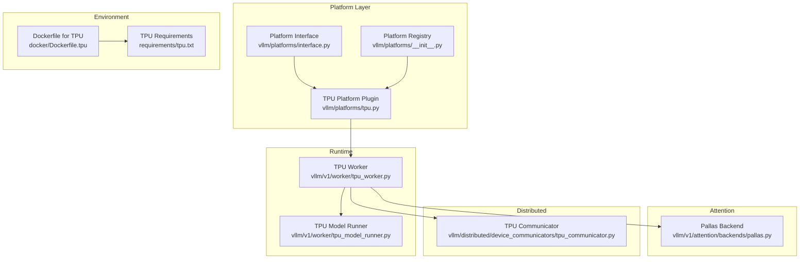
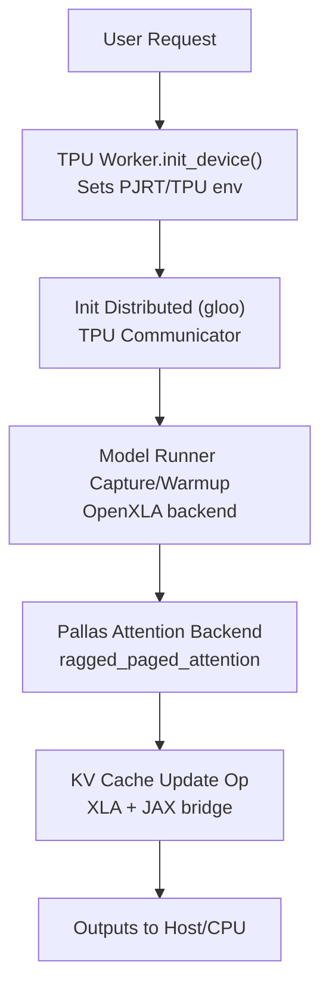
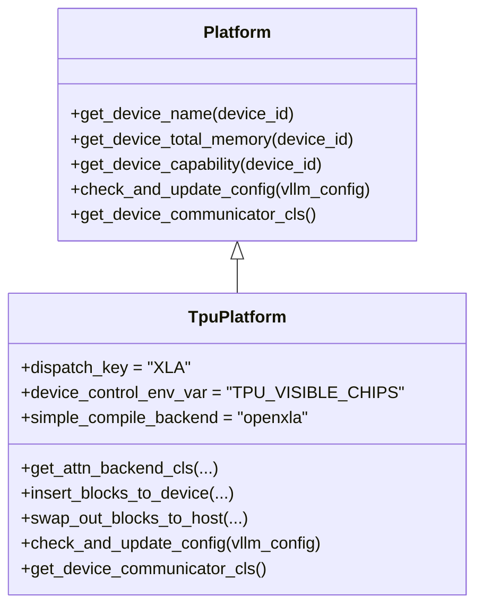
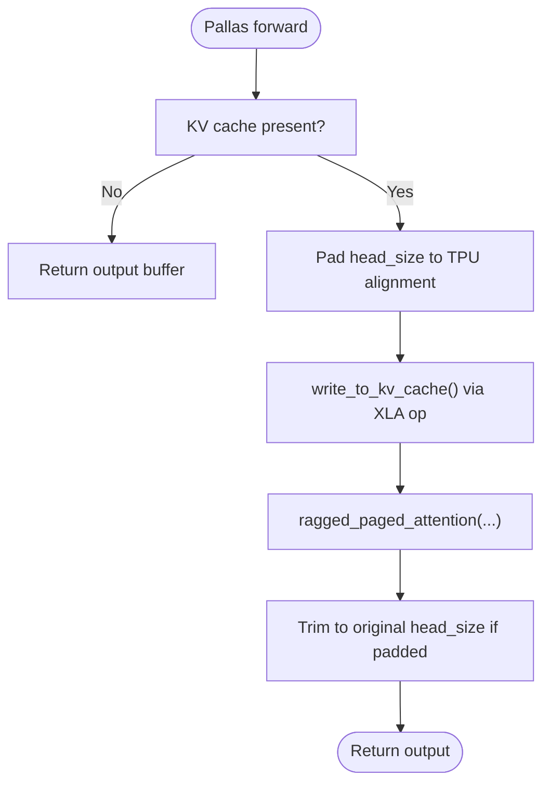
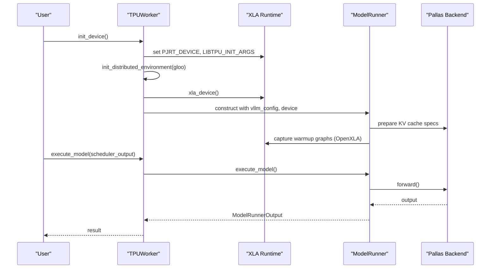
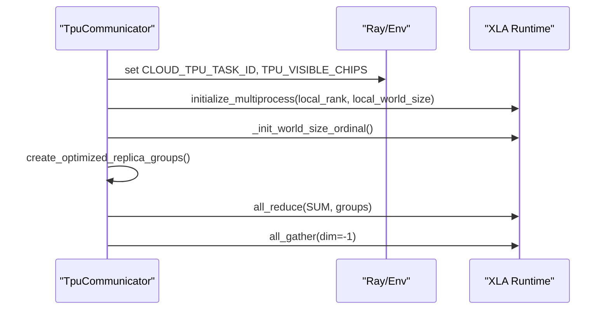
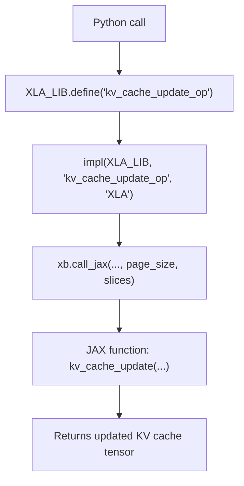
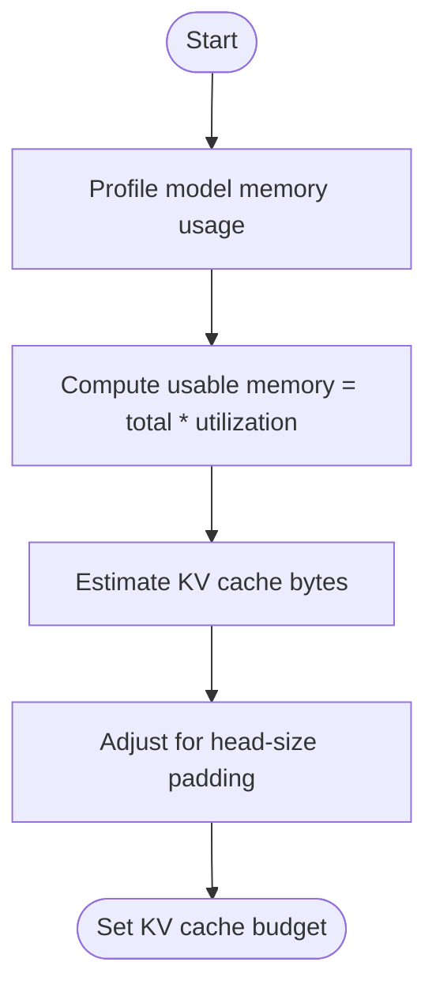
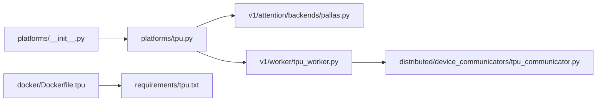

# Google TPU Platform

<cite>
**Referenced Files in This Document**
- [vllm/platforms/tpu.py](file://vllm/platforms/tpu.py)
- [vllm/platforms/interface.py](file://vllm/platforms/interface.py)
- [vllm/platforms/__init__.py](file://vllm/platforms/__init__.py)
- [vllm/v1/attention/backends/pallas.py](file://vllm/v1/attention/backends/pallas.py)
- [vllm/v1/worker/tpu_worker.py](file://vllm/v1/worker/tpu_worker.py)
- [vllm/distributed/device_communicators/tpu_communicator.py](file://vllm/distributed/device_communicators/tpu_communicator.py)
- [docker/Dockerfile.tpu](file://docker/Dockerfile.tpu)
- [requirements/tpu.txt](file://requirements/tpu.txt)
</cite>

## Table of Contents
1. [Introduction](#introduction)
2. [Project Structure](#project-structure)
3. [Core Components](#core-components)
4. [Architecture Overview](#architecture-overview)
5. [Detailed Component Analysis](#detailed-component-analysis)
6. [Dependency Analysis](#dependency-analysis)
7. [Performance Considerations](#performance-considerations)
8. [Troubleshooting Guide](#troubleshooting-guide)
9. [Conclusion](#conclusion)
10. [Appendices](#appendices)

## Introduction
This document explains Google TPU platform support in vLLM. It covers how vLLM detects and configures TPU devices, integrates with JAX/Flax via PyTorch/XLA, selects and optimizes attention backends for TPU, manages memory across host-device boundaries, and coordinates distributed communication on TPUs. It also documents environment variables, device selection, compilation backends, and performance tuning parameters for TPU deployments.

## Project Structure
TPU support in vLLM is implemented primarily through:
- A platform plugin that identifies and configures TPU environments
- An attention backend tailored for TPU (Pallas)
- A TPU worker and model runner that orchestrate device initialization, compilation, and execution
- A TPU-aware device communicator for distributed operations
- Container and dependency configurations for TPU environments

**Diagram sources**
- [vllm/platforms/interface.py](file://vllm/platforms/interface.py#L1-L120)
- [vllm/platforms/tpu.py](file://vllm/platforms/tpu.py#L1-L120)
- [vllm/platforms/__init__.py](file://vllm/platforms/__init__.py#L43-L188)
- [vllm/v1/worker/tpu_worker.py](file://vllm/v1/worker/tpu_worker.py#L100-L170)
- [vllm/v1/attention/backends/pallas.py](file://vllm/v1/attention/backends/pallas.py#L1-L60)
- [vllm/distributed/device_communicators/tpu_communicator.py](file://vllm/distributed/device_communicators/tpu_communicator.py#L47-L99)
- [docker/Dockerfile.tpu](file://docker/Dockerfile.tpu#L1-L37)
- [requirements/tpu.txt](file://requirements/tpu.txt#L1-L15)

**Section sources**
- [vllm/platforms/tpu.py](file://vllm/platforms/tpu.py#L1-L120)
- [vllm/platforms/interface.py](file://vllm/platforms/interface.py#L1-L120)
- [vllm/platforms/__init__.py](file://vllm/platforms/__init__.py#L43-L188)
- [docker/Dockerfile.tpu](file://docker/Dockerfile.tpu#L1-L37)
- [requirements/tpu.txt](file://requirements/tpu.txt#L1-L15)

## Core Components
- TPU Platform Plugin: Defines TPU-specific attributes (dispatch key, device control env var, compile backend), validates and adapts configuration for TPU, and exposes device transfer helpers for KV cache swaps.
- Pallas Attention Backend: Implements TPU-optimized attention with head-size alignment, ragged paged attention, and KV cache update via XLA/JAX integration.
- TPU Worker and Model Runner: Initializes PJRT/TPU runtime, sets environment flags, configures compilation caches, and orchestrates model capture and execution.
- TPU Device Communicator: Manages multi-host and multi-chip TPU communication using gloo backend and XLA collective primitives.
- Environment and Dependencies: Provides a TPU-focused Docker image and Python requirements including libtpu, Ray, and nixl.

Key responsibilities:
- Device capability and memory checks are adapted to TPU constraints (no device capability queries, head-size padding, page-size heuristics).
- Compilation uses OpenXLA backend and disables unsupported features (e.g., CUDA graphs).
- Distributed initialization respects TPU topology and sets visibility/env vars accordingly.

**Section sources**
- [vllm/platforms/tpu.py](file://vllm/platforms/tpu.py#L37-L120)
- [vllm/v1/attention/backends/pallas.py](file://vllm/v1/attention/backends/pallas.py#L1-L60)
- [vllm/v1/worker/tpu_worker.py](file://vllm/v1/worker/tpu_worker.py#L109-L170)
- [vllm/distributed/device_communicators/tpu_communicator.py](file://vllm/distributed/device_communicators/tpu_communicator.py#L47-L99)

## Architecture Overview
The TPU runtime architecture integrates PyTorch/XLA with JAX/Flax through XLA libraries and custom ops. Attention computation leverages ragged paged attention and a custom KV cache update operation bridging Python and JAX.

**Diagram sources**
- [vllm/v1/worker/tpu_worker.py](file://vllm/v1/worker/tpu_worker.py#L109-L170)
- [vllm/distributed/device_communicators/tpu_communicator.py](file://vllm/distributed/device_communicators/tpu_communicator.py#L47-L99)
- [vllm/v1/attention/backends/pallas.py](file://vllm/v1/attention/backends/pallas.py#L232-L331)

## Detailed Component Analysis

### TPU Platform Plugin
The TPU platform plugin defines:
- Dispatch key "XLA", device control environment variable "TPU_VISIBLE_CHIPS", and compile backend "openxla".
- Attention backend selection restricted to Pallas for decoder attention.
- Device transfer helpers for inserting and swapping KV cache blocks between device and host.
- Configuration checks that enforce TPU-compatible defaults (e.g., bfloat16, DYNAMO_TRACE_ONCE, disable CUDA graphs, worker class for TPU).
- Distributed communicator class for TPU.

**Diagram sources**
- [vllm/platforms/interface.py](file://vllm/platforms/interface.py#L100-L130)
- [vllm/platforms/tpu.py](file://vllm/platforms/tpu.py#L37-L120)

**Section sources**
- [vllm/platforms/tpu.py](file://vllm/platforms/tpu.py#L37-L120)
- [vllm/platforms/interface.py](file://vllm/platforms/interface.py#L100-L130)

### Pallas Attention Backend (TPU)
The Pallas backend implements:
- Head-size alignment to 128 for TPU.
- KV cache shape calculation with padded head size and combined K/V heads.
- Page size selection heuristics to balance VMEM pressure and register spill risk.
- Forward pass using ragged paged attention and a custom KV cache update operation bridged to JAX/Flax via XLA.
- Quantized KV cache support with explicit scaling and clamping.

**Diagram sources**
- [vllm/v1/attention/backends/pallas.py](file://vllm/v1/attention/backends/pallas.py#L232-L331)
- [vllm/v1/attention/backends/pallas.py](file://vllm/v1/attention/backends/pallas.py#L333-L380)

**Section sources**
- [vllm/v1/attention/backends/pallas.py](file://vllm/v1/attention/backends/pallas.py#L1-L60)
- [vllm/v1/attention/backends/pallas.py](file://vllm/v1/attention/backends/pallas.py#L232-L331)
- [vllm/v1/attention/backends/pallas.py](file://vllm/v1/attention/backends/pallas.py#L333-L380)

### TPU Worker and Model Runner
The TPU worker:
- Initializes PJRT device to "TPU", sets LIBTPU_INIT_ARGS for all-reduce and convolution fusion behavior.
- Initializes distributed environment with gloo backend and ensures model-parallel groups.
- Creates an XLA device, seeds RNG, increases Dynamo cache size, and initializes XLA compilation cache per rank.
- Determines available memory by profiling model footprint and adjusts KV cache budget accordingly.

**Diagram sources**
- [vllm/v1/worker/tpu_worker.py](file://vllm/v1/worker/tpu_worker.py#L109-L170)
- [vllm/v1/worker/tpu_worker.py](file://vllm/v1/worker/tpu_worker.py#L174-L253)
- [vllm/v1/attention/backends/pallas.py](file://vllm/v1/attention/backends/pallas.py#L232-L331)

**Section sources**
- [vllm/v1/worker/tpu_worker.py](file://vllm/v1/worker/tpu_worker.py#L109-L170)
- [vllm/v1/worker/tpu_worker.py](file://vllm/v1/worker/tpu_worker.py#L174-L253)

### TPU Device Communicator
The TPU communicator:
- Infers local world size from TPU chips and sets CLOUD_TPU_TASK_ID and TPU_VISIBLE_CHIPS for visibility.
- Uses gloo backend for initialization and XLA collective operations (all_reduce, all_gather).
- Builds optimized replica groups for reduced-ring ordering.

**Diagram sources**
- [vllm/distributed/device_communicators/tpu_communicator.py](file://vllm/distributed/device_communicators/tpu_communicator.py#L47-L99)

**Section sources**
- [vllm/distributed/device_communicators/tpu_communicator.py](file://vllm/distributed/device_communicators/tpu_communicator.py#L47-L99)

### JAX/Flax Integration and XLA Bridge
The Pallas backend bridges Python and JAX/Flax via XLA custom ops:
- Defines a custom op "kv_cache_update_op" and binds it to XLA and CompositeExplicitAutograd backends.
- Calls into a JAX-backed function to update KV cache slices using slot mappings and page/block metadata.
- Uses torch_xla.core.xla_builder and requires_jax decorators to integrate JAX kernels into the XLA graph.

**Diagram sources**
- [vllm/v1/attention/backends/pallas.py](file://vllm/v1/attention/backends/pallas.py#L46-L100)

**Section sources**
- [vllm/v1/attention/backends/pallas.py](file://vllm/v1/attention/backends/pallas.py#L46-L100)

### Memory Management and Host-Device Transfers
- KV cache insertion and eviction are implemented as XLA-compiled transfers with buffer donor hints to reduce copies.
- The worker profiles memory usage and computes a safe KV cache budget considering head-size padding and utilization targets.
- Host-device transfers leverage torch.ops.xla.dynamo_set_buffer_donor_ and .cpu() movement for offloading.

**Diagram sources**
- [vllm/v1/worker/tpu_worker.py](file://vllm/v1/worker/tpu_worker.py#L238-L252)

**Section sources**
- [vllm/platforms/tpu.py](file://vllm/platforms/tpu.py#L241-L268)
- [vllm/v1/worker/tpu_worker.py](file://vllm/v1/worker/tpu_worker.py#L238-L252)

## Dependency Analysis
- Platform detection: The platform registry attempts to import libtpu to select the TPU platform plugin.
- Attention backend: Pallas is enforced for TPU; sparse attention is not supported.
- Distributed: Gloo backend is used; TPU communicator sets visibility and initializes multiprocess.
- Environment: Dockerfile pins a TPU/XLA base image and installs TPU requirements; requirements include libtpu, Ray, and nixl.

**Diagram sources**
- [vllm/platforms/__init__.py](file://vllm/platforms/__init__.py#L43-L188)
- [vllm/platforms/tpu.py](file://vllm/platforms/tpu.py#L58-L70)
- [vllm/v1/attention/backends/pallas.py](file://vllm/v1/attention/backends/pallas.py#L1-L60)
- [vllm/v1/worker/tpu_worker.py](file://vllm/v1/worker/tpu_worker.py#L109-L170)
- [vllm/distributed/device_communicators/tpu_communicator.py](file://vllm/distributed/device_communicators/tpu_communicator.py#L47-L99)
- [docker/Dockerfile.tpu](file://docker/Dockerfile.tpu#L1-L37)
- [requirements/tpu.txt](file://requirements/tpu.txt#L1-L15)

**Section sources**
- [vllm/platforms/__init__.py](file://vllm/platforms/__init__.py#L43-L188)
- [requirements/tpu.txt](file://requirements/tpu.txt#L1-L15)
- [docker/Dockerfile.tpu](file://docker/Dockerfile.tpu#L1-L37)

## Performance Considerations
- Compilation backend: Enforced OpenXLA; CUDA graphs disabled on TPU.
- Head-size alignment: Padded to 128 to meet TPU alignment requirements; head-size mismatch triggers padding and trimming.
- Page size heuristics: Balances VMEM pressure and register spill risk; long model lengths use small page sizes.
- Dynamo cache: Increased cache size limit and per-rank XLA cache path to reduce recompilation.
- All-reduce strategy: Temporary flag forces 1D ring to avoid incorrect 2D ring strategy in the XLA compiler.
- Quantized KV cache: Scaling and clamping applied before storing quantized dtypes.

[No sources needed since this section provides general guidance]

## Troubleshooting Guide
Common TPU-related issues and remedies:
- No TPU platform detected: Ensure libtpu is installed and available; platform detection relies on importing libtpu.
- Unsupported attention backend: Sparse attention is not supported on TPU; use Pallas backend.
- Per-request seed not supported: Random seed per request is not supported on XLA; use global seeding.
- Excessive recompilation: Increase Dynamo cache size and set VLLM_XLA_CACHE_PATH with per-rank subpaths.
- Poor performance with quantized matmul: Keep the convolution fusion flag disabled as configured by default.
- Multi-host TPU visibility: Ensure CLOUD_TPU_TASK_ID and TPU_VISIBLE_CHIPS are set appropriately by the communicator.

**Section sources**
- [vllm/platforms/__init__.py](file://vllm/platforms/__init__.py#L43-L60)
- [vllm/platforms/tpu.py](file://vllm/platforms/tpu.py#L64-L70)
- [vllm/platforms/tpu.py](file://vllm/platforms/tpu.py#L232-L240)
- [vllm/v1/worker/tpu_worker.py](file://vllm/v1/worker/tpu_worker.py#L114-L126)
- [vllm/distributed/device_communicators/tpu_communicator.py](file://vllm/distributed/device_communicators/tpu_communicator.py#L80-L99)

## Conclusion
vLLM’s TPU support centers on a dedicated platform plugin, a TPU-optimized Pallas attention backend, and a TPU-aware worker/runtime that integrates with PyTorch/XLA and JAX/Flax. Configuration enforces TPU-friendly defaults, memory management accounts for head-size padding and VMEM constraints, and distributed communication is handled via gloo with XLA collectives. Proper environment setup and compilation settings are essential for stable and performant TPU inference.

[No sources needed since this section summarizes without analyzing specific files]

## Appendices

### Configuration Examples and Environment Variables
- Device selection and visibility:
  - TPU_VISIBLE_CHIPS controls which TPU chips are visible to the process.
  - TPU_HOST_BOUNDS and TPU_CHIPS_PER_HOST_BOUNDS can be used to define host/chip mesh bounds.
- Compilation and runtime:
  - PJRT_DEVICE must be set to "TPU".
  - LIBTPU_INIT_ARGS includes flags to force 1D all-reduce and disable convolution fusion for quantized matmul.
  - VLLM_XLA_CACHE_PATH enables persistent per-rank XLA compilation cache.
- Docker and dependencies:
  - Use the TPU Dockerfile to build with a TPU/XLA base image.
  - Install TPU requirements including libtpu, Ray, and nixl.

**Section sources**
- [vllm/platforms/tpu.py](file://vllm/platforms/tpu.py#L41-L50)
- [vllm/v1/worker/tpu_worker.py](file://vllm/v1/worker/tpu_worker.py#L114-L126)
- [docker/Dockerfile.tpu](file://docker/Dockerfile.tpu#L1-L37)
- [requirements/tpu.txt](file://requirements/tpu.txt#L1-L15)