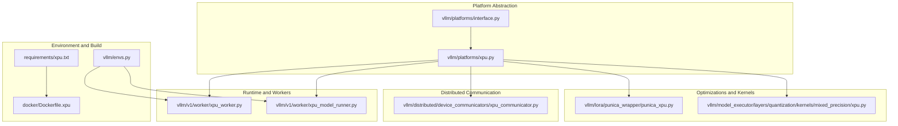
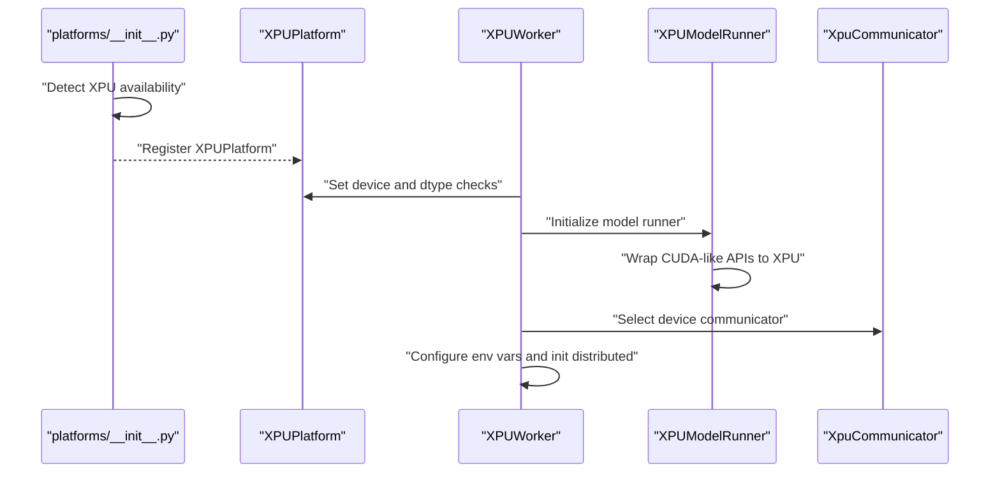
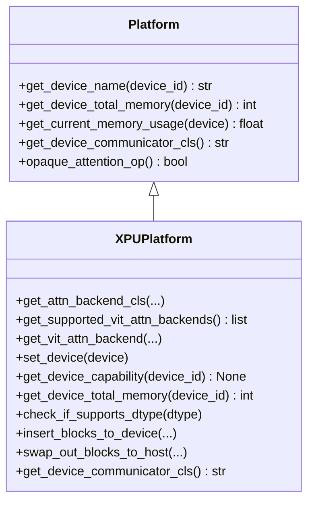
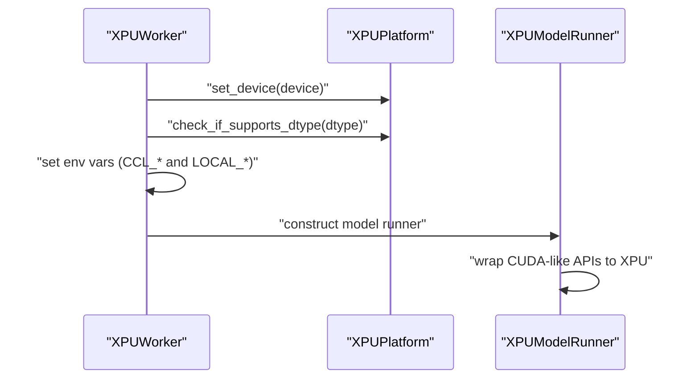
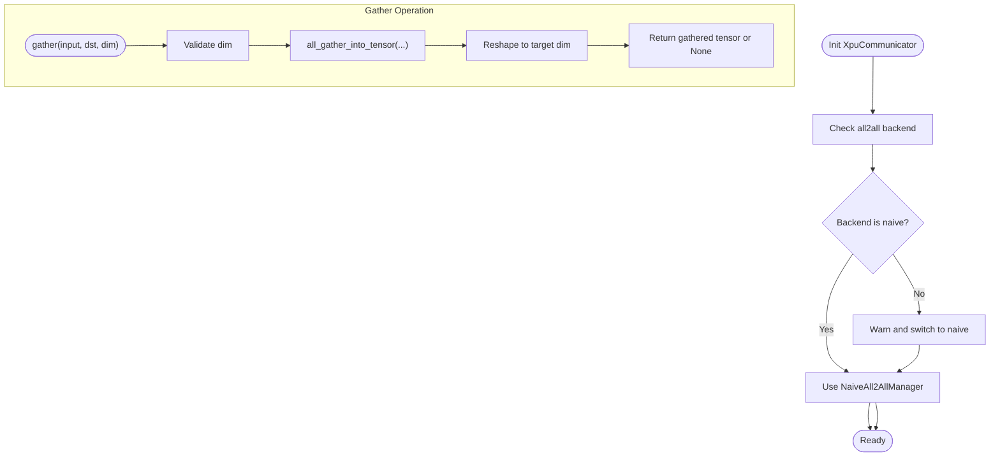
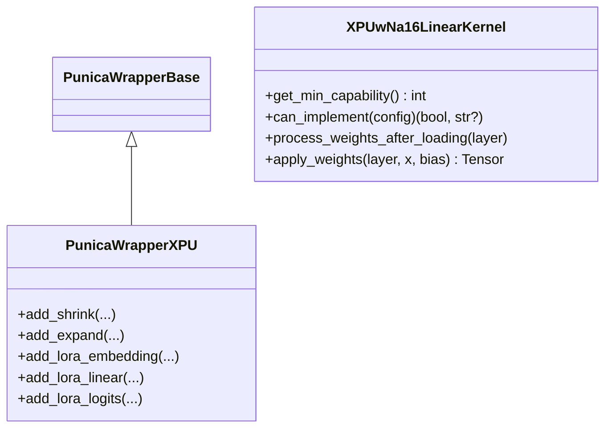
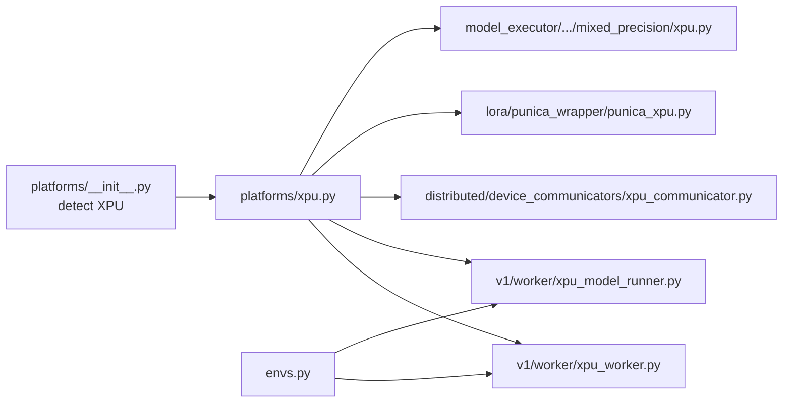

# Intel XPU Platform

<cite>
**Referenced Files in This Document**
- [vllm/platforms/xpu.py](file://vllm/platforms/xpu.py)
- [vllm/platforms/interface.py](file://vllm/platforms/interface.py)
- [vllm/platforms/__init__.py](file://vllm/platforms/__init__.py)
- [vllm/distributed/device_communicators/xpu_communicator.py](file://vllm/distributed/device_communicators/xpu_communicator.py)
- [vllm/v1/worker/xpu_worker.py](file://vllm/v1/worker/xpu_worker.py)
- [vllm/v1/worker/xpu_model_runner.py](file://vllm/v1/worker/xpu_model_runner.py)
- [vllm/lora/punica_wrapper/punica_xpu.py](file://vllm/lora/punica_wrapper/punica_xpu.py)
- [vllm/model_executor/layers/quantization/kernels/mixed_precision/xpu.py](file://vllm/model_executor/layers/quantization/kernels/mixed_precision/xpu.py)
- [requirements/xpu.txt](file://requirements/xpu.txt)
- [docker/Dockerfile.xpu](file://docker/Dockerfile.xpu)
- [vllm/envs.py](file://vllm/envs.py)
- [vllm/v1/engine/utils.py](file://vllm/v1/engine/utils.py)
</cite>

## Table of Contents
1. [Introduction](#introduction)
2. [Project Structure](#project-structure)
3. [Core Components](#core-components)
4. [Architecture Overview](#architecture-overview)
5. [Detailed Component Analysis](#detailed-component-analysis)
6. [Dependency Analysis](#dependency-analysis)
7. [Performance Considerations](#performance-considerations)
8. [Troubleshooting Guide](#troubleshooting-guide)
9. [Conclusion](#conclusion)
10. [Appendices](#appendices)

## Introduction
This document explains Intel XPU (formerly OneAPI) platform support in vLLM. It covers how vLLM detects and configures XPU devices, integrates with the SYCL-based runtime and Intel extensions, selects attention backends, manages memory, performs distributed communication, and applies Intel-specific optimizations. It also provides configuration guidance, environment variables, and troubleshooting tips tailored to Intel hardware.

## Project Structure
The XPU platform implementation is organized around a platform abstraction, worker/model runner specialization, device communicators, and platform-specific kernels and wrappers.

**Diagram sources**
- [vllm/platforms/interface.py](file://vllm/platforms/interface.py#L1-L120)
- [vllm/platforms/xpu.py](file://vllm/platforms/xpu.py#L1-L120)
- [vllm/v1/worker/xpu_worker.py](file://vllm/v1/worker/xpu_worker.py#L1-L80)
- [vllm/v1/worker/xpu_model_runner.py](file://vllm/v1/worker/xpu_model_runner.py#L1-L49)
- [vllm/distributed/device_communicators/xpu_communicator.py](file://vllm/distributed/device_communicators/xpu_communicator.py#L1-L40)
- [vllm/lora/punica_wrapper/punica_xpu.py](file://vllm/lora/punica_wrapper/punica_xpu.py#L1-L60)
- [vllm/model_executor/layers/quantization/kernels/mixed_precision/xpu.py](file://vllm/model_executor/layers/quantization/kernels/mixed_precision/xpu.py#L1-L40)
- [vllm/envs.py](file://vllm/envs.py#L448-L520)
- [requirements/xpu.txt](file://requirements/xpu.txt#L1-L20)
- [docker/Dockerfile.xpu](file://docker/Dockerfile.xpu#L1-L40)

**Section sources**
- [vllm/platforms/xpu.py](file://vllm/platforms/xpu.py#L1-L120)
- [vllm/platforms/interface.py](file://vllm/platforms/interface.py#L1-L120)
- [vllm/platforms/__init__.py](file://vllm/platforms/__init__.py#L131-L156)

## Core Components
- XPU platform detection and selection: The platform plugin checks for Intel extensions and XPU availability, sets the distributed backend, and registers the XPU platform.
- XPU platform implementation: Provides attention backend selection, device capability reporting, memory queries, dtype checks, KV cache operations, and device communicator selection.
- Worker and model runner: Specialized worker and model runner adapt PyTorch CUDA APIs to XPU equivalents and handle memory profiling differences on client vs. data center GPUs.
- Distributed communication: XPU device communicator adapts all-reduce/gather/all-to-all to XPU-compatible implementations.
- Optimizations and kernels: LoRA punica wrapper and mixed-precision quantization kernels integrate with Intel extensions for performance.

**Section sources**
- [vllm/platforms/__init__.py](file://vllm/platforms/__init__.py#L131-L156)
- [vllm/platforms/xpu.py](file://vllm/platforms/xpu.py#L1-L120)
- [vllm/v1/worker/xpu_worker.py](file://vllm/v1/worker/xpu_worker.py#L1-L80)
- [vllm/v1/worker/xpu_model_runner.py](file://vllm/v1/worker/xpu_model_runner.py#L1-L49)
- [vllm/distributed/device_communicators/xpu_communicator.py](file://vllm/distributed/device_communicators/xpu_communicator.py#L1-L40)
- [vllm/lora/punica_wrapper/punica_xpu.py](file://vllm/lora/punica_wrapper/punica_xpu.py#L1-L60)
- [vllm/model_executor/layers/quantization/kernels/mixed_precision/xpu.py](file://vllm/model_executor/layers/quantization/kernels/mixed_precision/xpu.py#L1-L40)

## Architecture Overview
The XPU platform integrates with vLLM’s platform abstraction and worker lifecycle. The platform plugin detects XPU availability and sets the distributed backend. The worker initializes device settings, environment variables, and the model runner. The model runner wraps CUDA-like APIs to XPU equivalents. Distributed communication is handled by a device communicator specialized for XPU.

**Diagram sources**
- [vllm/platforms/__init__.py](file://vllm/platforms/__init__.py#L131-L156)
- [vllm/platforms/xpu.py](file://vllm/platforms/xpu.py#L1-L120)
- [vllm/v1/worker/xpu_worker.py](file://vllm/v1/worker/xpu_worker.py#L120-L175)
- [vllm/v1/worker/xpu_model_runner.py](file://vllm/v1/worker/xpu_model_runner.py#L18-L49)
- [vllm/distributed/device_communicators/xpu_communicator.py](file://vllm/distributed/device_communicators/xpu_communicator.py#L1-L40)

## Detailed Component Analysis

### XPU Platform Implementation
Key responsibilities:
- Attention backend selection: Enforces specific layouts and backends for XPU.
- Device capability: Returns None for capability checks on XPU.
- Memory and device info: Uses XPU APIs for memory and device properties.
- Dtype checks: Warns or rejects problematic dtypes on specific devices.
- KV cache operations: Copies blocks between device and host.
- Distributed communicator: Selects XPU device communicator.

**Diagram sources**
- [vllm/platforms/interface.py](file://vllm/platforms/interface.py#L200-L360)
- [vllm/platforms/xpu.py](file://vllm/platforms/xpu.py#L40-L281)

**Section sources**
- [vllm/platforms/xpu.py](file://vllm/platforms/xpu.py#L40-L281)
- [vllm/platforms/interface.py](file://vllm/platforms/interface.py#L200-L360)

### Worker and Model Runner (XPU)
- Worker initialization sets device, dtype checks, environment variables for distributed comms, and constructs the XPU model runner.
- Model runner adapts CUDA-like stream and synchronization APIs to XPU equivalents and disables cascade attention.

**Diagram sources**
- [vllm/v1/worker/xpu_worker.py](file://vllm/v1/worker/xpu_worker.py#L120-L175)
- [vllm/v1/worker/xpu_model_runner.py](file://vllm/v1/worker/xpu_model_runner.py#L18-L49)
- [vllm/platforms/xpu.py](file://vllm/platforms/xpu.py#L100-L140)

**Section sources**
- [vllm/v1/worker/xpu_worker.py](file://vllm/v1/worker/xpu_worker.py#L1-L175)
- [vllm/v1/worker/xpu_model_runner.py](file://vllm/v1/worker/xpu_model_runner.py#L1-L49)

### Distributed Communication (XPU)
- The XPU device communicator:
  - Falls back to a “naive” all2all manager on XPU.
  - Uses all_gather_into_tensor for gather operations to avoid issues with Ray clusters.
  - Implements all_reduce and broadcast via the underlying device group.

**Diagram sources**
- [vllm/distributed/device_communicators/xpu_communicator.py](file://vllm/distributed/device_communicators/xpu_communicator.py#L1-L96)

**Section sources**
- [vllm/distributed/device_communicators/xpu_communicator.py](file://vllm/distributed/device_communicators/xpu_communicator.py#L1-L96)

### LoRA and Quantization (XPU)
- Punica wrapper for XPU: Uses IPEX BGV kernels for LoRA shrink/expand operations and integrates with dynamic marking for tensors.
- Mixed-precision quantization kernel for XPU: Validates IPEX version, configures quantization parameters, and applies weight-only quantized linear layers.

**Diagram sources**
- [vllm/lora/punica_wrapper/punica_xpu.py](file://vllm/lora/punica_wrapper/punica_xpu.py#L1-L120)
- [vllm/model_executor/layers/quantization/kernels/mixed_precision/xpu.py](file://vllm/model_executor/layers/quantization/kernels/mixed_precision/xpu.py#L1-L98)

**Section sources**
- [vllm/lora/punica_wrapper/punica_xpu.py](file://vllm/lora/punica_wrapper/punica_xpu.py#L1-L277)
- [vllm/model_executor/layers/quantization/kernels/mixed_precision/xpu.py](file://vllm/model_executor/layers/quantization/kernels/mixed_precision/xpu.py#L1-L98)

### Environment Variables and Configuration
Key environment variables impacting XPU:
- VLLM_TARGET_DEVICE: Set to xpu for building and runtime targeting Intel devices.
- VLLM_WORKER_MULTIPROC_METHOD: Recommended to spawn on XPU for multiprocessing.
- CCL_ATL_TRANSPORT and LOCAL_*: Distributed transport and rank variables used by the worker.
- VLLM_KV_CACHE_LAYOUT: XPU enforces NHD layout for attention kernels.
- XPU_USE_TRITON_KERNEL: Switches LoRA wrapper to a Triton-based variant.

Build-time and runtime configuration:
- requirements/xpu.txt pins Intel PyTorch and IPEX packages.
- docker/Dockerfile.xpu installs Intel OneAPI and oneCCL, sets VLLM_TARGET_DEVICE, and builds vLLM with XPU support.

**Section sources**
- [vllm/envs.py](file://vllm/envs.py#L448-L520)
- [vllm/envs.py](file://vllm/envs.py#L727-L731)
- [vllm/platforms/xpu.py](file://vllm/platforms/xpu.py#L40-L72)
- [vllm/platforms/xpu.py](file://vllm/platforms/xpu.py#L120-L140)
- [requirements/xpu.txt](file://requirements/xpu.txt#L1-L20)
- [docker/Dockerfile.xpu](file://docker/Dockerfile.xpu#L52-L66)

## Dependency Analysis
- Platform detection depends on Intel extensions and XPU availability; distributed backend is chosen based on environment capabilities.
- Worker and model runner depend on platform APIs for device selection and memory profiling.
- Device communicator depends on torch.distributed and platform-provided device groups.
- LoRA and quantization kernels depend on IPEX for Intel-specific optimizations.

**Diagram sources**
- [vllm/platforms/__init__.py](file://vllm/platforms/__init__.py#L131-L156)
- [vllm/platforms/xpu.py](file://vllm/platforms/xpu.py#L1-L120)
- [vllm/v1/worker/xpu_worker.py](file://vllm/v1/worker/xpu_worker.py#L120-L175)
- [vllm/v1/worker/xpu_model_runner.py](file://vllm/v1/worker/xpu_model_runner.py#L18-L49)
- [vllm/distributed/device_communicators/xpu_communicator.py](file://vllm/distributed/device_communicators/xpu_communicator.py#L1-L40)
- [vllm/lora/punica_wrapper/punica_xpu.py](file://vllm/lora/punica_wrapper/punica_xpu.py#L1-L60)
- [vllm/model_executor/layers/quantization/kernels/mixed_precision/xpu.py](file://vllm/model_executor/layers/quantization/kernels/mixed_precision/xpu.py#L1-L40)
- [vllm/envs.py](file://vllm/envs.py#L448-L520)

**Section sources**
- [vllm/platforms/__init__.py](file://vllm/platforms/__init__.py#L131-L156)
- [vllm/platforms/xpu.py](file://vllm/platforms/xpu.py#L1-L120)

## Performance Considerations
- Attention backends: XPU enforces Flash Attention and NHD KV cache layout; sparse attention is not supported.
- Compilation and graph modes: CUDA graph mode is not supported on XPU; compilation mode may be restricted when LoRA is enabled.
- Multiprocessing: Use spawn as the worker multiprocess method on XPU.
- Distributed communication: The XPU communicator uses a naive all2all manager and all_gather for gather operations to improve stability on Ray clusters.
- Memory profiling: On client GPUs, memory estimates account for non-Torch allocations; on data center GPUs, direct memory queries are used.

**Section sources**
- [vllm/platforms/xpu.py](file://vllm/platforms/xpu.py#L40-L120)
- [vllm/platforms/xpu.py](file://vllm/platforms/xpu.py#L140-L210)
- [vllm/v1/worker/xpu_worker.py](file://vllm/v1/worker/xpu_worker.py#L120-L175)
- [vllm/distributed/device_communicators/xpu_communicator.py](file://vllm/distributed/device_communicators/xpu_communicator.py#L1-L96)

## Troubleshooting Guide
Common issues and resolutions:
- Device selection in Ray: Ray initializes the GPU runtime early; set the platform device control environment variable in the Ray runtime environment to ensure correct device selection.
- Multiprocessing on XPU: If using multiprocessing, ensure the worker multiprocess method is set to spawn.
- Data type compatibility: Certain client GPUs have known accuracy issues with bfloat16; use float16 instead when encountering errors.
- Distributed transport: Configure CCL ATL transport and local world size variables appropriately for the environment.

**Section sources**
- [vllm/v1/engine/utils.py](file://vllm/v1/engine/utils.py#L303-L314)
- [vllm/envs.py](file://vllm/envs.py#L727-L731)
- [vllm/platforms/xpu.py](file://vllm/platforms/xpu.py#L234-L257)
- [vllm/v1/worker/xpu_worker.py](file://vllm/v1/worker/xpu_worker.py#L147-L170)

## Conclusion
vLLM’s XPU platform integrates tightly with Intel’s SYCL-based runtime and IPEX extensions. It provides platform-aware attention backends, memory profiling, and a robust device communicator for distributed scenarios. Correct environment configuration and attention to multiprocessing and dtype constraints are essential for reliable performance on Intel hardware.

## Appendices

### Practical Configuration Examples
- Build and runtime targeting XPU:
  - Set VLLM_TARGET_DEVICE to xpu.
  - Install Intel PyTorch and IPEX as specified in requirements/xpu.txt.
  - Use the XPU Dockerfile to provision the environment and build vLLM.
- Device selection and visibility:
  - Use the platform device control environment variable to select specific XPU devices in distributed setups.
- Performance tuning:
  - Prefer spawn for multiprocessing on XPU.
  - Use float16 on client GPUs with known bfloat16 accuracy limitations.
  - Keep KV cache layout as NHD for XPU attention.

**Section sources**
- [requirements/xpu.txt](file://requirements/xpu.txt#L1-L20)
- [docker/Dockerfile.xpu](file://docker/Dockerfile.xpu#L52-L66)
- [vllm/envs.py](file://vllm/envs.py#L448-L520)
- [vllm/platforms/xpu.py](file://vllm/platforms/xpu.py#L120-L140)
- [vllm/platforms/xpu.py](file://vllm/platforms/xpu.py#L234-L257)