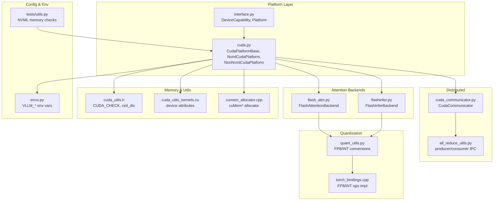
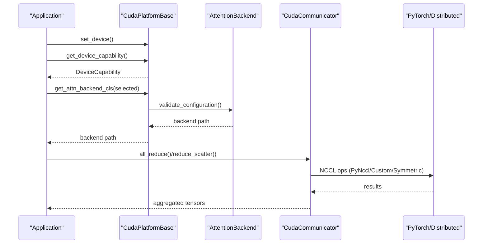
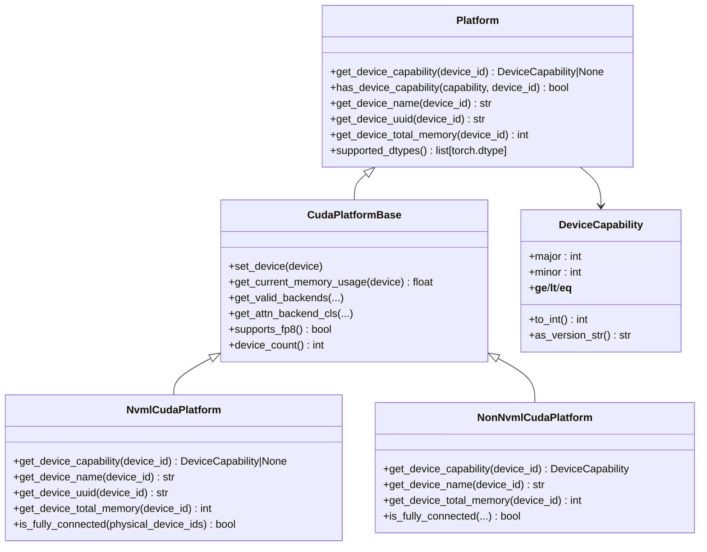
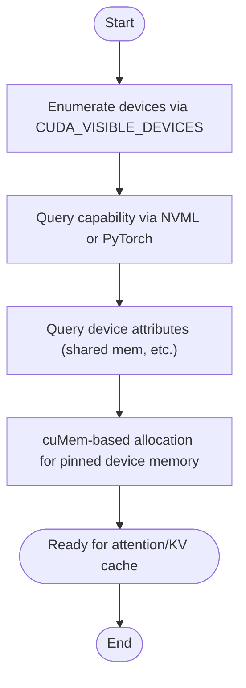
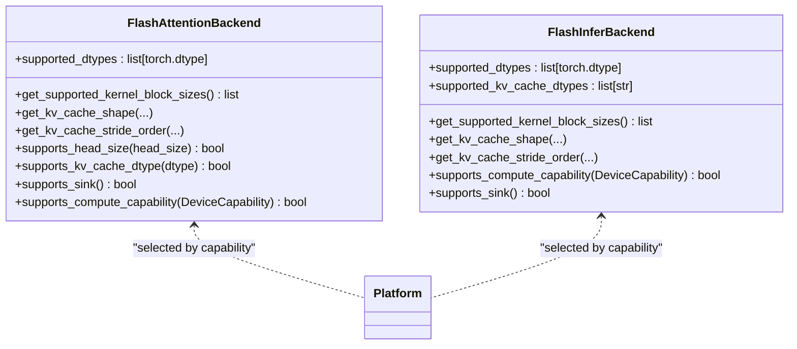
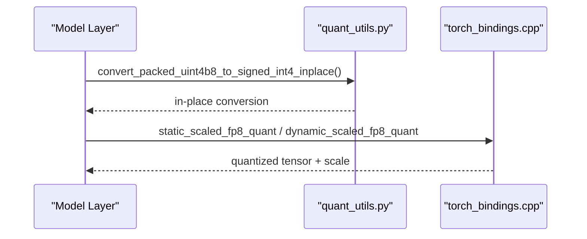
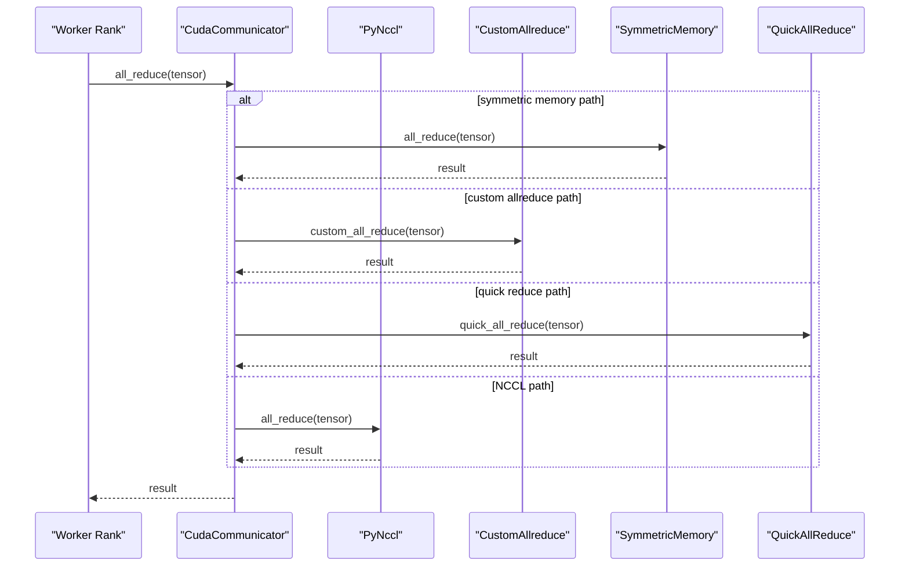
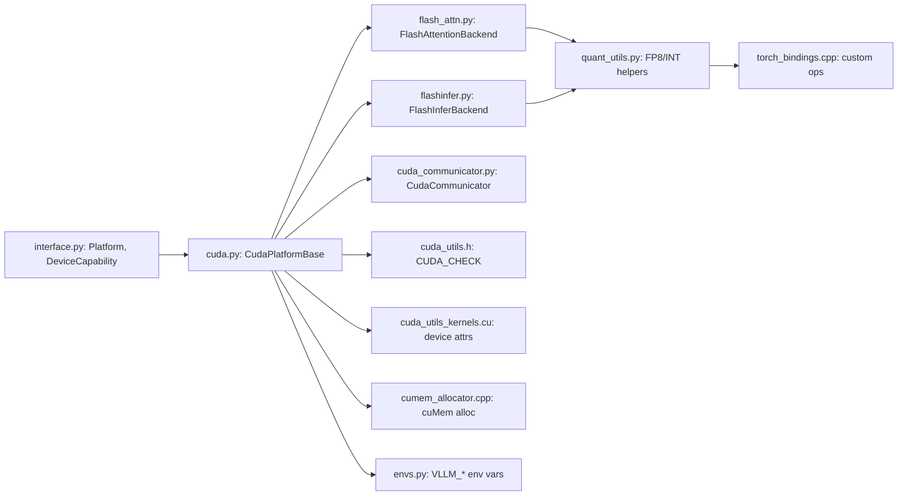

# NVIDIA CUDA Platform

<cite>
**Referenced Files in This Document**
- [cuda.py](file://vllm/platforms/cuda.py)
- [interface.py](file://vllm/platforms/interface.py)
- [cuda_utils.h](file://csrc/cuda_utils.h)
- [cuda_utils_kernels.cu](file://csrc/cuda_utils_kernels.cu)
- [flash_attn.py](file://vllm/v1/attention/backends/flash_attn.py)
- [flashinfer.py](file://vllm/v1/attention/backends/flashinfer.py)
- [cuda_communicator.py](file://vllm/distributed/device_communicators/cuda_communicator.py)
- [all_reduce_utils.py](file://vllm/distributed/device_communicators/all_reduce_utils.py)
- [envs.py](file://vllm/envs.py)
- [quant_utils.py](file://vllm/model_executor/layers/quantization/utils/quant_utils.py)
- [torch_bindings.cpp](file://csrc/torch_bindings.cpp)
- [cumem_allocator.cpp](file://csrc/cumem_allocator.cpp)
- [tests/utils.py](file://tests/utils.py)
</cite>

## Table of Contents
1. [Introduction](#introduction)
2. [Project Structure](#project-structure)
3. [Core Components](#core-components)
4. [Architecture Overview](#architecture-overview)
5. [Detailed Component Analysis](#detailed-component-analysis)
6. [Dependency Analysis](#dependency-analysis)
7. [Performance Considerations](#performance-considerations)
8. [Troubleshooting Guide](#troubleshooting-guide)
9. [Conclusion](#conclusion)
10. [Appendices](#appendices)

## Introduction
This document explains NVIDIA CUDA platform support in vLLM. It covers device capability detection, memory management, attention backends (FlashAttention, FlashInfer), quantization support (FP8, INT4/8), distributed communication, and performance tuning. It also documents CUDA device enumeration, capability querying, memory allocation strategies, environment controls, and practical examples for device selection, memory profiling, and benchmarking.

## Project Structure
At a high level, CUDA platform support spans:
- Platform abstraction and device capability detection
- Attention backends and metadata builders
- Distributed device communicators
- Quantization utilities and custom ops
- Memory allocation and device utilities
- Environment variables and configuration

**Diagram sources**
- [interface.py](file://vllm/platforms/interface.py#L1-L120)
- [cuda.py](file://vllm/platforms/cuda.py#L1-L120)
- [flash_attn.py](file://vllm/v1/attention/backends/flash_attn.py#L1-L120)
- [flashinfer.py](file://vllm/v1/attention/backends/flashinfer.py#L1-L120)
- [cuda_communicator.py](file://vllm/distributed/device_communicators/cuda_communicator.py#L1-L120)
- [all_reduce_utils.py](file://vllm/distributed/device_communicators/all_reduce_utils.py#L91-L133)
- [quant_utils.py](file://vllm/model_executor/layers/quantization/utils/quant_utils.py#L708-L741)
- [torch_bindings.cpp](file://csrc/torch_bindings.cpp#L588-L620)
- [cuda_utils.h](file://csrc/cuda_utils.h#L1-L41)
- [cuda_utils_kernels.cu](file://csrc/cuda_utils_kernels.cu#L1-L35)
- [cumem_allocator.cpp](file://csrc/cumem_allocator.cpp#L1-L120)
- [envs.py](file://vllm/envs.py#L448-L720)
- [tests/utils.py](file://tests/utils.py#L802-L835)

**Section sources**
- [interface.py](file://vllm/platforms/interface.py#L1-L120)
- [cuda.py](file://vllm/platforms/cuda.py#L1-L120)

## Core Components
- Device capability and platform detection:
  - DeviceCapability and capability comparison helpers
  - CudaPlatformBase with NVML/non-NVML variants
- Attention backends:
  - FlashAttentionBackend and FlashInferBackend with supported dtypes, block sizes, and KV cache layouts
- Distributed communication:
  - CudaCommunicator with custom allreduce, symmetric memory, PyNccl, and all2all managers
- Quantization:
  - FP8/INT quantization utilities and custom ops for static/dynamic scaling
- Memory and device utilities:
  - CUDA_CHECK macro, device attribute queries, cuMem-based allocator
- Environment and configuration:
  - VLLM_* environment variables controlling CUDA_VISIBLE_DEVICES, attention backend, workspace sizing, and compilation behavior

**Section sources**
- [interface.py](file://vllm/platforms/interface.py#L58-L120)
- [cuda.py](file://vllm/platforms/cuda.py#L1-L120)
- [flash_attn.py](file://vllm/v1/attention/backends/flash_attn.py#L56-L120)
- [flashinfer.py](file://vllm/v1/attention/backends/flashinfer.py#L278-L360)
- [cuda_communicator.py](file://vllm/distributed/device_communicators/cuda_communicator.py#L1-L120)
- [quant_utils.py](file://vllm/model_executor/layers/quantization/utils/quant_utils.py#L708-L741)
- [torch_bindings.cpp](file://csrc/torch_bindings.cpp#L588-L620)
- [cuda_utils.h](file://csrc/cuda_utils.h#L1-L41)
- [cuda_utils_kernels.cu](file://csrc/cuda_utils_kernels.cu#L1-L35)
- [cumem_allocator.cpp](file://csrc/cumem_allocator.cpp#L1-L120)
- [envs.py](file://vllm/envs.py#L448-L720)

## Architecture Overview
The CUDA platform integrates device capability detection, attention backend selection, distributed communication, and quantization. The platform selects appropriate backends based on device compute capability and configuration, manages memory and device attributes, and coordinates efficient multi-GPU communication.

**Diagram sources**
- [cuda.py](file://vllm/platforms/cuda.py#L118-L180)
- [flash_attn.py](file://vllm/v1/attention/backends/flash_attn.py#L160-L179)
- [flashinfer.py](file://vllm/v1/attention/backends/flashinfer.py#L337-L382)
- [cuda_communicator.py](file://vllm/distributed/device_communicators/cuda_communicator.py#L120-L175)

## Detailed Component Analysis

### CUDA Platform and Device Capability Detection
- DeviceCapability encapsulates major/minor compute capability and comparison helpers.
- CudaPlatformBase defines platform-wide capabilities, dtype support, and backend selection logic.
- NVML-enabled path (NvmlCudaPlatform) queries device capability, name, UUID, and total memory via NVML.
- Non-NVML path (NonNvmlCudaPlatform) uses PyTorch APIs.

**Diagram sources**
- [interface.py](file://vllm/platforms/interface.py#L58-L120)
- [cuda.py](file://vllm/platforms/cuda.py#L1-L120)
- [cuda.py](file://vllm/platforms/cuda.py#L480-L619)

**Section sources**
- [interface.py](file://vllm/platforms/interface.py#L58-L120)
- [cuda.py](file://vllm/platforms/cuda.py#L1-L120)
- [cuda.py](file://vllm/platforms/cuda.py#L480-L619)

### CUDA Device Enumeration, Capability Querying, and Memory Allocation Strategies
- Device enumeration:
  - Uses stateless device count and device_id remapping via CUDA_VISIBLE_DEVICES.
- Capability querying:
  - NVML path uses NVML handles to query compute capability and device properties.
  - Non-NVML path uses PyTorch device properties.
- Memory allocation:
  - cuMem-based allocator (cuMemCreate/cuMemMap) for pinned device memory with access descriptors.
  - Device attribute queries (e.g., max shared memory per block) exposed via C++ kernels.

**Diagram sources**
- [cuda.py](file://vllm/platforms/cuda.py#L200-L240)
- [cuda_utils_kernels.cu](file://csrc/cuda_utils_kernels.cu#L1-L35)
- [cumem_allocator.cpp](file://csrc/cumem_allocator.cpp#L120-L175)

**Section sources**
- [cuda.py](file://vllm/platforms/cuda.py#L200-L240)
- [cuda_utils_kernels.cu](file://csrc/cuda_utils_kernels.cu#L1-L35)
- [cumem_allocator.cpp](file://csrc/cumem_allocator.cpp#L120-L175)

### CUDA-Specific Attention Backends (FlashAttention, FlashInfer)
- FlashAttentionBackend:
  - Supported dtypes, block size constraints, KV cache shape/layout, FP8 dtype mapping, sink support gating.
  - Compute capability requirement and combination checks.
- FlashInferBackend:
  - Supported dtypes and KV cache dtypes, block sizes (16/32/64), KV cache stride ordering, FP8 dtype mapping.
  - Sink support gated by TRTLLM availability; Blackwell requires HND layout.

**Diagram sources**
- [flash_attn.py](file://vllm/v1/attention/backends/flash_attn.py#L56-L179)
- [flashinfer.py](file://vllm/v1/attention/backends/flashinfer.py#L278-L382)

**Section sources**
- [flash_attn.py](file://vllm/v1/attention/backends/flash_attn.py#L56-L179)
- [flashinfer.py](file://vllm/v1/attention/backends/flashinfer.py#L278-L382)

### Quantization Support (FP8, INT4/8)
- FP8 quantization:
  - Utilities for converting per-tensor/channel scales to FP8 formats and packing uint4b8 to signed int4 in-place.
  - Custom ops for static/dynamic FP8 quantization and scaling.
- INT4/8 quantization:
  - Helpers for per-token/group quantization paths used by FP8 and INT8 pathways.

**Diagram sources**
- [quant_utils.py](file://vllm/model_executor/layers/quantization/utils/quant_utils.py#L708-L741)
- [torch_bindings.cpp](file://csrc/torch_bindings.cpp#L588-L620)

**Section sources**
- [quant_utils.py](file://vllm/model_executor/layers/quantization/utils/quant_utils.py#L708-L741)
- [torch_bindings.cpp](file://csrc/torch_bindings.cpp#L588-L620)

### Distributed Communication Mechanisms (NCCL, Custom Allreduce, Symmetric Memory)
- CudaCommunicator orchestrates:
  - PyNccl communicator for NCCL-backed all-reduce/reduce-scatter
  - Custom allreduce and quick reduce (ROCm-specific) as fallbacks
  - Symmetric memory allreduce path when enabled
  - All2All managers (naive, AgRs, PPLX, DeepEP, FlashInfer variants)
- Producer/consumer IPC validation uses CUDA RT APIs to verify cross-device memory accessibility.

**Diagram sources**
- [cuda_communicator.py](file://vllm/distributed/device_communicators/cuda_communicator.py#L120-L175)
- [all_reduce_utils.py](file://vllm/distributed/device_communicators/all_reduce_utils.py#L91-L133)

**Section sources**
- [cuda_communicator.py](file://vllm/distributed/device_communicators/cuda_communicator.py#L1-L120)
- [all_reduce_utils.py](file://vllm/distributed/device_communicators/all_reduce_utils.py#L91-L133)

### CUDA Device Selection, Memory Profiling, and Benchmarking
- Device selection:
  - Use CUDA_VISIBLE_DEVICES to constrain visible devices; platform maps logical to physical indices.
- Memory profiling:
  - NVML-based memory usage monitoring for GPU memory used/total.
- Benchmarking:
  - Environment variables control attention backend selection, workspace sizing, and compilation behavior.

Practical examples (paths only):
- Set visible devices and run inference:
  - [envs.py](file://vllm/envs.py#L600-L610)
- Monitor GPU memory usage:
  - [tests/utils.py](file://tests/utils.py#L802-L835)
- Configure attention backend/workspace:
  - [envs.py](file://vllm/envs.py#L662-L687)
  - [flashinfer.py](file://vllm/v1/attention/backends/flashinfer.py#L650-L662)

**Section sources**
- [envs.py](file://vllm/envs.py#L600-L687)
- [tests/utils.py](file://tests/utils.py#L802-L835)
- [flashinfer.py](file://vllm/v1/attention/backends/flashinfer.py#L650-L662)

## Dependency Analysis
- Platform abstractions:
  - DeviceCapability and Platform define capability queries and device control environment variables.
- Backend selection:
  - CudaPlatformBase.get_valid_backends and get_attn_backend_cls choose backends based on compute capability and configuration.
- Attention backends:
  - FlashAttentionBackend and FlashInferBackend validate configurations and expose supported dtypes/block sizes.
- Distributed:
  - CudaCommunicator composes multiple communication strategies (NCCL, custom, symmetric, all2all).
- Quantization:
  - quant_utils.py and torch_bindings.cpp provide FP8/INT conversions and custom ops.

**Diagram sources**
- [interface.py](file://vllm/platforms/interface.py#L1-L120)
- [cuda.py](file://vllm/platforms/cuda.py#L1-L120)
- [flash_attn.py](file://vllm/v1/attention/backends/flash_attn.py#L56-L120)
- [flashinfer.py](file://vllm/v1/attention/backends/flashinfer.py#L278-L360)
- [cuda_communicator.py](file://vllm/distributed/device_communicators/cuda_communicator.py#L1-L120)
- [quant_utils.py](file://vllm/model_executor/layers/quantization/utils/quant_utils.py#L708-L741)
- [torch_bindings.cpp](file://csrc/torch_bindings.cpp#L588-L620)
- [cuda_utils.h](file://csrc/cuda_utils.h#L1-L41)
- [cuda_utils_kernels.cu](file://csrc/cuda_utils_kernels.cu#L1-L35)
- [cumem_allocator.cpp](file://csrc/cumem_allocator.cpp#L1-L120)
- [envs.py](file://vllm/envs.py#L448-L720)

**Section sources**
- [interface.py](file://vllm/platforms/interface.py#L1-L120)
- [cuda.py](file://vllm/platforms/cuda.py#L1-L120)
- [flash_attn.py](file://vllm/v1/attention/backends/flash_attn.py#L56-L120)
- [flashinfer.py](file://vllm/v1/attention/backends/flashinfer.py#L278-L360)
- [cuda_communicator.py](file://vllm/distributed/device_communicators/cuda_communicator.py#L1-L120)
- [quant_utils.py](file://vllm/model_executor/layers/quantization/utils/quant_utils.py#L708-L741)
- [torch_bindings.cpp](file://csrc/torch_bindings.cpp#L588-L620)
- [cuda_utils.h](file://csrc/cuda_utils.h#L1-L41)
- [cuda_utils_kernels.cu](file://csrc/cuda_utils_kernels.cu#L1-L35)
- [cumem_allocator.cpp](file://csrc/cumem_allocator.cpp#L1-L120)
- [envs.py](file://vllm/envs.py#L448-L720)

## Performance Considerations
- Attention backend selection:
  - Platform chooses backends based on compute capability and configuration; ensure block sizes match backend requirements (e.g., FlashMLA/CutlassMLA).
- FP8 usage:
  - FP8 KV cache support depends on device capability; verify platform.supports_fp8().
- Workspace sizing:
  - FlashInfer workspace buffer size controlled by environment variable; adjust for batch-invariant scenarios.
- Compilation and graphs:
  - Full CUDA graph capture and AOT scheduling can improve latency; tune attention graph modes accordingly.
- Memory:
  - Use cuMem-based allocator for pinned device memory; leverage device attribute queries for optimal shared memory usage.

[No sources needed since this section provides general guidance]

## Troubleshooting Guide
- Backend selection errors:
  - If a selected backend is invalid for the device, platform raises a ValueError with reasons; verify compute capability and configuration.
- Memory issues:
  - NVML-based memory monitoring helps diagnose GPU memory pressure; ensure CUDA_VISIBLE_DEVICES alignment with device order.
- Cross-device memory:
  - Producer/consumer IPC validation ensures memory handles are accessible across devices; mismatches indicate device visibility or driver issues.

**Section sources**
- [cuda.py](file://vllm/platforms/cuda.py#L318-L359)
- [tests/utils.py](file://tests/utils.py#L802-L835)
- [all_reduce_utils.py](file://vllm/distributed/device_communicators/all_reduce_utils.py#L91-L133)

## Conclusion
vLLM’s CUDA platform integrates robust device capability detection, flexible attention backends, efficient distributed communication, and comprehensive quantization support. Proper configuration of environment variables, attention backends, and memory/workspace parameters yields significant performance gains across diverse NVIDIA GPU families.

[No sources needed since this section summarizes without analyzing specific files]

## Appendices

### Configuration Examples
- CUDA device selection:
  - [envs.py](file://vllm/envs.py#L600-L610)
- Attention backend selection:
  - [envs.py](file://vllm/envs.py#L662-L687)
- FlashInfer workspace sizing:
  - [flashinfer.py](file://vllm/v1/attention/backends/flashinfer.py#L650-L662)
- Environment variables reference:
  - [envs.py](file://vllm/envs.py#L448-L720)

**Section sources**
- [envs.py](file://vllm/envs.py#L448-L720)
- [flashinfer.py](file://vllm/v1/attention/backends/flashinfer.py#L650-L662)