# Platform Detection and Selection

<cite>
**Referenced Files in This Document**
- [platforms/__init__.py](file://vllm/platforms/__init__.py)
- [platforms/interface.py](file://vllm/platforms/interface.py)
- [platforms/cuda.py](file://vllm/platforms/cuda.py)
- [platforms/rocm.py](file://vllm/platforms/rocm.py)
- [platforms/tpu.py](file://vllm/platforms/tpu.py)
- [platforms/xpu.py](file://vllm/platforms/xpu.py)
- [platforms/cpu.py](file://vllm/platforms/cpu.py)
- [envs.py](file://vllm/envs.py)
- [env_override.py](file://vllm/env_override.py)
- [utils/platform_utils.py](file://vllm/utils/platform_utils.py)
- [config/device.py](file://vllm/config/device.py)
- [engine/arg_utils.py](file://vllm/engine/arg_utils.py)
</cite>

## Table of Contents
1. [Introduction](#introduction)
2. [Project Structure](#project-structure)
3. [Core Components](#core-components)
4. [Architecture Overview](#architecture-overview)
5. [Detailed Component Analysis](#detailed-component-analysis)
6. [Dependency Analysis](#dependency-analysis)
7. [Performance Considerations](#performance-considerations)
8. [Troubleshooting Guide](#troubleshooting-guide)
9. [Conclusion](#conclusion)
10. [Appendices](#appendices)

## Introduction
This document explains how vLLM detects and selects the runtime platform at startup, how environment variables influence detection, and how platform capabilities are queried and validated. It covers:
- Platform detection algorithms and precedence rules
- Environment variable processing and validation
- Automatic platform selection logic
- PlatformEnum and device capability querying
- Runtime platform switching behavior
- Examples of manual selection, environment-based detection, and capability verification
- Troubleshooting and custom platform registration

## Project Structure
The platform detection and selection mechanism spans several modules:
- Platform registry and detection: vllm/platforms/__init__.py
- Platform abstractions and capability queries: vllm/platforms/interface.py
- Platform-specific implementations: vllm/platforms/{cuda, rocm, tpu, xpu, cpu}.py
- Environment variable definitions and validators: vllm/envs.py
- Environment overrides for stability: vllm/env_override.py
- Utilities for platform checks: vllm/utils/platform_utils.py
- Device configuration integration: vllm/config/device.py
- Engine-side usage of platform info: vllm/engine/arg_utils.py

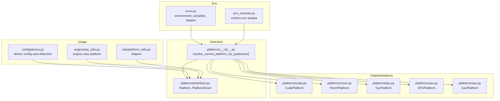

**Diagram sources**
- [platforms/__init__.py](file://vllm/platforms/__init__.py#L182-L238)
- [platforms/interface.py](file://vllm/platforms/interface.py#L38-L696)
- [platforms/cuda.py](file://vllm/platforms/cuda.py#L480-L619)
- [platforms/rocm.py](file://vllm/platforms/rocm.py#L161-L562)
- [platforms/tpu.py](file://vllm/platforms/tpu.py#L37-L296)
- [platforms/xpu.py](file://vllm/platforms/xpu.py#L25-L281)
- [platforms/cpu.py](file://vllm/platforms/cpu.py#L71-L422)
- [envs.py](file://vllm/envs.py#L452-L800)
- [env_override.py](file://vllm/env_override.py#L1-L379)
- [utils/platform_utils.py](file://vllm/utils/platform_utils.py#L1-L60)
- [config/device.py](file://vllm/config/device.py#L38-L75)
- [engine/arg_utils.py](file://vllm/engine/arg_utils.py#L1800-L1811)

**Section sources**
- [platforms/__init__.py](file://vllm/platforms/__init__.py#L1-L278)
- [platforms/interface.py](file://vllm/platforms/interface.py#L1-L200)
- [envs.py](file://vllm/envs.py#L452-L800)

## Core Components
- Platform registry and selection:
  - Built-in platform plugins (TPU, CUDA, ROCm, XPU, CPU) are evaluated to determine the active platform.
  - Out-of-tree platform plugins are supported via a plugin group; only one can be active.
  - Resolution yields a platform class qualifier name, which is resolved to a live platform instance lazily.
- Platform abstraction:
  - Platform defines enums, device capability queries, distributed backends, dtype support, attention backends, and platform-specific validations.
- Environment variables:
  - Centralized environment variable registry with validation helpers and typed converters.
  - Includes target device selection and platform-specific toggles.

Key responsibilities:
- Detect platform availability and choose one active platform.
- Provide device capability queries (compute capability, memory, connectivity).
- Enforce platform-specific constraints and configurations.
- Support environment-driven selection and validation.

**Section sources**
- [platforms/__init__.py](file://vllm/platforms/__init__.py#L182-L238)
- [platforms/interface.py](file://vllm/platforms/interface.py#L38-L135)
- [envs.py](file://vllm/envs.py#L452-L520)

## Architecture Overview
The platform detection and selection flow:

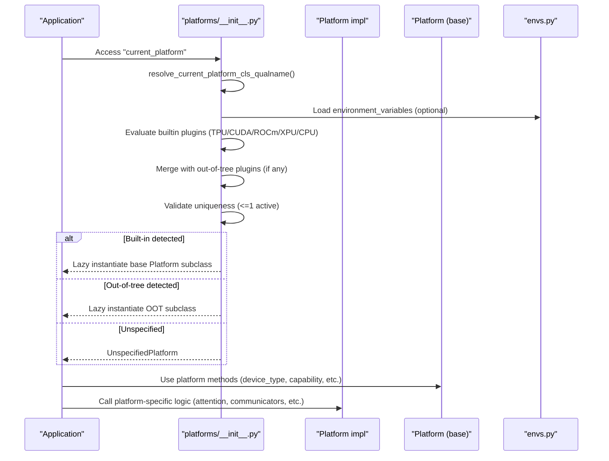

**Diagram sources**
- [platforms/__init__.py](file://vllm/platforms/__init__.py#L191-L238)
- [platforms/interface.py](file://vllm/platforms/interface.py#L100-L135)
- [envs.py](file://vllm/envs.py#L452-L520)

## Detailed Component Analysis

### Platform Detection and Selection
- Built-in plugin functions:
  - TPU: checks environment and libtpu presence.
  - CUDA: checks NVML and falls back to Jetson detection; excludes CPU builds.
  - ROCm: checks AMDSMI and device handles.
  - XPU: checks IPEX availability and XCCL/CCL support.
  - CPU: matches CPU builds or macOS; otherwise inactive.
- Plugin resolution:
  - Collects all activated plugins (built-in and out-of-tree).
  - Enforces single-activation rule; raises errors if multiple are active.
  - Returns a platform class qualifier name; the actual platform is lazily instantiated on first access.
- Lazy instantiation ensures plugin loading order does not prematurely initialize distributed backends.

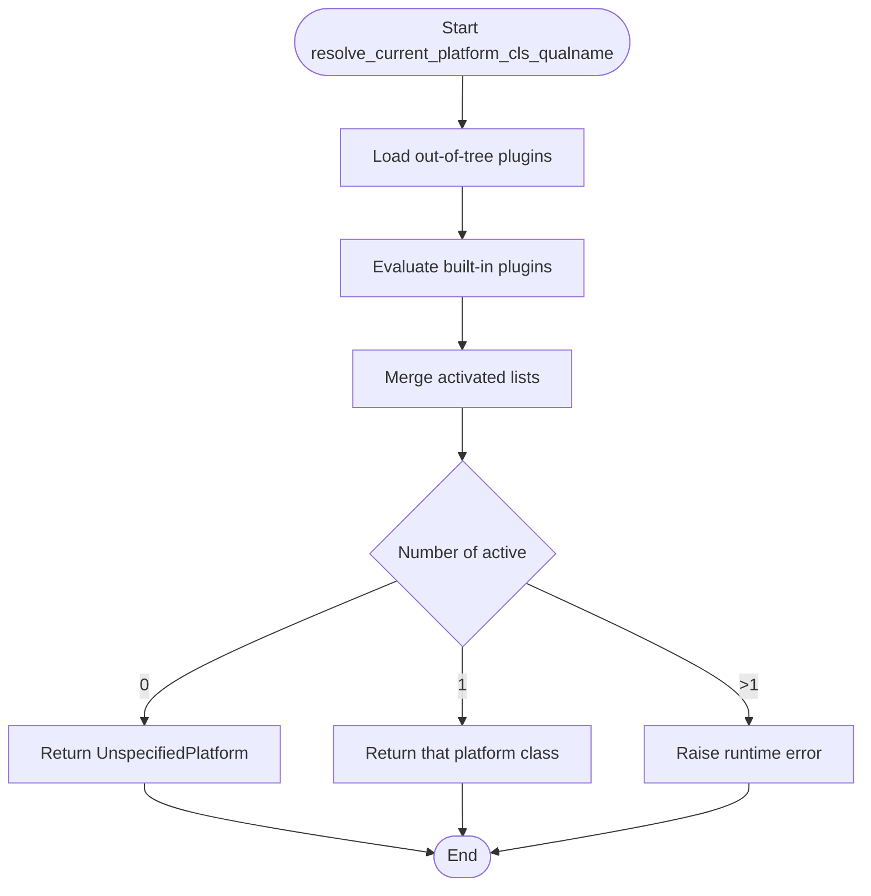

**Diagram sources**
- [platforms/__init__.py](file://vllm/platforms/__init__.py#L191-L238)

**Section sources**
- [platforms/__init__.py](file://vllm/platforms/__init__.py#L35-L180)
- [platforms/__init__.py](file://vllm/platforms/__init__.py#L191-L238)

### Platform Abstraction and Capability Queries
- Platform base class defines:
  - Enumerations for platform types and CPU architectures.
  - Device capability queries (major/minor, comparison, family).
  - Distributed backend selection, attention backends, dtype support, and quantization support.
  - Device control environment variable mapping and device selection helpers.
- DeviceCapability supports comparisons and integer encoding for capability families.

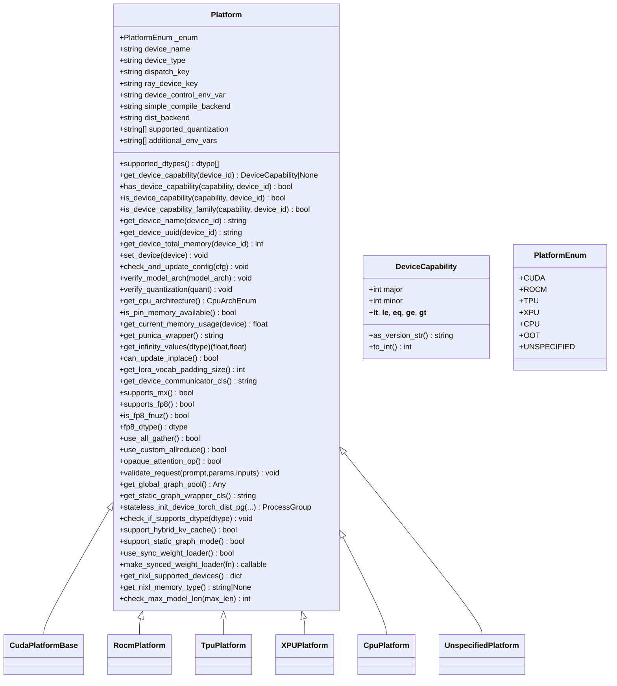

**Diagram sources**
- [platforms/interface.py](file://vllm/platforms/interface.py#L38-L696)

**Section sources**
- [platforms/interface.py](file://vllm/platforms/interface.py#L38-L135)
- [platforms/interface.py](file://vllm/platforms/interface.py#L271-L341)

### CUDA Platform
- Two variants:
  - NVML-enabled: uses NVML to query compute capability, device name, UUID, memory, and NVLink connectivity.
  - Non-NVML: uses PyTorch APIs; NVLink detection not available.
- Attention backend selection prioritizes backends by device capability and configuration.
- Validates dtype support (e.g., bfloat16 requires compute capability ≥ 8.0).
- Supports hybrid KV cache and static graph modes.

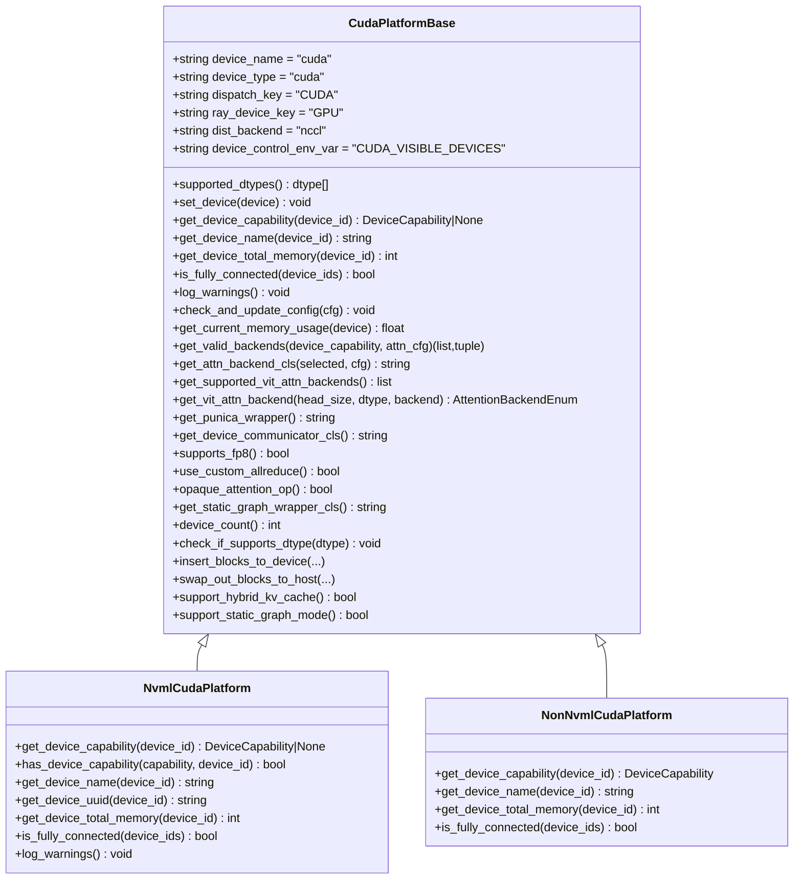

**Diagram sources**
- [platforms/cuda.py](file://vllm/platforms/cuda.py#L97-L209)
- [platforms/cuda.py](file://vllm/platforms/cuda.py#L480-L619)

**Section sources**
- [platforms/cuda.py](file://vllm/platforms/cuda.py#L97-L209)
- [platforms/cuda.py](file://vllm/platforms/cuda.py#L480-L619)

### ROCm Platform
- Uses AMDSMI to query device capability and topology (XGMI links).
- Selects attention backends considering architecture (gfx9 vs gfx11/gfx12) and environment flags.
- Enforces quantization and dtype support policies; sets environment flags for Triton AWQ when needed.
- Supports hybrid KV cache and static graph modes.

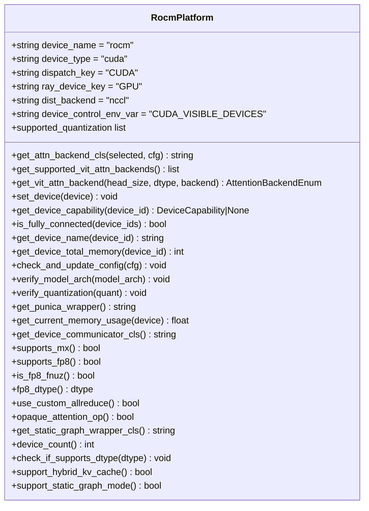

**Diagram sources**
- [platforms/rocm.py](file://vllm/platforms/rocm.py#L161-L562)

**Section sources**
- [platforms/rocm.py](file://vllm/platforms/rocm.py#L161-L562)

### TPU Platform
- Uses XLA/OpenXLA; sets compile backend to openxla.
- Enforces attention backend selection (Pallas) and disables unsupported features (e.g., sparse attention).
- Adjusts compilation modes and worker classes for TPU constraints.
- Provides platform-specific request validation.

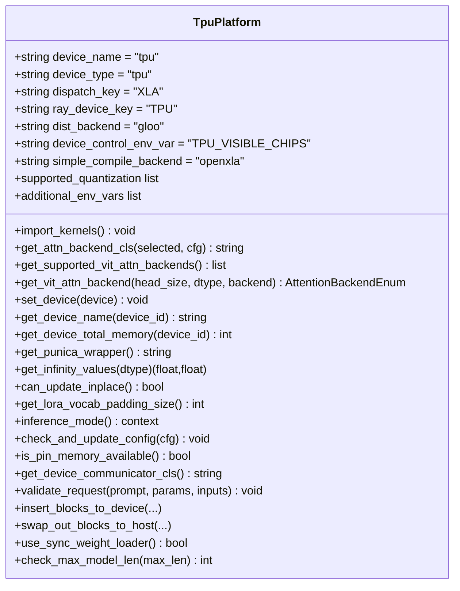

**Diagram sources**
- [platforms/tpu.py](file://vllm/platforms/tpu.py#L37-L296)

**Section sources**
- [platforms/tpu.py](file://vllm/platforms/tpu.py#L37-L296)

### XPU Platform
- Uses IPEX/XPU; selects attention backends and enforces KV cache layout.
- Sets distributed backend based on XCCL/CCL availability.
- Updates compilation and worker classes for XPU constraints.

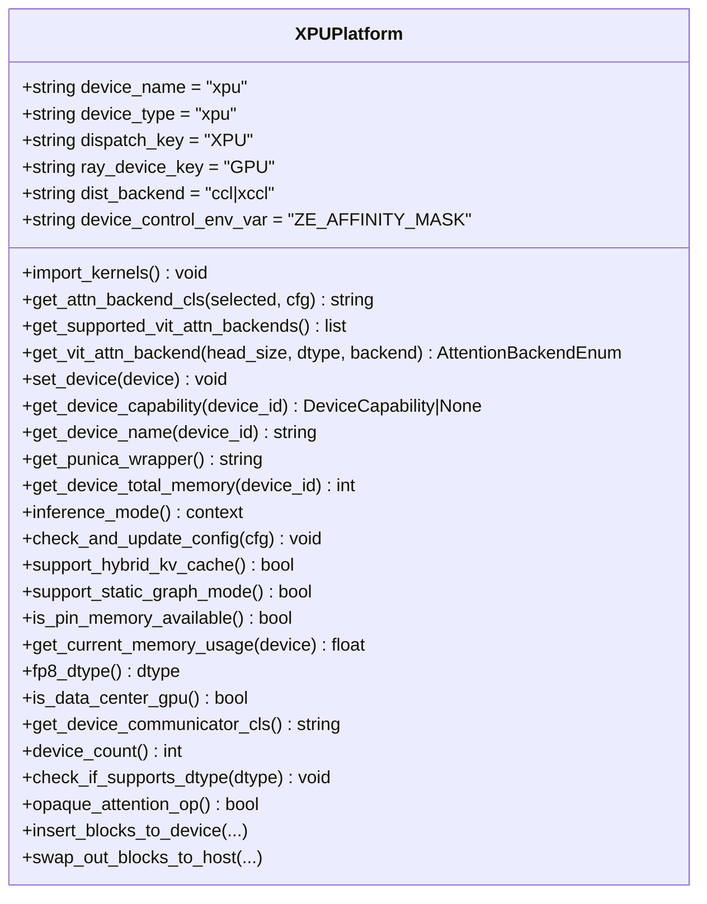

**Diagram sources**
- [platforms/xpu.py](file://vllm/platforms/xpu.py#L25-L281)

**Section sources**
- [platforms/xpu.py](file://vllm/platforms/xpu.py#L25-L281)

### CPU Platform
- Handles CPU-only environments and architecture-specific behaviors.
- Adjusts attention backends, block sizes, and distributed executors.
- Provides CPU-specific memory and threading environment tuning.

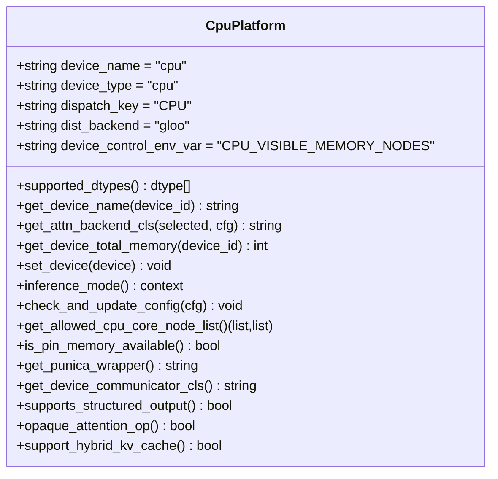

**Diagram sources**
- [platforms/cpu.py](file://vllm/platforms/cpu.py#L71-L422)

**Section sources**
- [platforms/cpu.py](file://vllm/platforms/cpu.py#L71-L422)

### Environment Variable Processing and Validation
- Centralized registry in envs.environment_variables:
  - Defines target device selection (VLLM_TARGET_DEVICE).
  - Provides typed converters and validators for environment variables.
  - Supports choice validation and list/set parsing helpers.
- Environment overrides in env_override.py:
  - Ensures consistent Torch/Inductor behavior across platforms.
  - Applies platform-specific environment adjustments.

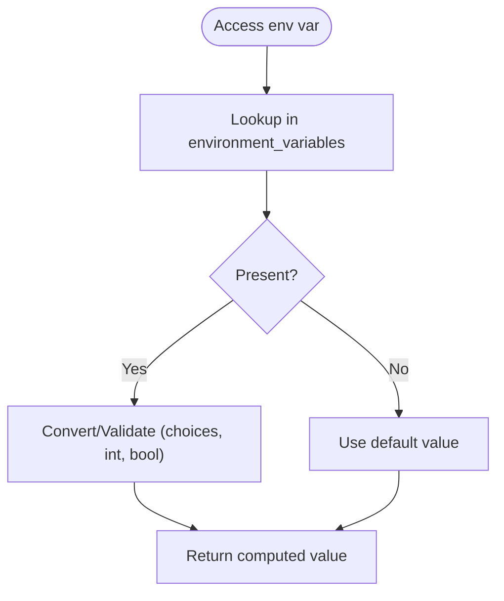

**Diagram sources**
- [envs.py](file://vllm/envs.py#L452-L520)
- [envs.py](file://vllm/envs.py#L298-L414)
- [env_override.py](file://vllm/env_override.py#L1-L379)

**Section sources**
- [envs.py](file://vllm/envs.py#L452-L520)
- [envs.py](file://vllm/envs.py#L298-L414)
- [env_override.py](file://vllm/env_override.py#L1-L379)

### Device Configuration Integration
- Device configuration auto-detection:
  - When device is "auto", the device type is inferred from current_platform.device_type.
  - Raises a clear error if platform detection fails and instructs enabling debug logging.
- Engine-side usage:
  - Engine queries platform for device memory and name to derive defaults.

**Section sources**
- [config/device.py](file://vllm/config/device.py#L38-L75)
- [engine/arg_utils.py](file://vllm/engine/arg_utils.py#L1800-L1811)

## Dependency Analysis
- Coupling:
  - platforms/__init__.py depends on environment variables and plugin groups to select a platform.
  - Platform subclasses depend on torch and platform-specific libraries (NVML, AMDSMI, IPEX).
  - Device configuration relies on current_platform for device type inference.
- Cohesion:
  - Each platform encapsulates its own capability queries, attention backends, and environment tuning.
- External dependencies:
  - NVML (CUDA), AMDSMI (ROCm), IPEX/XPU (Intel), libtpu (TPU), environment libraries.

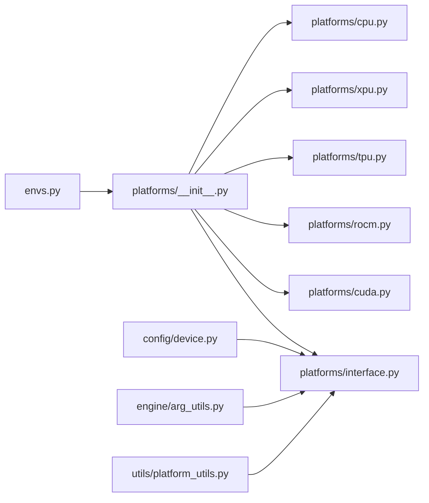

**Diagram sources**
- [platforms/__init__.py](file://vllm/platforms/__init__.py#L182-L238)
- [platforms/interface.py](file://vllm/platforms/interface.py#L100-L135)
- [envs.py](file://vllm/envs.py#L452-L520)
- [config/device.py](file://vllm/config/device.py#L38-L75)
- [engine/arg_utils.py](file://vllm/engine/arg_utils.py#L1800-L1811)
- [utils/platform_utils.py](file://vllm/utils/platform_utils.py#L1-L60)

**Section sources**
- [platforms/__init__.py](file://vllm/platforms/__init__.py#L182-L238)
- [platforms/interface.py](file://vllm/platforms/interface.py#L100-L135)
- [envs.py](file://vllm/envs.py#L452-L520)

## Performance Considerations
- Avoid unnecessary CUDA initialization:
  - NVML-based detection avoids initializing CUDA contexts.
- Static graph and compilation:
  - Platforms expose whether static graph mode is supported; engines can adjust accordingly.
- Attention backend selection:
  - Backends are prioritized by device capability and configuration; selecting appropriate backends improves performance.

[No sources needed since this section provides general guidance]

## Troubleshooting Guide
Common issues and resolutions:
- No platform detected:
  - Ensure only one platform plugin is active; multiple activations raise an error.
  - Confirm environment variables are set correctly (e.g., VLLM_TARGET_DEVICE).
- CUDA visibility mismatch:
  - NVML detection ignores CUDA_VISIBLE_DEVICES; ensure PCI order and device enumeration are consistent.
- ROCm quantization:
  - Some quantizations require explicit environment flags; platform may set them automatically.
- TPU compilation mode:
  - TPU requires specific compilation modes; platform enforces them.
- CPU backend limitations:
  - Certain features are disabled or adjusted for CPU; verify configuration updates.

Practical checks:
- Verify platform detection by inspecting current_platform attributes (device_type, device_name).
- Use environment variable validators to catch invalid values early.
- Inspect platform-specific environment variables and their effects.

**Section sources**
- [platforms/__init__.py](file://vllm/platforms/__init__.py#L210-L231)
- [platforms/rocm.py](file://vllm/platforms/rocm.py#L463-L471)
- [platforms/tpu.py](file://vllm/platforms/tpu.py#L133-L203)
- [platforms/cpu.py](file://vllm/platforms/cpu.py#L178-L268)

## Conclusion
vLLM’s platform detection and selection system is robust and extensible:
- It automatically chooses a single active platform using built-in and out-of-tree plugins.
- Environment variables drive selection and validation, ensuring correctness across diverse hardware.
- Platform abstractions encapsulate device capability queries, attention backends, and distributed behavior.
- Utilities and configuration integrate platform information into device selection and engine defaults.

[No sources needed since this section summarizes without analyzing specific files]

## Appendices

### Practical Examples

- Manual platform selection:
  - Set VLLM_TARGET_DEVICE to the desired platform (e.g., cuda, rocm, tpu, xpu, cpu).
  - Ensure only one platform plugin is active; otherwise, a runtime error is raised.

- Environment-based detection:
  - Built-in detection checks for platform-specific libraries and device presence.
  - For CUDA, NVML is used when available; otherwise PyTorch APIs are used.
  - For ROCm, AMDSMI is used to detect devices and topology.
  - For XPU, IPEX and XCCL/CCL availability determine platform activation.

- Platform capability verification:
  - Use current_platform.has_device_capability or get_device_capability to validate GPU compute capability.
  - Use current_platform.check_if_supports_dtype to validate dtype support for the platform.

- Runtime platform switching:
  - current_platform is lazily instantiated upon first access; changing environment variables before import influences selection.
  - For out-of-tree platforms, register a plugin in the designated plugin group; only one OOT plugin can be active.

**Section sources**
- [platforms/__init__.py](file://vllm/platforms/__init__.py#L191-L238)
- [platforms/cuda.py](file://vllm/platforms/cuda.py#L480-L619)
- [platforms/rocm.py](file://vllm/platforms/rocm.py#L161-L230)
- [platforms/xpu.py](file://vllm/platforms/xpu.py#L25-L120)
- [platforms/tpu.py](file://vllm/platforms/tpu.py#L37-L120)
- [platforms/cpu.py](file://vllm/platforms/cpu.py#L71-L120)
- [envs.py](file://vllm/envs.py#L452-L520)
- [config/device.py](file://vllm/config/device.py#L38-L75)